# 1. Getting Ready(JetArm User Manual)

## 1.1 JetArm Version Description

JetArm is a desktop-level AI vision robotic arm developed by Hiwonder for ROS educational environments, compatible with Jetson Nano, Jetson Orin Nano, and Jetson Orin NX as its main controller. It is equipped with a 3D depth camera that integrates 3D vision technology with robotic arm control, allowing for three-dimensional motion control as well as the identification, tracking, and grasping of target objects in three-dimensional space. Utilizing the GPU of the Jetson controller for training machine learning models, JetArm can perform object recognition and can be extended through Python programming to support a variety of AI creative projects, including gesture control and voice interaction.

The packing list of different versions are as below:

(1) Starter Packing Kit

| No.  | **Components**                                               | **Quantity** | **Picture**                                                  |
| ---- | ------------------------------------------------------------ | ------------ | ------------------------------------------------------------ |
| 1    | JetArm Standard version (assembled)                          | 1            | 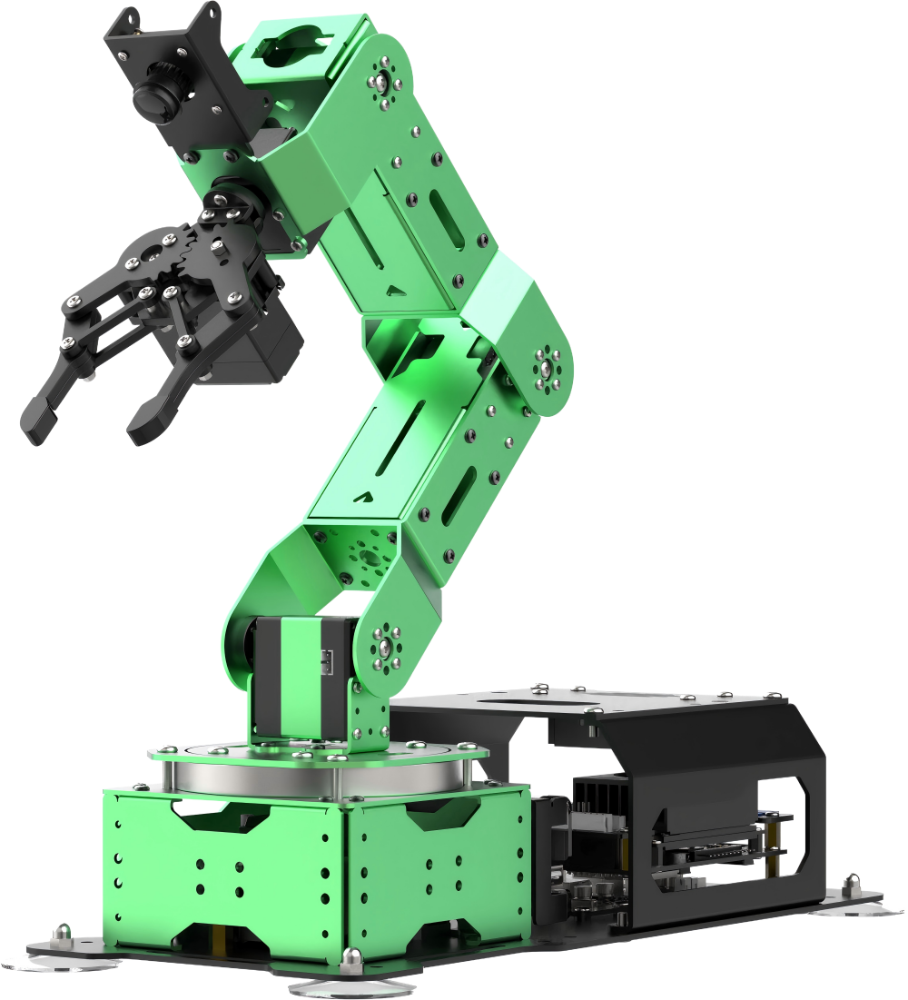 |
| 2    | 12V 5A Power Adapter                                         | 1            |   |
| 3    | Card Reader                                                  | 1            |   |
| 4    | Wireless handle                                              | 1            | 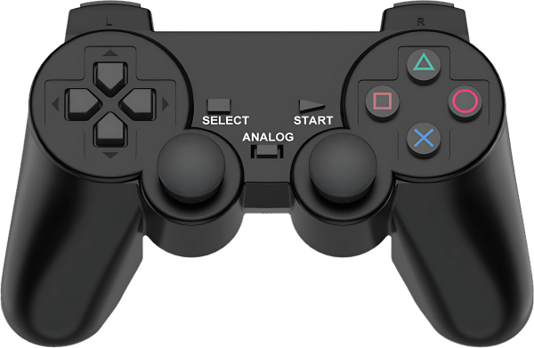  |
| 5    | Suction cups                                                 | 4            |   |
| 6    | Accessories <br>(bagscrewdriver * 1<br/>A2*5 Round head self-tapping screw * 8<br/>M2*5 Flat head cross machine screw * 8<br/>M3*6 Black round head screw * 8<br/>M4*6 Round head screw * 16<br/>100mm Steering gear line * 1<br/>200mm Steering gear line * 1) | 1            |   |
| 7    | Waste cards                                                  | 1            |   |
| 8    | Wooden blocks<br>(40mm wooden blocks * 4<br>30mm wooden blocks * 3) | 7            |   |
| 9    | Colored blocks                                               | 3            |   |
| 10   | 3*3 cm Tags                                                  | 3            |   |
| 11   | Double-sided tape                                            | 1            |   |
| 12   | Cuboid                                                       | 2            |   |
| 13   | Cylinder                                                     | 2            |   |
| 14   | Ball                                                         | 1            |   |
| 15   | Map                                                          | 1            |   |
| 16   | User manual                                                  | 1            |   |

(2) Standard Packing List

| No.  | **Components**                                               | **Quantity** | **Picture**                                                 |
| ---- | ------------------------------------------------------------ | ------------ | ----------------------------------------------------------- |
| 1    | JetArm Standard version (assembled)                          | 1            |  |
| 2    | 12V 5A Power Adapter                                         | 1            |  |
| 3    | Card Reader                                                  | 1            |  |
| 4    | Wireless handle                                              | 1            |  |
| 5    | Suction cups                                                 | 4            |  |
| 6    | Accessories <br>(bagscrewdriver * 1<br/>A2*5 Round head self-tapping screw * 8<br/>M2*5 Flat head cross machine screw * 8<br/>M3*6 Black round head screw * 8<br/>M4*6 Round head screw * 16<br/>100mm Steering gear line * 1<br/>200mm Steering gear line * 1) | 1            |  |
| 7    | Waste cards                                                  | 1            |  |
| 8    | Wooden blocks<br>(40mm wooden blocks * 4<br>30mm wooden blocks * 3) | 7            |  |
| 9    | Colored blocks                                               | 3            |  |
| 10   | 3*3 cm Tags                                                  | 3            |  |
| 11   | Double-sided tape                                            | 1            |  |
| 12   | Cuboid                                                       | 2            |  |
| 13   | Cylinder                                                     | 2            |  |
| 14   | Ball                                                         | 1            |  |
| 15   | Map                                                          | 1            |  |
| 16   | User manual                                                  | 1            |  |

(3) Advanced Packing Kit

| No.  | **Components**                                               | **Quantity** | **Picture**                                                 |
| ---- | ------------------------------------------------------------ | ------------ | ----------------------------------------------------------- |
| 1    | JetArm Standard version (assembled)                          | 1            |  |
| 2    | 12V 5A Power Adapter                                         | 1            |  |
| 3    | Card Reader                                                  | 1            |  |
| 4    | Wireless handle                                              | 1            |  |
| 5    | Suction cups                                                 | 4            |  |
| 6    | Accessories <br>(bagscrewdriver * 1<br/>A2*5 Round head self-tapping screw * 8<br/>M2*5 Flat head cross machine screw * 8<br/>M3*6 Black round head screw * 8<br/>M4*6 Round head screw * 16<br/>100mm Steering gear line * 1<br/>200mm Steering gear line * 1) | 1            |  |
| 7    | Waste cards                                                  | 1            |  |
| 8    | Wooden blocks<br>(40mm wooden blocks * 4<br>30mm wooden blocks * 3) | 7            |  |
| 9    | Colored blocks                                               | 3            |  |
| 10   | 3*3 cm Tags                                                  | 3            |  |
| 11   | Double-sided tape                                            | 1            |  |
| 12   | Cuboid                                                       | 2            |  |
| 13   | Cylinder                                                     | 2            |  |
| 14   | Ball                                                         | 1            |  |
| 15   | Map                                                          | 1            |  |
| 16   | User manual                                                  | 1            |  |
| 17   | 7-inch LCD screen                                            | 1            |  |
| 18   | HDMI cable + Data cable                                      | 2            |  |
| 19   | Screen bracket                                               | 1            |  |

(4) Ultimate Packing Kit

| No.  | **Components**                                               | **Quantity** | **Picture**                                                 |
| ---- | ------------------------------------------------------------ | ------------ | ----------------------------------------------------------- |
| 1    | JetArm Standard version (assembled)                          | 1            |  |
| 2    | 12V 5A Power Adapter                                         | 1            |  |
| 3    | Card Reader                                                  | 1            |  |
| 4    | Wireless handle                                              | 1            |  |
| 5    | Suction cups                                                 | 4            |  |
| 6    | Accessories <br>(bagscrewdriver * 1<br/>A2*5 Round head self-tapping screw * 8<br/>M2*5 Flat head cross machine screw * 8<br/>M3*6 Black round head screw * 8<br/>M4*6 Round head screw * 16<br/>100mm Steering gear line * 1<br/>200mm Steering gear line * 1) | 1            |  |
| 7    | Waste cards                                                  | 1            |  |
| 8    | Wooden blocks<br>(40mm wooden blocks * 4<br>30mm wooden blocks * 3) | 7            |  |
| 9    | Colored blocks                                               | 3            |  |
| 10   | 3*3 cm Tags                                                  | 3            |  |
| 11   | Double-sided tape                                            | 1            |  |
| 12   | Cuboid                                                       | 2            |  |
| 13   | Cylinder                                                     | 2            |  |
| 14   | Ball                                                         | 1            |  |
| 15   | Map                                                          | 1            |  |
| 16   | User manual                                                  | 1            |  |
| 17   | 7-inch LCD screen                                            | 1            |  |
| 18   | HDMI cable + Data cable                                      | 2            |  |
| 19   | Screen bracket                                               | 1            |  |
| 20   | Circular 6-Microphone Array                                  | 1            |  |


## 1.2 Hardware Installation and Guidelines

### 1.2.1 Controller Installation (Applicable Only to Kits Without Jetson Controller)

* **Jetson Nano Controller**

(1) Remove the two M2.5\*4 screws and detach the controller.


(2) Assemble the network card and the external antenna.


(3) Secure the controller using two flat-head M2.5\*4 screws.


(4) Fix four M2.5\*18+6 single-pass standoffs and four M2.5\*12 double-pass standoffs.


(5) Use four M2.5\*6 screws to secure the antenna and the expansion board.


(6) Install the assembled controller kit onto the corresponding four M2.5 screw holes on the robot arm baseplate using four M2.5\*6 round-head screws.


* **Jetson Orin Nano/Jetson Orin NX Controller**

(1) Install the provided blue antenna in the original antenna slot, insert the SSD into the card slot, and secure it with the black M3\*3 screw.


(2) Fix four M2.5\*18+6 single-pass standoffs and four M2.5\*12 double-pass standoffs. Use four M2.5\*6 round-head screws to secure the other two M2.5\*12 double-pass standoffs.


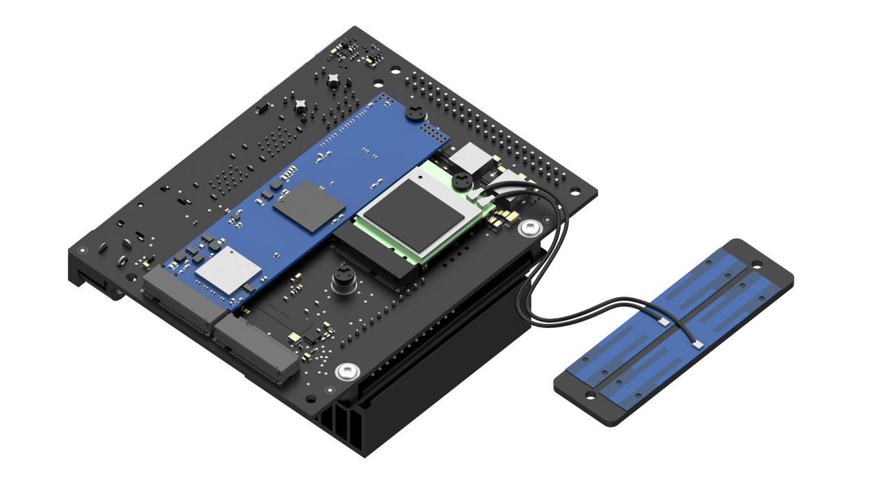

(3) Use four M2.5\*6 round-head screws to secure the antenna and expansion board.


(4) Install the assembled controller kit onto the corresponding four M2.5 screw holes on the mechanical arm baseplate using four M2.5\*6 round-head screws.


### 1.2.2 Wiring Instructions

* **Jetson Nano Controller Wiring Instructions**

The image below shows the interface numbers for each module connected to the Jetson Nano controller for the ultimate version. Please refer to the table below for standard wiring instructions. (If the purchased package does not include the relevant modules, you may skip this interface.)


<table  class="docutils-nobg" style="margin:0 auto" border="1">
  <tr>
    <th colspan="2" style="text-align: center;">Jetson Nano & USB HUB</th>
  </tr>
  <tr>
    <td style="text-align: center;">1</td>
    <td style="text-align: center;">Depth/ monocular camera</td>
  </tr>
  <tr>
    <td style="text-align: center;">2</td>
    <td style="text-align: center;">STM32 communication</td>
  </tr>
  <tr>
    <td style="text-align: center;">3</td>
    <td style="text-align: center;">USB HUB communication</td>
  </tr>
  <tr>
    <td style="text-align: center;">4</td>
    <td style="text-align: center;">Custom expansion interface</td>
  </tr>
  <tr>
    <td style="text-align: center;">5</td>
    <td style="text-align: center;">Screen HDMI</td>
  </tr>
  <tr>
    <td style="text-align: center;">6</td>
    <td style="text-align: center;">Jetson Nano power supply</td>
  </tr>
  <tr>
    <td style="text-align: center;">7</td>
    <td style="text-align: center;">Sound card</td>
  </tr>
  <tr>
    <td style="text-align: center;">8</td>
    <td style="text-align: center;">Microphone</td>
  </tr>
  <tr>
    <td style="text-align: center;">9</td>
    <td style="text-align: center;">Screen power supply</td>
  </tr>
  <tr>
    <td style="text-align: center;">10</td>
    <td style="text-align: center;">Handle receiver</td>
  </tr>
</table>


* **Jetson Orin Nano/Jetson Orin NX Controller Wiring Instructions**

The image below shows the interfaces for each module connected to the Jetson Orin Nano/Jetson Orin NX controller, as well as the USB hub interface. Please refer to the table below for standard wiring instructions. (If the purchased package does not include the relevant modules, you may skip this interface.)


<table  class="docutils-nobg" style="margin:0 auto" border="1">
  <tr>
    <th colspan="4"  style="text-align: center;">Orin Nano/Orin NX &amp; USB HUB</th>
  </tr>
  <tr>
    <td>1</td>
    <td>Depth/ monocular camera</td>
    <td>6</td>
    <td>Orin Nano/Orin NX adapter power supply</td>
  </tr>
  <tr>
    <td>2</td>
    <td>STM32 communication</td>
    <td>7</td>
    <td>Sound card</td>
  </tr>
  <tr>
    <td>3</td>
    <td>USB HUB communication</td>
    <td>8</td>
    <td>Microphone</td>
  </tr>
  <tr>
    <td>4</td>
    <td>Custom expansion interface</td>
    <td>9</td>
    <td>Screen power supply</td>
  </tr>
  <tr>
    <td>5</td>
    <td>Screen HDMI</td>
    <td>10</td>
    <td>Handle receiver</td>
  </tr>
</table>


### 1.2.3 Screen Installation

(1) Attach the 7-inch LCD screen to the screen bracket with M4\*6 machine screws.


(2) Fix the screen bracket on the bottom with M4\*6 screws.


(3) Connect HDMI cable to HDMI interface on the 7-inch screen, and connect USB cable to CTOUCH port.

:::{Note}

7-inch LCD screen does not support touch function if the cable is not connected to CTOUCH port.

:::


### 1.2.4 Adapter Connection

* **Jetson Nano Controller**

Connect 12V 5A adapter to the power interface on the driver, as shown in the image below:


* **Jetson Orin Nano & Jetson Orin NX Controller**

:::{Note}

The Jetson Orin Nano and Jetson Orin NX controller versions require two adapters to be connected!

:::

(1) Connect 19V 2.37A adapter to the power interface on the driver, as shown in the image below:


(2) Connect the 12V 5A power adapter to the power interface of the controller as pictured.


## 1.3 Initial Startup Instructions

In this section, we will learn about the robot's power-on status and the functionality checks for each module. After this, you can proceed to the subsequent chapters to learn about controlling the robot using a mobile app and a game controller.

If you need to connect remote tools to the robot for further exploration of its features and to view the programming, please refer to the content under the section [1.6 Development Environment Setup and Configuration]().

### 1.3.1 Note

The Jetson Orin Nano and Jetson Orin NX boards use a dual power supply system. Please strictly follow the steps below:

(1) Firstly, connect the 19V/2.37A power adapter to the main board.


(2) Then, connect the 12V/5A power adapter to the STM32 control board.

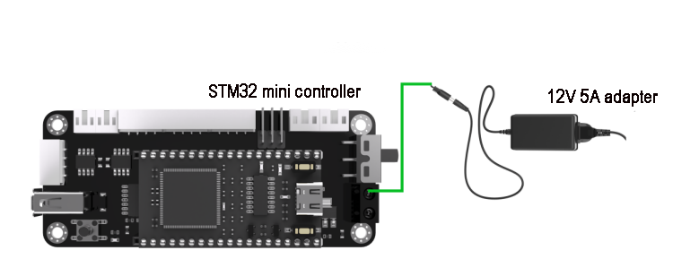

Following this order ensures that all hardware components of the robotic arm operate correctly.

(1) Do not position the robot near the edge of a high surface to prevent it from falling and causing damage.

(2) Whenever possible, place the robot on a flat surface during operation.

(3) Avoid stacking the robotic arm to prevent it from stalling when powered on, which could damage the servos.

<table  class="docutils-nobg" style="margin:0 auto" border="1">
    <tbody>
    <tr>
        <td></td>
        <td></td>
    </tr>
    <tr>
        <td></td>
        <td></td>
    </tr>
    </tbody>
</table>

(4) Do not keep the robotic arm under heavy load for extended periods, as this may shorten the lifespan of the servos or cause direct damage.

(5) Maintain a safe distance from the robot before starting it to avoid any injury from accidental contact once it is powered on.

(6) Before conducting any checks, ensure that the wiring is correct, the controller receiver is properly connected, the sound is enabled in the top right corner of the desktop, and the robot is fully charged.

### 1.3.2 Power-On Status Description 

(1) Turn ON the switch on driver.


(2) After 25 to 35 seconds, the blue LED light on the expansion board (LED1) will illuminate and continue to blink. At this point, only the network configuration service is active, while the ROS system and other services have not yet fully started. Wait for a short beep from the buzzer, indicating that the ROS configuration is complete and the device has fully started.

The LED lights for the **Jetson Nano, Jetson Orin Nano, and Jetson Orin NX** versions are located as shown below:

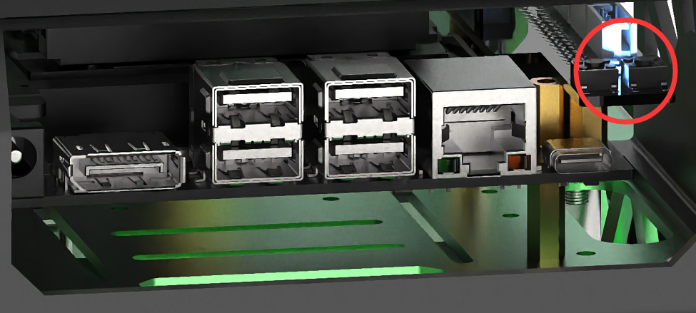

(1) Robot is in AP direct connection mode by default. After the robot is powered up, it will generate a WIFI starting with “HW” with an initial password of “**hiwonder**” for app connection and remote desktop system connection.


:::{Note}

If you cannot find the device hotspot after powering on, please follow these troubleshooting steps:

* Check according to the instructions in section “[1.3.2 Power-On Status Description]()”.

* If the LED1 on the expansion board is a steady blue light, it may be set to local area network mode. Long press the key1 button on the expansion board for 5 to 10 seconds. If LED1 starts blinking, a Wi-Fi network starting with HW will be generated.

* If LED1 does not blink after long pressing key1, it may indicate that the SD card or SSD is not detected. Please try reinserting the SD card or SSD.

* If the LED remains steady after reinserting, there may be an issue with the SD card or SSD, or users who purchased a package without a controller may not have burned the image. It is recommended to replace the SD card or SSD or re-burn the image.

* If you still cannot power on after replacing the SD card or SSD and re-burning the image, there may be an issue with the Jetson mainboard. Please contact customer service for further assistance.

:::

(2) Users who purchased the advanced or ultimate version will see the system startup desktop displayed on the 7-inch LCD screen after installation. Ultimate version users will also hear the notification 'Ready' (as illustrated in the image below, using the Jetson Nano controller as an example).


You can refer to the following table to test hardware:

<table  class="docutils-nobg" style="margin:0 auto" border="1">
<colgroup>
<col  />
<col  />
<col  />
</colgroup>
<tbody>
<tr>
<td ><strong>Module</strong></td>
<td ><strong>Test Operation</strong></td>
<td ><strong>Outcome</strong></td>
</tr>
<tr>
<td >Expansion board LED</td>
<td >Observe the status of the LED lights, including when they are lit and blinking</td>
<td >The factory default is AP (Access Point) mode, indicated by a blinking blue LED, which means the network service configuration is complete.</td>
</tr>
<tr>
<td >Buzzer</td>
<td >Short beep test</td>
<td >A short beep from the buzzer indicates that the onboard hardware of the expansion board is functioning correctly</td>
</tr>
<tr>
<td >7-inch LCD touch screen</td>
<td ><p>Tap the icons on the system desktop to confirm:</p>
<p>(1) The HDMI cable is properly connected to the screen；</p>
<p>(2) The power cable is connected to the screen's C-TOUCH interface.</p></td>
<td >The desktop should display normally, and the screen should respond to touch.</td>
</tr>
<tr>
<td >KEY1 on the expansion board</td>
<td >Switch network status</td>
<td >After connecting to the STA local area network mode via the mobile app, press and hold the KEY1 button to check if the LED1 indicator blinks.</td>
</tr>
<tr>
<td >Microphone, sound card and speaker</td>
<td >After powering on, say 'Hello Hiwonder' to the robot</td>
<td >The robot responds to the wake-up command with an audio feedback from the speaker saying 'I’m here' (applicable for users who purchased the ultimate kit).</td>
</tr>
<tr>
<td >Depth camera + robot arm</td>
<td > 
<p>(1) Open the mobile app and connect to the robot；</p>
<p>(2) Activate the 'Remote Control' function to view the live camera feed from the depth camera；</p>
<p>(3) Swipe on the screen to control the pan-tilt servos for rotation；</p>
<p>(4) Access the robot arm control buttons and sequentially drag each joint servo</p>
</ol></td>
<td >The live camera feed appears and the servos can rotate</td>
</tr>
<tr>
<td >STM32 controller+DC encoder geared motor</td>
<td >After powering on, please use the wireless controller or the mobile app's 'Robot Control' feature to operate the robot</td>
<td >The robot arm can move normally</td>
</tr>
</tbody>
</table>

## 1.4 App Control

Users can control robot using app **“WonderAi”**. Following will specify the operations.

Users can control the robot and explore AI vision features using the mobile app **'WonderAi.'** This section will detail the operation methods for each function within the app. Please note that the demonstration will use the iOS system as an example, but the methods are also applicable to the Android system.

Friendly Reminder: If you purchased a package without a controller, please refer to the course [1.6 Development Environment Setup and Configuration]() and complete the [1.6.7 Robot Version Configuration Tool Guide]() lesson before proceeding.

### 1.4.1 App Installation

:::{Note}

* Please ensure all app permissions are enables, otherwise app functions will be limited.

* Before opening app, it is necessary to enable GPS and WIFI functionalities on phone settings.

:::

(1) Android system: [WonderAi]()

(2) iOS system: search and install [WonderAi]() in App Store.


### 1.4.2 Connection Mode Introduction

There are two network modes, including AP direct connection mode and STA LAN mode.

(1) AP direct connection mode: The controller generates a WiFi which can be connected by phones. This WiFi has no internet access.

(2) STA LAN mode: The controller actively connects to specific WiFi. You can access Internet in this mode.

The robot powers on in AP connection mode by default. Regardless of whether users choose AP mode or STA local network mode, the robot's functionalities remain the same.

:::{Note}

We recommend that users first learn the configuration method for the direct connection mode to experience its features. The local network mode can be selected based on individual needs.

:::

* **Direct Connection (Must Read)**

The version of the iOS system should be iOS 11.0 or higher, while Android devices require version 5.0 or higher.

For Android users, please ensure that app permissions are granted; otherwise, the app's functions will be limited!

Take JetArm advanced kit as example using Android system for demonstration. The operations are applicable to the iOS system and other robot kits.

(1) Open “**WonderAi**” APP, then tap “**Advanced-\>JetArm**” in sequence.


(2) Click “**+**” button, and select “**Direct Connection Mode**”.


(3) Next, click “**Go to connect device hotspots**” to join the WiFi generated by JetArm.


(4) The device WiFi starts with “**HW**” and the password is “**hiwonder**”.


:::{Note}

For iOS user, please do not return back to the app until the WiFi icon  appears above, otherwise JetArm cannot be searched. If JetArm cannot be searched, please click  to refresh.

:::

(5) Return to the app, and click the robotic icon to enter home interface.


If you are informed of **“No Internet Connection. Whether to keep connection”**, just select **“Keep Connection”**.

(6) When the following window pops up, it means that you have selected the wrong version. Click “**Confirm**”, then the app will automatically switch to the home interface of the right version.


(7) The home interface of the ultimate kit is as pictured.


* **LAN Mode Connection（Optional）**

(1) Firstly, join 5G network, for example **“Hiwonder_5G”**. (The router supporting dual-frequency will distinguish the Wi-Fi name by default under the situation that 2.4 G and 5G are separated. For example, Wi-Fi “Hiwonder” is 2.4 frequency band while **“Hiwonder_5G”** is 5G frequency band)


(2) After connection, open WonderAi. Then click “**Advanced-\>JetArm**” in sequence. (Take JetArm advanced kit for example)


(3) Click **“+”** button at the lower right corner, then select LAN Mode.


(4) Continue, enter the Wi-Fi password. Having entered the password, click “**OK**”. Please ensure the password you enter is correct.


(5) Click “**Go to connect device hotspots**”. 

(6) Join the WiFi starting with HW, and input the password “**hiwonder**”. After connection, return back to the app interface.


(7) Then, WonderAi app is connecting to the robot.


(8) After a while, the robotic icon will show up. And at the same time, LED1 on the Jetson Nano mini expansion board will light up.


(9) By long pressing the robotic icon, you can check the IP address and ID.


(10) Input this IP address in the search bar on remote desktop software. Then you can enter the robot system desktop. For the operation method, please refer to the following content [1.6 Development Environment Setup and Configuration]().

(11) If you want to switch back to Direct Connect Mode, press KEY1 button on the expansion board until blue LED flashes, which means the current mode is Direct Connect Mode.

### 1.4.3 App Description

<span class="mark">There are 8 robot games available on the app, including position calibration, robot control, object sorting, gesture control, target tracking, line following and AR.</span>


The table below offers a detailed overview of each game.

|                           **Icon**                           |       **Name**       |                         **Feature**                          |
| :----------------------------------------------------------: | :------------------: | :----------------------------------------------------------: |
|  | Position Calibration | Acquire the distance between the block and the end effector of the robot arm. |
|  |    Robot Control     |           Control the robot movement in real time            |
| 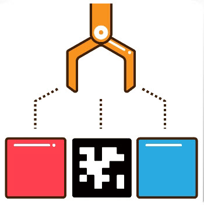 |    Object sorting    | Select the color ID and tag ID in the app. The robot arm will pick up the block with the specified color and tag ID and place it in the corresponding sorting area. |
|  |   Gesture control    | Once the feature is activated, the camera will tilt upward and execute the corresponding action when a gesture is detected (specific feedback can be viewed by clicking 'Operation Instructions' on the control area). |
|  |   Target Tracking    | Select the color or face to track, and the robotic arm will move accordingly to follow the target |
|  |    Waste Sorting     | Garbage blocks within the detection area will be picked up and placed into the corresponding waste category |
|  | Intelligent Stacking | Labeled wooden blocks in the detection area will be stacked in the designated position |
|  | Depth Object Sorting | Small balls, rectangular blocks, and cylinders in the detection area will be placed in their corresponding locations |

### 1.4.4 Map Introduction and Device Placement

For a better experience, we need to have a basic understanding of the map. This section will introduce the placement of device and the distribution of map.

Firstly, lay the map flat on the table, and then position the robotic arm within the area as shown in the left illustration below. The front end of the base should align with the front boundary of the robotic arm placement area, and the suction cups should be firmly against the table, as depicted in the illustration on the right below.

 

The map is composed of four sections:

① Robotic arm placement area 

② Waste sorting area 

③ Vision recognition area 

④ Color and tag sorting area 

⑤ X-axis and Y-axis coordinates of the robotic arm


* **Robotic arm placement area**


When placing the robotic arm, the front end of its base should align with the front boundary of the robotic arm placement area, and the suction cups should be firmly against the table, as depicted in the picture below.


* **Waste sorting area**

The robotic arm will transport the blocks or cards from the recognition area to their respective placement area.


The functions of above areas are as follow.

| Icon                                                         | Function                            |
| ------------------------------------------------------------ | ----------------------------------- |
|  | Stacking area                       |
|  | Residual waste cards placing area   |
| 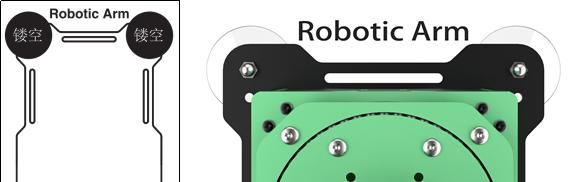 | Food waste cards placing area       |
|  | Hazardous waste cards placing area  |
|  | Recyclable waste cards placing area |

* **Vision Recognition Area**

In robotic arm vision recognition area, the central label servers as a reference point during the position calibration of robot arm (for details on position calibration, please refer to “5.5 Position Calibration”). Place the blocks with garbage card or color blocks to be recognized within this area.


:::{Note}

when placing the blocks, do not locate them at the edges of the vision recognition area to prevent recognition failure .

:::

* **Color and tag sorting area**

The robotic arm will transport the blocks from the recognition area to their respective placement area.


The functions of above areas are as follow.

| **Icon**                                                     | **Function**                            |
| ------------------------------------------------------------ | --------------------------------------- |
|  | Red block placing area                  |
|  | Green block placing area                |
|  | Blue block placing area                 |
|  | Tag ID3 block placing area              |
|  | Stacking and tag ID2 block placing area |
|  | Tag ID1 block placing area              |

* **X-axis and Y-axis coordinates of robotic arm**

After the robotic arm is placed on the map, you can refer to this coordinate axis to confirm the positive directions of X-axis and Y-axis of the robotic arm.


### 1.4.5 Position Calibration


(1) When using the app for the first time, the live camera feed may take a few seconds to appear. If there is no live camera feed for a long time, return to the mode selection page and re-enter. Once the live camera appears, tap “**position calibration**”.


(2) Please be patient. Calibration needs to take a while to complete. Upon observing the alignment of 5 block dots overlap with the 5 colored dots on AprilTag, the calibration is finished.


### 1.4.6 Robot Control

All servos on robotic arm can be controlled through this game.

:::{Note}

* Keep your body away from the robotic arm to prevent injury.

* When robotic arm reach its limit position, please control it in the opposite direction.

:::

(1) Click  to enter the game interface, then robotic arm returns to an straight posture.

(2) The interface of “Robot Control” consists of two parts. The left side of the interface is the live camera feed. The right side is the robotic arm control area.

(3) Tap-on  to enable the robot arm to restore its initial position.


### 1.4.7 Object Sorting

:::{Note}

* Please start this game in a well-lit environment.

* Keep a certain distance between the blocks. Do not make them too close to each other.

* Maintain the integrity of the tag as the missing corners or stains may effect the recognition result.

:::

Click to enter the game interface. The interface consists of two parts.

(1) On the left side, you can start the game and select the target color and tag.

(2) The right side is the live camera feed.


|                           **Icon**                           |           **Instruction**            |
| :----------------------------------------------------------: | :----------------------------------: |
|  |       Activate/Deactivate game       |
|  | Select the color and tag for sorting |

### 1.4.8 Gesture Control

:::{Note}

* The robot can only recognize one hand at a time.

* The time interval for each gesture recognition is 5 seconds.

:::

Click to enter the game interface. The interface is consists of two parts.

(1) On the left side, you can start the game.

(2) The right side is the live camera feed.


After activating the game, the robotic arm will be in a forward-facing horizontal position. When a hand gesture is detected, the arm will perform the corresponding feedback action.

- **Static Gesture Recognition**

Recognizable static gestures and its corresponding actions are as follow.

| **Static Gesture** |                         **Example**                          |                          **Action**                          |
| :----------------: | :----------------------------------------------------------: | :----------------------------------------------------------: |
| Hand heart gesture |  | The pan-tilt turns right, and the robotic gripper rotates to the right. The pan-tilt turns left, the robotic gripper rotates to the right. |
|         OK         |  |            The gripper will open and close twice.            |
|   Clenching fist   |  |  The gripper will close and the robot arm stretch forward.   |
|   “Gun” gesture    |  | The gripper will open and close twice, then turn right and open and close twice again. |
|         1          |  |     Pick up the block and place it to the tag 1 position     |
|         2          |  |     Pick up the block and place it to the tag 2 position     |
|         3          |  |     Pick up the block and place it to the tag 3 position     |
|         4          |  | Pick up the block and place it in front of the robot arm, to the left. |
|         5          |  | The robotic gripper opens, and the pan-tilt turns left and right. |
|         6          |  | The robotic arm will align the items in a straight line, and the gripper will open and close twice |

### 1.4.9 Target Tracking

:::{Note}

* Please start this game in a well-lit environment. After the game starts, please remove other objects in target color from the field of view of the camera, otherwise the game will be influenced.

* The target must always locate within camera’s view, and move it in an appropriate speed.

  :::

Click to enter the game interface. The interface is consists of two parts.

(1) On the left side, you can start the game and select the target color.

(2) The right side is the live camera feed.


### 1.4.10 Intelligent Stacking

:::{Note}

* Please perform this operation in a well-lit indoor environment.

* Maintain a proper distance between the blocks; do not place them too close together.

* If the gripping is not accurate, click the position calibration button to adjust.

  :::

* **Interface Layout**

Click  to enter the game interface. The interface is divided into two parts:

(1) Left side: game control switch

(2) Right side: live camera feed


### 1.4.11 Depth Object Sorting

This mode allows for stacking labeled blocks (note: the monocular camera does not support this feature).

:::{Note}

* Please perform this operation in a well-lit indoor environment.

* Place the items in the center to ensure more accurate gripping.

* If gripping is not accurate, click the position calibration button to adjust.

:::

* **Interface Layout**

Click  to enter the game interface, and the interface is divided into two sections:

(1) Left side: game control switch

(2) Right side: live camera feed


### 1.4.12 Waste Sorting 

:::{Note}

* Please start this game in a well-lit environment.
* For accurate gripping, keeping the block with waste card parallel to the lines of the gripping area.
* If the gripping is inaccurate, you can tap the position calibration button to perform calibration.

:::

Click to enter the game interface. The interface is consists of two parts.

(1) On the left side, you can start the game.

(2) The right side is the live camera feed.


## 1.5 Color Threshold Setting

When we playing the AI vision games, the environment light will affect the JetArm’s performance. And we can adjust the color threshold to cope with this. Take Android system as example for demonstration. It is also applicable to iOS system.

(1) Start JetArm and connect it to “**WonderAi**”. (For the operation instruction, please refer to [1.3 Initial Startup Instructions]()” and [1.4 App Control]().)


(2) Enter the main interface, then click “” at the upper right corner to enter the interface of color threshold setting.

(3) Take adjusting red color for example. Place the red block within the recognition area on the map, then select the red icon.


(4) Click “**Instruction**” button to check the color adjustment instruction.


(5) Set the parameters of **L_min, a_min and b_min** as 0, and the parameters of **L_max, a_max and b_max** as 255.


(6) Refer to LAB color space distribution to adjust the L, A and B components.


(7) According to the Lab color model diagram, red color is around “**+a**” zone, so we need to adjust the color threshold to “**+a**” zone. Keep the values of “L**\_max**” unchanged, while increase the values of “L**\_min**” until the block image in the screen turns white and other area turns black.


(8) Then based on the environment, adjust the value of **L_min, L_max, b_min and b_max.** If the color belongs to light red, you need to increase the value of “**L_min**”. If it belongs to dark red, decrease the value of “**L_max**”. If it belongs to dark red, decrease the value of “**L_max**”. If it belongs to warm tone, increase the value of “**b_min**”. If it belongs to cool tone, decrease the value of “**b_max**”


(9) After the adjustment is completed, tap the **“Save”** button to save the color threshold.


## 1.6 Development Environment Setup and Configuration

### 1.6.1 Remote Control Tool Introduction and Installation

NoMachine is a graphical remote control software. Once installed, you can connect to the robot's hotspot and control it directly from your computer. The Jetson Nano, Jetson Orin Nano, and Jetson Orin NX main controllers all use NoMachine for connectivity. With this software, users can clearly see the robot's system desktop, making it easier for intuitive operation.

In contrast, MobaXterm is designed for SSH connections and focuses more on command line control. It does not display the complete desktop of the robot’s system; instead, it provides only a command line window. For users who are proficient with command line operations, this allows for faster control of the robot while reducing computational load and memory usage.

MobaXterm includes a lightweight X11 server that can directly display the interfaces of graphical applications. It is compatible with any main controller you are using.

In summary, NoMachine is suitable for scenarios that require intuitive operation, while MobaXterm is better for quickly executing commands. Choose the appropriate software for remote control based on your specific needs.

Before you start, if you are using a desktop computer, please ensure that you have a wireless network card that supports the 5GHz frequency band.

The installation operations are as follow:

* **NoMachine Installation**

(1) Open the software pack “[nomachine_8.4.2_10_x64.exe]() ” in the “[Appendix-\>Remote Control PC Software]()” folder.

(2) Click “**Next**” button.


(3) Set the language as “**English**” and tick “**I accept the agreement**”. Then move to “**Next**” step.


(4) Remain the default storage path for NoMachine, then click “**Next**”.


(5) Please wait until the installation completes. Click “**Finish**” button.


(6) Click “**Yes**” to restart the computer. Please don’t skip this step!


* **MobaXterm Installation**

(1) Locate the “**MobaXterm_Installer_v22.1**” file in “[Appendix-\>Remote Control PC Software]()”, and double-click the file “MobaXterm_installer_22.1.msi” to install it.


Follow the below pictures to finish the installation.


### 1.6.2 AP Direct Connection Mode

AP Direct Connection Mode: The controller can create a hotspot that can be connected to by a mobile phone (but cannot access external networks)

* **Connection Through NoMachine**

(1) Connect your computer to the WiFi starting with ‘**HW**’.


(2) Open NoMachine. Input “**192.168.149.1**” in the search bar, then click-on “**Configure connection to new host 192.168.149.1**”.


(3) Change the name to “**JetArm**”, then click-on “**Add**” button.


(4) Double-click ‘**JetArm**’.


(5) The Username and Password fields need to be filled in according to the main controller version:

For the **Jetson Nano** main controller, the initial configuration username is: hiwonder, and the password is: hiwonder.

For the **Jetson Orin Nano** main controller, the initial configuration username is: ubuntu, and the password is: ubuntu.

For the **Jetson Orin NX** main controller, the initial configuration username is: ubuntu, and the password is: ubuntu.

After filling in the fields, check the 'Save this password' box and click the 'Login' button. The following image illustrates the Jetson Nano version as an example:


(6) Tick the below box and click “**OK**”. (If you do not tick this option, the pop-up window will occur next time.)


:::{Note}

After starting up and connecting for the first time, the resolution may be abnormal. You can navigate to the section ‘Desktop Resolution Settings’.

:::

* **Connection Through MobaXterm**

This example demonstrates the method for Direct Connection Mode. The same steps can be followed in Local Area Network Mode, simply by changing the IP address.

(1) Open MobaXterm. Click-on ”**Session**” at the upper right corner to create a new session. Enter the IP “**192.168.149.1**”, and click-on **OK**.


(2) Select “**SSH**”.


(3) Enter the fixed IP address under the Direct Connection Mode: **192.168.149.1**


(4) If the following pop-up appears, please select the third option.


(5) The interface prompts you to enter the username (login as) and password (password), which should be filled in according to the main controller version below. The following image illustrates the Jetson Nano version as an example:

For the **Jetson Nano** main controller, the initial configuration username is: **hiwonder**, and the password is: **hiwonder**.

For the **Jetson Orin Nano** main controller, the initial configuration username is: **ubuntu**, and the password is: **ubuntu**.

For the **Jetson Orin NX** main controller, the initial configuration username is: **ubuntu**, and the password is: **ubuntu**.


:::{Note}

* The username must be in lowercase. Even if the username contains uppercase letters during the setup, it should be entered in lowercase when logging in.

* The username will be displayed visually. After entering it, you must press Enter before inputting the password.

* The password will not be displayed visually. Similarly, after entering the password, you must press Enter to log in.

:::

(6) When you log in successfully to the system, the interface will appear as shown in the image.


### 1.6.3 LAN Mode Connection

STA Local Area Network Mode: The development board can actively connect to a specified hotspot/Wi-Fi (and access external networks).

Please note the following in this section:

(1) If you are unsure how the robot connects to the STA local area network and obtains an IP address, we recommend connecting via the mobile app. You can click on **“Connect in Local Area Network Mode (Optional)”** for guidance.

(2) The system image has undergone special configuration for Wi-Fi, so the Wi-Fi option cannot be directly selected from the menu bar, as shown in the image below. This does not affect the normal operation of the robot. Users with specific requirements can refer to “How to Restore the Wi-Fi Option in the Menu Bar” for relevant settings.

(3) In this tutorial, we will use the **“Hiwonder_5G”** Wi-Fi as an example. Users should refer to the Wi-Fi they have set up for the local area network connection.

* **Connection Through NoMachine**

(1) In LAN mode, search for and connect to the Wi-Fi you have set up on your computer, as shown in the image below.


(2) Open NoMachine and enter the IP address "**192.168.11.244**" in the search bar on the software interface. Click “**Configure connection to new host 192.168.11.244.**”

:::{Note}

If you are unsure of the IP address, click on “LAN Mode Connection (View Options)” to check it.

:::


(3) Once opened, modify the Name field to “**Robot**” while keeping the other options unchanged, then click “Add.”


(4) For the Username and Password fields, please fill in the information based on the control version you are using:

For **Jetson Nano**, the initial configuration username is: **hiwonder**; password: **hiwonder**

For **Jetson Orin Nano**, the initial configuration username is: **ubuntu**; password: **ubuntu**

For **Jetson Orin NX**, the initial configuration username is: **ubuntu**; password: **ubuntu**

After filling in the details and checking the “Remember Password” box, click the “Login” button.


(5) The image below illustrates the Jetson Nano version as an example:


* **Connection via MobaXterm**

(1) On the main interface, click “**Session**” in the upper right corner to create a new session. In the session interface, enter the recorded IP address of the robot, “**192.168.11.244**,” and click “**OK**.”


(2) Select SSH.


(3) Enter the IP address found in LAN mode: 192.168.11.244.


(4) If the interface appears as shown below, click the third option.


(5) The interface will prompt you to enter the username (login as) and password (password). Please fill in the information based on the control version you are using. The image below illustrates the Jetson Nano version as an example:

For **Jetson Nano**, the initial configuration username is: **hiwonder**; password: **hiwonder**

For **Jetson Orin Nano**, the initial configuration username is: **ubuntu**; password: **ubuntu**

For **Jetson Orin NX**, the initial configuration username is: **ubuntu**; password: **ubuntu**


:::{Note}

* The username must be in lowercase. Even if the username includes uppercase letters, it must be entered in lowercase during login.

* The username will be visually displayed. After entering it, press Enter to proceed to the password input.

* Password input will not be visually displayed. Similarly, after entering the password, press Enter to log in.

:::

(6) When the password is entered correctly, you will successfully access the system, as shown in the image below:


### 1.6.4 Restoring the Wi-Fi Options in the Menu Bar

* **Jetson Nano Version**

(1) Double-click  on the system desktop to open the command line terminal.

(2) Enter the following command and press Enter to navigate to the configuration file directory.

```
cd hiwonder-toolbox/
```

(3) Enter the command below and press Enter to open the configuration file.

```
vim hiwonder_wifi_conf.py
```

(4) First, modify the value of \`HW_WIFI_MODE\` to 2. The values are defined as follows:

1: Direct connection mode

2: LAN mode

3: Direct sharing mode


(5) Next, modify \`**HW_WIFI_STA_SSID**\` and \`**HW_WIFI_STA_PASSWORD**\` to set the router’s Wi-Fi name and password.

:::{Note}

Choosing a 5G Wi-Fi signal will provide a higher transmission rate. If you experience lag while connected to a regular Wi-Fi, consider switching to a 5G Wi-Fi network.

:::


(6) After confirming the entries are correct, press the ESC key, then type \`:wq\` to exit and save the file.


(7) Enter the following command to restart the robot's Wi-Fi service. After a moment, LED1 on the expansion board will remain lit.

```
sudo systemctl restart hw_wifi.service
```

**Friendly Reminder:** After restarting the robot's Wi-Fi service, NoMachine will automatically disconnect. This is because the device is set to LAN mode and connected to a different Wi-Fi network, resulting in a change of IP address.

(8) Connect your mobile phone to the 5G network, for example, connect to the **“Hiwonder_5G”** Wi-Fi.


(9) Open the mobile app**“WonderAi”**, then click through **“Advanced Kit and JetArm”**.


(10) After a moment, the main interface will display the corresponding icon and name of the robot.


(11) Long-press the robot icon in the app to view the assigned IP address and device ID for the robot.


(12) Enter the retrieved IP address into NoMachine to establish a remote connection. For more details, refer to the tutorial “**Connection Through NoMachine**”

(13) If you need to switch to direct connection mode, re-edit the configuration file, comment out all the lines, then save and restart the robot.

* **Jetson Orin Nano/NX Version**

(1) Double-click  on the system desktop to open the command line terminal.

(2) Enter the following command and press Enter to navigate to the configuration file directory.

```
cd wifi_manager/
```

(3) Enter the command below and press Enter to open the configuration file.

```
vim wifi_conf.py
```

(4) First, modify the value of \`HW_WIFI_MODE\` to 2. The values are defined as follows:

1: Direct connection mode

2: LAN mode

3: Direct sharing mode


(5) Next, modify \`**HW_WIFI_STA_SSID**\` and \`**HW_WIFI_STA_PASSWORD**\` to set the router’s Wi-Fi name and password.

:::{Note}

Choosing a 5G Wi-Fi signal will provide a higher transmission rate. If you experience lag while connected to a regular Wi-Fi, consider switching to a 5G Wi-Fi network.

:::

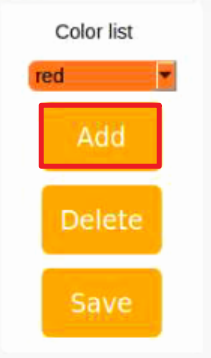

(6) After confirming the entries are correct, press the ESC key, then type \`:wq\` to exit and save the file.


(7) Enter the following command to restart the robot's Wi-Fi service. After a moment, LED1 on the expansion board will remain lit.

```
sudo systemctl restart wifi.service
```

:::{Note}

After restarting the robot's Wi-Fi service, NoMachine will automatically disconnect. This happens because the device is set to LAN mode, and connecting to a different Wi-Fi network changes the IP address, making it inconsistent with the previous one.

:::

(8) Connect your mobile phone to the 5G network, for example, connect to the **“Hiwonder_5G”** Wi-Fi.


(9) Open the mobile app **“WonderAi”**, then click through **“Advanced Kit and JetArm”**.


(10) After a moment, the main interface will display the corresponding icon and name of the robot.


(11) Long-press the robot icon in the app to view the assigned IP address and device ID for the robot.


(12) Enter the retrieved IP address into NoMachine to establish a remote connection. For more details, refer to the tutorial “**Connection Through NoMachine**”.

(13) If you need to switch to direct connection mode, re-edit the configuration file, comment out all the lines, then save and restart the robot.

### 1.6.5 Access via USB cable Using the Fixed IP

:::{Note}

This section is applicable to all versions of the Jetson series controllers.

:::

If you’re using a desktop computer, you can improve the smoothness for remote operations by enabling Remote NIDS compatible device, using the method of the fixed IP “**192.168.55.1**”. The specific operation are as follow:

**Jetson Nano Controller version:** Connect your robot to computer with Micro USB cable.


**Jetson Orin Nano/ Jetson Orin NX controller:** connect the robot to the computer using Type-C cable.


(1) Right-click “**This computer**” to choose “**Manage**”.


(2) Click on “**Device Manager”** in the left-hand menu of the interface. Locate the “**NDIS driver**” under “**Network adapters**” and right-click on the driver. Choose the “**Update driver**” option from the menu.


(3) After the installation of driver, refer to **Section 5.2.1 or 5.2.2** to login the system. In addition, you need to replace the IP address with 192.168.55.1.

### 1.6.6 Introduction to the System Command Line Terminal

In the following course chapters, it is essential to pay attention to the ROS version corresponding to the command line terminal. If an incompatible terminal is opened, inputting commands will result in errors. For example, commands intended for ROS1 will not work in a ROS2 terminal.

* **Jetson Nano Version**

This command line terminal  is configured with the ROS1 environment.

* **Jetson Orin Nano Version**

This command-line terminal  is configured with the ROS1 environment, while the terminal  is configured with the ROS2 environment.

* **Jetson Orin NX Version**

This command-line terminal  is configured with the ROS1 environment, while the terminal  is configured with the ROS2 environment.

### 1.6.7 Robot Version Configuration Tool Guide

This section introduces the built-in Version Configuration Tool, which allows switching between different chassis types, various radar and camera models, and English or Chinese voice options.

This content is primarily intended for the following users:

(1) Those who purchased a version without a controller

(2) Those who have re-flashed the system image

(3) Those who have replaced compatible components, such as switching from a Mecanum wheel chassis to a tracked chassis

For users who purchased a complete system with a controller included, this section is for reference only, and no action is required. Before using the tool, confirm the system version configuration based on the main control model you have purchased.

* **Introduction and Use of the Tool**

(1) Use the NoMachine remote desktop tool to connect to the robot. For specific connection steps, please refer to the guide.

(2) In the remote desktop, double-click  to open the Robot System Configuration Tool.

(3) As shown below, basic users should select:

Robot Type: JetArm Starter

Camera Type: USB WebCam


For Standard, Advanced, and Ultimate users, select:

Robot Type: JetArm Advanced

Camera Type: Gemini


(4) Users can check their order information to verify their hardware version. Generally, you only need to configure the Robot Type, Camera Type, and Language settings as shown in the table below. Leave other options at their default settings to avoid potential issues.

<table  class="docutils-nobg" style="margin:0 auto" border="1">
<colgroup>
<col  />
<col  />
</colgroup>
<tbody>
<tr>
<td><strong>Option</strong></td>
<td><strong>Configuration</strong></td>
</tr>
<tr>
<td>Machine type</td>
<td>JetArm Starter<br />
JetArm Advanced</td>
</tr>
<tr>
<td>Camera type</td>
<td>USB WebCam<br />
Gemini</td>
</tr>
<tr>
<td>Language</td>
<td>Chinese/English</td>
</tr>
</tbody>
</table>


(5) For example, if we need to switch the robot type from JetArm Starter to JetArm Advanced:


(6) Click Apply & Save followed by Restart Play Service in that order to ensure the robot type is successfully updated.


(7) Once the robot’s buzzer beeps, the switch has been successful. You can then open the terminal interface according to your main control version to confirm the changes.


* **Verifying Configuration Changes**

The following demonstrates how to verify changes on the three controller types: **Jetson Nano, Jetson Orin Nano, and Jetson Orin NX.** For details on terminal differences, refer to the "Introduction to the System Command Line Terminal.

(1) Jetson Nano Controller Version

Click  to initiate the ROS1 command-line terminal to check.


(2) Jetson Orin Nano/Jetson Orin NX Version

Open the command line terminal  to verify the configuration.


### 1.6.8 Remote Desktop Resolution Settings

If the package includes a 7-inch touchscreen display or a monitor, using remote connection tools may result in low or blurry screen resolution. We can follow the steps below to adjust the remote desktop resolution, typically setting it to 1920x1080.

:::{Note}

For the Jetson Nano version, make sure to disconnect the HDMI cable from the screen before powering on to ensure the desktop resolution syncs properly.

:::

* **Jetson Orin Nano Version**

After connecting via NoMachine, follow these steps to set up the resolution (you will need to repeat these settings for subsequent connections):

(1) On the first boot, the resolution may appear abnormal. Click the top left corner  to manually adjust the resolution.


(2) Then, click the top right corner  to close this page, and click the connection icon again to re-enter.


## 1.7 Wireless Handle Control

### 1.7.1 Preparation

(1) Insert the handle receiver into any USB interface on Jetson Nano. Before powering on the device, please ensure that the controller receiver is inserted. If it is already inserted, you can ignore this step (the USB controller receiver is pre-inserted at the factory).

(2) Please bring your own two AAA dry batteries. And insert them into the battery slot. And do not invert the positive and negative poles.


(3) Each time the robot powers on, the app auto-start service (which includes controller functionality) will launch automatically. If it hasn’t been turned off, no further action is needed—just connect and control directly.

(4) As controller signals may interfere with each other, it is recommended not to use this feature if multiple robots are in the same area to avoid unintentional connections or control.

(5) After turning on the controller, it will enter sleep mode if it doesn’t connect to the robot within 30 seconds or if left unused for 5 minutes after connecting. To wake the controller from sleep mode, press the "START" button.

### 1.7.2 Device Connection 

(1) Start JetArm. Switch on handle. At this point, two LEDs (red and green) on the handles will flash simultaneously.

(2) Please wait for a while. Then the robot will pair with the handle automatically. After successful pairing, the green light will keep lighting up and red LED light goes out.


### 1.7.3 Control Mode Introduction

The handle control for the robotic arm are divided into two modes: coordinate mode and single servo mode. When the handle is successfully connected, it defaults to the coordinate mode.

**Single servo mode**: by pressing the buttons on handle, you can control individual servos on the robotic arm for forward and reverse movements. **Coordinate mode**: by pressing the buttons on handle, you can control the robotic arm as a whole along the trajectory of three axes (X, Y, Z) and combined with angular deviation for motion.

The way to switch between the two modes: press the **“SELECT”** and **“START”** buttons. Once you hear a beep sound, the mode has been successfully switched. Switching from single servo mode to coordinate mode, you will be prompted through two beeps sound. One beep sound represents the switch from coordinate mode to single servo mode.

### 1.7.4 Button Function

* **Single Servo Mode**

Following is the button function instruction for single servo mode:

|  **Button**  | **Function (from the first-person perspective of robotic arm)** |
| :----------: | :----------------------------------------------------------: |
|    START     |        Return the robotic arm to its initial posture         |
| SELECT+START | Switch the servo control modes (singe servo mode/coordinate mode) |
|    UP / ↑    |                       Raise servo No.2                       |
|   DOWN / ↓   |                       Lower servo No.2                       |
|   LEFT / ←   |                Rotate Servo No.1 to the left                 |
|  RIGHT / →   |                Rotate Servo No.1 to the right                |
| TRIANGLE / ∆ |               Close robotic claw (servo No.10)               |
|  CROSS / X   |               Open robotic claw (servo No.10)                |
|  CIRCLE / ⃝   | Rotate No.5 servo to the right (the robotic claw turns right) |
|  SQUARE / ◻  | Rotate No.5 servo to the left (the robotic claw turns left)  |
|      L1      |                       Raise servo No.3                       |
|      L2      |                       Lower servo No.3                       |
|      R1      |                       Raise servo No.4                       |
|      R2      |                       Lower servo No.4                       |

* **Coordinate Mode**

Following is the button function instruction for coordinate mode:

<table  class="docutils-nobg" style="margin:0 auto" border="1">
<colgroup>
<col  />
<col  />
</colgroup>
<tbody>
<tr>
<td ><strong>Button</strong></td>
<td ><strong>Function (from the first-person perspective of robotic arm)</strong></td>
</tr>
<tr>
<td >START</td>
<td >Return robotic arm to its initial posture</td>
</tr>
<tr>
<td >SELECT+START</td>
<td >Switch the servo control modes (singe servo mode/coordinate mode)</td>
</tr>
<tr>
<td >UP / ↑</td>
<td >Robotic arm moves along the positive direction of X-axis (the front of robotic arm)</td>
</tr>
<tr>
<td >DOWN / ↓</td>
<td >Robotic arm moves backward along the negative direction of X-axis</td>
</tr>
<tr>
<td >LEFT / ←</td>
<td >Robotic arm moves along the negative direction of X-axis (robotic arm’s left side)</td>
</tr>
<tr>
<td >RIGHT / →</td>
<td >Robotic arm moves along the negative direction of Y-axis (robotic arm’s right side)</td>
</tr>
<tr>
<td >TRIANGLE / ∆</td>
<td >The robotic gripper closes (ID10 servo)</td>
</tr>
<tr>
<td >CROSS / X</td>
<td >The robotic gripper opens(ID10 servo)</td>
</tr>
<tr>
<td >CIRCLE / ⃝</td>
<td ><p>The ID5 servo turns right</p>
<p>(Robotic gripper turns right )</p></td>
</tr>
<tr>
<td >SQUARE / ◻</td>
<td ><p>The ID5 servo turns left</p>
<p>(Robotic gripper turns left )</p></td>
</tr>
<tr>
<td >L1</td>
<td >Robotic arm moves along the positive direction of Z-axis (above the robotic arm )</td>
</tr>
<tr>
<td >L2</td>
<td >Robotic arm moves along the negative direction of Z-axis (under the robotic arm)</td>
</tr>
<tr>
<td >R1</td>
<td >Increase the reflection angle (based on the horizontal line)</td>
</tr>
<tr>
<td >R2</td>
<td >decrease the reflection angle (based on the horizontal line)</td>
</tr>
</tbody>
</table>


## 1.8 Position Adjustment for Object Gripping and Placing

:::{Note}

* Once the parameters adjusted take effect, the gripping and placing effects of color sorting, tag sorting, intelligent stacking (it can only be executed via app), and waste sorting.

* Prior to shipment, the robotic arm has undergone calibration. However, discrepancies between the calibration environment and the actual usage environment, coupled with potential vibrations during transport, may result in suboptimal execution of sorting, stacking, and other games, causing the gripper to inaccurately pick up and place blocks.

* In the event of the aforementioned issues, refer to the following instructions to adjust the gripping and placing positions of the robotic arm.

  :::

### 1.8.1 Preparation

(1) Place and start the robotic arm on map. Connect it on app according to [1.4.1 App Installation]().

(2) Adjust the color threshold according to [1.5 Color Threshold Setting]().

(3) Check whether the robotic arm has deviation. If there is a deviation, please adjust according to “4. Deviation Adjustment”.

(4) Calibrate the position according to [1.4.5 Position Calibration]().

(5) Re-start the robot sorting or stacking games to check if there is any deviation during gripping and placing. If there is any deviation, then refer to the following instructions for adjustments (you may skip this section if the gripping and placing effects are good).

### 1.8.2 Position Adjustment Tool

* **Introduction to the Position Adjustment Tool**

(1) Refer to [1.6 Development Environment Setup and Configuration]() to remotely connect the device to the system desktop.

(2) For the Jetson Nano version, click the system desktop icon  to open the JetArm Position Calibration Tool. For the Jetson Orin Nano or Jetson Orin NX versions, click the system desktop icon  to open the JetArm Position Calibration Tool.

:::{Note}

The positive direction of the X-axis is the front of the robotic arm, the positive direction of the Y-axis is to the left of the arm, and the positive direction of the Z-axis is above the arm.

:::


The offset unit is in meters. For example, increasing the X-axis value by 0.01 shifts the grasping position of the arm forward by 1 cm.


The parameters are defined as follows:

<table  class="docutils-nobg" style="margin:0 auto" border="1">
<colgroup>
<col  />
<col  />
<col  />
</colgroup>
<tbody>
<tr>
<td><strong>Parameter Name</strong></td>
<td><strong>Parameter Definition</strong></td>
<td><strong>Adjustment Position</strong></td>
</tr>
<tr>
<td>Positioning X Offset</td>
<td>X-axis offset of the robotic claw during grasping; decrease if the claw is ahead of the object, and vice versa.</td>
<td rowspan="3"></td>
</tr>
<tr>
<td>Positioning Y Offset</td>
<td>Y-axis offset of the robotic claw during grasping; decrease if the claw is to the left of the object, and vice versa.</td>
</tr>
<tr>
<td>Positioning Z Offset</td>
<td>Z-axis offset during grasping; decrease if the claw is above the object, and vice versa.</td>
</tr>
<tr>
<td>Positioning X Scaling</td>
<td>Scaling factor in the X-axis direction for the return image of the grasping area (positive values only).</td>
<td rowspan="3"></td>
</tr>
<tr>
<td>Positioning Y Scaling</td>
<td>Scaling factor in the Y-axis direction for the return image of the grasping area (positive values only).</td>
</tr>
<tr>
<td>Positioning Z Scaling</td>
<td>Scaling factor in the Z-axis direction for the return image of the grasping area (positive values only).</td>
</tr>
<tr>
<td>Target 1 X</td>
<td>X-axis offset for placement at Target Position 1.</td>
<td rowspan="3"><p>Target 1</p>
<p></p></td>
</tr>
<tr>
<td>Target 1 Y</td>
<td>Y-axis offset for placement at Target Position 1.</td>
</tr>
<tr>
<td>Target 1 Z</td>
<td>Z-axis offset for placement at Target Position 1.</td>
</tr>
<tr>
<td colspan="3">Similar for Target 2, Target 3, etc.</td>
</tr>
</tbody>
</table>


The target positions for activities such as color sorting, label sorting, smart stacking, and waste classification are illustrated in the diagram below:


* **Grasping Position Adjustment**

(1) Open the position adjustment tool. Here, we will use the grasping position for color sorting as an example; other grasping-related activities will follow the same adjustment method.


(2) If we need to adjust the grasping position, we must modify the offset values for "**Positioning X, Y, Z**."


(3) Before starting the adjustment, open the color sorting feature in the app, place the colored blocks in the grasping area, and observe the offset when the gripper grasps the colored block.


(4) For this example, we will consider the scenario where the gripper is positioned in front of the colored block; the same adjustment method applies to other situations.


(5) If the gripper is offset forward when grasping, reduce the Positioning X offset value by 0.01. Click **Apply** -\> **Save** (the offset unit is in meters; reducing by 0.01 m means that when the claw grasps again, it will shift down by 1 cm. Adjustments should be made based on the actual situation, either increasing or decreasing the offset value by 0.01 or 0.001).


(6) Return to the mobile app's mode selection screen and wait for the robotic arm to start grasping. Check the adjustment effect (the effect takes effect in real-time; after clicking the **Apply** button, it will take effect during the next grasping action without needing to re-enter the activity).


(7) If the colored block is still not grasped or there are deviations in the Y or Z axes, follow steps 3-7 to adjust the corresponding offset values.

(8) If the wooden block is at the edge of the grasping area and the gripper's grasping position is offset inconsistently, we can adjust the scaling values for "Positioning X, Y, Z."


(9) Before starting the adjustment, open the color sorting feature in the mobile app, place the colored block at the edge of the grasping area, and observe the offset when the gripper grasps the colored block.


(10) You may find that when the wooden block is at the left edge of the grasping area, the gripper tends to offset slightly to the right when grasping; conversely, when the block is at the right edge, the gripper tends to offset slightly to the left. In this case, you need to increase the Positioning X scaling value to 1.10 (after adjusting the scaling value to 1.10, the original position of 0.1 will change to 0.1 \* 1.10 = 0.11, meaning that during the next grasping action, the gripper will offset by 1 cm towards the edge. Adjustments should be made based on the actual situation, either increasing or decreasing the scaling value by 0.01 or 0.1). Click Apply -\> Save. The same adjustment method applies to other situations.


(11) Return to the mobile app's mode selection screen, wait for the robotic arm to start grasping, and check the adjustment effect (the effect takes effect in real-time; after clicking the **Apply** button, it will take effect during the next grasping action without needing to re-enter the activity).


(12) If there are still deviations while grasping in the edge area, follow steps 9-11 to adjust the corresponding scaling values.

* **Placement Position Adjustment**

The method for adjusting the placement position is consistent with that of the grasping position. It is important to pay attention to the target placement position.


(1) Here, we will take the example of adjusting the X-axis coordinate to move forward and the Y-axis coordinate to move left while sorting red objects.

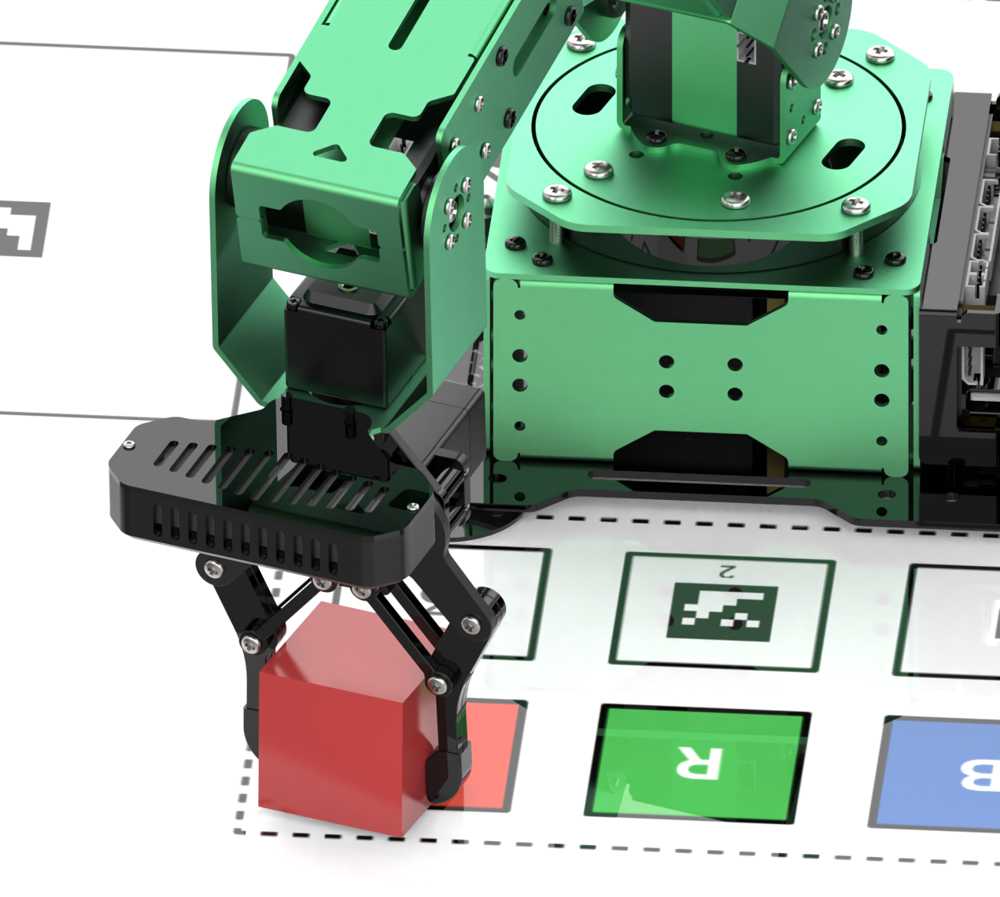

(2) In this case, it is necessary to decrease the X and Y-axis coordinates of Target 1. For preliminary adjustments, reduce the values by increments of 0.01. If a larger adjustment was made, fine-tuning can also be done using increments of 0.005. Users should modify the values based on specific situations.

(3) Once adjustments are complete, click **Apply -\> Save.**


(4) Return to the mobile app's mode selection screen, re-enter the color sorting feature, and check the adjustment effect.


(5) If the colored block is still not placed accurately or there are deviations on the Z-axis, follow steps 2-4 to adjust the corresponding offset values.

## 1.9 Hardware Introduction

This chapter will mainly introduce the hardware components of ROS robots, including the electrical control system, ROS main control unit, depth camera and various sensors.

### 1.9.1 Hardware System 

The robotic electrical control system utilizes an STM32 controller as the core motion controller to enable communication between the Jetson controller and the bus servos. The specific models and connection methods for the ROS controller vary and will be explained in detail below.

- **Jetson Nano Version**


- **Jetson Orin Nano/Jetson Orin NX Version**

  

### 1.9.2 Electrical Control System Introduction

* **STM32 Controller**

The STM32 open-source controller is specially designed for robot development, small and exquisite.

The controller deploys STM32F407VET6 as the main control, utilizing Arm’s Cortex-M4 core, running at 168MHz. It has an onboard FLASH capacity of 512K, an SRAM capacity of 192K, and integrates FPU and DSP instructions.

The STM32F40x/41x series system block diagram is shown below:


With ample onboard resources and extension port, the controller is highly suitable for ROS robot development. It can be seamlessly integrated with the Jetson series ROS main control to make a ROS-based robot.

The front resource configuration of the control board is shown below：


The control board also provides schematics and supports USB serial port program downloads, enabling STM32 programming for secondary development. It offers onboard resources and peripheral sample codes, facilitating user learning and application.

**The resources and peripherals of STM32F407VET6 processor is shown as in the table below.**


* **STM32 Carrier Board**

The STM32 carrier board provides power to the robotic arm hardware, connects the bus servos, and controls the rotation of the servos. For additional information on the expansion board and the STM32 main controller, please refer to '4. Hardware Information\2. STM32 Controller Information.' The resource configuration on the front of the carrier board is displayed in the image below:


* **Power Instruction**

(1) Jetson Nano Controller

The Jetson Nano main controller operates using a 12V 5A adapter (DC 4.0mm). The 12V input powers the STM32 controller, which directly supplies power to the bus servos. A DC-DC converter then steps down the voltage to 5V to power the Jetson Nano, with a maximum current output of 5A.

(2) Jetson Orin Nano & Jetson Orin NX Controller

These two main controllers use a dual power supply scheme. A 12V 5A adapter (DC 4.0mm) connects to the STM32 controller, directly powering the bus servos. Meanwhile, a 19V 2.37A adapter (DC 5.5mm) supplies power directly to the Jetson Orin Nano and Jetson Orin NX main controllers.

### 1.9.3 ROS Controller

The JetArm robot provides comprehensive support for ROS main controllers. The usage methods for each controller are similar, as they all run on the Ubuntu system. Below is a comparison of the specifications for the Jetson Nano, Jetson Orin Nano, and Jetson Orin NX main controllers:


* **Jetson Nano Version**


The Jetson Nano version comprises a Jetson Nano controller and a Jetson expansion board. The controller is a compact yet powerful computer capable of running popular deep learning frameworks, providing the computational power required for most artificial intelligence projects.

The expansion board features LED indicators and buttons, enabling users to monitor network status through LED blinking and switch network modes with the buttons. It also includes reserved GPIO and I2C interfaces.

The controller operates on Ubuntu 18.04 and is configured with the ROS Melodic environment for robotics. For foundational courses on ROS main controllers, please refer to “ROS Main Controller Tutorial.”

* **Jetson Orin Nano Version**


The Jetson Orin Nano version consists of a Jetson Orin Nano controller and a Jetson expansion board. Compared to the Jetson Nano, the Jetson Orin Nano offers significantly faster processing speeds and improved memory read/write performance, with an overall performance boost of 40-80 times.

The expansion board includes LED indicators and buttons, allowing users to check network status through LED blinking and switch network modes via the buttons. It also provides reserved GPIO and I2C interfaces.

The controller runs on Ubuntu 20.04 and is set up with the ROS1 Noetic environment for robotics. For basic courses on ROS main controllers, please refer to "ROS Controller Course.”

* **Jetson Orin NX Version**


The Jetson Orin NX is offered in 8GB and 16GB versions, comprising the Jetson Orin NX controller and an expansion board. The Jetson Orin NX 16GB significantly outperforms the Jetson Orin Nano 4GB, delivering faster computation speeds, enhanced memory read/write rates, and up to 5 times the performance.

The expansion board is equipped with LEDs and buttons for user convenience, allowing users to monitor network status through LED indicators and switch network modes with a button. It also includes GPIO and I2C interfaces.

The controller operates on Ubuntu 22.04 and features a ROS1 Noetic environment within a Docker container.

### 1.9.4 Intelligent Bus Servo

JetArm is a 6DOF robotic arm composed of bus servos and interconnectd metal components.

<p style="margin:0 auto 24px;width:100%">


</p>

The distribution of 6 bus servos: HTS-21H\*1 (gripper) + HX-12H (wrist) + HTD-35H\*3 (body) + HTS-35H\*1 (Pan-tilt)

### 1.9.5 Vision Module

* **Depth Camera**


The camera is one of the most important components in the robot's structure, analogous to human eyes.

This robot features the Orbbec Gemini embedded 3D camera module, which can capture both depth and color images. It offers advantages of compact size and high performance, making it suitable for 3D object scanning at recognition distances ranging from 25 to 250 cm, and it supports a USB 3.0 interface.

With its active stereo structured light design, the Gemini provides high-resolution depth maps and infrared image data, along with strong light resistance.

* **Monocular Camera**


The main difference between a monocular camera and a depth camera is that the monocular camera cannot capture depth information. As a result, applications that rely on depth perception cannot be directly implemented with a monocular camera, including RGB data visualization, point cloud data visualization, KCF object tracking, human body tracking, RTAB-Map 3D mapping, 3D depth visual recognition and tracking, 3D spatial object grasping, and voice-controlled color sorting.

### 1.9.6 Others

* **Microphone Array Module**

This module is an optional hardware component that enables voice wake-up and voice control functions on the robot. For courses related to the microphone array module.

The robot is equipped with a 6-channel microphone array arranged in a planar distribution, consisting of six microphones. This system samples and processes the spatial characteristics of the sound field, allowing for sound source localization and 360° equivalent sound pickup. See the illustration below:


The noise reduction board can suppress background noise, interference, reverberation, and echoes, as illustrated below:


* **Sound Card and Speaker**

The sound card and speaker are used for audio notifications. When paired with the 6-channel microphone array module, they enable voice interaction with the robot.


* **7-Inch LCD Screen**


**(The system desktop is for your reference only. Please** **subject to the actual situation)**

The 7-inch LCD display features both display and touchscreen functions. In addition to viewing the robot's system desktop directly, users can quickly experience mapping and navigation features by tapping on icons on the desktop.

9.6.4 PS2 Wireless Handle

The USB receiver for the controller has already been installed in the robot's USB hub at the factory, allowing you to directly use the controller to operate the robot.

## 1.10 System Software Architecture Overview

Before diving into this section, please ensure that you have connected using the Nomachine remote desktop software. For specific connection methods, refer to the [1.6 Development Environment Setup and Configuration]() guide.

:::{Note}

This section is applicable to the Jetson Nano series of controllers.

:::

### 1.10.1 Jetson Nano Controller

:::{Note}

The following describes the software framework for ROS1.

:::

(1) Click-on  to initiate the command-line terminal. Execute the command ‘**ls**’ and hit Enter key to view the files in the home directory.

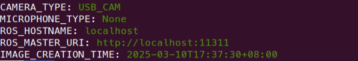

(2) The following table provides an overview of each folder:

| **File Name**  |                **Description**                 |
| :------------: | :--------------------------------------------: |
|     arm_pc     |  Control for the robotic arm's upper machine   |
| Bus_Servo_Tool |     Debugging tool for robotic arm servos      |
|    Desktop     |              Desktop environment               |
|   Documents    |          Folder for system documents           |
|   Downloads    |          Folder for downloaded files           |
| hiwonder_wifi  |            Wi-Fi configuration file            |
|     jetarm     | Main functionality package for the robotic arm |
|    labelImg    |      Image collection and annotation tool      |
|     Music      |                  Music files                   |
|    Pictures    |               Folder for images                |
|     Public     |              User-defined folder               |
|   Templates    |         Template folder (user-defined)         |
|     Videos     |             Folder for video files             |
|    weights     |         Machine learning weight files          |
|     yolov5     |                  Yolov5 files                  |

(3) Enter the following command and press Enter to navigate to the robotic arm functionality package directory. Then, input ls to view the files in this directory.

```
cd jetarm/src
```


(4) The following table provides an overview of each folder:

| **<span class="mark">File Name</span>** |          **<span class="mark">Description</span>**           |
| :-------------------------------------: | :----------------------------------------------------------: |
|             dataset_capture             |                       Image collection                       |
|             hiwonder_grasp              |              Robotic arm grasping functionality              |
|            hiwonder_imgproc             |                       Image processing                       |
|           hiwonder_interfaces           |                   Communication protocols                    |
|           hiwonder_transform            |                  Coordinate transformation                   |
|               jetarm_6dof               |              Six-axis robotic arm functionality              |
|          jetarm_6dof_simulate           |            Simulation of the six-axis robotic arm            |
|             jetarm_bringup              |                   Mobile app functionality                   |
|              jetarm_driver              |                Kinematics for the robotic arm                |
|             jetarm_example              |          Example routines for robotic arm features           |
|       JetArm-jetson_nano_to_stm32       |      Communication between Jetson Nano board and STM32       |
|           jetarm_peripherals            | Configuration for external devices connected to the robotic arm |
|               Lab_config                |               Color threshold adjustment tool                |
|               third_party               |            AprilTag and depth camera ROS packages            |
|              Vision_utils               |                         Visual tools                         |

- **Function File Overview**

Below, we will use \`**jetarm/src/jetarm_6dof/jetarm_6dof_functions**\` as an example to explain the game files.

(1) Navigate to the directory containing the gameplay files. You will find two folders: launch and scripts.


(2) The launch folder contains the launch files, while the scripts folder contains the source code for the game.


(3) Before starting the game, you need to disable the app auto-start service. Then, enter the game launch file directory and input \`roslaunch + filename\`, or enter \`roslaunch + package_name + filename\` from any directory.


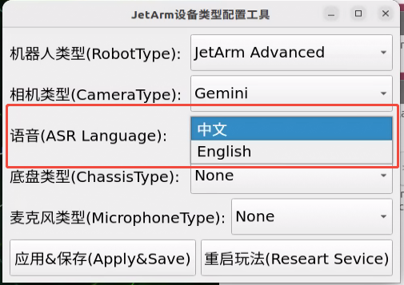

### 1.10.2 Jetson Orin Nano & Jetson Orin NX Controllers

:::{Note}

Below is the ROS1 Software Framework Inside Docker

:::

(1) Click-on  to initiate the command-line terminal, enter the command, and press Enter to view the files in the home directory.

```
ls
```

The following table describes each folder:

| **<span class="mark">Directory Name</span>** |            **<span class="mark">Purpose</span>**             |
| :------------------------------------------: | :----------------------------------------------------------: |
|       <span class="mark">arm_pc</span>       | <span class="mark">Software for the upper computer of the robotic arm</span> |
|   <span class="mark">factory_utils</span>    |             Directory for storing software tools             |
|       <span class="mark">jetarm</span>       |       Workspace (includes various gameplay functions)        |
|       <span class="mark">share</span>        | <span class="mark">Shared space for Docker and the machine system</span> |
|      <span class="mark">weights</span>       |     <span class="mark">Models trained with Yolov5</span>     |
|       <span class="mark">yolov5</span>       |    <span class="mark">Directory for storing images</span>    |

(2) Enter the command and press Enter to navigate to the robot functionality package directory. Input ls to view the files in the directory.

```
cd jetarm
```

```
ls
```

(3) The following table describes each folder:

| **Directory/File Name** |                       **Description**                        |
| :---------------------: | :----------------------------------------------------------: |
|        **build**        | Compilation space, stores cache information during the compilation process |
|       **command**       | Stores commands that implement various functionalities for easy reference |
|        **devel**        |  Stores target files and executable files after compilation  |
|        **logs**         |                   Folder for storing logs                    |
|         **src**         | Folder for storing the source code of functionality packages |

(4) Next, enter the command and press Enter to navigate to the robot functionality package directory and view the files in the src directory.

```
cd src
```

```
ls
```

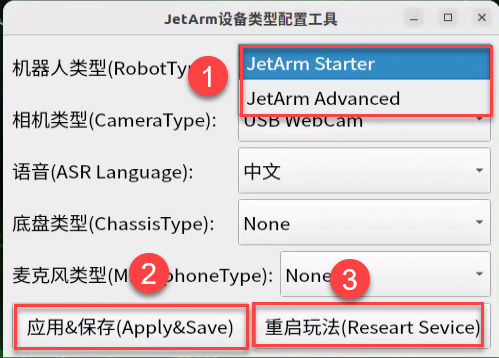

(5) The following table describes each folder:

| **<span class="mark">File Name</span>** |       **<span class="mark">Purpose</span>**       |
| :-------------------------------------: | :-----------------------------------------------: |
|             dataset_capture             |                 Image acquisition                 |
|             hiwonder_grasp              |               Robotic arm grasping                |
|            hiwonder_imgproc             |                 Image processing                  |
|           hiwonder_interfaces           |              Communication protocols              |
|           hiwonder_transform            |         Coordinate system transformation          |
|               jetarm_6dof               |            6-axis robotic arm gameplay            |
|          jetarm_6dof_simulate           |           6-axis robotic arm simulation           |
|             jetarm_bringup              |                    Mobile app                     |
|              jetarm_driver              |           Kinematics of the robotic arm           |
|             jetarm_example              |    Functionality examples for the robotic arm     |
|       JetArm-jetson_nano_to_stm32       | Communication between Jetson Nano board and STM32 |
|           jetarm_peripherals            | Settings for external devices of the robotic arm  |
|               Lab_config                |          Color threshold adjustment tool          |

- **Functional File Overview**

Take the game file **‘/jetarm/src/example’** as example.

(1) Enter the following commands in sequence to enter the directory containing the game files.

```
cd jetarm_example/src
```

```
ls
```


(2) Take 1.camera_topic_invoke as example. Run the command below in sequence to access the game file.

```
cd 1.camera_topic_invoke
```

```
ls
```

The .py file is the source code file corresponding to the game, and the .launch file is the launch file for the game.

(3) When starting the game, you must first disable the app auto-start service. Then, navigate to the directory containing the game launch file and enter roslaunch \<file_name\>. Alternatively, you can enter roslaunch \<package_name\> \<file_name\> from any directory.


:::{Note}

Below is the ROS2 software architecture.

:::

(4) Click-on  to initiate the command-line terminal, and enter the following command to access the home directory.

```
ls
```


(5) The table below introduces the purpose of each folder:

|   Folder Name    |                 Purpose                  |
| :--------------: | :--------------------------------------: |
|      arm_pc      |          Robot arm PC software           |
|    Documents     | Document directory for the Ubuntu system |
|       Log        |              Log directory               |
|     Pictures     | Picture directory for the Ubuntu system  |
|       snap       |  Directory for the Snap package manager  |
|      Videos      |  Video directory for the Ubuntu system   |
|     Desktop      |            Desktop directory             |
|    Downloads     | Download directory for the Ubuntu system |
|      Public      |         Public folder for Ubuntu         |
|    Templates     |  Templates folder for the Ubuntu system  |
|   Wifi_manager   |         Wi-Fi management folder          |
|      docker      |   Shared folder for Docker containers    |
|  factory_utils   |          Debugging tools folder          |
|      Music       |  Music directory for the Ubuntu system   |
|     ros2_ws      |        Workspace folder for ROS2         |
| third_party_ros2 |     Third-party ROS2 packages folder     |

- **Function File Introduction**

(1) Navigate to the example folder by entering the following commands:

```
cd ros2_ws/src/example/example/
```

```
ls
```


The following table introduces the purpose of each subfolder:

|  Folder Name  |                Purpose                 |
| :-----------: | :------------------------------------: |
|   mediapipe   | Deep learning examples using Mediapipe |
|    opencv     | Computer vision examples using OpenCV  |
| rgbd_function |  Depth camera functionality examples   |
|    simple     | Robotic arm hardware control examples  |
|    yolov8     | Object detection examples using YOLOv8 |

(2) For example, to access the OpenCV examples, enter the following commands:

```
cd opencv
```

```
ls
```


In this directory, the .launch.py files are the launch files for various OpenCV examples.

(3) Next, enter the following commands to navigate to the source code directory.

```
cd include
```

```
ls
```


(4) This directory contains the source code files for the corresponding OpenCV examples.

(5) Before starting an example, you must disable the app's auto-start service (refer to Section 3.1 Disabling and Enabling Auto-Start Services). Then:Navigate to the directory containing the example's launch file and run:


Alternatively, you can start the example from any directory by specifying the package name and file name:

