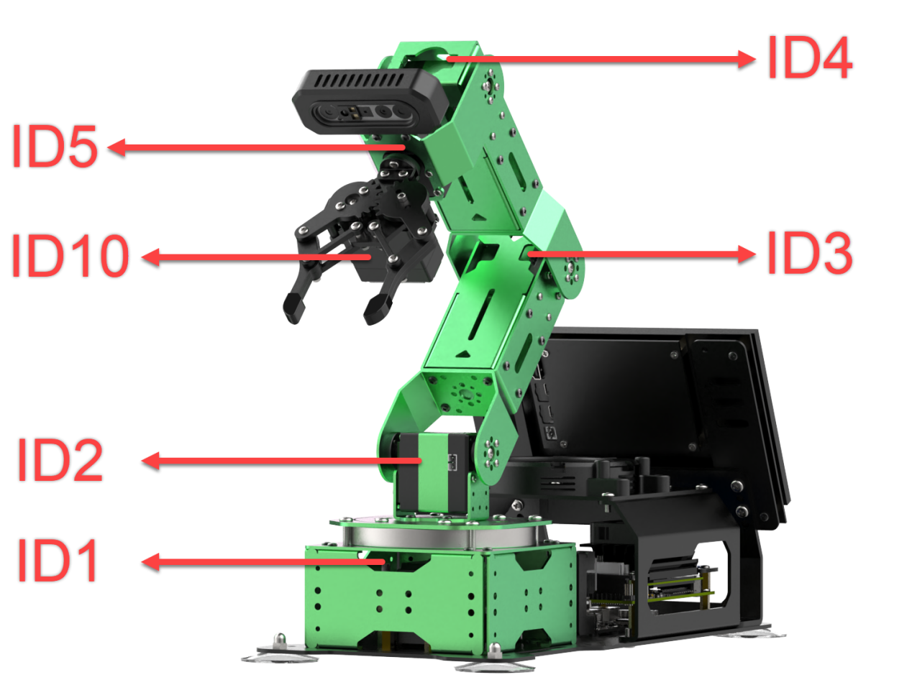
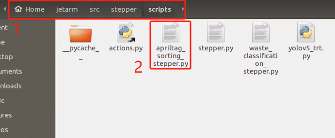

# 10. ROS1-Robot Arm + Sliding Rail Course

## 10.1 Sliding Rail Installation

You can refer to the instructional videos in the same directory for installing the slide rail and robotic arm: '[**Install Tank Belt to Slider**](https://youtu.be/kmQXTRHfAfU)' and '[**Install JetArm to slider**](https://youtu.be/rqszXsAqTRI)' Below is a diagram illustrating the installation of the sliding rail and robotic arm:

<table  class="docutils-nobg" border="1">
<colgroup>
<col  />
</colgroup>
<tbody>
<tr>
<td ><h2 id="step-1-install-cable-carrier" class="unnumbered">Step 1: Install cable carrier</h2>
<p>Use two M4*6 screws to attach the cable carrier to the sliding rail.</p>
<p></p>
</tr>
</tbody>
</table>

<table  class="docutils-nobg"  border="1">
<colgroup>
<col  />
</colgroup>
<tbody>
<tr>
<td><h2 id="step-2-install-the-motor-mounting-cover" class="unnumbered">Step 2: Install the motor mounting cover</h2>
<p>Use two M3*6 screws to attach the motor mounting cover to the sliding rail.</p>
<p></p>
</td>
</tr>
<tr>
<td ><h2 id="step-3-install-the-sliding-rail-base-plate" class="unnumbered">Step 3: Install the sliding rail base plate</h2>
<p>Use four M5*12 screws and four 5.27*4 nylon standoff to secure the sliding rail base plate to the slide rail.</p>
<p></p>
</td>
<tr>
<td ><h2 id="step-4-install-the-sliding-rail-adapter-bracket" class="unnumbered">Step 4: Install the sliding rail adapter bracket</h2>
<p>Use two M4*8 round-head screws to attach the sliding rail adapter bracket to the JetArm base plate. Then, use two M3*6 screws to install two M3*15 dual-hole brass standoffs on the JetArm adapter plate</p>
<p></p>
</td>
<tr>
<tr>
<td ><h2 id="step-3-install-the-sliding-rail-base-plate" class="unnumbered">Step 5: Install the robotic arm</h2>
<p>Use four M3*10 screws to assemble the robotic arm onto the sliding rail base plate. (Note: You will need to remove the M3*6 screws that are originally installed on the robotic arm first.)</p>
<p></p>
</td>
</tr>
<tr>
<td ><h2 id="step-3-install-the-sliding-rail-base-plate" class="unnumbered">Step 6: Attach the cable carrier to the robotic arm</h2>
<p>Use two M3*6 screws to assemble the cable carrier onto the JetArm robotic arm.</p>
<p></p>
</td>
</tr>
<tr>
<td ><h2 id="step-3-install-the-sliding-rail-base-plate" class="unnumbered">Step 7: Completed assembly and wiring instructions</h2>
<p>The completed assembly is shown in the diagram below:</p>
<p></p></td>
</tr>
<tr>
<td ><p>The 3-pin wire of the sliding rail connects to the 3-pin terminal on the STM32 expansion board for power supply, while the 4-pin wire connects to the I2C interface on the Jetson Nano expansion board, as shown in the diagram below:</p>
<p></p></td>
</tr>
</tbody>
</table>

## 10.2 Position Calibration

:::{Note}

* This section pertains to position calibration in the sliding rail configuration. Please install the robotic arm on the sliding rail before proceeding with this operation.

* After using the sliding rail, if you need to utilize it with a map, you must recalibrate the position on the map. Please refer to [1. Getting Ready( JetArm User Manual)->1.4.5 Position Calibration](https://docs.hiwonder.com/projects/JetArm/en/latest/docs/1.Getting_Ready.html#position-calibration) for guidance.

:::

Position calibration refers to the process of converting the coordinates from the camera's returned image to real-world coordinates. Through position calibration, the actual distance between the block and the robotic arm can be determined, allowing for improved performance in sorting and other related tasks.

(1) After successfully connecting the robotic arm to the app, tap on the robot arm icon and select '**Position Calibration**' from the mode selection interface.


(2) When using the app for the first time, the image on the right may take a few seconds to appear, so please wait a moment. If the image does not appear after a long time, return to the mode selection page and re-enter.


(3) Place the AprilTag label for ID1 directly beneath the depth camera, ensuring that the text '**TAG36H11-1**' faces the left side of the robotic arm, as shown in the diagram below. Incorrect placement of the label may lead to an erroneous ROI (Region of Interest) for the robotic arm.

<p class="common_img" style="text-align:center;">


</p>

(4) Press the '**Start Position Calibration**' button. When you see the five black dots align with the five blue dots on the AprilTag label, and the message 'Calibration finished!' appears on the screen, the calibration process is complete.

:::{Note}

Calibration may take some time, so please be patient.

:::


(5) After the calibration is complete, exit the calibration mode and switch to the **'Object Sorting'** mode to check if the ROI (Region of Interest) is functioning properly. The examples of correct and incorrect ROI areas are illustrated in the diagram below:


## 10.3 Wireless Handle Control

### 10.3.1 Preparation

(1) Before turning on the device, please ensure that the controller receiver is plugged in. If it is already connected, you can ignore this step (the USB controller receiver is pre-installed in the robot at the factory).

(2) When inserting the battery, be sure to distinguish between the positive and negative terminals.


(3) Each time the robot is powered on, the app auto-start service will be activated (this includes the controller control service). If you haven't disabled this service, no further action is needed; you can connect and control the robot directly.

(4) Due to potential interference from multiple controllers, it is recommended not to use this feature if multiple robots are operating in the same area to avoid accidental connections and control issues.

(5) After turning on the controller, if it does not connect to the robot within 30 seconds, or if it remains unused for 5 minutes after connecting, the controller will automatically enter sleep mode. To wake the controller and exit sleep mode, simply press the '**START**' button.

### 10.3.2 Device Connection

(1) After the robot has powered on, slide the switch on the controller to the "**ON**" position. At this point, both LED lights on the controller (red and green) will flash simultaneously.

(2) Wait a few seconds for the robot and controller to pair automatically. When pairing is successful, the green LED will remain lit, and the red LED will turn off.


### 10.3.3 Introduction to Control Modes

The controller operates in two modes: Coordinate Mode and Single Servo Mode. After a successful connection, the default mode is Coordinate Mode.

(1) Single Servo Mode：Use the buttons on the controller to control the rotation of a single servo on the robotic arm in both clockwise and counterclockwise directions.



(2) Coordinate Mode: Using the buttons on the controller, you can control the robotic arm to move as a whole along a three-axis coordinate system (X, Y, Z) while also adjusting the deflection angle.


Switching Between Modes: To switch between the two modes, press the "**SELECT**" and "**START**" buttons. You will hear a confirmation sound to indicate a successful switch.

① Single Servo Mode to Coordinate Mode: **Two beeps**

② Coordinate Mode to Single Servo Mode: **One beep**

### 10.3.4 Remote Control Button Instructions

* **Single Servo Mode Button Instructions**

The table below describes the button functions for Single Servo Mode:

| **Button** | **Function（From the First-Person Perspective of the Robotic Arm）** |
|:--:|:--:|
| START | Reset robot arm |
| SELECT+START | Switch Control Mode (Single Servo/Coordinate) |
| UP / ↑ | Raise Servo 2 |
| DOWN / ↓ | Lower Servo 2 |
| LEFT / ← | Turn Servo 1 Left |
| RIGHT / → | Turn Servo 1 Right |
| Y | Close Gripper (Servo 10) |
| A | Open Gripper (Servo 10) |
| B | Turn Servo 5 Right (Gripper Turns Right) |
| X | Turn Servo 5 Left (Gripper Turns Left) |
| L1 | Raise Servo 3 |
| L2 | Lower Servo 3 |
| R1 | Raise Servo 4 |
| R2 | Lower Servo 4 |
| LEFT | Move Slide Rail Left |
| RIGHT | Move Slide Rail Right |

* **Coordinate Mode Button Instructions**

The table below describes the button functions for Coordinate Mode:

| **Button** | **Function（From the First-Person Perspective of the Robotic Arm）** |
|:--:|:--:|
| START | Reset Robot Arm |
| SELECT+START | Switch Control Mode (Single Servo/Coordinate) |
| UP / ↑ | Move Robot Arm in Positive X Direction (Forward) |
| DOWN / ↓ | Move Robot Arm in Negative X Direction (Backward) |
| LEFT / ← | Move Robot Arm in Positive Y Direction (Left) |
| RIGHT / → | Move Robot Arm in Negative Y Direction (Right) |
| Y | Close Gripper (Servo 10) |
| A | Open Gripper (Servo 10) |
| B | Turn Servo 5 Right (Gripper Turns Right) |
| X | Turn Servo 5 Left (Gripper Turns Left) |
| L1 | Move Robot Arm in Positive Z Direction (Upward) |
| L2 | Move Robot Arm in Negative Z Direction (Downward) |
| R1 | Increase Gripper Pitch Angle |
| R2 | Decrease Gripper Pitch Angle |
| LEFT joystick | Move Slide Rail Left |
| RIGHT joystick | Move Slide Rail Right |

## 10.4 Waste Sorting

### 10.4.1 Program Logic

In this section, we will classify waste wood blocks using a trained YOLOv5 model recognized by the camera. The robot arm will then utilize inverse kinematics to grasp the identified waste wood blocks and sort them into the corresponding waste bins.

**Step 1: Recognition and Classification**

First, we subscribe to the real-time image data published by the camera node and convert it to Numpy format. After the conversion, we input the image into the YOLOv5 network for scaling, transposing, and array expansion to obtain processing results.

Next, we convert the coordinates of the detected waste card images back to the original image coordinates. After converting the coordinates, we classify the waste according to the recognized names and predefined rules, retrieving the corresponding waste category names. Finally, we outline the waste items and display their names along with the recognition confidence levels.

**Step: Grasp and Place**

To ensure result reliability, repeated recognition of the object is required. The card with the highest confidence level in the image is selected as the first sorting target. Multiple recognition cycles are performed to confirm the object with high reliability.

Once the target is confirmed, the robotic arm's sorting and transport process is initiated, converting the target card's pixel coordinates to world coordinates. The robotic arm then moves to the location of the waste card, grasps the waste block, and, based on the waste category, moves along the sliding rail to the designated placement location for that category, where it releases the waste card, completing the waste sorting task.

### 10.4.2 Start and Close the Game

:::{Note}

The input command should be case sensitive, and keywords can be complemented using Tab key.

:::

(1) Access the robot system desktop using the NoMachine.

(2) Double-click  to open the command line, then enter the following command and press Enter to stop the auto-start service:

```
~/.stop_ros.sh
```

(3) Enter the command below to start the waste classification program and press Enter:

```
roslaunch stepper waste_classification_stepper.launch
```

(4) To stop the program, press "**Ctrl+C**". If it does not close successfully, repeat this action multiple times.

(5) After completing the activity, the app service needs to be started  (failing to start it may affect subsequent app activities). Enter the following command in the terminal and press Enter to start the app service:

```
sudo systemctl start start_app_node.service
```

(6) Once the app service has started, the robotic arm will return to its initial position, and the buzzer will beep once.

### 10.4.3 Program Outcome

Once the activity begins, the camera detects waste cards and displays their names on the screen. Each waste category is highlighted with a different color rectangle: hazardous waste in red, recyclable waste in blue, kitchen waste in green, and other waste in gray.

The robotic arm then grasps the waste blocks and sorts them into their designated locations. In the image below, different colored bins are used as props for each category.


| **Waste Category** |                  **Cards**                  |
|:------------------:|:-------------------------------------------:|
|  hazardous_waste   | Storage Battery, Marker, Oral Liquid Bottle |
|  recyclable_waste  |    Plastic Bottle, Umbrella, Toothbrush     |
|     food_waste     |     Banana Peel, Ketchup, Broken Bones      |
|   residual_waste   | Cigarette End, Plate, Disposable Chopsticks |

If the grasping performance is unsatisfactory, please refer to "[**1. Getting Ready(JetArm User Manual)->1.4.5 Position Calibration**](https://docs.hiwonder.com/projects/JetArm/en/latest/docs/1.Getting_Ready.html#position-calibration)" for guidance. Here, you can only adjust the X and Y coordinate offsets during grasping. If you have used it with a sliding rail and plan to switch to map-based operations, you will need to readjust the coordinates on the map. For adjustments to the placement coordinates, please refer to [10.4.5 Function Extensions](#anchor_10_4_5).

### 10.4.4 Package Structure and Program Analysis

* **Package Structure Analysis**

When using the waste classification feature, the functionality package for the recognition program is called. Its file structure is shown in the diagram below:


`launch folder`: This folder contains the launch file for starting the waste classification program, which is used to activate the waste classification functionality.

`scripts folder`: This folder contains the source code files for the waste classification program, which define the logic functions for waste classification.

`CMakeLists.txt`:This file is used for compiling the package and managing related dependencies, including relevant format information needed after starting the ROS service.

`package.xml`: This is the description file for the package, which outlines the details related to the current package, such as build tools and version numbers.

* **Program Analysis**

(1) Launch File Analysis

The Launch file is saved in : [/home/ubuntu/jetarm/src/stepper/launch/waste_classification_stepper.launch](../_static/source_code/10/stepper_launch.zip)

During the execution of the functionality, the launch file for the current package (**waste_classification_stepper.launch**) will be activated. The contents are shown in the diagram below:

{lineno-start=1}

```
<launch>
    <arg name="camera_type" default="$(optenv CAMERA_TYPE GEMINI)"/>

    <!-- 根据使用的相机设置相应参数(set corresponding parameters based on the used camera) -->
    <arg name="source_image_topic" if="$(eval camera_type=='GEMINI')" default="/rgbd_cam/color/image_rect_color" />
    <arg name="camera_info_topic" if="$(eval camera_type=='GEMINI')" default="/rgbd_cam/color/camera_info" />
    <arg name="source_image_topic" if="$(eval camera_type=='USB_CAM')" default="/usb_cam/image_rect_color" />
    <arg name="camera_info_topic" if="$(eval camera_type=='USB_CAM')" default="/usb_cam/camera_info" />

        <include file="$(find jetarm_bringup)/launch/base.launch"/>

        <node name="waste_classification" pkg="stepper" type="waste_classification_stepper.py" output="screen" respawn="true">
                <param name="source_image_topic" value="$(arg source_image_topic)" />
                <param name="camera_info_topic" value="$(arg camera_info_topic)" />
        </node>
</launch>
```

From the diagram above, it is evident that it is necessary to check which type of camera is mounted on the robotic arm (either GEMINI or USB monocular camera). By obtaining the camera type in the current working environment, the corresponding topic information will be modified for subsequent recognition.

The base.launch file below is used to initialize the current state of the robotic arm. Within this base.launch file, nodes are published that control the joint movements of the robotic arm.

Finally, the waste classification functionality is executed by calling the source file `waste_classification_stepper.py`.

(2) Source Code Analysis

The source code for the program is located at: [jetarm/src/stepper/scripts/waste_classification_stepper.py](../_static/source_code/10/stepper_swiper.zip)

Based on the functional requirements, the logical flowchart of the program has been designed, as shown in the diagram below:


From the diagram, the main logic flow of the program involves setting up the object recognition model, obtaining the camera intrinsic parameters, and then processing and recognizing the images and models. The calculated object coordinates are sent to the robotic arm, enabling it to grasp and place the waste blocks.

① Importing Relevant Application Libraries

{lineno-start=3}

```
import os
import cv2
import rospy
import queue
import numpy as np
import threading
from vision_utils import fps, xyz_quat_to_mat, xyz_euler_to_mat, pixels_to_world, box_center, mat_to_xyz_euler, distance, extristric_plane_shift
from sensor_msgs.msg import Image as RosImage, CameraInfo
from std_srvs.srv import Trigger, TriggerRequest, TriggerResponse
from std_srvs.srv import SetBool, SetBoolRequest, SetBoolResponse

from std_srvs.srv import Empty

from yolov5_onnx import YOLOV5
from hiwonder_interfaces.srv import GetRobotPose
from hiwonder_interfaces.msg import MoveAction, MoveGoal, MultiRawIdPosDur
from jetarm_sdk import bus_servo_control
import actions
import actionlib
```

`cv2`: Used for OpenCV image processing

`rospy`: Used for ROS communication

`numpy`: Used for array operations

`queue`, `threading`: Used for multithreading

Import various functional modules required for coordinate transformation calculations from vision_utils

Import message types from sensor_msgs.msg

Import service types from std_srvs.srv

Import the yolov5_trt model

Import the corresponding message and service types from hiwonder_interfaces

Import action groups from actions

Import the communication library actionlib

{lineno-start=23}

```
import stepper as Stepper
```

Stepper is used to control the rotation of stepper motors

② Waste Model Configuration

{lineno-start=44}

```
TRT_NUM_CLASSES = 13
TRT_CLASS_NAMES = ( 'Banana Peel','Broken Bones', 'Cigarette End', 'Disposable Chopsticks',
                   'Ketchup', 'Marker', 'Oral Liquid Bottle', 'Plate', 'Plastic Bottle',
                    'Storage Battery', 'Toothbrush', 'Umbrella','tap')

WASTE_CLASS_NAMES = ['residual_waste', 'food_waste', 'hazardous_waste', 'recyclable_waste','tap']

WASTE_CLASSES = {
    'food_waste': ('Banana Peel', 'Broken Bones', 'Ketchup'),
    'hazardous_waste': ('Marker', 'Oral Liquid Bottle', 'Storage Battery'),
    'recyclable_waste': ('Plastic Bottle', 'Toothbrush', 'Umbrella'),
    'residual_waste': ('Plate', 'Cigarette End', 'Disposable Chopsticks'),
    'tap':('tap')
}

COLORS = {
    'recyclable_waste': (0, 0, 255),
    'hazardous_waste': (255, 0, 0),
    'food_waste': (0, 255, 0),
    'residual_waste': (80, 80, 80),
    'tap' : (200,220,100)
}
```

As shown in the above figure, there are a total of 13 types of waste categories.

{lineno-start=44}

```
TRT_NUM_CLASSES = 13
```

Names of the waste model categories.

{lineno-start=45}

```
TRT_CLASS_NAMES = ( 'Banana Peel','Broken Bones', 'Cigarette End', 'Disposable Chopsticks',
                   'Ketchup', 'Marker', 'Oral Liquid Bottle', 'Plate', 'Plastic Bottle',
                    'Storage Battery', 'Toothbrush', 'Umbrella','tap')
```

Names of the waste categories.

{lineno-start=49}

```
WASTE_CLASS_NAMES = ['residual_waste', 'food_waste', 'hazardous_waste', 'recyclable_waste','tap']
```

Classification of waste models.

```
WASTE_CLASSES = {
    'food_waste': ('Banana Peel', 'Broken Bones', 'Ketchup'),
    'hazardous_waste': ('Marker', 'Oral Liquid Bottle', 'Storage Battery'),
    'recyclable_waste': ('Plastic Bottle', 'Toothbrush', 'Umbrella'),
    'residual_waste': ('Plate', 'Cigarette End', 'Disposable Chopsticks'),
    'tap':('tap')
}
```

Drawing colors corresponding to different waste categories.

{lineno-start=59}

```
COLORS = {
    'recyclable_waste': (0, 0, 255),
    'hazardous_waste': (255, 0, 0),
    'food_waste': (0, 255, 0),
    'residual_waste': (80, 80, 80),
    'tap' : (200,220,100)
}
```

③ Initiate WasteClassificationNode Class (Waste Sorting Class)

The waste_classification node is launched in the main function of the executable program, implemented through the WasteClassificationNodes class. If the node remains active, it continuously calls the image_process function within this class. Throughout the program's operation, parameters are also initialized using the WasteClassificationNode class, which facilitates the implementation of the image_process function in the node.

{lineno-start=358}

```
if __name__ == "__main__":
    node = WasteClassificationNode("waste_classification", log_level=rospy.INFO)
    while not rospy.is_shutdown():
        node.image_process()
```

④ Initialization Function of WasteClassificationNode Node

{lineno-start=67}

```
class WasteClassificationNode:
    def __init__(self, node_name, log_level=rospy.INFO):
        rospy.init_node(node_name, anonymous=True, log_level=log_level)
        self.lock = threading.RLock()
        self.K = None
        self.D = None
        self.waste_class_name = None
        config = rospy.get_param(CONFIG_NAME)
        self.hand2cam_tf_matrix = config['hand2cam_tf_matrix']
        self.extristric = None
        self.roi = None
        self.moving_step = 0
        self.status = 1

        self.pick_pitch = 80
        self.place_pitch = 0

        self.target = None
        self.count = 0
        self.last_card = None
        self.endpoint = None
        self.image_queue = queue.Queue(maxsize=2)
        self.fps = fps.FPS()
```

In the program screenshot above, it includes the gripper posture angle during the robotic arm's gripping state, referred to as pick_pitch, as well as the height for placing, called place_pitch.

* Creating the `servos_pub` Publisher: The `rospy.Publisher` is used to create a message publisher.

{lineno-start=91}

```
        self.servos_pub = rospy.Publisher("/controllers/multi_id_pos_dur", MultiRawIdPosDur, queue_size=1)
```

The first parameter, `/controllers/multi_id_pos_dur`, indicates the topic name for servo control.

The second parameter, `MultiRawIdPosDur`, specifies the message type.

The third parameter, `queue_size=1`, sets the size of the message queue.

* Defining \`self.camera_info_sub\` to Receive Camera Information: The \`rospy.Subscriber\` is used to create a message subscriber.

{lineno-start=92}

```
        camera_info_topic = rospy.get_param('~camera_info_topic', '/camera/camera_info')
        self.camera_info_sub = rospy.Subscriber(camera_info_topic, CameraInfo, self.camera_info_callback, queue_size=1) #订阅相机内参(subscribe camera intrinsic parameter)
```

The first parameter, `camera_info_topic`, indicates the topic name for receiving image data.

The second parameter, `CameraInfo`, specifies the message type.

The third parameter indicates the function `self.camera_info_callback` that will handle the returned images.

The fourth parameter, `queue_size=1`, sets the size of the message queue.

⑤ Calculating the World Coordinates of the Four Corners of the Recognition Area 

{lineno-start=106}

```
        # 识别区域的四个角的世界坐标(the world coordinates of four corners in recognition region)
        white_area_cam = config['white_area_pose_cam']
        white_area_center = config['white_area_pose_world']
        self.white_area_center = white_area_center
        self.white_area_cam = white_area_cam
        white_area_height = config['white_area_world_size']['height']
        white_area_width = config['white_area_world_size']['width']
        white_area_lt = np.matmul(white_area_center, xyz_euler_to_mat((white_area_height / 2, white_area_width / 2, 0.0), (0, 0, 0)))
        white_area_lb = np.matmul(white_area_center, xyz_euler_to_mat((-white_area_height / 2 - 0.01, white_area_width / 2, 0.0), (0, 0, 0)))
        white_area_rb = np.matmul(white_area_center, xyz_euler_to_mat((-white_area_height / 2 - 0.01, -white_area_width / 2, 0.0), (0, 0, 0)))
        white_area_rt = np.matmul(white_area_center, xyz_euler_to_mat((white_area_height / 2, -white_area_width / 2, 0.0), (0, 0, 0)))
        self.get_endpoint()
        corners_cam =  np.matmul(np.linalg.inv(np.matmul(self.endpoint, config['hand2cam_tf_matrix'])), [white_area_lt, white_area_lb, white_area_rb, white_area_rt, white_area_center])
        corners_cam = np.matmul(np.linalg.inv(white_area_cam), corners_cam)
        corners_cam = corners_cam[:, :3, 3:].reshape((-1, 3))
        tvec, rmat = config['extristric']

        while self.K is None or self.D is None: # 等待获取相机内参(wait for obtaining camera intrinsic parameters)
            rospy.sleep(0.5)

        self.hand2cam_tf_matrix = config['hand2cam_tf_matrix']
        center_imgpts, jac = cv2.projectPoints(corners_cam[-1:], np.array(rmat), np.array(tvec), self.K, self.D)
        self.center_imgpts = np.int32(center_imgpts).reshape(2)
        tvec, rmat = extristric_plane_shift(np.array(tvec).reshape((3, 1)), np.array(rmat), 0.04)
        self.extristric = tvec, rmat
        imgpts, jac = cv2.projectPoints(corners_cam[:-1], np.array(rmat), np.array(tvec), self.K, self.D)
        self.imgpts = np.int32(imgpts).reshape(-1, 2)
```

* Obtain the camera coordinates and world coordinates of the white area, and store them in the class attributes.

{lineno-start=107}

```
        white_area_cam = config['white_area_pose_cam']
        white_area_center = config['white_area_pose_world']
        self.white_area_center = white_area_center
        self.white_area_cam = white_area_cam
```

* Retrieve the height and width of the white area.

{lineno-start=111}

```
        white_area_height = config['white_area_world_size']['height']
        white_area_width = config['white_area_world_size']['width']
```

* Use the xyz_euler_to_mat function to transform the four corner points of the white area from the world coordinate system to the camera coordinate system.

{lineno-start=113}

```
        white_area_lt = np.matmul(white_area_center, xyz_euler_to_mat((white_area_height / 2, white_area_width / 2, 0.0), (0, 0, 0)))
        white_area_lb = np.matmul(white_area_center, xyz_euler_to_mat((-white_area_height / 2 - 0.01, white_area_width / 2, 0.0), (0, 0, 0)))
        white_area_rb = np.matmul(white_area_center, xyz_euler_to_mat((-white_area_height / 2 - 0.01, -white_area_width / 2, 0.0), (0, 0, 0)))
        white_area_rt = np.matmul(white_area_center, xyz_euler_to_mat((white_area_height / 2, -white_area_width / 2, 0.0), (0, 0, 0)))
```

* Call the `self.get_endpoint()` function to obtain the current pose of the end effector. Then, perform matrix operations to transform the corner points of the white area from the camera coordinate system to the world coordinate system, storing the results in `corners_cam`. Obtain the extrinsic parameters and assign them to `tvec` and `rmat`.

{lineno-start=117}

```
        self.get_endpoint()
        corners_cam =  np.matmul(np.linalg.inv(np.matmul(self.endpoint, config['hand2cam_tf_matrix'])), [white_area_lt, white_area_lb, white_area_rb, white_area_rt, white_area_center])
        corners_cam = np.matmul(np.linalg.inv(white_area_cam), corners_cam)
        corners_cam = corners_cam[:, :3, 3:].reshape((-1, 3))
        tvec, rmat = config['extristric']
```

* Obtain the hand-to-camera transformation matrix.

{lineno-start=123}

```
        while self.K is None or self.D is None: # 等待获取相机内参(wait for obtaining camera intrinsic parameters)
            rospy.sleep(0.5)
```

* Obtain the hand-to-camera transformation matrix.

{lineno-start=126}

```
        self.hand2cam_tf_matrix = config['hand2cam_tf_matrix']
```

* Project the last corner point (corners_cam\[-1:\]) from the camera coordinate system onto the image plane to obtain the center point coordinates on the image, referred to as `center_imgpts`.

{lineno-start=127}

```
        center_imgpts, jac = cv2.projectPoints(corners_cam[-1:], np.array(rmat), np.array(tvec), self.K, self.D)
        self.center_imgpts = np.int32(center_imgpts).reshape(2)
```

The projection utilizes the camera intrinsic parameters `self.K` and `self.D`, along with the extrinsic parameters `rmat`and `tvec`. The projected center point image coordinates are stored in `self.center_imgpts`

* Call the `extristric_plane_shift` function to fine-tune the translation vector and rotation matrix. The adjusted translation vector and rotation matrix are stored in `self.extristric`.

{lineno-start=129}

```
        tvec, rmat = extristric_plane_shift(np.array(tvec).reshape((3, 1)), np.array(rmat), 0.04)
        self.extristric = tvec, rmat
```

* Project the other corner points, excluding the last one (`corners_cam[:-1]`), from the camera coordinate system onto the image plane to obtain a set of image coordinates `imgpts`. The projected image coordinates are stored in `self.imgpts`.

{lineno-start=131}

```
        imgpts, jac = cv2.projectPoints(corners_cam[:-1], np.array(rmat), np.array(tvec), self.K, self.D)
        self.imgpts = np.int32(imgpts).reshape(-1, 2)
```

⑥ Calculating the ROI Area

Obtain the maximum and minimum values of the x and y axes from the image. Use np.maximum to compare these values with 0, resulting in an array roi that contains only non-negative values.

{lineno-start=135}

```
        x_min = min(self.imgpts, key=lambda p: p[0])[0]  # x轴最小值(the minimum value of X-axis)
        x_max = max(self.imgpts, key=lambda p: p[0])[0]  # x轴最大值(the maximum value of X-axis)
        y_min = min(self.imgpts, key=lambda p: p[1])[1]  # y轴最小值(the minimum value of Y-axis)
        y_max = max(self.imgpts, key=lambda p: p[1])[1]  # y轴最大值(the maximum value of Y-axis)
        roi = np.maximum(np.array([y_min, y_max, x_min, x_max]), 0)
        self.roi = roi
```

⑦ Creating the Action Client and Image Information Subscriber

A simple action client named action_client has been created to publish movement actions to the /grasp topic.

{lineno-start=143}

```
        self.action_client = actionlib.SimpleActionClient('/grasp', MoveAction)
        source_image_topic = rospy.get_param('~source_image_topic', '/camera/image_raw')
        self.image_sub = rospy.Subscriber(source_image_topic, RosImage, self.image_callback, queue_size=1)
        rospy.loginfo("启动完成\r\n\r\n")
```

Retrieve the image topic name from the ROS parameter server, which defaults to /camera/image_raw, and create a subscriber to subscribe to this image topic. Use rospy.loginfo to print a message indicating that the node has started successfully.

⑧ camera_info_callback Function

The function extracts the camera's intrinsic matrix from the received camera information message and stores it in the class member variable \`self.K\`.

{lineno-start=149}

```
    def camera_info_callback(self, msg): # 相机内参回调(callback camera intrinsic parameters)
        with self.lock:
            K = np.matrix(msg.K).reshape(1, -1, 3)
            D = np.array(msg.D)
            new_K, roi = cv2.getOptimalNewCameraMatrix(K, D, (640, 480), 0, (640, 480))
            self.K, self.D = np.matrix(new_K), np.zeros((5, 1))
```

`msg.K`: Represents the intrinsic matrix of the camera within the camera information message.

`np.matrix(msg.K`: Converts the camera intrinsic matrix to a NumPy matrix.

`.reshape(1, -1, 3)`: Reshapes the matrix to a 1xN format, where N is the number of elements in the matrix, with each element containing three values (e.g., rows, columns, focal length, and other parameters).

`self.D = np.array(msg.D)`: Converts the distortion coefficients `D` from the received camera intrinsics into a NumPy array.

⑨ image_process Function

The main function of the image_process method is to perform processing and recognition on images.

{lineno-start=265}

```
    def image_process(self):
        ros_image = self.image_queue.get(block=True)
        # 将ros格式图像转换为opencv格式(convert the image from ros format to opencv format)
        rgb_image = np.ndarray(shape=(ros_image.height, ros_image.width, 3), dtype=np.uint8, buffer=ros_image.data)
        result_image = np.copy(rgb_image)

        if self.center_imgpts is not None:
            cv2.line(result_image, (self.center_imgpts[0] - 10, self.center_imgpts[1]), (self.center_imgpts[0] + 10, self.center_imgpts[1]), (255, 255, 0), 2)
            cv2.line(result_image, (self.center_imgpts[0], self.center_imgpts[1] - 10), (self.center_imgpts[0], self.center_imgpts[1] + 10), (255, 255, 0), 2)

        try:
            if self.moving_step == 0 and self.roi is not None and self.K is not None and self.D is not None:
                roi_area_mask = np.zeros(shape=(ros_image.height, ros_image.width, 1), dtype=np.uint8)
                roi_area_mask = cv2.drawContours(roi_area_mask, [self.imgpts], -1, 255, cv2.FILLED)                
                rgb_image = cv2.bitwise_and(rgb_image, rgb_image, mask=roi_area_mask)  # 和原图做遮罩，保留需要识别的区域(create a mask based on the original image to retain the region to be recognized)
                #roi_img = rgb_image[self.roi[0]:self.roi[1], self.roi[2]:self.roi[3]]

                boxes, confs, classes = self.yolov5.inference(cv2.cvtColor(rgb_image, cv2.COLOR_RGB2BGR))
                cards = []

                for box, cls_conf, cls_id in zip(boxes, confs, classes):
                    x1 = box[0] #+ self.roi[2]
                    y1 = box[1] #+ self.roi[0]
                    x2 = box[2] #+ self.roi[2]
                    y2 = box[3] #+ self.roi[0]
                    waste_name = TRT_CLASS_NAMES[cls_id]
                    if waste_name == "tap":
                        continue
                    waste_class_name = ''
                    for k, v in WASTE_CLASSES.items():
                        if waste_name in v:
                            waste_class_name = k
                            break
                    cards.append((cls_conf, [x1, y1, x2, y2], waste_class_name))
                    result_image = cv2.putText(result_image, waste_name + " " + str(float(cls_conf))[:4], (int(x1), int(y1) - 5),
                                               cv2.FONT_HERSHEY_SIMPLEX, 0.7, COLORS[waste_class_name], 2)
                    result_image = cv2.rectangle(result_image, (int(x1), int(y1)), (int(x2), int(y2)), COLORS[waste_class_name], 3)
```

* Obtain the ROS-formatted image data and convert it to OpenCV format, creating a copy of the image.

{lineno-start=268}

```
        rgb_image = np.ndarray(shape=(ros_image.height, ros_image.width, 3), dtype=np.uint8, buffer=ros_image.data)
        result_image = np.copy(rgb_image)
```

* If `self.center_imgpts` is not `None`, it indicates that there is center point image coordinate information available. Two crosshairs are drawn on `result_image` using `cv2.line` to mark the center point.

{lineno-start=271}

```
        if self.center_imgpts is not None:
            cv2.line(result_image, (self.center_imgpts[0] - 10, self.center_imgpts[1]), (self.center_imgpts[0] + 10, self.center_imgpts[1]), (255, 255, 0), 2)
            cv2.line(result_image, (self.center_imgpts[0], self.center_imgpts[1] - 10), (self.center_imgpts[0], self.center_imgpts[1] + 10), (255, 255, 0), 2)
```

* Begin image processing if the following conditions are met.

{lineno-start=275}

```
        try:
            if self.moving_step == 0 and self.roi is not None and self.K is not None and self.D is not None:
```

* Create a blank mask image of the same size as the original image to store the mask for the region of interest.

{lineno-start=277}

```
                roi_area_mask = np.zeros(shape=(ros_image.height, ros_image.width, 1), dtype=np.uint8)
                roi_area_mask = cv2.drawContours(roi_area_mask, [self.imgpts], -1, 255, cv2.FILLED)                
                rgb_image = cv2.bitwise_and(rgb_image, rgb_image, mask=roi_area_mask)  # 和原图做遮罩，保留需要识别的区域(create a mask based on the original image to retain the region to be recognized)
```

* Draw the contours of the region of interest on the mask image to create a filled white area.

* Perform a bitwise AND operation between the original color image and the mask image to obtain an image that retains only the content of the region of interest.

* Extract the region of interest from the resulting image to form a new image, roi_img.

* Use the YOLOv5 model for object detection on `roi_img`. Detected objects will be stored in `boxes`, `confs`, and `classes`, which will be used for subsequent processing and drawing.

{lineno-start=282}

```
                boxes, confs, classes = self.yolov5.inference(cv2.cvtColor(rgb_image, cv2.COLOR_RGB2BGR))
                cards = []
```

* Iterate through the detected objects to perform the following actions:

{lineno-start=285}

```
                for box, cls_conf, cls_id in zip(boxes, confs, classes):
                    x1 = box[0] #+ self.roi[2]
                    y1 = box[1] #+ self.roi[0]
                    x2 = box[2] #+ self.roi[2]
                    y2 = box[3] #+ self.roi[0]
                    waste_name = TRT_CLASS_NAMES[cls_id]
                    if waste_name == "tap":
                        continue
                    waste_class_name = ''
                    for k, v in WASTE_CLASSES.items():
                        if waste_name in v:
                            waste_class_name = k
                            break
                    cards.append((cls_conf, [x1, y1, x2, y2], waste_class_name))
                    result_image = cv2.putText(result_image, waste_name + " " + str(float(cls_conf))[:4], (int(x1), int(y1) - 5),
                                               cv2.FONT_HERSHEY_SIMPLEX, 0.7, COLORS[waste_class_name], 2)
                    result_image = cv2.rectangle(result_image, (int(x1), int(y1)), (int(x2), int(y2)), COLORS[waste_class_name], 3)
```

Calculate the coordinates of the object in the original image, using `x1`, `y1`, `x2`, and `y2` to represent the coordinates of the top-left and bottom-right corners of the object.

Retrieve the object class name `waste_name` using `cls_id`, and look up the corresponding class name `waste_class_name` in the predefined class dictionary `WASTE_CLASSES`.

Store the object's relevant information (confidence, coordinates, class name) as a tuple in the `cards` list.

Use `cv2.putText` to draw the object's class name and confidence on the image.

Use `cv2.rectangle` to draw a rectangle around the detected object in the image.

These steps will draw and label the detected objects, displaying the identified waste categories and their locations on the image. The processing steps will be conducted within the region of interest to limit the scope of object recognition.

* If the number of detected objects is greater than 0, sort the `cards` list by confidence in descending order.

{lineno-start=303}

```
                if len(cards) > 0:
                    cards = sorted(cards, key=lambda c: c[0], reverse=True)
                    if self.last_card is None:
                        self.last_card = cards[0]
                    center_last = box_center(self.last_card[1])
                    cards = sorted(cards, key=lambda c: distance(box_center(c[1]), center_last))
                    center = box_center(cards[0][1])
```

If no target was previously recognized (`last_card` is `None`), the first target in the list will be set as `last_card`.

Obtain the center position `center_last` of the previously recognized target by calling the function `box_center(self.last_card[1])`, where `self.last_card[1]` represents the coordinates of the target box.

Sort the `cards` list by the distance between the target centers and `center_last` using the `sorted` function with a `key` parameter that specifies the sorting criterion. A lambda function is used to compute the distance, ordering from nearest to farthest.

Get the center position `center` of the target that ranks first in the list by calling `box_center(cards[0][1])`, where `cards[0][1]` represents the coordinates of the first target box in the list.

* If the distance between the current target center and the last recognized target center is less than 50 pixels, and this condition is met for more than 40 consecutive counts, indicating good stability for the current target, execute the following steps:

{lineno-start=310}

```
                    if distance(center, center_last) < 50:
                        self.count += 1
                        if self.count > 40:
                            projection_matrix = np.row_stack((np.column_stack((self.extristric[1], self.extristric[0])), np.array([[0, 0, 0, 1]])))
                            world_pose = pixels_to_world([center, ], self.K, projection_matrix)[0]  # 像素坐标相对于识别区域中心的相对坐标(the relative coordinate of the pixel coordinate with respect to the center of the recognition region)
                            world_pose[1] = -world_pose[1]
                            world_pose[2] = 0.04
                            world_pose = np.matmul(self.white_area_center, xyz_euler_to_mat(world_pose, (0, 0, 0)))  # 转换到相机相对坐标(convert to the relative coordinate of the camera)
                            world_pose[2] = 0.04
                            #world_pose = np.matmul(self.white_area_cam, xyz_euler_to_mat(world_pose, (0, 0, 0)))  # 转换到相机相对坐标(convert to the relative coordinate of the camera)
                            # pose_end = np.matmul(self.hand2cam_tf_matrix, world_pose)  # 转换的末端相对坐标(convert to the relative coordinate of the end effector)
                            # pose_world = np.matmul(self.endpoint, pose_end)  # 转换到机械臂世界坐标(convert to the world coordinate of the robotic arm)
                            pose_t, pose_R = mat_to_xyz_euler(world_pose)
                            #pose_t[0] = pose_t[0] - 0.01  # 卡片上的图案不在画面中心(the design on the card is not in the center of the frame)
                            params = rospy.get_param(os.path.join(POSITIONS_PATH, 'waste_classification'))
                            
                            for i in range(3):
                                pose_t[i] = pose_t[i] + params['offset'][i]
                                pose_t[i] = pose_t[i] * params['scale'][i]
                                print(pose_t)
                            self.target = cards[0]
                            self.moving_step = 1
                            self.status = 1
                            threading.Thread(target=self.action_starting, args=(pose_t, pose_R)).start()
```

Construct the projection matrix `projection_matrix`.

Convert the pixel coordinates to relative coordinates concerning the center of the recognized area to obtain `world_pose`.

Transform `world_pose` to the camera-relative coordinate system.

Update the Z-coordinate in `world_pose` to a fixed value of 0.04.

Convert the transformed coordinates in \`world_pose\` to displacement and rotation angles `pose_t` and `pose_R`.

Set the recognized target as `target`.

Set `moving_step` to 1 to indicate the start of the grasping action.

Use a thread to execute the grasping action in the background.

* If the distance between the current target center and the last recognized target center exceeds 50 pixels or if no targets are detected, reset the consecutive count to 0 and set `last_card` to `None`.

* If an exception occurs during processing, log the exception information.

{lineno-start=335}

```
                    else:
                        self.count = 0
                    self.last_card = cards[0]
                else:
                    self.count = 0
                    self.last_card = None
        except Exception as e:
            rospy.logerr(str(e))
```

`self.fps.update()`: Update the frame rate statistics.

`result_image = self.fps.show_fps(result_image)`: Pass the current frame's image to the frame rate statistics object to display frame rate information on the image.

`cv2.imshow`: Use the OpenCV library to display the processed image, with the first parameter being the window name and the second parameter being the image to display. Here, the window name is `waste_classification`, and `cv2.cvtColor(result_image, cv2.COLOR_RGB2BGR)` converts the RGB-format image to BGR format since OpenCV defaults to BGR.

`cv2.waitKey(1)`: Wait for 1 millisecond and then check for keyboard input.

{lineno-start=345}

```
        self.fps.update()
        result_image = self.fps.show_fps(result_image)
        cv2.imshow("waste_classification", cv2.cvtColor(result_image, cv2.COLOR_RGB2BGR))
        cv2.waitKey(1)
```

⑩ get_endpoint Function

* This function retrieves the pose information of the robot's end effector.

{lineno-start=157}

```
    def get_endpoint(self):
        endpoint = rospy.ServiceProxy('/kinematics/get_current_pose', GetRobotPose)().pose
        self.endpoint = xyz_quat_to_mat([endpoint.position.x, endpoint.position.y, endpoint.position.z],
                                        [endpoint.orientation.w, endpoint.orientation.x, endpoint.orientation.y, endpoint.orientation.z])
```

* endpoint: It uses a ROS service proxy to call the `/kinematics/get_current_pose` service, which obtains the current pose information of the robot and stores it in the `endpoint` variable.

* The function calls `xyz_quat_to_mat` to convert the retrieved pose information into a pose matrix, which is then stored in the `self.endpoint` attribute.

⑪ done_callback Function

This function acts as a callback when an action is completed. Based on the action's status and result, it executes a series of operations to handle different situations.

{lineno-start=162}

```
    def done_callback(self, state, result):  # 动作执行完毕回调(callback for action execution completion)
        rospy.loginfo("state:%f", state)
        if not result.result.complete:  # 如果在移动中被取消，需要回到初始位置(If the action is cancelled during movement, return to the initial position)
            bus_servo_control.set_servos(self.servos_pub, 500, ((1, 500), ))
            rospy.sleep(1)
            actions.go_home(self.servos_pub)
            bus_servo_control.set_servos(self.servos_pub, 500, ((10, 200), ))
            rospy.sleep(0.5)
        elif self.moving_step != 1:
            bus_servo_control.set_servos(self.servos_pub, 500, ((10, 200), ))

        if self.finish_percent == 1:  # 如果完整的完成移动(if the movement is completed in full)
            if self.moving_step == 1:  # 如果完成了夹取(if the gripper has completed the grasping)
                actions.go_back(self.servos_pub)
                self.moving_step = 2
                goal = MoveGoal()
                goal.grasp.mode = 'place'
                rospy.sleep(1)

                stepper_position = TARGET_POSITION[self.target[-1]] # 读取放置坐标(read placing coordinate)
                stepper = Stepper.Stepper(7)
                stepper.set_mode(stepper.EN) # 设置滑轨使能(enable the slider track)
                stepper.goto(stepper_position) # 驱动滑轨移动到放置位置(drive the slider track to move to the placing position)
                stepper_time = stepper_position/1000 # 计算需要的时间(calculate the required time)
                rospy.sleep(stepper_time-0.5)

                target_position = TARGET_POSITION_STEPPER[self.target[-1]]
                goal.grasp.position.x = target_position[0]
                goal.grasp.position.y = target_position[1]
                goal.grasp.position.z = target_position[2]
                goal.grasp.pitch = self.place_pitch
                #goal.grasp.align_angle = 90  # yaw #- 20/1000* 240
                goal.grasp.grasp_approach.z = 0.06  # 放置时靠近的方向和距离(the direction and distance for approaching during placing)
                goal.grasp.grasp_retreat.z = 0.06  # 放置后后撤的方向和距离(the direction and distance of retreat during placing)
                goal.grasp.grasp_posture = 370  # 夹取前后夹持器的开合角度(the opening and closing of the gripper before and after the grasping)
                goal.grasp.pre_grasp_posture = 580
                self.action_client.send_goal(goal, self.done_callback, self.active_callback, self.feedback_callback)
```

* If the movement is canceled during execution, the robotic arm will call `set_servos` in `bus_servo_control` to return the gimbal to its initial position. It will then call `go_home` in the actions module to return the robotic arm to its starting position. The `stepper` is used to control the motor of the sliding rail, moving the robotic arm mounted on the platform to the designated location. If the action is canceled during grasping, the robotic arm will call `set_servos` in `bus_servo_control` to release the gripper.

```
if not result.result.complete:
    bus_servo_control.set_servos(self.servos_pub，500，((1，500)，))
    rospy.sleep(1)
    actions.go_home(self.servos_pub)
    bus_servo_control.set_servos(self.servos_pub，500，((10，200)，))
    rospy.sleep(0.5)
```


* If the movement and grasping are completed successfully, the function sets the grasping mode to 'place', retrieves target position information from `target_position`, sets the alignment angle, and defines the approach and retreat distances during grasping, as well as the opening and closing angles of the gripper. Finally, it sends this target to the action client using `self.action_client.send_goal`.

`self.action_client` is an Action Client object.

`send_goal()` is the method used to send the target to the server.

`goal` represents the target to be sent.

`self.done_callback` is the callback function invoked when the target is completed.

`self.active_callback` is called when the server accepts the target and begins execution.

`self.feedback_callback` is invoked when the server provides feedback information.

{lineno-start=173}

```
        if self.finish_percent == 1:  # 如果完整的完成移动(if the movement is completed in full)
            if self.moving_step == 1:  # 如果完成了夹取(if the gripper has completed the grasping)
                actions.go_back(self.servos_pub)
                self.moving_step = 2
                goal = MoveGoal()
                goal.grasp.mode = 'place'
                rospy.sleep(1)

                stepper_position = TARGET_POSITION[self.target[-1]] # 读取放置坐标(read placing coordinate)
                stepper = Stepper.Stepper(7)
                stepper.set_mode(stepper.EN) # 设置滑轨使能(enable the slider track)
                stepper.goto(stepper_position) # 驱动滑轨移动到放置位置(drive the slider track to move to the placing position)
                stepper_time = stepper_position/1000 # 计算需要的时间(calculate the required time)
                rospy.sleep(stepper_time-0.5)

                target_position = TARGET_POSITION_STEPPER[self.target[-1]]
                goal.grasp.position.x = target_position[0]
                goal.grasp.position.y = target_position[1]
                goal.grasp.position.z = target_position[2]
                goal.grasp.pitch = self.place_pitch
                #goal.grasp.align_angle = 90  # yaw #- 20/1000* 240
                goal.grasp.grasp_approach.z = 0.06  # 放置时靠近的方向和距离(the direction and distance for approaching during placing)
                goal.grasp.grasp_retreat.z = 0.06  # 放置后后撤的方向和距离(the direction and distance of retreat during placing)
                goal.grasp.grasp_posture = 370  # 夹取前后夹持器的开合角度(the opening and closing of the gripper before and after the grasping)
                goal.grasp.pre_grasp_posture = 580
                self.action_client.send_goal(goal, self.done_callback, self.active_callback, self.feedback_callback)
```

* If the robotic arm successfully grasps the garbage block, it calls `go_home` in the actions module to return to its initial position, resets the relevant variables, and uses the `stepper` to control the sliding rail motor, moving the robotic arm mounted on the platform to the designated position.

{lineno-start=200}

```
            elif self.moving_step == 2:  # 如果完成了放置(if the placement is completed)
   
                actions.go_home(self.servos_pub)
                rospy.sleep(1.5)
                stepper = Stepper.Stepper(7)
                stepper_position = TARGET_POSITION[self.target[-1]] # 读取放置坐标(read placing coordinate)
                print(self.target[-1])
                stepper.goto(-stepper_position) # 滑轨回到初始位置(the slider track returns to the initial position)
                stepper_time = stepper_position/1000
                rospy.sleep(stepper_time)
                stepper.set_mode(stepper.EN) # 解除滑轨锁定(release slider track lock)
                print("FINISHED")


                self.get_endpoint()
                self.last_position = None
                self.target = None
                self.count = 0
                self.moving_step = 0
```

* If the action is canceled or the specified position cannot be reached, the go_home function in the actions module will be called to return the robotic arm to its initial position and reset the relevant variables.

{lineno-start=219}

```
        else:  # 如果被取消或者无法到达指定位置(if the action is cancelled, or it is unable to reach the specified position)
            actions.go_home(self.servos_pub)
            self.moving_step = 0
            self.last_position = None
```

⑫ active_callback Function

At the start of the movement, set a variable named start_move to True and log a message indicating that the movement has begun.

{lineno-start=224}

```
    def active_callback(self):  # 运动开始回调(callback for starting the movement)
        self.start_move = True
        rospy.loginfo("start move")
```

⑬ feedback_callback

The primary function of this callback function is to retrieve the execution progress information of the action and log this information.

{lineno-start=228}

```
    def feedback_callback(self, msg):  # 动作执行进度回调(callback action execution progress)
        rospy.loginfo("finish action: {:.2%}".format(msg.percent))
        self.finish_percent = msg.percent
```

⑭ start_moving Function

Set the relevant parameters for the robotic arm to perform handling and stacking tasks. Create a  `MoveGoal` object and assign these parameters to its properties. These parameters include the target position for grasping, orientation angles, grasping method, and more. Send this goal to the robotic arm control node through the action client to initiate the corresponding handling and stacking actions.

{lineno-start=232}

```
    def start_moving(self, pose_t, pose_R):
        rospy.loginfo("开始搬运堆叠...")
        print(pose_t, pose_R)
        self.moving_step = 1
        goal = MoveGoal()
        goal.grasp.mode = 'pick'
        # 物体坐标(object coordinate)
        goal.grasp.position.x = pose_t[0]
        goal.grasp.position.y = pose_t[1]
        goal.grasp.position.z = -0.032
        # 夹取时的姿态角(the posture angle during grasping)
        goal.grasp.pitch = self.pick_pitch
        goal.grasp.align_angle = 0  # 总是朝前(always moving forward)
        # 夹取时靠近的方向和距离(the direction and distance for approaching during grasping)
        goal.grasp.grasp_approach.z = 0.03
        # 夹取后后撤方向和距离(the direction and distance of retreat during grasping)
        goal.grasp.grasp_retreat.z = 0.05
        # 夹取前后夹持器的开合(the opening and closing of the gripper before and after the grasping)
        goal.grasp.grasp_posture = 580
        goal.grasp.pre_grasp_posture = 220
        self.action_client.send_goal(goal, self.done_callback, self.active_callback, self.feedback_callback)  # 发送夹取请求(send grasping request)
        rospy.sleep(2)
```

⑮ image_callback Function

This is a callback function designed to handle the received ROS image messages. It takes a parameter of type `RosImage`, named `ros_image`, which represents the received image message. The `rospy.logdebug` function outputs a debug-level log message indicating that the image has been successfully received.

The line `except Exception as e:` is part of the exception handling mechanism. If an error occurs in the preceding code block, the code in this section will be executed.

{lineno-start=350}

```
    def image_callback(self, ros_image: RosImage):
        rospy.logdebug('Received an image! ')
        try:
            self.image_queue.put_nowait(ros_image)
        except Exception as e:
            e = e
```

<p id="anchor_10_4_5"></p>

### 10.4.5 Function Extension

When we need to adjust the movement position of the slide rail and the placement position of the garbage block on the robotic arm, we can refer to the following steps to modify the parameters.

(1) Click the **"File"** icon on the system taskbar (on the left) to enter the file explorer.


(2) Navigate to the package folder and double-click to open the `waste_classification_stepper.py` file.


(3) As shown in the image below, the content highlighted in the green box represents the parameters for adjusting the movement position of the slide rail, while the content highlighted in the red box represents the placement position parameters for the garbage block.


(4) You can then refer to the following two points to modify and adjust the placement position of the garbage block and the movement position of the slide rail platform.

*  **Updating Slide Platform Position**

To adjust the movement position of the slide platform, modify the program as follows:

(1) As shown in the image below, the dictionary TARGET_POSITION_STEPPER includes four keys: residual_waste, food_waste, hazardous_waste, and recyclable_waste. Each key has a corresponding value that includes four parameters.


(2) Taking residual_waste as an example, \[0.23, 0, 0.11\] represents the target position in the robot's three-axis coordinates, with the values indicating the X, Y, and Z relative positions in meters. You can refer to the image for the specific positions along each axis.


(3) If the placement is close to the center of the X-axis, you may slightly increase the X-axis value for residual_waste. For example, changing 0.23 to 0.25 moves the placement 2 cm further along the X-axis. Be cautious with large changes to ensure the robotic arm has enough safe movement space. Adjust the Y and Z-axis values similarly to control horizontal and vertical placement, respectively, with all values in meters.

(4) For food_waste, hazardous_waste, and recyclable_waste, you can follow similar steps as outlined for residual_waste.

* **Adjusting Slide Platform Position**

To adjust the movement position of the slide platform, you can modify the program as shown in the following steps:


(1) In the defined **TARGET_POSITION** dictionary, there are four keys: recyclable_waste, hazardous_waste, food_waste, and residual_waste. Each key has a single parameter value representing the slide platform's movement distance. These values correspond to different positions for each waste category, as shown in the program screenshot.


(2) In the image, the robot's initial position on the slide platform is 0 (minimum) and the maximum is 5200. By adjusting the values associated with each waste category, you can change the slide platform's position.

(3) For example, if residual_waste is set to 2300 in the program, changing it to 2000 will move the platform to position 2000. Similarly, you can modify the position values for other waste categories by changing the respective values in the range \[0–5200\] to ensure the slide platform stays within a safe operating range.

## 10.5 Tag Sorting

### 10.5.1 Program Logic

This lesson demonstrates how to use a camera to recognize tags, then control a robotic arm to grab a tag block based on the recognized tag information and position, using inverse kinematics to calculate the required arm movements. The arm then drives along a track to place the tag block at a specified location.

AprilTag is a visual positioning marker similar to QR codes or barcodes.

First, we subscribe to the camera node's published data to obtain real-time image information. The image is then converted from RGB color space to grayscale, and the camera's internal parameters are read.

Next, we use the AprilTag library functions to detect AprilTags in the image, identifying the tag ID and retrieving the coordinates of the four corners and center of the tag. The position of the tag block is determined by calculating the coordinates from the recognized tag. Using inverse kinematics, we compute the angles of the servos needed to position the arm at the target location. The robotic arm is then controlled to grab the tag block and drive the track to place it at the corresponding position according to the tag's ID.

### 10.5.2 Start and Close the Game

:::{Note}

The input commands are case-sensitive. Additionally, you can use the "**Tab**" key on the keyboard to auto-complete keywords.

:::

(1) Refer to "[**1. Getting Ready(JetArm User Manual)->1.6 Development Environment Setup and Configuration**](https://docs.hiwonder.com/projects/JetArm/en/latest/docs/1.Getting_Ready.html#development-environment-setup-and-configuration)" to establish a connection between the robotic arm and the remote desktop tool.

(2) Double-click  to initiate the command-line terminal. Then execute the following command to disable the auto-start service.

```
~/.stop_ros.sh
```

(3) Open a new command-line terminal , and run the following command to start the tag sorting.

```
roslaunch stepper apriltag_sorting_stepper.launch
```

(4) If you need to terminate this program, use short-cut '**Ctrl+C**'.

(5) After completing the activity, you need to start the APP service  (if not started, it will affect the use of the APP in subsequent activities). In the terminal, enter the following command and press Enter to start the APP service:

```
sudo systemctl start start_app_node.service
```

(6) Once the app service has started, the robotic arm will return to its initial position, and the buzzer will emit a "beep" sound.

### 10.5.3 Program Outcome

After starting the activity, place the tag blocks in the robotic arm's visual recognition area. The arm will then grab the blocks in the order of tag IDs 1, 2, and 3, and place them at the corresponding locations. We use red, green, and blue colored squares as the placement points for the tag ID 1, 2, and 3 blocks.


If the gripping performance is unsatisfactory, refer to "[**1. Getting Ready(JetArm User Manual)->1.4.4 Map Introduction and Device Placement**](https://docs.hiwonder.com/projects/JetArm/en/latest/docs/1.Getting_Ready.html#map-introduction-and-device-placement) and [**1. Getting Ready(JetArm User Manual)->1.4.5 Position Calibration**](https://docs.hiwonder.com/projects/JetArm/en/latest/docs/1.Getting_Ready.html#position-calibration) for adjustments. Here, you can only adjust the X and Y coordinates for gripping compensation. If the track has been used, and you need to use the map, the adjustment must be done on the map.

### 10.5.4 Package Structure and Program Analysis

* **Package Structure Analysis**

When using the tag sorting function, the recognition program package will be called. Its file structure is shown below:


`launch folder`: This folder contains the launch files used to start the tag sorting program and initiate the sorting function.

`scripts folder`: This folder contains the source code files for the tag sorting program, which define the logic functions for the sorting process.

`CMakeLists.txt`: This file is used for compiling the package and managing related dependencies. It includes the necessary configuration information for starting the ROS services.

`package.xml`: This is the package description file, used to describe the package's contents, such as build tools and version numbers.

* **Program Analysis**

(1) Launch File Analysis

The Launch file is saved in : [/home/ubuntu/jetarm/src/stepper/launch/apriltag_sorting_stepper.launch](../_static/source_code/10/stepper_launch.zip)

During the execution of the function, the launch file of the current package will be started, as shown in the diagram below:

{lineno-start=1}

```
<launch>
    <arg name="camera_type" default="$(optenv CAMERA_TYPE GEMINI)"/>

    <!-- 根据使用的相机设置相应参数(set corresponding parameters based on the used camera) -->
    <arg name="source_image_topic" if="$(eval camera_type=='GEMINI')" default="/rgbd_cam/color/image_rect_color" />
    <arg name="camera_info_topic" if="$(eval camera_type=='GEMINI')" default="/rgbd_cam/color/camera_info" />
    <arg name="source_image_topic" if="$(eval camera_type=='USB_CAM')" default="/usb_cam/image_rect_color" />
    <arg name="camera_info_topic" if="$(eval camera_type=='USB_CAM')" default="/usb_cam/camera_info" />

        <include file="$(find jetarm_bringup)/launch/base.launch"/>

        <node name="apriltag_sorting" pkg="stepper" type="apriltag_sorting_stepper.py" output="screen" respawn="true">
                <param name="source_image_topic" value="$(arg source_image_topic)" />
                <param name="camera_info_topic" value="$(arg camera_info_topic)" />
        </node>
</launch>
```

As seen in the diagram above, it is necessary to check which type of camera is mounted on the robotic arm (either GEMINI or a USB monocular camera). By identifying the camera type in the current working environment, the corresponding topic information should be updated for subsequent recognition.

The base.launch file is used to initialize the current state of the robotic arm. It also publishes the node information that controls the movement of the arm's joints.

Finally, the tag sorting function is executed by calling the source code file apriltag_sorting_stepper.py.

(2) Source Code Analysis 

The source code for this program is located at: [jetarm/src/stepper/scripts/apriltag_sorting_stepper.py](../_static/source_code/10/stepper_swiper.zip).

{lineno-start=1}

```
#!/usr/bin/env python3
import os
import cv2
import rospy
import queue
import threading

import numpy as np
from vision_utils import fps, xyz_quat_to_mat, xyz_euler_to_mat, pixels_to_world, box_center, mat_to_xyz_euler, distance, extristric_plane_shift
from sensor_msgs.msg import Image as RosImage, CameraInfo
from std_srvs.srv import Trigger, TriggerRequest, TriggerResponse
from std_srvs.srv import SetBool, SetBoolRequest, SetBoolResponse

from sensor_msgs.msg import Image
from vision_utils import fps, draw_tags
from hiwonder_interfaces.srv import GetRobotPose
from hiwonder_interfaces.msg import MoveAction, MoveGoal, MultiRawIdPosDur
from dt_apriltags import Detector
from jetarm_sdk import bus_servo_control, pid
import actions
import actionlib
import stepper as Stepper
CONFIG_NAME = '/config'
```

`cv2`: Used for image processing with OpenCV.

`rospy`: Used for ROS communication.

`numpy`: Used for array operations.

`queue`, `threading`: Used for multithreading.

Import necessary modules for coordinate transformation calculations from `vision_utils`.

Import service types from `std_srvs.srv`.

Import message types from `sensor_msgs.msg`.

Import relevant message types and service types from `hiwonder_interfaces`.

Import the tag detection functionality from `dt_apriltags`.

Import the servo control module from `jetarm_sdk`.

Import actions from `actions`.

Import the communication library `actionlib`.

{lineno-start=22}

```
import stepper as Stepper
```

stepper is used to control the rotation of the stepper motor.

① Initiate TagTrackingNode Class (Tag Sorting Class)

In the main function of the executable program, if the node is not shut down, it will continuously call the image_process function within this class. Throughout the program, the TagTrackingNode class is used to initialize parameters and implement the functionality.

{lineno-start=316}

```
if __name__ == '__main__':
    try:
        tag_tracking = TagTrackingNode()
        rospy.spin()
    except Exception as e:
        rospy.logerr(str(e))
```

② Initialization Function of the `TagTrackingNode` Class 

The following is a partial screenshot of the initialization function within the `TagTrackingNode` class:

{lineno-start=38}

```
class TagTrackingNode:
    def __init__(self):
        rospy.init_node('tag_tracking_node')

        self.yaw = 500
        self.pitch = 350

        self.tracker = None
        self.enable_select = False

        self.at_detector = Detector(searchpath=['apriltags'], 
                                    families='tag36h11',
                                    nthreads=8,
                                    quad_decimate=2.0,
                                    quad_sigma=0.0,
                                    refine_edges=1,
                                    decode_sharpening=0.25,
                                    debug=0)

        self.fps = fps.FPS() # 帧率统计器(frame rate counter)
        self.servos_pub = rospy.Publisher('/controllers/multi_id_pos_dur', MultiRawIdPosDur, queue_size=1)
        rospy.sleep(3)
   
        self.lock = threading.RLock()
        self.K = None
        self.D = None
        self.waste_class_name = None
        config = rospy.get_param(CONFIG_NAME)
        self.hand2cam_tf_matrix = config['hand2cam_tf_matrix']
```

In the program screenshot above, the tag recognition detector is defined as at_detector. It is used to recognize and differentiate the tag types. The parameters passed to the detector are as follows:

`searchpath`: The path for recognition.

`families`: The tag families (types).

`nthreads`: The number of threads used for recognition.

`quad_decimate`: Indicates the binary threshold for tag recognition.

`quad_sigma`: Set to 0 to represent a square shape.

`decode_sharpening`: The sharpening level for decoding, set to 0.25.

`debug`: Whether to enable debug mode, with the default setting being 0.

{lineno-start=48}

```
        self.at_detector = Detector(searchpath=['apriltags'], 
                                    families='tag36h11',
                                    nthreads=8,
                                    quad_decimate=2.0,
                                    quad_sigma=0.0,
                                    refine_edges=1,
                                    decode_sharpening=0.25,
                                    debug=0)
```

* A servos_pub publisher is created using rospy.Publisher to publish information.

{lineno-start=58}

```
        self.servos_pub = rospy.Publisher('/controllers/multi_id_pos_dur', MultiRawIdPosDur, queue_size=1)
```

A servos_pub publisher is created using rospy.Publisher to publish information.

The first parameter, `'/controllers/multi_id_pos_dur'`, specifies the topic name for servo control.

The second parameter, `MultiRawIdPosDur`, indicates the message type.

The third parameter, `queue_size=1`, sets the size of the message queue.

* Initialization of the camera parameters and the acquisition of distortion parameters.

{lineno-start=62}

```
        self.K = None
        self.D = None
        self.waste_class_name = None
        config = rospy.get_param(CONFIG_NAME)
        self.hand2cam_tf_matrix = config['hand2cam_tf_matrix']
        self.extristric = None
        self.roi = None
        self.moving_step = 0
        self.status = 1
        self.tag_size = rospy.get_param("/config/tag_size", 0.025)
```

K and D represent the camera's distortion correction coefficients.

{lineno-start=65}

```
        config = rospy.get_param(CONFIG_NAME)
        self.hand2cam_tf_matrix = config['hand2cam_tf_matrix']
        self.extristric = None
        self.roi = None
        self.moving_step = 0
        self.status = 1
        self.tag_size = rospy.get_param("/config/tag_size", 0.025)
```

The `hand2cam_tf_matrix` retrieves the current camera distortion parameters, while `extrinsic` defines the camera's external parameters for initialization. `roi` specifies the image area for recognition, and `moving_step` indicates the gripper status of the robotic arm.

* Initialization of slide rail motor parameters.

{lineno-start=86}

```
        stepper = Stepper.Stepper(7)
        stepper.go_home(True)
        stepper.set_mode(stepper.EN)
        stepper.set_div(stepper.DIV_1_4)
        self.target = None
        self.target_labels = {
            "target_1": False,
            "target_2": False,
            "target_3": False,
        }
```

As shown in the figure above, the motor control method is set to stepper. The go_home function moves the motor back to the starting position. set_mode defines the movement mode, while set_div sets the stepper motor polarity to DIV_1_4.

(4) The self.camera_info_sub is defined to receive camera information, using rospy.Subscriber to create a data subscriber.

{lineno-start=98}

```
        camera_info_topic = rospy.get_param('~camera_info_topic', '/camera/camera_info')
        self.camera_info_sub = rospy.Subscriber(camera_info_topic, CameraInfo, self.camera_info_callback, queue_size=1) #订阅相机内参(subscribe camera intrinsic parameter)
```

The first parameter, `camera_info_topic`, specifies the topic name for receiving image data.

The second parameter, `CameraInfo`, is the message type.

The third parameter specifies the callback function, `self.camera_info_callback`, which processes the received images.

The fourth parameter, `queue_size=1`, sets the size of the message queue.

③ Calculate the world coordinates of the four corners of the recognized area.

{lineno-start=102}

```
         # 识别区域的四个角的世界坐标(the world coordinates of four corners in recognition region)
        white_area_cam = config['white_area_pose_cam']
        white_area_center = config['white_area_pose_world']
        self.white_area_center = white_area_center
        self.white_area_cam = white_area_cam
        white_area_height = config['white_area_world_size']['height']
        white_area_width = config['white_area_world_size']['width']
        white_area_lt = np.matmul(white_area_center, xyz_euler_to_mat((white_area_height / 2, white_area_width / 2, 0.0), (0, 0, 0)))
        white_area_lb = np.matmul(white_area_center, xyz_euler_to_mat((-white_area_height / 2 - 0.01, white_area_width / 2, 0.0), (0, 0, 0)))
        white_area_rb = np.matmul(white_area_center, xyz_euler_to_mat((-white_area_height / 2 - 0.01, -white_area_width / 2, 0.0), (0, 0, 0)))
        white_area_rt = np.matmul(white_area_center, xyz_euler_to_mat((white_area_height / 2, -white_area_width / 2, 0.0), (0, 0, 0)))
        self.get_endpoint()
        corners_cam =  np.matmul(np.linalg.inv(np.matmul(self.endpoint, config['hand2cam_tf_matrix'])), [white_area_lt, white_area_lb, white_area_rb, white_area_rt, white_area_center])
        corners_cam = np.matmul(np.linalg.inv(white_area_cam), corners_cam)
        corners_cam = corners_cam[:, :3, 3:].reshape((-1, 3))
        tvec, rmat = config['extristric']


        while self.K is None or self.D is None: # 等待获取相机内参(wait for obtaining camera intrinsic parameters)
            rospy.sleep(0.5)

        self.hand2cam_tf_matrix = config['hand2cam_tf_matrix']
        center_imgpts, jac = cv2.projectPoints(corners_cam[-1:], np.array(rmat), np.array(tvec), self.K, self.D)
        self.center_imgpts = np.int32(center_imgpts).reshape(2)
        tvec, rmat = extristric_plane_shift(np.array(tvec).reshape((3, 1)), np.array(rmat), 0.04)
        self.extristric = tvec, rmat
        imgpts, jac = cv2.projectPoints(corners_cam[:-1], np.array(rmat), np.array(tvec), self.K, self.D)
        self.imgpts = np.int32(imgpts).reshape(-1, 2)
```

* Obtain the camera and world coordinates of the white area and store them as class attributes.

{lineno-start=103}

```
        white_area_cam = config['white_area_pose_cam']
        white_area_center = config['white_area_pose_world']
        self.white_area_center = white_area_center
        self.white_area_cam = white_area_cam
```

* Get the height and width of the white area.

{lineno-start=107}

```
        white_area_height = config['white_area_world_size']['height']
        white_area_width = config['white_area_world_size']['width']
```

* Use the `xyz_euler_to_mat` function to transform the four corner points of the white area from the world coordinate system to the camera coordinate system.

{lineno-start=109}

```
        white_area_lt = np.matmul(white_area_center, xyz_euler_to_mat((white_area_height / 2, white_area_width / 2, 0.0), (0, 0, 0)))
        white_area_lb = np.matmul(white_area_center, xyz_euler_to_mat((-white_area_height / 2 - 0.01, white_area_width / 2, 0.0), (0, 0, 0)))
        white_area_rb = np.matmul(white_area_center, xyz_euler_to_mat((-white_area_height / 2 - 0.01, -white_area_width / 2, 0.0), (0, 0, 0)))
        white_area_rt = np.matmul(white_area_center, xyz_euler_to_mat((white_area_height / 2, -white_area_width / 2, 0.0), (0, 0, 0)))
```

* Call the `self.get_endpoint()` function to get the current pose of the end effector. Then, use matrix operations to transform the corner points of the white area from the camera coordinate system to the world coordinate system and store them in `corners_cam`. Retrieve the extrinsic parameters and assign them to `tvec` and `rmat`.

{lineno-start=113}

```
        self.get_endpoint()
        corners_cam =  np.matmul(np.linalg.inv(np.matmul(self.endpoint, config['hand2cam_tf_matrix'])), [white_area_lt, white_area_lb, white_area_rb, white_area_rt, white_area_center])
        corners_cam = np.matmul(np.linalg.inv(white_area_cam), corners_cam)
        corners_cam = corners_cam[:, :3, 3:].reshape((-1, 3))
        tvec, rmat = config['extristric']
```

* Wait for the camera intrinsic parameters.

{lineno-start=120}

```
        while self.K is None or self.D is None: # 等待获取相机内参(wait for obtaining camera intrinsic parameters)
            rospy.sleep(0.5)
```

* Obtain the transformation matrix from hand to camera coordinates.

{lineno-start=123}

```
        self.hand2cam_tf_matrix = config['hand2cam_tf_matrix']
```

* Project the last corner point (`corners_cam[-1:]`) from the camera coordinate system to the image plane to get the center point coordinates (`center_imgpts`) on the image.

{lineno-start=124}

```
        center_imgpts, jac = cv2.projectPoints(corners_cam[-1:], np.array(rmat), np.array(tvec), self.K, self.D)
        self.center_imgpts = np.int32(center_imgpts).reshape(2)
```

The projection uses the camera intrinsic parameters `self.K` and `self.D`, along with the extrinsic parameters `rmat` and `tvec`. The projected center point image coordinates are stored in `self.center_imgpts`.

* Call the `extristric_plane_shift` function to fine-tune the translation vector and rotation matrix. The adjusted translation vector and rotation matrix are stored in `self.extristric`.

{lineno-start=126}

```
        tvec, rmat = extristric_plane_shift(np.array(tvec).reshape((3, 1)), np.array(rmat), 0.04)
        self.extristric = tvec, rmat
```

* Project the remaining corner points (i.e., all except the last one, corners_cam\[:-1\]) from the camera coordinate system to the image plane to obtain a set of image coordinates, imgpts. The projected image coordinates are stored in self.imgpts.

{lineno-start=128}

```
        imgpts, jac = cv2.projectPoints(corners_cam[:-1], np.array(rmat), np.array(tvec), self.K, self.D)
        self.imgpts = np.int32(imgpts).reshape(-1, 2)
```

④ Calculate the ROI Area

Obtain the maximum and minimum values for the x and y axes in the image, and use np.maximum to compare these values with 0, resulting in a non-negative array roi.

{lineno-start=132}

```
        x_min = min(self.imgpts, key=lambda p: p[0])[0]  # x轴最小值(the minimum value of X-axis)
        x_max = max(self.imgpts, key=lambda p: p[0])[0]  # x轴最大值(the maximum value of X-axis)
        y_min = min(self.imgpts, key=lambda p: p[1])[1]  # y轴最小值(the minimum value of Y-axis)
        y_max = max(self.imgpts, key=lambda p: p[1])[1]  # y轴最大值(the maximum value of Y-axis)
        roi = np.maximum(np.array([y_min, y_max, x_min, x_max]), 0)
        self.roi = roi
```

⑤ Create an action group client and an image information subscriber

A simple action client named action_client is created to publish movement actions to the /grasp topic.

```
        source_image_topic = rospy.get_param('~source_image_topic', '/camera/image_raw')
        rospy.loginfo("订阅原图像节点 " + source_image_topic)
        self.action_client = actionlib.SimpleActionClient('/grasp', MoveAction)
        self.image_sub = rospy.Subscriber(source_image_topic, RosImage, self.image_callback, queue_size=1)
        rospy.loginfo("启动完成\r\n\r\n")
```

The image topic name is retrieved from the ROS parameter server, defaulting to /camera/image_raw, and a subscriber is created to listen to this image topic.

A message is logged using rospy.loginfo to indicate that the node has successfully started.

⑥ camera_info_callback Function

The camera intrinsic matrix is extracted from the received camera information message and stored in the class member variable self.K.

{lineno-start=146}

```
    def camera_info_callback(self, msg): # 相机内参回调(callback camera intrinsic parameters)
        with self.lock:
            K = np.matrix(msg.K).reshape(1, -1, 3)
            D = np.array(msg.D)
            new_K, roi = cv2.getOptimalNewCameraMatrix(K, D, (640, 480), 0, (640, 480))
            self.K, self.D = np.matrix(new_K), np.zeros((5, 1))
```

`msg.K`: Represents the camera intrinsic matrix in the camera information message.

`np.matrix(msg.K)`: Converts the camera intrinsic matrix into a NumPy matrix.

`.reshape(1, -1, 3)`: Reshapes the matrix into a 1xN format, where N is the number of elements in the matrix, and each element contains 3 values (e.g., row, column, focal length).

`self.D = np.array(msg.D)`: Converts the distortion coefficients \`D\` from the received camera information into a NumPy array.

⑦ get_endpoint Function

Used to obtain the pose information of the robot's end effector.

{lineno-start=153}

```
    def get_endpoint(self):
        endpoint = rospy.ServiceProxy('/kinematics/get_current_pose', GetRobotPose)().pose
        self.endpoint = xyz_quat_to_mat([endpoint.position.x, endpoint.position.y, endpoint.position.z],
                                        [endpoint.orientation.w, endpoint.orientation.x, endpoint.orientation.y, endpoint.orientation.z])
```

`endpoint`: Uses a ROS service proxy to call the `/kinematics/get_current_pose` service to retrieve the robot's current pose information, which is then stored in the `endpoint` variable.

Calls the `xyz_quat_to_mat` function to convert the retrieved pose information into a pose matrix, and stores the result in the `self.endpoint` attribute.

⑧ done_callback Function

* This function is a callback that is triggered when an action is completed. Based on the action's status and result, it performs a series of steps to handle different situations.

{lineno-start=158}

```
    def done_callback(self, state, result):  # 动作执行完毕回调(callback for action execution completion)
        rospy.loginfo("state:%f", state)
        if not result.result.complete:  # 如果在移动中被取消，需要回到初始位置(If the action is cancelled during movement, return to the initial position)
            bus_servo_control.set_servos(self.servos_pub, 500, ((1, 500), ))
            rospy.sleep(1)
            actions.go_home(self.servos_pub)
            bus_servo_control.set_servos(self.servos_pub, 500, ((10, 200), ))
            rospy.sleep(0.5)
        elif self.moving_step != 1:
            bus_servo_control.set_servos(self.servos_pub, 500, ((10, 200), ))

        if self.finish_percent == 1:  # 如果完整的完成移动(if the movement is completed in full)
            if self.moving_step == 1:  # 如果完成了夹取(if the gripper has completed the grasping)
                actions.go_back(self.servos_pub)

                self.moving_step = 2
                goal = MoveGoal()
                goal.grasp.mode = 'place'
                rospy.sleep(1)
               
                stepper_position = TARGET_POSITION['target_' + str(self.target)]
                stepper = Stepper.Stepper(7)
                stepper.set_mode(stepper.EN) # 设置滑轨使能(enable the slider track)
                stepper.goto(stepper_position) # 驱动滑轨移动到放置位置(drive the slider track to move to the placing position)
                stepper_time = stepper_position/1000 # 计算需要的时间(calculate the required time)
                rospy.sleep(stepper_time)

                target_position = TARGET_POSITION_STEPPER['target_'+ str(self.target)]# 读取放置坐标(read placing coordinate)
                goal.grasp.position.x = target_position[0]
                goal.grasp.position.y = target_position[1]
                goal.grasp.position.z = target_position[2]
                goal.grasp.pitch = self.pick_pitch
                goal.grasp.grasp_approach.z = 0.06  # 放置时靠近的方向和距离(the direction and distance for approaching during placing)
                goal.grasp.grasp_retreat.z = 0.06  # 放置后后撤的方向和距离(the direction and distance of retreat during placing)
                goal.grasp.grasp_posture = 370  # 夹取前后夹持器的开合角度(the opening and closing of the gripper before and after the grasping)
                goal.grasp.pre_grasp_posture = 550
                self.action_client.send_goal(goal, self.done_callback, self.active_callback, self.feedback_callback)
```

* If the movement is canceled, the robot arm will call `set_servos` from `bus_servo_control` to return the gimbal to its initial position. Then, it will call `go_home` from the actions module to return the robot arm to its starting position. Additionally, the `stepper` controls the rail motor to continue moving the arm on the platform to the specified position.

* If the grasping process is canceled, the robot arm will call `set_servos` from `bus_servo_control` to release the gripper.

{lineno-start=158}

```
    def done_callback(self, state, result):  # 动作执行完毕回调(callback for action execution completion)
        rospy.loginfo("state:%f", state)
        if not result.result.complete:  # 如果在移动中被取消，需要回到初始位置(If the action is cancelled during movement, return to the initial position)
            bus_servo_control.set_servos(self.servos_pub, 500, ((1, 500), ))
            rospy.sleep(1)
            actions.go_home(self.servos_pub)
            bus_servo_control.set_servos(self.servos_pub, 500, ((10, 200), ))
            rospy.sleep(0.5)
```

* If the movement and grasping are completed successfully, the gripper mode is set to 'place'. The target position information is retrieved from `target_position`, along with the alignment angle, approach and retreat distances during grasping, and the opening and closing angles of the gripper. Finally, the goal is sent to the action client via `self.action_client.send_goal`.

`self.action_client` is an Action Client object.

`send_goal()` is the method used to send the goal to the server.

`goal` is the target to be sent.

`self.done_callback` is the callback function called when the goal is completed.

`self.active_callback` is the callback function called when the goal is accepted and execution begins.

`self.feedback_callback` is the callback function called when feedback is provided by the server.

{lineno-start=169}

```
        if self.finish_percent == 1:  # 如果完整的完成移动(if the movement is completed in full)
            if self.moving_step == 1:  # 如果完成了夹取(if the gripper has completed the grasping)
                actions.go_back(self.servos_pub)

                self.moving_step = 2
                goal = MoveGoal()
                goal.grasp.mode = 'place'
                rospy.sleep(1)
               
                stepper_position = TARGET_POSITION['target_' + str(self.target)]
                stepper = Stepper.Stepper(7)
                stepper.set_mode(stepper.EN) # 设置滑轨使能(enable the slider track)
                stepper.goto(stepper_position) # 驱动滑轨移动到放置位置(drive the slider track to move to the placing position)
                stepper_time = stepper_position/1000 # 计算需要的时间(calculate the required time)
                rospy.sleep(stepper_time)

                target_position = TARGET_POSITION_STEPPER['target_'+ str(self.target)]# 读取放置坐标(read placing coordinate)
                goal.grasp.position.x = target_position[0]
                goal.grasp.position.y = target_position[1]
                goal.grasp.position.z = target_position[2]
                goal.grasp.pitch = self.pick_pitch
                goal.grasp.grasp_approach.z = 0.06  # 放置时靠近的方向和距离(the direction and distance for approaching during placing)
                goal.grasp.grasp_retreat.z = 0.06  # 放置后后撤的方向和距离(the direction and distance of retreat during placing)
                goal.grasp.grasp_posture = 370  # 夹取前后夹持器的开合角度(the opening and closing of the gripper before and after the grasping)
                goal.grasp.pre_grasp_posture = 550
                self.action_client.send_goal(goal, self.done_callback, self.active_callback, self.feedback_callback)
```

* If the grasping of the tag block is completed, the `go_home` function from the actions module is called to return the robot arm to the initial position, reset related variables, and the `stepper` is used to control the rail motor to move the robot arm to the specified position on the platform.

{lineno-start=196}

```
            elif self.moving_step == 2:  # 如果完成了放置(if the placement is completed)

                #actions.go_home(self.servos_pub)
                rospy.sleep(1.5)

                stepper = Stepper.Stepper(7)
                stepper_position = TARGET_POSITION['target_' + str(self.target)]
                stepper.goto(-stepper_position) # 滑轨回到初始位置(the slider track returns to the initial position)
                stepper_time = stepper_position/1000
                rospy.sleep(stepper_time)
                stepper.set_mode(stepper.EN) # 解除滑轨锁定(release slider track lock)
                print("FINISHED")

                self.get_endpoint()
                self.last_position = None
                self.target = None
                self.count = 0
                self.moving_step = 0
```

* If the action is canceled or the specified position cannot be reached, `go_home` from the actions module is called to return the robot arm to the initial position, and related variables are reset.

{lineno-start=214}

```
        else:  # 如果被取消或者无法到达指定位置(if the action is cancelled, or it is unable to reach the specified position)
            actions.go_home(self.servos_pub)
            self.moving_step = 0
            self.last_position = None
```

⑨ active_callback Function

Set a variable named start_move to True at the beginning of the movement and log a message indicating that the movement has started.

{lineno-start=219}

```
    def active_callback(self):  # 运动开始回调(callback for starting the movement)
        self.start_move = True
        rospy.loginfo("start move")
```

⑩ feedback_callback Function

The main function of this callback is to retrieve the action execution progress and print this information to the log.

{lineno-start=223}

```
    def feedback_callback(self, msg):  # 动作执行进度回调(callback action execution progress)
        rospy.loginfo("finish action: {:.2%}".format(msg.percent))
        self.finish_percent = msg.percent
```

⑪ start_moving Function

Set the relevant parameters for the robot arm's handling and stacking tasks by creating a MoveGoal target object and assigning these parameters to its attributes. These parameters include the target position, orientation angles, and gripping method, among others. The action client then sends this information to the robot arm control node to initiate the corresponding handling and stacking actions.

{lineno-start=227}

```
    def start_moving(self, pose_t, pose_R):
        rospy.loginfo("开始搬运堆叠...")
        #print(pose_t, pose_R)
        self.moving_step = 1
        goal = MoveGoal()
        goal.grasp.mode = 'pick'
        # 物体坐标(object coordinate)
        goal.grasp.position.x =  pose_t[0]
        goal.grasp.position.y =  pose_t[1]
        goal.grasp.position.z = -0.033
        # 夹取时的姿态角(the posture angle during grasping)
        goal.grasp.pitch = self.pick_pitch
        goal.grasp.align_angle = 0  # 总是朝前(always moving forward)
        # 夹取时靠近的方向和距离(the direction and distance for approaching during grasping)
        goal.grasp.grasp_approach.z = 0.03
        # 夹取后后撤方向和距离(the direction and distance of retreat during grasping)
        goal.grasp.grasp_retreat.z = 0.05
        # 夹取前后夹持器的开合(the opening and closing of the gripper before and after the grasping)
        goal.grasp.grasp_posture = 580
        goal.grasp.pre_grasp_posture = 220

        self.action_client.send_goal(goal, self.done_callback, self.active_callback, self.feedback_callback)  # 发送夹取请求(send grasping request)
        rospy.sleep(3)
```

⑫ image_callback Function

{lineno-start=261}

```
    def image_callback(self, ros_image):
        #rospy.logdebug('Received an image! ')
        # 将画面转为 opencv 格式(convert the image to opencv format)
        rgb_image = np.ndarray(shape=(ros_image.height, ros_image.width, 3), dtype=np.uint8, buffer=ros_image.data)
        result_image = np.copy(rgb_image)
        try:

            if self.moving_step == 0 and self.roi is not None and self.K is not None and self.D is not None:
                roi_area_mask = np.zeros(shape=(ros_image.height, ros_image.width, 1), dtype=np.uint8)
                roi_area_mask = cv2.drawContours(roi_area_mask, [self.imgpts], -1, 255, cv2.FILLED)
                rgb_image = cv2.bitwise_and(rgb_image, rgb_image, mask=roi_area_mask)  # 和原图做遮罩，保留需要识别的区域(create a mask based on the original image to retain the region to be recognized)
                tags = self.at_detector.detect(cv2.cvtColor(rgb_image, cv2.COLOR_RGB2GRAY), True, (self.K[0,0], self.K[1,1], self.K[0,2], self.K[1,2]), self.tag_size)
                tags = sorted(tags, key=lambda tag: tag.tag_id) # 貌似出来就是升序排列的不需要手动进行排列(It seems to be sorted in ascending order automatically and does not need to be manually sorted)
                draw_tags(result_image, tags, corners_color=(0, 0, 255), center_color=(0, 255, 0))
                if len(tags) > 0:  
                    projection_matrix = np.row_stack((np.column_stack((self.extristric[1], self.extristric[0])), np.array([[0, 0, 0, 1]])))
                    world_pose = pixels_to_world([tags[0].center, ], self.K, projection_matrix)[0]  # 像素坐标相对于识别区域中心的相对坐标(the relative coordinate of the pixel coordinate with respect to the center of the recognition region)
                    world_pose[1] = -world_pose[1]
                    world_pose[2] = 0.04
                    world_pose = np.matmul(self.white_area_center, xyz_euler_to_mat(world_pose, (0, 0, 0)))  # 转换到相机相对坐标(convert to the relative coordinate of the camera)
                    world_pose[2] = 0.04
                    
                    pose_t, pose_R = mat_to_xyz_euler(world_pose)
                    params = rospy.get_param(os.path.join(POSITIONS_PATH, 'tag_sortting'))
                            
                    for i in range(3):
                        pose_t[i] = pose_t[i] + params['offset'][i]
                        pose_t[i] = pose_t[i] * params['scale'][i]
                       # print(pose_t)

                    self.target = tags[0].tag_id
                    #print("tags[0].tag_id=",tags[0].tag_id)
                    if self.target in [1, 2, 3]:
                        self.count += 1
                        if self.count > 40:
                            self.moving_step = 1
                            self.status = 1
                            threading.Thread(target=self.action_starting, args=(pose_t, pose_R)).start()
```

The function receives an image as a parameter, `ros_image`, of type `RosImage`, which represents the incoming image message. This image needs to be converted into OpenCV format.

{lineno-start=264}

```
        rgb_image = np.ndarray(shape=(ros_image.height, ros_image.width, 3), dtype=np.uint8, buffer=ros_image.data)
        result_image = np.copy(rgb_image)
```

The current status of the robot arm is checked. If the current state (`move_step`) is set to the initial value (0), and the ROI, distortion coefficients K and D are not empty, the ROI of the new image is set. The specific steps are outlined below, and the final image used for recognition is `rgb_image`.

{lineno-start=268}

```
            if self.moving_step == 0 and self.roi is not None and self.K is not None and self.D is not None:
                roi_area_mask = np.zeros(shape=(ros_image.height, ros_image.width, 1), dtype=np.uint8)
                roi_area_mask = cv2.drawContours(roi_area_mask, [self.imgpts], -1, 255, cv2.FILLED)
                rgb_image = cv2.bitwise_and(rgb_image, rgb_image, mask=roi_area_mask)  # 和原图做遮罩，保留需要识别的区域(create a mask based on the original image to retain the region to be recognized)
```

The `tags` represent the recognized label contents. In the `detect` function, the input image is `rgb_image`, which is converted to grayscale (`GRAY`). The previously saved distortion coefficients are loaded, and the actual label size (`self.tag_size`) is passed in.

{lineno-start=272}

```
                tags = self.at_detector.detect(cv2.cvtColor(rgb_image, cv2.COLOR_RGB2GRAY), True, (self.K[0,0], self.K[1,1], self.K[0,2], self.K[1,2]), self.tag_size)
```

The recognized label results are sorted.

{lineno-start=273}

```
                tags = sorted(tags, key=lambda tag: tag.tag_id) # 貌似出来就是升序排列的不需要手动进行排列(It seems to be sorted in ascending order automatically and does not need to be manually sorted)
```

A library function is called to return the recognized label results.

{lineno-start=274}

```
                draw_tags(result_image, tags, corners_color=(0, 0, 255), center_color=(0, 255, 0))
```

Once a label is detected, its current position must be determined. After identifying the position, the robot arm can be controlled to grasp the label.

{lineno-start=275}

```
                if len(tags) > 0:  
                    projection_matrix = np.row_stack((np.column_stack((self.extristric[1], self.extristric[0])), np.array([[0, 0, 0, 1]])))
                    world_pose = pixels_to_world([tags[0].center, ], self.K, projection_matrix)[0]  # 像素坐标相对于识别区域中心的相对坐标(the relative coordinate of the pixel coordinate with respect to the center of the recognition region)
                    world_pose[1] = -world_pose[1]
                    world_pose[2] = 0.04
                    world_pose = np.matmul(self.white_area_center, xyz_euler_to_mat(world_pose, (0, 0, 0)))  # 转换到相机相对坐标(convert to the relative coordinate of the camera)
                    world_pose[2] = 0.04
                    
                    pose_t, pose_R = mat_to_xyz_euler(world_pose)
                    params = rospy.get_param(os.path.join(POSITIONS_PATH, 'tag_sortting'))
                            
                    for i in range(3):
                        pose_t[i] = pose_t[i] + params['offset'][i]
                        pose_t[i] = pose_t[i] * params['scale'][i]
                       # print(pose_t)

                    self.target = tags[0].tag_id
                    #print("tags[0].tag_id=",tags[0].tag_id)
                    if self.target in [1, 2, 3]:
                        self.count += 1
                        if self.count > 40:
                            self.moving_step = 1
                            self.status = 1
                            threading.Thread(target=self.action_starting, args=(pose_t, pose_R)).start()
```

During the grasping process, the image coordinates of the detected label are transformed from the camera coordinate system to the world coordinate system. The XYZ axis data from the world coordinate system is then mapped to the camera coordinate system, yielding the relative position of the camera with respect to the label. The steps for this are shown in the code snippet below:

{lineno-start=276}

```
                    projection_matrix = np.row_stack((np.column_stack((self.extristric[1], self.extristric[0])), np.array([[0, 0, 0, 1]])))
                    world_pose = pixels_to_world([tags[0].center, ], self.K, projection_matrix)[0]  # 像素坐标相对于识别区域中心的相对坐标(the relative coordinate of the pixel coordinate with respect to the center of the recognition region)
                    world_pose[1] = -world_pose[1]
                    world_pose[2] = 0.04
                    world_pose = np.matmul(self.white_area_center, xyz_euler_to_mat(world_pose, (0, 0, 0)))  # 转换到相机相对坐标(convert to the relative coordinate of the camera)
                    world_pose[2] = 0.04
```

Based on the sorted labels, the `start_moving` function is called to grasp the corresponding labeled blocks.

{lineno-start=291}

```
                    self.target = tags[0].tag_id
                    #print("tags[0].tag_id=",tags[0].tag_id)
                    if self.target in [1, 2, 3]:
                        self.count += 1
                        if self.count > 40:
                            self.moving_step = 1
                            self.status = 1
                            threading.Thread(target=self.action_starting, args=(pose_t, pose_R)).start()
```

### 10.5.5 Function Extension

When adjusting the position of the sliding rail and the placement of the label blocks on the robot arm, you can follow the steps below to modify the parameters:

(1) Click on the "**File**" icon in the system taskbar (on the left) to open the file explorer.


(2) Navigate to the package folder and double-click to open the `apriltag_sorting_stepper.py` file.



(3) As shown in the image below, the area highlighted in green represents the parameters for the label card placement, while the red box highlights the parameters for the sliding rail movement.


(4) You can then refer to the following two points to adjust the target placement position and the movement position of the sliding rail platform.

* **Changing the Target Placement Position**

(1) As shown in the diagram, the TARGET_POSITION_STEPPER dictionary defines three keys: target_1, target_2, and target_3. Each key corresponds to a different value, and each value contains three parameters.


(2) Taking target_1 as an example, the values \[0.25, 0, -0.023\] represent the relative position on the robot's three axes (X, Y, Z). These values indicate the position relative to the robot's X, Y, and Z axes, with the unit in meters. The specific positions for the three axes can be referred to in the image below.


(3) If the placement position is closer to the center along the X-axis, you can slightly increase the relative value of the X-axis for target_1. For example, changing 0.25 to 0.26 will place the target 1 centimeter further along the X-axis after the modification.

(4) It's important not to make the changes too large to ensure the robot arm has a safe movement space. Adjust the values according to the required shift. Similarly, the Y-axis and Z-axis values indicate the placement positions in the horizontal direction (Y-axis) and vertical height (Z-axis), respectively. You can modify these values as needed, keeping in mind that all modifications should be made in meters (m).

(5) The placement values for the other two targets, target_2 and target_3, follow the same process as target_1. You can adjust them using the same steps as those for modifying target_1.

* **Changing the Sliding Platform Movement Position**

(1) To adjust the movement position of the sliding platform, you can modify the program content shown in the diagram below.


(2) In the defined `TARGET_POSITION` dictionary, there are three keys: `target_1`, `target_2`, and `target_3`. Each key corresponds to a different value, which contains three parameters representing the movement distance of the sliding platform. These values can be found in the program screenshot above, where each of the three target objects corresponds to a different placement position.


(3) In the diagram, the robot's starting position is 0 (the minimum value), and the maximum value is 5200. By changing the position value after each `target`, you can adjust the movement position of the sliding platform. For example, if the value for `target_1` is set to 2600, setting it to 2000 will move the platform to position 2000. The same applies to `target_2` and `target_3`; simply modify the position value after each `target`.

It is important to ensure that the values you set are within the safe movement range of \[0, 5200\] to protect the sliding platform on the robot and ensure it operates safely within this range.