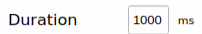
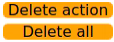
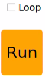
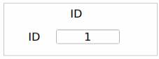
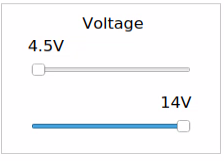
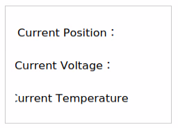

# 11.  ROS2-Robot Arm Basic Control User Manual 

## 11.1 Servo Control Node

The robot arm is equipped with 6 servos, utilizes Jetson Orin Nano as the controller, employs an STM32 microcontroller for communication, and implements servo control through the serial port. To facilitate and standardize servo control, it is essential to establish a ROS node as the interface for each servo.


### 11.1.1**Introduction to Servo Control Node**

* **Preparation**

(1)Assemble the robot arm according to the tutorial stored in [1. Getting Ready->1. 2 Hardware Installation and Guidelines]()

(2)Start the robot arm according to the tutorial saved in [1. Getting Ready->1.3 Initial Startup Instructions]()

(3)Access the robot arm system desktop according to the tutorials locating in [1. Getting Ready->1.6 Development Environment Setup and Configuration]()

* **Initiate Servo Control Node**

(1)Click on  to open the terminal, then execute the following command to disable the auto-start service.

```python
sudo systemctl stop start_app_node.service
```

(2)Run the command to initiate the robot arm SDK file.

```python
ros2 launch sdk jetarm_sdk.launch.py
```

(3)Open a new terminal  and run the command to display the topics published after the initiation of the robot arm node.

```python
ros2 topic list
```


### 11.1.2 **Servo Control Through Topic**

* **Terminal Control**

Open a new terminal, and execute the following command.

```python
ros2 topic pub /ros_robot_controller/bus_servo/set_position ros_robot_controller_msgs/msg/ServosPosition '{"position": [{"id": 1, "position": 700}]}'
```

The program will print the following three parameters:

`servo_id`: The ID of the servo motor, which can be 1–5 or 10.

`position`: The angle of the servo motor, with a valid range of 0–1000 pulses.

For example, this configuration sets Servo 1 to rotate to a position of 700 pulses.


* **Python Control**

（1）Run the command to initiate the robot arm SDK file.

```python
ros2 launch sdk jetarm_sdk.launch.py
```

（2）Enter the command to start the example. You will see the robotic arm's Servo 4 rotating back and forth between angles 200 and 500, while the terminal displays servo-related topic information.

```python
python3 ~/ros2_ws/src/example/example/simple/include/bus_servo_node.py
```

* **Launch File Control**

（1）In the window where the robotic arm SDK file is running, press Ctrl+C to stop the launch file.

（2）Next, enter the command to start servo control (the bus_servo_node.py file is called in the launch file).

```python
ros2 launch example bus_servo.launch.py
```

（3）After starting the example, you will see the robotic arm's Servo 4 rotating back and forth between angles 200 and 500, and the terminal will display the servo topic information.


（4）If you want to terminate the game, use short-cut ‘**Ctrl+C**’. If the game cannot be stopped, please have a retry.

### 11.1.3 Initiate App Auto-Start Service

(1)After completing the example, you need to start the app service (failure to do so may affect the use of subsequent app features). In the terminal, enter the command, press Enter, and wait for a moment to start the app service.

```python
sudo systemctl start start_app_node.service
```

(2)The robot arm will return to the initial pose once the app service is initiated, and the buzzer will emit a ‘**beep**’ sound.

### 11.1.4 **Program Analysis**

* **Launch File Analysis**

The launch file locates in this folder, [/home/ubuntu/ros2_ws/src/example/example/simple/bus_servo.launch.py]()

The function `generate_launch_description` is used to generate the launch description.

{lineno-start=9}

```python
def generate_launch_description():
    compiled = os.environ['need_compile']
    
    if compiled == 'True':
        robot_controller_package_path = get_package_share_directory('ros_robot_controller')
    else:
        robot_controller_package_path = '/home/ubuntu/ros2_ws/src/driver/ros_robot_controller'
```

It includes sub-launch files.

{lineno-start=18}

```python
    robot_controller_launch = IncludeLaunchDescription(
        PythonLaunchDescriptionSource([os.path.join(robot_controller_package_path, 'launch/ros_robot_controller.launch.py')
        ]),
    )
```

Nodes are defined within the description, where:

①`package` specifies the package name,

②`executable` specifies the executable file,

③`output` defines the output for printed information.

{lineno-start=24}

```python
    bus_servo_node = Node(
        package='example',
        executable='bus_servo',
        output='screen',
            )
```

This function starts the system.

{lineno-start=35}

```python
if __name__ == '__main__':
    # Create a LaunchDescription object
    ld = generate_launch_description()

    ls = LaunchService()
    ls.include_launch_description(ld)
    ls.run()
```


* **Python Program Analysis**

The source code of the program is saved in [/home/ubuntu/ros2_ws/src/example/example/simple/include/bus_servo_node.py]()

The program logic flowchart is as below:


The diagram above illustrates the main structure of the program's logic flow, highlighting the division into basic function definitions and implementation logic. Initially, the necessary functions for servo control are established. In the main function, nodes are initialized, interrupt functions are activated to detect signals, and relevant bus servo topics are both published and received. This information is then relayed to the servo control function, enabling effective servo control. The upcoming document will follow the structure outlined in the program's logic flowchart above.

(1)Import Feature Package

①`time`: A standard Python module used to control time-related actions, such as delays.

②`rclpy`: The Python client library for ROS2, providing interfaces for interacting with the ROS2 system.

③`Node`: The rclpy.node.Node class is the basic node class in ROS2. Every ROS2 functional module must inherit from this class.

④`Trigger`: The Trigger service message type is imported from std_srvs.srv. It represents a simple trigger service request, often used to request a change in state.

⑤`ServoPosition`, `ServosPosition`: These are custom ROS message types representing the position of a single servo or multiple servos. They are defined in the ros_robot_controller_msgs.msg package.

{lineno-start=4}

```python
import time
import rclpy
from rclpy.node import Node
from std_srvs.srv import Trigger
from ros_robot_controller_msgs.msg import ServoPosition, ServosPosition
```


(2)ServoController Class

①`ServoController` class inherits from rclpy.node.Node, meaning it is a ROS2 node.

②`super().__init__('servo_control_demo')`: This calls the parent class constructor and sets the node's name to 'servo_control_demo'. It initializes the node and sets the servo position.

{lineno-start=10}

```python
class ServoController(Node):
    def __init__(self):
        super().__init__('servo_control_demo')
        self.pub = self.create_publisher(ServosPosition, '/ros_robot_controller/bus_servo/set_position', 1)

        #等待机械臂底层控制服务启动
        self.client = self.create_client(Trigger, '/ros_robot_controller/init_finish')
        self.client.wait_for_service()
```

①`duration`: The duration of the servo's movement.

②`positions`: A list of tuples containing the servo ID and target position. For example, ((4, 200),) indicates that servo with ID 4 should move to position 200.

③Create a `ServosPosition` message and populate it with data.

④`msg.duration = float(duration)`: Sets the duration for the servo movement.

⑤Iterate over the `positions` list, creating a `ServoPosition` message for each servo, setting its ID and target position, and adding these `ServoPosition` objects to the `position_list`.

⑥self.pub.publish(msg): Publish the servo position message to control the servos to reach the specified positions.

⑦self.get_logger().info(...): Log information about each servo's ID and target position.

{lineno-start=19}

```python
    def set_servo_position(self, duration, positions):
        msg = ServosPosition()
        msg.duration = float(duration)
        position_list = []
        for i in positions:
            position = ServoPosition()
            position.id = i[0]
            position.position = int(i[1])
            position_list.append(position)
        msg.position = position_list
        self.pub.publish(msg)
        for pos in position_list:
            self.get_logger().info(f'duration={msg.duration}, id={pos.id}, position={pos.position}')
```

（3）Main Function

①　`rclpy.init(args=args)`: Initializes the ROS2 client library.

②　`controller = ServoController()`: Creates an instance of the ServoController class, representing the node.

③　`except KeyboardInterrupt`: Catches the keyboard interrupt signal (Ctrl+C) to exit the loop gracefully.

④　`controller.destroy_node()`: Cleans up the ROS2 node when exiting the program.

⑤　`rclpy.shutdown()`: Shuts down the ROS2 client library.

Within the try block, the `controller.set_servo_position()` method is repeatedly called to change the servo positions.

{lineno-start=33}

```python
def main(args=None):
    rclpy.init(args=args)
    controller = ServoController()

    try:
        while rclpy.ok():
            controller.set_servo_position(0.5, ((4, 200),))  # 设置舵机 ID 4 到位置 200
            time.sleep(0.5)  # 等待 0.5 秒
            controller.set_servo_position(0.5, ((4, 500),))  # 设置舵机 ID 4 到位置 500
            time.sleep(0.5)  # 等待 0.5 秒
    except KeyboardInterrupt:
        pass
    finally:
        controller.destroy_node()  # 清理节点
        rclpy.shutdown()  # 关闭 ROS 2
```


## 11.2 LED Control Node

STM32 controller includes a LED. The STM32 control board is fitted with an LED. Using the Jetson Orin NX as the main controller, we establish communication with the STM32 microcontroller to control the LED through serial communication. For convenient and standardized LED control, it is essential to set up a ROS node as the interface.

### 11.2.1 Introduction to LED Control Node

* **Preparation**

(1)Assemble the robot arm according to the tutorial stored in [1. Getting Ready->1. 2 Hardware Installation and Guidelines]()

(2)Start the robot arm according to the tutorial saved in [1. Getting Ready->1.3 Initial Startup Instructions]()

(3)Access the robot arm system desktop according to the tutorials locating in [1. Getting Ready->1.6 Development Environment Setup and Configuration]()

* **Initiate LED Control Node**

(1)Click on  to open the terminal, then execute the command to disable the auto-start service.

```python
sudo systemctl stop start_app_node.service
```

(2)Execute the command to initiate the robot arm SDK file.

```python
ros2 launch sdk jetarm_sdk.launch.py
```

(3)Open a new terminal and run the command to display the topics published after the initiation of the robot arm node.

```python
rostopic list
```


|      **Topic**      |         **Function**          |
|:-------------------:|:-----------------------------:|
| /jetarm_sdk/set_led | Control LED to turn on or off |

### 11.2.2 **Control LED Through Topic**

* **Terminal Control**

(1)Open a new terminal, and execute the following command.

```python
ros2 topic pub --once /ros_robot_controller/set_led ros_robot_controller_msgs/msg/LedState "{id: 1,on_time: 0.1,off_time: 0.2,repeat: 10}"
```

The following four parameters can be obtained:

①`brightness`: LED ID. The ID of the LED on the STM32 controller is 1.

②`on_ticks`: The duration of LED illumination, measured in milliseconds.

③`0ff_ticks`: the duration of LED off time, measured in milliseconds.

④`repeat`: the cycle number of LED on and off.

(2)After the parameters are set, hit Enter key to run the program.


(3)When the program completes running, press '**Ctrl+C**' to exit. If the program cannot be stopped, you may need to retry.

* **Python Control**

(1)Enter the command to start the robotic arm SDK file.

```python
ros2 launch sdk jetarm_sdk.launch.py
```

(2)Run the command to initiate the game. The LED on STM32 controller will flicker ten times then go off. The following parameter settings will be printed on the terminal.

```python
python3 ~/ros2_ws/src/example/example/simple/include/led_node.py
```

* **Launch File Control**

(1)Press ‘**Ctrl+C**’ on the terminal where the robot arm SDK file is initiated to close the launch file.

(2)Next, enter the command to enable servo control (the LED.py file is called in the launch file).

```python
ros2 launch example led.launch.py
```

(3)After the game starts, the LED on the STM32 controller will flicker 10 times then go off. The terminal will print the following parameter settings.


(4)When the program completes running, press '**Ctrl+C**' to exit. If the program cannot be stopped, you may need to retry.

### 11.2.3 Initiate App Auto-Start Service

(1)After completing the example, you need to start the app service (failure to do so may affect the use of subsequent app features). In the terminal, enter the command, press Enter, and wait for a moment to start the app service.

```python
sudo systemctl start start_app_node.service
```

(2)The robot arm will return to the initial pose once the app service is initiated, and the buzzer will emit a ‘**beep**’ sound.

### 11.2.4 Program Analysis

* **Launch File Analysis**

Launch file is saved in [/home/ubuntu/ros2_ws/src/example/example/simple/led.launch.py]()

(1)generate_launch_description Function:

{lineno-start=9}

```python
def generate_launch_description():
    compiled = os.environ['need_compile']

    if compiled == 'True':
        robot_controller_package_path = get_package_share_directory('ros_robot_controller')
    else:
        robot_controller_package_path = '/home/ubuntu/ros2_ws/src/driver/ros_robot_controller'


    robot_controller_launch = IncludeLaunchDescription(
        PythonLaunchDescriptionSource([os.path.join(robot_controller_package_path, 'launch/ros_robot_controller.launch.py')
        ]),
    )
```

①`generate_launch_description` is a function that defines and returns the launch description (LaunchDescription).

②`compiled = os.environ\['need_compile'\]`: Retrieves the value of the environment variable need_compile (you can define it in the terminal using export need_compile=True).

③If need_compile is True, the function uses `get_package_share_directory('ros_robot_controller')` to get the path of ros_robot_controller in ROS2. If need_compile is not True, it uses the default path: /home/ubuntu/ros2_ws/src/driver/ros_robot_controller

④`IncludeLaunchDescription`: Allows including other ROS2 launch files within the current launch file. In this code, the robot_controller_launch action includes and executes the ros_robot_controller.launch.py launch file.

(2)The LED node is started.

{lineno-start=25}

```python
    led_node = Node(
        package='example',
        executable='led',
        output='screen',
            )

    return LaunchDescription([
        robot_controller_launch,
        led_node
    ])
```

(3)The service is launched.

{lineno-start=9}

```python
if __name__ == '__main__':
    # 创建一个LaunchDescription对象
    ld = generate_launch_description()

    ls = LaunchService()
    ls.include_launch_description(ld)
    ls.run()
```

* **Python Program Analysis**

The source code is stored in [/home/ubuntu/ros2_ws/src/example/example/simple/include/led_node.py]()

The program logic flowchart is as below:


The program's logic flow, as illustrated above, is mainly categorized into basic function definitions and implementation logic. Initially, the functions required for LED control are defined. Subsequently, within the main function, nodes are initialized, interrupt functions are activated to detect interrupt signals, and relevant topics for the LED are both published and received. The control of the LED is accomplished by configuring parameters related to LED information. The forthcoming document will adhere to the program's logic flowchart outlined above.

(1)Import Feature Package

①`rclpy`: The ROS2 Python client library, which provides functions for interacting with ROS2 nodes, publishing messages, and calling services.

②`Node`: The base class for creating ROS2 nodes in ROS2.

③`Trigger`: A ROS2 service message type used to call a service without any input or output (i.e., a trigger service).

④`LedState`: A custom message type used to describe the state of an LED light.

{lineno-start=4}

```python
import rclpy
from rclpy.node import Node
from std_srvs.srv import Trigger
from ros_robot_controller_msgs.msg import LedState
```

(2)LedController Class

①Initialize the node.

{lineno-start=10}

```python
    def __init__(self):
        super().__init__('led_controller')
```

②Create a topic publisher and wait for the robotic arm's lower-level services to start before publishing the LED state information.

{lineno-start=12}

```python
        self.publisher = self.create_publisher(LedState, '/ros_robot_controller/set_led', 10)
        
        #等待机械臂底层控制服务启动
        self.client = self.create_client(Trigger, '/ros_robot_controller/init_finish')
        self.client.wait_for_service()

        # 发布消息
        self.publish_led_state()
```

③Publish the LED state information.

{lineno-start=21}

```python
    def publish_led_state(self):
        msg = LedState()
        msg.id = 2
        msg.on_time = 0.1
        msg.off_time = 0.5
        msg.repeat = 10

        self.publisher.publish(msg)
        self.get_logger().info(f'Published LED State: id={msg.id}, on_time={msg.on_time}, off_time={msg.off_time}, repeat={msg.repeat}')
```

This function creates and sets the LedState message, which includes the following fields:

①`id`: The LED's ID, set to 2.

②`on_time`: The duration the LED stays on, set to 0.1 seconds.

③`off_time`: The duration the LED stays off, set to 0.5 seconds.

④`repeat`: The number of times the LED blinks, set to 10.

The message is then published using `self.publisher.publish(msg)`, and the message content is logged. The LED parameters are set to make the LED blink.

(3)Main Function

```python
def main(args=None):
    rclpy.init(args=args)
    led_controller = LedController()

    rclpy.spin_once(led_controller)  # 发布一次
    rclpy.shutdown()
```

① `rclpy.init(args=args)`: Initializes the ROS2 client.

② `led_controller = LedController()`: Creates an instance of the LedController class.

③ `rclpy.spin_once(led_controller)`: Calls spin_once once to publish a message and handle the callback function.

④ `rclpy.shutdown()`: Shuts down the ROS2 client.

- **Buzzer Control Node**

The STM32 control board has an onboard buzzer. We use the Jetson Orin Nano as the main control board, with communication handled by the STM32 microcontroller via serial port to control the buzzer. To make buzzer control more convenient and standardized, we need to set up a ROS node as an interface for the buzzer.

## 11.3 Buzzer Control Node

### 11.3.1 Introduction to Buzzer Node

* **Preparation**

(1)Assemble the robot arm according to the tutorial stored in [1. Getting Ready->1. 2 Hardware Installation and Guidelines]()

(2)Start the robot arm according to the tutorial saved in [1. Getting Ready->1.3 Initial Startup Instructions]()

(3)Access the robot arm system desktop according to the tutorials locating in [1. Getting Ready->1.6 Development Environment Setup and Configuration]()

* **Initiate Buzzer Control Node**

(1)Click on  to open the terminal, then execute the command to disable the app auto-start service.

```python
sudo systemctl stop start_app_node.service
```

(2)Run the command to initiate the robot arm SDK file.

```python
ros2 launch sdk jetarm_sdk.launch.py
```

(3)Open a new terminal and run the command to display the topics published after the initiation of the robot arm node.

```python
ros2 topic list
```


|            **Topic**             |           **Function**           |
|:--------------------------------:|:--------------------------------:|
| /ros_robot_controller/set_buzzer | Control buzzer to turn on or off |

### 11.3.2 Buzzer Control Through Topic

* **Terminal Control**

(1)Open a new terminal and execute the following command.

```python
ros2 topic pub --once /ros_robot_controller/set_buzzer ros_robot_controller_msgs/msg/BuzzerState "{freq: 1900, on_time: 0.1,off_time: 0.2,repeat: 10}"
```

You can set four parameters:

①freq: The frequency of the buzzer, ranging from 2 to 4 kHz. The higher the frequency, the higher the pitch.

②on_ticks: The duration the buzzer sounds, in milliseconds. In this case, it is set to 100 ms.

③ff_ticks: The duration the buzzer remains silent after sounding, in milliseconds.

④repeat: The number of times the buzzer repeats the sound and silence cycle.

(2)After the parameters are all set, hit Enter to run the program.


(3)When the program completes running, press 'Ctrl+C' to exit. If the program cannot be stopped, you may need to retry.

* **Python Control**

(1)Enter the command to start the function. You will hear the buzzer beep ten times and then stop. Meanwhile, the buzzer's parameter information will be displayed in the terminal.

```python
python3 ~/ros2_ws/src/example/example/simple/include/buzzer_node.py
```


* **Launch File Contro**l

(1)Press ‘**Ctrl+C**’ on the terminal where the robot arm SDK file is initiated to close the launch file.

(2)Execute the following command to start servo control. The **buzzer.py** file is invoked in the launch file.

```python
ros2 launch example buzzer.launch.py
```

(3)After the game starts, the buzzer on the STM32 controller will emit ten ‘beep’ sounds, then become silent. The buzzer parameters will be printed on the terminal.

(4)When the program completes running, press '**Ctrl+C**' to exit. If the program cannot be stopped, you may need to retry.

### 11.3.3 Initiate App Auto-Start Service

(1)After completing the example, you need to start the app service (failure to do so may affect the use of subsequent app features). In the terminal, enter the command, press Enter, and wait for a moment to start the app service.

```python
sudo systemctl start start_app_node.service
```

(2)The robot arm will return to the initial pose once the app service is initiated, and the buzzer will emit a ‘**beep**’ sound.

### 11.3.4 Program Analysis

* **Launch File Analysis**

The launch file is saved in

[/home/ubuntu/ros2_ws/src/example/example/simple/buzzer.launch.py]()

(1)generate_launch_description function:

{lineno-start=9}

```python
def generate_launch_description():
    compiled = os.environ['need_compile']

    if compiled == 'True':
        robot_controller_package_path = get_package_share_directory('ros_robot_controller')
    else:
        robot_controller_package_path = '/home/ubuntu/ros2_ws/src/driver/ros_robot_controller'


    robot_controller_launch = IncludeLaunchDescription(
        PythonLaunchDescriptionSource([os.path.join(robot_controller_package_path, 'launch/ros_robot_controller.launch.py')
        ]),
    )
```

①`generate_launch_description`: This function is responsible for defining and returning a launch description (LaunchDescription).

②`compiled = os.environ['need_compile']`: Retrieves the value of the need_compile environment variable. You can define this variable in the terminal using the command export need_compile=True.

③If need_compile is set to True, the `get_package_share_directory('ros_robot_controller')` function is used to obtain the path to the ROS2 package ros_robot_controller. If need_compile is not set to True, a default path (/home/ubuntu/ros2_ws/src/driver/ros_robot_controller) is used instead.

④`IncludeLaunchDescription`: This feature allows including other ROS2 launch files within the current launch file. In this code, the robot_controller_launch action includes and executes the ros_robot_controller.launch.py launch file.

(2)buzzer_node node definition:

{lineno-start=23}

```python
    buzzer_node = Node(
        package='example',
        executable='buzzer',
        output='screen',
            )
```

(3)Main function:

{lineno-start=34}

```python
if __name__ == '__main__':
    # 创建一个LaunchDescription对象
    ld = generate_launch_description()

    ls = LaunchService()
    ls.include_launch_description(ld)
    ls.run()
```

①Call `generate_launch_description()`: This function generates a LaunchDescription object.

②Create a `LaunchService` instance: The LaunchService is responsible for executing the launch file.

③Include the` LaunchDescription` in the service: Use `ls.include_launch_description(ld)` to add the LaunchDescription object to the launch service.

④Run the launch service: Finally, call `ls.run() `to execute the launch.

* **Program Analysis**

The source code is saved in [/home/ubuntu/ros2_ws/src/example/example/simple/include/buzzer_node.py]()

The program logic flowchart is depicted as below:


From the diagram above, the program's logic flow is primarily divided into basic function definitions and implementation logic. First, the functions needed to control the buzzer are defined. Then, in the main function, nodes are initialized, interrupt functions are activated to detect interrupt signals, relevant topics for the buzzer are published and received. Buzzer control is then achieved by configuring parameters related to the buzzer information. The content of the following document will be written following the aforementioned program logic flowchart.

- **Import Feature Package**

{lineno-start=5}

```python
import time
import rclpy
from rclpy.node import Node
from std_srvs.srv import Trigger
from ros_robot_controller_msgs.msg import BuzzerState
```

(1)`time`: Used to configure delays.

(2)`rclpy`:The ROS2 Python client library that provides functionality for creating and managing ROS2 nodes and communication.

(3)`Node`: A base class used for creating ROS2 nodes.

(4)`Trigger`: A standard service type in ROS2, typically used for sending simple requests and responses without parameters or return values.

(5)`BuzzerState`: A custom message type designed to configure the state of the buzzer.

- **BuzzerController Class**

(1)Initialize the node.

{lineno-start=12}

```python
    def __init__(self):
        super().__init__('buzzer_controller')
```

(2)Create a topic publisher and wait for the robotic arm's underlying control service to start.

{lineno-start=14}

```python
        self.pub = self.create_publisher(BuzzerState, '/ros_robot_controller/set_buzzer', 1)

        #等待机械臂底层控制服务启动
        self.client = self.create_client(Trigger, '/ros_robot_controller/init_finish')
        self.client.wait_for_service()
```

(3)set_buzzer method:

{lineno-start=20}

```python
    def set_buzzer(self, freq, on_time, off_time, repeat):
        msg = BuzzerState()
        msg.freq = freq
        msg.on_time = on_time
        msg.off_time = off_time
        msg.repeat = repeat
        
        # 发布消息
        self.pub.publish(msg)
        self.get_logger().info(f'Published BuzzerState: freq={msg.freq}, on_time={msg.on_time}, off_time={msg.off_time}, repeat={msg.repeat}')
```

①`freq`: Frequency of the buzzer (in Hz)

②`on_time`: Duration for which the buzzer remains active (in seconds)

③`off_time`: Duration for which the buzzer remains silent (in seconds)

④`repeat`: Number of times the buzzer cycles between active and silent states

(4)Main function:

{lineno-start=31}

```python
def main(args=None):
    rclpy.init(args=args)
    controller = BuzzerController()

    # 发送蜂鸣器状态
    controller.set_buzzer(freq=1500, on_time=0.1, off_time=0.5, repeat=10)
    time.sleep(5)
    controller.destroy_node()  # 清理节点
    rclpy.shutdown()  # 关闭 ROS 2
```

①`rclpy.init(args=args)`: Initializes the ROS2 Python client library

②`controller = BuzzerController()`: Creates a \`BuzzerController\` object and starts the node

③`controller.set_buzzer(...)`: Invokes the set_buzzer method to configure the buzzer with the following parameters:

\- Frequency: 1500 Hz

\- Active duration: 0.1 seconds

\- Silent duration: 0.5 seconds

\- Repeat count: 10 times

④`time.sleep(5)`: Pauses the program for 5 seconds to ensure the buzzer has enough time to complete its operation

⑤`controller.destroy_node()`: Cleans up the node and releases resources

⑥`rclpy.shutdown()`: Shuts down the ROS2 client and ends the ROS2 session

## 11.4 PC Software Control

### 11.4.1 Introduction to PC Software Function

The upper computer corresponds to the lower computer, used to send instructions to the lower computer and receive feedback data from it. Generally, the upper computer is a computer, and it controls the lower computer through software running on the computer (i.e., upper computer software).

This section will introduce the interface and functions of the JetArm upper computer PC software.

* **Open PC Software through Icon**

Double-click  on the robot system desktop to open the PC software.

* **Open PC Software through Command**

(1) Open a new terminal, and execute the command to navigate to the directory.

```python
cd arm_pc
```

(2) Run the command to open the PC software.

```python
python3 main.py
```

* **Introduction to PC Software Interface**

The interface of the PC software is divided into 4 areas:

①: Servo control zone

②: Action list

③: Action group setting zone

④: Deviation setting zone


The introduction to each section's function within the PC software is outlined as follows:

①: Servo Control Zone

In this zone, you can change the servo’s position through dragging the sliders.

|                           **Icon**                           |                         **Function**                         |
| :----------------------------------------------------------: | :----------------------------------------------------------: |
|  |                           Servo ID                           |
|  | Adjust servo’s position. The minimum value is 0, and the maximum value is 1000. |
|  | Adjust the servo deviation. The minimum value is -125, and the maximum value is 125. |

②：Action List

The action list include the information, such as action group NO., duration and location of each servo.


|                           **Icon**                           |                         **Function**                         |
| :----------------------------------------------------------: | :----------------------------------------------------------: |
|  |                       Action group NO.                       |
|  | The duration of the execution of the action group, measured in millisecond |
|  | Corresponding servo position value. You can directly double click the value  to modify |

③：Action Group Setting Zone

In action group setting zone, you can add, delete, update, insert, run, open and integrate the action group.

<table>
<colgroup>
<col  />
<col  />
</colgroup>
<tbody>
<tr>
<td ><strong>Icon</strong></td>
<td ><strong>Function</strong></td>
</tr>
<tr>
<td ></td>
<td >The time required for executing each action group. You can directly click  for modifications</td>
</tr>
<tr>
<td ></td>
<td >The time required for executing all action groups</td>
</tr>
<tr>
<td ></td>
<td >Upon clicking this icon, the robot servo will deactivate, causing the joints to loosen. Subsequently, you can manually design the robot's actions by dragging the servo</td>
</tr>
<tr>
<td ></td>
<td >Retrieve the manually set servo position. This function should be utilized in conjunction with the 'Manual' icon</td>
</tr>
<tr>
<td ></td>
<td >Append the current servo value, configured in the servo control area, to the bottom of the action list to create a new action</td>
</tr>
<tr>
<td ></td>
<td ><p>Delete action: Delete the selected action in the action list</p>
<p>Delete all: Delete all actions in the action list</p></td>
</tr>
<tr>
<td ></td>
<td >Replace the selected servo parameter in the action list with the current value set in the servo control zone. Additionally, substitute the Time with the corresponding value set in the </td>
</tr>
<tr>
<td ></td>
<td >Insert one action above the selected action in the action list. The value of inserted action is the same as that set in servo control area. And the <strong>Time</strong> is the same as </td>
</tr>
<tr>
<td ></td>
<td >Move the selected action to the previous line</td>
</tr>
<tr>
<td ></td>
<td >Move the selected action to the next line</td>
</tr>
<tr>
<td ></td>
<td >Execute the actions in the action list once. If "Loop" is selected, the actions will run in a continuous loop</td>
</tr>
<tr>
<td ></td>
<td >Open the necessary action group file and load its data into the action list. Save action group files in the following directory: /home/hiwonder/arm_pc/ActionGroups</td>
</tr>
<tr>
<td ></td>
<td >Save the actions in the action list to the designated path: /home/hiwonder/arm_pc/ActionGrourps）</td>
</tr>
<tr>
<td ></td>
<td >First, click  to open an action group, and then use  to open another action group. Subsequently, integrate the two action groups</td>
</tr>
<tr>
<td ></td>
<td >Display the action groups saved in PC software</td>
</tr>
<tr>
<td ></td>
<td >Refresh the selected action group</td>
</tr>
<tr>
<td ></td>
<td >Delete the selected action group file</td>
</tr>
<tr>
<td ></td>
<td >(<strong>⚠</strong>) Delete all the action group files</td>
</tr>
<tr>
<td ></td>
<td >Execute the selected action group once</td>
</tr>
<tr>
<td ></td>
<td >Stop running action group</td>
</tr>
<tr>
<td ></td>
<td >Exit the PC software</td>
</tr>
</tbody>
</table>


④：Deviation Setting Zone (Optional: This area is for informational purposes. As the robot's deviation has been corrected before delivery, manual deviation adjustment is unnecessary if the robot is functioning properly. For more information on deviation adjustment, please refer to '4.4 Deviation Adjustment').

|                           **Icon**                           |                 **Function**                 |
| :----------------------------------------------------------: | :------------------------------------------: |
|  |        Read the saved deviation vale         |
|  | Download the adjusted deviation to the robot |
|  |      Reset all servos’ position to 500       |

### 11.4.2 Editing & Calling Action 

* **Action Editing**

Click-on  on the robot system desktop to open the PC software.

**Step 1:** Click-on the 'Reset Servo' button to reset the robot arm's pose. Next, adjust the sliders to set the servo values as shown in the picture below. Once done, click on 'Add Action' to include this action in the action list.


**Step 2**: Set the duration to 800ms, then click on the '**Update Action**' button to synchronize the time.


**Step 3:** configure the ID1 servo to enable the robot arm to rotate left. Then click-on ‘**Add Action**’ button to add this action to the action list. The duration remains the same, 800ms.


**Step 4:** Add a transitional action. Select NO.2 action and set the duration to 200ms, then click-on ‘**Add Action**’.


**Step 5:** Enable the robot arm to move to the right by adjusting the slider for the ID1 servo as shown below. Set the time to 800ms and then click on the '**Add Action**' icon.


**Step 6:** Add a transitional action. Select NO.4 action, set the duration to 200ms, then click-on ‘**Add Action**’ button.


**Step 7:** Control the gripper to close and open. Adjust the value of NO.10 servo, set the duration to 400ms, and click-on **‘Add Action’** button.


**Step 8:** Add a transitional action. Set the duration to 200ms, and click-on ‘Add Action’ icon.


**Step 9:** Adjust the servo values as the picture below shown to adjust the gripper.


* **Saving Action**

For ease of later debugging and management, you can save the action file. Click-on the '**Save Action File**' button and select this folder '**/home/ubuntu/arm_pc/ActionGrourps**,'. After naming the action file, click-on ‘**Save**’ button.


* **Action Group Calling**

(1) Open a new command-line terminal, and execute the following command to navigate to the directory containing source code.

```
cd arm_p
```

(2) Execute the command to open the source code file.

```
vim control_demo.py
```

(3) Enter the action group name within the single quotation marks. Note: The program can only access the action group files saved in the '**ActionGroups**' folder. **The name entered within the single quotation marks should not include the suffix.**


(4) Execute the command to run the program, and invoke the set action groups.

```
python3 control_demo.py
```

### 11.4.3 Integrate Action Groups

**Step 1:** Access the robot system desktop, and open JetArm PC software.


**Step 2:** click-on ‘Integrate File’ button to navigate to the folder ‘**/home/ubuntu/arm_pc/ActionGrourps**’, and double-click ‘**spin.d6a**’ to open it.


**Step 3:** the selected action will be added to the action list.


**Step 4**: click-on ‘**Integrate File**’ icon, and double-click ‘**myaction.d6a**’ to open. Then, these two action files are integrated into one.


**Step 5:** click-on NO.1 action, then click-on ‘Run’ button to enable the robot arm perform the integrated action.


**Step 6:** Click the '**Save Action File**' button to save the combined action group for easier debugging in the future.


### 11.4.4 Deviation Adjustment

During using the robot, if there is deviation in the rotation axis of the servo due to changing servos or other operations, it is necessary to perform deviation debugging. Deviation can be categorized into small and large deviations, and the debugging methods vary accordingly based on the specific situation.

* **Preparation**

(1) Start the robot arm according to the instructions provided in [1. Getting Ready(JetArm User Manual)->4. Initial Startup Instructions]() .

(2) Access the robot system desktop according to the tutorials provided in this folder [1. Getting Ready(JetArm User Manual)->1.6 Development Environment Setup and Configuration]().

* **Judging Deviation**

(1) Click-on  on the robot system desktop to open the PC software.

(2) Click-on **‘Reset Servo’** to reset the robot arm’s pose.


(3) After the robot arm resets servo, the main shaft screws of robotic arm servos 2 to 4 align in a straight line, as illustrated in the diagram below:


(4) The marking on the pan-tilt should align with the marking on the metal shell.


(5) If the metal casing above servo 5 and the camera casing display parallel lines, and the gripper is slightly open, as illustrated in the diagram on the right below, it means that the robotic arm does not need deviation adjustment. Feel free to proceed to the next section.


(6) If the angle between the servo and the centerline is less than 30° (taking NO.3 servo as an example), it falls into the category of minor deviation. In such cases, you can rectify the deviation using PC software by following the instructions in [Minor Deviation Adjustment]().


:::{Note}

The angle between the servo and the centerline is determined by the following calculations:

* When adjusting the servo using the PC software, the slider range is from 0 to 1000, and the servo's rotatable range when powered is from 0 to 240 degrees. This means that 240/1000 equals 0.24 degrees, indicating that each unit of the slider corresponds to a servo rotation of 0.24 degrees.

* Regarding the adjustment of the small slider, its range is ±125. When converted to the adjustment range for minor deviation, it amounts to 125 \* 0.24 = 30°.

:::

(7) If the angle between the servo and the centerline exceeds 30° and the deviation cannot be corrected by adjusting the servo value within the limit range (±125, using NO.3 servo as an example), it is considered a large deviation. For detailed instructions, please consult  [Large Deviation Adjustment]().


* **Minor Deviation Adjustment**

(1) Launch the PC software, then click on the '**Reset Servo**' icon to reset the robotic arm's pose. Subsequently, click the '**Read Deviation**' button to transfer the deviation value to the PC software.


(2) Using ID3 servo adjustment as an example, after reading the deviation, adjust the deviation by dragging the slider of the ID3 servo.

:::{Note}

Minor deviation adjustment can be directly done by dragging the servo's deviation slider on the PC software. (please note that it is the small slider that adjusts the deviation).

:::

(3) Adjust the ID3 servo slider to align the robot arm into a straight line. The value indicated in the picture below is for reference purposes only. You should adjust the servo value according to the actual situation.


(4) Click-on ‘**Download Deviation**’ icon, and save the adjusted deviation data to the robot arm.


* **Large Deviation Adjustment**

To make significant deviation adjustments, the servo must be detached from the U-shaped bracket, centered, reinstalled, and, once the installation is complete, the steps for minor deviation adjustment should be repeated.

(1) Click-on ‘**Reset Servo**’ icon to reset the robot arm’s pose.


(2) At this point, you may notice a significant deviation in servo 2, with the deviation angle exceeding 30°.


(3) Switch off the robot arm. Please refrain from powering it on while detaching the parts.

(4) Remove all screws from the main servo horn of servo 2 and the main shaft screws on the sub-horn (start by removing the four outer screws of the horn, then proceed to the shaft screws).


(5) Detach the U-shape bracket.


(6) After detaching the bracket, initiate the robot and open the PC software, then click on the 'Reset Servo' icon. At this point, the position of the NO.3 servo is adjusted. Please securely hold the detached component to prevent the robotic arm from unintentionally returning to its initial position upon startup.


(7) After centering the servo, turn off the robot arm, and install the main servo horn and assistant servo horn in a 'cross' formation.


:::{Note}

The servo is now centered, so please refrain from forcibly manipulating the servo shaft. If the servo horn 'cross' is not correctly installed, repeat steps 5-7 in section 4.4.4 of this document.

:::

(8) Secure the bracket using screws, ensuring the holes are aligned.


(9) Power on the robot arm, and repeat the instructions provided in [Minor Deviation Adjustment]() to fine tune the deviation.

## 11.5 Use of Servo Debugging Tool

When replacing a servo, it is essential to utilize the servo debugging tool for configuring parameters such as ID and midpoint. Refer to the earlier section, '1.1 Introduction to Servo Control Node,' for information on servo ID numbers.

Prior to initiating servo debugging, please be aware that the servo interface can only be connected to a single servo. Connecting multiple servos in series will result in identical parameters for all servos, preventing individual control of each servo.

### 11.5.1 Introduction to Servo Debugging Tool Interface

(1) Access the robot system desktop according to the tutorials provided in [1. Getting Ready(JetArm User Manual) ->1.6 Development Environment Setup and Configuration]().

(2) Execute the following commands to check the files.

```
cd factory_utils/Bus_Servo_Tool
```

```
ls
```


(3) Next, enter the command to open the PC software. After opening, confirm that the bus servo interface is separately connected to a servo.

```
python3 main.py
```


(4) The function of each icon is detailed in the table below:


|                           **Icon**                           |                         **Function**                         |
| :----------------------------------------------------------: | :----------------------------------------------------------: |
|  |                 Read current servo parameter                 |
|  |                       Apply the change                       |
|  |                   Restore default settings                   |
|  | Set servo ID. The servo ID can be set within this range: 0~253 |
|  |                  Adjust the servo deviation                  |
|  |   Adjust the servo’s working temperature. 85℃ by default.    |
|  | Adjust the servo rotation range according to their specific needs. JetArm’s servo rotation range is from 0 to 1000. |
|  | Adjust servo’s working voltage range. Users can limit servo’s working voltage to protect the servo. The servo working voltage range of the servo is from 9 to 12.6V. |
|  | Display the servo’s current position, voltage and temperature. |
|  | Adjust the servo's rotation position by dragging the slider and pressing the Apply button. To return to the position of 500, press the ReSet button and then Apply. |

### 11.5.2 Servo Debugging Instructions

(1) Connect one servo to the servo port.


(2) Open the servo debugging tool.


(3) Click-on ‘**Read**’ button.


(4) Using the adjustment of ID3 servo as an example, set the servo ID. Other parameters can be left at their default values, or users can customize them based on their needs.


(5) Click-on Apply button to apply the change.


(6) After setting the servo ID, detach and assemble the servos according to the corresponding tutorials.