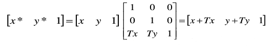
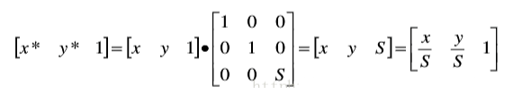
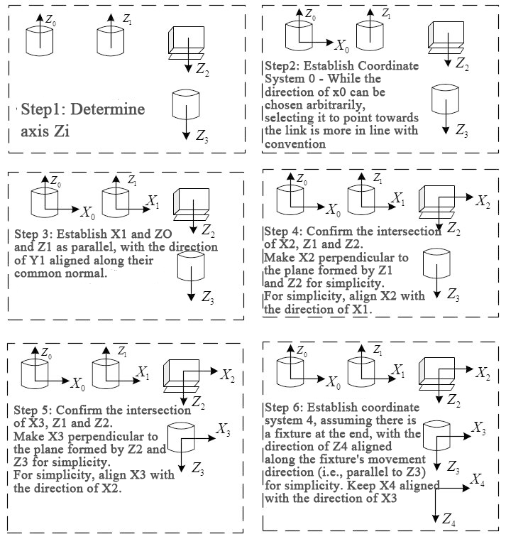

# 12. ROS1-Robot Arm Advanced Control Manual

## 12.1 Homogeneous Coordinates Transformation

### 12.1.1 Introduction to Homogeneous Coordinates 

Homogeneous coordinate transformation serves as a fundamental mathematical tool extensively applied in various domains, including computer graphics, robotics, and computer vision. Its purpose is to illustrate the transformation relationships between coordinate systems, with the primary goal of simplifying intricate geometric transformations like translation, rotation, scaling, and projection. This simplification allows for a more concise representation and computation of these transformations.

In a two-dimensional plane, a pair of coordinate values (x, y) is used to precisely denote a point's position. If the coordinates of a point before the transformation are (x, y), and after the transformation are (x\*, y\*), this transformation process can be succinctly expressed in the following matrix form:


The approach of expressing a two-dimensional vector through a three-dimensional vector, or more broadly, representing an n-dimensional vector with an (n+1)-dimensional vector, is known as homogeneous coordinate representation.

There is a 'one-to-many' relationship between ordinary coordinates and homogeneous coordinates:

Ordinary coordinates x h -\> Homogeneous coordinates

Homogeneous coordinates ➗ h -\> Ordinary coordinates

When h = 1, the obtained homogeneous coordinates are called 'normalized coordinates' because the first n coordinates correspond to n-dimensional coordinates in the ordinary coordinate system.

### 12.1.2 Homogeneous Coordinates Function

By adopting the homogeneous coordinate representation, it becomes possible to uniformly express a two-dimensional linear transformation in the following normalized form:


For a graphical object, its geometric relationships can be described using a vertex table, while its topological relationships can be captured using an edge table. Therefore, when it comes to the transformation of a graphical object, it ultimately boils down to altering the vertex table to effect the desired changes.

### 12.1.3 Transformation

* **Translation Transformation**

Translation involves moving point P along a straight path from one coordinate position to another.


The formula for homogeneous coordinates is as follows:



Translation is a rigid transformation that displaces an object without inducing deformation, ensuring that every point on the object moves by an equal amount of coordinates.

* **Ratio Transformation**


The formula for homogeneous coordinates is as follows:


The scaling factors Sx and Sy can take on any positive integer values. If the values are less than 1, the object's size will decrease. If the values exceed 1, the object will enlarge. Setting both values to 1 will maintain the object's original size.

(1) Sx = Sy ratio:


(2) Sx \<\> Sy ratio:


When Sx = Sy, the scaling transformation becomes a uniform scaling transformation, calculated using the following matrix:



* **Symmetrical Transformation**

Symmetric transformation, alternatively referred to as reflection or mirror transformation, produces an image that mirrors the original shape across a specific axis or the origin.


* **Rotation Transformation**

Two-dimensional rotation refers to the process of repositioning point P by rotating it around the coordinate origin at a certain angle θ (counterclockwise as positive, clockwise as negative) to obtain a new point P\*. The transformation equation for the rotation of point P is initially determined with the origin as the reference point.


## 12.2 DH Modeling

### 12.2.1 Introduction to DH Modeling

* **Introduction**

The DH modeling method is an approach for low-degree mechanism modeling based on homogeneous transformation matrices. It is commonly employed to describe the geometric relationships and kinematics between joints in robotic arms. DH modeling stands out as one of the standard methods in the field of mechanical engineering for establishing kinematic models of robotic arms. This modeling technique utilizes a set of parameters to illustrate the relative positions and motions between the joints of a robotic arm, facilitating calculations for both forward and inverse kinematics.

The fundamental concept behind DH modeling is to treat each joint of the robotic arm as a continuous rigid body undergoing rotation or translation. Subsequently, a series of rotations and translations are utilized to simulate the overall motion of the entire robotic arm.

* **Function**

DH modeling is predominantly employed in the field of robot kinematics. This approach involves creating a coordinate system on each link and employing homogeneous coordinate transformations to facilitate the conversion of coordinates between two links. In systems with multiple interconnected links, the iterative use of homogeneous coordinate transformations enables the establishment of the relationship between the initial and final coordinate systems.

* **DH Modeling Operations**

(1) List


(2) Modeling

① Set the initial position and designate labels for the links and joints. Generally, the initial position of a robotic arm is assumed to be fully extended upward, with the lateral joints oriented along the x-axis. The diagram on the right in the following image provides a visual representation of the link structure.


② Verify the axis lines of each joint and the z-axis. The axis lines represent the axes along which each joint rotates or moves. The z-axis corresponds to the current axis line, with an arbitrary direction (in this case, opposite to the motor rotation direction is chosen). The notation for the subscripts may differ between the two methods, so it's important to pay attention to the sign of the subscripts. The subscript on the z-axis indicates which coordinate system it belongs to.


(3) Set Coordinate System for Each Joint

Begin by locating the origin of the {i} coordinate system and determining the x_i axis. In SDH, if the axis lines of {i} and {i-1} intersect, the intersection point becomes the origin. The x_i axis lies on the perpendicular bisector of the plane formed by the two axis lines, with an arbitrary direction. If the axis lines do not intersect, the origin is set at the point of intersection between the common perpendicular and the current joint axis {i}. The x_i axis then lies along this common perpendicular, with an arbitrary direction. In MDH, if the axis lines of {i} and {i+1} intersect, the intersection point becomes the origin, and the x_i axis lies on the perpendicular bisector of the plane formed by the two axis lines, with an arbitrary direction. If the axis lines do not intersect, the origin is set at the point of intersection between the common perpendicular and the current joint axis {i}. The x_i axis then lies along this common perpendicular, with an arbitrary direction. As there can be numerous parallel axis lines and an infinite number of common perpendiculars, and the directions of x and z axes can be arbitrarily set, this results in many possible versions of the parameter model.

(4) Adding Initial and Final Coordinate Systems

In SDH, {0} is already designated, so {6} is added at the end. In MDH, {6} is already designated, so {0} is added at the beginning. The setting of coordinate systems at the initial and final ends depends on practical considerations and personal preferences.

The following describes the process of establishing coordinate systems.


:::{Note}

Given the substantial flexibility in selecting the z-axis, x-axis, and origin, the method outlined above represents just one of several possible approaches to establishing coordinate systems. Decisions regarding how to establish coordinate systems should be guided by individual circumstances and considerations.

:::

(5) Determining the 4 D-H Parameters

Refer to the table generated in the first step and fill in the values one by one. Initially, do not concern yourself with the subscripts on the parameters as it may lead to confusion. Both the SDH and MDH methods involve coordinate transformations from the preceding coordinate system to the next one. When writing the ith row, focus on the relationship between {i-1} and {i}. However, there is a difference in the order of parameters.

Here, we will use the example of the second row in the table. When i=2, we perform the coordinate transformation from {1} to {2}.

The order for SDH is θ → d → α → a.

Rotate the x\_{i-1} axis of coordinate system {i-1} about the z\_{i} axis to align with the x\_{i} axis. The rotation angle is θ\_{i}, with the right-hand rule defining the positive direction as the z-axis.

① Translate the x\_{i-1} axis along the z\_{i-1} axis to the x\_{i} axis by a distance of d\_{i}.

② Using the result of the previous transformation, rotate the z\_{i-1} axis of coordinate system {i-1} about the x\_{i-1} axis to align with the z\_{i} axis. The rotation angle is α\_{i}, with the right-hand rule defining the positive direction as the x-axis.

③ Translate the z\_{i-1} axis along the x\_{i-1} axis to the z\_{i} axis by a distance of a\_{i} until the two coordinate systems coincide.


Following the rules of SDH, the table below can be derived. In the diagram above, theta_2 is set to -90, but since it is a variable parameter, we designate it as q2.


The order for MDH is α → a → θ → d.

① Rotate the z\_{i-1} axis of coordinate system {i-1} about the x\_{i} axis to align with the z\_{i} axis. The rotation angle is α\_{i-1}, with the right-hand rule defining the positive direction as the z-axis.

② Translate the z\_{i-1} axis along the x\_{i-1} axis to the z\_{i} axis by a distance of a\_{i-1}.

③ Using the result of the previous transformation, rotate the x\_{i-1} axis of coordinate system {i-1} about the z\_{i-1} axis to align with the x\_{i} axis. The rotation angle is θ\_{i}, with the right-hand rule defining the positive direction as the x-axis.

④ Translate the x\_{i-1} axis along the z\_{i-1} axis to the x\_{i} axis by a distance of d\_{i}, until the two coordinate systems coincide.


Applying MDH rules, the table below can be generated. In the diagram above, theta_2 is assigned as 90, but as it is a variable parameter, we represent it as q2.


(6) Complete Table

Fill in the table based on the DH method model and engineering drawings. (The official two-dimensional drawings and three-dimensional model dimensions are inconsistent. Since the primary use is the three-dimensional model, I measured the three-dimensional drawings again myself.)




### 12.2.2 JetArm DH Model

(1) JetArm DH coordinate system:


(2) DH Model List:

Please refer to the file below:

[/home/jetarm/src/jetarm_driver/jetarm_kinematics/src/jetarm_kinematics/jetarm_6dof_params.py](../_static/source_code/12/jetarm_6dof_params.zip)

|  i  | αi-1 |     ai-1      | di  | θi  |    Θ Range    |
|:---:|:----:|:-------------:|:---:|:---:|:-------------:|
|  1  |  0   |       0       |  0  | θ1  | θ1(-120, 120) |
|  2  | -90  |       0       |  0  | θ2  |  θ2(-180, 0)  |
|  3  |  0   | 0.12941763737 |  0  | θ3  | θ3(-120, 120) |
|  4  |  0   | 0.12941763737 |  0  | θ4  | θ4(-200, 20)  |
|  5  | -90  |       0       |  0  | θ5  | θ5(-120, 120) |

## 12.3 Forward Kinematics Analysis

### 12.3.1 Introduction to Inverse Kinematics

* **Introduction**

Forward kinematics refers to the process of deriving the motion of the end effector from the joint movements of a robot. It involves calculating the position and orientation information of the end effector based on the joint coordinates of the robot.

Forward kinematics is easier to understand and implement because it directly calculates the position and orientation of the end effector from the robot's joint movements. In robot control, forward kinematics is widely used in trajectory planning, simulation, visualization, and other aspects.

* **Forward Kinematics Logic**

The forward kinematics of a robotic arm is typically expressed in the following functional form:


This equation indicates that the pose of the end effector is a function based on the joint coordinates. If expressed using homogeneous transformations, the expression is a simple product of individual link transformation matrices given by Equation (2). For N links in a robotic arm, the expression becomes:


For any robotic arm, regardless of the number and configuration of its joints, the forward kinematics solution can be calculated. The practical task space for most robotic arms is typically three-dimensional. Controlling the motion of a robotic arm involves providing specific voltage control signals to each joint, causing them to move to specific angles and achieve the desired pose. For a 6-axis robotic arm, the overall matrix transformation is often denoted as T6.

### 12.3.2 JetArm Forward Kinematics Analysis

|  i  | αi-1 |     ai-1      | di  | θi  |    Θ Range    |
|:---:|:----:|:-------------:|:---:|:---:|:-------------:|
|  1  |  0   |       0       |  0  | θ1  | θ1(-120, 120) |
|  2  | -90  |       0       |  0  | θ2  |  θ2(-180, 0)  |
|  3  |  0   | 0.12941763737 |  0  | θ3  | θ3(-120, 120) |
|  4  |  0   | 0.12941763737 |  0  | θ4  | θ4(-200, 20)  |
|  5  | -90  |       0       |  0  | θ5  | θ5(-120, 120) |

The homogeneous transformation matrix form of DH is as follows:


Obtain the homogeneous transformation matrix for a single joint of JetArm:

T(0-1)=\[\[Cθ1，-Sθ1，0，0\],\[Sθ1，Cθ1，0，0\],\[0，0，1，0\],\[0，0，0，1\]\]

T(1-2)=\[\[Cθ2，0，Sθ2，0\],\[0，1，0，0\],\[-Sθ2，0，Cθ2，0\],\[0，0，0，1\]\]

T(2-3)=\[\[Cθ3，-Sθ3，0，0\],\[Sθ3，Cθ3，0，0\],\[0，0，1，0\],\[0，0，0，1\]\]

T(3-4)=\[\[Cθ4，-Sθ4，0，0\],\[Sθ4，Cθ4，0，0\],\[0，0，1，0\],\[0，0，0，1\]\]

T(4-5)=\[\[Cθ5，0，Sθ5，0\],\[0，1，0，0\],\[-Sθ5，0，Cθ5，0\],\[0，0，0，1\]\]

Multiply the homogeneous coordinates of individual joints to obtain the forward kinematics formula for JetArm:

T(0-5)=T(0-1)\*T(1-2)\*T(2-3)\*T(3-4)\*T(4-5)

Due to the fact that the servos on joints 2, 3, and 4 of the robotic arm are all horizontally rotating, T(1-2), T(2-3), and T(3-4) can be simplified using the sum and difference formulas:

T(1-4) = T(1-2)\*T(2-3)\*T(3-4)=\[\[Cθ<sub>234</sub>，-Sθ<sub>234</sub>，0，Cθ<sub>23</sub>a<sub>3</sub>+Cθ<sub>2</sub>a<sub>2</sub>\],

\[ 0， 0， 1，0\],

\[-Sθ<sub>234</sub>，-Cθ<sub>234</sub>，0，-Sθ<sub>23</sub>a<sub>3</sub>-Sθ<sub>2</sub>a<sub>2</sub>\],

\[ 0， 0， 0， 1\]\]

Cθ<sub>234</sub> =cos(θ<sub>2</sub>+θ<sub>3</sub>+θ<sub>4</sub>)

Sθ<sub>234</sub>=sin(θ<sub>2</sub>+θ<sub>3</sub>+θ<sub>4</sub>)

According to the geometric relationship between the robot arm and joint, the following can be obtained.

T(1-4) =\[\[1，0，0，Cθ<sub>23</sub>a<sub>3</sub>+Cθ<sub>2</sub>a<sub>2</sub>\],

\[ 0， 0， 1，0\],

\[0，-1，0，-Sθ<sub>23</sub>a<sub>3</sub>-Sθ<sub>2</sub>a<sub>2</sub>\],

\[ 0， 0， 0， 1\]\]

The robotic arm kinematic formula is obtained as follows:

T(0-5)=\[ \[Cθ<sub>1</sub>Cθ<sub>5</sub>+Sθ<sub>1</sub>Sθ<sub>5</sub>，-Cθ<sub>1</sub>Sθ<sub>5</sub>+Sθ<sub>1</sub>Cθ<sub>5</sub>，0，Cθ1(Cθ<sub>23</sub>a<sub>3</sub>+Cθ<sub>2</sub>a<sub>2</sub>+a<sub>4</sub>)\],

\[Sθ<sub>1</sub>Cθ<sub>5</sub>-Cθ<sub>1</sub>Sθ<sub>5</sub>，-Sθ<sub>1</sub>Sθ<sub>5</sub>-Cθ<sub>1</sub>Cθ<sub>5</sub>， 1，Sθ1(Cθ<sub>23</sub>a<sub>3</sub>+Cθ<sub>2</sub>a<sub>2</sub>+a<sub>4</sub>)\],

\[ 0， 0， -1，-d<sub>5</sub>-Sθ<sub>23</sub>a<sub>3</sub>-Sθ<sub>2</sub>a<sub>2</sub>\],

\[ 0， 0， 0， 1\]\]

### 12.3.3 Introduction to Forward Kinematics Service

* **Preparation**

(1) Assemble the robot arm according to the tutorial stored in [1. Getting Ready->1.2 Hardware Installation and Guidelines](https://docs.hiwonder.com/projects/JetArm/en/latest/docs/1.Getting_Ready.html#hardware-installation-and-guidelines)

(2) Start the robot arm according to the tutorial saved in [1. Getting Ready->1.3 Initial Startup Instructions](https://docs.hiwonder.com/projects/JetArm/en/latest/docs/1.Getting_Ready.html#initial-startup-instructions)

(3) Access the robot arm system desktop according to the tutorials locating in [1. Getting Ready->1.6 Development Environment Setup and Configuration](https://docs.hiwonder.com/projects/JetArm/en/latest/docs/1.Getting_Ready.html#development-environment-setup-and-configuration)

* **Check Kinematics Service**

(1) Click-on  to open the command-line terminal, and execute the command below to disable the app auto-start service.

```
sudo systemctl stop start_app_node.service
```

(2) Execute the following command to initiate the robot arm SDK file.

```
ros2 launch sdk jetarm_sdk.launch.py
```

(3) Open a new terminal, and type the command below to access the robot arm kinematics service.

```
ros2 service list
```


| **Service** | **Function** |
|:--:|:--:|
| /kinematics/get_current_pose | Acquire robot's current pose |
| /kinematics/get_joint_range | Retrieve the motion range of each joint |
| /kinematics/get_link | Get joint link information of the robot |
| /kinematics/get_loggers | Retrieve the log information from the kinematics module |
| /kinematics/set_joint_range | Set the motion range of the robot's joints |
| /kinematics/set_joint_value_target | Set the angle of the target joint to achieve the pose control |
| /kinematics/set_link | Configure the joint linkage information for the robot |
| /kinematics/set_logger_level | Set the logging level for the kinematics module |
| /kinematics/set_pose_target | Set the target pose for the robot's end effector |

**Programe outcome**


### 12.3.4 Servo Control Topic

* **Invoke Service**

(1) Open a new terminal , and execute the command below.

```
ros2 service call /kinematics/set_joint_value_target kinematics_msgs/srv/SetJointValue "{joint_value: \[500.0, 400.0, 300.0, 400.0, 500.0 \]}"
```

(2) By inputting the rotation angles of servos 1-5, you can obtain the pose information of the robotic arm after movement. The information includes coordinates along the XYZ axes and the orientation represented using quaternions. 

:::{Note}

The service call here only displays the pose information; the robotic arm does not physically move.

:::


* **Programe outcome**


*  **Launch File Control**

(1) Press "**Ctrl+C**" to close the launch file on the terminal where robot arm SDK file and kinematics file are executed.

(2) Next, enter the command to start the forward kinematics service program. The robotic arm will calculate and move to the target position based on the configured servo pulse width. Relevant information will be displayed in the terminal.

```
ros2 launch example fk.launch.py
```


(3) If you want to terminate the program, press '**Ctrl+C**'. If the program fails to stop, please have retry.

* **Launch App Auto-Start Service**

(1) After completing the activity, you need to start the app service (failing to do so may affect subsequent app functionality). Enter the command in the terminal, press Enter to launch the app service, and wait briefly for it to initialize.

```
sudo systemctl start start_app_node.service
```

(2) After the app auto-start service is launched, the robot will restore initial pose and the buzzer will emit a 'beep' sound.

* **Program Analysis**

The source code is stored in [/home/ubuntu/ros2_ws/src/example/example/simple/include/fk.py](../_static/source_code/11/simple.zip)

The program's logical flowchart is illustrated in the diagram below.


As shown in the diagram, the program's logic is mainly divided into two parts: obtaining forward kinematics and calculating pulse width values. Following this, the calculated pulse width values are sent to the servo control function.

- **Import Feature Package**

Import the necessary module using the import statement.

{lineno-start=1}

```python
import rclpy
from rclpy.node import Node
import signal
from std_srvs.srv import Trigger
import kinematics.transform as transform
from kinematics.forward_kinematics import ForwardKinematics
from servo_controller_msgs.msg import ServoPosition, ServosPosition
```

(1) `rclpy`: The ROS2 Python client library, used to create nodes, communicate, and manage the ROS system.

(2) `Node`: The base class for nodes in ROS2, representing a functional module.

(3) `signal`: Used to handle signals and interrupts.

(4) `Trigger`: A service type in ROS2, typically used for simple request-response services without input or output parameters.

(5) `kinematics.transform`: A custom module (assumed to be defined in the kinematics package) containing functions related to kinematics, such as pulse width to angle conversion and quaternion to Euler angle conversion.

(6) `kinematics.forward_kinematics`: Another custom module that defines the ForwardKinematics class, used to compute the forward kinematics solution for the robotic arm.

(7) `servo_controller_msgs.msg`: Contains message types ServoPosition and ServosPosition for controlling servo positions.

- **Initialize Nodes**

{lineno-start=11}

```python
	    def __init__(self):
        super().__init__('fk_demo')  # Initialize the node. 初始化节点
```

Create an object named fk for forward kinematics calculations. This object will calculate the position of the robot's end effector.

{lineno-start=13}

```python
	        self.fk = ForwardKinematics(debug=True)
```

- **Set the Information Print on Terminal**

(1) Print the servo pulse width value on the terminal.

{lineno-start=15}

```python
        # Create a bus servo publisher. 创建总线舵机发布者
        self.servos_pub = self.create_publisher(ServosPosition, '/servo_controller', 1)

        # Wait for the underlying control service of the robotic arm to start. 等待机械臂底层控制服务启动
        self.client = self.create_client(Trigger, '/controller_manager/init_finish')
        self.client.wait_for_service()
        self.client = self.create_client(Trigger, '/kinematics/init_finish')
        self.client.wait_for_service()
```

(2) Print the radian value on the terminal.

{lineno-start=24}

```python
        # Output the pulse width value of the servo and the forward kinematic solution. 输出舵机脉宽值和正运动学解
        self.servo_list = [500, 400, 300, 400, 500]
        self.duration = 1.0
        self.get_logger().info("舵机脉宽值：{}".format(self.servo_list))

        pulse = transform.pulse2angle([i for i in self.servo_list])  # The pulse width value of the servo is converted to radian. 舵机脉宽值转为弧度
        self.get_logger().info("舵机脉宽值转为弧度：{}".format(pulse)) 
```

- **Obtain the Forward Kinematics Solution**

(1) Display the forward kinematics solution in the form of coordinate systems, quaternions, and Euler angles.

{lineno-start=31}

```python
        res = self.fk.get_fk(pulse)  # Obtain the forward kinematic solution. 获取运动学正解
        self.get_logger().info('正运动学解-坐标：{}'.format(res[0]))
        self.get_logger().info('正运动学解-四元数：{}'.format(res[1]))
	        self.get_logger().info('转换四元数成rpy：{}'.format(transform.qua2rpy(res[1])))

        self.set_servo_position(self.servos_pub, self.duration, self.servo_list)# Release the information of the servo and drive the robotic arm. 发布舵机信息，驱动机械臂
```

(2) set_servo_position method

{lineno-start=39}

```python
	    def set_servo_position(self, pub, duration, positions):
        msg = ServosPosition()
        msg.duration = float(duration)
        position_list = []
        for i in range(1, 6):
            position = ServoPosition()
            position.id = i
            position.position = float(positions[i-1])
            position_list.append(position)
        msg.position = position_list
        msg.position_unit = "pulse"
        
        pub.publish(msg)
```

① `msg.duration`: Sets the duration for servo control.

② `position_list`: Creates a ServoPosition message for each servo, which includes the servo's ID and target position (pulse width value).

③ `msg.position_unit = "pulse"`: Sets the servo position unit to pulse width.

④ `pub.publish(msg)`: Publishes the constructed ServosPosition message to the /servo_controller topic to control the robot arm.

- **Main Function**

 python3 main.pypython

{lineno-start=53}

```python
	def main(args=None):
    rclpy.init(args=args)  # Initialize rclpy. 初始化 rclpy
    fk_demo_node = FkDemo()  # Create a node. 创建节点
    rclpy.spin(fk_demo_node)  # Keep the node running. 保持节点运行
    fk_demo_node.destroy_node()  # Destroy node. 销毁节点
    rclpy.shutdown()  # Shutdown rclpy. 关闭 rclpy
```

## 12.4 Inverse Kinematics Analysis

### 12.4.1 Introduction

Inverse kinematics is the process of determining the parameters of the joints that need to be set to achieve a desired pose.

The inverse kinematics problem of a robotic arm is a crucial foundation for trajectory planning and control. The speed and accuracy of inverse kinematics solutions directly impact the precision of robotic arm trajectory planning and control. Therefore, for a six-degree-of-freedom robotic arm, designing a fast and accurate inverse kinematics solution is of utmost importance.

### 12.4.2 Analysis

For a robotic arm, inverse kinematics involves determining the rotation angles of each joint given the position and orientation of the gripper. The three-dimensional motion of a robotic arm can be quite complex. To simplify the model, we eliminate the rotation joint at the base, allowing us to perform kinematic analysis in a two-dimensional plane.

Inverse kinematic analysis typically involves extensive matrix computations, and the process is complex with significant computational requirements, making implementation challenging. To better suit our needs, we use a geometric approach to analyze the robotic arm.


We simplify the model of the robotic arm by removing the base pan-tilt and the end effector, focusing on the main body of the arm. From the diagram, we can see the coordinates (x, y) of the endpoint P of the robotic arm. Ultimately, it is composed of three parts (x1 + x2 + x3, y1 + y2 + y3).

In the diagram, θ1, θ2, and θ3 are the angles of the servos that we need to solve, and α is the angle between the gripper and the horizontal plane. From the diagram, it's evident that the top-down angle of the gripper α = θ1 + θ2 + θ3. Based on this observation, we can formulate the following equation:


The values of x and y are provided by the user, while l1, l2, and l3 represent the inherent mechanical properties of the robotic arm's structure.

For ease of calculation, we will preprocess the known components for a holistic consideration:


Substituting m and n into the existing equation and simplifying further, we can obtain:


Through calculation, we have:


We observe that the above expression is the quadratic formula for a single variable, where:


With this information, we can determine the angles θ1 and, similarly, calculate θ2. Consequently, we can determine the angles for all three servos. By controlling the servos based on these angles, we can achieve control over the coordinate position.

### 12.4.3 JetArm Inverse Kinematics Analysis

Solving for θ1:

θ1 = arctan(P<sub>y</sub>/P<sub>x</sub>) ={Cθ<sub>1</sub>(Cθ<sub>23</sub>a<sub>3</sub>+Cθ<sub>2</sub>a<sub>2</sub>+a<sub>4</sub>) / Sθ<sub>1</sub>(Cθ<sub>23</sub>a<sub>3</sub>+Cθ<sub>2</sub>a<sub>2</sub>+a<sub>4</sub>)}

Solving for θ2:

θ2 = arcsin(-(P<sub>z</sub>+d<sub>5</sub>) /√((Cθ<sub>3</sub>a<sub>2</sub>) \*(Cθ<sub>3</sub>a<sub>2</sub>) +( Sθ<sub>3</sub>a<sub>3</sub>) \*( Sθ<sub>3</sub>a<sub>3</sub>))-arctan(Sθ<sub>3</sub>a<sub>3</sub>/Cθ<sub>3</sub>a<sub>3</sub>+a<sub>2</sub>)

Solving for θ3:

θ3 = +-arccos((P<sub>z</sub><sup>2</sup>+P<sub>x</sub><sup>2</sup>+P<sub>y</sub><sup>2</sup>-2a<sub>4</sub>(Cθ<sub>1</sub>P<sub>x</sub>+Sθ<sub>1</sub>P<sub>y</sub>)+2P<sub>x</sub>d<sub>5</sub>+a<sub>4</sub><sup>2</sup>+d<sub>5</sub><sup>2</sup>-a<sub>2</sub><sup>2</sup>-a<sub>3</sub><sup>2</sup>)/(2a<sub>2</sub>a<sub>3</sub>))

Solving for θ4:

θ4 = -(θ2+θ3)

Solving for θ5:

θ5 = θ1-arctan(n<sub>y</sub>/n<sub>x</sub>) 

Inverse kinematics formula:


### 12.4.4 Introduction to Inverse Kinematics Service

* **Preparation**

(1) Assemble the robot arm according to the tutorial provided in [1. Getting Ready(JetArm User Manual)->1.2 Hardware Installation and Guidelines](https://docs.hiwonder.com/projects/JetArm/en/latest/docs/1.Getting_Ready.html#hardware-installation-and-guidelines).

(2) Start the robot arm according to the instructions provided in [1. Getting Ready(JetArm User Manual)->1.3 Initial Startup Instructions](https://docs.hiwonder.com/projects/JetArm/en/latest/docs/1.Getting_Ready.html#initial-startup-instructions).

* **View Kinematics Service**

(1) Click-on  to open the command-line terminal. Execute the command below to disable the auto-start service.

```
sudo systemctl stop start_app_node.service
```

(2) Execute the command below to launch robot arm SDK file.

```
ros2 launch sdk jetarm_sdk.launch.py
```

(3) Open a new command-line terminal, and run the command below to view the robot arm kinematics service.

```
ros2 service list
```


| **Service** | **Function** |
|:--:|:--:|
| /kinematics/get_current_pose | Acquire robot's current pose |
| /kinematics/get_joint_range | Retrieve the motion range of each joint |
| /kinematics/get_link | Get joint link information of the robot |
| /kinematics/get_loggers | Retrieve the log information from the kinematics module |
| /kinematics/set_joint_range | Set the motion range of the robot's joints |
| /kinematics/set_joint_value_target | Set the angle of the target joint to achieve the pose control |
| /kinematics/set_link | Configure the joint linkage information for the robot |
| /kinematics/set_logger_level | Set the logging level for the kinematics module |
| /kinematics/set_pose_target | Set the target pose for the robot's end effector |

**Programe outcome**


### 12.4.5 Servo Control Topic

* **Invoke Service**

(1) Open a new command line terminal, and execute the command below and complement the command using Tab key.

```
ros2 service call /kinematics/set_pose_target kinematics_msgs/srv/SetRobotPose "{position: \[0.35, 0.0, 0.24\], pitch_range: \[-180,180\], pitch: 10, resolution: 1 }"
```

(2) Enter the target position's xyz coordinates (must be of float type). The pitch represents the servo's pitch angle, with a range of (-180,180). The pitch_range denotes the angle range, also within (-180,180), and resolution adjusts the angle range, fixed at 1.0.

:::{Note}

If the set target position and angle cannot be successfully reached by the robotic arm, the corresponding servo information will not be displayed in the terminal. In this case, the service call only displays pose information, and the robotic arm does not move.

:::


* **Launch File Control**

(1) Press "**Ctrl+C**" to close the launch file on the terminal where robot arm SDK file and kinematics file are executed.

(2) Subsequently, input the command to initiate the forward kinematics service invocation program. You will witness the robotic arm calculating and maneuvering to the target position as per the configured servo pulse widths. Pertinent information will be presented in the terminal.

```
ros2 launch example ik.launch.py
```


(3) If you want to terminate the program, press '**Ctrl+C**'. If the program fails to stop, please have retry.

* **Launch App Auto-Start Service**

(1) Execute the following command on the terminal, and hit Enter to initiate the app service.

```
sudo systemctl start start_app_node.service
```

(2) After the app auto-start service is launched, the robot will restore initial pose and the buzzer will emit a 'beep' sound.

* **Program Outcome**

  

* **Program Analysis**

The source code is saved in [/home/ubuntu/ros2_ws/src/example/example/simple/include/ik.py](../_static/source_code/11/simple.zip)

The program's logical flowchart is illustrated in the diagram below.


As shown in the diagram, the program's logic is mainly divided into two parts: obtaining inverse kinematics and calculating pulse width values. Following this, the calculated pulse width values are sent to the servo control function.

- **Import Feature Package**

(1) Import the necessary module using the import statement.

{lineno-start=4}

```python
import time
import rclpy
from rclpy.node import Node
from std_srvs.srv import Trigger
import kinematics.transform as transform
from kinematics.forward_kinematics import ForwardKinematics
from kinematics.inverse_kinematics import get_ik
from servo_controller_msgs.msg import ServoPosition, ServosPosition
```

① ROS2 Library: `rclpy` is the ROS2 Python client library, used for creating nodes, communication, and handling services.

② Message Types: `ServoPosition` and `ServosPosition` are custom message types that represent the position of a single servo and the positions of multiple servos, respectively.

③ Kinematics Modules: `kinematics.transform` and `kinematics.forward_kinematics` reference a custom kinematics module used for performing robotic arm kinematics calculations, such as forward and inverse kinematics.

④ Service Type: `Trigger` is a service type commonly used to trigger or acknowledge events, such as initialization services.

- **Initialize Mode**

{lineno-start=16}

```python
    def __init__(self):
        super().__init__('ik_demo_node')
```

- **IkDemo Class**

(1)Constructor

{lineno-start=18}

```python
        self.coordinate = [0.35, 0.0, 0.24]
        self.servo_list = []
        self.duration = 1.0


        # Publish the topic of bus servo. 发布总线舵机话题
        self.servos_pub = self.create_publisher(ServosPosition, '/servo_controller', 1)

        # Wait for the underlying control service of the robotic arm to start. 等待机械臂底层控制服务启动
        self.client = self.create_client(Trigger, '/controller_manager/init_finish')
        self.client.wait_for_service()
        self.client = self.create_client(Trigger, '/kinematics/init_finish')
        self.client.wait_for_service()
```

① `self.coordinate`: Sets the target position of the end effector, i.e., the target coordinates of the robotic arm's end effector \[x, y, z\], with a value of \[0.35, 0.0, 0.24\].

② `self.servo_list`: Stores the pulse width values for the positions of each servo.

③ `self.duration`: Specifies the duration of the command, in seconds, controlling how long the servo position change will take.

④`self.servos_pub`: Creates a publisher to publish the `ServosPosition` message to the `/servo_controller` topic, driving the robotic arm's servos.

Additionally, a client service connection is created. `/controller_manager/init_finish` and `/kinematics/init_finish` are initialization services for the robotic arm's lower-level controller and kinematics module. The program waits for these services to start.

- **Obtain Kinematic Inverse Solutions**

Retrieve kinematic inverse solutions from '**get_ik**', convert the solutions into servo pulse width values, and store these values in the '**servo_list**' array.

{lineno-start=33}

```python
        # Obtain the inverse solution. 获取逆解
        self.get_logger().info(f"末端坐标：{self.coordinate}")
        res = get_ik(self.coordinate, 0, [-180, 180])
        if res != []:
            for i in range(len(res)):
                self.get_logger().info(f'rpy{i + 1}: {res[i][1]}')
                pulse = transform.angle2pulse(res[i][0])
                self.servo_list = pulse[0]
                for j in range(len(pulse)):
                    self.get_logger().info(f'舵机脉宽值{j + 1}: {pulse[j]}')

            self.set_servo_position(self.servos_pub, self.duration, self.servo_list)# Release the information of the servo and drive the robotic arm. 发布舵机信息，驱动机械臂
        else:
            self.get_logger().info("没有逆运动学解，请检查末端坐标")
```

- **set_servo_position Function**

{lineno-start=48}

```python
    def set_servo_position(self, pub, duration, positions):
        msg = ServosPosition()
        msg.duration = float(duration)
        position_list = []
        for i in range(1, 6):
            position = ServoPosition()
            position.id = i
            position.position = float(positions[i-1])
            position_list.append(position)
        msg.position = position_list
        msg.position_unit = "pulse"
        pub.publish(msg)
```

Function Description: This function packs the servo position (pulse width values) into a ServosPosition message and publishes it to the /servo_controller topic via self.servos_pub, which drives the servos of the robotic arm. The position of each servo is specified by the id and position attributes in the ServoPosition message.

- **Main Function**

The main function initializes and starts the ROS2 node.

{lineno-start=63}

```python
def main(args=None):
    rclpy.init(args=args)  # Initialize rclpy. 初始化 rclpy
    ik_demo_node = IkDemo()  # Create a node. 创建节点
    rclpy.spin(ik_demo_node)  # Keep the node running. 保持节点运行
    fk_demo_node.destroy_node()  # Destroy node. 销毁节点
    rclpy.shutdown()  # Shutdown rclpy. 关闭 rclpy
```