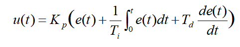
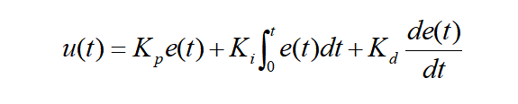

# 13.ROS2_OpenCVVisionCourse

## 13.1 **Positioning & Gripping**

### 13.1.1 Camera Calling

The camera functions as the eyes of the robot arm. The first step in implementing the gripping function is to capture the object through the camera. Subsequently, it will calculate the object's location for gripping and proper placement.

* **Initiate Camera Control Node**

:::{Note}

The input command should be case sensitive, and complement the keywords using Tab key.

:::

Start the robot arm, and access the robot system desktop using NoMachine. To get detailed instructions on remote control software connection, please refer to the tutorials saved in [1. Getting Ready->1.6 Development Environment Setup and Configuration]()

(1) Click-on  to open the command-line terminal, then execute the following command to disable the app auto-start service:

```
sudo systemctl stop start_app_node.service
```

(2) Execute the command below to launch the camera file.

```
ros2 launch example camera_topic_invoke.launch.py
```

(3) If you need to terminate the running program, press ‘Ctrl+C’. If the program fails to stop, please retry.

(4) To avoid the interference on the following app functions, please execute the command to initiate the app service. Once you hear a beep sound from the robot, the service has been restarted successfully.

```
sudo systemctl start start_app_node.service
```

* **Program Outcome**

The live camera feed will pop up.


* **Launch File Analysis**

The launch file is saved in this path:

[/home/ubuntu/ros2_ws/src/example/example/opencv/camera_topic_invoke.launch.py]()

(1) The launch_setup function is used to configure and return the nodes and files to be launched.

{lineno-start=9}

```python
def launch_setup(context):
    compiled = os.environ['need_compile']
    camera_type = os.environ['CAMERA_TYPE']
    if compiled == 'True':
        peripherals_package_path = get_package_share_directory('peripherals')
        example_package_path = get_package_share_directory('example')
    else:
        peripherals_package_path = '/home/ubuntu/ros2_ws/src/peripherals'
        example_package_path = '/home/ubuntu/ros2_ws/src/example'
    depth_camera_launch = IncludeLaunchDescription(
        PythonLaunchDescriptionSource(
            os.path.join(peripherals_package_path, 'launch/depth_camera.launch.py')),
    )      

```

① `compiled = os.environ['need_compile']`: Retrieves the need_compile environment variable to determine whether to compile or use the source code. The value of compiled determines the ROS2 package path.

② `camera_type = os.environ['CAMERA_TYPE']`: Retrieves the CAMERA_TYPE environment variable, though this variable is not used in this code segment.

③ Based on the value of compiled, either the ROS2 package share directory (using get_package_share_directory) or a local path (e.g., /home/ubuntu/ros2_ws/src/peripherals) is selected.

(2)Depth Camera Node Configuration

{lineno-start=23}

```python
    color_detect_node = Node(
        package='example',
        executable='camera_topic_invoke',
        output='screen',      
    )
```

Create a Node instance to launch an executable named camera_topic_invoke, which is located in the example package.

The output='screen' specifies that the output of this node will be displayed on the terminal (screen).

(3) generate_launch_description Function

{lineno-start=33}

```python
def generate_launch_description():
    return LaunchDescription([
        OpaqueFunction(function = launch_setup)
    ])
```

① `generate_launch_description` function creates and returns a LaunchDescription object, which defines all the nodes and configurations for the launch process.

② `OpaqueFunction(function=launch_setup)` indicates that the launch_setup function is embedded as an action within the launch file. This means that the content of the launch_setup function will be executed at runtime, dynamically configuring the nodes and files to be launched.

(4) Main Program

{lineno-start=38}

```python
if __name__ == '__main__':
    # Create a LaunchDescription object. 创建一个LaunchDescription对象
    ld = generate_launch_description()

    ls = LaunchService()
    ls.include_launch_description(ld)
    ls.run()
```

① Call `generate_launch_description() `to create a LaunchDescription object.

② Create a` LaunchService` object to manage the launch process.

③ Add the `LaunchDescription` to the `LaunchService` and start the launch process by calling ls.run().

* **Python code Analysis**

The source code file is saved in

[/home/ubuntu/ros2_ws/src/example/example/opencv/include/camera_topic_invoke.py]()

The program implementation logic is as pictured:


Following the program flowchart, the main function of the program involves processing the captured image and transmitting the final image.

(1) Import Feature Pack

{lineno-start=4}

```python
import cv2
import rclpy
import queue
import threading
from rclpy.node import Node
from sensor_msgs.msg import Image
from cv_bridge import CvBridge
import numpy as np
import signal
```

① `cv2`: OpenCV library for image processing and display.

② `rclpy`: The Python client library for ROS2, used for creating ROS2 nodes and interacting with other nodes.

③ `queue`: Python's queue module, used for passing data between multiple threads. Here, it stores and transmits image data.

④ `threading`: Used for concurrent processing of image display and message reception.

⑤ `rclpy.node.Node`: The base class for ROS2 nodes; all ROS2 nodes must inherit from this class.

⑥ `sensor_msgs.msg.Image`: A ROS2 message type used for handling image data.

⑦ `cv_bridge.CvBridge`: Used to convert ROS image messages (sensor_msgs/Image) to OpenCV format images.

⑧ `numpy`: Used for array processing; in OpenCV, images are typically represented as numpy arrays.

⑨ `signal`: Used for capturing signals (e.g, Ctrl+C) and performing custom cleanup actions.

(2) Camera Class

Initiate the camera class.

{lineno-start=15}

```python
    def __init__(self, name):
        rclpy.init()
        super().__init__(name)
        self.name = name
        self.image = None
        self.running = True
        self.image_sub = None

        self.image_queue = queue.Queue(maxsize=2)
      
        # Create a CvBridge object to convert ROS Image to OpenCV format. 创建 CvBridge 对象，用于将 ROS Image 转为 OpenCV 格式
        self.bridge = CvBridge()

        # Register Ctrl+C interrupt signal handler. 注册 Ctrl+C 中断信号处理器
        signal.signal(signal.SIGINT, self.shutdown)

        # Image subscriber 图像订阅者
        self.image_sub = self.create_subscription(Image, '/depth_cam/rgb/image_raw', self.image_callback, 1)
        threading.Thread(target=self.image_processing, daemon=True).start()
```

① `rclpy.init()`: Initializes the ROS2 client library.

② `super().__init__(name)`: Calls the parent class `Node` constructor to initialize the node.

③ `self.image_queue = queue.Queue(maxsize=2)`: Creates a queue with a maximum size of 2 to store received images. The size limit ensures that memory usage is controlled. When the queue is full, the oldest image will be discarded.

④ `self.bridge = CvBridge()`: Creates a `CvBridge` object, which is used to convert ROS2 image messages to OpenCV format images.

⑤ `signal.signal(signal.SIGINT, self.shutdown)`: Registers a signal handler so that the `shutdown` method is executed when the Ctrl+C signal is received, allowing the program to exit gracefully.

⑥ `self.image_sub = self.create_subscription()`: Creates an image subscriber to subscribe to the `/depth_cam/rgb/image_raw` topic, receiving RGB image messages from the depth camera.

⑦ The `/depth_cam/rgb/image_raw` topic sends messages of type `sensor_msgs/Image`.

⑧ The callback function `self.image_callback` handles the received messages.

⑨ The subscription queue size is set to 1, which means the message processing is fast, and ROS2 will buffer a maximum of 1 message.

⑩ `threading.Thread(target=self.image_processing, daemon=True).start()`: Creates a background thread for image processing. This thread calls `self.image_processing()`, a function responsible for retrieving images from the queue and displaying them.

(3) image_processing Function

{lineno-start=34}

```python
    def image_processing(self):
        while self.running:
            self.image = self.image_queue.get()
            if self.running and self.image is not None:
            # Display image 展示图像
                cv2.imshow('image', self.image)
                cv2.waitKey(1)
```

This function continuously retrieves image data from the self.image_queue queue. The queue size is limited to 2, and when the queue is full, the oldest image will be discarded.

It uses OpenCV's cv2.imshow() to display the image.

cv2.waitKey(1) ensures that the OpenCV image window remains refreshed.

(4) Shutdown Function

{lineno-start=42}

```python
    def shutdown(self, signum, frame):
        self.get_logger().info("Shutting down...")
        self.running = False
        rclpy.shutdown()
```

This method is called when the SIGINT signal (e.g., Ctrl+C) is received, allowing the program to shut down gracefully.

`self.running = False` sets the running flag to False, which terminates the `image_processing` loop.

`rclpy.shutdown() `stops the ROS2 client and cleans up resources.

(5)image_callback Function

{lineno-start=42}

```python
    # Process ROS Image messages and convert to OpenCV format. 处理 ROS Image 消息并转化为 OpenCV 格式
    def image_callback(self, ros_image):
        try:
            # Convert ROS Image message to OpenCV image. 将 ROS Image 消息转换为 OpenCV 图像
            self.image = self.bridge.imgmsg_to_cv2(ros_image, "bgr8")

            if self.image_queue.full():
            # If the queue is full, discard the oldest image. 如果队列已满，丢弃最旧的图像
                self.image_queue.get()
        # Put the image into the queue. 将图像放入队列
            self.image_queue.put(self.image)

            # if self.running and self.image is not None:
                # Display image 展示图像
                # cv2.imshow('image', self.image)
                # cv2.waitKey(1)
        except Exception as e:
            self.get_logger().error(f"Error converting image: {e}")
```

`image_callback` is the callback function for image messages, used to process images received from the `/depth_cam/rgb/image_raw` topic.

`self.bridge.imgmsg_to_cv2(ros_image, "bgr8") `converts the ROS image message into an OpenCV image (where "bgr8" represents an 8-bit BGR image format).

If the queue is full, the oldest image is discarded.

The new image is then placed into the `self.image_queue`.

(6)main Function

{lineno-start=68}

```python
def main():
    camera_node = Camera('camera_topic_invoke')
    rclpy.spin(camera_node)
    camera_node.destroy_node()
    rclpy.shutdown()
```


① `camera_node = Camera('camera_topic_invoke')`: Create an instance of the Camera class.

② `rclpy.spin(camera_node)`: Keep the node running and wait for the callback function to be triggered. This method blocks until the node is shut down.

③ `camera_node.destroy_node()`: Destroy the ROS2 node.

④ `rclpy.shutdown()`: Shut down the ROS2 client and clean up resources.

### 13.1.2 Internal Parameter Calibration

The camera may produce distorted images due to the concave nature of its lens. Camera calibration allows users to acquire internal and external distortion parameters. With these parameters, the distorted image can be corrected. Furthermore, these parameters enable the reconstruction of a 3D scene.

The Gemini camera's parameters can be calibrated, eliminating the need for manual calibration.

### 13.1.3 Color Space Conversion

JetArm adopts RGB color space. The introduction to the color space is as below:

* **Color Space Introduction**

The image we perceive is actually composed of pixels arranged by three color components: B (blue), G (green), and R (red) in each frame. A color model, also known as a color space, is a mathematical model that uses a set of values to describe colors.

RGB is a commonly used color space type, but there are several others, including the GRAY color space (for grayscale images), Lab color space, XYZ color space, YCrCb color space, HSV color space, HLS color space, CIELab\* color space, CIELuv\* color space, Bayer color space, among others.

Each color space excels in addressing specific problems, and to conveniently handle a particular issue, one may need to perform color space type conversion. Color space type conversion refers to transforming an image from one color space to another. For example, when using OpenCV to process images, one might perform conversions between the RGB color space and the Lab color space. During tasks like feature extraction or distance calculation, it is common to convert the image from the RGB color space to the grayscale color space. In some applications, it may be necessary to convert color space images to binary images.

* **Common Color Space Type**

(1)RGB Color Space

RGB color space includes the following characteristics:

①It is a color space where colors are obtained through the linear combination of the Red (R), Green (G), and Blue (B) components.

② Object illumination affects the values of each channel in this color space, and the three color channels are correlated. Let's split the image into its R, G, and B components and observe them to gain a deeper understanding of the color space.

From the image below, if you look at the blue channel, you can see that the blue and white parts of the Rubik's Cube in the second image appear similar under indoor lighting conditions, but there is a noticeable difference in the first image. This non-uniformity makes color-based segmentation in this color space very challenging. Additionally, there is an overall difference in values between the two images. Therefore, the RGB color space exhibits issues with uneven color value distribution and the blending of chromaticity and brightness.


(2)Lab Color Space

Similar to RGB space, Lab also has three channels.

L: Lightness channel

a: color channel a representing the colors ranging from green to magenta.

b: color channel b representing the colors ranging from blue to yellow.


The Lab color space is entirely different from the RGB color space. In the RGB color space, color information is divided into three channels, but these same three channels also include brightness information. On the other hand, in the Lab color space, the L channel is independent and contains only brightness information, while the other two channels encode color.

L Component: Represents the brightness of pixels. A higher L value corresponds to higher brightness.

a Component: Represents the range from red to green.

b Component: Represents the range from yellow to blue.

In OpenCV, the numerical range of R, G, B values in the RGB color space is \[0-255\]. In the Lab color space, the L value range is \[0-100\], where 0 represents black, and 100 represents white. The a and b values range from \[-128, 127\], and both a and b values of 0 represent gray.

To further aid in understanding the comparison between RGB and Lab, here is an example using Photoshop software:

①Use the color picker to pick the color.

②The relationship between the Lab and RGB is as below:


The Lab color space possesses the following characteristics:

①Perceptually uniform color space, closely approximating how we perceive colors.

②Device-independent (regardless of capture or display device).

③Widely used in Adobe Photoshop.

④Correlated with the RGB color space through complex transformation equations.When reading an image and converting it to the Lab color space in OpenCV, the resulting image is depicted in the figure below:


(3)Ycrcb Color Space

The Human Visual System (HVS) is less sensitive to color than it is to brightness. In the traditional RGB color space, the three primary colors (R, G, B) are given equal importance, but brightness information is overlooked.

In the YCrCb color space, Y represents the brightness of the light source, while chrominance information is stored in Cr and Cb. Here, Cr represents the red component information, and Cb represents the blue component information. Luminance provides information about the degree of color brightness or darkness, and this information can be calculated through the weighted sum of intensity components in the illumination. In RGB light sources, the green component has the greatest impact, while the blue component has the smallest impact.


For changes in illumination, similar observations can be made for intensity and color components in LAB. In comparison to LAB, the perceptual difference between red and orange in outdoor images is relatively small, while white undergoes changes across all three components.

(4) HSV Color Space

The HSV color space is a perceptually-based color model with three components: H (Hue), S (Saturation), and V (Value).


Hue is associated with the dominant wavelengths in the blended spectrum, such as "red, orange, yellow, green, cyan, blue, violet," representing different hues. If considered from the perspective of wavelength, light of different wavelengths actually reflects differences in hue.

Saturation refers to the relative purity or the amount of white light mixed with a color. Pure spectral colors are fully saturated, while colors like deep red (red plus white) and light purple (purple plus white) are desaturated. Saturation is inversely proportional to the amount of white light added.

Value reflects the brightness of light perceived by the human eye, and this metric is related to the reflectivity of an object. Concerning color, the more white is added, the higher the brightness; the more black is added, the lower the brightness.

One notable feature of HSV is its use of only one channel to describe color (H), making it very intuitive for specifying colors. However, HSV color is device-dependent.


The H component is remarkably similar in both images, indicating that even with changes in lighting, color information remains consistent. The S component in both images is also highly alike, while the V component represents brightness and thus varies with changes in illumination.

There is a significant disparity in the values of red between outdoor and indoor images. This is because the H value represents the starting angle of the color in degrees. Therefore, it may take values between \[300, 360\] and \[0, 60\].

(5)Gray Color Space

The GRAY color space typically refers to grayscale images, where each pixel is a monochromatic image ranging from black to white, processed into a single-color image with 256 levels of grayscale.

These 256 levels of grayscale are represented by numerical values in the range of \[0, 255\], where '0' denotes pure black, '255' represents white, and values between 0 and 255 represent various shades of gray (i.e., the intensity or brightness levels of the color), ranging from dark gray to light gray.

* **Color Threshold Value**

(1)Program Goal

By subscribing to the camera image data, the program transfers the image’s color space into LAB color space, then recognize the color using the specific color threshold. After that, match the converted image with the color threshold value, and output the binary image. The object in the target color will represent white on the live camera feed, and other colors will represent black.

By subscribing to the camera image data, the program converts the image's color space to LAB color space, proceeds to identify the color using a specific color threshold, matches the converted image with the color threshold value, and generates a binary image as output. The object in the target color will appear as white in the live camera feed, while other colors will appear as black.

(2) Operation Steps

:::{Note}

The input command should be case sensitive, and keywords can be complemented using Tab key.

:::

① Start the robot arm, and access the robot system desktop using NoMachine according to the tutorials saved in [1. Getting Ready->1.6 Development Environment Setup and Configuration]()

② Double-click  to open the command-line terminal, and execute the command, then hit Enter to terminate the app auto-start service.

```
sudo systemctl stop start_app_node.service
```

③ Execute the command and hit Enter to run the game program.

```
ros2 launch example color_threshold.launch.py
```

④ In the image:① lab_image (the LAB image converted from RGB);② bgr_image (the image in the BGR color space);③ result_image (the image obtained after applying color thresholding and binarization).


⑤ If you need to terminate the program, please use short-cut ‘**Ctrl+C**’. If the program fails to stop, please retry.

⑥ After running the previous program, you need to restart the app service by executing the command below.

```
sudo systemctl start start_app_node.service
```

(3) launch File Analysis

Launch file is saved in this folder:

[/home/ubuntu/ros2_ws/src/example/example/opencv/color_threshold.launch.py]()

① launch_setup Function

{lineno-start=9}

```python
def launch_setup(context):
    compiled = os.environ['need_compile']
    if compiled == 'True':
        peripherals_package_path = get_package_share_directory('peripherals')
        example_package_path = get_package_share_directory('example')
    else:
        peripherals_package_path = '/home/ubuntu/ros2_ws/src/peripherals'
        example_package_path = '/home/ubuntu/ros2_ws/src/example'
    depth_camera_launch = IncludeLaunchDescription(
        PythonLaunchDescriptionSource(
            os.path.join(peripherals_package_path, 'launch/depth_camera.launch.py')),
    )
```

* `os.environ['need_compile']`: Reads the environment variable need_compile, which is used to determine whether compilation is required. In ROS2, this is often used to control different execution paths or actions based on the environment settings (e.g., development or release environments).
* If `need_compile == 'True'`, the ROS2 package path is used (via `get_package_share_directory`) to retrieve the locations of the peripherals and example packages.
* If `need_compile` is not equal to 'True', a fixed path is used to point to the package locations, typically indicating a scenario where compilation is not needed, such as in a pre-built environment.

② Create a ROS2 Node

{lineno-start=22}

```python
    color_threshold_node = Node(
        package='example',
        executable='color_threshold',
        output='screen',
    )
```

* `package='example'`: Specifies the ROS2 package to which the node belongs.
* `executable='color_threshold'`: Specifies the executable file name for the node.
* `output='screen'`: Sets the output display method for the node, indicating that the node's log will be shown on the screen (standard output).

③ generate_launch_description Function

{lineno-start=32}

```python
def generate_launch_description():
    return LaunchDescription([
        OpaqueFunction(function = launch_setup)
    ])
```

* `generate_launch_description()`: This is the standard function in ROS2 launch files, used to generate a LaunchDescription object. It defines all the operations to be executed during the launch process.
* In this case, the `OpaqueFunction` is used to wrap the launch_setup function. This means that during the launch, the launch_setup function will dynamically generate the launch content based on the current environment configuration.

④ Main Program

{lineno-start=37}

```python
if __name__ == '__main__':
    # Create a LaunchDescription object. 创建一个LaunchDescription对象
    ld = generate_launch_description()

    ls = LaunchService()
    ls.include_launch_description(ld)
    ls.run()
```

This part of the code is responsible for directly running the launch file. If this file is executed as the main program, it will create a `LaunchDescription ` object (ld) and use `LaunchService ` to execute the launch description.

`LaunchService ` is used to actually perform and start the operations described in the launch file, including nodes and other launch files.

(4)Source Code Analysis

The source code file is saved in

[/home/ubuntu/ros2_ws/src/example/example/opencv/include/color_threshold.py]()

The program flow chart is as below:


From the above diagram, the program's logical flow primarily involves processing the acquired image and displaying the feedback.

① Import Feature Pack

{lineno-start=4}

```python
import cv2
import yaml
import rclpy
import queue
import threading
import numpy as np
from rclpy.node import Node
import sdk.common as common
from cv_bridge import CvBridge
from sensor_msgs.msg import Image
```

* `cv2`: OpenCV library, used for image processing and display.
* `rclpy`: ROS2 Python client library, providing APIs for creating and managing ROS2 nodes.
* `queue`: The Python standard library's queue module, used for inter-thread communication.
* `threading`: The Python standard library's threading module, used for multi-threaded processing.
* `numpy`: NumPy library, used for numerical computation of image data, particularly in image processing.
* `CvBridge`: A library used to convert ROS image messages (sensor_msgs/Image) into OpenCV image format (cv2).
* `Image`: ROS2 message type used for transmitting image data.

② Camera Class

{lineno-start=15}

```python
class Camera(Node):
    def __init__(self, name):
        rclpy.init()
        super().__init__(name)
        self.name = name
        self.image = None
        self.running = True
        self.image_sub = None
        self.thread_started = False 

        self.image_queue = queue.Queue(maxsize=2)
        self.data = common.get_yaml_data("/home/ubuntu/ros2_ws/src/app/config/lab_config.yaml")  
        self.lab_data = self.data['/**']['ros__parameters'] 
        # Create a CvBridge object to convert ROS Image to OpenCV format. 创建 CvBridge 对象，用于将 ROS Image 转为 OpenCV 格式
        self.bridge = CvBridge()
        self.target_color = "red"  # Set target color 设置目标颜色

      

        # Image subscriber 图像订阅者
        self.image_sub = self.create_subscription(Image, '/depth_cam/rgb/image_raw', self.image_callback, 1)
```

* `rclpy.init()`: Initializes the ROS2 system; this function must be called to start the ROS2 client.
* `super().init(name)`: Initializes the parent class Node with the given node name name.
* `self.image_queue = queue.Queue(maxsize=2)`: Creates a queue with a maximum size of 2 to store image data, ensuring that only the latest two images are kept.
* `self.data = common.get_yaml_data(...)`: Reads data from the configuration file located at /home/ubuntu/ros2_ws/src/app/config/lab_config.yaml. This file should contain the target color range data.
* `self.lab_data = self.data['/**']['ros__parameters']`: Extracts the parameters related to the color range from the configuration file.
* `self.bridge = CvBridge()`: Creates a CvBridge object to convert ROS image messages into OpenCV image format.
* `self.target_color = "red"`: Sets the target color to "red".
* `self.image_sub = self.create_subscription(...)`: Subscribes to the /depth_cam/rgb/image_raw image topic with the callback function image_callback.

③ image_callback method

{lineno-start=38}

```python
    # Process ROS Image message and convert it to OpenCV format. 处理 ROS Image 消息并转化为 OpenCV 格式
    def image_callback(self, ros_image):
        # Convert ROS Image message to OpenCV image. 将 ROS Image 消息转换为 OpenCV 图像
        bgr_image = self.bridge.imgmsg_to_cv2(ros_image, "bgr8")
        if self.image_queue.full():
            # If the queue is full, discard the oldest image. 如果队列已满，丢弃最旧的图像
            self.image_queue.get()
        # Put the image into the queue. 将图像放入队列
        self.image_queue.put(bgr_image)
        if not self.thread_started:
            # Start the thread only on the first call. 只在第一次调用时启动线程
            threading.Thread(target=self.image_process, daemon=True).start()
            self.thread_started = True 
```

* `bgr_image = self.bridge.imgmsg_to_cv2(ros_image, "bgr8")`: Converts the ROS image message to an OpenCV-compatible BGR format image.
* `self.image_queue.put(bgr_image)`: Places the converted image into the queue. If the queue is full, the oldest image will be discarded, ensuring that only two frames are stored in the queue.
* `if not self.thread_started`: If the image processing thread has not been started yet, it will start a new thread to process the image data, ensuring that image processing is initiated only once.

④ image_process Method

{lineno-start=51}

```python
    def image_process(self):
        while self.running:
            bgr_image = self.image_queue.get(block=True, timeout=1)

            # Convert the image color space to LAB. 将图像的颜色空间转换成LAB
            lab_image = cv2.cvtColor(bgr_image, cv2.COLOR_BGR2LAB)
          
            # Set color threshold and perform binarization, default is red. 设置颜色阈值并进行二值化,默认为红色
            result_image = cv2.inRange(lab_image, np.array(self.lab_data['color_range_list'][self.target_color]['min']), np.array(self.lab_data['color_range_list'][self.target_color]['max']))


            # Display the image. 展示图像
            cv2.imshow('bgr_image', bgr_image)
            cv2.imshow('lab_image', lab_image)
            cv2.imshow('result_image', result_image)
            cv2.waitKey(1)
```

* `bgr_image = self.image_queue.get(block=True, timeout=1)`: Retrieves image data from the queue. If the queue is empty, the function will wait until an image becomes available.
* `lab_image = cv2.cvtColor(bgr_image, cv2.COLOR_BGR2LAB)`: Converts the BGR image to the LAB color space. The LAB color space is commonly used for color detection as it is more robust to lighting variations.
* `result_image = cv2.inRange(lab_image, np.array(self.lab_data['color_range_list'][self.target_color]['min']), np.array(self.lab_data['color_range_list'][self.target_color]['max']))`: Binarizes the image based on the defined red color threshold, extracting pixels within the specified range. The output is a binary image, where white areas indicate regions that meet the conditions.
* `cv2.imshow(...)`: Displays the original image, the LAB-converted image, and the color-filtered binary image.
* `cv2.waitKey(1)`: Refreshes the display and waits for 1 millisecond before continuing.

⑤ main Function

{lineno-start=70}

```python
def main():
    camera_node = Camera('color_threshold')
    rclpy.spin(camera_node)
    camera_node.destroy_node()
    rclpy.shutdown()
```

* `camera_node = Camera('color_threshold')`: Creates an instance of the Camera class and assigns it the name color_threshold.
* `rclpy.spin(camera_node)`: Starts the ROS 2 client library's event loop, allowing it to wait for and process callback functions.
* `camera_node.destroy_node()`: Shuts down the node and releases its resources.
* `rclpy.shutdown()`: Terminates the ROS 2 client library and performs resource cleanup.
* **Color Space Conversion**

(1) Program Goal

When subscribing to camera images and performing a color space conversion on the acquired images, we can observe images in different color spaces through feedback.

(2) Operation Steps

:::{Note}

The input command is case-sensitive, and keywords can be auto-completed using the Tab key.

:::

① Start the robot arm, and access the robot system desktop using NoMachine according to the tutorials saved in [1. Getting Ready->1.6 Development Environment Setup and Configuration]()

② Double-click  to open the command-line terminal. Execute the following command below to disable the app auto-start service.

```
sudo systemctl stop start_app_node.service
```

③ Execute the command below and hit Enter to run the game program.

```
ros2 launch example color_space.launch.py
```

④ The image shows the following: ① lab_image: The image converted from RGB to the LAB color space. ② rgb_image: The original image captured by the camera. ③ bgr_image: The image converted from RGB to the BGR color space.


⑤ If you need to terminate the running program, press short-cut ‘**Ctrl+C**’. If the program fails to run, please retry.

⑥ After using the previous function, it is necessary to restart the app service; otherwise, subsequent app operations may be affected. Execute the command below and press Enter to initiate the app service.

```
sudo systemctl start start_app_node.service
```

(3) Launch File Analysis

The Launch file locates in:

[/home/ubuntu/ros2_ws/src/example/example/opencv/color_space.launch.py]()

① launch_setup Function

{lineno-start=9}

```python
def launch_setup(context):
    compiled = os.environ['need_compile']
    if compiled == 'True':
        peripherals_package_path = get_package_share_directory('peripherals')
        example_package_path = get_package_share_directory('example')
    else:
        peripherals_package_path = '/home/ubuntu/ros2_ws/src/peripherals'
        example_package_path = '/home/ubuntu/ros2_ws/src/example'
    depth_camera_launch = IncludeLaunchDescription(
        PythonLaunchDescriptionSource(
            os.path.join(peripherals_package_path, 'launch/depth_camera.launch.py')),
    )
```

* `compiled = os.environ['need_compile']`: This retrieves the need_compile variable from the environment, which determines whether compilation is needed. During the build process, if need_compile is set to 'True', the program will use the ROS2 package share directory path; if it is set to 'False', it will use the local path.
* `get_package_share_directory('peripherals') and get_package_share_directory('example')`: These functions are used to retrieve the share directories for the ROS2 packages 'peripherals' and 'example', respectively. ROS2 uses these directories to store resources in the package, such as configuration files, launch files, etc.
* `depth_camera_launch`: This is an `IncludeLaunchDescription ` object that includes and launches the depth_camera.launch.py file from the 'peripherals' package. This means it will invoke all nodes and configurations defined within the depth_camera.launch.py file during startup.

② Create Node

{lineno-start=22}

```python
    color_space_node = Node(
        package='example',
        executable='color_space',
        output='screen',
    )
```

* `package='example'`: Specifies the ROS2 package to which the node belongs.
* 　`executable='color_space'`: Specifies the name of the executable file for the node.
* `output='screen'`: Sets the output display mode for the node, meaning the node’s log output will be displayed on the screen (standard output).

③ generate_launch_description Function

{lineno-start=33}

```python
def generate_launch_description():
    return LaunchDescription([
        OpaqueFunction(function = launch_setup)
    ])
```

* `generate_launch_description()`: This is the standard function for ROS2 launch files, used to generate a LaunchDescription object. It defines all the actions that should be executed during startup.
* Here, the `OpaqueFunction ` is used to wrap the `launch_setup ` function. This means that during startup, `launch_setup ` will dynamically generate the launch content based on the current environment configuration.

(4) Source Code Analysis

The source code file is stored in

[/home/ubuntu/ros2_ws/src/example/example/opencv/include/color_space.py]()

The program flowchart is as below:


From the above diagram, the program revolves around processing the acquired images and providing live camera feed.

① import Feature Pack

{lineno-start=4}

```python
import cv2
import rclpy
from rclpy.node import Node
from sensor_msgs.msg import Image
from cv_bridge import CvBridge
import numpy as np
import signal
```

②Camera Class

{lineno-start=12}

```python
class Camera(Node):
    def __init__(self, name):
        rclpy.init()
        super().__init__(name)
        self.name = name
        self.image = None
        self.running = True
        self.image_sub = None

      
        # Create a CvBridge object to convert ROS Image to OpenCV format. 创建 CvBridge 对象，用于将 ROS Image 转为 OpenCV 格式
        self.bridge = CvBridge()

  
        # Image subscriber 图像订阅者
        self.image_sub = self.create_subscription(Image, '/depth_cam/rgb/image_raw', self.image_callback, 1)
```

* `__init__(self, name)`: Initializes the ROS node by calling `rclpy.init()` to initialize the ROS2 system. `super().__init__(name)` initializes the parent Node class. `self.running` is used to control whether the node continues to run.
* `self.bridge = CvBridge()`: Creates a CvBridge object for converting between ROS image messages and OpenCV image formats.
* `self.create_subscription(...)`: Creates a subscriber that listens to Image messages from the /depth_cam/rgb/image_raw topic. The callback function for processing the messages is image_callback, with a queue size set to 1.

③ Process the Signal and Terminate the Node

{lineno-start=30}

```python
    def shutdown(self, signum, frame):
        self.get_logger().info("Shutting down...")
        self.running = False
        rclpy.shutdown()
```

shutdown is the signal handler function for program termination, ensuring that the ROS node shuts down safely.

④ Image Callback Function

{lineno-start=35}

```python
    # Process ROS Image message and convert it to OpenCV format. 处理 ROS Image 消息并转化为 OpenCV 格式
    def image_callback(self, ros_image):
        try:
            # Convert ROS Image message to OpenCV image. 将 ROS Image 消息转换为 OpenCV 图像
            self.rgb_image = self.bridge.imgmsg_to_cv2(ros_image, "rgb8")

            self.bgr_image = cv2.cvtColor(self.rgb_image, cv2.COLOR_RGB2BGR)

            # Convert the image color space to LAB. 将图像的颜色空间转换成LAB
            self.lab_image = cv2.cvtColor(self.rgb_image, cv2.COLOR_RGB2LAB)
          
            if self.running  and self.bgr_image is not None and self.lab_image is not None:
                # Display the image. 展示图像
                cv2.imshow('rgb_image', self.rgb_image)
                cv2.imshow('bgr_image', self.bgr_image)
                cv2.imshow('lab_image', self.lab_image)
                cv2.waitKey(1)
        except Exception as e:
            self.get_logger().error(f"Error converting image: {e}")
```

* `self.bridge.imgmsg_to_cv2(ros_image, 'rgb8')`: Uses `CvBridge` to convert a ROS image message (`sensor_msgs/Image`) into an OpenCV image format (a numpy array). The image format is \`rgb8\`.
* `cv2.cvtColor(self.rgb_image, cv2.COLOR_RGB2BGR)`: Converts the RGB image to BGR format, as OpenCV uses BGR by default.
* `cv2.cvtColor(self.rgb_image, cv2.COLOR_RGB2LAB)`: Converts the RGB image to the LAB color space, which is commonly used for color analysis in image processing.
* `cv2.imshow(...)`: Displays the RGB, BGR, and LAB images using OpenCV.
* `cv2.waitKey(1)`: Ensures the OpenCV window is updated and processes keyboard events (with a wait time of 1 millisecond).
* `Exception`: Catches and logs any errors that occur during the image conversion process.

⑤Program Entry

{lineno-start=57}

```python
def main():
    camera_node = Camera('color_space')
    rclpy.spin(camera_node)
    camera_node.destroy_node()
    rclpy.shutdown()
```

* `camera_node = Camera('color_space')`: Creates a ROS node named 'color_space'.
* `rclpy.spin(camera_node)`: Enters the ROS2 event loop, where it waits for and processes incoming subscription messages.
* `camera_node.destroy_node()`: Destroys the node after it is shut down.
* `rclpy.shutdown()`: Shuts down the ROS2 system.
* **Color Recognition**

(1)Program Goal

By subscribing to camera image data, the captured images are converted to the LAB color space. Following this conversion, color recognition can be performed using specific color thresholds. After matching the transformed image with the color thresholds, the program identifies the desired colors and prints the recognized color in the terminal. Additionally, it outputs the BGR image and the binary image.

(2)Operation Steps

:::{Note}

The input command is case-sensitive, and keywords can be auto-completed using the Tab key.

:::

①Start the robot arm, and access the robot system desktop using NoMachine according to the tutorials saved in [1. Getting Ready->1.6 Development Environment Setup and Configuration]()

②Double-click  to open the command-line terminal. Execute the command below, and hit Enter to disable the app auto-start service.

```
sudo systemctl stop start_app_node.service
```

③Execute the following command and hit Enter.

```
ros2 launch example color_recognition.launch.py
```

④The image shows the following: ① BGR: The image in the BGR color space. ② result_image: The binary image generated from the color recognition results.


⑤If you need to terminate the running program, press short-cut ‘**Ctrl+C**’. If the program fails to run, please retry.

⑥After using the previous function, it is necessary to restart the app service; otherwise, subsequent app operations may be affected. Execute the command below and press Enter to initiate the app service.

```
sudo systemctl start start_app_node.service
```

(3) Launch File Analysis

The launch file is saved in

[/home/ubuntu/ros2_ws/src/example/example/opencv/color_recognition.launch.py]()

① launch_setup Function

{lineno-start=9}

```python
def launch_setup(context):
    compiled = os.environ['need_compile']
    enable_display = LaunchConfiguration('enable_display', default='true')
    enable_display_arg = DeclareLaunchArgument('enable_display', default_value=enable_display)
    if compiled == 'True':
        peripherals_package_path = get_package_share_directory('peripherals')
        example_package_path = get_package_share_directory('example')
        sdk_package_path = get_package_share_directory('sdk')
    else:
        peripherals_package_path = '/home/ubuntu/ros2_ws/src/peripherals'
        example_package_path = '/home/ubuntu/ros2_ws/src/example'
        sdk_package_path = '/home/ubuntu/ros2_ws/src/driver/sdk'
    depth_camera_launch = IncludeLaunchDescription(
        PythonLaunchDescriptionSource(
            os.path.join(peripherals_package_path, 'launch/depth_camera.launch.py')),
    )
    sdk_launch = IncludeLaunchDescription(
        PythonLaunchDescriptionSource(
            os.path.join(sdk_package_path, 'launch/jetarm_sdk.launch.py')),
    )
    color_detect_node = Node(
        package='example',
        executable='color_recognition',
        output='screen',
        parameters=[{'enable_display': enable_display}]
    )

    return [
            sdk_launch,
            depth_camera_launch,
            enable_display_arg,
            color_detect_node,
            ]

```

* Get Environment Variable: `compiled = os.environ['need_compile']`: Retrieves the value of `need_compile` from the environment. This value determines whether the ROS2 package path is the compiled path or the source path.
* Launch Configuration:` enable_display = LaunchConfiguration('enable_display', default='true')`: Defines a launch configuration `enable_display ` to control whether the display feature is enabled, with a default value of 'true'.
* Declare Launch Argument: `enable_display_arg = DeclareLaunchArgument('enable_display', default_value=enable_display)`: Declares a launch argument `enable_display`that can be modified via command-line arguments at launch.
* Select Path Based on compiled Environment Variable:`if compiled == 'True':`, the path is taken from the compiled ROS2 package; otherwise, the path is taken from the source directory. peripherals_package_path and example_package_path represent the paths for the `peripherals` and `example`packages, respectively.
* Include Other Launch Files: `depth_camera_launch = IncludeLaunchDescription(...)`: Includes the depth_camera.launch.py launch file from the peripherals package. This means that depth camera-related nodes will be launched via this file.
* Launch Color Detection Node: `color_detect_node = Node(...)`: Launches a node named color_detection, which belongs to the example package. The node’s parameters include enable_display, which controls whether image display functionality is enabled. The node’s output is shown in the terminal.
* Return Launch Items: The function returns a list containing the depth camera launch file, launch arguments, and the color detection node.

② generate_launch_description Function:

{lineno-start=43}

```python
def generate_launch_description():
    return LaunchDescription([
        OpaqueFunction(function = launch_setup)
    ])
```

* This function creates and returns a `LaunchDescription `object. `LaunchDescription `is a core component of ROS2 launch files, describing all the actions to be executed during startup.
* `OpaqueFunction(function=launch_setup)`: Adds the launch_setup function as an opaque function (`OpaqueFunction`) to the launch description. During startup, the launch_setup function will be executed to generate the specific launch items.

③ Main Function:

{lineno-start=48}

```python
if __name__ == '__main__':
    # Create a LaunchDescription object. 创建一个LaunchDescription对象
    ld = generate_launch_description()

    ls = LaunchService()
    ls.include_launch_description(ld)
    ls.run()
```

* `ld = generate_launch_description()`: Calls the generate_launch_description function to create the launch description object.
* `ls = LaunchService()`: Creates a LaunchService object to manage and execute the ROS2 launch file.
* `ls.include_launch_description(ld)`: Includes the generated launch description ld into the launch service.
* `ls.run()`: Starts and executes the ROS2 launch file, initiating the nodes and related actions.

(4) Source Code Analysis

The source code locates in

[/home/ubuntu/ros2_ws/src/example/example/opencv/include/color_recognition.py]()

The program flowchart is as below:


From the above diagram, the program revolves around processing the acquired images and providing visual feedback.

① Import Feature Pack

{lineno-start=4}

```python
import cv2
import time
import math
import rclpy
import numpy as np
import sdk.common as common
from rclpy.node import Node
from cv_bridge import CvBridge
```

* `cv2`: The OpenCV library, used for image processing tasks such as image transformation, color space conversion, binarization, erosion, and dilation.
* `Node`: The base class for creating ROS2 nodes.
* `math`: A library for mathematical computations, primarily used for calculating contour areas.
* `numpy`: A library for numerical computations, particularly for array manipulation.
* `rclpy`: The ROS2 Python API, used for interacting with the ROS2 system.
* `cv_bridge`: A utility for converting between ROS image messages (sensor_msgs/Image) and OpenCV images.

② ColorDetection Class (Color Recognition Class)

{lineno-start=18}

```python
    def __init__(self, name):
        super().__init__(name, allow_undeclared_parameters=True, automatically_declare_parameters_from_overrides=True)
        self.rgb_image = None
        self.bgr_image = None
        self.result_image = None
        self.bridge = CvBridge()  # Used for the conversion between ROS Image messages and OpenCV images. 用于ROS Image消息与OpenCV图像之间的转换

        self.display = self.get_parameter('enable_display').value
        self.data = common.get_yaml_data("/home/ubuntu/ros2_ws/src/app/config/lab_config.yaml")  
        self.lab_data = self.data['/**']['ros__parameters'] 
        self.joints_pub = self.create_publisher(ServosPosition, 'servo_controller', 1)

        # Wait for the service to start. 等待服务启动
        self.client = self.create_client(Trigger, '/controller_manager/init_finish')
        self.client.wait_for_service()
        joint_angle = [500, 520, 210, 50, 500, 200]

        set_servo_position(self.joints_pub, 1, ((2, joint_angle[1]), (3, joint_angle[2]), (4, joint_angle[3]), (5, joint_angle[4]), (10, joint_angle[5])))
        time.sleep(1)

        set_servo_position(self.joints_pub, 1, ((1, joint_angle[0]), ))
        time.sleep(1)

        # Subscribe to image topic. 订阅图像话题
        self.image_sub = self.create_subscription(Image, '/depth_cam/rgb/image_raw', self.image_callback, 1)

        # Publish processed image for color recognition. 发布颜色识别处理图像
        self.image_pub = self.create_publisher(Image, '/color_detection/result_image', 1)
```

* `super().__init__(...)`: Calls the parent class Node's initialization function to create a ROS2 node with the specified name.
* `self.rgb_image, self.bgr_image, self.result_image`: Variables used to store images in different formats.
* `self.bridge = CvBridge()`: Creates a CvBridge object for converting between ROS image messages and OpenCV images.
* `self.display = self.get_parameter('enable_display').value`: Reads the enable_display parameter to determine whether to display the processing results (default is True).
* `self.data = common.get_yaml_data("/home/ubuntu/ros2_ws/src/app/config/lab_config.yaml")`: Retrieves threshold information stored in the lab_config.yaml configuration file.
* `self.image_sub = self.create_subscription(...)`: Subscribes to the /depth_cam/rgb/image_raw topic to receive image messages from the camera.
* `self.image_pub = self.create_publisher(...)`: Creates a publisher to send the color detection results to the /color_detection/result_image topic.

③ Image Callback Processing Function

{lineno-start=47}

```python
    # Process ROS Image message and convert it to OpenCV image. 处理ROS Image消息，将其转换为OpenCV图像
    def image_callback(self, ros_image):
        try:
          
            # Convert ROS Image message to OpenCV image. 将 ROS Image 消息转换为 OpenCV 图像
            self.rgb_image = self.bridge.imgmsg_to_cv2(ros_image, "rgb8")

            # Convert the image color space to LAB. 将图像的颜色空间转换成LAB
            self.lab_image = cv2.cvtColor(self.rgb_image, cv2.COLOR_RGB2LAB)

            # Convert RGB to BGR. RGB转BGR
            self.bgr_image = cv2.cvtColor(self.rgb_image, cv2.COLOR_RGB2BGR)


            # Start color detection. 开始颜色检测
            self.color_detection("red",self.bgr_image)

            # Display original image and detection results. 展示原图和检测结果
            if  self.result_image is not None:
                cv2.imshow('BGR', self.bgr_image)
                cv2.imshow('result_image', self.result_image)
                cv2.waitKey(1)

        except Exception as e:
            self.get_logger().error('Failed to convert image: {}'.format(e))
```

* Convert ROS image messages to OpenCV images: Use `CvBridge` to convert ROS image messages to RGB images: `self.bridge.imgmsg_to_cv2(ros_image, "rgb8")`.
* Convert RGB images to LAB color space: Use OpenCV to convert the RGB image to LAB color space: `self.lab_image = cv2.cvtColor(self.rgb_image, cv2.COLOR_RGB2LAB)`.
* Convert RGB images to BGR: Transform the RGB image into BGR format using OpenCV: `self.bgr_image = cv2.cvtColor(self.rgb_image, cv2.COLOR_RGB2BGR)`.
* Perform color detection: Call `self.color_detection("red", self.bgr_image)` to detect a specific color. In this case, "red" is hardcoded, meaning it will always detect red areas.
* Display images if color is detected: If a color region is detected, use `cv2.imshow` to display both the original BGR image and the resulting image.
* Handle exceptions: If the image conversion fails, catch the exception and log the error message.

④ Corrosion and Dilation

{lineno-start=73}

```python
    # Erosion and dilation operations. 腐蚀与膨胀操作
    def erode_and_dilate(self, binary, kernel=3):
        element = cv2.getStructuringElement(cv2.MORPH_RECT, (kernel, kernel))
        eroded = cv2.erode(binary, element)  # Erosion 腐蚀
        dilated = cv2.dilate(eroded, element)  # Dilation 膨胀
        return dilated
```

* **Erosion**: Reduces the boundaries of objects, helping to eliminate small noise.
* **Dilation:** Restores the boundaries of eroded objects, making them more distinct.

⑤ Color Recognition

{lineno-start=80}

```python
    # Color recognition function 颜色识别函数
    def color_detection(self, color, bgr_image):
        self.result_image = cv2.GaussianBlur(bgr_image, (3, 3), 3)
        self.result_image = cv2.cvtColor(self.result_image, cv2.COLOR_BGR2LAB)
        # Set color thresholds and generate a binary image. 设置颜色阈值并生成二值化图像
        self.result_image = cv2.inRange(self.result_image,
                                      np.array(self.lab_data['color_range_list'][color]['min']),
                                      np.array(self.lab_data['color_range_list'][color]['max']))
        self.result_image = self.erode_and_dilate(self.result_image)

        # Find all contours. 找出所有轮廓
        contours = cv2.findContours(self.result_image, cv2.RETR_EXTERNAL, cv2.CHAIN_APPROX_NONE)[-2]
        if contours:
            c = max(contours, key=cv2.contourArea)
            area = math.fabs(cv2.contourArea(c))
            if area >= 2000:
                if self.display:
                    self.get_logger().info(f"Detected {color}")
      
        # Convert the binary image to BGR format for publishing. 将二值化的图像转换为BGR格式，便于发布
        # result_image = cv2.cvtColor(self.result_image, cv2.COLOR_GRAY2BGR)

        # Publish the color BGR image. 发布彩色 BGR 图像
        self.image_pub.publish(self.bridge.cv2_to_imgmsg(self.result_image, "mono8"))
```

* Preprocessing: Apply Gaussian blur using `cv2.GaussianBlur` to reduce noise, then convert the image from BGR to the LAB color space.
* Color Extraction: Use `cv2.inRange` to extract regions of the specified color, generating a binary image. The color threshold is defined by `self.color_threshold[color]`.
* Erosion and Dilation: Perform erosion and dilation operations on the binary image to clean and enhance the detected areas.
* Contour Detection: Use `cv2.findContours` to identify contours in the image and calculate their areas. If the largest detected contour has an area greater than 2000, the target color is considered detected.
* Result Publishing: Convert the processed binary image into a ROS image message and publish it to the `/color_detection/result_image` topic.

⑥ Main Function

{lineno-start=106}

```python
def main():
    rclpy.init()
    node = ColorDetection('color_detection')
    rclpy.spin(node)
    node.destroy_node()
    rclpy.shutdown()

```

* `rclpy.init()`: Initialize ROS2 system
* Create and launch the `ColorDetection `node.
* `rclpy.spin(node)`: Enter the ROS2 event loop, and keep the node running.
* camera `node.destroy_node()`: clear and terminate node resource.
* `rclpy.shutdown()`: Close ROS2 system.

### 13.1.4 Pixel Coordinate Calculation

* **Program Logic**

When the robotic arm identifies a colored block on the live camera feed, it obtains the coordinates of the block's center point on the live camera feed. By using the coordinates of the center point, the corresponding pixel coordinates are calculated, facilitating subsequent object localization.

* **Operation Steps**

:::{Note}

 def main(args=None):    rclpy.init(args=args)  # Initialize rclpy. 初始化 rclpy    ik_demo_node = IkDemo()  # Create a node. 创建节点    rclpy.spin(ik_demo_node)  # Keep the node running. 保持节点运行    fk_demo_node.destroy_node()  # Destroy node. 销毁节点    rclpy.shutdown()  # Shutdown rclpy. 关闭 rclpypython

:::

(1) Start the robot arm, and access the robot system desktop using NoMachine according to the tutorials saved in [1. Getting Ready->1.6 Development Environment Setup and Configuration]()

(2)Double-click  to open the command-line terminal. Execute the command, and hit Enter to disable the app auto-start service.

```
sudo systemctl stop start_app_node.service
```

(3) Execute the command below and hit Enter to run the game program.

```
ros2 launch example pixel_coordinate_calculation.launch.py
```

If you need to change the recognition color, you can change the color set at the end of the command to ‘**blue**’ or ‘**green**’.

(4) As shown in the picture below, the terminal

① prints the coordinates of the pixels (where 'x' represents the horizontal coordinate and 'y' represents the vertical coordinate). The window

② named "RGB" in the bottom-left corner displays the feedback image from the depth camera (an image transformed from RGB to BGR). The window

③ named "color_detection," displays the binarized black and white image generated by the "color_detection" function, highlighting the distinctive features of the subject.


(5) If you need to terminate the running program, press short-cut ‘**Ctrl+C**’. If the program fails to run, please retry.

(6) After using the previous function, it is necessary to restart the app service; otherwise, subsequent app operations may be affected. Execute the command below and press Enter to initiate the app service.

```
sudo systemctl start start_app_node.service
```

* **Launch File Analysis**

Launch file is saved in this path:

[/home/ubuntu/ros2_ws/src/example/example/opencv/pixel_coordinate_calculation.launch.py]()

(1) launch_setup Function

{lineno-start=9}

```python
def launch_setup(context):
    compiled = os.environ['need_compile']
    enable_display = LaunchConfiguration('enable_display', default='false')
    enable_display_arg = DeclareLaunchArgument('enable_display', default_value=enable_display)

    if compiled == 'True':
        example_package_path = get_package_share_directory('example')
    else:
        example_package_path = '/home/ubuntu/ros2_ws/src/example'

    color_recognition_launch = IncludeLaunchDescription(
        PythonLaunchDescriptionSource(
            os.path.join(example_package_path, 'example/opencv/color_recognition.launch.py')),
        launch_arguments={
            'enable_display': enable_display
        }.items()
    )

    pixel_coordinate_calculation_node = Node(
        package='example',
        executable='pixel_coordinate_calculation',
        output='screen',
    )

    return [
            color_recognition_launch,
            pixel_coordinate_calculation_node,
            ]
```

① `compiled = os.environ['need_compile']` retrieves the value of the need_compile environment variable to determine whether resources should be loaded from precompiled packages or source paths.

② `If compiled == 'True'`, resources are loaded from the precompiled package path; otherwise, they are loaded from the source path.

③ `enable_display = LaunchConfiguration('enable_display', default='false')` defines a dynamic launch parameter named enable_display to control whether the display function is enabled. The default value is false.

④ `enable_display_arg = DeclareLaunchArgument('enable_display', default_value=enable_display)` declares the enable_display launch argument. This allows users to specify the value of the parameter via the command line during launch.

⑤ Based on the compiled variable, the resource path is determined. If need_compile is True, the precompiled package path is used; otherwise, the source path is chosen.

⑥ example_package_path specifies the final package path using get_package_share_directory('example'), which retrieves the shared directory of the example package.

⑦ `color_detect_launch = IncludeLaunchDescription(...)` includes and executes another launch file, color_detection.launch.py, located in the example/opencv path. The enable_display parameter is passed to the included launch file.

⑧ `pixel_coordinate_calculation_node = Node(...)` creates a ROS2 node named pixel_coordinate_calculation under the example package. The node runs the executable pixel_coordinate_calculation, with output displayed in the terminal.

(2) generate_launch_description Function

{lineno-start=38}

```python
def generate_launch_description():
    return LaunchDescription([
        OpaqueFunction(function = launch_setup)
    ])
```

① The generate_launch_description function creates and returns a `LaunchDescription ` object. The `LaunchDescription`is a core component of ROS2 launch files, describing all the actions to be executed during the launch process.

② `OpaqueFunction (Dynamic Launch Generation)`:

`OpaqueFunction(function = launch_setup)`uses OpaqueFunction to call the launch_setup function, dynamically generating the launch content. OpaqueFunction is a special launch description type that allows you to execute a function within the launch file and dynamically generate launch items based on the function's output.

(3) Main Function

{lineno-start=43}

```python
if __name__ == '__main__':
    # Create a LaunchDescription object. 创建一个LaunchDescription对象
    ld = generate_launch_description()

    ls = LaunchService()
    ls.include_launch_description(ld)
    ls.run()
```

* **Source Code Analysis**

The program file is saved in:

[/home/ubuntu/ros2_ws/src/example/example/opencv/include/pixel_coordinate_calculation.py]()

(1) Import Module

{lineno-start=4}

```python
import cv2
import rclpy
from rclpy.node import Node
import numpy as np
from sensor_msgs.msg import Image
from cv_bridge import CvBridge
```

① `import cv2`: Import the OpenCV library for image processing.

② `import rclpy`: Import the ROS2 Python client library.

③ `from rclpy.node import Node`: Import the Node class from ROS2 to create and manage nodes.

④ `import numpy as np`: Import the NumPy library for array manipulation.

⑤ `from sensor_msgs.msg import Image`: Import the Image message type from ROS to receive image data.

⑥ `from cv_bridge import CvBridge`: Import CvBridge for converting between ROS image messages and OpenCV image formats.

(2) PixelCoordinateCalculation Class

① Initialization Function:

{lineno-start=12}

```python
    def __init__(self, name):
        rclpy.init()
        super().__init__(name, allow_undeclared_parameters=True, automatically_declare_parameters_from_overrides=True)
        self.bridge = CvBridge()  # Used for the conversion between ROS Image messages and OpenCV images. 用于ROS Image消息与OpenCV图像之间的转换
        # Subscribe to image topic. 订阅图像话题
        self.image_sub = self.create_subscription(Image, '/color_detection/result_image', self.image_callback, 1)
```

① `rclpy.init()`: Initialize the ROS2 client.

② `super().init(name, allow_undeclared_parameters=True, automatically_declare_parameters_from_overrides=True)`: Call the parent class constructor to initialize the node and allow undeclared parameters.

③ `self.bridge = CvBridge()`: Create a CvBridge instance for image format conversion.

④ `self.image_sub = self.create_subscription(Image, '/color_detection/result_image', self.image_callback, 1)`: Subscribe to the image topic /color_detection/result_image and specify the callback function image_callback with a queue size of 1.

(3) image_callback Function:

{lineno-start=19}

```python
    # Process ROS node data. 处理ROS节点数据
    def image_callback(self, result_image):
        try:
          
            # Convert ROS Image message to OpenCV image. 将 ROS Image 消息转换为 OpenCV 图像
            result_image = self.bridge.imgmsg_to_cv2(result_image, "mono8")

            # Convert the grayscale image to a BGR image. 将灰度图像转换为 BGR 图像
            # result_image = cv2.cvtColor(bgr_image, cv2.COLOR_BGR2GRAY)

         
            if result_image is not None :
                # Calculate the detected contours. 计算识别到的轮廓
                contours = cv2.findContours(result_image, cv2.RETR_EXTERNAL,cv2.CHAIN_APPROX_NONE)[-2]  # Find all contours. 找出所有轮廓

                if contours :

                    # Find the largest contour. 找出最大轮廓
                    c = max(contours, key = cv2.contourArea)
                    # Decide whether to proceed based on contour size. 根据轮廓大小判断是否进行下一步处理
                    rect = cv2.minAreaRect(c)  # Get the minimum bounding rectangle. 获取最小外接矩形
                    corners = np.intp(cv2.boxPoints(rect))  # Get the four corner points of the minimum bounding rectangle. 获取最小外接矩形的四个角点
                    x, y = rect[0][0],rect[0][1]
                    # Print pixel coordinates. 打印像素坐标
                    self.get_logger().info(f"像素坐标为:x: {x} y: {y}")
                  
                else:
                    self.get_logger().info("请将需要识别颜色的物体放入摄像头的识别范围")

        except Exception as e:
            print(e)
```

① `def image_callback(self, result_image)`:This is the image callback function, which processes the received image messages.

② `result_image = self.bridge.imgmsg_to_cv2(result_image, "mono8")`:Convert the ROS image message to an OpenCV grayscale image (mono8 format).

③ `contours = cv2.findContours(result_image, cv2.RETR_EXTERNAL, cv2.CHAIN_APPROX_NONE)[-2]`:Find the external contours in the image.

④ `if contours`:If contours are found, perform the following steps.

⑤ `c = max(contours, key=cv2.contourArea)`:Find the largest contour based on the contour area.

⑥ `rect = cv2.minAreaRect(c)`:Calculate the minimum bounding rectangle for the largest contour.

⑦ `corners = np.intp(cv2.boxPoints(rect))`:Get the four corner points of the rectangle.

⑧ `x, y = rect[0][0], rect[0][1]`:Get the coordinates (x, y) of the center point of the rectangle.

⑨ `self.get_logger().info(f"Pixel coordinates: x: {x} y: {y}")`:Log and display the pixel coordinates of the center point.

⑩ `else`:If no contours are found, output a message.

⑪ `self.get_logger().info("Please place the object to be recognized within the camera's detection range.")`:Output a prompt to ensure the object is within the camera's detection range.

(4) Main Function

{lineno-start=51}

```python
def main():
    node = PixelCoordinateCalculation('pixel_coordinate_calculation')
    rclpy.spin(node)
    camera_node.destroy_node()
  
    rclpy.shutdown()
```

① `node = PixelCoordinateCalculation('pixel_coordinate_calculation')`:Create a `PixelCoordinateCalculation` node with the name .

② `rclpy.spin(node)`:Enter the ROS2 event loop and keep the node running.

③ camera_node.destroy_node():Destroy the `camera_node` to release its resources.

④ `rclpy.shutdown()`:Shut down the ROS2 client and exit the program.

### 13.1.5 Object Pose Calculation

* **Program Logic**

When a color block is identified, the coordinates of the block's center point in the live camera feed can be obtained. The image's pose is then calculated and printed in the terminal. This information can be utilized for subsequent servo control on the robotic arm, adjusting the gripping angle of the gripper.

Pose represents both position and orientation. Any rigid body in the spatial coordinate system (OXYZ) can be precisely and uniquely represented by its positional and orientational states.

Position indicates the object's coordinates in three-dimensional space, typically represented by three coordinate values (x, y, z). These coordinates can be relative to a reference point or coordinate system, or they can be relative to the position of other objects.

Orientation represents the object's direction or orientation in three-dimensional space, typically described using rotation matrices, Euler angles, quaternions, or other representation methods. Orientation describes the rotational relationship of the object relative to a reference direction or coordinate system and can be used to represent the object's orientation, angles, or rotation.

* **Operation Steps**

:::{Note}

The input command should be case sensitive, and keywords can be complemented using Tab key.

:::

(1) Start the robot arm, and access the robot system desktop using NoMachine according to the tutorials saved in  [1. Getting Ready->1.6 Development Environment Setup and Configuration]()

(2) Double-click  to open the command-line terminal, and execute the command below, then hit Enter to terminate the app auto-start service.

```
sudo systemctl stop start_app_node.service
```

(3) Execute the command below and hit Enter to run the game program.

```
ros2 launch example object_attitude_calculation.launch.py
```

(4) As shown in the image below, the terminal in the top-left corner (①) prints the object's yaw angle, which corresponds to the gripping angle of the robotic claw. The window in the bottom-left corner (②), labeled "RGB", displays the depth camera's returned image (converted from RGB to BGR). The window in the bottom-right corner (③), labeled "result_image", shows the binary black-and-white image generated by the color_detection function.


(5) If you need to terminate the program, please use short-cut ‘Ctrl+C’. If the program fails to stop, please retry.

(6) After running the previous program, you need to restart the app service by executing the following command.

```
sudo systemctl start start_app_node.service
```

* **Launch File Analysis**

Launch file locates in

[/home/ubuntu/ros2_ws/src/example/example/opencv/object_attitude_calculation.launch.py]()

(1) launch_setup Function

{lineno-start=9}

```python
def launch_setup(context):
    compiled = os.environ['need_compile']
    enable_display = LaunchConfiguration('enable_display', default='false')
    enable_display_arg = DeclareLaunchArgument('enable_display', default_value=enable_display)
    if compiled == 'True':
        example_package_path = get_package_share_directory('example')
    else:
        example_package_path = '/home/ubuntu/ros2_ws/src/example'
    
    color_recognition_launch = IncludeLaunchDescription(
        PythonLaunchDescriptionSource(
            os.path.join(example_package_path, 'example/opencv/color_recognition.launch.py')),
        launch_arguments={
            'enable_display': enable_display
        }.items()
    )

    object_attitude_calculation_node = Node(
        package='example',
        executable='object_attitude_calculation',
        output='screen',
    )

    return [
            color_recognition_launch,
            object_attitude_calculation_node,
            ]
```

① `compiled = os.environ['need_compile']`: Retrieve the value of the need_compile environment variable to determine whether to use a compiled version or source path for loading resources.

② `enable_display = LaunchConfiguration('enable_display', default='false')`: Declare a launch configuration parameter named enable_display with a default value of false. This parameter can be adjusted at runtime via command-line input (e.g., to control whether a graphical interface is shown).

③ `enable_display_arg = DeclareLaunchArgument('enable_display', default_value=enable_display)`: Declare the enable_display argument so it can be passed from the command line at launch time.

④ Deciding the Package Path Based on need_compile: Based on the value of the need_compile environment variable, determine the package path to use. `If need_compile is 'True'`, use `get_package_share_directory('example')` to fetch the ROS2 package's shared directory path. If it's not 'True', use the fixed path /home/ubuntu/ros2_ws/src/example.

⑤ `color_recognition_launch`: This section includes another launch file, color_recognition.launch.py, and passes the enable_display parameter to it using IncludeLaunchDescription. This allows the configuration to be dynamically applied to the included launch file.

⑥ `object_attitude_calculation_node`: This node starts the executable object_attitude_calculation from the example package and prints the output to the terminal.

(2)generate_launch_description Function

{lineno-start=9}

```python
def generate_launch_description():
    return LaunchDescription([
        OpaqueFunction(function = launch_setup)
    ])
```

① `generate_launch_description`: This function returns a LaunchDescription object, which describes the contents of a ROS2 launch file. It defines all the operations that should be executed during the launch process.

② `OpaqueFunction(function = launch_setup)`: OpaqueFunction allows dynamic generation of content during the launch process. In this case, it is used to call the launch_setup function and pass the nodes and launch files generated by that function to the LaunchDescription.

(3)Main Function

{lineno-start=42}

```python
if __name__ == '__main__':
    # 创建一个LaunchDescription对象
    ld = generate_launch_description()

    ls = LaunchService()
    ls.include_launch_description(ld)
    ls.run()
```

① `ld = generate_launch_description()`: Call the generate_launch_description() function to create a launch description, which defines the actions to be executed during the ROS2 launch.

② `ls = LaunchService()`: Create a LaunchService object, which manages the execution of the launch file and its associated nodes.

③ `ls.include_launch_description(ld)`: Include the generated launch description (ld) into the LaunchService, so it can be executed.

④ `ls.run()`: Run the LaunchService to start the nodes and load the necessary files as described in the launch description.

* **Source Code**

In the process of determining the object's pose, it is essential to extract the key features of the target color. Therefore, we utilize the pre-written library, "**color_detection_base**" to obtain the specific binary image of the target color object. This binary image is then used for subsequent color object localization.

The source code is saved in

[/home/ubuntu/ros2_ws/src/example/example/opencv/include/object_attitude_calculation.py]()

The program flowchart is as below:


From the above diagram, the main logic flow of the program involves processing the acquired image and then recognizing the colors within the image.

(1) Import Feature Pack

{lineno-start=4}

```python
import cv2
import rclpy
from rclpy.node import Node
import numpy as np
from sensor_msgs.msg import Image
from cv_bridge import CvBridge
```

① `cv2`: The OpenCV library used for image processing.

② `rclpy`: The ROS2 Python client library, which enables interaction with the ROS2 system.

③`numpy`: Used for array and matrix manipulation.

④`sensor_msgs.msg.Image`: The ROS2 image message type, used for subscribing to image topics.

⑤ `cv_bridge`: A ROS2 package used to convert between ROS image messages and OpenCV image formats.

(2) ObjectAttitudeCalculation Class Constructor

{lineno-start=11}

```python
class ObjectAttitudeCalculation(Node):
    def __init__(self, name):
        rclpy.init()
        super().__init__(name, allow_undeclared_parameters=True, automatically_declare_parameters_from_overrides=True)
        self.bridge = CvBridge()  # 用于ROS Image消息与OpenCV图像之间的转换
        # 订阅图像话题
        self.image_sub = self.create_subscription(Image, '/color_detection/result_image', self.image_callback, 1)
```

①`rclpy.init()`: Initializes the ROS2 system. This step must be called at the beginning of the program.

② `super().__init__(name)`: Initializes the parent class (\`rclpy.node.Node\`) with the node name set as \`name\`.

③ `self.bridge = CvBridge()`: Instantiates a \`CvBridge\` object for converting between ROS image messages and OpenCV image formats.

④`self.image_sub = self.create_subscription(...)`: Subscribes to the \`/color_detection/result_image\` topic to receive image data. The callback function is \`image_callback\`, with a queue size of 1.

(3)image_callback Callback Function

{lineno-start=19}

```python
    # Process ROS node data. 处理ROS节点数据
    def image_callback(self, result_image):
        try:
            
            # Convert ROS Image message to OpenCV image. 将 ROS Image 消息转换为 OpenCV 图像
            result_image = self.bridge.imgmsg_to_cv2(result_image, "mono8")

            # Convert grayscale image to BGR image. 将灰度图像转换为 BGR 图像
            # result_image = cv2.cvtColor(bgr_image, cv2.COLOR_BGR2GRAY)

            
            if result_image is not None :
                # Calculate the detected contours. 计算识别到的轮廓
                contours = cv2.findContours(result_image, cv2.RETR_EXTERNAL,cv2.CHAIN_APPROX_NONE)[-2]  # Find all contours. 找出所有轮廓

                if contours :

                    # Find the largest contour. 找出最大轮廓
                    c = max(contours, key = cv2.contourArea)
                    # Decide whether to proceed based on contour size. 根据轮廓大小判断是否进行下一步处理
                    rect = cv2.minAreaRect(c)  # Get the minimum bounding rectangle. 获取最小外接矩形
                    yaw = int(round(rect[2]))  # Rectangular Angle 矩形角度
                    # Print the posture of the object. 打印物体姿态
                    self.get_logger().info(f" 物体姿态:,yaw: {yaw}")
                    
                else:
                    self.get_logger().info("请将需要识别颜色的物体放入摄像头的识别范围")

        except Exception as e:
            print(e)
```

①`self.bridge.imgmsg_to_cv2(result_image, "mono8")`: Converts the received ROS image message into an OpenCV image. \`"mono8"\` indicates a grayscale image.

②`cv2.findContours(...)`: Uses OpenCV to find contours in the image. \`RETR_EXTERNAL\` ensures that only external contours are detected, while \`CHAIN_APPROX_NONE\` prevents contour point compression.

③ `max(contours, key=cv2.contourArea)`: Selects the largest contour from the found contours, assuming the largest contour corresponds to the target object.

④ `cv2.minAreaRect(c)`: Computes the minimum enclosing rectangle for the largest contour, returning the center, dimensions (width and height), and the angle (rotation) relative to the horizontal axis.

⑤`self.get_logger().info(...)`: Logs the object's attitude (rotation angle) using the ROS logging system.

(4)main Function

{lineno-start=50}

```python
def main():
    node = ObjectAttitudeCalculation('object_attitude_calculation')
    rclpy.spin(node)
    camera_node.destroy_node()
    
    rclpy.shutdown()
```

①`node = ObjectAttitudeCalculation('object_attitude_calculation')`: Creates an instance of the \`ObjectAttitudeCalculation\` node, with the node name set as \`object_attitude_calculation\`.

②`rclpy.spin(node)`: Enters the ROS2 event loop, waiting to process the incoming messages.

③`camera_node.destroy_node()`: There is a small error here. It should be \`node.destroy_node()\`, not \`camera_node.destroy_node()\`, because the node object is \`node\`.

④`rclpy.shutdown()`: Shuts down the ROS2 system when the program ends.

### 13.1.6 Perspective Transformation

* **Perspective Transformation Description**

Perspective transformation refers to the process of projecting an image onto a new viewing plane using the conditions of collinearity among the perspective center, image points, and target points. The goal of perspective transformation is to convert objects that appear as lines in reality but may be skewed in an image into straight lines through the transformation process.


* **Perspective Transformation Function**

Perspective transformation is commonly employed in research areas such as vision navigation for mobile robots. In scenarios where the camera is inclined relative to the ground rather than directly facing downward, resulting in an oblique angle, there is a need to rectify the image into a form with a straight, orthogonal projection. This correction is achieved through the application of perspective transformation.

* **Perspective Transformation Principle**

The process of converting a three-dimensional object or entity from a spatial coordinate system into a two-dimensional image representation is known as projection transformation. Perspective transformation is an operation that modifies the size and shape of objects, resulting in a three-dimensional effect when applied to a planar figure. For instance, in the case of a rectangle, shear transformation only displaces two vertices on the same edge, both moving in the same direction, while keeping the other two vertices stationary. Conversely, perspective transformation may require moving all vertices of the rectangle, with the two vertices on the same edge moving in opposite directions. Simply put, perspective transformation involves transitioning from a two-dimensional image to a three-dimensional representation and then back to a two-dimensional image.


Based on the schematic principles of perspective transformation, we can formulate the following equations:


The coordinates (X, Y, Z) represent a point in the original image plane, and the corresponding transformed image plane coordinates are (x, y). Since we are dealing with a two-dimensional image, we can set Z=1. Dividing the transformed image coordinates by Z is a way to reduce the image from three dimensions to two dimensions. Thus, we can obtain the following equations:


Usually, we set a33=1 (to simplify obtaining X', Y', ensuring that the denominator on the left side of equation 3 is 1). Expanding the above formula, we obtain the situation for a single point:


Equation 3 involves a total of 8 unknowns. To solve for these unknowns, it is necessary to formulate eight sets of equations. This entails manually selecting four points on both the source image and the target image. On the source image, four coordinates are selected: A (x0, y0), (x1, y1), (x2, y2), (x3, y3). Simultaneously, four coordinates are chosen on the target image: B (X’0, Y’0), (X’1, Y’1), (X’2, Y’2), (X’3, Y’3).

By substituting into Equation 3, we can obtain Equation 4 as follows:


### 13.1.7 Coordinate System Conversion

* **Program Goal**

When we identify a color block from the live camera feed, we can obtain the pixel coordinates of the color block's center on the live camera feed. It is necessary to convert the obtained pixel coordinates into the actual coordinates of the color block.

* **Operation Steps**

:::{Note}

The input command should be case sensitive, and keywords can be complemented using Tab key.

:::

(1) Start the robot arm, and access the robot system desktop using NoMachine according to the tutorials saved in[1. Getting Ready->1.6 Development Environment Setup and Configuration]()

(2) Double-click  to open the command-line terminal, and execute the command below, then hit Enter to terminate the app auto-start service.

```
sudo systemctl stop start_app_node.service
```

(3) Execute the following command to run the game program

```
ros2 launch example coordinate_system_transformation.launch.py
```

(4) In the screen, the left side (①) shows the BGR image (the image converted from RGB to BGR), while the right side (②) displays the color detection image (the processed image after color recognition). The terminal outputs the pixel coordinates of the color block's center and the corresponding real-world coordinates after conversion.


(5) If you want to terminate the running program, please press ‘**Ctrl+C**’. If the game cannot be stopped, please retry.

(6) After running the previous program, you need to restart the app service by executing the command below to start the app service.

```
sudo systemctl start start_app_node.service
```

* **Launch File Analysis**

The source code of the launch file is saved in:

[/home/ubuntu/ros2_ws/src/example/example/opencv/coordinate_system_transformation.launch.py]()

(1) launch_setup Function

{lineno-start=9}

```python
def launch_setup(context):
    compiled = os.environ['need_compile']
    enable_display = LaunchConfiguration('enable_display', default='false')
    enable_display_arg = DeclareLaunchArgument('enable_display', default_value=enable_display)
    if compiled == 'True':
        example_package_path = get_package_share_directory('example')
    else:
        example_package_path = '/home/ubuntu/ros2_ws/src/example'
    
    color_recognition_launch = IncludeLaunchDescription(
        PythonLaunchDescriptionSource(
            os.path.join(example_package_path, 'example/opencv/color_recognition.launch.py')),
        launch_arguments={
            'enable_display': enable_display
        }.items()
    )
    coordinate_system_transformation_node = Node(
        package='example',
        executable='coordinate_system_transformation',
        output='screen',
    )

    return [color_recognition_launch,
            coordinate_system_transformation_node,
            ]
```

① `compiled = os.environ['need_compile']`: Retrieves the value of the environment variable `need_compile` to determine whether compilation is required. This dynamically decides the subsequent paths and configurations based on the environment.

② `enable_display = LaunchConfiguration('enable_display', default='false')`: Defines a launch configuration parameter `enable_display` with a default value of `false`. This parameter controls whether the display feature is enabled, commonly used to toggle the visualization interface.

③ `enable_display_arg = DeclareLaunchArgument('enable_display', default_value=enable_display)`: Declares the `enable_display` parameter, allowing its value to be specified at runtime via the command line. The user can pass \`true\` or \`false\` to control the enabling of the display feature.

④ `example_package_path = get_package_share_directory('example')`: Uses ROS2’s `ament_index` to retrieve the shared directory path of the `example` package. If the \`need_compile\` environment variable is `True`, the ROS2 package path is used; otherwise, the local path \`/home/ubuntu/ros2_ws/src/example\` is used.

⑤ `color_recognition_launch`: Includes another launch file, `color_recognition.launch.py`, using `IncludeLaunchDescription`. This file is located in the `example/opencv` directory. The `launch_arguments` pass the `enable_display` parameter to it.

⑥ `coordinate_system_transformation_node`: Defines a ROS2 node named `coordinate_system_transformation` that belongs to the `example` package. The executable for this node is `coordinate_system_transformation`, and its output is directed to the screen (`output='screen'`).

(2) generate_launch_description Function

{lineno-start=35}

```python
def generate_launch_description():
    return LaunchDescription([
        OpaqueFunction(function = launch_setup)
    ])
```

This function returns a LaunchDescription object, which is the core component for defining all launch configurations. It calls the launch_setup function through an OpaqueFunction.

(3)Main Function

{lineno-start=40}

```python
if __name__ == '__main__':
    # Create a LaunchDescription object. 创建一个LaunchDescription对象
    ld = generate_launch_description()

    ls = LaunchService()
    ls.include_launch_description(ld)
    ls.run()
```

① `ld = generate_launch_description()` : Create a LaunchDescription object by calling the generate_launch_description() function to obtain the description of the launch file.

② `ls = LaunchService() `: Create a LaunchService object, which is responsible for launching the ROS2 nodes.

③ `ls.include_launch_description(ld)` : Include the previously created LaunchDescription object into the LaunchService.

④ `ls.run() `: Run the launch service. After calling the run() method, ROS2 will begin the node startup process, executing all nodes and configurations defined in the LaunchDescription.

* **Source Code Analysis**

The source code is saved in

[/home/ubuntu/ros2_ws/src/example/example/opencv/include/coordinate_system_transformation.py]()

The program flow chart is as below:


From the above diagram, it can be inferred that the main logical flow of the program involves processing images through color recognition. This process entails extracting the central coordinates of object pixels, converting these coordinates, and obtaining the actual position of the object, which is then printed.

(1) Import Function Package

Import the required module using import statement.

{lineno-start=4}

```python
import os
import cv2
import yaml
import time
import rclpy
import numpy as np
from sdk import common
from rclpy.node import Node
from cv_bridge import CvBridge
from sensor_msgs.msg import Image as RosImage, CameraInfo
```

① `os`  is provides operating system interaction functions

② `cv2` is employed for OpenCV image processing.

③  `yaml` is used for parsing and generating YAML configuration files, commonly used for reading or writing structured data.

④ `rclpy`: The ROS2 Python client library, which enables interaction with the ROS2 system.

⑤ `numpy` is used for array operations.

⑥ `sdk` is custom module providing common utilities, such as plane transformations and coordinate system conversions (imported from /sdk/common).

⑦ `rclpy.node` is the base class for ROS2 nodes; all ROS2 nodes must inherit from this.

⑧  `cv_bridge` is a bridge between ROS2 and OpenCV, used to convert ROS image messages to OpenCV image format.

⑨ `sensor_msgs.msg` is imports ROS image message type (`Image` aliased as `RosImage`) and camera info type (`CameraInfo`) for image subscription and publishing..

(2)Initiate coordinate_transformation Class (Coordinate Conversion Class)

{lineno-start=17}

```python
    def __init__(self, name):
        rclpy.init()
        super().__init__(name, allow_undeclared_parameters=True, automatically_declare_parameters_from_overrides=True)
        self.bridge = CvBridge()  # Used for the conversion between ROS Image messages and OpenCV images. 用于ROS Image消息与OpenCV图像之间的转换
        self.K = None
        self.white_area_center = None
        self.camera_type = os.environ['CAMERA_TYPE']
        self.config_file = 'transform.yaml'
        self.calibration_file = 'calibration.yaml'
        self.config_path = "/home/ubuntu/ros2_ws/src/app/config/"


        # Subscribe to image topic. 订阅图像话题
        self.image_sub = self.create_subscription(RosImage, '/color_detection/result_image', self.image_callback, 1)
        self.camera_info_sub = self.create_subscription(CameraInfo, '/depth_cam/rgb/camera_info', self.camera_info_callback, 1)
```

① `rclpy.init()`: Initializes the ROS2 client library. This line of code is called once in every ROS2 node.

② `super().__init__(name, ...)`:  Initialize parent Node class with parameter handling options

③ `self.bridge = CvBridge()`: Initializes the CvBridge object, which allows conversion between ROS messages and OpenCV images.

④ `self.K = None`: Initializes the camera intrinsic matrix K. This will later be obtained from the CameraInfo message.

⑤`self.white_area_center = None`:Stores detected white region coordinates

⑥ `self.camera_type = os.environ['CAMERA_TYPE']`:Get camera model from environment variables

⑦ `self.config_file = 'transform.yaml'`:Transformation configuration file

⑧ `self.calibration_file = 'calibration.yaml'`:Camera calibration parameters file

⑨ `self.config_path = "..."`:Path to configuration files

⑩ `self.image_sub`: Subscribes to the` /color_detection/result_image` topic to receive the processed color recognition image

⑪ `self.camera_info_sub`: Subscribes to the `/depth_cam/depth/camera_info` topic to obtain the camera's intrinsic parameters (such as focal length and principal point).

(3) camera_info_callback Function

{lineno-start=48}

```python
    def camera_info_callback(self, msg):
        self.K = np.matrix(msg.k).reshape(1, -1, 3)
```

self.K = np.matrix(msg.k).reshape(1, -1, 3):When the camera information is received, the camera's intrinsic matrix (msg.k) is converted into a NumPy matrix and stored in self.K. This matrix is used to convert pixel coordinates into 3D coordinates in the camera coordinate system.

(4) image_callback Function

{lineno-start=51}

```python
    # Process ROS node data. 处理ROS节点数据
    def image_callback(self, result_image):
        try:
            
            # Convert ROS Image message to OpenCV image. 将 ROS Image 消息转换为 OpenCV 图像
            result_image = self.bridge.imgmsg_to_cv2(result_image, "mono8")

            if result_image is not None :
                # Calculate the detected contours. 计算识别到的轮廓
                contours = cv2.findContours(result_image, cv2.RETR_EXTERNAL,cv2.CHAIN_APPROX_NONE)[-2]  # Find all contours. 找出所有轮廓

                if contours :

                    # Find the largest contour. 找出最大轮廓
                    c = max(contours, key = cv2.contourArea)
                    # Decide whether to proceed based on contour size. 根据轮廓大小判断是否进行下一步处理
                    rect = cv2.minAreaRect(c)  # Get the minimum bounding rectangle. 获取最小外接矩形
                    corners = np.int0(cv2.boxPoints(rect))  # Get the four corner points of the minimum bounding rectangle. 获取最小外接矩形的四个角点
                    x, y = rect[0][0],rect[0][1]
                    if self.camera_type == 'USB_CAM':
                        x, y = distortion_inverse_map.undistorted_to_distorted_pixel(target[2][0], target[2][1], self.intrinsic, self.distortion)

                    self.get_yaml()
                    projection_matrix = np.row_stack((np.column_stack((self.extristric[1],self.extristric[0])), np.array([[0, 0, 0, 1]])))
                    world_pose = common.pixels_to_world([[x,y]], self.K, projection_matrix)[0]
                    world_pose[0] = -world_pose[0]
                    world_pose[1] = -world_pose[1]
                    position = self.white_area_center[:3, 3] + world_pose
                    position[2] = 0.03
                    config_data = common.get_yaml_data(os.path.join(self.config_path, self.calibration_file))
                    offset = tuple(config_data['pixel']['offset'])
                    scale = tuple(config_data['pixel']['scale'])
                    for i in range(3):
                        position[i] = position[i] * scale[i]
                        position[i] = position[i] + offset[i]

                    # Print pixel coordinates and actual coordinates. 打印像素坐标、实际坐标
                    self.get_logger().info(f"像素坐标为: x: {x}, y: {y}")
                    self.get_logger().info(f"实际坐标为： {position}")
                    time.sleep(1)
                else:
                    self.get_logger().info("未检测到所需识别的颜色，请将色块放置到相机视野内。")

        except Exception as e:
            print(e)
```

①  `result_image = self.bridge.imgmsg_to_cv2(result_image, "mono8")`:Convert ROS Image message to OpenCV image.

② `contours = cv2.findContours(result_image, cv2.RETR_EXTERNAL, cv2.CHAIN_APPROX_NONE)[-2]`:Calculate the detected contours,find all contours.

③ ` c = max(contours, key = cv2.contourArea)`:Find the largest contour.

④ `rect = cv2.minAreaRect(c)`:Get the minimum bounding rectangle.

⑤ `corners = np.int0(cv2.boxPoints(rect))`:Get the four corner points of the minimum bounding rectangle.

⑥ ` x, y = rect[0][0], rect[0][1]`:Get center coordinates of the rectangle

⑦ `x, y = distortion_inverse_map.undistorted_to_distorted_pixel(`:Handle distortion for USB camera

⑧ `projection_matrix = np.row_stack((`:Create projection matrix.

⑨ ` world_pose = common.pixels_to_world([[x,y]], self.K, projection_matrix)[0]`:Convert pixel coordinates to world coordinates

⑩ `Calculate final position`:Invert X axis

⑪ `world_pose[1] = -world_pose[1]`:Invert Y axis

⑫  `position = self.white_area_center[:3, 3] + world_pose`:Calculate final position

⑬ `config_data = common.get_yaml_data(os.path.join(self.config_path, self.calibration_file))`: Load offset and scale from config

(5)Main Function

{lineno-start=97}

```python
def main():
    node = CoordinateTransformation('coordinate_transformation')
    rclpy.spin(node)
    camera_node.destroy_node()
    
    rclpy.shutdown()
```

① `node = CoordinateTransformation('coordinate_transformation')`: Creates a CoordinateTransformation node with the specified name.

② `rclpy.spin(node)`: Puts the node into the ROS2 event loop, where it waits for messages to be received and processed.

③ `camera_node.destroy_node()`: Destroys the node (this occurs when the node is closed).

④ `rclpy.shutdown()`: Shuts down the ROS2 client.

### 13.1.8 Trajectory Planning

* **Program Logic**

When we want the robotic arm to grasp an object according to our requirements, we need to use the coordinates of the object. Based on these coordinates, the servos on the robotic arm rotate to specific angles to facilitate the grasping of the object.

(1) Rotate the robotic arm's pan-tilt to the target direction.

(2) Move the robotic arm to a position directly above the target.

(3) Control the end effector on the robotic arm to approach the target object.

* **Operation Steps**

:::{Note}

The input command should be case sensitive, and keywords can be complemented using Tab key.

:::

(1) Start the robot arm, and access the robot system desktop using NoMachine according to the tutorials saved in [1. Getting Ready->1.6 Development Environment Setup and Configuration]()

(2) Double-click  to open the command-line terminal, and execute the command below, then hit Enter to terminate the app auto-start service.

```
sudo systemctl stop start_app_node.service
```

(3) Execute the command below to start the trajectory planning Demo.

```
ros2 launch example path_planning.launch.py
```

The pan-tilt of the robot arm will rotate to align the gripper with the target destination. Subsequently, the robot arm will move to the target location and finally return to its initial pose.


(4) If you need to terminate the program, please use short-cut ‘**Ctrl+C**’. If the program fails to stop, please retry. After running the previous program, restart the app service by executing the following command and press Enter to initiate the app service.

```
sudo start start_app_node.service
```

* **Change Robot Arm’s Gripping Position**

The source code is located in

[/home/ubuntu/ros2_ws/src/example/example/opencv/include/path_panning.py]()

If you need to change the gripping position of the robotic arm, you can achieve this by modifying the parameters within `self.movement_0` and `self.movement_1` functions. The parameters in the parentheses, from left to right, represent the x, y, and z coordinates of the target position in meters, as well as the angle of the gripper when grasping the object (ranging from -90° to 90°).

Once we provide the gripping position for the robotic arm, it will calculate whether it can reach that position. If reachable, it will move to the target location; otherwise, the robotic arm will remain stationary.

{lineno-start=85}

```python
            # Run the path planning program. 运行路径规划程序
            self.get_logger().info("云台运动")
            self.move_0(0.2, -0.1, 0.05, 90)
            time.sleep(2)
            self.get_logger().info("动作1")
            self.move_1(0.2, -0.1, 0.05, 90)
            time.sleep(2)
            self.get_logger().info("动作2")
            self.move_1(0.2, -0.1, 0.005, 90)
            time.sleep(3)
            self.start = False  # Stop the loop. 停止循环
            self.get_logger().info("停止运动")
```


* **Launch File Analysis**

The launch file is saved in:

[/home/ubuntu/ros2_ws/src/example/example/opencv/path_planning.launch.py]()

(1) launch_setup Function

{lineno-start=9}

```python
def launch_setup(context):
    compiled = os.environ['need_compile']
    enable_display = LaunchConfiguration('enable_display', default='false')
    enable_display_arg = DeclareLaunchArgument('enable_display', default_value=enable_display)
    if compiled == 'True':
        sdk_package_path = get_package_share_directory('sdk')
        example_package_path = get_package_share_directory('example')
    else:
        sdk_package_path = '/home/ubuntu/ros2_ws/src/driver/sdk'
        example_package_path = '/home/ubuntu/ros2_ws/src/example'
    
    sdk_launch = IncludeLaunchDescription(
        PythonLaunchDescriptionSource(
            os.path.join(sdk_package_path, 'launch/jetarm_sdk.launch.py')),
    )

    path_planning_node = Node(
        package='example',
        executable='path_planning',
        output='screen',
    )

    return [
            sdk_launch,
            path_planning_node,
            ]

```

① Environment Variable Check: Use `os.environ['need_compile']` to retrieve the value of the need_compile environment variable and check if the system has been compiled. If the value is True, the installed ROS2 SDK and example package paths are used. If the value is False, the specified source code path is used.

② Declare Parameters: enable_display: This launch parameter controls whether the display functionality is enabled. Its default value is false. Defined using `LaunchConfiguration`, it can be modified at launch time based on requirements.

③ `DeclareLaunchArgument`: Declares a launch argument, allowing the user to specify its value at runtime when launching the system.

④ Include Other Launch Files: Use `IncludeLaunchDescription` to include the `jetarm_sdk.launch.py` file from the SDK package. This file starts functionalities related to the SDK. PythonLaunchDescriptionSource provides the file path for the Python source file located in the SDK package.

⑤Launch Path Planning Node: Define and launch a node named path_planning from the example package. This node will output to the terminal (output='screen').

⑥Return a List of SDK Launch Files and Path Planning Node: Return a list that includes both the SDK launch files and the path planning node for subsequent launch operations.

(2) generate_launch_description Function

{lineno-start=36}

```python
def generate_launch_description():
    return LaunchDescription([
        OpaqueFunction(function = launch_setup)
    ])
```

① This function returns a `LaunchDescription ` object, which contains the launch_setup function defined using `OpaqueFunction`.

② `OpaqueFunction`: This is a special function that allows the dynamic generation of launch file content at runtime.

(3)Main Function

{lineno-start=41}

```python
if __name__ == '__main__':
    # Create a LaunchDescription object. 创建一个LaunchDescription对象
    ld = generate_launch_description()

    ls = LaunchService()
    ls.include_launch_description(ld)
    ls.run()
```

This is the entry point of the program. It creates and executes a `LaunchDescription `object, which starts the ROS2 LaunchService.

The `LaunchService` is responsible for running the content defined in the launch file, including executing the specified nodes and launch configurations.

* **Source Code Analysis**

The source code is saved in:

[/home/ubuntu/ros2_ws/src/example/example/opencv/include/path_planning.py]()


Start the servo control node and kinematics node.Input the specified coordinates into the inverse kinematics to determine if the target point is reachable.

**If not reachable**: End the program.

**If reachable**: Use the servo control node with the servo parameters obtained from the inverse kinematics solution to control the robotic arm to move to the specified coordinates, and then end the program.

(1) Import Function Package

{lineno-start=1}

```python
import time
import os
import math
import rclpy
from rclpy.node import Node
from rclpy.executors import MultiThreadedExecutor
import numpy as np
from math import radians
from std_srvs.srv import Trigger
from ros_robot_controller_msgs.msg import BuzzerState
from servo_controller import bus_servo_control
from servo_controller_msgs.msg import ServosPosition, ServoPosition
from kinematics_msgs.srv import SetRobotPose, SetJointValue
from kinematics.kinematics_control import set_pose_target
```

① `time`: Provides time-related functionality, such as delaying execution (time.sleep()). Commonly used in robot control to set wait times between operations.

② `os`: Allows interaction with the operating system.

③ `math`: Provides common mathematical functions, such as trigonometric functions, logarithms, etc.

④ `rclpy`: The ROS2 Python client library, responsible for creating ROS nodes, communication, and connecting to the ROS2 framework.

⑤ `rclpy.node.Node`: Used to create ROS nodes, which are the basic unit of communication in ROS.

⑥ `rclpy.executors.MultiThreadedExecutor`: A multi-threaded executor that allows multiple threads to simultaneously handle multiple nodes, suitable for concurrent tasks.

⑦ `std_srvs.srv.Trigger`: A standard ROS service used to trigger actions or events, typically without inputs, only a trigger request.

⑧ `ros_robot_controller_msgs.msg.BuzzerState`: A custom message type used to control or monitor the state of a buzzer.

⑨ `servo_controller_msgs.msg.ServosPosition, ServoPosition`: Message types used to control the positions of robotic arm servos. ServosPosition represents the positions of multiple servos, while ServoPosition represents the state of a single servo.

⑩ `kinematics_msgs.srv.SetRobotPose, SetJointValue`: Services related to robot kinematics.

⑪ `SetRobotPose`: Used to set the overall position and orientation (pose) of the robot.

⑫ `SetJointValue`: Used to set the positions of individual joints in a robotic arm or other robot.

⑬ `servo_controller.bus_servo_control`: A custom module for controlling robotic arm servos, providing functionality for setting servo positions.

⑭ `kinematics.kinematics_control`: A custom module responsible for calculating robot kinematics. The set_pose_target() function is used to set the target position of the robot.

(2) Initialization Function of the PathPlanning Class

{lineno-start=18}

```python
    def __init__(self, name):
        rclpy.init()
        super().__init__(name)
        
        self.start = True
        self.servos_list = [500, 610, 70, 140, 500, 200]

        self.servos_pub = self.create_publisher(ServosPosition, 'servo_controller', 1)# Servo control 舵机控制

        # Wait for the service to start. 等待服务启动
        self.client = self.create_client(Trigger, '/controller_manager/init_finish')
        self.client.wait_for_service()
        self.client = self.create_client(Trigger, '/kinematics/init_finish')
        self.client.wait_for_service()
        self.kinematics_client = self.create_client(SetRobotPose, '/kinematics/set_pose_target')
        self.kinematics_client.wait_for_service()

        bus_servo_control.set_servo_position(self.servos_pub, 1.0, ((1, self.servos_list[0]), (2, self.servos_list[1]), (3, self.servos_list[2]), (4, self.servos_list[3]), (5, self.servos_list[4]), (10, self.servos_list[5])))  # 设置机械臂初始位置
        self.run()
```

① `rclpy.init()`: Initializes the ROS2 client library. This is a required step in every ROS2 node.

② `self.servos_list`: Stores the initial positions of the robot arm's servos.

③ `self.servos_pub`: Creates a publisher for sending servo control messages (ServosPosition).

④ `Service Clients for Controller and Kinematics`: Creates service clients related to the controller and kinematics. The wait_for_service() function ensures that the services are running before proceeding with further operations.

⑤ `Set Initial Servo Positions`: Uses bus_servo_control.set_servo_position() to set the initial positions of the servos based on the values in self.servos_list.

(3) send_request Method

{lineno-start=38}

```python
    def send_request(self, client, msg):
        future = client.call_async(msg)
        while rclpy.ok():
            if future.done():
                try:
                    response = future.result()
                    return response
                except Exception as e:
                    self.get_logger().error('Service call failed: {}'.format(e))
                    return None
            rclpy.spin_once(self)  # Allow nodes to handle callback functions. 允许节点处理回调函数
```

This is a general method used to asynchronously call ROS services and wait for the service response.

If the service call is successful, the response is returned; if it fails, an error message is displayed.

(4) move_0 and move_1 Methods

{lineno-start=51}

```python
    def move_0(self, x, y, z, pitch, t=1000):
        # Whether the robotic arm can be planned to move to the specified coordinates. 是否可以规划机械臂运动到设置的坐标
        msg = set_pose_target([x, y, z], pitch, [-90.0, 90.0], 1.0)
        res = self.send_request(self.kinematics_client, msg)

        if res.pulse:# Reachable 可以达到
            servo_data = res.pulse
            self.get_logger().info(f"舵机角度: {list(res.pulse)}")

            # Drive the servos 驱动舵机
            bus_servo_control.set_servo_position(self.servos_pub, 1.0, ((1, servo_data[0]),))
            time.sleep(1.2)

        else:
            self.start = False
            self.get_logger().info("无法运行到此位置")

    def move_1(self, x, y, z, pitch, t=1000):
        # Whether the robotic arm can be planned to move to the specified coordinates. 是否可以规划机械臂运动到设置的坐标
        msg = set_pose_target([x, y, z], pitch, [-90.0, 90.0], 1.0)
        res = self.send_request(self.kinematics_client, msg)
        if res.pulse: # Reachable 可以达到
            servo_data = res.pulse  
            self.get_logger().info(f"舵机角度: {list(res.pulse)}")
          
            # Drive the servos 驱动舵机
            bus_servo_control.set_servo_position(self.servos_pub, 1.0, ((1, servo_data[0]), (2, servo_data[1]), (3, servo_data[2]), (4, servo_data[3]), (5, servo_data[4])))

        else:
            self.start = False
            self.get_logger().info("无法运行到此位置")
```

① The `move_0` and `move_1` methods use set_pose_target() to set the target position, including coordinates and orientation angles. Then, the send_request function is called to send a request to the kinematics service to check if the robotic arm can reach the target position.

② If the target position is reachable, the servo angles are returned, and the servo positions are updated. If the target position cannot be reached, an error log is output, and further operations are stopped.

(5) Run Method

{lineno-start=83}

```python
    def run(self):
        while self.start:
            # Run the path planning program. 运行路径规划程序
            self.get_logger().info("云台运动")
            self.move_0(0.2, -0.1, 0.05, 90)
            time.sleep(2)
            self.get_logger().info("动作1")
            self.move_1(0.2, -0.1, 0.05, 90)
            time.sleep(2)
            self.get_logger().info("动作2")
            self.move_1(0.2, -0.1, 0.005, 90)
            time.sleep(3)
            self.start = False  # Stop the loop. 停止循环
            self.get_logger().info("停止运动")
```

In the run method, the program sequentially executes multiple actions (move_0 and move_1) to simulate the robotic arm's movement path.A delay (`time.sleep()`) is added between each action to allow the robotic arm sufficient time to complete the current `movement.Finally`, `self.start` = False stops the loop, ending the path planning process.After all movements are completed, the servos return to their initial positions.

(6) Main Function

{lineno-start=102}

```py
def main():
    node = PathPlanning('path_planning')
    rclpy.spin(node)
    node.destroy_node()
    rclpy.shutdown()
```

① In the main function, create and start the `PathPlanning `node, then enter the ROS 2 execution loop (`rclpy.spin()`).

② Once completed, destroy the node and shut down the ROS 2 client.

### 13.1.9 Position & Picking

* **Program Goal**

The robotic arm can calculate the center coordinates of a recognized object and use inverse kinematics to grasp the object. Here, we take the example of a red block.

* **Operation Steps**

:::{Note}

The input command should be case sensitive and keywords can be complemented using Tab key.

:::

①Start the robot arm, and access the robot system desktop using NoMachine according to the tutorials saved in [1. Getting Ready->1.6 Development Environment Setup and Configuration]()

②Double-click  to open the command-line terminal, and execute the command below, then hit Enter to terminate the app auto-start service.

```
sudo systemctl stop start_app_node.service
```

③Run the command below to initiate the positioning and gripping demo.

```
ros2 launch example positioning_clamp.launch.py
```

It can be observed that the robotic arm will recognize and calculate the coordinates of the colored block, proceed to grasp the block, and the terminal will print both the pixel coordinates and the real-world coordinates of the block. By default, the system recognizes red color. If you wish to grasp other colors, refer to the following section [13.1.11 Change Default Recognizable Colors]() If color recognition is inaccurate, adjustments can be made by referring to [1. Getting Ready->1.5 Color Threshold Setting]()


④If you need to terminate the program, please use short-cut 'Ctrl+C'. If the program fails to stop, please retry. After running the previous program, you need to restart the app service by executing this command below.

```
sudo systemctl start start_app_node.service
```

* **Launch File Analysis**

The source code of the launch file is saved in

[/home/ubuntu/ros2_ws/src/example/example/opencv/positioning_clamp.launch.py]()

(1) launch_setup Function

{lineno-start=9}

```python
def launch_setup(context):
    compiled = os.environ['need_compile']
    enable_display = LaunchConfiguration('enable_display', default='false')
    enable_display_arg = DeclareLaunchArgument('enable_display', default_value=enable_display)
    if compiled == 'True':
        example_package_path = get_package_share_directory('example')
    else:
        example_package_path = '/home/ubuntu/ros2_ws/src/example'
        
    
    color_recognition_launch = IncludeLaunchDescription(
        PythonLaunchDescriptionSource(
            os.path.join(example_package_path, 'example/opencv/color_recognition.launch.py')),
        launch_arguments={
            'enable_display': enable_display
        }.items()
    )

    positioning_clamp_node = Node(
        package='example',
        executable='positioning_clamp',
        output='screen',
    )

    return [
            color_recognition_launch,
            positioning_clamp_node,
            ]
```

① `compiled` Parameter: Determines whether to use the installed package path or the source code path.

② `enable_display` Parameter: A dynamic configuration option to control whether the display function is enabled.

③ `DeclareLaunchArgument`: Declares the parameter so it can be passed from the command line.

④ If compiled, the `get_package_share_directory` function is used to retrieve the installation path.

⑤ If not compiled, the source code path is used instead.

⑥ Loads the `color_recognition.launch.py` sub-launch file and dynamically passes the enable_display parameter.

⑦ Loads the `jetarm_sdk.launch.py` sub-launch file without passing additional parameters.

⑧ Launches a node named `positioning_clamp` from the example package, with output displayed in the terminal.

⑨ Returns a list containing all elements to be launched.

(2) generate_launch_description Function

{lineno-start=38}

```python
def generate_launch_description():
    return LaunchDescription([
        OpaqueFunction(function = launch_setup)
    ])
```

① Invoke `OpaqueFunction`: Delays the execution of the launch_setup function until runtime.

② `generate_launch_description`: The entry point for a ROS2 launch file, returning a `LaunchDescription` object.

(3) Main Function

{lineno-start=43}

```python
if __name__ == '__main__':
    # Create a LaunchDescription object. 创建一个LaunchDescription对象
    ld = generate_launch_description()

    ls = LaunchService()
    ls.include_launch_description(ld)
    ls.run()
```

① Generate Launch Description: Calls generate_launch_description to create the launch description.

② Create `LaunchService` Object: Initializes a LaunchService instance and loads the launch description.

③ Execute the Launch File: Invokes the `run()` method to execute the entire launch file.

* **Source Code Analysis**

The source code locates in

[/home/ubuntu/ros2_ws/src/example/example/opencv/include/positioning_clamp.py]()


From the above diagram, the program's logical flow primarily involves processing images through color recognition, extracting the pixel center coordinates of objects, converting these coordinates to obtain the actual object coordinates, and then sending the actual coordinates to the servo control function for grasping.

(1) Import Feature Pack

Import the the required module using import statement.

{lineno-start=4}

```python
import os
import cv2
import yaml
import time
import math
import rclpy
import threading
import numpy as np
from sdk import common
from math import radians
from rclpy.node import Node
from cv_bridge import CvBridge
from std_srvs.srv import Trigger
from servo_controller import bus_servo_control
from rclpy.executors import MultiThreadedExecutor
from ros_robot_controller_msgs.msg import BuzzerState
from sensor_msgs.msg import Image as RosImage, CameraInfo
from kinematics.kinematics_control import set_pose_target
from kinematics_msgs.srv import SetRobotPose, SetJointValue
from servo_controller_msgs.msg import ServosPosition, ServoPosition
```

① `os`: Provides functions for file path operations and system-level tasks.

② `cv2`: The OpenCV library for image processing and computer vision tasks.

③ `yaml`: Parses configuration files in YAML format.

④ `time`: Offers time management and delay functionalities.

⑤ `math`: Provides mathematical functions for calculations.

⑥ `rclpy`: The Python client library for ROS2, used to create ROS2 nodes.

⑦ `threading`: Supports multi-threaded operations.

⑧ `numpy`: A numerical computation library for arrays and matrix calculations.

⑨ `sdk.common`: A custom utility library.

⑩ `radians`: Converts angles from degrees to radians.

⑪ `Node`: The base class for ROS2 nodes, used to develop ROS2 applications.

⑫ `CvBridge`: Facilitates conversions between ROS Image messages and OpenCV images.

⑬ `Trigger`: A standard ROS2 service type used to trigger specific operations.

⑭ `bus_servo_control`: A utility library for controlling servo motors.

⑮ `MultiThreadedExecutor`: A ROS2 multithreaded executor for executing multiple tasks concurrently.

⑯ `BuzzerState`: A ROS message type representing the state of a buzzer.

⑰ `RosImage`: A ROS image message type that represents images captured by a camera.

⑱ `CameraInfo`: A ROS message type containing camera calibration and intrinsic parameters.

⑲ `set_pose_target`: A control function for setting the target pose of a robotic arm.

⑳ `SetRobotPose` and `SetJointValue`: ROS service types for setting the pose and joint angles of a robotic arm, respectively.

㉑ `ServosPosition` and `ServoPosition`: ROS message types for publishing the target positions and states of servos.

(2)Initiate positioning_clamp Class

{lineno-start=27}

```python
    def __init__(self, name):
        rclpy.init()
        super().__init__(name, allow_undeclared_parameters=True, automatically_declare_parameters_from_overrides=True)
```

① Inheritance: The `PositioningClamp` class inherits from the ROS2 Node class.

② ROS2 Initialization: The `rclpy.init()` function initializes ROS2 communication.

③ Dynamic Parameter Declaration: The settings `allow_undeclared_parameters` and `automatically_declare_parameters_from_overrides` enable dynamic declaration and configuration of parameters.

(3) Key Member Variables

{lineno-start=29}

```python
        super().__init__(name, allow_undeclared_parameters=True, automatically_declare_parameters_from_overrides=True)
        self.bridge = CvBridge()  # Used for the conversion between ROS Image messages and OpenCV images. 用于ROS Image消息与OpenCV图像之间的转换
        self.K = None
        self.count = 0
        self.pick_pitch = 80
        self.result_image = None
```

① `CvBridge`: Converts between ROS image messages and OpenCV image formats.

② `self.K`: The camera intrinsic matrix.

③ `self.count`: : A counter used to evaluate target stability.

④ `self.pick_pitch`: Sets the pitch angle of the robotic arm during object grasping.

⑤ `self.result_image`: Stores the subscribed visual processing results.

(4) Publish and Subscribe

{lineno-start=43}

```python
        self.servos_pub = self.create_publisher(ServosPosition, 'servo_controller', 1)# Servo control 舵机控制

        # Subscribe to image topic. 订阅图像话题
        self.image_sub = self.create_subscription(RosImage, '/color_detection/result_image', self.image_callback, 1)
        self.camera_info_sub = self.create_subscription(CameraInfo, '/depth_cam/rgb/camera_info', self.camera_info_callback, 1)
```

①Publisher:

Control the target position of the robot arm servo.

②Subscriber:

`/color_detection/result_image`: vision processing result

`/depth_cam/depth/camera_info`: Intrinsic parameter of the depth camera

(5) Wait for Service

{lineno-start=50}

```python
        # Wait for the service to start. 等待服务启动
        self.client = self.create_client(Trigger, '/controller_manager/init_finish')
        self.client.wait_for_service()
        self.client = self.create_client(Trigger, '/kinematics/init_finish')
        self.client.wait_for_service()
        self.kinematics_client = self.create_client(SetRobotPose, '/kinematics/set_pose_target')
        self.kinematics_client.wait_for_service()

```

Trigger Services: Wait for the initialization of the controller and kinematics services to complete before proceeding.

(6) Load Configuration File

{lineno-start=61}

```python
        with open(self.config_path + self.config_file, 'r') as f:
            config = yaml.safe_load(f)

            # Convert to numpy array. 转换为 numpy 数组
            extristric = np.array(config['extristric'])
            corners = np.array(config['corners']).reshape(-1, 3)
            self.white_area_center = np.array(config['white_area_pose_world'])

        tvec = extristric[:1]  # Take the first row. 取第一行
        rmat = extristric[1:]  # Take the last three rows. 取后面三行

        tvec, rmat = common.extristric_plane_shift(np.array(tvec).reshape((3, 1)), np.array(rmat), 0.03)
        self.extristric = tvec, rmat
```

① Configuration File Path: Specifies the path for reading pose transformation and other configuration data.

② Load YAML File: Reads the extrinsic matrix (`extrinsic`) and the world coordinates of the white area center (`white_area_pose_world`).

③ `tvec`: Translation vector.

④ `rmat`: Rotation matrix.

⑤ Adjust Plane Height: Aligns the coordinate system with the robotic arm's workspace plane by calling `common.extristric_plane_shift`.

(7) camera_info_callback

{lineno-start=75}

```python
    def camera_info_callback(self, msg):
        self.K = np.matrix(msg.k).reshape(1, -1, 3)
```

Process Visual Data: Convert ROS image messages into OpenCV format as a single-channel grayscale image.

(8) start_sortting Function

{lineno-start=91}

```python
    def start_sorting(self, pose_t, pose_R):
        self.get_logger().info("开始搬运堆叠...")
        msg = set_pose_target(pose_t, self.pick_pitch,  [-90.0, 90.0], 1.0)
        res = self.send_request(self.kinematics_client, msg)
        if res.pulse : # Reachable 可以达到
            servo_data = res.pulse  
            self.get_logger().info(f"舵机角度: {list(res.pulse)}")
          
            # Drive the servos 驱动舵机
            bus_servo_control.set_servo_position(self.servos_pub, 1.0, ((1, servo_data[0]), (2, servo_data[1]), (3, servo_data[2]), (4, servo_data[3]), (5, servo_data[4])))
            time.sleep(2)
            
            bus_servo_control.set_servo_position(self.servos_pub, 1.0, ((10, 550),))
            time.sleep(2)

            bus_servo_control.set_servo_position(self.servos_pub, 1.0, ((1, 500), (2, 520), (3, 210), (4, 50), (5, 550) ))  # Set the initial position of the robotic arm. 设置机械臂初始位置
            time.sleep(2)

        else:
            self.start = False
            self.get_logger().info("无法运行到此位置")
```

① Set Target Pose: Call the kinematics service to obtain the servo angles.

② Servo Control: Use `bus_servo_control.set_servo_position` to send commands that control the servos to move to the target positions.

(9) Run Function

{lineno-start=114}

```python
    def run(self):
        while True:
            try:
                if self.result_image is not None :
                    # Calculate the detected contours. 计算识别到的轮廓
                    contours = cv2.findContours(self.result_image, cv2.RETR_EXTERNAL,cv2.CHAIN_APPROX_NONE)[-2]  # Find all contours. 找出所有轮廓

                    if contours :
                        # Find the largest contour. 找出最大轮廓
                        c = max(contours, key = cv2.contourArea)
                        # Decide whether to proceed based on contour size. 根据轮廓大小判断是否进行下一步处理
                        rect = cv2.minAreaRect(c)  # Get the minimum bounding rectangle. 获取最小外接矩形
                        corners = np.intp(cv2.boxPoints(rect))  # Get the four corner points of the minimum bounding rectangle. 获取最小外接矩形的四个角点
                        x, y, yaw = rect[0][0],rect[0][1],rect[2]
                        if self.camera_type == 'USB_CAM':
                            x, y = distortion_inverse_map.undistorted_to_distorted_pixel(target[2][0], target[2][1], self.intrinsic, self.distortion)

                        self.get_yaml()
                        projection_matrix = np.row_stack((np.column_stack((self.extristric[1],self.extristric[0])), np.array([[0, 0, 0, 1]])))
                        world_pose = common.pixels_to_world([[x,y]], self.K, projection_matrix)[0]
                        world_pose[0] = -world_pose[0]
                        world_pose[1] = -world_pose[1]
                        position = self.white_area_center[:3, 3] + world_pose
                        world_pose[2] = 0.03
                        config_data = common.get_yaml_data(os.path.join(self.config_path, self.calibration_file))
                        offset = tuple(config_data['pixel']['offset'])
                        scale = tuple(config_data['pixel']['scale'])
                        for i in range(3):
                            position[i] = position[i] * scale[i]
                            position[i] = position[i] + offset[i]
                        position[2] = 0.015
```

① Use OpenCV methods to find contours in the image.

② Extract the contour with the largest area, assumed to be the target object.

③ Calculate the minimum bounding rectangle through the contour to obtain the object's pixel position and angle.

④ Determine the camera type as USB_CAM and perform correction on the detected target.

⑤ Using the camera's intrinsic and extrinsic parameters, convert pixel coordinates to world coordinates.

⑥ Apply pixel offset and scaling; `common.get_yaml_data`: Load another YAML configuration file to obtain pixel offset and scaling parameters.

{lineno-start=145}

```python
                         # If previous_pose is None, it means this is the first calculation. 如果previous_pose为None，说明是第一次计算
                        if self.previous_pose is None:
                            self.previous_pose = position
                            continue

                        # Calculate the difference between the current position and the previous position. 计算当前位置与上次位置的差异
                        position_difference = np.linalg.norm(np.array(position) - np.array(self.previous_pose))

                        # Check whether the position change is small enough. 判断位置变化是否足够小
                        if position_difference < 0.01:  # The threshold can be adjusted as needed. 可以根据需要调整阈值
                            self.count += 1  # If the position change is small, increment the counter. 如果位置变化小，计数器+1

                        else:
                            self.count = 0  # If the position change is large, reset the counter. 如果位置变化较大，计数器重置
                            self.previous_pose = position
                        
                        if self.count >= 60:  # If the counter reaches the threshold, consider the position stable. 如果计数器达到阈值，则认为位置已稳定
                            config_data = common.get_yaml_data(os.path.join(self.config_path, self.calibration_file))
                            offset = tuple(config_data['kinematics']['offset'])
                            scale = tuple(config_data['kinematics']['scale'])
                            for i in range(3):
                                position[i] = position[i] * scale[i]
                                position[i] = position[i] + offset[i]
                            # Print pixel coordinates and real-world coordinates. 打印像素坐标和实际坐标
                            self.get_logger().info(f"像素坐标为: x: {x}, y: {y}")
                            self.get_logger().info(f"实际坐标为： {position}")
                            self.start_sorting(position,yaw)
                            self.count = 0
                            break
```

⑦ Calculate the positional difference between the current object location and the last detected position.

⑧ If the change is smaller than a specified threshold, increment the counter; otherwise, reset the counter.

⑨ When the detected position remains stable for a specified number of consecutive counts:

- Apply pixel offset and scaling adjustments to the target position
- Invoke the robotic arm control function `start_sorting()` to execute the grasping operation

⑩ If no valid contour is detected, prompt the user to place the object within the camera's field of view.

(10)Main Function

{lineno-start=180}

```python
def main():
    node = PositioningClamp('positioning_clamp')
    executor = MultiThreadedExecutor()
    executor.add_node(node)
    executor.spin()
    node.destroy_node()
```

Create a node and use a multi-threaded executor to handle tasks.

### 13.1.10 Color Sorting

The robotic arm performs gripping based on the position of the color block, and situates the block in different locations according to its color.

* **Program Logic**

To begin, subscribe to the topic messages published by the color recognition node to acquire information about the identified colors.

Next, upon matching the target color, retrieve the central position of the target image.

Finally, employ inverse kinematics to calculate the angles necessary to align the center of the screen with the center of the target image. Publish the corresponding topic message, control servo rotation, and ensure the robotic arm follows the movement of the target.

The source code for this program is located at:

[/home/ubuntu/ros2_ws/src/example/example/opencv/include/color_sorting_node.py]()

* **Operation Steps**

:::{Note}

The input command should be case sensitive and keywords can be complemented using Tab key.

:::

(1) Place the robot on the designated position on the map and calibrate the position of the robot arm according to the tutorials saved in[1. Getting Ready->1.8 Position Adjustment for Object Gripping and Placing]()

(2) Start the robot arm, and access the robot system desktop using NoMachine according to the tutorials saved in[1. Getting Ready->1.6 Development Environment Setup and Configuration]()

(3) Double-click  to open the command-line terminal.

(4) Run the following command to terminate the auto-start service.

```
sudo systemctl stop start_app_node.service
```

(5) Enter the following command:

```
ros2 launch example color_sorting_node.launch.py
```

(6) After the game starts, you will see the following prompt in the terminal, and the camera feed will automatically pop up.


(7) To close this mode, press 'Ctrl+C' in the terminal. If the closure fails, please try again.

(8) If you wish to experience the mobile app features again, enter the command and press Enter to start the app service. Wait for the robotic arm to return to its initial position, and you will hear a 'beep' from the buzzer.

```
sudo systemctl start start_app_node.service
```

* **Program Outcome**

Once the game is initiated, place red, green, and blue blocks within the recognition area of the robot arm. When the robot arm identifies the target color block, it will grip it and place it in the corresponding location in the sorting area. If color recognition is inaccurate, refer to [1. Getting Ready->1.5 Color Threshold Setting]() for adjustments.


* **Launch File Analysis**

The Launch file is stored in:

[/home/ubuntu/ros2_ws/src/example/example/opencv/color_sorting_node.launch.py]()

(1) launch_setup Function

{lineno-start=9}

```python
def launch_setup(context):
    compiled = os.environ['need_compile']
    start = LaunchConfiguration('start', default='true')
    start_arg = DeclareLaunchArgument('start', default_value=start)
    display = LaunchConfiguration('display', default='true')
    display_arg = DeclareLaunchArgument('display', default_value=display)
    broadcast = LaunchConfiguration('broadcast', default='false')
    broadcast_arg = DeclareLaunchArgument('broadcast', default_value=broadcast)

    if compiled == 'True':
        sdk_package_path = get_package_share_directory('sdk')
        peripherals_package_path = get_package_share_directory('peripherals')
    else:
        sdk_package_path = '/home/ubuntu/ros2_ws/src/driver/sdk'
        peripherals_package_path = '/home/ubuntu/ros2_ws/src/peripherals'

    depth_camera_launch = IncludeLaunchDescription(
        PythonLaunchDescriptionSource(
            os.path.join(peripherals_package_path, 'launch/depth_camera.launch.py')),
    )

    sdk_launch = IncludeLaunchDescription(
        PythonLaunchDescriptionSource(
            os.path.join(sdk_package_path, 'launch/jetarm_sdk.launch.py')),
    )

    color_sorting_node = Node(
        package='app',
        executable='object_sorting',
        output='screen',
        parameters=[{ 'start': start, 'display': display, 'broadcast': broadcast}]
    )

    return [start_arg,
            display_arg,
            broadcast_arg,
            sdk_launch,
            depth_camera_launch,
            color_sorting_node,
            ]
```

① Environment Variable Check: Read `os.environ['need_compile']` to determine if the path should be loaded from the compiled package.

② Dynamic Parameter Declaration: Declare launch parameters start, debug, and broadcast, which control startup, debugging mode, and broadcasting functionality, respectively.

③ Dynamic Path Selection: If the environment variable `need_compile` is `True`, use the system installation path; otherwise, use the workspace source path.

④ Parameter Passing: Pass parameters to child launch files using `launch_arguments`.

⑤ Node Configuration: Set the package name to example, executable file to `color_sorting`, and output to the screen.

⑥ Parameter Files: Load two YAML configuration files and pass dynamic parameters.

⑦ Return Launch Items: Return all declared parameters, included launch files, and defined nodes.

(2) generate_launch_description Function

{lineno-start=50}

```python
def generate_launch_description():
    return LaunchDescription([
        OpaqueFunction(function = launch_setup)
    ])
```

Generate the launch description by encapsulating the launch items returned by launch_setup into a LaunchDescription.

(3)Main Function

{lineno-start=55}

```python
if __name__ == '__main__':
    # Create a LaunchDescription object. 创建一个LaunchDescription对象
    ld = generate_launch_description()

    ls = LaunchService()
    ls.include_launch_description(ld)
    ls.run()
```

① Call `generate_launch_description` to generate the description object.

② Create an instance of `LaunchService`.

③ Pass the description object to the service.

④ Start the service to execute the entire configuration.

* **Source Code Analysis**

The source code is saved in

[/home/ubuntu/ros2_ws/src/example/example/opencv/include/color_sorting_node.py]()

The program flowchart is as pictured.


From the diagram above, the logical flow of the program primarily involves image processing using color recognition. After identifying the target object, the program calls the servo control function based on the coordinates of the target object to initiate gripping. Once gripped, the object is then placed in the designated area. After completing the placement, the robotic arm returns to its initial pose, initiating a new round of detection.

(1) Import Feature Pack

Import the required the minodule using import statement.


① `os`: Handles system paths, environment variables, etc.

② `cv2`: Used for image processing and display with OpenCV.

③ `yaml`: Parses and loads YAML configuration files.

④ `math`: Provides support for mathematical operations, such as trigonometric functions.

⑤ `time`: Controls execution delays and time management.

⑥ `queue`: Manages image queues between threads.

⑦ `rclpy`: Used for creating ROS2 nodes and communication.

⑧ `signal`: Captures terminal signals (e.g., SIGINT) for safe program exit.

⑨ `threading`: Implements multithreading for parallel task processing.

⑩ `numpy` (np): Handles matrix and vector operations.

⑪ `sdk.common`: Provides common utility functions for coordinate transformation and configuration.

⑫ `std_srvs.srv.Trigger`: Defines request and response types for triggering services.

⑬ `kinematics_msgs.srv.SetRobotPose`: Defines service types for setting robot arm target positions.

⑭ `sensor_msgs.msg.Image`: Receives image messages from the camera.

⑮ `sensor_msgs.msg.CameraInfo`: Receives camera intrinsic parameter messages.

⑯ `interfaces.msg.ColorsInfo`: Custom message type for receiving color information.

⑰ `interfaces.msg.ColorDetect`: Defines message type for color detection parameters.

⑱ `servo_controller_msgs.msg.ServosPosition`: Custom message type for controlling servo motors.

⑲ `rclpy.callback_groups.ReentrantCallbackGroup`: Supports concurrent callback handling.

⑳ `kinematics.kinematics_control.set_pose_target`: Utility function for setting robot arm target positions.

㉑ `interfaces.srv.SetColorDetectParam`: Defines service type for setting color detection parameters.

㉒ `interfaces.srv.SetCircleROI`: Defines service type for setting circular detection region.

㉓ `servo_controller.bus_servo_control.set_servo_position`: Utility function for directly controlling servo motor positions.

(2) TARGET_POSITION Dictionary

It maps objects of different colors and labels to target positions, represented in three-dimensional coordinates. The keys in the dictionary are the names of the colors (e.g., "red", "green", "blue") and labels (e.g., "tag_1"), while the values are the corresponding target positions in three-dimensional space (x, y, z).

(3) ColorSortingNode Class


The matrix represents the transformation from the robot arm coordinate system to the camera coordinate system:

① The first row `[0.0, 0.0, 1.0, -0.101]` defines the rotation and position offset of the camera coordinate system in the robot arm's coordinate system. The first three values (0.0, 0.0, 1.0) form the rotation matrix, and -0.101 is the translation offset.

② The second row `[-1.0, 0.0, 0.0, 0.011]` and the third row `[0.0, -1.0, 0.0, 0.045]` further define the rotation and offset of the camera coordinate system relative to the robot arm.

③ The fourth row `[0.0, 0.0, 0.0, 1.0]` is a standard homogeneous coordinate matrix, commonly used to represent translation and rotation in coordinate transformations.

(4) Initialize function


① `rclpy.init()`: Initializes the ROS2 client library, enabling the program to communicate with ROS2.

② `super().__init__(name, ...)`: Calls the constructor of the parent class to initialize the ROS2 node, passing the node name name. Additionally, it enables certain parameter settings, allowing undeclared parameters and automatically declaring parameters from override values.

(5) Instance variable initialization:


① Initialize some instance variables of the node, including name (the node name), running (a flag to control whether the program is running), and boolean flags such as start_place, start_move, and start_count to manage different states.

②pick_pitch sets the pick-up angle.

③ language retrieves the speech recognition language configuration from environment variables.

④ The configuration file config_file and its path config_path specify the location of the YAML configuration file.

(6) Configuration file loading:


① Open and load the YAML configuration file, then parse its contents.

② Extract the extristric (extrinsic matrix) and white_area_pose_world (world coordinates of the white area center) from the configuration.

(7) Extrinsic matrix processing:


① Decompose the extracted extrinsic matrix into the translation vector tvec and the rotation matrix rmat.

②Call `common.extristric_plane_shift` to apply a translation to the extrinsic matrix (e.g., adjusting the distance between the object and the camera).

③ Save the processed extrinsic matrix as the instance variable extristric.

(8) Subscribe and callback function:


① Create subscribers to subscribe to the following topics: color information (`/color_detect/color_info`), camera information (`/depth_cam/depth/camera_info`), and image processing results (`/color_detect/image_result`).

② Each subscribed message triggers the corresponding callback function (e.g., get_color_callback, camera_info_callback, image_callback).

③ Create two services: `~/start` and `~/stop`, for starting and stopping operations, respectively.

④ Use `ReentrantCallbackGroup` to allow multiple callbacks to execute concurrently.

(9)Publisher Creation


Create a publisher, joints_pub, to publish servo position messages for the robotic arm.

(10) Posture Service Client:


① Create multiple clients to connect to the `/controller_manager/init_finish` and `/kinematics/init_finish` services, waiting for their initialization to complete.

② Create a client for the `/kinematics/set_pose_target` service to set the robot's pose.

(11) Color Service Client:


Create two clients for services related to color detection: one for setting color detection parameters and another for setting the region of interest (ROI) for color detection.

(12) init_process Method


① `self.timer.cancel()`: Cancels any previously set timers to prevent them from continuing execution.

② `set_servo_position(self.joints_pub, 1.0, ((1, 500), (2, 560), (3, 130), (4, 115), (5, 500), (10, 200)))`: Sets the initial positions of the robot arm joints.

③ `time.sleep(1)`: Pauses execution for 1 second to allow the robot arm to stabilize in its position.

④ `if self.get_parameter('start').value`: Checks whether the configuration parameter start is set to true.

⑤ `self.start_srv_callback(Trigger.Request(), Trigger.Response())`: Calls the service to start the color sorting task.

⑥ `threading.Thread(target=self.main, daemon=True).start()`: Starts a new thread to execute the main method.

⑦ `self.create_service(Trigger, '~/init_finish', self.get_node_state)`: Creates a new service indicating that initialization is complete.

⑧ `self.get_logger().info('\033\[1;32m%s\033\[0m' % 'start')`: Logs the message "start" in green text to indicate the start of the process.

(13) get_node_state Method


① `response.success = True`: Sets the `success` field of the response to `True`, indicating that the service has been successfully processed.

② `return response`: Returns the response object to complete the service request handling.

(14) Shutdown Method


This is used to terminate the program.

(15) shutdown Method


① `future = client.call_async(msg)`: Asynchronously calls the service using the specified client, passing the message msg. It returns a future object to retrieve the result of the service call.

② `while rclpy.ok()`: Enters a loop to wait while the ROS runtime environment is still active.

③ `if future.done() and future.result()`: Checks if the asynchronous request is complete and if the result is valid.

④ `return future.result()`: If the request is complete and the result is valid, return the result.

(16) camera_info_callback Function


Extract the camera's intrinsic matrix msg.k from the message, convert it into a NumPy matrix, and reshape it into a 1x3 matrix. This intrinsic matrix is typically used to compute the transformation from pixel coordinates to world coordinates.

(17) start_srv_callback Method


① `self.get_logger().info('\033\[1;32m%s\033\[0m' % "start color sorting")`: Log a message indicating the start of the color sorting process, displaying it in green text.

② `msg = SetColorDetectParam.Request()`: Create a SetColorDetectParam.Request message object used for configuring the color detection parameters.

③ `msg_red = ColorDetect(), msg_green = ColorDetect(), msg_blue = ColorDetect()`: Create three ColorDetect message objects representing the color detection parameters for red, green, and blue.

④ `msg_red.color_name = 'red', msg_green.color_name = 'green', msg_blue.color_name = 'blue'`: Set the color name for each of the three colors.

⑤ `msg_red.detect_type = 'rect', msg_green.detect_type = 'rect', msg_blue.detect_type = 'rect'`: Set the detection type for each color as "rect" (rectangle).

⑥ `msg.data = [msg_red, msg_green, msg_blue]`: Combine the color detection information for red, green, and blue into the msg.data list.

⑦ `res = self.send_request(self.set_color_client, msg)`: Call the send_request method to send the request to set_color_client and set the color detection parameters.

⑧ `if res.success`: Check if the color detection parameters were successfully set.

⑨ `self.get_logger().info('\033\[1;32m%s\033\[0m' % 'set color success')`: If the parameters were successfully set, log a success message in green.

⑩ `self.get_logger().info('\033\[1;32m%s\033\[0m' % 'set color fail')`: If the parameters failed to set, log a failure message in green.

⑪ `response.success = True`: Set the success flag of the response to True to indicate that the operation was successful.

⑫ `response.message = "start"`: Set the response message to "start" indicating the operation has started.

⑬ `return response`: Return the service response.

(18) stop_srv_callback Method


① `self.get_logger().info('\033\[1;32m%s\033\[0m' % "stop color sorting")`: Log a message indicating that the color sorting process has been stopped, using green text.

② `response.success = True`: Set the success flag of the response to True, indicating that the stop operation was successfully executed.

③ `response.message = "stop"`: Set the response message to "stop", notifying the requester that the operation has been stopped.

④ `return response`: Return the service response.

(19) get_color_callback Method


① `data = msg.data`: Retrieve color data from the received message and assign it to the data variable.

② `if data == []`: Check if data is an empty list, meaning no color was detected.

③ `self.color = ''`: If no color is detected, clear self.color, indicating no color information.

④ `else`: If data is not empty, it means a color has been detected.

⑤ `if not self.start_move`: Check if the start_move flag is False, indicating movement has not started.

⑥ `for i in data`: Iterate over each color data in data (assuming data is a list containing color information).

⑦ `x = data[0].x` and `y = data[0].y`: Get the x and y coordinates of the first detected color object.

⑧ `center = (int(x), int(y))`: Convert x and y coordinates to integers and store them as center, representing the object's center position.

⑨ `self.angle = data[0].angle`: Retrieve the rotation angle of the object and store it in self.angle.

⑩ `self.color = data[0].color`: Retrieve the object's color and store it in self.color.

⑪ `projection_matrix = np.row_stack((np.column_stack((self.extristric[1], self.extristric[0])), np.array([[0, 0, 0, 1]])))`: Construct a projection matrix by combining the rotation matrix and translation vector into a 4x4 matrix.

⑫ `world_pose = common.pixels_to_world([center], self.K, projection_matrix)[0]`: Convert pixel coordinates (relative to the recognition area) into world coordinates using the camera's intrinsic parameters (self.K) and the projection matrix.

⑬ `world_pose[1] = -world_pose[1]`: Negate the y coordinate of the world pose.

⑭ `world_pose[2] = 0.02`: Set the z coordinate of the object to 0.02, assuming this is the preset height.

⑮ `world_pose = np.matmul(self.white_area_center, common.xyz_euler_to_mat(world_pose, (0, 0, 0)))`: Transform the object's position in the world coordinate system to the camera-relative coordinate system.

⑯ `world_pose[2] = 0.02`: Again, set the z coordinate to 0.02 to ensure consistency.

⑰ `pose_t, _ = common.mat_to_xyz_euler(world_pose)`: Convert the transformed coordinate matrix into position and Euler angles (rotation).

⑱ `config_data = common.get_yaml_data("/home/ubuntu/ros2_ws/src/app/config/positions.yaml")`: Load position information from the configuration file.

⑲ `offset = tuple(config_data['color_sortting']['offset'])` and `scale = tuple(config_data['color_sortting']['scale'])`: Retrieve offset and scale values from the configuration file.

⑳ `for i in range(3)`: Iterate through the three axes (x, y, and z) of pose_t.

⑳ `pose_t[i] = pose_t[i] + offset[i]`: Add the offset value to each axis.

㉑ `pose_t[i] = pose_t[i] * scale[i]`: Apply the scaling factor to each axis.

㉒ `self.pose_t = pose_t`: Assign the final coordinate values to self.pose_t, representing the target object's world coordinates.

(20) Pick Method


① `if self.start_move`: Check whether the movement has started. If `start_move` is `True`, execute the pickup operation.

② `self.stop_srv_callback(Trigger.Request(), Trigger.Response())`: Call the `stop_srv_callback` method to stop the current color sorting operation.

③ `pose_t[2] += 0.03`: Increment the z-coordinate of the target position by 0.03 to lift the arm slightly.

④`msg = set_pose_target(pose_t, self.pick_pitch, [-90.0, 90.0], 1.0)`: Set the target position and posture using the `set_pose_target` function to generate a target pose message.

⑤ `res = self.send_request(self.kinematics_client, msg)`: Send the pose setting request and wait for a response.

⑥ `servo_data = res.pulse`: Retrieve the servo pulse data from the response and store it in the `servo_data` variable.

⑦ `angle = angle % 90`: Restrict the `angle` value to within the range of -90 to 90 degrees.

⑧ `angle = angle - 90 if angle > 45 else (angle + 90 if angle < -45 else angle)`: Adjust the angle to ensure it stays within a predefined range, preventing the robotic arm from exceeding safe motion limits.

⑨ `angle = 500 + int(1000 * (angle + res.rpy[-1]) / 240)`: Map the adjusted angle to a servo pulse range, ensuring compatibility with the servo's control input.

⑩ `set_servo_position(self.joints_pub, 1.0, ((1, servo_data[0]), (2, servo_data[1]), (3, servo_data[2]), (4, servo_data[3])))`: Set the servo positions for the robotic arm by passing the target pulse data to the `set_servo_position` function.

⑪ `time.sleep(1)`: Wait for 1 second to ensure the servo completes its position adjustment.

⑫ `set_servo_position(self.joints_pub, 1.0, ((5, angle),))`: Adjust the angle of the fifth servo.

⑬ `time.sleep(1)`: Wait for another 1 second to allow the servo adjustment to complete.

⑭ `pose_t[2] -= 0.03`: Decrease the z-coordinate of the target position by 0.03 to lower the arm to the target object's position.

⑮ `msg = set_pose_target(pose_t, self.pick_pitch, [-90.0, 90.0], 1.0)`: Reset the target position and posture, preparing for the pickup operation.

⑯ `res = self.send_request(self.kinematics_client, msg)`: Send a new pose-setting request and wait for a response.

⑰ `servo_data = res.pulse`: Retrieve updated servo pulse data from the response.

⑱ `set_servo_position(self.joints_pub, 1.0, ((1, servo_data[0]), (2, servo_data[1]), (3, servo_data[2]), (4, servo_data[3])))`: Update the servo positions to ensure the robotic arm achieves the correct posture for picking up the object.

⑲ `time.sleep(1)`: Wait for 1 second to complete the servo adjustments.

⑳ `set_servo_position(self.joints_pub, 1.0, ((10, 600),))`: Adjust the position of servo 10 for the pickup operation.

㉑ `time.sleep(1)`: Wait for another second to ensure all servos complete their actions.

㉒ `set_servo_position(self.joints_pub, 1.5, ((1, 500), (2, 610), (3, 70), (4, 140), (5, 500)))`: Reset the robotic arm to its initial position.

㉓ `time.sleep(1.5)`: Wait for 1.5 seconds to allow the arm to fully return to its initial state.

㉔ `self.start_move = False`: Mark the movement as completed and stop the current operation.

㉕ `self.start_place = True`: Set `start_place` to `True`, indicating the arm is ready to begin the placement operation.

㉖ `threading.Thread(target=self.place, args=(self.target_color,), daemon=True).start()`: Launch a new thread to execute the placement operation, passing the target color as a parameter.

(21) Place Method


① `if self.start_move`: Check whether the movement has started. If `start_move` is `True`, execute the pickup operation.

② `self.stop_srv_callback(Trigger.Request(), Trigger.Response())`: Call the `stop_srv_callback` method to stop the current color sorting operation.

③ `pose_t[2] += 0.03`: Increment the z-coordinate of the target position by 0.03 to lift the arm slightly.

④ `msg = set_pose_target(pose_t, self.pick_pitch, [-90.0, 90.0], 1.0)`: Set the target position and posture using the `set_pose_target` function to generate a target pose message.

⑤ `res = self.send_request(self.kinematics_client, msg)`: Send the pose setting request and wait for a response.

⑥ `servo_data = res.pulse`: Retrieve the servo pulse data from the response and store it in the `servo_data` variable.

⑦ `angle = angle % 90`: Restrict the `angle` value to within the range of -90 to 90 degrees.

⑧ `angle = angle - 90 if angle > 45 else (angle + 90 if angle < -45 else angle)`: Adjust the angle to ensure it stays within a predefined range, preventing the robotic arm from exceeding safe motion limits.

⑨ `angle = 500 + int(1000 * (angle + res.rpy[-1]) / 240)`: Map the adjusted angle to a servo pulse range, ensuring compatibility with the servo's control input.

⑩ `set_servo_position(self.joints_pub, 1.0, ((1, servo_data[0]), (2, servo_data[1]), (3, servo_data[2]), (4, servo_data[3])))`: Set the servo positions for the robotic arm by passing the target pulse data to the `set_servo_position` function.

⑪ `time.sleep(1)`: Wait for 1 second to ensure the servo completes its position adjustment.

⑫ `set_servo_position(self.joints_pub, 1.0, ((5, angle),))`: Adjust the angle of the fifth servo.

⑬ `time.sleep(1)`: Wait for another 1 second to allow the servo adjustment to complete.

⑭ `pose_t[2] -= 0.03`: Decrease the z-coordinate of the target position by 0.03 to lower the arm to the target object's position.

⑮ `msg = set_pose_target(pose_t, self.pick_pitch, [-90.0, 90.0], 1.0)`: Reset the target position and posture, preparing for the pickup operation.

⑯ `res = self.send_request(self.kinematics_client, msg)`: Send a new pose-setting request and wait for a response.

⑰ `servo_data = res.pulse`: Retrieve updated servo pulse data from the response.

⑱ `set_servo_position(self.joints_pub, 1.0, ((1, servo_data[0]), (2, servo_data[1]), (3, servo_data[2]), (4, servo_data[3])))`: Update the servo positions to ensure the robotic arm achieves the correct posture for picking up the object.

⑲ `time.sleep(1)`: Wait for 1 second to complete the servo adjustments.

⑳ `set_servo_position(self.joints_pub, 1.0, ((10, 600),))`: Adjust the position of servo 10 for the pickup operation.

㉑ `time.sleep(1)`: Wait for another second to ensure all servos complete their actions.

㉒ `set_servo_position(self.joints_pub, 1.5, ((1, 500), (2, 610), (3, 70), (4, 140), (5, 500)))`: Reset the robotic arm to its initial position.

㉓ `time.sleep(1.5)`: Wait for 1.5 seconds to allow the arm to fully return to its initial state.

㉔ `self.start_move = False`: Mark the movement as completed and stop the current operation.

㉕ `self.start_place = True`: Set `start_place` to `True`, indicating the arm is ready to begin the placement operation.

㉖ `threading.Thread(target=self.place, args=(self.target_color,), daemon=True).start()`: Launch a new thread to execute the placement operation, passing the target color as a parameter.

(22) image_callback Method


① `rgb_image = np.ndarray(shape=(ros_image.height, ros_image.width, 3), dtype=np.uint8, buffer=ros_image.data)`: Convert the received ROS image data into a NumPy array representing an RGB image.

② `if self.image_queue.full()`: Check if the image queue is full.

③ `self.image_queue.get()`: If the queue is full, remove the oldest image to make room for new data.

④ `self.image_queue.put(rgb_image)`: Add the new image to the image queue.

(23) Main Method Within the Class


① `count = 0`: Initialize a counter variable.

② `while self.running`: Continuously execute the loop while `running` is `True`.

③ `image = self.image_queue.get(block=True, timeout=1)`: Retrieve an image from the image queue; throws an exception if the operation times out.

④ `except queue.Empty`: Catch the exception when the image queue is empty.

⑤ `if not self.running`: Exit the loop if `running` is `False`.

⑥ `else`: If the queue is empty but the program is still running, wait for the next image.

⑦ `if self.color in ['red', 'green', 'blue'] and not self.start_move and not self.start_count`: Check if the target color is red, green, or blue, and ensure neither the move operation nor the count operation has started.

⑧ `self.count += 1`: Increment the counter.

⑨ `if self.count > 30`: If the counter exceeds 30, execute the following actions.

⑩ `self.count = 0`: Reset the counter to 0.

⑪ `self.target_color = self.color`: Set the current color as the target color.

⑫ `self.start_pick = True`: Mark the start of the pick operation.

⑬ `self.start_srv_callback(Trigger.Request(), Trigger.Response())`: Trigger a callback to reset the pick operation state.

⑭ `self.debug = False`: Disable debug mode.

⑮ `self.start_count = True`: Mark the start of the counting operation.

⑯ `self.start_move = True`: Mark the start of the move operation.

⑰ `threading.Thread(target=self.pick, args=(self.pose_t, self.angle), daemon=True).start()`: Create a new thread to execute the pick operation.

⑱ `else`: If the conditions are not met, reset the counter.

⑲ `if image is not None`: If an image is successfully retrieved, execute the following actions.

⑳ `cv2.imshow('image', image)`: Display the retrieved image.

㉑ `key = cv2.waitKey(1)`: Wait for a keyboard event and retrieve the key pressed.

㉒ `if key == ord('q') or key == 27`: Exit the loop if the `q` key or the `ESC` key is pressed.

㉓ `self.running = False`: Stop the program from running.

㉔ `rclpy.shutdown()`: Shutdown the ROS2 client.

(24) Main Function


① `node = ColorSortingNode('color_sorting')`: Create an instance of ColorSortingNode with the name color_sorting.

② `executor = MultiThreadedExecutor()`: Create a multi-threaded executor to handle multiple nodes in parallel.

③ `executor.add_node(node)`: Add the ColorSortingNode instance to the executor.

④ `executor.spin()`: Start the executor to run and listen for node callbacks.

⑤ `node.destroy_node()`: Destroy the node and release resources when the program exits.

### 13.1.11 Change Default Recognition Color

We analyze the modification of the default recognition color in the positioning and gripping routine. The modification of default colors for other games follows the same principle.

The source code is saved in:

[/home/ubuntu/ros2_ws/src/example/example/opencv/include/color_recognition.py]()

To modify the recognition color of the robotic arm, you can change the parameters inside the red box to "**blue**" or "**green**."


## 13.2 **Target Tracking**

### 13.2.1 PID Principle

* **PID Algorithm Description**

PID algorithm is the most widely used autonomous controller which controls a process according to the ratio of errors, Proportional (P), Integral (I), and Derivative (D). With simple logic, it is easy to realize and can be widely applicable. And its control parameters are separate and it is easy to select the parameter.



Simplify:



And:

u(t)——the output of the PID controller；

Kp——ratio factor；

Ki——integral time constant；

Kd——derivative time constant；

e(t)——the difference between the given value and the measured value (error)

* **PID Algorithm Working Logic**

In a closed-loop control system, the output result of the object controlled will be returned to affect the output of the controller so as to generate one or multiple loop. The closed-loop system has positive and negative feedback. If the feedback signal is opposite to the given signal, it is negative feedback. If they are the same, it is positive feedback.


(1) Proportional

Error is the difference between the given value (the set threshold **r(t)** ) and the measured output **(c(t))**. After the proportional is introduced, the output of the system is proportional to the error, which can reduce the error quickly and stabilize the system. When the system tends to stabilize, steady-state error will still exist and cannot be eliminated. The control effect of proportional depends on the value of Kp. The smaller the proportional coefficient Kp, the weaker the control and the slower the system response. On the contrary, the larger the proportional coefficient Kp, the stronger the control, and the faster the system response. However, too large Kp will cause the system to generate large overshoot and oscillation. The advantage of proportional control lies in its fast response, but the disadvantage is that there is a steady-state error.

Take a bucket for example. There is a hole at the bottom of the bucket, but you need to maintain the water in the bucket at 1m. And the current water level is 0.2m, and the water will leak 0.1m whenever you add the water. Here, proportional control can be adopted to control the water volume. The current water volume is 0.2m and the target is 1m. Set Kp=0.4. Then u= 0.4\*e, and e = last water volume - current water volume

The first error: e(1)=1-0.2=0.8m. Therefore, the volume of the added water is 0.32m (Kp\*0.8= 0.4\*0.8 = 0.32m), and the current water volume in the bucket is 0.42m (0.2+0.32 -0.1=0.42m)

The second error: e(2) = 1-(0.2+0.32) =0.48m. Therefore, the volume of the added water is 0.192m (Kp\*0.48=0.192m), and the current water volume in the bucket is 0.552m (0.52+0.192=0.552)

Lastly, the water level stabilizes at 0.75m, and the error is 0.25m. When you add 0.1m water, the volume of the water added is equivalent to the volume of the water leaking. And this kind of error is called steady-state error.

Steady-state error is defined as the difference between the output under the system tends to stabilize and the target output.

(2) Integral

Integral aims at eliminating the steady-state error. The integral of the error over time is continuously accumulated to keep the output changing so as to reduce the error. If the integral time is sufficient, the steady-state error can be completely eliminated. The smaller Ti is, the stronger the function of integral is. But too strong integral function will make the system overshoot and even oscillate. The advantage of the integral is that the steady-state error can be completely eliminated, but the disadvantage is that the response speed is reduced and the overshoot will be too large.

In the example , the steady-state error still exists after proportional control is adopted. To eliminate it completely, you can add integral control, and set the integral constant Ki as 0.3 (Ki=0.3).

The first error: e(1)=1-0.2=0.8m. Therefore, the volume of the added water is: Kp\*0.8= 0.4\*0.8 = 0.32m, KI \* e(1) = 0.3 \* 0.8 = 0.24, and and the final added water is: 0.32m + 0.256 = 0.56. And the current water volume in the bucket is : 0.2+ 0.276 - 0.1=0.66

The second error: e(2)=1-0.66=0.34m. Therefore, the volume of the added water is: Kp\*0.34 = 0.4\*0.34 = 0.136m, KI \* (e(2)+e(1)) = 0.3 \* 0.342 = 0.342, and the final added water is: 0.136m + 0.342 = 0.478. And the current water volume in the bucket is : 0.66+ 0.478 - 0.1=1.038


After the Integral control is adopted, the steady-state error is completely eliminated, but overshoot occurs.

(3) Derivative

The slope error can be obtained by differentiating the error, and the slope reflects the change (rate of change) of the error signal, so the error can be adjusted in advance in derivative part. And it takes effect at the moment when the error appears or changes, so as to avoid excessive overshoot and reduce the dynamic error and response time. The larger the derivative coefficient Td, the stronger the ability to suppress the error variation. The advantage of derivative is that it suppress overshoot and speed up the response. The disadvantage is that the anti-interference ability is poor. When the interference signal is strong, it is not recommended to add derivative.

In the above example, the integral effectively eliminates the steady-state error, but overshoot occurs. In order to reduce the overshoot, a derivative control is added. Set Kd as 0.3 (Kd=0.3).

The first error: e(1)=1-0.2=0.8m. Therefore, the volume of the added water is: Kp\*0.8 = 0.4\*0.8 = 0.32m, KI \* e(1) = 0.3 \* 0.8 = 0.24. And KD = 0 (because the current water difference is 0.8). The final added water is: 0.32m + 0.256 = 0.56. And the current water volume in the bucket is : 0.2+ 0.276 - 0.1=0.66

The second error: e(2)=1-0.66=0.34m. Therefore, the volume of the added water is: Kp\*0.34 = 0.4\*0.34 = 0.136m, KI \* (e(2)+e(1)) = 0.3 \* 0.342 = 0.342. And KD\*（e(2) - e(1)）= 0.3\*(0.342 - 0.8) = -0.138. The final added water is: 0.136m + 0.342 -0.138 = 0.34. And the current water volume in the bucket is : 0.66+ 0.478 - 0.1=0.9


Compared with proportional control, the overshoot is weakened.

### 13.2.2 Color Tracking

When the camera identifies the target color block (default is red), the robotic arm moves in sync with the color block's movement.

* **Program Logic**

Firstly, subscribe to the topic messages published by the color recognition node to acquire information about the recognized color.

Next, upon matching the target color, retrieve the central position of the target image.

Finally, employ inverse kinematics to calculate the angles necessary to align the center of the screen with the center of the target image. Publish the corresponding topic message, control servo rotation, and ensure the robotic arm follows the movement of the target.

* **Operation Steps**

(1) Start the robot arm, and access the robot system desktop using NoMachine according to the tutorials saved in [1. Getting Ready->1.6 Development Environment Setup and Configuration]()

(2) Double-click  to open the command-line terminal.

(3) Execute the command below and hit Enter to terminate the auto-start service.

```
sudo systemctl stop start_app_node.service
```

(4) Enter the command to launch the game program.

```
ros2 launch example color_track_node.launch.py
```

(5) Once the game is initiated, you will see the following message printed in the terminal, and at this point, the camera feed will automatically pop up on the screen.


(6) If you need to terminate the program, please use short-cut '**Ctrl+C**'. If the program fails to stop, please retry.

(7) After running the previous program, you need to restart the app service by executing the following command.

```
sudo systemctl start start_app_node.service
```

* **Program Outcome**

After starting the game, place a red block in front of the robotic arm's camera. The transmitted image will highlight the recognized target color, and the robotic arm will continuously follow the movement of the target block.


* **Launch File Analysis**

Launch file is saved in

[/home/ubuntu/ros2_ws/src/example/example/opencv/color_track_node.launch.py]()

(1) launch_setup Function

{lineno-start=9}

```python
def launch_setup(context):
    compiled = os.environ['need_compile']
    display = LaunchConfiguration('display', default='true')
    display_arg = DeclareLaunchArgument('display', default_value=display)
    start = LaunchConfiguration('start', default='true')
    start_arg = DeclareLaunchArgument('start', default_value=start)
    broadcast = LaunchConfiguration('broadcast', default='false')
    broadcast_arg = DeclareLaunchArgument('broadcast', default_value=broadcast)

    if compiled == 'True':
        sdk_package_path = get_package_share_directory('sdk')
        peripherals_package_path = get_package_share_directory('peripherals')
    else:
        sdk_package_path = '/home/ubuntu/ros2_ws/src/driver/sdk'
        peripherals_package_path = '/home/ubuntu/ros2_ws/src/peripherals'

    sdk_launch = IncludeLaunchDescription(
        PythonLaunchDescriptionSource(
            os.path.join(sdk_package_path, 'launch/jetarm_sdk.launch.py')),
    )

    depth_camera_launch = IncludeLaunchDescription(
        PythonLaunchDescriptionSource(
            os.path.join(peripherals_package_path, 'launch/depth_camera.launch.py')),
    )

    color_track_node = Node(
        package='app',
        executable='object_tracking',
        output='screen',
        parameters=[{ 'start': start, 'display': display, 'broadcast': broadcast}]
    )

    return [start_arg,
            display_arg,
            broadcast_arg,
            sdk_launch,
            depth_camera_launch,
            color_track_node,
            ]
```

① `compiled = os.environ['need_compile']`: Get the value of the need_compile environment variable to determine whether the compiled path is required.

② `enable_display = LaunchConfiguration('enable_display', default='true')`: Define the enable_display launch configuration parameter, with a default value of 'true'.

③ `enable_display_arg = DeclareLaunchArgument('enable_display', default_value=enable_display)`: Declare the enable_display launch argument.

④ `start = LaunchConfiguration('start', default='true')`: Define the start launch configuration parameter, with a default value of 'true'.

⑤ `start_arg = DeclareLaunchArgument('start', default_value=start)`: Declare the start launch argument.

⑥ `if compiled == 'True':`: Check if the compiled path configuration is needed.

⑦ `sdk_package_path = get_package_share_directory('sdk')`: Get the shared path of the sdk package (if compilation is required).

⑧ `peripherals_package_path = get_package_share_directory('peripherals')`: Get the shared path of the peripherals package.

⑨ `kinematics_package_path = get_package_share_directory('kinematics')`: Get the shared path of the kinematics package.

⑩ `example_package_path = get_package_share_directory('example')`: Get the shared path of the example package.

⑪ `else:`: If the compiled path configuration is not required.

⑫ Manually define the paths for sdk_package_path, peripherals_package_path, kinematics_package_path, and example_package_path.

⑬ `sdk_launch = IncludeLaunchDescription(...)`: Include the jetarm_sdk.launch.py launch file.

⑭ `kinematics_launch = IncludeLaunchDescription(...)`: Include the kinematics_node.launch.py launch file.

⑮ `color_detect_launch = IncludeLaunchDescription(...)`: Include the color_detect_node.launch.py launch file and pass the enable_display parameter.

⑯ `color_track_node = Node(...)`: Define a color_track node, specifying the package name as example, the executable as color_track, and set the start parameter.

⑰ `return [...]`: Return a list containing all declared parameters, launch files, and nodes.

(2) generate_launch_description Function

{lineno-start=50}

```python
def generate_launch_description():
    return LaunchDescription([
        OpaqueFunction(function = launch_setup)
    ])
```

Return a `LaunchDescription` object by invoking the `launch_setup` function to generate the configuration.

(3) Main Program

{lineno-start=55}

```python
if __name__ == '__main__':
    # Create a LaunchDescription object. 创建一个LaunchDescription对象
    ld = generate_launch_description()

    ls = LaunchService()
    ls.include_launch_description(ld)
    ls.run()
```


① `ld = generate_launch_description()`: Call the generate_launch_description function to generate the launch description object.

② `ls = LaunchService()`: Create a LaunchService object.

③ `ls.include_launch_description(ld)`: Include the launch description into the launch service.

④ `ls.run()`: Run the launch service to load and start all configured nodes and included launch files.

* **Python Source Code Analysis**

The Python source code is saved in:

[/home/ubuntu/ros2_ws/src/example/example/opencv/include/color_track_node.py]()

The program flow chart is as below:


From the above diagram, the program's logical flow primarily involves processing the acquired image and transmit the live camera feed.

(1) Import Feature Pack


① `import time`: Import the `time` module to handle time-related functions, such as delays.

② `import rclpy`: Import `rclpy` to create and manage ROS 2 nodes.

③ `import signal`: Import the `signal` module to handle signals and system interruptions.

④ `import threading`: Import the `threading` module for multithreaded processing.

⑤ `import sdk.pid as pid`: Import the PID controller module for algorithms related to color tracking.

⑥ `from rclpy.node import Node`: Import the ROS 2 `Node` class to create a node.

⑦ `from kinematics import transform`: Import the kinematics module for operations such as pose transformations.

⑧ `from std_srvs.srv import Trigger`: Import the `Trigger` service type from ROS 2 to trigger events.

⑨ `from geometry_msgs.msg import Twist`: Import the `Twist` message type to control robot velocity.

⑩ `from kinematics_msgs.srv import SetRobotPose`: Import the service type for setting robot poses.

⑪ `from rclpy.executors import MultiThreadedExecutor`: Import the ROS 2 multithreaded executor.

⑫ `from interfaces.msg import ColorsInfo, ColorDetect`: Import message types related to color information and detection.

⑬ `from servo_controller_msgs.msg import ServosPosition`: Import the message type for controlling servo positions.

⑭ `from rclpy.callback_groups import ReentrantCallbackGroup`: Import the callback group to support handling callbacks in a multithreaded environment.

⑮ `from interfaces.srv import SetColorDetectParam, SetString`: Import service types for setting color detection parameters and strings.

⑯ `from kinematics.kinematics_control import set_pose_target`: Import the function for setting pose targets.

⑰ `from servo_controller.bus_servo_control import set_servo_position`: Import the function for controlling servo positions.

- **Initialization Function of the ColorTrackNode Class**


1. `rclpy.init()`: Initializes the ROS 2 client library.
2. `super().__init__(name, allow_undeclared_parameters=True, automatically_declare_parameters_from_overrides=True)`: Calls the parent class constructor to initialize the ROS 2 node with specified parameters, enabling undeclared parameter overrides.
3. Define control-related initial parameters: Initializes parameters such as self.z_dis, self.y_dis, self.x_init, and creates flag variables and PID controller objects (self.pid_z, self.pid_y).
4. `self.joints_pub = self.create_publisher(ServosPosition, '/servo_controller', 1)`: Creates a publisher to control servo positions.
5. `self.create_subscription(ColorsInfo, '/color_detect/color_info', self.get_color_callback, 1)`: Creates a subscription to the /color_detect/color_info topic to receive color information and trigger the get_color_callback function.
6. `self.create_service(...)`: Defines services to support operations such as starting, stopping, and configuring color detection.
7. `self.client = self.create_client(...)`: Creates multiple ROS service clients for interacting with other nodes by invoking their services.

- **init_process Function**

  

1. `self.timer.cancel()`: Cancels the initialization timer to stop scheduled tasks.
2. `self.init_action()`: Executes the initialization actions required to prepare the node.
3. Conditional check for the start parameter: If the node's start parameter is True, calls services to initiate operations and configure color detection.
4. `threading.Thread(target=self.main, daemon=True).start()`: Starts a background thread to execute the main task, such as color tracking.
5. `self.create_service(...)`: Creates a service to handle requests for initialization completion.
6. `self.get_logger().info('start')`: Logs an informational message indicating that the node has started.

- **init_action Function**

  

1. Create a msg message: Defines the target pose for the robot.
2. Call `self.send_request()`: Sends a request to the kinematics client to set the robot's pose.
3. Set servo positions if pulse data is returned: Adjusts the servo positions based on the received pulse data.

- **send_request Function**

  

1. `future = client.call_async(msg)`: Asynchronously call a ROS service.
2. Check the service call result in a loop until a response is received.

- **set_color_srv_callback Function**

  Processing Image Information and Displaying Frame Rotation

  

1. `msg_red = ColorDetect()`: Create a color detection message object.
2. Set the color name and detection type to "circle".
3. Call `self.send_request()` to send a request to the color detection client and set the color parameters.
4. If the setting is successful, log the success.
5. If the setting fails, log the failure.

- **start_srv_callback and stop_srv_callback Function**

  

1. start_srv_callback: Handle requests to start color tracking. Set self.start = True and return a success response.
2. stop_srv_callback: Handle requests to stop color tracking. Set self.start = False and send a stop request to the color detection node.

- **get_color_callback Function**

  

1. `if msg.data != []`: Check if color detection data has been received.
2. If valid color data is detected and the radius is greater than 10, set self.center to the detected color's center.
3. If no valid data is received or the radius is less than or equal to 10, set self.center to None.

- **Main Function**

1. If self.center is not None and self.start is True, calculate the PID control output based on the detected color center.
2. Update the robot's posture (self.z_dis and self.y_dis) and adjust the target position using the PID controller.
3. Call the kinematics client to set a new target posture.
4. If the calculated time interval is less than 0.03 seconds, use time.sleep() to ensure the control frequency does not exceed 30 Hz.
5. Set the servo position based on the response from the kinematics client.
6. If self.center is None, sleep for 0.01 seconds.
7. Finally, call self.init_action() to perform the initialization action and close the ROS2 client.

### 13.2.3 Tag Tracking

When the camera detects the target tag (default: ID2), the robotic arm will follow the movement of the tag.

* **Program Logic**

Firstly, subscribe to the topic messages published by the tag tracking node to obtain information about the recognized tag.

Then, upon identifying the target tag, retrieve the central position of the tag image.

Finally, use inverse kinematics to calculate the angles required to align the center of the screen with the center of the target image. Publish the corresponding topic messages to control servo rotation, enabling the robotic arm to follow the target movement.

* **Operation Steps**

(1) Start the robot arm, and access the robot system desktop using NoMachine according to the tutorials saved in [1. Getting Ready->1.6 Development Environment Setup and Configuration]()

(2) Double-click  to open the command-line terminal.

(3) Execute the command below and hit Enter to terminate the auto-start service.

```
sudo systemctl stop start_app_node.service
```

(4) Execute the command to run the game program.

```
ros2 launch example tag_track_node.launch.py
```

(5) After initiating the game, the terminal will display the following message, and the live camera feed will start automatically.


(6) If you need to terminate the game, press '**Ctrl+C**'. If the program cannot be stopped, please retry.

(7) After running the previous program, you need to restart the app service by executing the following command.

```
sudo systemctl start start_app_node.service
```

* **Program Outcome**

After starting the mode, place the ID1 tag in front of the robotic arm's camera. The detected tag ID will be displayed in the returned image, and the robotic arm will continuously follow the movement of the ID1 tag.


* **Launch File Analysis**

The Launch file is saved in

[/home/ubuntu/ros2_ws/src/example/example/opencv/tag_track_node.launch.py]()

(1) launch_setup Function

{lineno-start=9}

```python
def launch_setup(context):
    compiled = os.environ['need_compile']
    start = LaunchConfiguration('start', default='true')
    start_arg = DeclareLaunchArgument('start', default_value=start)
    if compiled == 'True':
        sdk_package_path = get_package_share_directory('sdk')
        peripherals_package_path = get_package_share_directory('peripherals')
        example_package_path = get_package_share_directory('example')
    else:
        sdk_package_path = '/home/ubuntu/ros2_ws/src/driver/sdk'
        peripherals_package_path = '/home/ubuntu/ros2_ws/src/peripherals'
        example_package_path = '/home/ubuntu/ros2_ws/src/example'

    sdk_launch = IncludeLaunchDescription(
        PythonLaunchDescriptionSource(
            os.path.join(sdk_package_path, 'launch/jetarm_sdk.launch.py')),
    )

    
    depth_camera_launch = IncludeLaunchDescription(
        PythonLaunchDescriptionSource(
            os.path.join(peripherals_package_path, 'launch/depth_camera.launch.py')),
    )

    tag_track_node = Node(
        package='example',
        executable='tag_track',
        output='screen',
        parameters=[{'start': start}]
    )

    return [start_arg,
            sdk_launch,
            depth_camera_launch,
            tag_track_node,
            ]
```

① `compiled = os.environ['need_compile']`: Retrieve the environment variable `need_compile` to determine whether compilation of related packages is required.

② `start = LaunchConfiguration('start', default='true')`: Define the launch argument `start` with a default value of `'true'`.

③ `start_arg = DeclareLaunchArgument('start', default_value=start)`: Declare the launch argument `start` and set its default value to `'true'`.

④ `if compiled == 'True'`: Check if package compilation is required by evaluating theneed_compile environment variable.

⑤ `sdk_package_path = get_package_share_directory('sdk')`: Get the shared directory path for the `sdk` package.

⑥ `peripherals_package_path = get_package_share_directory('peripherals')`: Get the shared directory path for the `peripherals` package.

⑦ `example_package_path = get_package_share_directory('example')`: Get the shared directory path for the `example` package.

⑧`else`: If compilation is not required, use hardcoded paths to specify the package locations.

⑨ `sdk_package_path = '/home/ubuntu/ros2_ws/src/driver/sdk'`: Specify the path for the `sdk` package.

⑩ `peripherals_package_path = '/home/ubuntu/ros2_ws/src/peripherals'`: Specify the path for the `peripherals` package.

⑪ `example_package_path = '/home/ubuntu/ros2_ws/src/example'`: Specify the path for the `example` package.

⑫ `sdk_launch = IncludeLaunchDescription(PythonLaunchDescriptionSource(os.path.join(sdk_package_path, 'launch/jetarm_sdk.launch.py')))`: Include and launch the `jetarm_sdk.launch.py` file to start the SDK-related nodes.

⑬ `depth_camera_launch = IncludeLaunchDescription(PythonLaunchDescriptionSource(os.path.join(peripherals_package_path, 'launch/depth_camera.launch.py')))`: Include and launch the `depth_camera.launch.py` file to start the depth camera-related nodes.

⑭ `tag_track_node = Node(package='example', executable='tag_track', output='screen', parameters=[{'start': start}])`: Define and launch the `tag_track` node to perform color tag tracking.

⑮ `return [...]`: Return the list of launch items, including the launch arguments, SDK, depth camera, and tag tracking nodes.

(2) generate_launch_description Function

{lineno-start=46}

```python
def generate_launch_description():
    return LaunchDescription([
        OpaqueFunction(function = launch_setup)
    ])
```

① `def generate_launch_description():` Define the generate_launch_description function to generate a launch description object.

② `return LaunchDescription([OpaqueFunction(function = launch_setup)])`: Return a LaunchDescription object, where the launch_setup function is executed through OpaqueFunction, and its result is used as the launch configuration.

(3) Main Function

{lineno-start=51}

```python
if __name__ == '__main__':
    # Create a LaunchDescription object. 创建一个LaunchDescription对象
    ld = generate_launch_description()

    ls = LaunchService()
    ls.include_launch_description(ld)
    ls.run()
```

① `if __name__ == '__main__'`: Check if the script is being run as the main program. If true, proceed with the launch process.

② `ld = generate_launch_description()`: Call the `generate_launch_description` function to generate the launch description object `ld`.

③ `ls = LaunchService()`: Create an instance of `LaunchService` named `ls`, which is responsible for executing the launch service.

④ `ls.include_launch_description(ld)`: Include the generated launch description `ld` in the `LaunchService`, ensuring the configurations in the launch file are executed.

⑤ `ls.run()`: Start the ROS2 system and begin executing the nodes and configurations defined in the launch file.

* **Python Source Code Analysis**

Python source code file is saved in [/home/ubuntu/ros2_ws/src/example/example/opencv/include/tag_track_node.py]()

The program's logical flowchart is illustrated in the diagram obtained by organizing information from the source files.


The main logic flow of the program involves processing the captured images and displaying the live feed.

(1) Import Feature Pack

Import the required module using import statement.

{lineno-start=4}

```python
import cv2
import time
import rclpy
import queue
import signal
import threading
import numpy as np
import sdk.pid as pid
import sdk.fps as fps
import sdk.common as common
from rclpy.node import Node
from cv_bridge import CvBridge
from kinematics import transform
from dt_apriltags import Detector
from std_srvs.srv import Trigger
from sensor_msgs.msg import Image 
from geometry_msgs.msg import Twist
from kinematics_msgs.srv import SetRobotPose
from rclpy.executors import MultiThreadedExecutor
from interfaces.msg import ColorsInfo, ColorDetect
from servo_controller_msgs.msg import ServosPosition
from rclpy.callback_groups import ReentrantCallbackGroup
from interfaces.srv import SetColorDetectParam, SetString
from kinematics.kinematics_control import set_pose_target
from servo_controller.bus_servo_control import set_servo_position
```

①`import cv2`: Import the OpenCV library for image processing and computer vision operations (e.g., image reading, conversion).

② `import time`: Import the time module to handle time-related functions such as delays (`sleep`) and time difference calculations.

③ `import rclpy`: Import the ROS2 Python client library to create and manage ROS nodes, services, and messages.

④ `import queue`: Import Python's queue module to create thread-safe queues (e.g., image queues) for multithreaded programming.

⑤ `import signal`: Import the signal module to handle system signals (e.g., termination, external interrupt signals). In this code, it is used for gracefully shutting down the node.

⑥ `import threading`: Import the threading module for multithreaded programming. It is used here to concurrently run the main function, ensuring that the node can track tags in the background.

⑦ `import numpy as np`: Import the NumPy library and alias it as `np`, used for array and matrix operations, especially in image data processing.

⑧ `import sdk.pid as pid`: Import the `pid` module from the SDK package, aliased as `pid`. This module implements the PID control algorithm for controlling the robot's Y and Z axis movement.

⑨ `import sdk.fps as fps`: Import the `fps` module from the SDK package, aliased as `fps`. This module is used for frame rate statistics and calculation, helping control the performance of tag tracking.

⑩ `import sdk.common as common`: Import the `common` module from the SDK package, aliased as `common`. This module contains general utility functions, such as tag drawing and data processing.

⑪ `from rclpy.node import Node`: Import the `Node` class from `rclpy.node` to create ROS2 nodes. The `TagTrackNode` class inherits from `Node` to manage the node's lifecycle, publishing, and subscribing.

⑫ `from cv_bridge import CvBridge`: Import the CvBridge class from the `cv_bridge` package to convert between ROS image messages and OpenCV images. This tool is crucial for image processing and transmission.

⑬ `from kinematics import transform`: Import the `transform` module from the `kinematics` package for robotic kinematic transformations (e.g., coordinate conversion, rotation matrix calculations).

⑭ `from dt_apriltags import Detector`: Import the `Detector` class from the `dt_apriltags` package to detect and decode AprilTag markers. An instance of this class is used to identify tags in the image and extract their position data.

⑮ `from std_srvs.srv import Trigger`: Import the `Trigger` service message type from the `std_srvs.srv` package for handling simple boolean trigger requests. In this code, it is used to start and stop tag tracking services.

⑯ `from sensor_msgs.msg import Image`: Import the `Image` message type from the `sensor_msgs.msg` package for transmitting image data. In this code, it subscribes to image messages from the depth camera.

⑰ `from geometry_msgs.msg import Twist`: Import the `Twist` message type from the `geometry_msgs.msg` package, typically used for controlling robot

⑱ `from kinematics_msgs.srv import SetRobotPose`: Import the service type for setting robot poses.

⑲ `from rclpy.executors import MultiThreadedExecutor`: Import the ROS 2 multithreaded executor.

⑳ `from interfaces.msg import ColorsInfo, ColorDetect`: Import message types related to color information and detection.

㉑ `from servo_controller_msgs.msg import ServosPosition`: Import the message type for controlling servo positions.

㉒ `from rclpy.callback_groups import ReentrantCallbackGroup`: Import the callback group to support handling callbacks in a multithreaded environment.

㉓ `from interfaces.srv import SetColorDetectParam, SetString`: Import service types for setting color detection parameters and strings.

㉔ `from kinematics.kinematics_control import set_pose_target`: Import the function for setting pose targets.

㉕ `from servo_controller.bus_servo_control import set_servo_position`: Import the function for controlling servo positions.

(2) Initialization Function of the ColorTrackNode Class

{lineno-start=30}

```python
class TagTrackNode(Node):
    def __init__(self, name):
        rclpy.init()
        super().__init__(name, allow_undeclared_parameters=True, automatically_declare_parameters_from_overrides=True)
        self.z_dis = 0.28
        self.y_dis = 500
        self.x_init = 0.18
        self.bridge = CvBridge()  # Used for the conversion between ROS Image messages and OpenCV images. 用于ROS Image消息与OpenCV图像之间的转换
        self.center = None
        self.running = True
        self.start = False
        self.name = name
        self.image_queue = queue.Queue(maxsize=2)
        self.pid_z = pid.PID(0.00008, 0.0, 0.0)
        self.pid_y = pid.PID(0.092, 0.00, 0.00000005)
        # self.pid_y = pid.PID(0.13, 0.0, 0.0001)
        self.tag_id = 1  # Set tracking tag 设置追踪标签


        self.fps = fps.FPS() # frame rate counter 帧率统计器
        self.at_detector = Detector(searchpath=['apriltags'], 
                                    families='tag36h11',
                                    nthreads=8,
                                    quad_decimate=2.0,
                                    quad_sigma=0.0,
                                    refine_edges=1,
                                    decode_sharpening=0.25,
                                    debug=0)


        self.joints_pub = self.create_publisher(ServosPosition, '/servo_controller', 1) # Servo control 舵机控制

        self.image_sub = self.create_subscription(Image, '/depth_cam/rgb/image_raw', self.image_callback, 1)  # Subscribe to the camera. 摄像头订阅

        timer_cb_group = ReentrantCallbackGroup()
        self.create_service(Trigger, '~/start', self.start_srv_callback) # Enter the feature 进入玩法
        self.create_service(Trigger, '~/stop', self.stop_srv_callback, callback_group=timer_cb_group) # Exit the feature 退出玩法
        self.client = self.create_client(Trigger, '/controller_manager/init_finish')
        self.client.wait_for_service()
        self.client = self.create_client(Trigger, '/kinematics/init_finish')
        self.client.wait_for_service()

        self.kinematics_client = self.create_client(SetRobotPose, '/kinematics/set_pose_target')
        self.kinematics_client.wait_for_service()

        self.timer = self.create_timer(0.0, self.init_process, callback_group=timer_cb_group)
```

① `rclpy.init()`: Initializes the ROS 2 client library.

② `super().__init__(name, allow_undeclared_parameters=True, automatically_declare_parameters_from_overrides=True)`: Calls the parent class constructor to initialize the ROS 2 node with specified parameters, enabling undeclared parameter overrides.

③ `self.z_dis = 0.28`: Initialize the Z-axis distance to 0.28.

④ `self.y_dis = 500`: Initialize the Y-axis distance to 500.

⑤ `self.x_init = 0.18`: Initialize the X-axis initial position to 0.18.

⑥ `self.bridge = CvBridge()`: Initialize the CvBridge to convert between ROS image messages and OpenCV images.

⑦ `self.center = None`: Initialize the center of color detection as None.

⑧ `self.running = True`: Set the node's running state to True.

⑨ `self.start = False`: Set the start state to False.

⑩ `self.image_queue = queue.Queue(maxsize=2)`: Initialize the image queue with a maximum size of 2.

⑪` self.pid_z = pid.PID(0.00008, 0.0, 0.0)`: Initialize the PID controller for the Z-axis.

⑫ `self.pid_y = pid.PID(0.092, 0.00, 0.00000005)`: Initialize the PID controller for the Y-axis.

⑬ `self.tag_id = 1`: Set the ID of the tag to track as 1.

⑭ `self.fps = fps.FPS()`: Initialize the frame rate statistics tracker.

⑮ `self.at_detector = Detector(...)`: Initialize the AprilTag detector with the necessary configurations.

⑯ `self.joints_pub = self.create_publisher(ServosPosition, '/servo_controller', 1)`: Create a publisher for servo control messages.

⑰ `self.image_sub = self.create_subscription(Image, '/depth_cam/rgb/image_raw', self.image_callback, 1)`: Create an image subscriber to receive camera data.

⑱ `self.create_service(Trigger, '~/start', self.start_srv_callback)`: Create a service to handle the start request for tag tracking.

⑲ `self.create_service(Trigger, '~/stop', self.stop_srv_callback)`: Create a service to handle the stop request for tag tracking.

⑳ `self.client = self.create_client(Trigger, '/controller_manager/init_finish')`: Create and wait for the /controller_manager/init_finish service to finish initialization.

㉑ `self.client = self.create_client(Trigger, '/kinematics/init_finish')`: Create and wait for the /kinematics/init_finish service to finish initialization.

㉒ `self.kinematics_client = self.create_client(SetRobotPose, '/kinematics/set_pose_target')`: Create and wait for the /kinematics/set_pose_target\` service to set the robot's pose.

㉓ `self.timer = self.create_timer(0.0, self.init_process)`: Create a timer that triggers the init_process method immediately.

(3) init_process Function

{lineno-start=77}

```python
    def init_process(self):
        self.timer.cancel()

        self.init_action()
        if self.get_parameter('start').value:
            self.start_srv_callback(Trigger.Request(), Trigger.Response())

        threading.Thread(target=self.main, daemon=True).start()
        self.create_service(Trigger, '~/init_finish', self.get_node_state)
        self.get_logger().info('\033[1;32m%s\033[0m' % 'start')
```

① `self.timer.cancel()`: Cancels the initialization timer to stop scheduled tasks.

② `self.init_action()`: Executes the initialization actions required to prepare the node.

③ Conditional check for the start parameter: If the node's start parameter is True, calls services to initiate operations and configure color detection.

④ `threading.Thread(target=self.main, daemon=True).start()`: Starts a background thread to execute the main task, such as color tracking.

⑤ `self.create_service(...)`: Creates a service to handle requests for initialization completion.

⑥ `self.get_logger().info('start')`: Logs an informational message indicating that the node has started.

(4) get_node_state Function

{lineno-start=88}

```python
    def get_node_state(self, request, response):
        response.success = True
        return response
```

① `response.success = True`: Set the response to success.

② `return response`: Return the response, indicating that the node is ready.

(5) Shutdown Function

{lineno-start=92}

```python
    def shutdown(self, signum, frame):
        self.running = False
```

self.running = False: Set the running flag to False to stop the node.

(6) init_action Function

{lineno-start=95}

```python
    def init_action(self):
        msg = set_pose_target([self.x_init, 0.0, self.z_dis], 0.0, [-90.0, 90.0], 1.0)
        res = self.send_request(self.kinematics_client, msg)
        if res.pulse:
            servo_data = res.pulse
            set_servo_position(self.joints_pub, 1.5, ((10, 500), (5, 500), (4, servo_data[3]), (3, servo_data[2]), (2, servo_data[1]), (1, servo_data[0])))
            time.sleep(1.8)
```

①  `msg = set_pose_target(\[self.x_init, 0.0, self.z_dis\], 0.0, \[-90.0, 90.0\], 1.0)`: Create the target pose message, setting the robot's target position and orientation.

② `res = self.send_request(self.kinematics_client, msg)`: Send the request to set the target pose.

③ if `res.pulse`: If the returned pulse data is valid, execute the servo control.

④ `set_servo_position(self.joints_pub, 1.5, ((10, 500), (5, 500), (4, servo_data[3]), (3, servo_data[2]), (2, servo_data[1]), (1, servo_data[0])))`: Set the servo positions.

⑤ `time.sleep(1.8)`: Pause for 1.8 seconds to ensure the servo stabilizes.

(7) send_request Function

{lineno-start=103}

```python
    def send_request(self, client, msg):
        future = client.call_async(msg)
        while rclpy.ok():
            if future.done() and future.result():
                return future.result()
```

① `future = client.call_async(msg)`: Asynchronously call a ROS service.

② while ` rclpy.ok()`: Wait for the service response while the ROS2 system is running normally.

③ `if future.done() `and `future.result()`: Check if the request is completed and retrieve the result.

④ `return future.result()`: Return the result of the request.

(8) start_srv_callback and stop_srv_callback Function

{lineno-start=110}

```python
    def start_srv_callback(self, request, response):
        self.get_logger().info('\033[1;32m%s\033[0m' % "start tag track")
        self.start = True
        response.success = True
        response.message = "start"
        return response

    def stop_srv_callback(self, request, response):
        self.get_logger().info('\033[1;32m%s\033[0m' % "stop tag track")
        self.start = False
        res = self.send_request(ColorDetect.Request())
        if res.success:
            self.get_logger().info('\033[1;32m%s\033[0m' % 'set tag success')
        else:
            self.get_logger().info('\033[1;32m%s\033[0m' % 'set tag fail')
        response.success = True
        response.message = "stop"
        return response
```

① `self.get_logger().info("start tag track")`: Log output indicating the start of tag tracking.

② `self.start = True`: Set the tag tracking status to True to indicate it has started.

③ `response.success = True`: Set the response success flag to True.

④ `response.message = "start"`: Set the response message to "start".

⑤ `self.get_logger().info("stop tag track")`: Log output indicating the stop of tag tracking.

⑥ `self.start = False`: Set the tag tracking status to False to indicate it has stopped.

⑦ `res = self.send_request(ColorDetect.Request())`: Send a request to stop color detection.

⑧ `if res.success:`: If the stop request is successful, log the result.

⑨ ` response.success = True`: Set the response success flag to True.

⑩ `response.message = "stop"`: Set the response message to "stop".

### 13.2.4 KCF Target Tracking

Utilizing the KCF algorithm, select the target object by drawing a bounding box with the mouse. When the camera detects the highlighted target object, the system will track its movement and follow it as it moves.

* **KCF Introduction**

KCF (Kernel Correlation Filter), also known as the Kernelized Correlation Filter algorithm, was proposed by Joao F. Henriques, Rui Caseiro, Pedro Martins, and Jorge Batista in 2014.

KCF is a discriminative tracking method that operates by collecting positive and negative samples using a circulant matrix around the target region. It trains a target detector, and subsequently uses this detector to check whether the predicted position in the next frame is the target. Based on the updated detection results, the training set is then updated, iteratively refining the target detector.

* **Program Logic**

Firstly, subscribe to the topic messages published by the KCF tracking node to obtain information about the recognized KCF-tracked objects.

Next, check if the 'S' key on the keyboard is pressed.

When 'S' is pressed, use the mouse to draw a bounding box around the region of interest (ROI).

Obtain the ROI and calculate the coordinates of its center.

Finally, employ inverse kinematics to determine the angles necessary to align the center of the screen with the center of the target image. Publish the corresponding topic message to control servo rotation, enabling the robotic arm to follow the moving target.

* **Operation Steps**

(1) Start the robot arm, and access the robot system desktop using NoMachine according to the tutorials saved in [1. Getting Ready->1.6 Development Environment Setup and Configuration]()

(2) Double-click  to open the command-line terminal.

(3) Execute the command below and hit Enter to terminate the auto-start service.

```
sudo systemctl stop start_app_node.service
```

(4) Run the command below to initiate the game program.

```
ros2 launch example kcf_track_node.launch.py
```

(5) After initializing the game, you will observe the following prompt messages in the terminal, and at this point, the live camera feed will automatically appear.


(6) If you need to terminate the game, press `'Ctrl+C'`. If the program cannot be stopped, please retry.

(7) After running the previous program, you need to restart the app service by executing the command below.

```
sudo systemctl start start_app_node.service
```

* **Program Outcome**

After starting the tracking feature, place the object to be tracked in front of the camera. Press the 'S' key in the video feed window, then use the left mouse button to draw a selection box around the object. Finally, press Enter. The robotic arm will continuously follow the selected object. (Note: The object should not move too quickly. If the object is lost, simply press 'S' again and re-select the object.)


* **Launch File Analysis**

Launch file is saved in

[/home/ubuntu/ros2_ws/src/example/example/opencv/kcf_tracking.launch.py]()

(1) launch_setup Function

{lineno-start=10}

```python
def launch_setup(context):
    compiled = os.environ['need_compile']
    start = LaunchConfiguration('start', default='true')
    start_arg = DeclareLaunchArgument('start', default_value=start)
    if compiled == 'True':
        sdk_package_path = get_package_share_directory('sdk')
        peripherals_package_path = get_package_share_directory('peripherals')
        example_package_path = get_package_share_directory('example')
    else:
        sdk_package_path = '/home/ubuntu/ros2_ws/src/driver/sdk'
        peripherals_package_path = '/home/ubuntu/ros2_ws/src/peripherals'
        example_package_path = '/home/ubuntu/ros2_ws/src/example'

    sdk_launch = IncludeLaunchDescription(
        PythonLaunchDescriptionSource(
            os.path.join(sdk_package_path, 'launch/jetarm_sdk.launch.py')),
    )

    depth_camera_launch = IncludeLaunchDescription(
        PythonLaunchDescriptionSource(
            os.path.join(peripherals_package_path, 'launch/depth_camera.launch.py')),
    )

    kcf_track_node = Node(
        package='example',
        executable='kcf_track',
        output='screen',
        parameters=[{'start': start}]
    )

    return [start_arg,
            sdk_launch,
            depth_camera_launch,
            kcf_track_node,
            ]
```

① `compiled = os.environ['need_compile']`: Retrieve the value of the `need_compile` environment variable to determine whether compilation is needed.

② `start = LaunchConfiguration('start', default='true')`: Define a launch argument `start`, with a default value of `'true'`.

③ `start_arg = DeclareLaunchArgument('start', default_value=start)`: Declare the `start` launch argument, allowing for customization during launch.

④ `if compiled == 'True'`: Check the value of `compiled` to decide whether to use the local path or ROS2 package path.

⑤ `sdk_package_path = get_package_share_directory('sdk')` Get the shared directory path of the `sdk` package.

⑥ `peripherals_package_path = get_package_share_directory('peripherals')`: Get the shared directory path of the `peripherals` package.

⑦ `example_package_path = get_package_share_directory('example')`: Get the shared directory path of the `example` package.

⑧ `sdk_launch = IncludeLaunchDescription(...)`: Include the `sdk` package's launch file, with the path `jetarm_sdk.launch.py`.

⑨ `depth_camera_launch = IncludeLaunchDescription(...)`: Include the `peripherals` package's launch file, with the path `depth_camera.launch.py`, to start the depth camera.

⑩ `kcf_track_node = Node(...)`: Create and configure the `kcf_track` node, passing the `start` argument.

⑪ `return [start_arg, sdk_launch, depth_camera_launch, kcf_track_node]`: Return a list of launch configurations that includes the required arguments and nodes to start.

(2) generate_launch_description Function

{lineno-start=46}

```python
def generate_launch_description():
    return LaunchDescription([
        OpaqueFunction(function = launch_setup)
    ])
```

① `def generate_launch_description():`: Define the generate_launch_description function, which is used to generate the launch description object.

② `return LaunchDescription([OpaqueFunction(function = launch_setup)])`: Return a LaunchDescription object, where the launch_setup function is executed using OpaqueFunction, and its result is included as part of the launch configuration.

(3) Main Function

{lineno-start=51}

```python
if __name__ == '__main__':
    # Create a LaunchDescription object. 创建一个LaunchDescription对象
    ld = generate_launch_description()

    ls = LaunchService()
    ls.include_launch_description(ld)
    ls.run()
```

① `if __name__ == '__main__'`: Check if the script is being executed as the main program. If so, proceed with the launch process.

② `ld = generate_launch_description()`: Call the `generate_launch_description` function to generate the launch description object `ld`.

③ `ls = LaunchService()`: Create an instance of `LaunchService` named `ls`, which is responsible for managing the launch process.

④ `ls.include_launch_description(ld)`: Include the generated launch description `ld` into the `LaunchService`, ensuring that the configurations in the launch file are executed.

⑤ `ls.run()`: Start the ROS2 system and execute the nodes and configurations defined in the launch file.

* **Python Source Code Analysis**

The Python source code file is saved in

[/home/ubuntu/ros2_ws/src/example/example/opencv/include/kcf_tracking.py]()

The program flowchart is as pictured below:


The main logic flow of the program involves processing the captured images and displaying the live feed.

(1) Import Function Package

Import the required module using import statement.

{lineno-start=4}

```python
import cv2
import time
import rclpy
import queue
import signal
import threading
import numpy as np
import sdk.pid as pid
import sdk.fps as fps
import sdk.common as common
from rclpy.node import Node
from cv_bridge import CvBridge
from kinematics import transform
from dt_apriltags import Detector
from std_srvs.srv import Trigger
from sensor_msgs.msg import Image 
from geometry_msgs.msg import Twist
from kinematics_msgs.srv import SetRobotPose
from rclpy.executors import MultiThreadedExecutor
from interfaces.msg import ColorsInfo, ColorDetect
from servo_controller_msgs.msg import ServosPosition
from rclpy.callback_groups import ReentrantCallbackGroup
from interfaces.srv import SetColorDetectParam, SetString
from kinematics.kinematics_control import set_pose_target
from servo_controller.bus_servo_control import set_servo_position
```

① `import cv2`: Import the OpenCV library for image processing and computer vision tasks.

② `import time`: Import the time module for time-related operations, such as delays.

③ `import rclpy`: Import the ROS2 Python client library to create nodes and handle communication.

④ `import queue`: Import the queue module to manage inter-thread communication via queues.

⑤ `import signal`: Import the signal module to handle system signals (e.g., termination signals).

⑥ `import threading`: Import the threading module for multithreaded operations.

⑦ `import numpy as np`: Import the NumPy library for numerical computations, particularly for processing image data.

⑧ `import sdk.pid as pid`: Import the custom `pid` module for implementing a PID controller.

⑨ `import sdk.fps as fps`: Import the custom `fps` module to calculate and display frame rates.

⑩ `import sdk.common as common`: Import the custom `common` module containing utility functions.

⑪ `from rclpy.node import Node`: Import the `Node` class from `rclpy.node`. All ROS2 nodes must inherit from this class.

⑫ `from cv_bridge import CvBridge`: Import `CvBridge` from `cv_bridge` to convert between ROS messages and OpenCV images.

⑬ `from kinematics import transform`: Import the `transform` function from the `kinematics` module for robotic kinematic transformations.

⑭ `from dt_apriltags import Detector`: Import the `Detector` class from the `dt_apriltags` library for AprilTag detection.

⑮ `from std_srvs.srv import Trigger`: Import the `Trigger` service type from `std_srvs.srv` for simple switch operations.

⑯ `from sensor_msgs.msg import Image`: Import the `Image` message type from `sensor_msgs.msg` to receive image data.

⑰ `from geometry_msgs.msg import Twist`: Import the `Twist` message type to send velocity control commands.

⑱ `from kinematics_msgs.srv import SetRobotPose`: Import the `SetRobotPose` service type for setting the robot's pose.

⑲ `from rclpy.executors import MultiThreadedExecutor`: Import `MultiThreadedExecutor` to allow multiple callbacks to run concurrently.

⑳ `from interfaces.msg import ColorsInfo, ColorDetect`: Import custom message types `ColorsInfo` and `ColorDetect` from `interfaces.msg` for color detection.

㉑ `from servo_controller_msgs.msg import ServosPosition`: Import the custom `ServosPosition` message type from `servo_controller_msgs.msg` to control servos.

㉒ `from rclpy.callback_groups import ReentrantCallbackGroup`: Import `ReentrantCallbackGroup` to allow reentrancy within the same callback group.

㉓ `from interfaces.srv import SetColorDetectParam, SetString`: Import custom service types `SetColorDetectParam` and `SetString` from `interfaces.srv`.

㉔ `from kinematics.kinematics_control import set_pose_target`: Import the `set_pose_target` function from `kinematics.kinematics_control` for setting the robot's target pose.

㉕ `from servo_controller.bus_servo_control import set_servo_position`: Import the `set_servo_position` function from `servo_controller.bus_servo_control` to control the servo position.

(2) The Initialization Function of the KCFTrackingNode Class

{lineno-start=31}

```python
    def __init__(self, name):
        rclpy.init()
        super().__init__(name, allow_undeclared_parameters=True, automatically_declare_parameters_from_overrides=True)
        self.z_dis = 0.28
        self.y_dis = 500
        self.x_init = 0.18
        self.bridge = CvBridge()  # Used for the conversion between ROS Image messages and OpenCV images. 用于ROS Image消息与OpenCV图像之间的转换
        self.center = None
        self.tracker = None
        self.enable_select = False
        self.running = True
        self.start = False
        self.name = name
        self.image_queue = queue.Queue(maxsize=2)
        self.pid_z = pid.PID(0.00006, 0.0, 0.0)
        self.pid_y = pid.PID(0.05, 0.0, 0.0)
        self.fps = fps.FPS() # frame rate counter 帧率统计器

        self.joints_pub = self.create_publisher(ServosPosition, '/servo_controller', 1) # Servo control 舵机控制

        self.image_sub = self.create_subscription(Image, '/depth_cam/rgb/image_raw', self.image_callback, 1)  # subscribe to the camera 摄像头订阅

        timer_cb_group = ReentrantCallbackGroup()
        self.create_service(Trigger, '~/start', self.start_srv_callback) # Enter the feature 进入玩法
        self.create_service(Trigger, '~/stop', self.stop_srv_callback, callback_group=timer_cb_group) # Exit the feature 退出玩法
        self.client = self.create_client(Trigger, '/controller_manager/init_finish')
        self.client.wait_for_service()
        self.client = self.create_client(Trigger, '/kinematics/init_finish')
        self.client.wait_for_service()

        self.kinematics_client = self.create_client(SetRobotPose, '/kinematics/set_pose_target')
        self.kinematics_client.wait_for_service()

        self.timer = self.create_timer(0.0, self.init_process, callback_group=timer_cb_group)
```

① `class KcfTrackNode(Node)`: Define a class named KcfTrackNode that inherits from ROS2's Node class to define the behavior of the node.

② `rclpy.init()`: Initialize the ROS2 client library to start the node.

③ `super().__init__(name, ...)`: Call the parent class constructor to initialize the node and declare configuration items.

④ `self.z_dis = 0.28`: Set z_dis (the initial distance between the robot and the object).

⑤ `self.y_dis = 500`: Set y_dis (the Y-coordinate position of the robot).

⑥ `self.x_init = 0.18`: Set x_init (the initial X-coordinate of the robot).

⑦ `self.bridge = CvBridge()`: Create an instance of CvBridge to convert between ROS image messages and OpenCV images.

⑧ `self.center = None`: Initialize center to store the center coordinates of the object.

⑨ `self.tracker = None`: Initialize tracker to track the target.

⑩ `self.enable_select = False`: Initialize enable_select to control whether the target selection feature is enabled.

⑪ `self.running = True`: Set running to True, indicating the node is running.

⑫ `self.start = False`: Set start to False, indicating whether the tracking is started.

⑬ `self.name = name`: Store the node's name.

⑭ `self.image_queue = queue.Queue(maxsize=2)`: Create a queue to store image data with a maximum size of 2.

⑮ `self.pid_z = pid.PID(0.00006, 0.0, 0.0)`: Create a PID controller pid_z to control the Z-axis.

⑯ `self.pid_y = pid.PID(0.05, 0.0, 0.0)`: Create a PID controller pid_y to control the Y-axis.

⑰ `self.fps = fps.FPS()`: Create a frame rate statistics object.

⑱ `self.joints_pub = self.create_publisher(...)`: Create a ROS2 publisher to control the servos.

⑲ `self.image_sub = self.create_subscription(...)`: Create a ROS2 subscriber to receive image data.

⑳ Create client for starting and stopping the functionality.

(3) init_process Function

{lineno-start=66}

```python
    def init_process(self):
        self.timer.cancel()

        self.init_action()
        if self.get_parameter('start').value:
            self.start_srv_callback(Trigger.Request(), Trigger.Response())

        threading.Thread(target=self.main, daemon=True).start()
        self.create_service(Trigger, '~/init_finish', self.get_node_state)
        self.get_logger().info('\033[1;32m%s\033[0m' % 'start')
```

① `self.timer.cancel()`: Cancel the timer to stop the scheduled tasks.

② `self.init_action()`: Call the initialization action to set up the robot's posture.

③ `if self.get_parameter('start').value`: Check the start parameter; if its value is True, call start_srv_callback to begin tracking.

④ `threading.Thread(target=self.main, daemon=True).start()`: Start a new thread to run the main method for target tracking.

⑤ `self.create_service(Trigger, '~/init_finish', self.get_node_state)`: Create a service that returns the node initialization completion status.

⑥ `self.get_logger().info(...)`: Log a message indicating the start of execution.

(4) get_node_state Service

{lineno-start=77}

```python
    def get_node_state(self, request, response):
        response.success = True
        return response
```

The service returns True, indicating that the node initialization is complete.

(5) start_srv_callback & stop_srv_callback Service

{lineno-start=99}

```python
    def start_srv_callback(self, request, response):
        self.get_logger().info('\033[1;32m%s\033[0m' % "start kcf track")
        self.start = True
        response.success = True
        response.message = "start"
        return response

    def stop_srv_callback(self, request, response):
        self.get_logger().info('\033[1;32m%s\033[0m' % "stop kcf track")
        self.start = False
        res = self.send_request(ColorDetect.Request())
        if res.success:
            self.get_logger().info('\033[1;32m%s\033[0m' % 'set kcf success')
        else:
            self.get_logger().info('\033[1;32m%s\033[0m' % 'set kcf fail')
        response.success = True
        response.message = "stop"
        return response
```

① `start_srv_callback`: Start the KCF tracker, set `start` to `True`, and return a success response.

② `stop_srv_callback`: Stop the tracker, perform any necessary follow-up actions, and return a response.

(6) image_callback Method

{lineno-start=118}

```python
    def image_callback(self, ros_image):
        # Convert the screen to opencv format. 将画面转为 opencv 格式
        cv_image = self.bridge.imgmsg_to_cv2(ros_image, "bgr8")
        bgr_image = np.array(cv_image, dtype=np.uint8)

        if self.image_queue.full():
            # If the queue is full, discard the oldest image. 如果队列已满，丢弃最旧的图像
            self.image_queue.get()
        # Put the image into the queue. 将图像放入队列
        self.image_queue.put(bgr_image)
```

The image_callback method receives image messages, converts them to OpenCV image format, and stores the images in a queue for subsequent processing.

(7) Main Function

{lineno-start=137}

```python
    def main(self):
        while self.running:
            rgb_image = self.image_queue.get()
            result_image = np.copy(rgb_image)
            factor = 4
            rgb_image = cv2.resize(rgb_image, (int(result_image.shape[1]/ factor), int(result_image.shape[0]/ factor)))

            if self.tracker is None:
                if self.enable_select:
                    roi = cv2.selectROI("result", result_image, False)
                    roi =  tuple(int(i / factor)for i in roi)
                    if roi:
                        param = cv2.TrackerKCF.Params()
                        param.detect_thresh = 0.2
                        self.tracker = cv2.TrackerKCF_create(param)
                        self.tracker.init(rgb_image, roi)
            else:
                status, box = self.tracker.update(rgb_image)
                if status:
                    p1 = int(box[0] * factor), int(box[1] * factor)
                    p2 = p1[0] + int(box[2] * factor), p1[1] + int(box[3] * factor)
                    cv2.rectangle(result_image, p1, p2, (255, 255, 0), 2)
                    center_x, center_y = (p1[0] + p2[0]) / 2, (p1[1] + p2[1]) / 2
           

                    t1 = time.time()
                    self.pid_y.SetPoint = result_image.shape[1]/2 
                    self.pid_y.update(center_x)
                    self.y_dis += self.pid_y.output
                    if self.y_dis < 200:
                        self.y_dis = 200
                    if self.y_dis > 800:
                        self.y_dis = 800

                    self.pid_z.SetPoint = result_image.shape[0]/2 
                    self.pid_z.update(center_y)
                    self.z_dis += self.pid_z.output
                    if self.z_dis > 0.30:
                        self.z_dis = 0.30
                    if self.z_dis < 0.23:
                        self.z_dis = 0.23
                    msg = set_pose_target([self.x_init, 0.0, self.z_dis], 0.0, [-180.0, 180.0], 1.0)
                    res = self.send_request(self.kinematics_client, msg)
                    t2 = time.time()
                    t = t2 - t1
                    if t < 0.02:
                        time.sleep(0.02 - t)
                    if res.pulse:
                        servo_data = res.pulse
                        set_servo_position(self.joints_pub, 0.02, ((10, 500), (5, 500), (4, servo_data[3]), (3, servo_data[2]), (2, servo_data[1]), (1, int(self.y_dis))))
                    else:
                        set_servo_position(self.joints_pub, 0.02, ((1, int(self.y_dis)), ))
                else:
                    time.sleep(0.01)
            
            self.fps.update()
            self.fps.show_fps(result_image)
            cv2.imshow("result", result_image)

            key = cv2.waitKey(1)
            if key == ord('s'): # Press 's' to start selecting the tracking target. 按下s开始选择追踪目标
                self.get_logger().info("在画面窗口按下s开始选择追踪目标,然后按下空格开始追踪")
                self.tracker = None
                self.enable_select = True

        self.init_action()
        rclpy.shutdown()
```

① `rgb_image = self.image_queue.get()`: Retrieve the latest image frame from the image queue, preparing it for target tracking.

② `result_image = np.copy(rgb_image)`: Create a copy of the image (result_image) for further processing and display.

③ `factor = 4`: Set the scaling factor to reduce the image resolution and speed up the computation process.

④ `rgb_image = cv2.resize(rgb_image, (int(result_image.shape[1] / factor), int(result_image.shape[0] / factor)))`: Scale the image down by the factor of 4.

⑤ `if self.tracker is None:`: Check if the target tracker has been initialized. If not, proceed with the target selection phase.

⑥ `if self.enable_select:`: If the target selection function is enabled, allow the user to choose a target.

⑦ `roi = cv2.selectROI("result", result_image, False)`: Use OpenCV's selectROI method to let the user select a region of interest (ROI) in the image.

⑧ `roi = tuple(int(i / factor) for i in roi)`: Scale the selected ROI to fit the reduced image size.

⑨ `if roi:`: If the user successfully selects an ROI, initialize the KCF tracker to start target tracking.

⑩ `param = cv2.TrackerKCF_Params()`: Create a parameter object for the KCF tracker.

⑪ `param.detect_thresh = 0.2`: Set the detection threshold for the KCF tracker to 0.2.

⑫ `self.tracker = cv2.TrackerKCF_create(param)`: Create and initialize the KCF tracker.

⑬ `self.tracker.init(rgb_image, roi)`: Initialize the tracker with the image and the user-selected ROI.

⑭ `else:`: If the tracker is already initialized, enter the target tracking phase.

⑮ `status, box = self.tracker.update(rgb_image)`: Update the tracker and get the status and bounding box of the target.

⑯ `if status:`: If the target is successfully tracked, proceed with processing the target's position.

⑰ `p1 = int(box[0] * factor), int(box[1] * factor)`: Calculate the top-left corner coordinates of the bounding box and scale them back to the original size.

⑱ `p2 = p1[0] + int(box[2] * factor), p1[1] + int(box[3] * factor)`: Calculate the bottom-right corner coordinates of the bounding box and scale them back.

⑲ `cv2.rectangle(result_image, p1, p2, (255, 255, 0), 2)`: Draw the bounding box on the result_image in yellow.

⑳ `center_x, center_y = (p1[0] + p2[0]) / 2, (p1[1] + p2[1]) / 2`: Calculate the center coordinates of the bounding box.

㉑ `self.pid_y.SetPoint = result_image.shape[1] / 2`: Set the target value for the PID controller on the x-axis to the center of the image width.

㉒ `self.pid_y.update(center_x)`: Update the PID controller to calculate the horizontal deviation between the current and target positions.

㉓ `self.y_dis += self.pid_y.output`: Calculate the new y-axis target position and adjust the robot's horizontal position.

㉔ `if self.y_dis < 200:`: Set a minimum value of 200 for the y_dis coordinate.

㉕ `if self.y_dis > 800:`: Set a maximum value of 800 for the y_dis coordinate.

㉖ `self.pid_z.SetPoint = result_image.shape[0] / 2`: Set the target value for the PID controller on the z-axis to the center of the image height.

㉗ `self.pid_z.update(center_y)`: Update the PID controller to calculate the vertical deviation between the current and target positions.

㉘ `self.z_dis += self.pid_z.output`: Calculate the new z-axis target position and adjust the robot's vertical position.

㉙ `if self.z_dis > 0.30:`: Set a maximum value of 0.30 for the z_dis coordinate.

㉚ `if self.z_dis < 0.23:`: Set a minimum value of 0.23 for the z_dis coordinate.

㉛ `msg = set_pose_target([self.x_init, 0.0, self.z_dis], 0.0, [-180.0, 180.0], 1.0)`: Set the robot's target pose, adjusting the z-axis position.

㉜ `res = self.send_request(self.kinematics_client, msg)`: Send the control command to the kinematics_client to adjust the robot's pose.

㉝ `t2 = time.time()`: Record the current time to calculate the frame delay.

㉞ `t = t2 - t1`: Calculate the time difference between the current frame and the previous one.

㉟ `if t < 0.02:`: If the frame processing time is less than 20ms, wait for the remaining time to control the update frequency.

㊱ `time.sleep(0.02 - t)`: Sleep for the remaining time to maintain a 20ms update rate.

㊲ `if res.pulse:`: If valid pulse data is returned, adjust the servo position.

㊳ `servo_data = res.pulse`: Get the pulse data.

㊴ `set_servo_position(self.joints_pub, 0.02, ((10, 500), (5, 500), (4, servo_data[3]), (3, servo_data[2]), (2, servo_data[1]), (1, int(self.y_dis))))`: Update the servo position based on the pulse data and the calculated y_dis value.

㊵ `else:`: If no pulse data is returned, only adjust the y_dis position.

㊶ `set_servo_position(self.joints_pub, 0.02, ((1, int(self.y_dis)),))`: Update the servo position by adjusting only the y-axis.

㊷ `else:`: If the target is lost, wait for a short period before retrying.

㊸ `time.sleep(0.01)`: Sleep for 10ms if tracking fails, to avoid overloading the CPU.

㊹ `self.fps.update()`: Update the frame rate statistics.

㊺ `self.fps.show_fps(result_image)`: Display the current frame rate on the image.

㊻ `cv2.imshow("result", result_image)`: Display the tracking result image.

㊼ `key = cv2.waitKey(1)`: Detect user input from the keyboard.

㊽ `if key == ord('s'):`: If the 's' key is pressed, start selecting the tracking target.

㊾ `self.get_logger().info("Press 's' to select a target in the window, then press space to start tracking.")`: Log a message informing the user to press 's' to select a target and space to start tracking.

㊿ `self.tracker = None`: Reset the tracker, allowing the user to select a new target.
