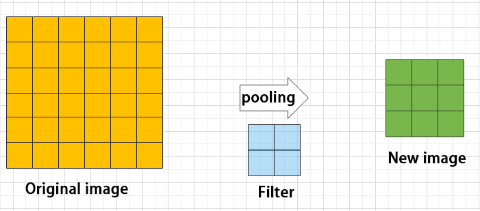

# 14. ROS2-ROS+Deep Learning Basic Lesson

## 14.1 Machine Learning Introduction

### 14.1.1 What “Machine Learning” is

Machine learning forms the foundation of artificial intelligence and is essential in imbuing machines with intelligent capabilities. It is an interdisciplinary field that draws upon probability theory, statistics, approximation theory, convex analysis, algorithm complexity theory, and other related disciplines.

In essence, machine learning is concerned with the study of how computers can acquire new knowledge or skills by simulating or implementing human learning behaviors. It involves the reorganization of existing knowledge structures to continuously improve machine performance. From a practical perspective, machine learning involves training models using data and using those models to make predictions.

For example, AlphaGo was the first artificial intelligence robot to defeat a human professional Go player and become the world champion. The main working principle behind AlphaGo was deep learning, which involves learning the internal laws and representation levels of sample data to extract valuable information.

### 14.1.2 Types of Machine Learning

Machine learning can be broadly categorized into two types: supervised learning and unsupervised learning. The key distinction between these two types lies in whether the machine learning algorithm has prior knowledge of the classification and structure of the dataset.

* **Supervised Learning**

Supervised learning involves providing a labeled dataset to the algorithm, where the correct answers are known. The machine learning algorithm uses this dataset to learn how to compute the correct answers. It is the most commonly used type of machine learning.

For instance, in image recognition, a large dataset of dog pictures can be provided, with each picture labeled as "dog". This labeled dataset serves as the "correct answer". By learning from this dataset, the machine can develop the ability to recognize dogs in new images.

* **Unsupervised Learning**

Unsupervised learning involves providing an unlabeled dataset to the algorithm, where the correct answers are unknown. In this type of machine learning, the machine must mine potential structural relationships within the dataset.

For instance, in image classification, a large dataset of cat and dog pictures can be provided without any labels. Through unsupervised learning, the machine can learn to divide the pictures into two categories: cat pictures and dog pictures.

## 14.2 Framework Introduction

There are a large variety of machine learning frameworks. Among them, PyTorch, Tensorflow, MXNet and paddlepaddle are common.

### 14.2.1 Pytorch

PyTorch is a powerful open-source machine learning framework, originally based on the BSD License Torch framework. It supports advanced multidimensional array operations and is widely used in the field of machine learning. PyTorch, built on top of Torch, offers even greater flexibility and functionality. One of its most distinguishing features is its support for dynamic computational graphs and its Python interface.

In contrast to TensorFlow's static computation graph, PyTorch's computation graph is dynamic. This allows for real-time modifications to the graph as computational needs change. Additionally, PyTorch enables developers to accelerate tensor calculations using GPUs, create dynamic computational graphs, and automatically calculate gradients. This makes PyTorch an ideal choice for machine learning tasks that require flexibility, speed, and powerful computing capabilities.

### 14.2.2 TensorFlow

TensorFlow is a powerful open-source machine learning framework that allows users to quickly construct neural networks and train, evaluate, and save them. It provides an easy and efficient way to implement machine learning and deep learning concepts. TensorFlow combines computational algebra with optimization techniques to make the calculation of many mathematical expressions easier.

One of TensorFlow's key strengths is its ability to run on machines of varying sizes and types, including supercomputers, embedded systems, and everything in between. TensorFlow can also utilize both CPU and GPU computing resources, making it an extremely versatile platform. When it comes to industrial deployment, TensorFlow is often the most suitable machine learning framework due to its robustness and reliability. In other words, TensorFlow is an excellent choice for deploying machine learning applications in a production environment.

### 14.2.3 PaddlePaddle

PaddlePaddle is a cutting-edge deep learning framework developed by Baidu, which integrates years of research and practical experience in deep learning. PaddlePaddle offers a comprehensive set of features, including training and inference frameworks, model libraries, end-to-end development kits, and a variety of useful tool components. It is the first open-source, industry-level deep learning platform to be developed in China, offering rich and powerful features to developers worldwide.

Deep learning has proven to be a powerful tool in many machine learning applications in recent years. From image recognition and speech recognition to natural language processing, robotics, online advertising, automatic medical diagnosis, and finance, deep learning has revolutionized the way we approach these fields. With PaddlePaddle, developers can harness the power of deep learning to create innovative and cutting-edge applications that meet the needs of users and businesses alike.

### 14.2.4 MXNet

MXNet is a top-tier deep learning framework that supports multiple programming languages, including Python, C++, Scala, R, and more. It features a dataflow graph similar to other leading frameworks like TensorFlow and Theano, as well as advanced features such as robust multi-GPU support and high-level model building blocks comparable to Lasagne and Blocks. MXNet can run on virtually any hardware, including mobile phones, making it a versatile choice for developers.

MXNet is specifically designed for efficiency and flexibility, with accelerated libraries that enable developers to leverage the full power of GPUs and cloud computing. It also supports distributed computing across dynamic cloud architectures via distributed parameter servers, achieving near-linear scaling with multiple GPUs/CPUs. Whether you're working on a small-scale project or a large-scale deep learning application, MXNet provides the tools and support you need to succeed.

## 14.3 GPU Acceleration

### 14.3.1 GPU Accelerated Computing 

A graphics processing unit (GPU) is a specialized micro processor used to process image in personal computers, workstations, game consoles and mobile devices (phone and tablet). Similar to CPU, but CPU is designed to implement complex mathematical and geometric calculations which are essential for graphics rendering.

GPU-accelerated computing is the employment of a graphics processing unit (GPU) along with a computer processing unit (CPU) in order to accelerate science, analytics, engineering, consumer and cooperation applications. Moreover, GPU can facilitate the applications on various platforms, including vehicles, phones, tablets, drones and robots.

### 14.3.2 Comparison between GPU and CPU

The main difference between CPU and GPU is how they handle the tasks. CPU consists of several cores optimized for sequential processing. While GPU owns a large parallel computing architecture composed of thousands of smaller and more effective cores tailored for multitasking simultaneously.

GPU stands out for thousands of cores and large amount of high-speed memory, and is initially intended for processing game and computer image. It is adept at parallel computing which is ideal for image processing, because the pixels are relatively independent. And the GPU provides a large number of cores to perform parallel processing on multiple pixels at the same time, but it only improves throughput without alleviating the delay. For example, when receives one message, it will use only one core to tackle this message although it has thousands of cores. GPU cores are usually employed to complete operations related to image processing, which is not universal as CPU.

### 14.3.3 Advantage of GPU

GPUs, equipped with multiple cores, are well-suited for large-scale parallel data processing, providing distinct advantages in efficiently handling extensive repetitive tasks, particularly in multimedia processing.

Consider deep learning, where the neural network designs aim to analyze massive amounts of data swiftly. This aligns with the strength of GPUs in processing vast datasets.

Additionally, GPU architecture, optimized based on CPU architecture, lacks specialized image processing algorithms. Consequently, beyond the realm of image processing, GPUs find widespread applications in scientific computing, cryptography, numerical analysis, big data processing, financial analysis, and other domains that demand parallel computation.

## 14.4 TensorRT Acceleration

### 14.4.1 TensorRT Introduction

TensorRT is a high-performance deep learning inference, includes a deep learning inference optimizer and runtime that delivers low latency and high throughput for inference applications. It is deployed to hyperscale data centers, embedded platforms, or automotive product platforms to accelerate the inference.

TensoRT supports almost all deep learning frameworks, such as TensorFlow, Caffe, Mxnet and Pytorch. Combing with new NVIDIA GPU, TensorRT can realize swift and effective deployment and inference on almost all frameworks.

To accelerate deployment inference, multiple methods to optimize the models are proposed, such as model compression, pruning, quantization and knowledge distillation. And we can use the above methods to optimize the models during training, however TensorRT optimize the trained models. It improves the model efficiency through optimizing the network computation graph.

After the network is trained, you can directly put the model training file into tensorRT without relying on deep learning framework.

### 14.4.2 Optimization Methods

TensorRT has the following optimization strategies:

(1)  Precision Calibration

(2)  Layer & Tensor Fusion

(3)  Kernel Auto-Tuning

(4)  Dynamic Tenser Memory

(5)  Multi-Stream Execution

- **Precision Calibration**

In the training phase of neural networks across most deep learning frameworks, network tensors commonly employ 32-bit floating-point precision (FP32). Following training, since backward propagation is unnecessary during deployment inference, there is an opportunity to judiciously decrease data precision, for instance, by transitioning to FP16 or INT8. This reduction in data precision has the potential to diminish memory usage and latency, leading to a more compact model size.

The table below provides an overview of the dynamic range for different precision:

| **Precision** |   **Dynamic Range**   |
|:-------------:|:---------------------:|
|     FP32      | −3.4×1038 ~ +3.4×1038 |
|     FP16      |   −65504 ~- +65504    |
|     INT8      |      −128 ~ +127      |

INT8 is limited to 256 distinct numerical values. When INT8 is employed to represent values with FP32 precision, information loss is certain, resulting in a decline in performance. Nevertheless, TensorRT provides a fully automated calibration process to optimally align performance by converting FP32 precision data to INT8 precision, thereby minimizing performance loss.

- **Layer & Tensor Fusion**

While CUDA cores efficiently compute tensor operations, a significant amount of time is still spent on the initialization of CUDA cores and read/write operations for each layer's input/output tensors. This results in GPU resource wastage and creates a bottleneck in memory bandwidth.

TensorRT optimizes the model structure by horizontally or vertically merging layers, reducing the number of layers and consequently decreasing the required CUDA core count, achieving structural optimization.

Horizontal merging combines convolution, bias, and activation layers into a unified CBR structure, utilizing only one CUDA core. Vertical merging consolidates layers with identical structures but different weights into a broader layer, also using only one CUDA core.

Moreover, in cases of multi-branch merging, TensorRT can eliminate concat layers by directing layer outputs to the correct memory address without copying, thereby reducing memory access frequency.

- **Kernel Auto-Tuning**

During the inference calculation process, the neural network model utilizes the GPU's CUDA cores for computation. TensorRT can adjust the CUDA cores based on different algorithms, network models, and GPU platforms, ensuring that the current model can perform computational operations with optimal performance on specific platforms.

- **Dynamic Tenser Memory**

During the utilization of each Tensor, TensorRT allocates dedicated GPU memory to prevent redundant memory requests, thereby reducing memory consumption and enhancing the efficiency of memory reuse.

- **Multi-Stream Execution**

By leveraging CUDA Streams, parallel computation is achieved for multiple branches of the same input, maximizing the potential for parallel operations.

## 14.5 YOLOv8 Model

### 14.14.1 Yolo Model Series Introduction

* **YOLO Series**

YOLO (You Only Look Once) is an one-stage regression algorithm based on deep learning.

R-CNN series algorithm dominates target detection domain before YOLOv1 is released. It has higher detection accuracy, but cannot achieve real-time detection due to its limited detection speed engendered by its two-stage network structure.

To tackle this problem, YOLO is released. Its core idea is to redefine target detection as a regression problem, use the entire image as network input, and directly return position and category of Bounding Box at output layer. Compared with traditional methods for target detection, it distinguishes itself in high detection speed and high average accuracy.

* **YOLOv8**

YOLOv8 is an optimized version based on previous YOLO models, whose detection speed and accuracy is greatly improved.

In general, a target detection algorithm is divided into 4 modules, namely input end, reference network, Neck network and Head output end. The following analysis of improvements in YOLOv8 rests on these four modules.

(1) Input end: YOLOv8 employs Mosaic data enhancement method to increase model training speed and network accuracy at the stage of model training. Meanwhile, adaptive anchor box calculation and adaptive image scaling methods are proposed.

(2) Reference network: Focus structure and CPS structure are introduced in YOLOv14.

(3) Neck network: same as YOLOv4, Neck network of YOLOv8 adopts FPN+PAN structure, but they differ in implementation details.

(4) Head output layer: YOLOv8 inherits anchor box mechanism of output layer from YOLOv4. The main improvement is that loss function GIOU_Loss, and DIOU_nms for prediction box screening are adopted.

### 14.14.2 YOLOv8 Model Structure 

* **Component** 

(1) Convolution layer: extract features of the image

Convolution refers to the effect of a phenomenon, action or process that occurs repeatedly over time, impacting the current state of things. Convolution can be divided into two components: "volume" and "accumulation". "Volume" involves data flipping, while "accumulation" refers to the accumulation of the influence of past data on current data. Flipping the data helps to establish the relationships between data points, providing a reference for calculating the influence of past data on the current data.

In YOLOv8, the data being processed is typically an image, which is two-dimensional in computer vision. Therefore, the convolution applied is also a two-dimensional convolution, with the aim of extracting features from the image. The convolution kernel is an unit area used for each calculation, typically in pixels. The kernel slides over the image, with the size of the kernel being manually set.

During convolution, the periphery of the image may remain unchanged or be expanded as needed, and the convolution result is then placed back into the corresponding position in the image. For instance, if an image has a resolution of 6×6, it may be first expanded to a 7×7 image, and then substituted into the convolution kernel for calculation. The resulting data is then refilled into a blank image with a resolution of 6×6.

(2) Pooling layer: enlarge the features of image

The pooling layer is an essential part of a convolutional neural network and is commonly used for downsampling image features. It is typically used in combination with the convolutional layer. The purpose of the pooling layer is to reduce the spatial dimension of the feature map and extract the most important features.

There are different types of pooling techniques available, including global pooling, average pooling, maximum pooling, and more. Each technique has its unique effect on the features extracted from the image.

Maximum pooling can extract the most distinctive features from an image, while discarding the remaining ones. For example, if we take an image with a resolution of 6×6 pixels, we can use a 2×2 filter to downsample the image and obtain a new image with reduced dimensions.

(3) Upsampling layer: restore the size of an image

This process is sometimes referred to as "anti-pooling". While upsampling restores the size of the image, it does not fully recover the features that were lost during pooling. Instead, it tries to interpolate the missing information based on the available information.

For example, let's consider an image with a resolution of 6×6 pixels. Before upsampling, use 3X3 filter to calculate the original image so as to get the new image.

(4) Batch normalization layer: organize data

It aims to reduce the computational complexity of the model and to ensure that the data is better mapped to the activation function.

Batch normalization works by standardizing the data within each mini-batch, which reduces the loss of information during the calculation process. By retaining more features in each calculation, batch normalization can improve the sensitivity of the model to the data.

(5) RELU layer: activate function

The activation function is a crucial component in the process of building a neural network, as it helps to increase the nonlinearity of the model. Without an activation function, each layer of the network would be equivalent to a matrix multiplication, and the output of each layer would be a linear function of the input from the layer above. This would result in a neural network that is unable to learn complex relationships between the input and output.

There are many different types of activation functions. Some of the most common activation functions include the ReLU, Tanh, and Sigmoid. For example, ReLU is a piecewise function that replaces all values less than zero with zero, while leaving positive values unchanged.

(6) ADD layer: add tensor

In a typical neural network, the features can be divided into two categories: salient features and inconspicuous features.

(7) Concat layer: splice tensor

It is used to splice together tensors of features, allowing for the combination of features that have been extracted in different ways. This can help to increase the richness and complexity of the feature set.

* **Compound Element** 

When building a model, using only the layers mentioned above to construct functions can lead to lengthy, disorganized, and poorly structured code. By assembling basic elements into various units and calling them accordingly, the efficiency of writing the model can be effectively improved.

(1) Convolutional unit:

A convolutional unit consists of a convolutional layer, a batch normalization layer, and an activation function. The convolution is performed first, followed by batch normalization, and finally activated using an activation function.

(2) Focus module

The Focus module for interleaved sampling and concatenation first divides the input image into multiple large regions and then concatenates the small images at the same position within each region to break down the input image into several smaller images. Finally, the images are preliminarily sampled using convolutional units.

As shown in the figure below, taking an image with a resolution of 6×6 as an example, if we set a large region as 2×2, then the image can be divided into 9 large regions, each containing 4 small images.

By concatenating the small images at position 1 in each large region, a 3×3 image can be obtained. The small images at other positions are similarly concatenated, and the original 6×6 image will be broken down into four 3×3 images.

(3) Residual unit

The function of the residual unit is to enable the model to learn small changes in the image. Its structure is relatively simple and is achieved by combining data from two paths.

The first path uses two convolutional units to sample the image, while the second path does not use convolutional units for sampling but directly uses the original image. Finally, the data from the first path is added to the second path.

(4) Composite Convolution Unit

In YOLOv8, the composite convolution unit is characterized by the ability to customize the convolution unit according to requirements. The composite convolution unit is also realized by superimposing data obtained from two paths.

The first path only has one convolutional layer for sampling, while the second path has 2x+1 convolutional units and one convolutional layer for sampling. After sampling and splicing, the data is organized through batch normalization and then activated by an activation function. Finally, a convolutional layer is used for sampling.'

(5) Compound Residual Convolutional Unit

The compound residual convolutional unit replaces the 2x convolutional layers in the compound convolutional unit with x residual units. In YOLOv8, the feature of the compound residual unit is mainly that the residual units can be customized according to the needs.

(6) Composite Pooling Unit

The output data of the convolutional unit is fed into three max pooling layers and an additional copy is kept without processing. Then, the data from the four paths are concatenated and input into a convolutional unit. Using the composite pooling unit to process the data can significantly enhance the features of the original data.'

* **Structure**

Composed of three parts, YOLOv8 can output three sizes of data. Data of each size is processed in different way. The below picture is the output structure of YOLOv14.

Below is the output structures of data of three sizes.

## 14.6 YOLOv8 Running Procedure 

In this section, we provide an explanation of the model workflow using the anchor boxes, prediction boxes, and prior boxes employed in YOLOv14.

### 14.6.1 Prior Bounding Box

When an image is input into model, object detection area requires us to offer, while prior bounding box is that box used to mark the object detection area on image before detection.

### 14.6.2 Prediction Box

The prediction box is not required to set manually, which is the output result of the model. When the first batch of training data is input into model, the prediction box will be automatically generated with it. The position in which the object of same type appear more frequently are set as the center of the prediction box.

### 14.6.3 Anchor Box

After the prediction box is generated, deviation may occur in its size and position. At this time, the anchor box serves to calibrate the size and position of the prediction box.

The generation position of anchor box is determined by prediction box. In order to influence the position of the next generation of the prediction box, the anchor box is generated at the relative center of the existing prediction box.

### 14.6.4 Realization Process

After the data is calibrated, a prior bounding box appears on image. Then, the image data is input to the model, the model generates a prediction box based on the position of the prior bounding box. Having generated the prediction box, an anchor box will appear automatically. Lastly, the weights from this training are updated into model.

Each newly generated prediction will be influenced by the last generated anchor box. Repeating the operations above continuously, the deviation of the size and position of the prediction box will be gradually erased until it coincides with the priori box.

