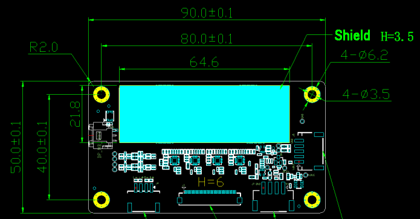
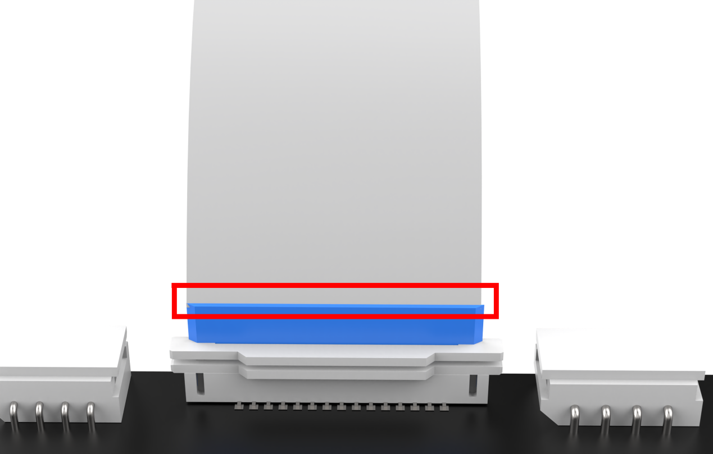
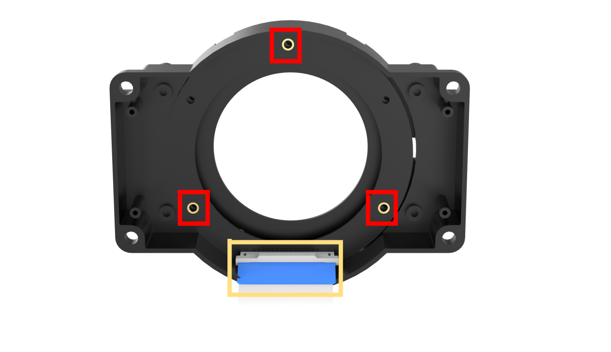
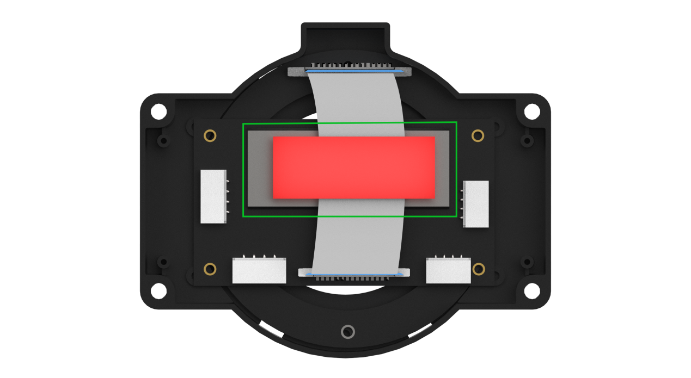
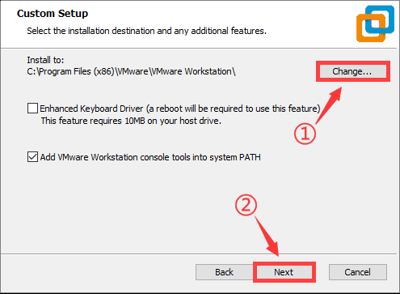
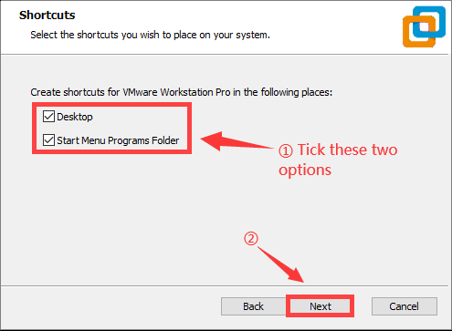
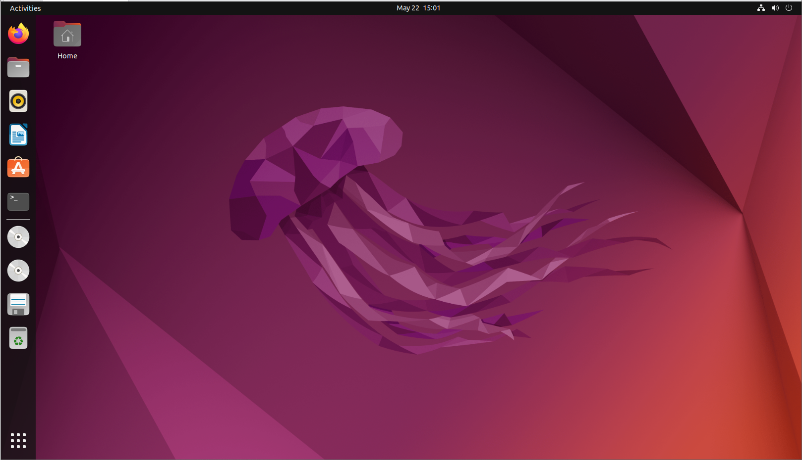
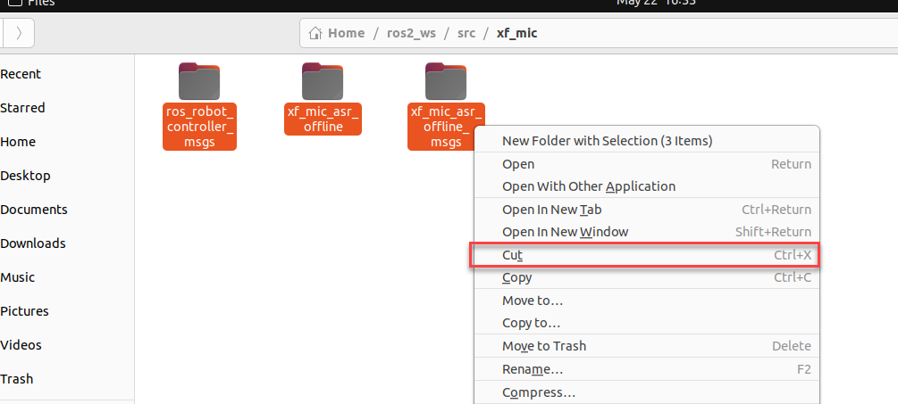
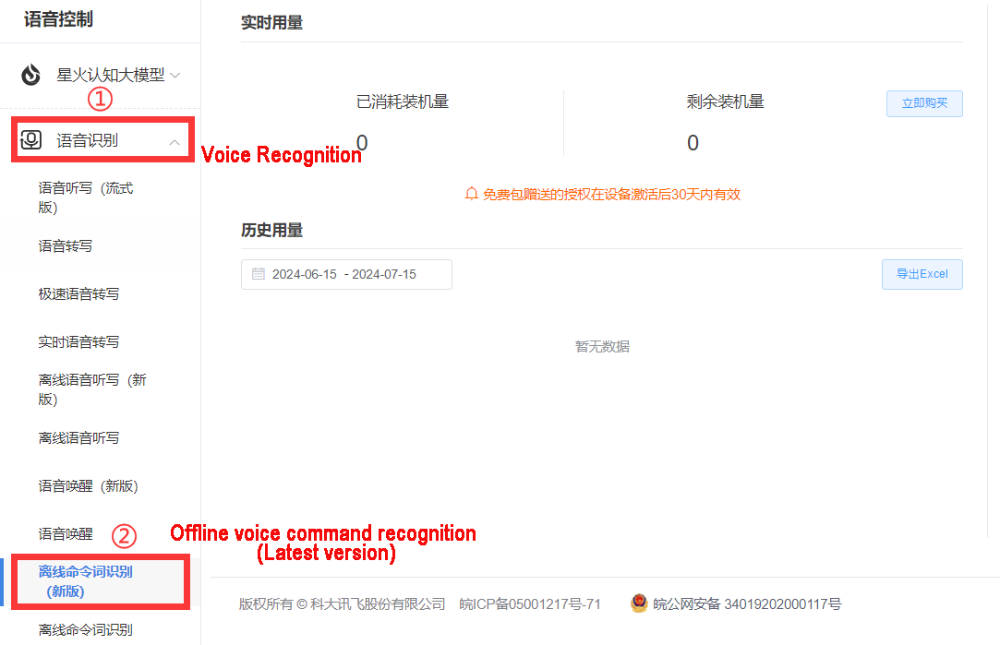
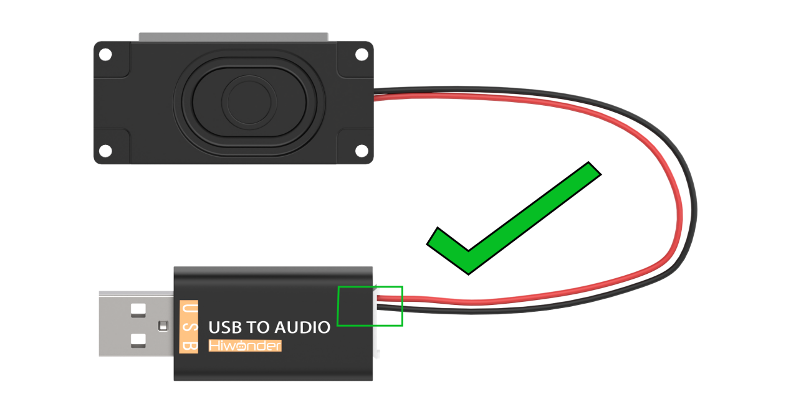

# 18. Voice Control Course

## 18.1 Microphone Array Installation

(1) Fix the 6-Microphone array to the JetArm using four M4\*6 screws.


(2) The image below shows the assembled configuration of the 6-microphone array.


(3) Connect the 6-CH microphone array to USB Port 2 on the controller, as shown below.


<p id="anchor_18_2"></p>

## 18.2 Switching Between Chinese and English Wake Words

The system is preconfigured to use the English wake word `"hello hiwonder"` for voice activation.  
If you prefer to use a custom command, please follow the steps below:

(1) The robot is equipped with a 6-microphone array.  
To change the recognition language, open the configuration tool by double-clicking the `"Tool"` icon on the desktop .  
In the tool interface, select your preferred language.


(2) If you are using the `6-microphone array`, select `"xf"` as the microphone type (as shown in the image below).


(3) Click `"Apply & Save"` to confirm and save your settings.


## 18.3 Voice Control Basic Lesson

This document serves as an informational guide, providing an overview of the 6-channel ring microphone array, including its introduction, assembly, and debugging processes. It is specifically designed for single-module use.

### 18.3.1 R818 Noise Reduction Board

* R818 Noise Reduction Board Introduction

The R818 noise reduction board serves as a voice front-end solution featuring a multi-microphone array. Powered by a high-performance quad-core edge computing processor, this module internally incorporates iFLYTEK's voice algorithm. Leveraging the spatial filtering characteristics of the microphone array, it uses angle positioning to awaken individuals. This creates a directional pickup beamforming, suppressing noise outside the beam and enhancing far-field audio pickup quality. Specifically designed for human-machine interaction terminals, it integrates a high-performance echo cancellation algorithm to alleviate the challenges of speech and semantic recognition. Developers can seamlessly integrate this module to empower products with functionalities like multi-microphone audio capture, wake-up, noise reduction, and echo cancellation.

* R818 Noise Reduction Board Specification

The purpose of the interface on the R818 noise reduction board is outlined below:


| Interface NO. |          Name          |                      Function                      |
| :---------------: | :------------------------: | :----------------------------------------------------: |
|       1       |      Serial port       |           For PC software communication            |
|       2       | Reference signal port  | Power amplifier/echo cancellation reference signal |
|       3       |    Microphone port     |       Connect to 6-channel microphone array        |
|       4       | Independent power port |                  Power input port                  |
|       5       |        UAC port        |                 Audio output port                  |

* R818 Noise Reduction Board Parameter Description

(1) Performance Parameter Indicator 

Key parameter:

|      Microphone       |                      SPA1687LR5H-1                       |
| :-----------------------: | :----------------------------------------------------------: |
|      Sensitivity      |                         -3dBV/Pa                         |
| Signal-to-noise ratio |                           65dB                           |
|       PCB size        |                    90mm\*50mm\*1.2mm                     |
|     External port     | Serial port, UAC port, independent power port, reference signal port and microphone port |

Electrical parameter:

<table  class="docutils-nobg" border="1">
  <thead>
    <tr>
      <th>Project</th>
      <th>Project</th>
      <th>Minimum value</th>
      <th>Classic value</th>
      <th>Maximum value</th>
    </tr>
  </thead>
  <tbody>
    <tr>
      <td>Working voltage</td>
      <td>DC5V</td>
      <td>4.75V</td>
      <td>5V</td>
      <td>5.25V</td>
    </tr>
    <tr>
      <td>Working current</td>
      <td>DC5V</td>
      <td>250mA</td>
      <td>300mA</td>
      <td>400mA</td>
    </tr>
    <tr>
      <td rowspan="2">Operating environment</td>
      <td>temperature</td>
      <td>-20℃</td>
      <td>25℃</td>
      <td>70℃</td>
    </tr>
    <tr>
      <td>relative humidness</td>
      <td>/</td>
      <td>/</td>
      <td>95%</td>
    </tr>
  </tbody>
</table>

(2) Structure & Size

Front view:



Back view:


* 6-Channel Ring Microphone Array Introduction

The 6-Channel Ring Microphone Array is a board designed for microphone pickup, known for its heightened sensitivity and excellent signal-to-noise ratio. It incorporates six analog silicon microphones arranged in a circular pattern. When integrated with the mainboard, it excels in delivering advanced features such as Acoustic Echo Cancellation (AEC), reduction of environmental noise, and factory-level sound pickup capabilities extending up to 10 meters.

(1) Ring 6-Channel Microphone Array Specification

The structure of the ring 6-channel microphone array is as below:

Front： Back：

 


① Signal interface: connects to R818 noise reduction board.

② At the rear, six analog silicon microphones are strategically arranged in a circular pattern to optimize audio reception.


(2)  6-Channel Ring Microphone Array Parameter

① Performance Parameter

Key parameter:

|      Microphone       |     SPA1687LR5H-1      |
| :-----------------------: | :------------------------: |
|      Sensitivity      |        -3dBV/Pa        |
| Signal-to-noise ratio |          65dB          |
|       PCB size        |   115mm\*12mm\*1.2mm   |
|     External port     | Microphone signal port |

Electrical parameter:

<table  class="docutils-nobg" border="1">
  <thead>
    <tr>
      <th>Project</th>
      <th>Project</th>
      <th>Minimum value</th>
      <th>Classic value</th>
      <th>Maximum value</th>
    </tr>
  </thead>
  <tbody>
    <tr>
      <td>Working voltage</td>
      <td>DC5V</td>
      <td>4.75V</td>
      <td>5V</td>
      <td>5.25V</td>
    </tr>
    <tr>
      <td>Working current</td>
      <td>DC5V</td>
      <td>250mA</td>
      <td>300mA</td>
      <td>400mA</td>
    </tr>
    <tr>
      <td rowspan="2">Operating environment</td>
      <td>temperature</td>
      <td>-20℃</td>
      <td>25℃</td>
      <td>70℃</td>
    </tr>
    <tr>
      <td>relative humidness</td>
      <td>/</td>
      <td>/</td>
      <td>95%</td>
    </tr>
  </tbody>
</table>

② Product Structure & Size

Front view:


Back view:


<p id="anchor_9_1_2"></p>

### 18.3.2 Wiring

(1) Please gather the items depicted in the picture below:


(2) Connect the microphone array to the noise reduction board. Be cautious while inserting the connection cable to avoid any forceful insertion that may lead to damage to the port.





(3) Connect the two UAC-to-USB cables to the noise deduction board as below:


(4) Connect the serial port connection cable and UAC cable to the corresponding port on the noise reduction board. First, attach the ring microphone array to the casing. Use the screws to secure it in the three holes highlighted by the red boxes in the image below. Additionally, be sure to align the signal cable connector properly, as shown in the yellow box in the image below. 



(5) Next, connect the noise reduction board, which has already been wired, to the corresponding slots in the casing. Pay attention to the orientation of the noise reduction board, as shown in the image below. Use 3M adhesive to secure the signal cable in place, as indicated by the green box in the image.



Tighten the four screws:


(6) Connect the two USB cables to the laptop and run a test to check if the computer recognizes the port numbers. This completes the wiring and installation of the microphone array.


<p id="anchor_9_1_3"></p>

###  18.3.3 Virtual Machine Installation and Configuration

* **Install VMware Workstation Software**

A virtual machine is essentially a computer generated through software emulation, offering a usage experience similar to that of a physical computer. Popular virtual machine software options include VMware Workstation (often called VMware), VirtualBox, Microsoft Virtual PC, and more. In this section, we'll use the example of installing VMware Workstation, initiating, and configuring a virtual machine for explanation.

(1) Extract the virtual machine software package saved in `2. Software Tool/ 6. Voice Environment Setup Tool/ Virtual Machine Installation Pack`.

(2) Find the folder where the virtual machine was extracted, and double-click on the virtual machine executable file.


(3) Follow the images below to complete the virtual machine installation.








* **Import Virtual Machine**

After entering the virtual machine interface, click on `"Open Virtual Machine"`.


(1) In the popup window, locate the image file under the directory `"2 Tools/6 Voice Recognition Environment Set Up Tool/6-Channel Microphone Array Image"`. Open the image file (the actual name of the image may vary; this image is for reference only).


(2) After opening, you can change the virtual machine's name and local storage path.


* **Upgrade Virtual Machine**

(1) If upgrading the virtual machine is available after selecting it, proceed with the upgrade; otherwise, skip this step.


(2) Pop-up with the following content, click `"Next"`.


(3) Pop-up with the following content, select Virtual Machine 17.5.


(4) Then click `Next`.


(5) Choose `Modify this virtual machine`, then click `Next`.


(6) Click `Finish`.


(7) Click `Close`.


* **Start Virtual Machine**

(1) Click-on `Power on this virtual machine`.


(2) After start-up, you will enter the desktop of the virtual machine.



* **Install Dependency**

(1) Click-on  to start the command-line, the execute the following command to install pip:

```bash
sudo apt install pip
```

When you encounter the prompt as shown in the following image, press 'y', then press Enter.


(2) Run the following command to complete the installation.

```bash
sudo apt install serial
```

### 18.3.4 6-Channel Microphone Array Configuration

* **Create Workspace**

(1) Click-on  to open the command-line terminal, and run the following command to create a folder.

```bash
sudo mkdir ros2_ws
```

When the prompt as shown in the following image appears, enter the password `ubuntu`.


(2) Execute the following command to create a folder.

```bash
sudo mkdir ros2_ws/src
```

(3) Enter the command to grant folder permissions:

```bash
sudo chmod a+w+x+r ros2_ws/ ros2_ws/src/
```

* **Import Feature Pack**

(1) Click on the location shown in the image below to open the folder.


(2) Drag the files from the same directory into the virtual machine folder.


(3) Extract the two files into the current directory.


(4) Enter the extracted folder and move the three folders to `/ros2_ws/src`.



(5) Delete unnecessary files inside `/ros2_ws/src`.


(6) Exit the `src` folder and return to the `ros_ws` folder, then open the command line.


(7) Enter the command to start compiling the package:

```bash
colcon build
```

Compilation completion will be as shown below:


(8) Enter the command to add environment variables:

```bash
echo "source ~/ros2_ws/install/setup.bash" >> ~/.bashrc
```

(9) Enter the command to navigate to the microphone function package:

```bash
cd /home/ubuntu/ros2_ws/src/xf_mic_asr_offline
```

(10) Enter the command to grant permissions:

```bash
sudo find . -name "*.py" -exec chmod +x+w+r {} \
```

* **6-Channel Microphone Array Configuration: Apply for offline voice resources and APPID**

As the robot utilizes offline voice recognition, you will require offline voice resources available exclusively on the iFLYTEC Chinese website. Please note that you need to switch the language to Chinese and follow the provided instructions for the process.

(1) Enter iFLYTEC website, https://www.xfyun.cn/, then click `"sign in"` to create an account.


(2) Choose `Sign up with phone number`, and fill in the required information. (select corresponding country code)


(3) After registration, click `console->my application` to add new application.


(4) Fill in the required information, and click `Submit`.


(5) Open the application you just added.


(6) Click `Voice recognition->Offline voice command recognition (Latest version)`



(7) Download Linux AIKit.


:::{Note}

Each new application offers 90-day free trial, and you will be charged if you continue to use it. When free trial expires, you can add new application again, and each person can only request 5 new applications.

:::

(8) Select the username you created and the Linux platform. After making your choices, select the `Regular Version` below, check `Offline Command Word Recognition` and `Voice Wakeup` options, then click `SDK Download`.


(9) Choose`OK` to start downloading.


* **Replace Offline Voice Resources and ID**

(1) Unzip the file below and locate the offline voice resource `common.jet`.


(2) Click the icon below.


(3) Drag the Common.jet file into the specified folder within the virtual machine (as illustrated in the image) to complete the replacement.


(4) Navigate to the folder `ros_ws/src/xf_mic_asr_offline/launch` and right click the file `mic_init.launch` and choose 'Open With Text Editor'.


(5) Replace the existing appid with the one obtained from the iFLYTEC website. Afterward, press 'Ctrl+S' to save the changes. (Note: the offline voice resource should be consistent with the appid)


:::{Note}

If you are still unable to activate voice control for the car after following the steps above, please reach out to our technical support team at <support@hiwonder.com> for assistance.

:::

* **Import Dynamic Library**

Choose the corresponding directory based on your CPU architecture. Here, we take `x64` as an example.

:::{Note}

If you are using a Raspberry Pi, you need to choose the 'arm32' folder. If you are using a Jetson Nano, choose the 'arm64' folder. If you are using a PC with Linux or Windows, select the folder based on your system: choose the 'x64' folder for 64-bit systems and the 'x86' folder for 32-bit systems.

:::


(1) Enter the command to open the directory containing the dynamic link library (DLL) files for the x64 architecture:

```bash
cd /home/ubuntu/ros2_ws/src/xf_mic_asr_offline/lib/x64/
```

(2) Enter the command to copy the dynamic link libraries to the user directory:

```bash
sudo cp lib* /usr/lib
```

* **Change User Parameters**

After modifying the APPID, if you wish to make changes to the speech recognition threshold, recording duration, wake-up word, or wake-up speech, you can refer to the methods described below.

(1) Locate the folder `ros_ws/src/xf_mic_asr_offline/launch`, and right-click `mic_init.launch`, then select `Open With Text Editor`.


(2) Set confidence thresholds for speech results and the duration of each voice command entry based on the two parameters highlighted in the red box in the following diagram.


(3) Modify the parameter highlighted in the red box below to change the wake-up word.


English wakeup word format: word1 word2 word3

(1) To change the wakeup language, you can directly change the below parameter.


(2) After modification, press `Ctrl+S` to save the editing.

* **Configure Microphone Port**

(1) Start the virtual machine.


(2) Press the shortcut key `Ctrl + Alt + T` to open the command line terminal, then enter the following command to copy the microphone interface mapping rules into the system:

```bash
sudo cp /home/ubuntu/ros2_ws/src/xf_mic_asr_offline/xf_mic.rules /etc/udev/rules.d/
```

(3) Enter the following three commands one by one to update the USB mapping rules:

```bash
sudo udevadm control --reload-rules
```

```bash
sudo service udev restart
```

```bash
sudo udevadm trigger
```

### 18.3.5 Set Wake-Up Command

(1) Connect the microphone array to the computer according to section `18.1.2 Wiring`.


(2) Connect the device to the virtual machine.


(3) Enter the command to start the initialization node of the six-channel microphone array and burn the wake-up word.

```bash
ros2 launch xf_mic_asr_offline mic_init.launch.py enable_seting:=true
```

(4) After initialization is complete, the following content will appear. The initial startup may be slightly slow, and completion will appear as shown below:


(5) If you want to close this node, use short-cut `'Ctrl+C'`.

### 18.3.6 Sound Source Localization and Speech Recognition

* **Start Node**

Enter the command to start the initialization node of the six-channel microphone array:

```bash
ros2 launch xf_mic_asr_offline mic_init.launch.py
```


(1) Voice Wake-up

After starting the microphone node, say 'Hello Hiwonder' into the microphone. The command line will provide recognition feedback:


(2) Voice Recognition

After activating the microphone, speak the specific command to be recognized.


Command location: `ros2_ws/src/xf_mic_asr_offline/config/call.bnf`


(3) Sound Source Localization

Open a new command-line terminal, and run the following command to initiate the microphone array node.

```bash
ros2 topic echo /awake_node/angle
```


After waking up the microphone, it will print the angle of the sound relative to the microphone.

* **FAQ**

(1) 10108 Error Code

Initiating the initialization service for the 6-channel microphone array multiple times may lead to the problem shown in the following image. However, this issue does not impact functionality. To restore normal operation, just repeat the wake-up words `Hello Hiwonder`.


(2) Solution for Unable to Find the Microphone Device

If the error shown in the image below occurs, follow these steps to recover:


Enter the following command to clear the occupation:

```bash
sudo apt remove brltty -y
```

Enter the following three commands one by one to update the USB mapping rules:

```bash
sudo udevadm control --reload-rules
```

```bash
sudo service udev restart
```

```bash
sudo udevadm trigger
```

### 18.3.7 Sound Card Introduction

* **Sound Card Introduction**

As a fundamental component of multimedia systems, a sound card converts analog sound waves into digital signals and vice versa. The primary function of a sound card is to convert raw audio signals from sources such as microphones, tapes, and disks, and output them to various devices such as speakers, headphones, amplifiers, and recorders. Additionally, sound cards can support the playback of the converted audio signals through MIDI interfaces.

Below is about the introduction to USB to audio driver-free sound card.

(1) Sound Card Interface


| NO. |            Name             |                         Function                         |
| :-----: | :-----------------------------: | :----------------------------------------------------------: |
|  1  |        USB interface        |            connect to PC or embedded devices             |
|  2  |       power indicator       |     remains on red when the sound card is powered on     |
|  3  |      speaker interface      |               connect to external speaker                |
|  4  | Echo cancellation interface | An external speaker can be connected for echo cancellation |

(2) Interior Structure


(3) Parameter

|     Power supply voltage     |            5V             |
| :------------------------------: | :---------------------------: |
| Audio encoding decoding chip |         SSS1629A5         |
|      Control interface       |            USB            |
|       Audio interface        |           PH2.0           |
|        Speaker driver        | 2.6W per channel (4Ω BTL) |

* **Speaker Introduction**

A speaker is an electroacoustic device that transforms an electrical signal into mechanical vibrations and emits sound waves into the surrounding space.

Parameters of speaker are as follow.

| AC impedance | 4Ω |
| :--------------: | :----: |
|  Peak power  | 2W |

* **Wiring**

(1) Ensure that the power is off when connecting the speaker wires to the SPK- and SPK+ ports on the right side of the sound card to enable sound playback. (The speaker connection wire has a design to prevent incorrect insertion; if it does not fit, do not force it. Instead, try inserting it in the opposite direction.) If connected to the RLN and RLP ports, the speaker will not produce sound.




(2) Then connect the USB extension cable to sound card.


(3) After completing the connections, insert the USB connectors of the sound card and microphone into the USB ports on the computer. The sound card and microphone can also be connected to a Raspberry Pi or Jetson Nano motherboard using the same method.

Follow the instruction to test sound card and speaker.

(1) Start the virtual machine. Regarding the configuration and installation method of the virtual machine, please refer to the section `"18.1.3 Virtual Machine Installation and Configuration"`

(2) Connect sound card and speaker to any USB interface on computer according to the instruction in `"18.1.2 Wiring"`.

Warm tip: if the virtual machine is still powered on after configuration, the following prompt will pop up when you insert microphone.


(3) Open settings.


(4) Click `"Sound\>Output device\>Test"`.


(5) Once opened, users should connect the wires to the SPK- and SPK+ ports correctly. Since the speaker is mono, you can test it by selecting `Front Right.` For detailed information on wiring connections, please refer to `18.1.2 Wiring`


If the speaker plays English voice, it means that the speaker functions normally.

* **Import External Music File**

Virtual machine only supports audio file of the format of wav. Abundant materials are available on the Internet teaching you how to convert the format into wav.

(1) Copy the converted audio file (e.g., `test_sound.wav`) to the same directory as this document. You can also download WAV format files from the internet for import, which will be used as an example for demonstration.


(2) Next, switch back to the virtual machine and click on the file manager  located on the left side of the screen. Select the `test_sound` file by left-clicking on it, then drag it into the file manager. This will save it in the home directory of the user group.


(3) Double-click the test_sound.wav file to play the music.

(4) Run the following command in sequence to play music:

```bash
sudo apt-get install sox -y
```

```bash
play test_sound.wav
```

(5) If you want to pause the music, press `Ctrl+C`.

## 18.4 Voice Control Application

### 18.4.1 Preparation

* **Version Confirmation**

Before running any play modes, please confirm that the microphone configuration in the system matches your hardware version.

(1) Use `NoMachine` to remotely log in to the device, then click the microphone configuration icon located on the desktop。

(2) Select the correct microphone version based on your hardware.


For devices using a `six-microphone array`, select `xf` as the microphone type (as shown in the image below).


(3) Click `"Apply & Save"`, then click `"Restart Service"` to complete the setup.


* **Microphone Array Configuration**

(1) Requesting the Offline Speech Resource Package and App ID

To obtain the required offline speech resources and App ID, please refer to the following tutorial:

Path:

1\. Tutorials\4. ROS2 Course\9. Voice Control Course\Voice Control Basic Lesson\Six-Microphone Array Introduction\\ 5.Replace Voice Resource Package and APPID

(2) Replacing the Offline Speech Resource and App ID

① Extract the provided compressed file from the tutorial materials.


:::{Note}

Ensure you locate the extracted files based on your configured download path.

:::

② Locate the extracted folder named similar to: Linux_aitalk_exp1227_21****8f,Navigate to the following subfolder within it: 
`/bin/msc/res/asr/`

Copy the file common.jet and move it to the desktop of your system image.

:::{Note}

21\*\*\*\*8f** is a version-specific identifier and may vary depending on the source.
:::


③ On the target device, open the directory:  
`/home/ubuntu/ros2_ws/src/xf_mic_asr_offline/config/msc/res/asr`  
Delete all existing files in this folder.


④ Move the `common.jet` file from the desktop into the above directory.


⑤ Navigate to: 
`/home/ubuntu/ros2_ws/src/xf_mic_asr_offline/launch` 
Right-click on the mic_init.launch file and open it with a text editor (as indicated in the green box in the tutorial image).


⑥ Locate the appid field (highlighted in red in the tutorial image) and replace its value with the App ID obtained from the iFLYTEK developer platform.  
Save the file using `Ctrl + S`.


### 18.4.2 Voice-Controlled Color Sorting

This lesson involves controlling the robot to initiate the sorting of specified color blocks through voice commands. Once the corresponding color block is recognized, the robot will place it in the designated position.

* **Preparation**

(1) Please ensure the microphone array, sound card and speaker are connected to the corresponding port of USB hub.

(2) Please calibrate the position of the robot arm before starting the voice-controlled color sorting function. To get detailed instruction, please refer to `1.Getting Ready/ JetArm User Manual/ 4.5 Position Calibration`.

(3) Confirm that the `APPID` in the configuration file has been modified and the `Common.jet` file has been replaced.

* **Program Flow**

(1) First, subscribe to the speech recognition service provided by the microphone array node. Perform operations such as localization, noise reduction, and speech recognition on the acquired audio to obtain recognized sentences and the angle of the sound source.

Then, successfully wake up the robot and, upon uttering specific phrases, the robot will deliver corresponding verbal feedback.

Finally, issue the relevant command to initiate or stop the sorting of color blocks based on the command.

(2) The color block sorting is triggered by the `example` file within the  `color_sorting_node.launch.py` package. The target sorting game of the app is primarily divided into three parts: ROI region delineation, color recognition, and sorting.

The object sorting feature in the app primarily consists of two parts: color recognition and sorting. 
In the color recognition part, Gaussian filtering is first applied to reduce noise in the image.
Then, the color of the object is converted using the Lab color space
Next, the object color within the bounding box is identified based on color thresholds. A mask is then applied to the image (a mask uses selected images, shapes, or objects to perform global or local occlusion on the image being processed).
After performing opening and closing operations on the object image, the object with the largest contour will be outlined. 
Once a specific color is recognized, the robot arm will lower to the designated position, grasp the colored block, and place it at the target location.

* **Operation Steps**

:::{Note}

* The input command must be case-sensitive, and keywords can be supplemented using the Tab key.

* Ensure that items in the vicinity, especially those with similar colors to the target object, are excluded to avoid impacting the accuracy of the recognition result.

* In case of an incorrect recognition result, follow the instructions provided in '1. Getting Ready/ JetArm User Manual/ 5. Color Threshold Setting' to adjust the color threshold for a more accurate outcome.

:::

(1) Start the robot, and access the remote desktop using NoMachine.

(2) The system is configured by default to use the English wake word `"hello hiwonder"` for voice activation.

If you wish to use a wake word in a different language, please refer to the guide titled [18.2 Switching Between Chinese and English Wake Words](#anchor_18_2) 

(3) Double-click  to open the command-line terminal.

(4) Then execute the following command to disable the auto-start service.

```
sudo systemctl stop start_app_node.service
```

(5) To ensure proper functionality, it is essential to run the microphone activation file after the initial use of the voice control feature or when modifying the wake-up word. Failure to do so may result in the microphone not functioning correctly.

Open the terminal, and run this command.

```
ros2 launch xf_mic_asr_offline mic_init.launch.py enable_setting:=true
```

The terminal will display pertinent prompts. During the initial activation, a 30-second wait is required. Once the terminal prints the designated wake-up word, for instance, `Wake up word: xiao3 huan4 xiao3 huan` you can proceed to speak the wake-up word to activate the microphone.


Press `Ctrl+C` to exit after activating the wake-up word.

(6) Execute the following command to run the game.

```
ros2 launch xf_mic_asr_offline voice_control_color_sorting.launch.py
```

(7) Speak the wake-up word (default is "Hello Hiwonder"), then subsequently issue the command to initiate color sorting.

(8) To exit this mode, press Ctrl+C in the terminal. If the process does not terminate successfully, please try again multiple times.

(9) Following the above function, it is essential to enable the app service; otherwise, the app functions may be impacted.

```
sudo systemctl start start_app_node.service
```

(10) After the service is initiated successfully, the robot will emit a beeping sound.

* **Program Outcome**

To initiate the game, begin by speaking the wake-up word, followed by the command statement to activate color block sorting. For example, saying the wake-up word "Hello Hiwonder" and then issuing the command 'Sort red' will prompt the terminal to display the sorting color. Subsequently, it will commence recognizing color blocks within a specific area. Once the corresponding color block is identified, it will be captured and placed in the designated location.

The wake-up word and control commands are outlined below:

<table class="command-table">
  <thead>
    <tr>
      <th>Wake-up Command</th>
      <th>Control Command</th>
      <th>Outcome</th>
    </tr>
  </thead>
  <tbody>
    <tr>
      <td rowspan="2">Hello Hiwonder</td>
      <td>Start color sorting</td>
      <td>Start sorting the specific color</td>
    </tr>
    <tr>
      <td>Stop color sorting</td>
      <td>Stop color sorting</td>
    </tr>
  </tbody>
</table>
* **launch File Analysis**

This content specifically delves into the intricacies of voice wake-up and voice control. For a thorough grasp of color sorting, it is recommended to refer to the pertinent course.

Voice-controlled color tracking involves establishing connections among the voice control node, camera node, robotic arm control node, and color sorting node. Commands issued through voice control the robot's initiation or termination of this game.

The launch file for this process can be located at:

`/home/ubuntu/ros2_ws/src/xf_mic_asr_offline/launch/voice_control_color_sorting.launch.py`

(1) launch_setup Function

{lineno-start=10}

```python
def launch_setup(context):
    compiled = os.environ['need_compile']
    start = LaunchConfiguration('start', default='true')
    start_arg = DeclareLaunchArgument('start', default_value=start)
    display = LaunchConfiguration('display', default='true')
    display_arg = DeclareLaunchArgument('display', default_value=display)
    mic_type = os.environ['MIC_TYPE']

    if compiled == 'True':      
        example_package_path = get_package_share_directory('example')
        xf_mic_asr_offline_package_path = get_package_share_directory('xf_mic_asr_offline')
    else:
        example_package_path = '/home/ubuntu/ros2_ws/src/example'
        xf_mic_asr_offline_package_path = '/home/ubuntu/ros2_ws/src/xf_mic_asr_offline'
    if mic_type == 'xf':

        mic_launch = IncludeLaunchDescription(
            PythonLaunchDescriptionSource(
                os.path.join(xf_mic_asr_offline_package_path, 'launch/mic_init.launch.py')),
        )
    else:
        mic_launch = IncludeLaunchDescription(
            PythonLaunchDescriptionSource(
                os.path.join(xf_mic_asr_offline_package_path, 'launch/wonderechopro_init.launch.py')),
        )

    color_sorting_node_launch = IncludeLaunchDescription(
        PythonLaunchDescriptionSource(
            os.path.join(example_package_path, 'example/opencv/color_sorting_node.launch.py')),
        launch_arguments={
            'broadcast': 'true',
        }.items(),
    )

    voice_control_color_sorting_node = Node(
        package='xf_mic_asr_offline',
        executable='voice_control_color_sorting.py',
        output='screen',
    )

    return [ 
            color_sorting_node_launch,
            mic_launch,
            voice_control_color_sorting_node,
            ]

```


① `def launch_setup(context)`: 
Defines a function named launch_setup to configure all nodes and modules required during the launch process.

② `compiled = os.environ['need_compile']`: 
Retrieves the value of the environment variable need_compile to determine whether to load packages from the compiled path.5

③ `if compiled == 'True'`: 
Based on the environment variable, decides whether to load packages from the compiled path or the source code.

④ `app_package_path = get_package_share_directory('app')`: 
Obtains the shared directory path of the app package.

⑤ `example_package_path = get_package_share_directory('example')`: 
Obtains the shared directory path of the example

⑥ `package.peripherals_package_path = get_package_share_directory('peripherals')`: 
Obtains the shared directory path of the peripherals package.

⑦ `xf_mic_asr_offline_package_path = get_package_share_directory('xf_mic_asr_offline')`: 
Obtains the shared directory path of the xf_mic_asr_offline package.

⑧ `color_sorting_launch = IncludeLaunchDescription(...)` 
Includes and configures the color_sorting_node.launch.py file, with the start parameter set to false.

⑨ `depth_camera_launch = IncludeLaunchDescription(...)` 
Includes and configures the depth_camera.launch.py file to initialize the depth camera.

⑩ `mic_launch = IncludeLaunchDescription(...)` 
Includes and configures the mic_init.launch.py file to initialize the microphone.

⑪ `voice_control_color_sorting_node = Node(...)` 
Creates a node named voice_control_color_sorting.py to implement the voice-controlled color sorting functionality.

⑫ `return [...]`: 
Returns a list containing all launch items, enabling the simultaneous startup of multiple ROS 2 nodes and functional modules.

(2) generate_launch_description Function

{lineno-start=56}

```python
def generate_launch_description():
    return LaunchDescription([
        OpaqueFunction(function = launch_setup)
    ])
```


① `def generate_launch_description()`: Defines the generate_launch_description function, which generates a launch description object.

② `return LaunchDescription([OpaqueFunction(function = launch_setup)])`: Returns a LaunchDescription object, which executes the launch_setup function using OpaqueFunction and uses its result as the launch configuration.

(3) Main Function

{lineno-start=61}

```python
if __name__ == '__main__':
    # 创建一个LaunchDescription对象
    ld = generate_launch_description()

    ls = LaunchService()
    ls.include_launch_description(ld)
    ls.run()
```


① `if __name__ == '__main__'`: 
Checks if the script is being run as the main program. If so, it proceeds with the launch process.

② `ld = generate_launch_description()` 
Calls the generate_launch_description function to generate the launch description object ld.

③ `ls = LaunchService()` 
Creates an instance of LaunchService called ls, which is responsible for managing the launch service.

④ `ls.include_launch_description(ld)` 
Includes the generated launch description ld into the LaunchService to ensure the configurations in the launch file are executed.

⑥ `ls.run()` 
Starts the ROS2 system and begins executing the nodes and configurations defined in the launch file. 

* **Python Source Code Analysis**

This content primarily explains the components of voice wake-up and voice control. For information on color sorting, please refer to the respective course for a detailed understanding.

The Python source code for this game is located at:

`/home/ubuntu/ros2_ws/src/xf_mic_asr_offline/scripts/voice_control_color_sorting.py`

The program flowchart is as below:


As indicated in the diagram, the program's logic revolves around obtaining voice information and executing voice commands. The subsequent content will further clarify this logic using the provided diagram.

(1) Import Function Package

{lineno-start=4}

```python
import os
import json
import rclpy
from rclpy.node import Node
from std_msgs.msg import String
from interfaces.srv import SetStringBool
from std_srvs.srv import Trigger, SetBool
from xf_mic_asr_offline import voice_play
from rclpy.executors import MultiThreadedExecutor
from ros_robot_controller_msgs.msg import BuzzerState
from rclpy.callback_groups import ReentrantCallbackGroup
```


① `import os`  
Imports the os module to interact with the operating system, such as accessing environment variables and performing file operations.

② `import json`  
Imports the json module to handle JSON formatted data. 

③ `import rclpy`  
Imports rclpy, the ROS2 Python client library, used for creating ROS2 nodes and enabling communication.

④ `from rclpy.node import Node`  
Imports the Node class from rclpy.node to create ROS2 nodes.

⑤ `from std_msgs.msg import String`  
Imports the String message type from std_msgs.msg, used for publishing and subscribing to string messages.

⑥ `from std_srvs.srv import Trigger`  
Imports the Trigger service type from std_srvs.srv, used for providing and invoking simple trigger services.

⑦ `from xf_mic_asr_offline import voice_play`  
Imports voice_play from the xf_mic_asr_offline module for the speech playback functionality.

⑧ `from rclpy.executors import MultiThreadedExecutor`  
Imports MultiThreadedExecutor from rclpy.executors, enabling multi-threaded execution to manage multiple nodes.

⑨ `from ros_robot_controller_msgs.msg import BuzzerState`  
Imports the BuzzerState message type from ros_robot_controller_msgs.msg, used to handle buzzer state messages.

⑩ `from rclpy.callback_groups import ReentrantCallbackGroup`  
Imports ReentrantCallbackGroup from rclpy.callback_groups to support reentrant callbacks for multiple threads.

(2) VoiceControlColorSortingNode Class Initialization Function

{lineno-start=17}

```python
    def __init__(self, name):
        rclpy.init()
        super().__init__(name, allow_undeclared_parameters=True, automatically_declare_parameters_from_overrides=True)
        
        self.running = True
        self.language = os.environ['ASR_LANGUAGE']
        timer_cb_group = ReentrantCallbackGroup()
        self.buzzer_pub = self.create_publisher(BuzzerState, '/ros_robot_controller/set_buzzer', 1)
        self.create_subscription(String, '/asr_node/voice_words', self.words_callback, 1, callback_group=timer_cb_group)

        self.client = self.create_client(Trigger, '/asr_node/init_finish')
        self.client.wait_for_service()
        self.client = self.create_client(Trigger, '/object_sorting/init_finish')
        self.client.wait_for_service()   
        self.set_target_client = self.create_client(SetStringBool, '/object_sorting/set_target', callback_group=timer_cb_group)
        self.set_target_client.wait_for_service()

        self.timer = self.create_timer(0.0, self.init_process, callback_group=timer_cb_group)

    def init_process(self):
        self.timer.cancel()
        self.play('running')
        self.get_logger().info('\033[1;32m%s\033[0m' %'唤醒口令: 小幻小幻(Wake up word: hello hiwonder)')
        self.get_logger().info('\033[1;32m%s\033[0m' %'唤醒后15秒内可以不用再唤醒(No need to wake up within 15 seconds after waking up)')
        self.get_logger().info('\033[1;32m%s\033[0m' %'控制指令: 分拣红色 分拣绿色 分拣蓝色 关闭颜色分拣(Voice command: sorting red/green/blue object stop color sorting)')

        self.create_service(Trigger, '~/init_finish', self.get_node_state)
        self.get_logger().info('\033[1;32m%s\033[0m' % 'start')

```


① `rclpy.init()`: Initializes the ROS2 client library. This must be called before creating any nodes.

② `super().__init__(name, allow_undeclared_parameters=True, automatically_declare_parameters_from_overrides=True)`: Calls the parent class initialization method to create a node named name, allowing undeclared parameters and automatically declaring parameters from overrides.

③ `self.running = True`: Initializes the running attribute as True, indicating that the node is running.

④ `self.language = os.environ['ASR_LANGUAGE']`: Retrieves the ASR (Automatic Speech Recognition) language setting from the environment variable ASR_LANGUAGE.

⑤ `timer_cb_group = ReentrantCallbackGroup()`: Creates a reentrant callback group to manage callback functions that may be executed concurrently.

⑥ `self.create_subscription(String, '/asr_node/voice_words', self.words_callback, 1, callback_group=timer_cb_group)`: Creates a subscription to the /asr_node/voice_words topic, receiving messages of type String and invoking the words_callback function upon message reception.

⑦ `self.buzzer_pub = self.create_publisher(BuzzerState, '/ros_robot_controller/set_buzzer', 1)`: Creates a publisher for the BuzzerState type, publishing messages to the /ros_robot_controller/set_buzzer topic.

⑧ `self.client = self.create_client(Trigger, '/asr_node/init_finish')`: Creates a client to connect to the /asr_node/init_finish service.

⑨ `self.client.wait_for_service()`: Waits until the /asr_node/init_finish service becomes available.

⑩ `self.client = self.create_client(Trigger, '/color_sorting/init_finish')`: Creates another client to connect to the /color_sorting/init_finish service.

⑪ `self.client.wait_for_service()`: Waits until the /color_sorting/init_finish service becomes available.

⑫ `self.start_client = self.create_client(Trigger, '/color_sorting/start', callback_group=timer_cb_group)`: Creates a client to connect to the /color_sorting/start service.

⑬ `self.start_client.wait_for_service()`: Waits until the /color_sorting/start service becomes available.

⑭ `self.stop_client = self.create_client(Trigger, '/color_sorting/stop', callback_group=timer_cb_group)`: Creates a client to connect to the /color_sorting/stop service.

⑮ `self.stop_client.wait_for_service()`: Waits until the /color_sorting/stop service becomes available.

⑯ `self.play('running')`: Calls the play method to play the "running" audio.

⑰ `self.get_logger().info('唤醒口令: 小幻小幻(Wake up word: hello hiwonder)')`: Logs information about the wake-up word ("hello hiwonder").

⑱ `self.get_logger().info('唤醒后15秒内可以不用再唤醒(No need to wake up within 15 seconds after waking up)')`: Logs information that no wake-up command is needed within 15 seconds after activation.

⑲ `self.get_logger().info('控制指令: 开启颜色分拣 关闭颜色分拣(Voice command: start color sorting/stop color sorting)')`: Logs information about the available voice control commands ("start color sorting" and "stop color sorting").

⑳ `self.create_service(Trigger, '~/init_finish', self.get_node_state)`: Creates a service to handle the ~/init_finish request, calling the get_node_state method to process the service request.

㉑ `self.get_logger().info('\033[1;32m%s\033[0m' % 'start')`: Logs the message "start" in green, indicating the node has started.

(3) get_node_state Function

{lineno-start=47}

```python
    def get_node_state(self, request, response):
        response.success = True
        return response
```


① `response.success = True`: Sets the response status to "success."

② `return response`: Returns the response, indicating that the node is ready.

(4) Play Function

{lineno-start=51}

```python
    def play(self, name):
        voice_play.play(name, language=self.language)
```


Play the audio.

(5) send_request Function

{lineno-start=54}

```python
    def send_request(self, client, msg):
        future = client.call_async(msg)
        while rclpy.ok():
            if future.done() and future.result():
                return future.result()
```


① `future = client.call_async(msg)`: Asynchronously sends a message using the service client.

② `while rclpy.ok()`: Waits for the service response while the ROS2 system is running.

③ `if future.done() and future.result()`: Checks if the request is completed and retrieves the result.

④ `return future.result()`: Returns the result of the request.

(6) words_callback Function

{lineno-start=60}

```python
    def words_callback(self, msg):
        words = json.dumps(msg.data, ensure_ascii=False)[1:-1]
        if self.language == 'Chinese':
            words = words.replace(' ', '')

        if words is not None and words not in ['唤醒成功(wake-up-success)', '休眠(Sleep)', '失败5次(Fail-5-times)',
                                               '失败10次(Fail-10-times']:
            if words == '分拣红色' or words == 'sorting red object':
                self.play('start_sort_red')
                req = SetStringBool.Request()
                req.data_bool = True
                req.data_str = 'red'
                res = self.send_request(self.set_target_client, req)

            elif words == '分拣绿色' or words == 'sorting green object':
                self.play('start_sort_green')
                req = SetStringBool.Request()
                req.data_bool = True
                req.data_str = 'green'
                res = self.send_request(self.set_target_client, req)

            elif words == '分拣蓝色' or words == 'sorting blue object':
                self.play('start_sort_blue')
                req = SetStringBool.Request()
                req.data_bool = True
                req.data_str = 'blue'
                res = self.send_request(self.set_target_client, req)

            elif words == '关闭颜色分拣' or words == 'stop color sorting':
                target_list = ["red", "green", "blue"]
                req = SetStringBool.Request()
                req.data_bool = False
                for i in target_list:
                    req.data_str = i
                    res = SetBool.Response()
                    res = self.send_request(self.set_target_client, req)
                self.play('stop_sort')

        elif words == '唤醒成功(wake-up-success)':
            self.play('awake')
        elif words == '休眠(Sleep)':
            msg = BuzzerState()
            msg.freq = 1900
            msg.on_time = 0.05
            msg.off_time = 0.01
            msg.repeat = 1
            self.buzzer_pub.publish(msg)

```


① `def words_callback(self, msg)`: Defines a callback function that processes the speech recognition result and performs corresponding actions based on the recognized content.

② `words = json.dumps(msg.data, ensure_ascii=False)[1:-1]`: Converts the received message data into a JSON string and removes the leading and trailing double quotes.

③ `if self.language == 'Chinese': words = words.replace(' ', '')`: If the language setting is Chinese, removes spaces from the recognition result.

④ `self.get_logger().info('words: %s' % words)`: Logs the recognized words.

⑤ `if words is not None and words not in ['唤醒成功(wake-up-success)', '休眠(Sleep)', '失败5次(Fail-5-times)', '失败10次(Fail-10-times']`: If the recognized words are valid and not in the list of specific ignored words, proceed with further processing.

⑥ `if words == '开启颜色分拣' or words == 'start color sorting'`: If the recognized words are "开启颜色分拣" or "start color sorting", send a request to start the color sorting service.

⑦ `res = self.send_request(self.start_client, Trigger.Request())`: Sends a request to the start_client service.

⑧ `if res.success: self.play('open_success')`: If the request is successful, play the "open success" sound or voice message.

⑨ `else: self.play('open_fail')`: If the request fails, play the "open fail" sound or voice message.

⑩ `elif words == '关闭颜色分拣' or words == 'stop color sorting'`: If the recognized words are "关闭颜色分拣" or "stop color sorting", send a request to stop the color sorting service.

⑪ `res = self.send_request(self.stop_client, Trigger.Request())`: Sends a request to the stop_client service.

⑫ `if res.success: self.play('close_success')`: If the request is successful, play the "close success" sound or voice message.

⑬ `else: self.play('close_fail')`: If the request fails, play the "close fail" sound or voice message.

⑭ `elif words == '唤醒成功(wake-up-success)'`: If the recognized words are "wake-up-success", play the wake-up success sound or voice message.

⑮ `self.play('awake')`: Plays the wake-up success sound or voice message.

⑯ `elif words == '休眠(Sleep)'`: If the recognized words are "Sleep", perform the sleep action.

⑰ `msg = BuzzerState()`: Creates a BuzzerState message object.

⑱ `msg.freq = 1900; msg.on_time = 0.05; msg.off_time = 0.01; msg.repeat = 1`: Sets the buzzer frequency, on-time, off-time, and repeat count.

⑲ `self.buzzer_pub.publish(msg)`: Publishes the buzzer state message to trigger the buzzer.

(7) Main Function

{lineno-start=108}

```python
def main():
    node = VoiceControlColorSortingNode('voice_control_color_sorting')
    executor = MultiThreadedExecutor()
    executor.add_node(node)
    executor.spin()
    node.destroy_node()
```


① `node = VoiceControlColorSortingNode('voice_control_colorsorting')`: Creates an instance of the VoiceControlColorSortingNode node and names it 'voice_control_colorsorting'.

② `executor = MultiThreadedExecutor()`: Creates a MultiThreadedExecutor to manage and execute multiple nodes concurrently.

③ `executor.add_node(node)`: Adds the node to the executor for management.

④ `executor.spin()`: Starts the executor and begins processing the callbacks of the node.

⑤ `node.destroy_node()`: Destroys the node after the executor stops, freeing up resources.

### 18.4.3 Voice Controlled Color Tracking

In this lesson, we explore the control of the robotic arm through voice commands for tracking specific colors. Once the target color is identified, the robotic arm will dynamically follow its movement.

*  **Preparation**

(1) Before commencing this lesson, make sure to install the microphone array module, sound card, and speaker onto the robot (skip if already installed) and connect them to the USB ports on the hub.

(2) Verify that the configuration file has been updated with the correct `"APPID"`, and replace the `"Common.jet"` file accordingly. 

* **Program Flow**

Firstly, subscribe to the speech recognition service published by the microphone array node. After performing operations such as localization, noise reduction, and recognition on the speech, obtain the recognized statement and the angle of the sound source.

Next, wake up the robot with a specific wake-up word. After saying the wake-up word, the robot will provide corresponding voice feedback in response.

Finally, publish the relevant command, and the robot will track the specified color based on the command.

The implementation of target tracking can be divided into two parts: color recognition and tracking.

In the color recognition part, start with Gaussian filtering (to reduce noise in the image) and convert the color of the object using the Lab color space (for detailed learning about the Lab color space, refer to the course `"4. OpenCV Vision Course/1. Positioning & Gripping"`).

Then, use color thresholds to identify the color of the object in the box, followed by masking part of the image (masking involves obscuring the processed image globally or locally using a selected image, shape, or object).

After applying opening and closing operations to the item image, encircle the object with the largest contour.

For the tracking part, employ the PID algorithm. Compare the pixel coordinates of the target with the center coordinates of the frame, reducing the distance between the two coordinates to achieve target tracking.

For learning about the PID algorithm, refer to `"4. OpenCV Vision Course/ 2. Target Tracking"`

* **Operation** **Steps**

:::{Note}

* The input commands are case-sensitive, and keywords can be supplemented using the Tab key.

* Exclude nearby items, especially those with colors similar to the target object, to enhance the accuracy of the recognition result.

* Avoid moving the block too quickly to prevent losing the target.

* If there is an incorrect recognition result, refer to the instructions in '1. Getting Ready/ JetArm User Manual/ 5. Color Threshold Setting' to adjust the color threshold for a more precise outcome.

:::

(1) Start the robot, and access the remote desktop using NoMachine. For detailed instruction, please refer to the file saved in `'1. Getting Ready/ JetArm User Manual/ 5. Color Threshold Setting'`.

(2) The system is configured by default to use the English wake word "hello hiwonder" for voice activation.

If you wish to use a wake word in a different language, please refer to the guide titled "Switching Between Chinese and English Wake Words" located in the same directory:

(3) Double-click  to open the command-line terminal.

(4) Execute the below command to disable auto-start service.

```
sudo systemctl stop start_app_node.service
```

(5) For the first time using the voice control feature or when modifying the wake-up word, it is necessary to execute the microphone activation file to enable the wake-up word. Otherwise, the microphone will not function properly.

Open the terminal, and execute the following command.

```
ros2 launch xf_mic_asr_offline mic_init.launch.py enable_setting:=true
```

The terminal will print relevant prompts, and for the initial activation, it is necessary to wait for 30 seconds. When the terminal prints the corresponding wake-up word, such as `"Wake up word: xiao3 huan4 xiao3 huan,"` you can then speak the wake-up word to activate the microphone.


(6) Run the following command and press Enter to start the game.

```
ros2 launch xf_mic_asr_offline voice_control_color_track.launch.py
```


(7) If you need to terminate the running program, use short-cut `'Ctrl+C'`.

(8) Following the above function, it is essential to enable the app service; otherwise, the app functions may be impacted. Execute the below command.

```
sudo systemctl start start_app_node.service
```

(8) After the service is initiated successfully, the robot arm will recover the initial pose, and the buzzer will emit a beeping sound.

* **Program Outcome**

After initiating the game, start by saying the wake-up word `"Hello Hiwonder"` followed by the tracking command to enable the robot to start color tracking.

This game allows tracking of colors such as red, green, and blue. Taking red as an example, place a red block within the camera's field of view. Utter the wake-up word `"Hello Hiwonder"` and then issue the tracking command `"track red"`.

Subsequently, when a red color block is identified, the robotic arm will rotate its servo to align the depth camera with the red block. Moving the color block will trigger corresponding left, right, up, and down movements of the robotic arm.

To stop the robot from tracking colors, simply say the wake-up word `"Hello Hiwonder"` followed by the command `"Stop tracking"`.

The wake-up word and control commands are as follows:

<style>
  .command-table {
    border-collapse: collapse;
    width: 100%;
    max-width: 600px;
    margin: 20px 0;
    font-family: Arial, sans-serif;
  }
  .command-table th, .command-table td {
    border: 1px solid #ddd;
    padding: 8px 12px;
    text-align: left;
  }
  .command-table th {
    background-color: #f2f2f2;
    font-weight: bold;
  }
  .command-table tr:nth-child(even) {
    background-color: #f9f9f9;
  }
</style>

<table class="command-table">
  <thead>
    <tr>
      <th>Wake-up Command</th>
      <th>Control Command</th>
      <th>Outcome</th>
    </tr>
  </thead>
  <tbody>
    <tr>
      <td rowspan="4">Hello Hiwonder</td>
      <td>Track red</td>
      <td>Track the movement of red block</td>
    </tr>
    <tr>
      <td>Track green</td>
      <td>Track the movement of green block</td>
    </tr>
    <tr>
      <td>Track blue</td>
      <td>Track the movement of blue block</td>
    </tr>
    <tr>
      <td>Stop tracking</td>
      <td>Stop color tracking</td>
    </tr>
  </tbody>
</table>
* **Launch File Analysis**

This content primarily explains the aspects of voice wake-up and voice control. For information on color tracking, please consult the relevant section for a comprehensive understanding.

Voice-controlled color tracking involves establishing connections among the voice control node, camera node, robotic arm control node, and color tracking node. Commands issued through voice control the initiation or termination of this game by the robot.

You can find the launch file for this process at:

`/home/ubuntu/ros2_ws/src/xf_mic_asr_offline/launch/voice_control_color_track.launch.py`

(1) launch_setup Function

{lineno-start=9}

```python
def launch_setup(context):
    compiled = os.environ['need_compile']
    mic_type = os.environ['MIC_TYPE']

    if compiled == 'True':      
        example_package_path = get_package_share_directory('example')
        xf_mic_asr_offline_package_path = get_package_share_directory('xf_mic_asr_offline')
    else:
        example_package_path = '/home/ubuntu/ros2_ws/src/example'
        xf_mic_asr_offline_package_path = '/home/ubuntu/ros2_ws/src/xf_mic_asr_offline'

    color_track_node_launch = IncludeLaunchDescription(
        PythonLaunchDescriptionSource(
            os.path.join(example_package_path, 'example/opencv/color_track_node.launch.py')),
        launch_arguments={
            'broadcast': 'true',
        }.items(),
    )

    if mic_type == 'xf':
        mic_launch = IncludeLaunchDescription(
            PythonLaunchDescriptionSource(
                os.path.join(xf_mic_asr_offline_package_path, 'launch/mic_init.launch.py')),
        )
    else:
        mic_launch = IncludeLaunchDescription(
            PythonLaunchDescriptionSource(
                os.path.join(xf_mic_asr_offline_package_path, 'launch/wonderechopro_init.launch.py')),
        )

    voice_control_color_track_node = Node(
        package='xf_mic_asr_offline',
        executable='voice_control_color_track.py',
        output='screen',
    )

    return [
            color_track_node_launch,
            mic_launch,
            voice_control_color_track_node,
            ]
```


① `def launch_setup(context)`: Defines a function for launch configuration, used to start ROS2 nodes based on environmental settings and conditions.

② `compiled = os.environ['need_compile']`: Retrieves the need_compile flag from the environment variable to determine whether compilation is required.

③ `if compiled == 'True': ... else: ...`: Based on the value of need_compile, determines the paths for the example and xf_mic_asr_offline packages.

④ `color_track_launch = IncludeLaunchDescription(...)`: Configures the color_track_node.launch.py launch file, setting the start parameter to 'false'.

⑤ `mic_launch = IncludeLaunchDescription(...)`: Configures the mic_init.launch.py launch file.

⑥ `voice_control_color_track_node = Node(...)`: Creates the voice_control_color_track.py node, specifying the package and executable file, and sets the output to screen.

⑦ `return [color_track_launch, mic_launch, voice_control_color_track_node]`: Returns a list containing the three launch items, used to start the related nodes in ROS2.

(2) generate_launch_description Function

{lineno-start=51}

```python
def generate_launch_description():
    return LaunchDescription([
        OpaqueFunction(function = launch_setup)
    ])
```


① `def generate_launch_description()`: Defines the generate_launch_description function, which is used to generate a launch description object.

② `return LaunchDescription([OpaqueFunction(function = launch_setup)])`: Returns a LaunchDescription object, where the launch_setup function is executed using OpaqueFunction, and its result is used as the launch configuration.

(3) Main Function

{lineno-start=56}

```python
if __name__ == '__main__':
    # 创建一个LaunchDescription对象
    ld = generate_launch_description()

    ls = LaunchService()
    ls.include_launch_description(ld)
    ls.run()
```


① `if name == 'main'`: Checks if the script is being executed as the main program. If true, it proceeds with the startup process.

② `ld = generate_launch_description()`: Calls the generate_launch_description function to generate the launch description object ld.

③ `ls = LaunchService()`: Creates an instance of LaunchService, named ls, which is responsible for managing the launch services.

④ `ls.include_launch_description(ld)`: Includes the generated launch description ld into the LaunchService, ensuring that the configurations in the launch file are executed.

⑤ `ls.run()`: Starts the ROS2 system and begins executing the nodes and configurations defined in the launch file.

* **Python Source Code Analysis**

This content focuses on detailing voice wake-up and voice control aspects. For insights into color tracking, please consult the relevant section for a comprehensive understanding.

The Python source code for this game is located at:

`/home/jetarm/src/xf_mic_asr_offline/scripts/voice_control_color_sortting.py`

The program flowchart is as below:


Judging from the diagram, the program's logic primarily involves acquiring voice information and executing voice commands.

(1) Import Function Package

{lineno-start=5}

```python
import os
import json
import rclpy
from rclpy.node import Node
from std_msgs.msg import String
from interfaces.srv import SetFloat64
from std_srvs.srv import Trigger, SetBool
from xf_mic_asr_offline import voice_play
from rclpy.executors import MultiThreadedExecutor
from ros_robot_controller_msgs.msg import BuzzerState
from rclpy.callback_groups import ReentrantCallbackGroup
```


① `import os`: Imports the os module to interact with the operating system, primarily for working with environment variables and file paths.

② `import json`: Imports the json module to handle JSON data formats, commonly used for data serialization and deserialization.

③ `import rclpy`: Imports the ROS2 Python client library rclpy, which is used for creating ROS2 nodes and facilitating communication.

④ `from rclpy.node import Node`: Imports the Node class from the rclpy.node module, which is used to create ROS2 nodes.

⑤ `from std_msgs.msg import String`:  
Imports the String message type from the standard message library, used for transmitting text data.

⑥ `from std_srvs.srv import Trigger`:  
Imports the Trigger service type from the standard service library, typically used for simple trigger operations.

⑦ `from interfaces.srv import SetString`:  
Imports the SetString service type from the custom interfaces package.

⑧ `from xf_mic_asr_offline import voice_play`:  
Imports the voice_play module from the xf_mic_asr_offline package.

⑨ `from rclpy.executors import MultiThreadedExecutor`:  
Imports the MultiThreadedExecutor from the rclpy.executors module, which allows for multi-threaded execution of ROS2 nodes.

⑩ `from ros_robot_controller_msgs.msg import BuzzerState`:  
Imports the BuzzerState message type from the ros_robot_controller_msgs package, used for controlling the state of the buzzer.

⑪ `from rclpy.callback_groups import ReentrantCallbackGroup`:  
Imports the ReentrantCallbackGroup from the rclpy.callback_groups module, enabling callback functions to re-enter within the same thread.

(2) init_process Function

{lineno-start=37}

```python
    def init_process(self):
        self.timer.cancel()
        self.play('running')
        self.get_logger().info('\033[1;32m%s\033[0m' % '唤醒口令: 小幻小幻(Wake up word: hello hiwonder)')
        self.get_logger().info('\033[1;32m%s\033[0m' % '唤醒后15秒内可以不用再唤醒(No need to wake up within 15 seconds after waking up)')
        self.get_logger().info('\033[1;32m%s\033[0m' % '控制指令: 追踪红色 追踪绿色 追踪蓝色 停止追踪(Voice command: track red/green/blue object)')

        self.create_service(Trigger, '~/init_finish', self.get_node_state)
        self.get_logger().info('\033[1;32m%s\033[0m' % 'start')
```


① `self.timer.cancel()`: Cancels the current timer, stopping any scheduled operations.

② `res = self.send_request(self.start_client, Trigger.Request())`: Sends a trigger request to start the color tracking function.

③ `if res.success`: Checks if the color tracking startup request was successful.

④ `self.get_logger().info('open color_track')`: If successful, logs a message indicating that color tracking has started.

⑤ `else`: If unsuccessful, logs a message indicating that color tracking failed to start.

⑥ `self.play('running')`: Plays the "running" voice prompt.

⑦ `self.get_logger().info('唤醒口令: 小幻小幻(Wake up word: hello hiwonder)')`: Logs a message displaying the wake-up word information.

⑧ `self.get_logger().info('唤醒后15秒内可以不用再唤醒(No need to wake up within 15 seconds after waking up)')`: Logs a message informing that there's no need to repeat the wake-up command within 15 seconds after the initial wake-up.

⑨ `self.get_logger().info('控制指令: 追踪红色 追踪绿色 追踪蓝色 停止追踪(Voice command: track red/green/blue object)')`: Logs the control commands for tracking red, green, or blue objects, and stopping the tracking.

⑩ `self.create_service(Trigger, '~/init_finish', self.get_node_state)`: Creates a service indicating that initialization is complete and the system is ready to receive further requests.

⑪ `self.get_logger().info('\033[1;32m%s\033[0m' % 'start')`: Logs the start of the node and displays the text "start" in green on the console.

(3) get_node_state Function

{lineno-start=47}

```python
    def get_node_state(self, request, response):
        response.success = True
        return response
```


① `response.success = True`: Sets the response status to "success".

② `return response`: Returns the response, indicating that the node is now ready.

(4) Play Function

{lineno-start=51}

```python
    def play(self, name):
        voice_play.play(name, language=self.language)
```


Play the audio.

(5) send_request Function

{lineno-start=54}

```python
    def send_request(self, client, msg):
        future = client.call_async(msg)
        while rclpy.ok():
            if future.done() and future.result():
                return future.result()
```


① `future = client.call_async(msg)`: Asynchronously calls the service client to send the message.

② `while rclpy.ok()`: Waits for the service response while the ROS2 system is running normally.

③ `if future.done() and future.result()`: Checks if the request has completed and retrieves the result.

④ `return future.result()`: Returns the result of the request.

(6) Words_callback Function

{lineno-start=60}

```python
    def words_callback(self, msg):
        words = json.dumps(msg.data, ensure_ascii=False)[1:-1]
        if self.language == 'Chinese':
            words = words.replace(' ', '')
        if words is not None and words not in ['唤醒成功(wake-up-success)', '休眠(Sleep)', '失败5次(Fail-5-times)',
                                               '失败10次(Fail-10-times']:
            if words == '追踪红色' or words == 'track red object':
                req = SetFloat64.Request()
                req.data = 1.0 #追踪的颜色 0.0为不追踪， 1.0为红色， 2.0为绿色，3.0为蓝色
                res = self.send_request(self.set_color_client, req)
                if res.success:
                    self.play('start_track_red')
                else:
                    self.play('track_fail')
            elif words == '追踪绿色' or words == 'track green object':
                req = SetFloat64.Request()
                req.data = 2.0 #追踪的颜色 0.0为不追踪， 1.0为红色， 2.0为绿色，3.0为蓝色
                res = self.send_request(self.set_color_client, req)
                if res.success:
                    self.play('start_track_green')
                else:
                    self.play('track_fail')
            elif words == '追踪蓝色' or words == 'track blue object':
                req = SetFloat64.Request()
                req.data = 3.0 #追踪的颜色 0.0为不追踪， 1.0为红色， 2.0为绿色，3.0为蓝色
                res = self.send_request(self.set_color_client, req)
                if res.success:
                    self.play('start_track_blue')
                else:
                    self.play('track_fail')
            elif words == '停止追踪' or words == 'stop tracking':
                req = SetBool.Request()
                req.data = False
                res = self.send_request(self.start_client, req)
                if res.success:
                    self.play('stop_track')
                else:
                    self.play('stop_fail')
        elif words == '唤醒成功(wake-up-success)':
            self.play('awake')
        elif words == '休眠(Sleep)':
            msg = BuzzerState()
            msg.freq = 1900
            msg.on_time = 0.05
            msg.off_time = 0.01
            msg.repeat = 1
            self.buzzer_pub.publish(msg)
```


① `words = json.dumps(msg.data, ensure_ascii=False)[1:-1]`: Converts the received voice message data into a JSON formatted string and removes the leading and trailing quotation marks.

② `if self.language == 'Chinese': words = words.replace(' ', '')`: If the language is set to Chinese, removes spaces from the string.

③ `self.get_logger().info('words: %s' % words)`: Logs the received command.

④ `if words is not None and words not in [...]`: Checks if the command is valid and not one of the predefined invalid commands (e.g., "wake-up success", "sleep", etc.).

⑤ `if words == '追踪红色' or words == 'track red object'`: If the command is "追踪红色" (track red object) or "track red object".

⑥ `msg = SetString.Request()`: Creates a service request message for SetString.

⑦ `msg.data = 'red'`: Sets the request content to "red".

⑧ `res = self.send_request(self.set_color_client, msg)`: Sends the request to start tracking the red object.

⑨ `if res.success`: If the request is successful, plays the "Start tracking red" voice prompt. Otherwise, plays the "Tracking failed" prompt.

⑩ `elif words == '追踪绿色' or words == 'track green object'`: Similarly, handles the command to track a green object.

⑪ `elif words == '追踪蓝色' or words == 'track blue object'`: Similarly, handles the command to track a blue object.

⑫ `elif words == '停止追踪' or words == 'stop tracking'`: If the command is "停止追踪" (stop tracking).

⑬ `msg = SetString.Request()`: Creates a service request message to stop tracking.

⑭ `res = self.send_request(self.set_color_client, msg)`: Sends the request to stop tracking.

⑮ `if res.success`: If the request is successful, plays the "Stop tracking" voice prompt. Otherwise, plays the "Stop failed" prompt.

⑯ `elif words == '唤醒成功(wake-up-success)'`: If the command is "唤醒成功" (wake-up success).

⑰ `self.play('awake')`: Plays the wake-up voice prompt.

⑱ `elif words == '休眠(Sleep)'`: If the command is "休眠" (sleep).

⑲ `msg = BuzzerState()`: Creates a buzzer state message.

⑳ `msg.freq = 1900; msg.on_time = 0.05; msg.off_time = 0.01; msg.repeat = 1`: Sets the buzzer frequency and timing parameters.

㉑ `self.buzzer_pub.publish(msg)`: Plays the sleep prompt sound using the buzzer.

(7) Main Function

{lineno-start=108}

```python
def main():
    node = VoiceControlColorTrackNode('voice_control_color_track')
    executor = MultiThreadedExecutor()
    executor.add_node(node)
    executor.spin()
    node.destroy_node()
```


① `node = VoiceControlColorSortingNode('voice_control_colorsorting')`: Creates an instance of the VoiceControlColorSortingNode and names it 'voice_control_colorsorting'.

② `executor = MultiThreadedExecutor()`: Creates a MultiThreadedExecutor to handle multiple nodes concurrently.

③ `executor.add_node(node)`: Adds the node to the executor for processing.

④ `executor.spin()`: Starts the executor and begins processing the node's callback functions.

⑤ `node.destroy_node()`: Destroys the node after the executor stops, releasing the resources.