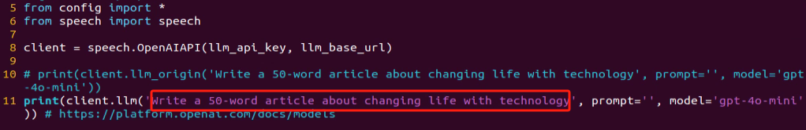
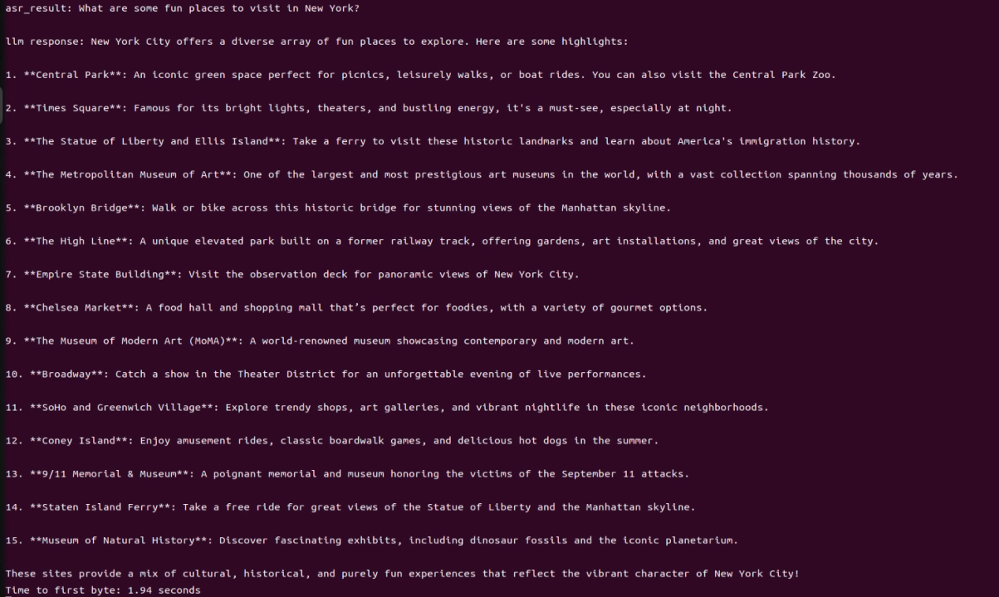
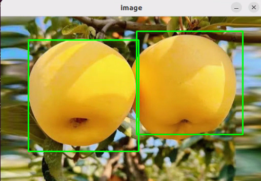
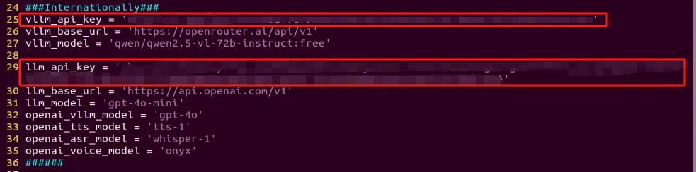
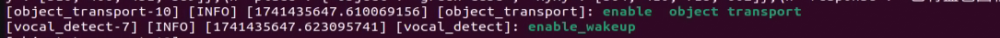

# 19. AI Large Model Courses

## 19.1 Large Models Basic Courses

### 19.1.1 Large Language Model Courses

* **Overview of Large Language Model**

A Large Language Model (LLM) is an advanced artificial intelligence model developed to comprehend and generate human language.


(1) Basic Concept

A Large Language Model (LLM) is a deep learning model trained on extensive text data, designed to either generate natural language text or comprehend the meaning of language. LLM is capable of performing various natural language tasks, such as text classification, question answering, and dialogue, making them a crucial step toward achieving advanced artificial intelligence. Unlike smaller models, LLM leverages a similar Transformer architecture and pretraining objectives (like Language Modeling), but are distinguished by their larger model size, greater training data, and enhanced computational resources.

(2) Features

**Massive Scale:** LLM are characterized by their vast parameter sizes, often reaching billions or even trillions of parameters. This immense scale allows them to capture a wealth of linguistic knowledge and complex syntactic structures.

**Pretraining and Fine-tuning:** LLM utilize a two-stage learning process: pretraining and fine-tuning. Initially, they are pretrained on large-scale, unlabeled text data, learning general language representations and knowledge. Subsequently, they are fine-tuned using labeled data to specialize in specific tasks, allowing them to excel across a wide range of NLP applications.

**Contextual Awareness:** LLM demonstrate exceptional contextual awareness, with their ability to understand and generate language deeply dependent on preceding text. This enables them to perform exceptionally well in tasks like dialogue, article generation, and contextual comprehension.

**Multilingual Capabilities:** LLM support multiple languages, extending beyond just English. This multilingual proficiency enables them to power cross-lingual and cross-cultural applications, enhancing their versatility and global reach.

**Multimodal Support:** Some LLMs have expanded to handle multimodal data, including text, images, and speech. This capability allows them to understand and generate content across various media types, opening up more diverse application possibilities.

**Emergent Properties:** LLM exhibit remarkable emergent properties, where performance improvements become apparent in large models but are absent in smaller ones. This makes them adept at handling more complex tasks and challenges.

**Cross-domain Applications:** LLM have been widely adopted across numerous fields, including text generation, machine translation, information retrieval, summarization, chatbots, and virtual assistants. Their influence is profound, impacting both daily life and work in significant ways.

**Ethical and Risk Considerations:** While LLM showcase impressive capabilities, they also raise important ethical and risk-related concerns, such as the potential generation of harmful content, privacy violations, and cognitive biases. As such, the development and deployment of LLM must be approached with careful consideration and caution.

(3) Working Principle

Large Language Model (LLM) are built on deep learning principles and are trained using massive datasets and substantial computational resources to develop neural networks with billions of parameters. Through iterative training and parameter optimization, these models learn to perform a wide range of tasks with high accuracy. The “large” in LLM reflects their immense scale—encompassing a vast number of parameters, extensive training data, and significant computational demands. This scale enables advanced models to achieve superior generalization capabilities and deliver increasingly accurate results, even in highly specialized domains.

Today, some of the most popular applications revolve around generative AI, such as language generation tools (e.g., ChatGPT) and image generation platforms (e.g., Midjourney). At the core of these applications is the concept of generation—the model’s ability to predict and produce coherent content based on a given input.

(4) Application Scenarios

① Text Generation

Large Language Models are capable of generating diverse types of text, including news articles, stories, poems, and more. These capabilities make them well-suited for applications in content creation, creative writing, and automated storytelling.

② Text Classification

Large Language Models can classify text into various categories, such as sentiment analysis and topic identification. These capabilities are especially valuable in scenarios like public opinion analysis, information retrieval, and content moderation.

③  Machine Translation

Large Language Models excel at machine translation, enabling the conversion of text from one language to another. These capabilities are essential for cross-language communication, localization, and global collaboration.

④ Question-Answering Systems

Large Language Models can be used to build question-answering systems that respond to user queries. These applications are particularly valuable in areas such as intelligent customer support, knowledge retrieval, and information lookup.

* **Large Language Model Deployment**

:::{Note}

This section outlines the steps to register on the official OpenAI website and obtain the API key for the Large Language Model.

:::

(1) OpenAI Account Registration and Setup

① Copy the following URL: <https://platform.openai.com/docs/overvie>

Open the OpenAI website and click on the "Sign Up" button in the top right corner.


② Follow the prompts to register and log in using your Google, Microsoft, or Apple account.


③ Click on the settings icon, then select Billing, followed by Payment Methods, to link your payment method. Recharge your account to purchase tokens.


④ After completing the setup, click on API Keys, then select Create New Secret Key. Follow the prompts to fill in the required information. Once the key is created, make sure to save it for future use.


⑤ With these steps, the large model has been successfully created and deployed. You can now use the API in the upcoming lessons.

(2) OpenRouter Account Registration and Setup

① Copy the following URL: https://openrouter.ai/

Open the webpage in your browser and click "Sign In". Register using your Google account or another available login option.


② After logging in, click the icon in the top-right corner and select **"Credits"** to link your payment method.


③ To create an API key, go to **"API Keys"**, then click **"Create Key"**. Follow the prompts to complete the process. Once the key is generated, make sure to save it for future use.


④ At this point, the large model is successfully created and deployed. You can now use the API in the upcoming lessons.

* **Large Language Model Accessing**

:::{Note}

To proceed with this section, you will need to register on the appropriate website and obtain the API key for the large model (please refer to the file [20.1.1 Large Language Model Courses -> Large Language Model Deployment]()).

:::

It is important to ensure a stable network connection for the development board. For optimal performance, we also recommend connecting the main controller to a wired network for enhanced stability.


(1) Environment Configuration

:::{Note}

If you have purchased a robot from our company with built-in large model functionality, the environment is already pre-configured in the robot’s image. You can directly proceed to Section 3 of this document to configure the API key.

:::

Install Vim and Gedit by running the corresponding commands. Install the necessary software packages and audio libraries required for PyAudio.

```
sudo apt update
```

```
sudo apt install vim
```

```
sudo apt install gedit
```

```
sudo apt install python3 python3-pip python3-all-dev python3-pyaudio portaudio19-dev libsndfile1
```


(2) Importing the Large Model Program Directory

① In this section, locate the '[Appendix -> Source Code]()' folder within the same directory as this tutorial document.


② Using the MobaXterm remote connection tool (as outlined in the '5.5 Remote Access and File Transfer' tutorial), drag the folder into the root directory of the main controller. The software installation package can be found in the '[Appendix -\> Remote Access and File Transfer]()' directory.


③ Next, execute the command to navigate to the **'speech_pkg' directory"**.

```
cd ~/large_models/speech_pkg/
```

④ Execute the following commands to install the necessary third-party libraries.

```
pip3 install -r requirements.txt --break-system-packages
```

```
pip3 install dashscope --break-system-packages
```

```
pip3 install opencv-python --break-system-packages
```

```
pip3 install sympy==1.13.1 --break-system-packages
```

```
pip3 install torch --break-system-packages
```

⑤ Then, use the command in the terminal to navigate to the **'speech'** directory.

```
cd ~/large_models/speech_pkg/speech
```

⑥ Run the command to list the files in the **'speech'** directory.

```
ls
```


⑦ Depending on the type of main controller and Python version you're using, switch to the appropriate folder for packaging and distribution. This tutorial uses the Jetson Orin controller as an example.

| **Type of main controller** | **Python version** |
| --------------------------- | ------------------ |
| jetson_nano                 | 3.6                |
| jetson_orin                 | 3.10               |
| rpi5                        | 3.11               |
| rpi5_docker                 | 3.8                |

⑧ Execute the following command to navigate to the Jetson Orin folder.

```
cd jetson_orin/
```

⑨ Enter the command to copy the 'speech.so' file to the parent directory.

```
cp -r speech.so ..
```

⑩ Enter the command to navigate to the parent directory.

```
cd ../..
```

⑪ Execute the command to package the speech file for the Python environment.

```
pip3 install .
```

⑫ Enter the command to install and update the OpenAI Python library.

```
pip3 install openai -U
```

(3) Key Configuration

① Open the terminal and enter the following command to navigate to the directory for configuring the large model keys:

```
cd ~/large_models
```

② Then, open the configuration file by running:

```
vim config.py
```

③ Once the file is open, configure the OpenAI and OpenRouter keys by filling in the llm_api_key and vllm_api_key parameters, respectively (you can obtain these keys from the '[19.1.1 Large Language Model Courses -> Large Language Model Deployment]()' course).


For instance, copy the key created in Section 1.2 of this chapter and paste it into the appropriate field. To paste the key, place the cursor between the quotation marks, hold the **"Shift"** key, right-click, and select **"Paste"** .

:::{Note}

Do not mix keys from different models, as this may cause the functionality to malfunction

:::


④  After pasting, press the **'Esc'** key, then type the following command and press Enter to save the file:

```
:wq
```

(4) Running the Demo Program

Once the keys are configured, you can run the demo program (openai_llm_demo.py) to experience the text generation capabilities of the large model. For example, the program's prompt might be: 'Write a 50-word article about how technology is changing life.'



① To run the demo, enter the following command in the terminal:

```
python3 openai_llm_demo.py
```

② After running the program, the output will appear as shown in the image below.


* **Semantic Understanding with Large Language Model**

Before starting this section, make sure you have completed the API key configuration outlined in the file [19.1.1 Large Language Model Courses ->  Large Language Model Accessing]().

In this lesson, we’ll use a large language model to analyze and summarize short passages of text.

(1) Start by opening a new terminal window, then navigate to the large model project directory:

```
cd large_models/
```

(2) Next, run the demo program with the following command:

```
python3 openai_llm_nlu_demo.py
```

(3) As shown in the output, the model demonstrates strong summarization abilities.


(4) The result matches the prompt defined in the program — where a passage of text is provided to the model, and it generates a concise summary.


* **Emotional Perception with Large Language Model**

To proceed with this section, ensure that you have completed the API key configuration as described in the file [20.1.1 Language Model Courses -> Large Language Model Accessing]().

In this lesson, we will use a large language model to assess its ability to perceive emotions based on descriptive words. We’ll provide the model with emotional expressions and evaluate its response.

(1) Start by opening a new terminal window, then navigate to the large model project directory:

```
cd large_models/
```

(2) Next, run the demo program with the following command:

```
python3 openai_llm_er_demo.py
```

(3) From the output, you will see that the model successfully identifies and understands the emotions conveyed, providing a text-based response accordingly.


(4) In this program, we send two emotional expressions to the model: the first is an expression of sadness, **"So Sad."** After the model responds, we then send an expression of happiness, "Ha Ha," and observe how the model reacts.


### 19.1.2 Large Speech Model Courses

* **Overview of Large Speech Model**

(1) What is a Large Speech Model?

A Speech Large Model (LSM) refers to a machine learning model that uses deep learning techniques to process and understand speech data. These models can be applied in a variety of tasks, such as speech recognition, speech synthesis, speech translation, and emotional analysis of speech. The design and training of these models typically require large amounts of speech data and substantial computational resources, which is why they are referred to as "large models."

(2) Why Do We Need Large Speech Model?

With the advancement of artificial intelligence and deep learning, traditional speech processing methods face many limitations. Large models leverage vast amounts of data and deep neural networks to learn and understand the complex features within speech, thereby improving the accuracy and naturalness of speech recognition and generation.

Their advantages include:

① High Accuracy: They maintain a high recognition rate even in noisy environments and with various accents.

② Naturalness: Speech generated by synthesis models is more natural, closely resembling human speech.

③ Versatility: These models support a wide range of languages and tasks, such as multilingual speech recognition, speech-to-text (STT), text-to-speech (TTS), and emotion recognition.

(3) Development of Speech Recognition Technology

Word-Level Speech Recognition: At this stage, speech recognition systems could only recognize individual words

Phrase-Level Speech Recognition: With the expansion of data and advancements in algorithms, speech recognition systems gradually gained the ability to recognize longer phrases, such as "Please turn on my computer."

Sentence-Level Speech Recognition: In recent years, with the emergence of AI large models, speech recognition systems have become capable of recognizing entire sentences and understanding their underlying meaning.

(4) Differences Between Large Speech Model and Traditional Speech Processing Technologies

① Processing Methods

Traditional Speech Processing Technologies: These typically rely on manual feature extraction and shallow models, such as Gaussian Mixture Models (GMM) and Hidden Markov Models (HMM), to process speech signals.

Large Speech Model: These use end-to-end learning, directly mapping raw speech waveforms to target outputs (such as text or another speech signal), reducing the reliance on manual feature extraction. They are typically based on deep learning architectures, such as Convolutional Neural Networks (CNN), Recurrent Neural Networks (RNN), and Transformers.

② Model Complexity

Traditional Speech Processing Technologies: These models are relatively simple, with fewer parameters.

Large Speech Model: These models have complex structures and a large number of parameters, enabling them to capture more subtle speech features and contextual information.

③ Recognition Capability

Traditional Speech Processing Technologies: These are highly adaptable to specific scenarios and conditions, but their recognition capability is limited when encountering new, unseen data.

Large Speech Model: Due to their large number of parameters and powerful learning ability, they offer superior recognition capabilities and can adapt to a wider variety of speech data and environments.

④Training Data Requirements

Traditional Speech Processing Technologies: These typically require less data for training, but the data must be highly annotated and of high quality.

Large Speech Model: These require vast amounts of training data to fully learn the complexities of speech, often necessitating large quantities of annotated data or the use of unsupervised/self-supervised learning methods.

(5) Core Technologies of Speech Large Model

① Automatic Speech Recognition (ASR)

ASR is the technology that converts human speech into text. The core steps of a speech recognition system include feature extraction, acoustic modeling, and language modeling.

② Text-to-Speech (TTS)

TTS is the technology that converts text into speech. Common speech synthesis models include the Tacotron series, FastSpeech, and VITS.

③ Speech Enhancement and Noise Reduction

Speech enhancement techniques are used to improve the quality of speech signals, typically for eliminating background noise and echoes. This is crucial for speech recognition applications in noisy environments.

(6) Applications of Speech Large Model

Intelligent Voice Assistants: For instance, Amazon Alexa and Google Home, which engage with users through voice interactions.

Customer Service Chatbots: In the customer service sector, speech large models assist businesses in enhancing service efficiency by swiftly processing customer inquiries through speech recognition technology, enabling 24/7 support.

Healthcare: Helping doctors with medical record-keeping, thus improving work efficiency.

Speech-to-Text: Speech large models excel in converting speech to text, offering accurate recognition and transcription in a variety of contexts. They are widely used in applications such as meeting transcription and subtitle generation.

* **Voice Device Introduction and Testing**

(1) Device Overview

① WonderEchoPro

Introduction：

WonderEcho Pro, also known as the AI Voice Interaction Box, is equipped with a high-performance noise-canceling microphone and a high-fidelity speaker. It utilizes a USB-to-audio module, making it plug-and-play with no drivers required, and is compatible with multiple operating systems for both playback and recording.

Integrating various voice processing technologies, WonderEcho Pro features advanced noise suppression algorithms that effectively filter background noise from the environment. It supports a complete voice interaction process—from wake-up to recognition and response. With its modular design, each functional component (e.g., wake word detection, sound detection, speech recognition, and synthesis) can be developed and tested independently.

Features and Specifications：

Built-in microphone and speaker interface, supporting both audio input and output

Driver-free, plug-and-play functionality compatible with Windows, macOS, Linux, Android, and more

Standard USB 2.0 interface

Control interface: USB

Voice chip model: CL1302

Speaker output: 3.0W per channel (4Ω BTL)

Power supply voltage: 5V

② 6-Microphone Circular Array

Introduction：

The 6-Microphone Circular Array is a high-sensitivity, high signal-to-noise ratio microphone board. It features six analog silicon microphones arranged in a circular pattern. When paired with a main control board, it supports high-performance Acoustic Echo Cancellation (AEC), environmental noise reduction, and factory-level voice pickup from up to 10 meters.


Features and Specifications：

**Operating Voltage:** 3.3V (typical)

**Operating Current:** 0.8mA (typical)

**Operating Temperature:** -20°C (min), 25°C (typical), 70°C (max)

**Operating Humidity:** Up to 95% relative humidity (max)

(1) Recording and Playback Test

The following demonstration uses the Raspberry Pi 5 as an example. The connection and testing steps are also applicable to other compatible devices such as the Jetson series:

① Connection Illustration and Detection


If the main controller is a Raspberry Pi, you can use VNC remote desktop access (refer to the appendix: Remote Access and File Transfer) to log into the Raspberry Pi system. Once connected, check the upper right corner of the desktop for microphone and speaker icons. As shown in the image below, the presence of these icons indicates a successful connection.


If you're using a NVIDIA Jetson device, you can connect via the NoMachine remote access tool. After logging in, check the upper right corner of the system interface for the speaker icon to confirm successful detection.


② Recording Test

Next, open a new terminal window and enter the following command to check the available recording devices. Note that the -l option is a lowercase "L". You should see the card number (card) listed—for example, card 0. This is just an example; please refer to your actual query result.

```
arecord -l
```


Then, use the following command to start recording. Replace the red-marked card number (hw:0,0) with the actual number you found in the previous step:

```
arecord -D hw:0,0 -f S16_LE -r 16000 -c 2 test.wav
```

This will create a test.wav audio file in the current directory.

You can record a short 5-second sample, then press Ctrl + C to stop the recording.

③ Playback Test

After the recording is complete, you can check whether the audio file was successfully created by listing the contents of the current directory:

```
ls
```


If test.wav appears in the list, the recording was successful. To play back the recording, use the following command:

```
aplay test.wav
```

* **Voice Wake-Up**

In this lesson, we’ll learn how to use a large speech model to activate the voice device by speaking a predefined wake word through a program.

(1) WonderEcho Pro Wake-Up

Device Check：

To proceed, we need to identify the USB device name assigned to the connected WonderEcho Pro or Circular Microphone Array (hereafter referred to as the voice device). Please follow the steps below carefully. 

:::{Note}

Do not connect any other USB devices during this process to avoid confusion.

:::

① First, disconnect the voice device, then open a terminal and run the following command:

```
ll /dev | grep USB
```

② Next, reconnect the voice device to the USB port on your main board and run the same command again:

```
ll /dev | grep USB
```

③ You should now see a newly listed USB port, such as ttyCH341USB1.  

Please take note of this device name—it may vary depending on the main controller being used.


Wake-Up Test：

① To begin, update the port number used in the program by editing the script. You’ll also need to uncomment the line for the port you're using and comment out any unused ports.

```
vim wakeup_demo.py
```

Press i to enter edit mode and make the necessary changes as shown below (update the port number accordingly and adjust comments as needed).


Once the changes are complete, press ESC, then type :wq and press Enter to save and exit the editor.

② Next, return to the system interface and run the wake-up demo using the command below. Speak the wake word **“HELLO HIWONDER”** clearly toward the WonderEcho Pro voice device.  

If the output includes **“keyword detect”**, it indicates that the firmware has been successfully flashed and the wake word is functioning correctly.

```
python3 ~/large_models/wakeup_demo.py
```


(2) 6-Microphone Circular Array

As with the WonderEcho Pro, you can connect the 6-Microphone Circular Array to your main board (Raspberry Pi or NVIDIA Jetson) using a Type-C to USB cable.

Device Check:

For Jetson users, connect to the Jetson system using the NoMachine remote access tool. Once connected, check the desktop interface.  

If the 6-Microphone Circular Array icon appears on the left side of the desktop, it indicates the device has been successfully recognized.

Wake-Up Test:

① Open a new terminal window and run the following command to edit the wakeup_demo.py script:

```
vim ~/large_models/wakeup_demo.py
```

② Press i to enter edit mode.

③ Update the port to match the device port number you previously identified. Comment out the WonderEcho Pro configuration (add \# at the beginning of the corresponding line), and uncomment the line using the circular microphone array on line 11 as the input device (see red box in the referenced image).


④ Press ESC to return to command mode, then type :wq and press Enter to save and exit.


⑤ In the terminal, run the wake-up program with the following command:

```
python3 ~/large_models/wakeup_demo.py
```

⑥ After about 30 seconds of initialization, speak the wake word **“hello hiwonder”** to test the device.


(3) Brief Program Overview

This is a Python-based wake word detection script that utilizes the speech module to process audio input and detect a specific wake word (e.g., “HELLO_HIWONDER”).

Source Code Path: [/home/ubuntu/large_models/wakeup_demo.py]()

Importing Required Modules

{lineno-start=5}

```
import os
import time
from speech import awake
```

`os`: Used for handling file paths and executing system-level commands.

`time`: Provides delay functions to prevent overly frequent detection attempts.

`speech`: The core module responsible for processing audio input and detecting the wake word.

Initializing the wonderecho Class

{lineno-start=9}

```
port = '/dev/ttyUSB0'
kws = awake.WonderEchoPro(port)
```

Attempts to Turn Off the Cooling Fan on Raspberry Pi 5

{lineno-start=13}

```
try:  # If a fan is present, it's recommended to turn it off before detection to reduce interference(如果有风扇，检测前推荐关掉减少干扰)
    os.system('pinctrl FAN_PWM op dh')
except:
    pass
```

Purpose: Attempts to turn off the cooling fan by executing the system command `pinctrl FAN_PWM op dh`. This helps minimize background noise from the fan that could interfere with wake word detection.

Error Handling: If the command fails (e.g., due to unsupported hardware), the program catches the exception and continues running without interruption.

Main Wake Word Detection Loop

{lineno-start=18}

```
kws.start() # Start detection(开始检测)
print('start...')
```

The program starts the wake word detection thread using kws.start().

It prints start... to indicate that detection has been successfully initiated.

Main Program Logic

{lineno-start=20}

```
while True:
    try:
        if kws.wakeup(): # Wake-up detected(检测到唤醒)
            print('hello hiwonder')
        time.sleep(0.02)
    except KeyboardInterrupt:
        kws.exit() # Cancel processing (关闭处理)
        try:
            os.system('pinctrl FAN_PWM a0')
        except:
            pass
        break
```

During each iteration, the program checks whether the wake word has been detected. If the wake word is detected, it prints keyword detected.

The detection frequency is controlled using time.sleep(0.02) to prevent excessive CPU usage.

Pressing Ctrl+C triggers a KeyboardInterrupt, which gracefully exits the detection loop.

Upon exit, the program calls kws.exit() to stop the wake word detection process.

The fan is then restored to its original state (if applicable).

(4) Extended Functionality

Modifying the Wake-Up Response Text

In this section, you'll learn how to change the message that appears after a successful wake word detection.

① For example, if the wake word "HELLO_HIWONDER" is detected, and you'd like the program to print "hello" instead of the default message, follow the steps below. Navigate to the large_models directory and open the script with:

```
vim wakeup_demo.py
```

② Press i to enter INSERT mode (you’ll see -- INSERT -- at the bottom of the screen). Locate the line ‘**print('hello hiwonder')**’, and modify it to ‘print('hello')’

```
i
```


③ Press ESC, then type **:wq** and press Enter to save and exit.

```
:wq
```

④ Finally, run the program with:

```
python3 wakeup_demo.py
```


(5) Creating Custom Firmware for WonderEchoPro

If you'd like to create more advanced or customized wake words and voice commands, please refer to the document titled:  

“[Appendix →  Firmware Flashing Tool → Creating Firmware for WonderEchoPro]()”.

* **Speech Recognition**

(1) What is Speech Recognition?

Speech Recognition (Speech-to-Text, STT) is a technology that converts human speech signals into text or executable commands. In this course, we will implement speech recognition functionality using Alibaba OpenAI's Speech Recognition API.

(2) How It Works

The wave library is used to extract audio data. The extracted audio is then sent to OpenAI’s ASR (Automatic Speech Recognition) model. The recognized text returned by the ASR model is stored in speech_result for use in subsequent processes.

(3) Preparation Before the Experiment

Before proceeding, refer to the course “[19.1.2 Large Speech Model Courses -> Large Language Models Deployment]()” to obtain your API key, and make sure to add it into the configuration file (config).

(4) Experiment Steps

① Power on the device and connect to it using MobaXterm.  

(For detailed instructions, please refer to [Appendix ->Remote Connection Tools and Instructions]().)

② Navigate to the program directory by entering the following command:

```
cd large_models/
```

③ Open the configuration file to input your API Key by entering the command below. Press i to enter INSERT mode and enter your API Key. Once finished, press Esc, type :wq, and hit Enter to save and exit.

```
vim config.py
```


④ Run the speech recognition program with:

```
python3 openai_asr_demo.py
```

(5) Function Realization

After the program starts, the microphone will recognize the recorded audio content from the user and print the converted text output.


(6) Brief Program Analysis

This program implements a speech recognition system by calling OpenAI's Speech-to-Text API to convert audio files into text.

The program source code is located at: [/home/ubuntu/large_models/openai_asr_demo.py]()

① Module Import

{lineno-start=6}

```
from speech import speech
```

The speech module encapsulates ASR (Automatic Speech Recognition) functionalities, such as connecting to an external ASR service.

② Define ASR Class

{lineno-start=11}

```
asr = speech.RealTimeOpenAIASR()
```

asr = speech.RealTimeOpenAIASR()

This line creates a real-time speech recognition object named asr. The RealTimeOpenAIASR class is used to interact with the speech recognition service.

③ Speech Recognition Functionality

{lineno-start=13}

```
asr.update_session(model='whisper-1', language='en', threshold=0.2, prefix_padding_ms=300, silence_duration_ms=800) 
```

An ASR client object is created to prepare for invoking the speech recognition service.

The asr.asr() method is called to send the audio file (wav) to the ASR service for recognition.

The recognized result (typically text) is printed to the console.

(7) Function Extension

You can modify the model name to enable speech recognition in various languages, such as Chinese, English, Japanese, and Korean.

① Enter the following command to edit the script:

```
vim openai_asr_demo.py
```

② Press the i key to enter INSERT mode, and update the model setting. For example, modify it to use the gpt-4o-transcribe model.

```
i
```


③ Then, run the program with the command:

```
python3 openai_asr_demo.py
```

④ Record a sample sentence such as "Hello, can you hear me clearly?", and the recognized text will be printed on the console.


* **Speech Synthesis**

(1) What is Speech Synthesis?

Speech synthesis (SS) is a technology that converts written text into intelligible spoken audio. It enables computers to generate natural, human-like speech for communication or information delivery.

In this course, we will run a program that processes text using a large language model and generates corresponding audio.

(2) How It Works

The program first sends the text to the OpenAI TTS (Text-to-Speech) model. The model returns the generated audio data, which is saved as a file named tts_audio.wav for playback or storage.

(3) Preparation Before the Experiment

Refer to the course “[19.1 Large Models Basic Courses ->19.1.1Large Language Models Courses -> Large Language Models Deployment]()” to obtain your API key, and update the configuration file accordingly.

(4) Experiment Steps

① Power on the device and connect to it using MobaXterm (refer to the [appendix -> Remote Connection Tools and Instructions]()" for detailed guidance).

② Navigate to the program directory by entering the following command:

```
cd large_models/
```

③ Open the configuration file to enter your API Key. After editing, press Esc, type :wq, and hit Enter to save and exit:

```
vim config.py
```


④ Finally, run the program with the following command:

```
python3 openai_tts_demo.py
```

(5) Function Realization

Upon running the program, it will play an audio message saying "Hello, Can I Help You", and simultaneously save the audio file with the same content to the following directory:  

[/home/ubuntu/large_models/resources/audio/]()


(6) Brief Program Analysis

This program is a speech synthesis system based on OpenAI’s Text-to-Speech (TTS) API, capable of converting text into audio files. It supports input text and outputs audio in formats like PCM, WAV, FLAC, AAC, Opus, and MP3. By specifying the desired text, the program sends the request to the API and returns the synthesized audio, which can be played or saved locally.

The source code for this program is located at:  [/home/ubuntu/large_models/openai_tts_demo.py]()

① Module Import

{lineno-start=5}

```
from config import *
from speech import speech  
```

speech: This module encapsulates the TTS functionalities.

② Definition for TTS Class

{lineno-start=8}

```
tts = speech.RealTimeOpenAITTS()
tts.tts("Hello, Can I help you?") # https://platform.openai.com/docs/guides/text-to-speech
tts.tts("Hello, Can I help you?", model="tts-1", voice="onyx", speed=1.0, instructions='Speak in a cheerful and positive tone.')
tts.save_audio("Hello, Can I help you?", model="gpt-4o-mini-tts", voice="onyx", speed=1.0, instructions='Speak in a cheerful and positive tone.', audio_format='wav', save_path="./resources/audio/tts_audio.wav")
```

`speed`: Specifies the playback speed; the default value is 1.

For intelligent real-time applications, it is recommended to use the gpt-4o-mini-tts model. 

Other available models include tts-1 and tts-1-hd. tts-1 offers lower latency but with slightly reduced quality compared to tts-1-hd.

Voice Options: nova, shimmer, echo, onyx, fable, alloy, ash, sage, coral.

For more details, you can refer to the OpenAI documentation:

https://platform.openai.com/docs/guides/text-to-speech

③ Function Extension

To change the voice, follow these steps:

Step1 : Open the program by entering the command:

```
vim openai_tts_demo.py
```

Step2 : Press i on your keyboard to enter INSERT mode. Locate the line voice="onyx" and modify it to voice="nova".

```
i
```


Step3 : Press Esc, then type :wq and hit Enter to save and exit.

```
:wq
```


Step4 : Execute the program with the following command:

```
python3 openai_tts_demo.py
```


Once the program starts, the speaker will play the synthesized audio using the newly selected voice style.

* **Voice Interaction**

(1) What is Voice Interaction?

Voice Interaction (VI) refers to a method of communication between humans and computers or devices through spoken language. It integrates speech recognition and speech synthesis, enabling devices to both understand user commands and respond naturally, creating true two-way voice communication. To achieve natural voice interaction, factors such as semantic understanding and sentiment analysis must also be considered, allowing the system to accurately interpret user intent and provide appropriate responses.

This approach can be used as the foundation for developing our own AI assistant features.

(2) How It Works

First, the wake word detection module listens for a specific wake-up word. Once detected, it initiates audio recording. After recording, Automatic Speech Recognition (ASR) converts the audio into text, which is then sent to a Large Language Model (LLM) to generate an appropriate response. The generated text is subsequently converted into speech through a Text-to-Speech (TTS) module and played back to the user. This entire process enables seamless and natural interaction between the user and the voice assistant.

(3) Experiment Steps

① Power on the device and connect to it via MobaXterm (refer to Appendix "5.1 Remote Connection Tools and Instructions" for connection guidance).

② To check the microphone's port number, first disconnect the microphone and run the command. Then reconnect the microphone and run the command again to determine the port number (Note: do not connect any other USB devices during this process).

```
ll /dev | grep USB
```

After disconnecting the microphone, no USB device should appear.


Upon reconnecting the microphone, a USB port (e.g., ttyCH341USB1) will be listed (make sure to note this device name). The device name may vary depending on the main controller.

③ Navigate to the program directory:

```
cd large_models/
```

④ Open the configuration file to enter your API Key. After editing, press Esc, then type :wq and hit Enter to save and exit:

```
vim config.py
```


⑤ Enter the port number you obtained and modify the corresponding microphone port settings for either WonderEcho Pro or the six-microphone setup. Uncomment the configuration for the port you intend to use and comment out the settings for any unused ports.

```
vim openai_interaciton_demo.py
```

If you are using the WonderEcho Pro, modify the corresponding section:

If you are using the 6-Microphone Array, modify the relevant section:


⑥ Run the program:

```
python3 openai_interaciton_demo.py
```

⑦ To stop the program at any time, simply press Ctrl+C.

(4) Function Realization

After successful execution, the voice device will announce 'I’m ready.' Then, upon hearing the wake-up word 'HELLO_HIWONDER,' the device will respond with 'I’m here,' indicating that the assistant has been successfully awakened. You can now ask the AI assistant any questions:

For example: 'What are some fun places to visit in New York?'



(5) Brief Program Analysis

The program integrates voice recognition, speech synthesis, and intelligent response functionalities to create a voice assistant. Interaction is initiated through the wake-up word (HELLO_HIWONDER). Users can converse with the assistant via voice commands, and the assistant will respond using text-to-speech technology. The overall structure is clear, with distinct modules that are easy to expand and maintain.

The source code for this program is located at: [/home/ubuntu/large_models/openai_interaction_demo.py]()

(1) Module Import

{lineno-start=5}

```
import os
import time
from config import *
from speech import awake
from speech import speech
```

time: Used to control the interval between program executions.

speech: The core module, integrating wake-up word detection, speech activity detection, speech recognition, TTS, and LLM.

(2) Definition of Audio File Paths

{lineno-start=11}

```
wakeup_audio_path = './resources/audio/en/wakeup.wav'
start_audio_path = './resources/audio/en/start_audio.wav'
no_voice_audio_path = './resources/audio/en/no_voice.wav'
```

This section configures the audio file paths used by various functional modules, such as wake-up sounds, recording storage paths, and prompt sounds.

The text-to-speech (TTS) module is initialized to convert LLM responses into speech.

(3) Main Functional Logic

{lineno-start=33}

```
def main():
    kws.start()
    while True:
        try:
            if kws.wakeup(): # Wake word detected(检测到唤醒词)
                speech.play_audio(wakeup_audio_path)  # Play wake-up sound(唤醒播放)
                asr_result = asr.asr() # Start voice recognition(开启录音识别)
                print('asr_result:', asr_result)
                if asr_result:
                    # Send the recognition result to the agent for a response(将识别结果传给智能体让他来回答)
                    response = client.llm(asr_result, model='gpt-4o-mini')
                    print('llm response:', response)
                    tts.tts(response)
                else:
                    speech.play_audio(no_voice_audio_path)
            time.sleep(0.02)
        except KeyboardInterrupt:
            kws.exit() 
            try:
                os.system('pinctrl FAN_PWM a0')
            except:
                pass
            break
        except BaseException as e:
            print(e)
```

Wake-up Detection: Continuously monitors for the wake-up word. Once detected, it stops the wake-up detection and plays the wake-up prompt sound.

Voice Processing: Records and recognizes the user's speech, uses the language model to generate a response, and then converts the response into speech for playback.

Error Handling: Catches exit signals and runtime errors to ensure the program exits safely and releases resources.

### 19.1.3 Vision Language Model Courses

* **Overview of Vision Language Model**

Vision Language Model (VLM) integrate visual recognition capabilities into traditional Language Model (LLM), enabling more powerful interactions between vision and language through multimodal inputs.

(1) Basic Concept

Vision Language Model (VLM) are a type of artificial intelligence model that leverages deep learning techniques to learn from and process large-scale visual data. These models often adopt convolutional neural network (CNN) architectures, enabling them to extract rich visual features from images or video streams and perform various tasks such as image classification, object detection, and facial recognition. In theory, VLM possess powerful capabilities in feature extraction and pattern recognition, making them widely applicable in fields like autonomous driving, facial recognition, and medical imaging analysis.

(2) Features

**Multimodal Input and Output**: VLM can process both images and text as input and generate various forms of output, including text, images, charts, and more.

**Powerful Visual-Semantic Understanding**: With extensive knowledge accumulated from large-scale visual datasets, VLMsexcel at tasks such as object detection, classification, and image captioning.

**Visual Question Answering (VQA):** VLM can engage in natural language conversations based on the content of input images, accurately answering vision-related questions.

**Image Generation:** Some advanced VLM are capable of generating simple image content based on given conditions.

**Deep Visual Understanding:** These models can recognize intricate details within images and explain underlying logical and causal relationships.

**Cross-Modal Reasoning:** VLM can leverage visual and linguistic information together, enabling reasoning across modalities, such as inferring from language to vision and vice versa.

**Unified Visual and Language Representation Space:** By applying attention mechanisms, VLM establish deep connections between visual and semantic information, achieving unified multimodal representations.

**Open Knowledge Integration:** VLM can integrate both structured and unstructured knowledge, enhancing their understanding of image content.

(3) How It Works

The working principle of Vision Language Model is primarily based on deep learning techniques, particularly Convolutional Neural Networks (CNNs) and Transformer architectures. Through multiple layers of neurons, these models perform feature extraction and information processing, enabling them to automatically recognize and understand complex patterns within images.

In a VLM, the input image first passes through several convolutional layers, where local features such as edges, textures, and shapes are extracted. Each convolutional layer is typically followed by an activation function (e.g., ReLU) to introduce non-linearity, allowing the model to learn more complex representations. Pooling layers are often used to reduce the dimensionality of the data while preserving important information, helping to optimize computational efficiency.

As the network deepens, it gradually transitions from extracting low-level features (like edges and corners) to higher-level features (such as objects and scenes). For classification tasks, the final feature vector is passed through fully connected layers to predict the probability of different target categories. For tasks like object detection and segmentation, the model outputs bounding boxes or masks to indicate the location and shape of objects within the image.

Transformer-based VLM divide images into small patches, treating them as sequential data, and apply self-attention mechanisms to capture global relationships within the image. This approach is particularly effective at modeling long-range dependencies, enabling VLM to excel at understanding complex visual scenes.

Training VLM typically requires large-scale labeled datasets. Through backpropagation, the model optimizes its parameters to minimize the loss between predictions and ground-truth labels. Pretraining on massive datasets allows the model to acquire general-purpose visual features, while fine-tuning on specific tasks further improves performance for specialized applications.

Thanks to this design, Visual Language Models are able to process and understand visual data effectively, and are widely used in applications like image classification, object detection, and image segmentation, driving rapid progress in the field of computer vision.

(4) Application Scenarios

① Image Captioning

VLM can automatically generate textual descriptions based on input images. This capability is particularly valuable for social media platforms, e-commerce websites, and accessibility technologies, such as providing visual content descriptions for visually impaired users.

② Visual Question Answering

Users can ask questions related to an image, such as "What is in this picture?" or "What color is the car?" The model analyzes the image content and provides accurate, natural-language responses, making it highly applicable in fields such as education, customer support, and information services.

③ Image Retrieval

In image search engines, users can perform searches using text descriptions, and Vision Language Model (VLM) can understand the descriptions and return relevant images. This capability is especially important on e-commerce platforms, where it allows users to find desired products more intuitively.

④ Augmented Reality (AR)

Vision Language Model (VLM) can provide real-time visual feedback and language-based explanations in augmented reality applications. When users view real-world scenes through a device's camera, the system can overlay relevant information or guidance, enhancing the overall user experience.

⑤ Content Creation and Editing

In design and creative tools, Vision Language Model (VLM) can generate relevant text content or suggestions based on a user’s visual input (such as sketches or images), helping users complete creative work more efficiently.

⑥ Social Media Interaction

On social media platforms, VLM can generate appropriate comments or tags based on user-uploaded images, enhancing engagement and interaction.

⑦ Medical Imaging Analysis

In the healthcare field, VLM can be used to analyze medical images (such as X-rays and CT scans) and generate diagnostic reports or recommendations, assisting doctors in making more accurate decisions.

* **Vision Language Model Accessing**

:::{Note}

* This section requires the configuration of the API key in "[20.1.3 Vision Language Model Accessing -> Vision Language Model Accessing]()" before proceeding. Additionally, ensure that the images to be used in this section are imported.

* This experiment requires either an Ethernet cable or Wi-Fi connection to ensure the main control device can access the network properly.

  :::

(1) Experiment Steps

Execute the following command to navigate to the directory of Large Model.

```
cd large_models/
```

Run the program:

```
python3 openai_vllm_understand.py
```

(2) Function Realization

After running the program, the output printed matches our request of "Describe the image."


* **Vision Language Model: Object Detection**

:::{Note}

* This section requires the configuration of the API key in "[19.1.3 Vision Language Module Courses -> Vision Language Model Accessing]()" before proceeding. Additionally, ensure that the images to be used in this section are imported.

* This experiment requires either an Ethernet cable or Wi-Fi connection to ensure the main control device can access the network properly.

* In this course, we will use a program to transmit an image to the large model for recognition, which will then identify and locate the objects within the image by drawing bounding boxes around them.

:::

(1) Experiment Steps

① Execute the following command to navigate to the directory of Large Model.

```
cd large_models/
```

② Run the program:

```
python3 qwen_vllm_detect_demo.py
```

(2) Function Realization

After running the program, the positions of the fruits in the image will be circled.




(3) Function Expansion

We can switch the image and change the large model to experience different functionalities of various models.

Change Pictures:

① Click on the path box to navigate to the following directory: [/home/ubuntu/large_models/resources/pictures/]()

Here, you can drag in other images, for example, in the apples.png format.


② Then, input the command:

```
vim large_models/qwen_vllm_detect_demo.py
```

③ Press the "i" key on your keyboard, which will display **"INSERT"** at the bottom.

```
i
```


④ Change the image recognition path from: `./resources/pictures/test_image_understand.jpeg`

To: image = cv2.imread('./resources/pictures/apples.png')


⑤ Next, input the following command and execute the program again to see the results

```
python3 qwen_vllm_detect_demo.py
```


* **Vision Language Model: Scene Understanding**

:::{Note}

* This section requires the configuration of the API key in "[Vision Language Model Accessing]() " before proceeding. Additionally, ensure that the images to be used in this section are imported.

* This experiment requires either an Ethernet cable or Wi-Fi connection to ensure the main control device can access the network properly.

* In this course, we will use a program to send an image to the large model for recognition and generate a description of the content within the image.

(1) Experiment Steps

① Execute the following command to navigate to the directory of Large Model.

```
cd large_models/
```

② Run the program:

```
python3 openai_vllm_understand.py
```

(2) Function Realization

After running the program, the output printed matches our request of "Describe the image."


(3) Function Expansion

If you need to recognize your own image, you should place the image in the corresponding path and modify the image path in the program.

① First, drag your image directly into the ~/large_models/resources/pictures/ path using MobaXterm, and rename the image to test.png.


② Then, open the scene understanding script by entering the following command in the terminal:

```
vim ~/large_models/vllm_understand.py
```

③ Change the image path in the code to reflect the name of your image (e.g., test.png).


④ Run the program:

```
python3 ~/large_models/openai_vllm_understand.py
```


* **Vision Language Model: Optical Character Recognition** 

:::{Note}

* This section requires the configuration of the API key in "1.3.2 Vision Language Model Accessing" before proceeding. Additionally, ensure that the images to be used in this section are imported.

* This experiment requires either an Ethernet cable or Wi-Fi connection to ensure the main control device can access the network properly.

* In this course, we use a program to transmit an image to the large model for recognition, extracting and identifying the text within the image.

  :::

(1) Experiment Steps

① Execute the following command to navigate to the directory of Large Model.

```
cd large_models/
```

② Run the program:

```
python3 openai_vllm_ocr.py
```

(2) Function Realization

After running the program, the output printed will be consistent with the content of the image sent.


(3) Function Expansion

We can switch the image and change the large model to experience different functionalities of various models.

Change Pictures：

① Drag the image directly into the `~/large_models/resources/pictures/` path using MobaXterm. Here, we can drag in the image named 'ocr1.png' as an example, and let the program recognize the text 'COME ON'.


② Then, input the command:

```
vim ~/large_models/openai_vllm_ocr.py
```

③ Press the **"i"** key on your keyboard, which will display **"INSERT"** at the bottom.

```
i
```


④ Change the image recognition path from: ./resources/pictures/ocr.jpeg

To: image = cv2.imread('./resources/pictures/ocr1.png')

```
image = cv2.imread('./resources/pictures/ocr1.png)
```

⑤ Run the program:

```
python3 ~/large_models/openai_vllm_ocr.py
```


### 19.1.4 Multimodal Model Basic Courses

* **Overview of Multimodal Model**

The emergence of Multimodal Model is built upon continuous advancements in the fields of Large Language Model (LLM) and Vision Language Model (VLM).

(1) Basic Concept

As LLM continue to improve in language understanding and reasoning capabilities, techniques such as instruction tuning, in-context learning, and chain-of-thought prompting have become increasingly widespread. However, despite their strong performance on language tasks, LLM still exhibit notable limitations in perceiving and understanding visual information such as images. At the same time, VLM have made significant strides in visual tasks such as image segmentation and object detection, and can now be guided by language instructions to perform these tasks, though their reasoning abilities still require further enhancement.

(2) Features

The core strength of Multimodal Model lies in their ability to understand and manipulate visual content through language instructions. Through pretraining and fine-tuning, these models learn the associations between different modalities—such as how to generate descriptions from images or how to identify and classify objects in visual data. Leveraging self-attention mechanisms from deep learning, Multimodal Model can effectively capture relationships across modalities, allowing them to synthesize information from multiple sources during reasoning and decision-making processes.

**Multimodal Fusion Capability:** Multimodal Model can process and understand multiple types of data simultaneously, including text, images, and audio. This fusion ability enables the models to build connections across modalities, leading to a more comprehensive understanding of information. For instance, a model can generate natural language descriptions based on an image or identify specific objects within an image based on a text query.

**Enhanced Contextual Understanding:** By integrating information from different modalities, Multimodal Model excel at contextual understanding. They can not only recognize content within a single modality but also combine clues from multiple sources to make more accurate judgments and decisions in complex tasks.

**Flexible Interaction Methods:** Users can interact with Multimodal Model through natural language instructions, making communication with the models more intuitive without requiring knowledge of complex programming or operations. For example, users can simply ask about details in an image, and the model can provide relevant answers.

**Scalability:** The architecture and training methods of Multimodal Model allow them to adapt to new modalities and tasks. As technology evolves, additional types of data—such as videos or sensor readings—can be incorporated, expanding their range of applications and capabilities.

**Strong Generative Capabilities:** Similar to large language models, Multimodal Model perform exceptionally well in generating both textual and visual content. They can produce natural language descriptions, summaries, and even create novel visual outputs, meeting a wide variety of application needs.

**Improved Reasoning Abilities:** Although challenges remain, Multimodal Model demonstrate significantly enhanced reasoning capabilities compared to traditional single-modality models. By integrating multimodal information, they can reason effectively in more complex scenarios, supporting advanced tasks such as logical reasoning and sentiment analysis.

**Adaptability and Personalization:** Multimodal Model can be fine-tuned to meet user-specific needs and preferences, enabling highly personalized services. This adaptability offers great potential for applications in fields such as education, entertainment, and customer service.

(3) How It Works

The working principle of Multimodal Model is built upon advanced deep learning and neural network technologies, with a core focus on fusing data from different modalities to understand and tackle complex tasks. At the foundation, Multimodal Model often adopt architectures similar to Transformers, which are highly effective at capturing relationships between different parts of input data. During training, these models are exposed to massive amounts of multimodal data—such as images, text, and audio—and leverage large-scale unsupervised learning for pretraining. Through this process, the models learn the commonalities and differences across modalities, enabling them to grasp the intrinsic connections between various types of information.

In practice, incoming text and visual data are first embedded into a shared representation space. Text inputs are transformed into vectors using word embedding techniques, while images are processed through methods like Convolutional Neural Networks (CNNs) to extract visual features. These vectors are then fed into the model’s encoder, where self-attention mechanisms analyze the relationships across modalities, identifying and focusing on the most relevant information.

After encoding, the model generates a multimodal contextual representation that blends both the semantic information of the text and the visual features of the image. When a user provides a natural language instruction, the MLLM parses the input and interprets the intent by leveraging the contextual representation. This process involves reasoning and generation capabilities, allowing the model to produce appropriate responses based on its learned knowledge, or to perform specific actions in visual tasks.

Finally, the Multimodal Model’s decoder translates the processed information into outputs that users can easily understand—such as generating textual descriptions or executing targeted visual operations. Throughout this process, the emphasis is on the fusion and interaction of information across different modalities, enabling Multimodal Model to excel at handling complex combinations of natural language and visual content. This integrated working mechanism empowers Multimodal Model with powerful functionality and flexibility across a wide range of application scenarios.

(4) Application Scenarios

① Education

Multimodal Model can be used to create personalized learning experiences. By combining text and visual content, the model can provide students with rich learning materials—for example, explaining scientific concepts through a mix of images and text to enhance understanding. Additionally, in online courses, the model can dynamically adjust content based on the learner’s performance, offering customized learning suggestions in real time.

② Healthcare

Multimodal Model can assist doctors in diagnosis and treatment decisions. By analyzing medical images (such as X-rays or MRIs) alongside relevant medical literature, the model helps doctors access information more quickly and provides evidence-based recommendations. This application improves diagnostic accuracy and efficiency.

③ Entertainment

Multimodal Model can be used for content generation, such as automatically creating stories, scripts, or in-game dialogues. By incorporating visual elements, the model can provide rich scene descriptions for game developers, enhancing immersion. Additionally, on social media platforms, Multimodal Model can analyze user-generated images and text to help recommend suitable content.

④ Advertising and Marketing

Multimodal Model can analyze consumer behavior and preferences to generate personalized advertising content. By combining text and images, ads can better capture the attention of target audiences and improve conversion rates.

Finally, Multimodal Model also play a role in scientific research. By processing large volumes of literature and image data, the model can help researchers identify trends, generate hypotheses, or summarize findings, accelerating scientific discovery.

* **Agent Behavior Orchestration**

:::{Note}

* This section requires the configuration of the API key in "[Vision Language Model Accessing]()" before proceeding. Additionally, ensure that the images to be used in this section are imported.

* This experiment requires either an Ethernet cable or Wi-Fi connection to ensure the main control device can access the network properly.

* The purpose of this course experiment is to obtain data in a specified format returned by the large model based on the prompt words set in the model. During development, you can use the returned data for further tasks.

:::

(1) Experiment Steps

① To check the microphone's port number, first disconnect the microphone and run the command. Then reconnect the microphone and run the command again to determine the port number (Note: do not connect any other USB devices during this process).

```
ll /dev | grep USB
```

After disconnecting the microphone, no USB device should appear.


Upon reconnecting the microphone, a USB port (e.g., ttyCH341USB1) will be listed (make sure to note this device name). The device name may vary depending on the main controller.

② Execute the following command to navigate to the directory of Large Model.

```
cd large_models/
```

③ Open the configuration file to enter your API Key. After editing, press Esc, then type :wq and hit Enter to save and exit:

```
vim config.py
```


④ Fill in the detected port number and update the corresponding microphone port settings for either the WonderEcho Pro or the Six-channel Microphone.  

Uncomment the port you wish to use and comment out the settings for any unused ports.

```
vim openai_agent_demo.py
```

Modify the settings as follows. For WonderEcho Pro, update the corresponding configuration


For 6-channel Microphone, update the respective settings:


⑤ Run the program:

```
python3 openai_agent_demo.py
```

⑥ The program will print the prompts configured for the large model. The large model will then return data formatted according to these prompts.


(2) Function Realization

① After running the program, the voice device will announce, **"I'm ready."** At this point, say **"HELLO_HIWONDER"** to the device to activate the agent.  

When the device responds with "I'm here," it indicates that the agent has been successfully awakened. To modify the wake word. For the Six-channel Microphone, refer to Section 2.3 Voice Wake-Up – 2. 6-Microphone Circular Array for instructions on customizing the wake word. For WonderEcho Pro, refer to Section “[19.1.5 Appendix->Firmware Flashing Tool->WonderEchoPro Firmware Generation]()”.

② After updating the wake word, you can say: "Take two steps forward, turn left and take one step back". The agent will respond according to the format we have defined.


## 19.2 Multimodal Model Courses

### 19.2.1 Multimodal Model: Voice Control

The large model used in this lesson is an online model, requiring the main control device to maintain a stable network connection (it is recommended to use a wired network connection).

* **Brief Game Instructions**

Once the program starts running, the AI voice interaction box/6-microphone array (collectively referred to as the voice device) will announce "Ready."  

Afterward, say the designated wake-up phrase "hello hi wonder" to activate the voice device, which will respond with "I am here." You can then control JetArm with your voice. For example, to rotate servo 1 on the robot, say "Number one rudder rotates 90 degrees.” The terminal will display the recognized voice command, and the voice device will announce the generated response after processing, then execute the corresponding action.

* **Preparation**

(1) Version Confirmation

Before running the functionality, it is essential to confirm that your microphone version configuration is correct within the system.

① After remotely logging into the machine using NoMachine, click on the desktop icon .

② Select the appropriate microphone version configuration based on the hardware you are using. For example, choose the robot type as "JetArm Advance," camera type as "Gemini," and ASR language as "English."


For the "Six-Microphone Array," choose "xf" as the microphone type.


③ Then click "Apply & Save."


④ Restart the command terminal or enter the following command in the existing terminal to refresh the environment variables:

```python
source ~/.zshrc
```

(2) Large Model API-KEY Configuration

Open a new terminal and enter the following command to open the configuration file:

```python
vim /home/ubuntu/ros2_ws/src/large_models/large_models/large_models/config.py
```

Refer to the "[19.1 Large Model Basic Courses->19.1.1 Large Language Model Courses\-> Large Language Model Deployment]()" to obtain the API-KEY for the large model. After acquiring the visual large model API-KEY (from the Openrouter website), fill it into the vllm_api_key parameter. Similarly, obtain the API-KEY for the large language model (from the OpenAI website) and fill it into the llm_api_key parameter, as indicated by the red box in the image below.


(3) Starting and Stopping the Game

:::{Note}

* The input commands must strictly observe case sensitivity and spacing.

* The robot must be connected to the internet, either in STA (local network) mode or AP (direct connection) mode via Ethernet.

:::

① Double-click to launch the command bar. Enter the command and press Enter to disable the auto-start service.

② Execute the following command to disable the app auto-start service.

```
~/.stop_ros.sh
```

③ Enter the following command and press Enter to initiate voice-controlled game:

```
ros2 launch large_models_examples llm_control_servo.launch.py
```

Once the command line outputs the message below and the device announces **“I am ready,”** it indicates that the voice device has been initialized. You can now say the wake word, **"hello hi wonder."**

④ When the command line shows the output below and the device announces **“I am here,”** it means the voice device has been successfully activated. At this point, the system will begin recording the user’s command. You can then say the command, **“Servo No. 1 move to 90 degrees,”** and wait for the large model to process the recognition.

Similarly, you can refer to the textual input prompts provided in the program and issue voice commands to the robotic arm.


⑤ When the command line shows the output below, it indicates that the cloud-based voice large model’s speech recognition service has successfully processed the user’s command audio. The recognition result will be displayed under “publish_asr_result.”


⑥ When the command line shows the output below, it indicates that the cloud-based large language model has successfully processed the user's command, thought through the instruction, and provided a verbal response ("response"), as well as designed an action that aligns with the user’s command meaning.

The response is automatically generated by the large model, ensuring the accuracy of the meaning, though the wording and structure of the reply may vary.

⑦ When the command line shows the output below, it indicates that one round of interaction has been completed. You can refer to Step 4) to reactivate the voice device using the wake-up word and begin a new round of interaction.


⑧To exit this feature, simply press **“Ctrl+C”** in the terminal. If it doesn’t close on the first attempt, you may need to press it multiple times.

* **How It Works**

Once the feature is activated, we can freely organize commands, for example: “Servo No. 1 move to 90 degrees,” to control the rotation of JetArm’s servo No. 1 by 90°.

* **Brief Program Analysis**

(1) Analysis of launch File

The program is saved at:[/home/ubuntu/ros2_ws/src/large_models_examples/large_models_examples/llm_control_servo.launch.py]()

① Library Files Import

{lineno-start=1}

```python
import os
from ament_index_python.packages import get_package_share_directory

from launch_ros.actions import Node
from launch.substitutions import LaunchConfiguration
from launch import LaunchDescription, LaunchService
from launch.launch_description_sources import PythonLaunchDescriptionSource
from launch.actions import IncludeLaunchDescription, DeclareLaunchArgument, OpaqueFunction
```

`os`: Used for handling file paths and operating system-related functionalities.

`ament_index_python.packages.get_package_share_directory`: Used to obtain the shared directory path of a ROS2 package.

`launch_ros.actions.Node`: Used to define a ROS2 node

`launch.substitutions.LaunchConfiguration`: Used to retrieve parameter configurations from a Launch file.

`LaunchDescription, LaunchService`: Used to define and launch a Launch file.

`launch_description_sources PythonLaunchDescriptionSource`: Used to include other Launch files.

`launch.actions.IncludeLaunchDescription, DeclareLaunchArgument, OpaqueFunction`: Used to define actions and parameters within a Launch file.

② Define launch_setup Function

{lineno-start=10}

```python
def launch_setup(context):
    mode = LaunchConfiguration('mode', default=1)
    mode_arg = DeclareLaunchArgument('mode', default_value=mode)

    sdk_package_path = get_package_share_directory('sdk')
    large_models_package_path = get_package_share_directory('large_models')

    sdk_launch = IncludeLaunchDescription(
        PythonLaunchDescriptionSource(
            os.path.join(sdk_package_path, 'launch/jetarm_sdk.launch.py')),
    )

    large_models_launch = IncludeLaunchDescription(
        PythonLaunchDescriptionSource(
            os.path.join(large_models_package_path, 'launch/start.launch.py')),
        launch_arguments={'mode': mode}.items(),
    )


    llm_control_servo_node = Node(
        package='large_models_examples',
        executable='llm_control_servo',
        output='screen',
    )

    return [mode_arg,
            sdk_launch,
            large_models_launch,
            llm_control_servo_node,
            ]
```

This function is used to configure and initiate actions in the Launch file.

`mode = LaunchConfiguration('mode', default=1)`: Defines a Launch parameter named mode, with a default value of 1.

`mode_arg = DeclareLaunchArgument('mode', default_value=mode)`: Declares the mode parameter and adds it to the Launch description.

`sdk_package_path` and `large_models_package_path`: These are used to retrieve the shared directory paths for the sdk and large_models packages, respectively.

`sdk_launch`: Uses IncludeLaunchDescription to include the jetarm_sdk.launch.py Launch file from the sdk package.

`large_models_launch`: Uses IncludeLaunchDescription to include the start.launch.py Launch file from the large_models package, passing the mode parameter.

`llm_control_servo_node`: Defines a ROS2 node from the large_models package that executes the llm_control_servo executable, and prints its output to the screen.

Finally, the function returns a list containing all the Launch actions.

③ Define generate_launch_description function:

{lineno-start=41}

```python
def generate_launch_description():
    return LaunchDescription([
        OpaqueFunction(function = launch_setup)
    ])
```

This function is used to generate a Launch description.

Use `OpaqueFunction` to add the launch_setup function to the Launch description.

④ Main program entry:

{lineno-start=46}

```python
if __name__ == '__main__':
    # Create a LaunchDescription object. 创建一个LaunchDescription对象
    ld = generate_launch_description()

    ls = LaunchService()
    ls.include_launch_description(ld)
    ls.run()
```

`ld = generate_launch_description()`: Generates a Launch description object.

`ls = LaunchService()`: Creates a Launch service object.

`ls.include_launch_description(ld)`: Adds the Launch description to the Launch service.

`ls.run()`: Starts the Launch service, executing all the defined Launch actions.

(2) Analysis of Python Files

The program is saved at : [/home/ubuntu/ros2_ws/src/large_models_examples/large_models_examples/llm_control_servo.py]()

① Defining the Prompt Template (PROMPT)

{lineno-start=65}

```python
    PROMPT = '''
#Role
You are an intelligent robot arm, and you need to generate corresponding instructions based on the input content.

##Requirements and Restrictions
1. According to the input action content, find the corresponding instructions in the action function library and output the corresponding instructions.
2. Weave a concise (10 to 30 words), humorous and continuous feedback information for each action sequence to make the communication process interesting.
3. The top is the positive z-axis, the left is the negative y-axis, and the front is the positive x-axis, in meters
4. The servo numbers are 1, 2, 3, 4, 5, 10, and the rotation range is [-120, 120] degrees. If the range is exceeded, the action returns []
5. The initial position is [0, 48, -72, -96, 0, -30]
6. Output the json result directly, do not analyze, and do not output redundant content.
7. Format: {"action": ["xx", "xx"], "response": "xx"}

##Structural requirements:
- The "action" key stores an array of function names in order. When the corresponding action function cannot be found, action outputs [].
- The "response" key is accompanied by a brief response, which perfectly meets the above word count and style requirements, the language type of the user is consistent.
- **Special processing**: If the servo running time is not specified, it is fixed to 1 second. If there is no delay or stop between two actions, they are combined

##Action function library
- Control the servo to move to the specified position at the specified time: set_position(1, ((1, -120), (2, 90)))
- Control the robot to move the specified distance in the specified direction: move(x, y, z)
- Delay for a specified time: time.sleep(1)

##Example
Input: Servo No. 1 and Servo No. 2 move to -90 degrees and 90 degrees respectively within 2 seconds
Output: {"action": ["set_position(2, [[1, -90], [2, 90]])"], "response": "Received, execute immediately"}
Input: Servo No. 1 rotates 45 degrees within 1 second
Output: {"action": ["set_position(1, [[1, 45]])"], "response": "OK"}
Input: Servo No. 6 turns 15 degrees
Output: {"action": ["set_position(1, [[6, 15]])"], "response": "OK, Servo No. 6 turns to 15 degrees"}
Input: Servo No. 3 turns to 11 degrees, Servo No. 4 turns to 0 degrees, stop for 2 seconds
Output: {"action": ["set_position(1, [[3, 11], [4, 0]])", "time.sleep(2)"], "response": "OK"}
Input: Servo No. 1 turns 20 degrees, Servo No. 3 turns 45 degrees, stop for 1 second, Servo No. 1 turns 50 degrees, Servo No. 2 turns 0 degrees
Output: {"action":["set_position(1, [[1, 20], [3, 45]])", "time.sleep(1)", "set_position(1, [[2, 0]])"], "response": "OK"}
Input: Move down 2cm, stop for 1s, Servo 4 turns to 30 degrees, stop for 1s, move forward 3cm
Output: {"action":["move(0, 0, -0.02)", "time.sleep(1)", "set_position(1, [[4, 30]])", "time.sleep(1)", "move(0.03, 0, 0)"], "response": "No problem"}
    '''
```

② Initializing Variables

{lineno-start=108}

```python
	    self.action = []
        self.interrupt = False
        self.llm_result = ''
        self.action_finish = False
        self.play_audio_finish = False
        # self.llm_result = '{\"action\": [\"set_position(1, [[10, -20]])\"], \"response\": \"好嘞\"}'
	        # self.llm_result = '{\"action\": [\"move(0, 0, -0.05)\"], \"response\": \"坐稳了，准备下移5cm！\"}'
        self.running = True
        self.id_dict = {'1': 0, "2": 1, "3": 2, "4": 3, "5": 4, "10": 5}
        self.current_pulse = [500, 700, 115, 100, 500, 575]
        self.current_position = [0.1, 0, 0.226]
```

`self.action`: This variable stores the action list that the LLM generates based on the instructions it receives.

`self.interrupt`: A flag used to manage the interrupt process.

`self.llm_result`: This variable holds the parsed results from the LLM.

`self.running`: A flag that controls whether the robot should continue running or stop.

`self.id_dict`: A dictionary that maps each servo's ID to its index, facilitating quick lookups when adjusting the robot’s components.

`self.current_pulse`: The pulse value corresponding to the current position of the servo. This is used to control the exact movement of the robot’s components.

`self.current_position`: A variable that tracks the current position of the robotic arm in a 3D coordinate system.

③ Create a Publisher

A publisher is created to send messages of type String to the tts_node/tts_text topic. This topic is used to transmit text content that will be converted to speech for feedback (Text-to-Speech, TTS).

④ Create a Subscriber

{lineno-start=122}

```python
	        self.create_subscription(String, 'agent_process/result', self.llm_result_callback, 1)
        self.create_subscription(Bool, 'tts_node/play_finish', self.play_audio_finish_callback, 1, callback_group=timer_cb_group)
        self.awake_client = self.create_client(SetBool, 'vocal_detect/enable_wakeup')
        self.awake_client.wait_for_service()
        self.create_subscription(Bool, 'vocal_detect/wakeup', self.wakeup_callback, 1)
```

⑤ Create a Publisher

{lineno-start=136}

```python
	        self.joints_pub = self.create_publisher(ServosPosition, 'servo_controller', 1) # Servo control 舵机控制
```

A publisher is created to send messages of type ServosPosition to the servo_controller topic. This topic is used to control the positions of the servos, allowing for precise adjustments and movements of the robot's parts based on the input provided.

⑥ Create a Timer

{lineno-start=138}

```python
	        self.timer = self.create_timer(0.0, self.init_process, callback_group=timer_cb_group)
```

⑦ Set up the LLM Model

{lineno-start=146}

```python
	    msg = SetModel.Request()
        msg.model = llm_model
        msg.model_type = 'llm'
        msg.api_key = api_key 
        msg.base_url = base_url
        self.send_request(self.set_model_client, msg)
```

⑧ Initialize the Robot Arm’s Starting Position

{lineno-start=157}

```python
	        self.set_position(1.5, [[1, 0], [2, 48], [3, -72], [4, -96], [5, 0], [10, -30]])
```

⑨ Initialize the Robot Arm’s Starting Position

{lineno-start=158}

```python
	    msg = set_joint_value_target(self.current_pulse[:-1])
        endpoint = self.send_request(self.set_joint_value_target_client, msg)
        pose_t, pose_r = endpoint.pose.position, endpoint.pose.orientation
        mat = common.xyz_quat_to_mat([pose_t.x, pose_t.y, pose_t.z], [pose_r.w, pose_r.x, pose_r.y, pose_r.z])
        position, rpy = common.mat_to_xyz_euler(mat)
        self.current_position = [position, rpy]
```

Call the `set_joint_value_target`  function to generate a message (msg) for setting the joint target values.

Invoke the send_request method to send a request to the kinematics/set_joint_value_target service and retrieve the robot arm's end position.

Extract the end position (pose_t) and orientation (pose_r) from the service's response.

Use `common.xyz_quat_to_mat` to convert the position and orientation into a matrix, and then use `common.mat_to_xyz_euler` to convert the matrix back into position and Euler angles.

Store the current position and orientation of the robot arm in `self.current_position`.

⑩ set_position Method

{lineno-start=185}

```python
	    def set_position(self, duration, positions):
        msg = ServosPosition()
        msg.duration = float(duration)
        position_list = []
        for i in positions:
            position = ServoPosition()
            position.id = i[0]
            position.position = float(i[1])
            position_list.append(position)
            if i[0] != 10: 
                self.current_pulse[self.id_dict[str(i[0])]] = 500 + float(i[1])/240*1000
            else:
                self.current_pulse[self.id_dict[str(i[0])]] = 700 + float(i[1])/240*1000
        msg.position = position_list
        msg.position_unit = "deg"
        self.joints_pub.publish(msg)
```

This function controls the robotic arm’s servos to move to specified positions within a given time and updates the current state of the arm.

It iterates through the positions list to set target positions for each servo:

`position.id`: represents the servo ID

`position.position`: indicates the target position (in degrees).

The current pulse value (self.current_pulse) for each servo is updated based on the ID:

If the servo ID is not 10, the pulse is calculated as: 500 + (angle / 240) \* 1000.

If the servo ID is not 10, the pulse is calculated as: 700 + (angle / 240) \* 1000.

The list of servo positions is then assigned to msg.position, with the unit specified as "deg" (degrees).

Finally, the command is published through `self.joints_pub.publish(msg)` to control the servo movements.

⑪ Update Robotic Arm Status

{lineno-start=200}

```python
	    self.joints_pub.publish(msg)
        # self.get_logger().info(f'{self.current_pulse}') 
        msg = set_joint_value_target(self.current_pulse[:-1])
        endpoint = self.send_request(self.set_joint_value_target_client, msg)
        pose_t, pose_r = endpoint.pose.position, endpoint.pose.orientation
        mat = common.xyz_quat_to_mat([pose_t.x, pose_t.y, pose_t.z], [pose_r.w, pose_r.x, pose_r.y, pose_r.z])
        position, rpy = common.mat_to_xyz_euler(mat)
        self.current_position = [position, rpy]
        # self.get_logger().info(f'{self.current_position}')
```

Call the `set_joint_value_target` function to generate a message (msg) for setting the joint target values.

Invoke the `send_request method` to send a request to the kinematics/set_joint_value_target service and retrieve the robot arm's end position.

Extract the end position (pose_t) and orientation (pose_r) from the service's response.

⑫ Move Method

{lineno-start=210}

```python
	    def move(self, x, y, z):
        self.current_position[0][0] += x
        self.current_position[0][1] += y
        self.current_position[0][2] += z
        msg = set_pose_target(self.current_position[0], self.current_position[1][1], [-180.0, 180.0], 1.0)
        res = self.send_request(self.set_pose_target_client, msg)
        if res.pulse:
            servo_data = res.pulse
            set_servo_position(self.joints_pub, 1, ((4, servo_data[3]), (3, servo_data[2]), (2, servo_data[1]), (1, servo_data[0])))
            self.current_pulse[:-1] = servo_data
```

This function controls the robotic arm to move a certain distance in a specified direction and updates its current state accordingly.

Update robotic arm status：

`self.current_position[0][0] += x`: Update the position along the X-axis

`self.current_position[0][1] += y`: Update the position along the Y-axis

`self.current_position[0][2] += z:` Update the position along the Z-axis

Call the set_pose_target function to generate a message (msg) for setting the target pose.

`Self.current_position[0]`: target position

`self.current_position[1][1]`: target pose

`[-180.0, 180.0]`: joint motion range

`1.0`: Motion time (1 second)

Invoke the send_request method to send a request to the kinematics/set_pose_target service and retrieve the pulse value of the servo.

If the returned pulse values from the service (res.pulse) are valid, the set_servo_position method is called to control the servo movement and update self.current_pulse.

Use `common.xyz_quat_to_mat` to convert the position and orientation into a matrix, and then use common.mat_to_xyz_euler to convert the matrix back into position and Euler angles.

Store the current position and orientation of the robot arm in `self.current_position`.

⑬ Play_audio_finish_callback Method:

{lineno-start=221}

```python
	    def play_audio_finish_callback(self, msg):
        self.play_audio_finish = msg.data
```

Handles the callback triggered after audio playback finishes, re-enabling the voice wake-up function.

⑭ process Method

{lineno-start=224}

```python
	    def process(self):
        while self.running:
            if self.llm_result:
                msg = String()
                if 'action' in self.llm_result:  # If a corresponding action is returned, extract it and proceed with processing. 如果有对应的行为返回那么就提取处理
                    result = eval(self.llm_result[self.llm_result.find('{'):self.llm_result.find('}') + 1])
                    # self.get_logger().info(str(result))
                    action_list = []
                    if 'action' in result:
                        action_list = result['action']
                    if 'response' in result:
                        response = result['response']
                    msg.data = response
                    self.tts_text_pub.publish(msg)
                    for i in action_list:
                        if self.interrupt:
                            self.interrupt = False
                            break
                        if 'set_position' in i:
                            eval('self.' + i)
                        elif 'move' in i:
                            eval('self.' + i)
                        else:
                            eval(i)
                else:  # No corresponding action, just respond. 没有对应的行为，只回答
                    response = self.llm_result
                    msg.data = response
                    self.tts_text_pub.publish(msg)
                self.action_finish = True 
                self.llm_result = ''
            else:
                time.sleep(0.01)
            if self.play_audio_finish and self.action_finish:
                self.play_audio_finish = False
                self.action_finish = False
                msg = SetBool.Request()
                msg.data = True
                self.send_request(self.awake_client, msg)
        rclpy.shutdown()
```

Acts as the main loop, processing commands received from the LLM, parsing them, and executing the corresponding actions. Supports both action execution and voice feedback.

⑮ Main Function

{lineno-start=264}

```python
	def main():
    node = LLMControlServo('llm_control_servo')
    executor = MultiThreadedExecutor()
    executor.add_node(node)
    executor.spin()
    node.destroy_node()
```

Creates and initializes the ROS2 node.

Starts a multithreaded executor to handle the node’s callback functions.

Destroys the node and releases resources upon program termination.

### 19.2.2 Multimodal Model: Color Sorting

The large model used in this lesson is an online model, requiring the main control device to maintain a stable network connection (it is recommended to use a wired network connection).

* **Brief Game Instructions**

Once the program starts running, the AI voice interaction box/6-microphone array (collectively referred to as the voice device) will announce "**Ready."** Afterward, say the designated wake-up phrase "hello hi wonder" to activate the voice device, which will respond with **"I am here."** You can then control JetArm with your voice. For example, to rotate servo 1 on the robot, say "**Take away the red block**.” The terminal will display the recognized voice command, and the voice device will announce the generated response after processing, then execute the corresponding action.

* **Preparation**

(1) Version Confirmation

Before running the functionality, it is essential to confirm that your microphone version configuration is correct within the system.

① After remotely logging into the machine using NoMachine, click on the desktop icon .

② Select the appropriate microphone version configuration based on the hardware you are using. For example, choose the robot type as **"JetArm Advance,"** camera type as **"Gemini,"** and ASR language as **"English."**


For the **"Six-Microphone Array"**, choose **"xf"** as the microphone type.


① Then click **"Apply & Save."**


② Restart the command terminal or enter the following command in the existing terminal to refresh the environment variables:

```
source ~/.zshrc
```

(2) Large Model API-KEY Configuration

Open a new terminal and enter the following command to open the configuration file:

[vim /home/ubuntu/ros2_ws/src/large_models/large_models/large_models/config.py]()

Refer to the "[19.1 Large Model Basic Courses->19.1.1 Large Language Model Courses\->  Large Language Model Deployment]()" to obtain the API-KEY for the large model. After acquiring the visual large model API-KEY (from the Openrouter website), fill it into the vllm_api_key parameter. Similarly, obtain the API-KEY for the large language model (from the OpenAI website) and fill it into the llm_api_key parameter, as indicated by the red box in the image below.



* **Starting and Stopping the Game**

:::{Note}

* The input commands must strictly observe case sensitivity and spacing.

* The robot must be connected to the internet, either in STA (local network) mode or AP (direct connection) mode via Ethernet.

:::

(1) Double-click to launch the command bar. Enter the command and press Enter to disable the auto-start service.

(2) Execute the following command to disable the app auto-start service.

```
~/.stop_ros.sh
```

(3) Enter the following command and press Enter to initiate color sorting game:

```
ros2 launch large_models_examples llm_object_sorting.launch.py
```

(4) Once the command line outputs the message below and the device announces **“I am ready,”** it indicates that the voice device has been initialized. You can now say the wake word, **"hello hi wonder."**

(5) When the command line shows the output below and the device announces “I am here,” it means the voice device has been successfully activated. At this point, the system will begin recording the user’s command.

You can then say the command, “**Take away the red block.**,” and wait for the large model to process the recognition.

Similarly, you can refer to the textual input prompts provided in the program and issue voice commands to the robotic arm.


(6) When the command line shows the output below, it indicates that the cloud-based voice large model’s speech recognition service has successfully processed the user’s command audio. The recognition result will be displayed under “publish_asr_result.”


(7) When the command line shows the output below, it indicates that the cloud-based large language model has successfully processed the user's command, thought through the instruction, and provided a verbal response ("response"), as well as designed an action that aligns with the user’s command meaning.

The response is automatically generated by the large model, ensuring the accuracy of the meaning, though the wording and structure of the reply may vary.

(8) When the command line shows the output below, it indicates that one round of interaction has been completed. You can refer to Step 4) to reactivate the voice device using the wake-up word and begin a new round of interaction.


(9) To exit this feature, simply press “Ctrl+C” in the terminal. If it doesn’t close on the first attempt, you may need to press it multiple times.

* **How It Works**

Once the game mode is activated, you can freely structure commands, such as: "Take away the red block," to control JetArm to automatically grab the red block within its line of sight and place it on the left side of the robotic arm.

* **Brief Program Analysis**

(1) Analysis of launch File

The program is saved at:[/home/ubuntu/ros2_ws/src/large_models_examples/large_models_examples/llm_object_sorting.launch.py]()

① Library Files Import

{lineno-start=1}

```python
import os
from ament_index_python.packages import get_package_share_directory

from launch_ros.actions import Node
from launch.substitutions import LaunchConfiguration
from launch import LaunchDescription, LaunchService
from launch.launch_description_sources import PythonLaunchDescriptionSource
from launch.actions import IncludeLaunchDescription, DeclareLaunchArgument, OpaqueFunction
```

`os`: Used for handling file paths and operating system-related functionalities.

`ament_index_python.packages.get_package_share_directory`: Used to obtain the shared directory path of a ROS2 package.

`launch_ros.actions.Node`: Used to define a ROS2 node

`launch.substitutions.LaunchConfiguration`: Used to retrieve parameter configurations from a Launch file.

`LaunchDescription, LaunchService`: Used to define and launch a Launch file.

`launch_description_sources PythonLaunchDescriptionSource`: Used to include other Launch files.

`launch.actions.IncludeLaunchDescription`, `DeclareLaunchArgument`, `OpaqueFunction`: Used to define actions and parameters within a Launch file.

② Define launch_setup Function

{lineno-start=10}

```python
def launch_setup(context):
    mode = LaunchConfiguration('mode', default=1)
    mode_arg = DeclareLaunchArgument('mode', default_value=mode)

    large_models_package_path = get_package_share_directory('large_models')
    large_models_examples_package_path = get_package_share_directory('large_models_examples')

    object_sorting_launch = IncludeLaunchDescription(
        PythonLaunchDescriptionSource(
            os.path.join(large_models_examples_package_path, 'large_models_examples', 'object_sorting_node.launch.py')),
    )

    large_models_launch = IncludeLaunchDescription(
        PythonLaunchDescriptionSource(
            os.path.join(large_models_package_path, 'launch/start.launch.py')),
        launch_arguments={'mode': mode}.items(),
    )

    llm_object_sorting_node = Node(
        package='large_models_examples',
        executable='llm_object_sorting',
        output='screen',
    )

    return [mode_arg,
            object_sorting_launch,
            large_models_launch,
            llm_object_sorting_node,
            ]
```

This function is used to configure and initiate actions in the Launch file.

`mode = LaunchConfiguration('mode', default=1)`: Defines a Launch parameter named mode, with a default value of 1.

`mode_arg = DeclareLaunchArgument('mode', default_value=mode)`: Declares the mode parameter and adds it to the Launch description.

`objet_sorting_launch`: Uses IncludeLaunchDescription to include the object_sorting_node.launch.py Launch file from the large_models package, passing the mode parameter.

`large_models_launch`: Uses IncludeLaunchDescription to include the start.launch.py Launch file from the large_models package, passing the mode parameter.

`llm_control_servo_node`: Defines a ROS2 node from the large_models package that executes the llm_object_sorting executable, and prints its output to the screen.

Finally, the function returns a list containing all the Launch actions.

③ Define generate_launch_description function:

{lineno-start=40}

```python
def generate_launch_description():
    return LaunchDescription([
        OpaqueFunction(function = launch_setup)
    ])
```

This function is used to generate a Launch description.

Use OpaqueFunction to add the launch_setup function to the Launch description.

④ Main program entry:

{lineno-start=45}

```python
if __name__ == '__main__':
    # Create a LaunchDescription object. 创建一个LaunchDescription对象
    ld = generate_launch_description()

    ls = LaunchService()
    ls.include_launch_description(ld)
    ls.run()
```

`ld = generate_launch_description()`: Generates a Launch description object.

`ls = LaunchService()`: Creates a Launch service object.

`ls.include_launch_description(ld)`: Adds the Launch description to the Launch service.

`ls.run()`: Starts the Launch service, executing all the defined Launch actions.

(2) Analysis of Python Files

The program is saved at:

[/home/ubuntu/ros2_ws/src/large_models_examples/large_models_examples/llm_object_sorting.py]()

① Library Files Import

{lineno-start=5}

```python
import re
import os
import time
import json
import rclpy
import threading
from config import *
from speech import speech
from rclpy.node import Node
from std_msgs.msg import String, Bool
from std_srvs.srv import Trigger, SetBool, Empty

from large_models.config import *
from large_models_msgs.srv import SetModel, SetString

from interfaces.srv import SetStringBool
from rclpy.executors import MultiThreadedExecutor
from rclpy.callback_groups import ReentrantCallbackGroup
```

② Defining the Prompt Template (PROMPT)

{lineno-start=58}

```python
	#Role
You are an intelligent robot arm that needs to generate corresponding instructions based on the input content.

##Requirements and Restrictions
1. According to the input action content, find the corresponding instructions in the action function library and output the corresponding instructions.
2. Weave a concise (10 to 30 words), humorous and ever-changing feedback information for the action sequence to make the communication process interesting.
3. Directly output the json result, do not analyze, and do not output redundant content.
4. You can sort three colors of objects: red, green and blue
4. Format: {"action": "xx", "response": "xx"}

##Structural Requirements:
- The "action" key carries a function name string array. When the corresponding action function cannot be found, action outputs "".
- The "response" key is accompanied by a carefully conceived short reply, which perfectly meets the above word count and style requirements.

##Implementation principles 
- Before the final output, implement comprehensive verification to ensure that the response is not only formatted and interesting, but also has no omissions from the above specifications.

##Action function library
- Pick up objects of different colors: color_sorting('red')

##Example
Input: Take away the green block
Output: {"action": "color_sorting('green')", "response": "Okay, start sorting green"}
Input: Take away the blue block
Output: {"action": "color_sorting('blue')", "response": "The blue block goes with you"}
Input: Only keep the red, take the others
Output: {"action": "color_sorting('blue'，'green')", "response": "Okay, execute now"}
Input: Sorting color blocks
Output: {"action": "color_sorting('red', 'blue'，'green')", "response": "No problem"}
    '''
```

③ Initializing Variables

{lineno-start=94}

```python
	    self.action = []
        self.llm_result = ''
        self.action_finish = False
        self.play_audio_finish = False
	        # self.llm_result = '{"action": "color_sorting(\'blue\', \'red\', \'green\', \'tag_1\')", "response": "ok！"}'
        self.running = True
```

`self.action`: This variable stores the action list that the LLM generates based on the instructions it receives.

`self.llm_result`: This variable holds the parsed results from the LLM.

`self.running`: A flag that controls whether the robot should continue running or stop.

④ Create a Publisher

{lineno-start=102}

```python
	        self.tts_text_pub = self.create_publisher(String, 'tts_node/tts_text', 1)
```

A publisher is created to send messages of type String to the tts_node/tts_text topic. This topic is used to transmit text content that will be converted to speech for feedback (Text-to-Speech, TTS).

⑤ Create a Subscriber

{lineno-start=103}

```python
	    self.create_subscription(String, 'agent_process/result', self.llm_result_callback, 1)
        self.create_subscription(Bool, 'tts_node/play_finish', self.play_audio_finish_callback, 1, callback_group=timer_cb_group)
        self.create_subscription(Bool, 'vocal_detect/wakeup', self.wakeup_callback, 1)
        self.awake_client = self.create_client(SetBool, 'vocal_detect/enable_wakeup')
        self.awake_client.wait_for_service()
```

⑥ Create a Server

{lineno-start=109}

```python
	    self.set_model_client = self.create_client(SetModel, 'agent_process/set_model')
        self.set_model_client.wait_for_service()
        self.set_prompt_client = self.create_client(SetString, 'agent_process/set_prompt')
        self.set_prompt_client.wait_for_service()
        self.enter_client = self.create_client(Trigger, 'object_sorting/enter')
        self.enter_client.wait_for_service()
        self.start_client = self.create_client(SetBool, 'object_sorting/enable_sorting')
        self.start_client.wait_for_service()
```

⑦ Set up the LLM Model

{lineno-start=128}

```python
	    msg = SetModel.Request()
        msg.model = llm_model
        msg.model_type = 'llm'
        msg.api_key = api_key 
        msg.base_url = base_url
        self.send_request(self.set_model_client, msg)
```

⑧ Enter Color Sorting Mode

{lineno-start=139}

```
	        self.send_request(self.enter_client, Trigger.Request())
```

⑨ Play the Startup Audio

{lineno-start=140}

```
	        speech.play_audio(start_audio_path)
```

⑩ process Method

{lineno-start=162}

```python
	    def process(self):
        while self.running:
            if self.llm_result:
                msg = String()
                if 'action' in self.llm_result: # If a corresponding action is returned, extract it and proceed with processing. 如果有对应的行为返回那么就提取处理
                    result = eval(self.llm_result[self.llm_result.find('{'):self.llm_result.find('}') + 1])
                    # result = json.loads(self.llm_result)
                    if 'action' in result:
                        text = result['action']
                        # Use regular expressions to extract all strings inside. 使用正则表达式提取括号中的所有字符串
                        pattern = r"color_sorting\((['\"][^'\"]+['\"](?:\s*,\s*['\"][^'\"]+['\"])*)\)" 
                        #  Use re.search to find the matching result. 使用re.search找到匹配的结果
                        match = re.search(pattern, text)
                        # Extract the result. 提取结果
                        if match:
                            # Retrieve all argument parts (the content inside the parentheses). 获取所有的参数部分（括号内的内容）
                            params = match.group(1)
                            # Use regular expressions to split the string arguments. 使用正则拆分出各个字符串参数
                            colors = re.findall(r"['\"]([^'\"]+)['\"]", params)
                            self.get_logger().info(str(colors))
                            color_msg = SetStringBool.Request()
                            for i in ['red', 'green', 'blue', 'tag_1', 'tag_2', 'tag_3']:
                                color_msg.data_str = i
                                if i in colors:
                                    color_msg.data_bool = True
                                else:
                                    color_msg.data_bool = False
                                self.send_request(self.set_target_client, color_msg)
                            # Enable sorting. 开启分拣
                            start_msg = SetBool.Request()
                            start_msg.data = True 
                            self.send_request(self.start_client, start_msg)
                    if 'response' in result:
                        msg.data = result['response']
                else: # No corresponding action, just respond. 没有对应的行为，只回答
                    msg.data = self.llm_result
                self.tts_text_pub.publish(msg)
                self.action_finish = True
                self.llm_result = ''
            else:
                time.sleep(0.01)
            if self.play_audio_finish and self.action_finish:
                self.play_audio_finish = False
                self.action_finish = False
                msg = SetBool.Request()
                msg.data = True
                self.send_request(self.awake_client, msg)
        rclpy.shutdown()
```

Acts as the main loop, processing commands received from the LLM, parsing them, and executing the corresponding actions.

Handling new commands:

A String message is created for sending speech feedback.

If the command includes an action ('action'),

 the system first uses eval to parse the command's JSON data.

 It then uses regular expressions to extract parameters for the color_sorting function, which includes colors and labels.

The system iterates over a predefined list of colors and tags (\['red', 'green', 'blue', 'tag_1', 'tag_2', 'tag_3'\]), setting the sorting target for objects accordingly.

If the color or label is present in the command, it sets data_bool to True;

Otherwise, it sets it to False.

After that, the system sends a request to the `object_sorting/set_target` service, defining the sorting target.

After that, the system sends a request to the `object_sorting/enable_sorting` service to enable sorting functionality.

- If the command includes a response ('response'), speech feedback is sent.

- If no action is specified in the command, only the speech feedback is triggered.

- After processing the command, self.llm_result is cleared, preparing for the next command.

If there are no new commands, the system waits for 10 milliseconds before checking again.

When self.running becomes False, the system exits the loop and shuts down the ROS2 node.

- **Main Function**

{lineno-start=211}

```python
	def main():
    node = LLMColorSorting('llm_color_sorting')
    executor = MultiThreadedExecutor()
    executor.add_node(node)
    executor.spin()
    node.destroy_node()
```

Creates and initializes the ROS2 node.

Starts a multithreaded executor to handle the node’s callback functions.

Destroys the node and releases resources upon program termination.

### 19.2.3 Multimodal Model: Waste Classification

The large model used in this lesson is an online model, requiring the main control device to maintain a stable network connection (it is recommended to use a wired network connection).

* **Brief Game Instructions**

Once the program starts running, the AI voice interaction box/6-microphone array (collectively referred to as the voice device) will announce "Ready."

Afterward, say the designated wake-up phrase **"hello hi wonder"** to activate the voice device, which will respond with "I am here." You can then control JetArm with your voice. For example, to rotate servo 1 on the robot, say "**Take away the banana peel**.” The terminal will display the recognized voice command, and the voice device will announce the generated response after processing, then execute the corresponding action.

* **Preparation**

(1) Version Confirmation

Before running the functionality, it is essential to confirm that your microphone version configuration is correct within the system.

① After remotely logging into the machine using NoMachine, click on the desktop icon .

② Select the appropriate microphone version configuration based on the hardware you are using. For example, choose the robot type as **"JetArm Advance,"** camera type as **"Gemini,"** and ASR language as **"English."**


For the **"Six-Microphone Array,"** choose **"xf"** as the microphone type.


① Then click **"Apply & Save."**


② Restart the command terminal or enter the following command in the existing terminal to refresh the environment variables:

```
source ~/.zshrc
```


(2) Large Model API-KEY Configuration

Open a new terminal and enter the following command to open the configuration file:

```
vim /home/ubuntu/ros2_ws/src/large_models/large_models/large_models/config.py
```

Refer to the "[19.1 Large Model Basic Courses -> 19.1.1 Large Language Model Courses->Large Language Model Deployment]()" to obtain the API-KEY for the large model. After acquiring the visual large model API-KEY (from the Openrouter website), fill it into the vllm_api_key parameter. Similarly, obtain the API-KEY for the large language model (from the OpenAI website) and fill it into the llm_api_key parameter, as indicated by the red box in the image below.


* **Starting and Stopping the Game**

:::{Note}

* The input commands must strictly observe case sensitivity and spacing.

* The robot must be connected to the internet, either in STA (local network) mode or AP (direct connection) mode via Ethernet.

:::

(1) Double-click to launch the command bar. Enter the command and press Enter to disable the auto-start service.

(2) Execute the following command to disable the app auto-start service.

```
~/.stop_ros.sh
```

(3) Enter the following command and press Enter to initiate waste sorting game:

```
ros2 launch large_models_examples llm_waste_classification.launch.py
```

(4) Once the command line outputs the message below and the device announces “I am ready,” it indicates that the voice device has been initialized. You can now say the wake word, "hello hi wonder."

(5) When the command line shows the output below and the device announces “I am here,” it means the voice device has been successfully activated. At this point, the system will begin recording the user’s command.

You can then say the command, “**Take away the red block.**” and wait for the large model to process the recognition.

Similarly, you can refer to the textual input prompts provided in the program and issue voice commands to the robotic arm.


When the command line shows the output below, it indicates that the cloud-based voice large model’s speech recognition service has successfully processed the user’s command audio. The recognition result will be displayed under **“publish_asr_result.”**


When the command line shows the output below, it indicates that the cloud-based large language model has successfully processed the user's command, thought through the instruction, and provided a verbal response ("response"), as well as designed an action that aligns with the user’s command meaning.

The response is automatically generated by the large model, ensuring the accuracy of the meaning, though the wording and structure of the reply may vary.

When the command line shows the output below, it indicates that one round of interaction has been completed. You can refer to Step 4) to reactivate the voice device using the wake-up word and begin a new round of interaction.


To exit this feature, simply press **“Ctrl+C”** in the terminal. If it doesn’t close on the first attempt, you may need to press it multiple times.

* **How It Works**

Once the game mode is activated, you can freely structure commands, such as: "**Take away the banana peel**," to control JetArm to automatically grab the banana peel waste card within its line of sight and place it on the right side of the robotic arm.

* **Brief Program Analysis**

(1) Analysis of launch File

The program is saved at:[ros2_ws/src/large_models_examples/large_models_examples/llm_waste_classification.launch.py]()

① Library Files Import

{lineno-start=1}

```python
import os
from ament_index_python.packages import get_package_share_directory
from launch_ros.actions import Node
from launch import LaunchDescription, LaunchService
from launch.substitutions import LaunchConfiguration
from launch.launch_description_sources import PythonLaunchDescriptionSource
from launch.actions import IncludeLaunchDescription, DeclareLaunchArgument, OpaqueFunction
```

`os`: Used for handling file paths and operating system-related functionalities.

`ament_index_python.packages.get_package_share_directory`: Used to obtain the shared directory path of a ROS2 package.

`launch_ros.actions.Node`: Used to define a ROS2 node

`launch.substitutions.LaunchConfiguration`: Used to retrieve parameter configurations from a Launch file.

`LaunchDescription`, `LaunchService`: Used to define and launch a Launch file.

`launch_description_sources PythonLaunchDescriptionSource`: Used to include other Launch files.

`launch.actions.IncludeLaunchDescription`, `DeclareLaunchArgument`, `OpaqueFunction`: Used to define actions and parameters within a Launch file.

② Define launch_setup Function

{lineno-start=9}

```python
def launch_setup(context):
    start = LaunchConfiguration('start', default='false')
    start_arg = DeclareLaunchArgument('start', default_value=start)
    display = LaunchConfiguration('display', default='true')
    display_arg = DeclareLaunchArgument('display', default_value=display)
    sdk_package_path = get_package_share_directory('sdk')
    peripherals_package_path = get_package_share_directory('peripherals')

    depth_camera_launch = IncludeLaunchDescription(
        PythonLaunchDescriptionSource(
            os.path.join(peripherals_package_path, 'launch/depth_camera.launch.py')),
    )
    sdk_launch = IncludeLaunchDescription(
        PythonLaunchDescriptionSource(
            os.path.join(sdk_package_path, 'launch/jetarm_sdk.launch.py')),
    )
    yolov8_node = Node(
        package='example',
        executable='yolov8_node',
        output='screen',
        parameters=[{'classes': ['BananaPeel','BrokenBones','CigaretteEnd','DisposableChopsticks','Ketchup','Marker','OralLiquidBottle','PlasticBottle','Plate','StorageBattery','Toothbrush', 'Umbrella']},
                    { 'engine': 'garbage_classification_640s.engine', 'lib': 'libmyplugins.so', 'conf': 0.8},]
    )

    waste_classification_node = Node(
        package='app',
        executable='waste_classification',
        output='screen',
        parameters=[{'start': start, 'display': display, 'app': False}],
    )

    return [start_arg,
            display_arg,
            depth_camera_launch,
            sdk_launch,
            yolov8_node,
            waste_classification_node,
            ]
```

This function is used to configure and initiate actions in the Launch file.

`mode = LaunchConfiguration('mode', default=1)`: Defines a Launch parameter named mode, with a default value of 1.

`mode_arg = DeclareLaunchArgument('mode', default_value=mode)`: Declares the mode parameter and adds it to the Launch description.

`large_models_package_path`: This is used to retrieve the shared directory paths for the large_models packages

`waste_classification_launch`: Uses IncludeLaunchDescription to include the waste_classification_launch Launch file.

`large_models_launch`: Uses IncludeLaunchDescription to include the start.launch.py Launch file from the large_models package, passing the mode parameter.

`llm_control_servo_node`: Defines a ROS2 node from the large_models package that executes the llm_waste_classification executable, and prints its output to the screen.

Finally, the function returns a list containing all the Launch actions.

③ Define generate_launch_description function:

{lineno-start=48}

```python
def generate_launch_description():
    return LaunchDescription([
        OpaqueFunction(function = launch_setup)
    ])
```

This function is used to generate a Launch description.

Use OpaqueFunction to add the launch_setup function to the Launch description.

④ Main program entry:

{lineno-start=53}

```python
if __name__ == '__main__':
    # Create a LaunchDescription object. 创建一个LaunchDescription对象
    ld = generate_launch_description()

    ls = LaunchService()
    ls.include_launch_description(ld)
    ls.run()
```

`ld = generate_launch_description()`: Generates a Launch description object.

`ls = LaunchService()`: Creates a Launch service object.

`ls.include_launch_description(ld)`: Adds the Launch description to the Launch service.

`ls.run()`: Starts the Launch service, executing all the defined Launch actions.

(2) Analysis of Python Files

The program is saved at: [ros2_ws/src/jetarm_large_models_examples/large_models_examples/llm_waste_classification.py]()

① Library Files Import

{lineno-start=5}

```python
import re
import os
import time
import json
import rclpy
import threading
from config import *
from speech import speech
from rclpy.node import Node
from std_msgs.msg import String, Bool
from std_srvs.srv import Trigger, SetBool, Empty

from large_models.config import *
from large_models_msgs.srv import SetModel, SetString

from interfaces.srv import SetStringList
from rclpy.executors import MultiThreadedExecutor
from rclpy.callback_groups import ReentrantCallbackGroup
```

② Defining the Prompt Template (PROMPT)

{lineno-start=65}

```python
	#Role
You are an intelligent robot arm that needs to generate corresponding instructions based on the input content.

##Requirements and Restrictions
1. According to the input action content, find the corresponding instructions in the action function library and output the corresponding instructions.
2. Weave a concise (10 to 30 words), humorous and ever-changing feedback information for the action sequence to make the communication process interesting.
3. Garbage is divided into four categories: food waste (food_waste), hazardous waste (hazardous_waste), recyclable waste (recyclable_waste), and other waste (residual_waste).
4. Directly output the json result, do not analyze it, and do not output redundant content.
5. Format: {"action": "xx", "response": "xx"}

##Structural Requirements:
- The "action" key carries a function name string array. When the corresponding action function cannot be found, action outputs "".
- The "response" key is accompanied by a carefully conceived short reply, which perfectly meets the above word count and style requirements.

##Implementation Principles 
- Before final output, implement comprehensive verification to ensure that the response is not only formatted in compliance, but also interesting and without missing any of the above specifications.

##Action function library
- Sort different garbage: garbage_classification('food_waste')
- Stop: garbage_classification('')

##Example
Input: Take away the food waste
Output: {"action": "garbage_classification('food_waste')", "response": "Got it, I'll clean it up right away"}
Input: Take away the banana peel
Output: {"action": "garbage_classification('food_waste')", "response": "Okay, banana peels belong to food waste"}
Input: Clean up hazardous waste
Output: {"action": "garbage_classification('hazardous_waste')", "response": "Hazardous waste must be removed"}
Input: Find recyclable waste
Output: {"action": "garbage_classification('recyclable_waste')", "response": "This is not a problem for me"}
Input: Sort other garbage
Output: {"action": "garbage_classification('residual_waste')", "response": "Received, received"}
Input: Take away the food waste first, then clean up the hazardous waste
Output: {"action": "garbage_classification('food_waste'，'hazardous_waste')", "response": "Garbage cleanup, execute immediately"}
Input: Only recyclable garbage is left, take away everything else
Output: {"action": "garbage_classification('food_waste‘，'hazardous_waste'，"residual_waste')", "response": "No problem"}
    '''
```

③ Initializing Variables

{lineno-start=108}

```python
	    self.action = []
        self.llm_result = ''
        self.action_finish = False
        self.play_audio_finish = False
        # self.llm_result = '{"action": "garbage_classification(\'food_waste\', \'hazardous_waste\', \'residual_waste\', \'recyclable_waste\')", "response": "收到，我马上收拾"}'
        self.running = True
```

`self.action`: This variable stores the action list that the LLM generates based on the instructions it receives.

`self.llm_result`: This variable holds the parsed results from the LLM.

`self.running`: A flag that controls whether the robot should continue running or stop.

④ Create a Publisher

{lineno-start=116}

```python
	        self.tts_text_pub = self.create_publisher(String, 'tts_node/tts_text', 1)
```

A publisher is created to send messages of type String to the tts_node/tts_text topic. This topic is used to transmit text content that will be converted to speech for feedback (Text-to-Speech, TTS).

⑤ Create a Subscriber

{lineno-start=117}

```python
	    self.create_subscription(String, 'agent_process/result', self.llm_result_callback, 1)
        self.create_subscription(Bool, 'tts_node/play_finish', self.play_audio_finish_callback, 1, callback_group=timer_cb_group)
        self.create_subscription(Bool, 'vocal_detect/wakeup', self.wakeup_callback, 1)
        self.awake_client = self.create_client(SetBool, 'vocal_detect/enable_wakeup')
        self.awake_client.wait_for_service()
```

⑥ Create a Server

{lineno-start=123}

```python
	    self.set_model_client = self.create_client(SetModel, 'agent_process/set_model')
        self.set_model_client.wait_for_service()

        self.set_prompt_client = self.create_client(SetString, 'agent_process/set_prompt')
        self.set_prompt_client.wait_for_service()

        self.enter_client = self.create_client(Trigger, 'waste_classification/enter')
        self.enter_client.wait_for_service()

        self.start_client = self.create_client(SetBool, 'waste_classification/enable_transport')
        self.start_client.wait_for_service()
```

⑦ Set up the LLM Model

{lineno-start=146}

```python
        msg = SetModel.Request()
        msg.model = llm_model
        msg.model_type = 'llm'
        msg.api_key = api_key 
        msg.base_url = base_url
        self.send_request(self.set_model_client, msg)
```

⑧ Enter Waste Sorting Mode

{lineno-start=157}

```python
	        self.send_request(self.enter_client, Trigger.Request())
```

⑨ Play the Startup Audio

{lineno-start=159}

```python
	        speech.play_audio(start_audio_path) 
```

⑩ Process the LLM command and create a voice feedback message.

{lineno-start=184}

```python
	                msg = String()
```

⑪ Check whether the command includes an action.

{lineno-start=185}

```python
	                if 'action' in self.llm_result: # If a corresponding action is returned, extract it and proceed with processing. 如果有对应的行为返回那么就提取处理
```

⑫ Parse the command.

{lineno-start=187}

```python
	                    result = eval(self.llm_result[self.llm_result.find('{'):self.llm_result.find('}') + 1])
```

⑬ Extract the waste classification action.

{lineno-start=185}

```python
	                    if 'action' in result:
                        self.get_logger().info(result['action'])
                        text = result['action']
                        # Use regular expressions to extract all strings inside. 使用正则表达式提取括号中的所有字符串
                        pattern = r"garbage_classification\((['\"][^'\"]+['\"](?:\s*,\s*['\"][^'\"]+['\"])*)\)" 
                        # Use re.search to find the matching result. 使用re.search找到匹配的结果
                        match = re.search(pattern, text)
```

⑭ Extract the type of waste classification.

{lineno-start=196}

```python
	                        if match:
                            # Retrieve all argument parts (the content inside the parentheses). 获取所有的参数部分（括号内的内容）
                            params = match.group(1)
                            # Use regular expressions to split the string arguments. 使用正则拆分出各个字符串参数
                            objects = re.findall(r"['\"]([^'\"]+)['\"]", params)
```

⑮ Set the waste classification target.

{lineno-start=203}

```python
	                        msgs = SetStringList.Request()
                            msgs.data = objects
                            res = self.send_request(self.set_target_client, msgs)
                            if res.success:
                                self.get_logger().info('\033[1;32m%s\033[0m' % 'set object success')
                            else:
                                self.get_logger().info('\033[1;32m%s\033[0m' % 'set object fail')
```

Create a SetStringList.Request message to define the waste classification target. Use the send_request method to send a request to the waste_classification/set_target service, setting the waste classification target.

⑯ Initiate waste classification transport.

{lineno-start=210}

```python
	                        start_msg = SetBool.Request()
                            start_msg.data = True
                            # Enable sorting. 开启分拣
                            self.send_request(self.start_client, start_msg)
```

Create a SetBool.Request message to define the waste classification transport functionality. After that, use the send_request method to send a request to the waste_classification/enable_transport service, starting the waste classification transport process.

⑰ Main Function

{lineno-start=231}

```python
	def main():
    node = LLMWasteClassification('llm_waste_classification')
    executor = MultiThreadedExecutor()
    executor.add_node(node)
    executor.spin()
    node.destroy_node()
```

Creates and initializes the ROS2 node.

Starts a multithreaded executor to handle the node’s callback functions.

Destroys the node and releases resources upon program termination.

### 19.2.4 Multimodal Model: Object Sorting

The large model used in this lesson is an online model, requiring the main control device to maintain a stable network connection (it is recommended to use a wired network connection).

* **Brief Game Instructions**

Once the program starts running, the AI voice interaction box/6-microphone array (collectively referred to as the voice device) will announce "Ready."

Afterward, say the designated wake-up phrase "hello hi wonder" to activate the voice device, which will respond with "I am here." You can then control JetArm with your voice. For example, to rotate servo 1 on the robot, say "**Take the cylinder away**.” The terminal will display the recognized voice command, and the voice device will announce the generated response after processing, then execute the corresponding action.

* **Preparation**

(1) Version Confirmation

Before running the functionality, it is essential to confirm that your microphone version configuration is correct within the system.

① After remotely logging into the machine using NoMachine, click on the desktop icon .

② Select the appropriate microphone version configuration based on the hardware you are using. For example, choose the robot type as "JetArm Advance," camera type as "Gemini," and ASR language as "English."


For the **"Six-Microphone Array,"** choose **"xf"** as the microphone type.


① Then click **"Apply & Save."**


② Restart the command terminal or enter the following command in the existing terminal to refresh the environment variables:

```
source ~/.zshrc
```

(2) Large Model API-KEY Configuration

Open a new terminal and enter the following command to open the configuration file:

```
vim /home/ubuntu/ros2_ws/src/large_models/large_models/large_models/config.py
```


Refer to the "[19.1 Large Model Basic Courses->19.1.1 Large Language Model Courses-> Large Language Model Deployment]()" to obtain the API-KEY for the large model. After acquiring the visual large model API-KEY (from the Openrouter website), fill it into the vllm_api_key parameter. Similarly, obtain the API-KEY for the large language model (from the OpenAI website) and fill it into the llm_api_key parameter, as indicated by the red box in the image below.


* **Starting and Stopping the Game**

:::{Note}

The input commands must strictly observe case sensitivity and spacing.

The robot must be connected to the internet, either in STA (local network) mode or AP (direct connection) mode via Ethernet.

:::

(1) Double-click to launch the command bar. Enter the command and press Enter to disable the auto-start service.

(2) Execute the following command to disable the app auto-start service.

```
~/.stop_ros.sh
```

(3) Enter the following command and press Enter to initiate object sorting game:

```
ros2 launch large_models_examples llm_3d_object_sorting.launch.py
```

(4) Once the command line outputs the message below and the device announces “I am ready,” it indicates that the voice device has been initialized. You can now say the wake word, "hello hi wonder."

(5) When the command line shows the output below and the device announces “I am here,” it means the voice device has been successfully activated. At this point, the system will begin recording the user’s command.

(6) At this point, begin recording the user's command. Then, say the phrase 'Take the cylinder away' and wait for the large model's recognition. Similarly, you can refer to the text prompts in the program to issue voice commands to the robotic arm.


(7) When the command line shows the output below, it indicates that the cloud-based voice large model’s speech recognition service has successfully processed the user’s command audio. The recognition result will be displayed under “publish_asr_result.”


(8) When the command line shows the output below, it indicates that the cloud-based large language model has successfully processed the user's command, thought through the instruction, and provided a verbal response ("response"), as well as designed an action that aligns with the user’s command meaning.

The response is automatically generated by the large model, ensuring the accuracy of the meaning, though the wording and structure of the reply may vary.


When the command line shows the output below, it indicates that one round of interaction has been completed. You can refer to Step 4) to reactivate the voice device using the wake-up word and begin a new round of interaction.


To exit this feature, simply press **“Ctrl+C”** in the terminal. If it doesn’t close on the first attempt, you may need to press it multiple times.

* **How It Works**

After the feature is activated, we can freely organize commands, such as "Take the cylinder away." We place the cylinder in front of the camera beforehand, and the JetArm will automatically grab the cylinder within its line of sight and place it to the left side of the robotic arm.

* **Brief Program Analysis**

(1) Analysis of launch File

The program is saved at:[/home/ubuntu/ros2_ws/src/large_models_examples/large_models_examples/llm_3d_object_sorting.launch.py]()

① Library Files Import

{lineno-start=1}

```python
import os
from ament_index_python.packages import get_package_share_directory

from launch_ros.actions import Node
from launch.substitutions import LaunchConfiguration
from launch import LaunchDescription, LaunchService
from launch.launch_description_sources import PythonLaunchDescriptionSource
from launch.actions import IncludeLaunchDescription, DeclareLaunchArgument, OpaqueFunction
```

`os`: Used for handling file paths and operating system-related functionalities.

`ament_index_python.packages.get_package_share_directory`: Used to obtain the shared directory path of a ROS2 package.

`launch_ros.actions.Node`: Used to define a ROS2 node

`launch.substitutions.LaunchConfiguration`: Used to retrieve parameter configurations from a Launch file.

`LaunchDescription`, `LaunchService`: Used to define and launch a Launch file.

`launch_description_sources PythonLaunchDescriptionSource`: Used to include other Launch files.

`launch.actions.IncludeLaunchDescription`, `DeclareLaunchArgument`, `OpaqueFunction`: Used to define actions and parameters within a Launch file.

② Define launch_setup Function

{lineno-start=10}

```python
def launch_setup(context):
    mode = LaunchConfiguration('mode', default=1)
    mode_arg = DeclareLaunchArgument('mode', default_value=mode)

    # Obtain the path of package 获取包路径
    
    large_models_package_path = get_package_share_directory('large_models')
    large_models_examples_package_path = get_package_share_directory('large_models_examples')

    object_sorting_launch = IncludeLaunchDescription(
        PythonLaunchDescriptionSource(
            os.path.join(large_models_examples_package_path, 'large_models_examples', '3d_object_sorting.launch.py')),
    )

    large_models_launch = IncludeLaunchDescription(
        PythonLaunchDescriptionSource(
            os.path.join(large_models_package_path, 'launch/start.launch.py')),
        launch_arguments={'mode': mode}.items(),
    )

    llm_3d_object_sorting_node = Node(
        package='large_models_examples',
        executable='llm_3d_object_sorting',
        output='screen',
    )

    return [mode_arg,
            object_sorting_launch,
            large_models_launch,
            llm_3d_object_sorting_node,
            ]
```

This function is used to configure and initiate actions in the Launch file.

`mode = LaunchConfiguration('mode', default=1)`: Defines a Launch parameter named mode, with a default value of 1.

`mode_arg = DeclareLaunchArgument('mode', default_value=mode)`: Declares the mode parameter and adds it to the Launch description.

`objet_sorting_launch`: Uses IncludeLaunchDescription to include the 3d_object_sorting.launch.py file from the large_models package, passing the mode parameter.

`large_models_launch`: Uses IncludeLaunchDescription to include the start.launch.py Launch file from the large_models package, passing the mode parameter.

`llm_control_servo_node`: Defines a ROS2 node from the large_models package that executes the llm_object_sorting executable, and prints its output to the screen.

Finally, the function returns a list containing all the Launch actions.

③ Define generate_launch_description function:

{lineno-start=42}

```python
def generate_launch_description():
    return LaunchDescription([
        OpaqueFunction(function = launch_setup)
    ])
```

This function is used to generate a Launch description.

Use OpaqueFunction to add the launch_setup function to the Launch description.

④ Main program entry:

{lineno-start=47}

```python
if __name__ == '__main__':
    # Create a LaunchDescription object. 创建一个LaunchDescription对象
    ld = generate_launch_description()

    ls = LaunchService()
    ls.include_launch_description(ld)
    ls.run()
```

`ld = generate_launch_description()`: Generates a Launch description object.

`ls = LaunchService()`: Creates a Launch service object.

`ls.include_launch_description(ld)`: Adds the Launch description to the Launch service.

`ls.run()`: Starts the Launch service, executing all the defined Launch actions.

(2) Analysis of Python Files

The program is saved at:[/home/ubuntu/ros2_ws/src/large_models_examples/large_models_examples/llm_3d_object_sorting.py]()

① Library Files Import

{lineno-start=5}

```python
import re
import os
import time
import json
import rclpy
import threading
from speech import speech
from rclpy.node import Node
from std_msgs.msg import String, Bool
from std_srvs.srv import Trigger, SetBool, Empty

from large_models.config import *
from large_models_msgs.srv import SetModel, SetString

from interfaces.srv import SetStringList
from rclpy.executors import MultiThreadedExecutor
from rclpy.callback_groups import ReentrantCallbackGroup
```

② Defining the Prompt Template (PROMPT)

{lineno-start=55}

```python
	else:
    PROMPT = '''
#Role
You are an intelligent robot arm that needs to generate corresponding instructions based on the input content.

##Requirements and Restrictions
1. According to the input action content, find the corresponding instructions in the action function library and output the corresponding instructions.
2. Weave a concise (10 to 30 words), humorous and ever-changing feedback information for the action sequence to make the communication process interesting.
3. Objects are divided into three categories: cylinder, sphere, and cuboid.
4. Directly output the json result, do not analyze it, and do not output redundant content.
5. Format: {"action": "xx", "response": "xx"}

##Structural Requirements:
- The "action" key carries a function name string array. When the corresponding action function cannot be found, action outputs "".
- The "response" key is accompanied by a carefully conceived short reply, which perfectly meets the above word count and style requirements.

##Implementation Principles 
- Before final output, implement comprehensive verification to ensure that the response is not only formatted in compliance, but also interesting and without missing any of the above specifications.

##Action function library
- Sorting objects: object_sorting('cylinder')

##Example
Input: Sorting cylinders
Output: {"action": "object_sorting('cylinder')", "response": "OK, start sorting cylinders"}
Input: Take the cuboid away
Output: {"action": "object_sorting('cuboid')", "response": "The cuboid is gone"}
Input: Only keep the sphere and take the others away
Output: {"action": "object_sorting('cylinder'，'cuboid')", "response": "OK, execute now"}
Input: Sorting objects
Output: {"action": "object_sorting('cylinder', 'cuboid'，'sphere')", "response": "No problem"}
    '''
```

③ Initializing Variables

{lineno-start=93}

```python
	    self.action = []
        self.llm_result = ''
        self.action_finish = False
        self.play_audio_finish = False
        # self.llm_result = '{"action": "object_sorting(\'cylinder\', \'cuboid\', \'sphere\')", "response": "收到，我马上收拾"}'
        self.running = True
```

`self.action`: This variable stores the action list that the LLM generates based on the instructions it receives.

`self.llm_result`: This variable holds the parsed results from the LLM.

`self.running`: A flag that controls whether the robot should continue running or stop.

④ Create a Publisher

{lineno-start=101}

```
	        self.tts_text_pub = self.create_publisher(String, 'tts_node/tts_text', 1)
```

A publisher is created to send messages of type String to the tts_node/tts_text topic. This topic is used to transmit text content that will be converted to speech for feedback (Text-to-Speech, TTS).

⑤ Create a Subscriber

{lineno-start=102}

```python
	    self.create_subscription(Bool, 'tts_node/play_finish', self.play_audio_finish_callback, 1, callback_group=timer_cb_group)
        self.create_subscription(String, 'agent_process/result', self.llm_result_callback, 1)
        self.create_subscription(Bool, 'vocal_detect/wakeup', self.wakeup_callback, 1)

        self.awake_client = self.create_client(SetBool, 'vocal_detect/enable_wakeup')
        self.awake_client.wait_for_service()
```

⑥ Create a Server

{lineno-start=106}

```python
	    self.awake_client = self.create_client(SetBool, 'vocal_detect/enable_wakeup')
        self.awake_client.wait_for_service()

        self.set_model_client = self.create_client(SetModel, 'agent_process/set_model')
        self.set_model_client.wait_for_service()

        self.set_prompt_client = self.create_client(SetString, 'agent_process/set_prompt')
        self.set_prompt_client.wait_for_service()

        self.enter_client = self.create_client(Trigger, 'shape_recognition/enter')
        self.enter_client.wait_for_service()

        self.start_client = self.create_client(SetBool, 'shape_recognition/set_running')
        self.start_client.wait_for_service()
```

⑦ Set up the LLM Model

{lineno-start=132}

```python
	    msg = SetModel.Request()
        msg.model = llm_model
        msg.model_type = 'llm'
        msg.api_key = api_key 
        msg.base_url = base_url
        self.send_request(self.set_model_client, msg)
```

⑧ Enter Waste Sorting Mode

{lineno-start=170}

```python
	                msg = String()
```

⑨ Play the Startup Audio

{lineno-start=145}

```python
	        speech.play_audio(start_audio_path)
```

⑩ Process the LLM command and create a voice feedback message.

{lineno-start=170}

```python
	                msg = String()
```

⑪ Check whether the command includes an action.

{lineno-start=171}

```python
	                if 'action' in self.llm_result:  # If there is a corresponding action returned, extract and handle it. 如果有对应的行为返回那么就提取处理
```

⑫ Parse the command.

{lineno-start=172}

```python
	                    result = eval(self.llm_result[self.llm_result.find('{'):self.llm_result.find('}') + 1])
```

⑬ Extract the object sorting action

{lineno-start=173}

```python
	                    if 'action' in result:
                        text = result['action']
                        # Use regular expressions to extract all strings inside. 使用正则表达式提取括号中的所有字符串
                        pattern = r"object_sorting\((['\"][^'\"]+['\"](?:\s*,\s*['\"][^'\"]+['\"])*)\)"
                        # Use re.search to find the matching result. 使用re.search找到匹配的结果
                        match = re.search(pattern, text)
```

Use regular expressions to extract the parameters (object types) of the object_sorting function. The regular expression pattern is used to match the relevant part of the object_sorting function's parameters.

⑭ Extract the object type.

{lineno-start=180}

```python
                        if match:
                            # Retrieve all argument parts (the content inside the parentheses). 获取所有的参数部分（括号内的内容）
                            params = match.group(1)
                            # Use regular expressions to split the string arguments. 使用正则拆分出各个字符串参数
                            objects = re.findall(r"['\"]([^'\"]+)['\"]", params)
```

⑮ Set the object sorting target

{lineno-start=186}

```python
	                        # Enable recognition. 开启识别
                            msgs = SetStringList.Request()
                            msgs.data = objects
                            res = self.send_request(self.set_target_client, msgs)
                            if res.success:
                                self.get_logger().info('\033[1;32m%s\033[0m' % 'set object success')
                            else:
                                self.get_logger().info('\033[1;32m%s\033[0m' % 'set object fail')
```

Create a `SetStringList.Request` message to define the object sorting target. After that, the system sends a request to the object_sorting/set_target service, defining the sorting target.

⑯ Initiate object sorting

{lineno-start=194}

```python
	                        start_msg = SetBool.Request()
                            start_msg.data = True
                            # Enable sorting. 开启分拣
                            self.send_request(self.start_client, start_msg)
```

Create a `SetBool.Request` message to define the object sorting functionality. After that, the system sends a request to the `object_sorting/enable_sorting` service to enable sorting functionality.

⑰ Main Function

{lineno-start=215}

```python
	def main():
    node = LLMObjectSorting('llm_object_sorting')
    executor = MultiThreadedExecutor()
    executor.add_node(node)
    executor.spin()
    node.destroy_node()
```

Creates and initializes the ROS2 node.

Starts a multithreaded executor to handle the node’s callback functions.

Destroys the node and releases resources upon program termination.

## 19.3 Embodied AI Applications

### 19.3.1 Overview of Multimodal Information Fusion

Multimodal data fusion involves effectively combining information from various modalities, such as text, images, and speech, to create a more comprehensive and accurate representation of data. This process is crucial in artificial intelligence, as real-world information is typically multimodal, and relying on a single modality often fails to provide sufficient context or detail. By integrating multiple sources of data, multimodal fusion aims to enhance the performance and robustness of models.

The approaches to multimodal data fusion can be broadly categorized as follows:

**Early Fusion:** This approach combines data from different modalities at the early stages of data processing. Typically, this occurs at the input layer, where data alignment and transformation techniques are used to map raw data into a common space, creating a richer and more expressive form of data. For example, in image and speech fusion, data from both modalities can be directly concatenated as the input to a neural network.


**Late Fusion:** This method merges data from different modalities at the middle or output layers of the model. It allows each modality to be processed with specific algorithms, making it easier to add or swap modalities in the future. For example, the results of image recognition and text analysis can be combined to reach a final decision.


**Hybrid Fusion:** This approach combines the advantages of both early and late fusion, conducting multiple fusions at different stages of processing. It leverages the complementary nature of different modalities to enhance the performance and robustness of the model.


**Feature-Level Fusion:** In this approach, features extracted from multiple modalities are transformed into a single feature vector, which is then input into a classification model to generate the final decision. This fusion occurs during the feature extraction stage, combining different types of data early on.


**Decision-Level Fusion:** This approach combines the decisions made based on different modalities to arrive at the final decision. It is known for its robustness against interference, requiring relatively low sensor performance and variety, though it may result in some information loss.


**Deep Fusion:** Occurring at the feature extraction stage, this method mixes multimodal data within the feature space to obtain fused features. It compensates for missing features from other modalities and applies these fused features during the prediction stage for classification or regression tasks.

> 

Multimodal information fusion holds significant theoretical importance and demonstrates tremendous potential in practical applications. For example, in fields such as autonomous driving, medical image analysis, and human-computer interaction, multimodal fusion technologies have been widely applied, significantly improving system performance and reliability.

### 19.3.2 Embodied AI Applications in Real-Time Detection

The large model used in this lesson is an online model, requiring the main control device to maintain a stable network connection (it is recommended to use a wired network connection).

* **Brief Game Instructions**

Once the program starts running, the 6-microphone array (collectively referred to as the voice device) will announce "Ready."

Afterward, say the designated wake-up phrase "hello hi wonder" to activate the voice device, which will respond with "I am here." Once activated, you can control the JetArm using voice commands. For example, you can simply say, "What do you see?" to issue a command. Once the command is given, the terminal will display the recognized image content, and the "voice device" will announce the response generated from the analysis.

* **Preparation**

(1) Version Confirmation

Before running the functionality, it is essential to confirm that your microphone version configuration is correct within the system.

① After remotely logging into the machine using NoMachine, click on the desktop icon .

② Select the appropriate microphone version configuration based on your hardware. For example: choose the robot type: JetArm Advance, camera type: Gemini, and language: English.


For the **"Six-Microphone Array,"** choose "xf" as the microphone type.


① Then click **"Apply & Save."**


② Restart the command terminal or enter the following command in the existing terminal to refresh the environment variables:

```
source ~/.zshrc
```

(2) Large Model API-KEY Configuration

Open a new terminal and enter the following command to open the configuration file:

```
vim /home/ubuntu/ros2_ws/src/large_models/large_models/large_models/config.py
```

Refer to the "[19.1 Large Model Basic Courses->19.1.1 Large Language Model Courses ->  Large Language Model Deployment]()" to obtain the API-KEY for the large model. After acquiring the visual large model API-KEY (from the Openrouter website), fill it into the vllm_api_key parameter. Similarly, obtain the API-KEY for the large language model (from the OpenAI website) and fill it into the llm_api_key parameter, as indicated by the red box in the image below.


* **Starting and Stopping the Game**

(1) Double-click to launch the command bar. Enter the command and press Enter to disable the auto-start service.

(2) Execute the following command to disable the app auto-start service.

```
~/.stop_ros.sh
```

(3) Enter the following command and press Enter to initiate real-time detection game:

```
ros2 launch large_models_examples vllm_with_camera.launch.py
```

(4) Once the command line outputs the message below and the device announces “I am ready,” it indicates that the voice device has been initialized. You can now say the wake word, "hello hi wonder."


(5) When the command line shows the output below and the device announces “I am here,” it means the voice device has been successfully activated. At this point, the system will begin recording the user’s command.

You can then say the command, “**What do you see.**,” and wait for the large model to process the recognition.

(6) When the command line shows the output below, it indicates that the cloud-based voice large model’s speech recognition service has successfully processed the user’s command audio. The recognition result will be displayed under “publish_asr_result.”


(7) When the command line shows the output below, it indicates that the cloud-based large language model has successfully processed the user's command, thought through the instruction, and provided a verbal response ("response"), as well as designed an action that aligns with the user’s command meaning.

The response is automatically generated by the large model, ensuring the accuracy of the meaning, though the wording and structure of the reply may vary.

(8) When the command line shows the output below, it indicates that one round of interaction has been completed. You can refer to Step 4) to reactivate the voice device using the wake-up word and begin a new round of interaction.


(9) To exit this feature, simply press “Ctrl+C” in the terminal. If it doesn’t close on the first attempt, you may need to press it multiple times.

* **How It Works**

Once the feature is activated, you can freely phrase your commands, such as saying, "What do you see?" JetArm will automatically recognize the scene within its field of view and provide a detailed description of the current surroundings.

* **Brief Program Analysis**

(1) Analysis of launch File

The program is saved at:

[/home/ubuntu/ros2_ws/src/large_models_examples/large_models_examples/vllm_with_camera.launch.py]()

① Library Files Import

{lineno-start=1}

```python
import os
from ament_index_python.packages import get_package_share_directory

from launch_ros.actions import Node
from launch.substitutions import LaunchConfiguration
from launch import LaunchDescription, LaunchService
from launch.launch_description_sources import PythonLaunchDescriptionSource
from launch.actions import IncludeLaunchDescription, DeclareLaunchArgument, OpaqueFunction
```

`os`: Used for handling file paths and operating system-related functionalities.

`ament_index_python.packages.get_package_share_directory`: Used to obtain the shared directory path of a ROS2 package.

`launch_ros.actions.Node`: Used to define a ROS2 node

`launch.substitutions.LaunchConfiguration`: Used to retrieve parameter configurations from a Launch file.

`LaunchDescription`, `LaunchService`: Used to define and launch a Launch file.

`launch_description_sources PythonLaunchDescriptionSource`: Used to include other Launch files.

`launch.actions.IncludeLaunchDescription`, `DeclareLaunchArgument`, `OpaqueFunction`: Used to define actions and parameters within a Launch file.

② Define launch_setup Function

{lineno-start=10}

```python
def launch_setup(context):
    mode = LaunchConfiguration('mode', default=1)
    mode_arg = DeclareLaunchArgument('mode', default_value=mode)

    peripherals_package_path = get_package_share_directory('peripherals')
    sdk_package_path = get_package_share_directory('sdk')
    large_models_package_path = get_package_share_directory('large_models')

    depth_camera_launch = IncludeLaunchDescription(
        PythonLaunchDescriptionSource(
            os.path.join(peripherals_package_path, 'launch/depth_camera.launch.py')),
    )

    sdk_launch = IncludeLaunchDescription(
        PythonLaunchDescriptionSource(
            os.path.join(sdk_package_path, 'launch/jetarm_sdk.launch.py')),
    )

    large_models_launch = IncludeLaunchDescription(
        PythonLaunchDescriptionSource(
            os.path.join(large_models_package_path, 'launch/start.launch.py')),
        launch_arguments={'mode': mode}.items(),
    )

    vllm_with_camera_node = Node(
        package='large_models_examples',
        executable='vllm_with_camera',
        output='screen',
    )

    return [depth_camera_launch,
            sdk_launch,
            large_models_launch,
            vllm_with_camera_node,
            ]
```

This function is used to configure and initiate actions in the Launch file.

`mode = LaunchConfiguration('mode', default=1)`: Defines a Launch parameter named mode, with a default value of 1.

`mode_arg = DeclareLaunchArgument('mode', default_value=mode)`: Declares the mode parameter and adds it to the Launch description.

`depth_camera_launch`: Use IncludeLaunchDescription to include the depth_camera.launch.py launch file from the large_models package and pass the mode parameter.

`sdk_launch`：Uses IncludeLaunchDescription to include the object_sorting_node.launch.py Launch file from the large_models package, passing the mode parameter.

`large_models_launch`: Uses IncludeLaunchDescription to include the start.launch.py Launch file from the large_models package, passing the mode parameter.

`vllm_with_camera_node`：Defines a ROS2 node from the large_models package that executes the vllm_with_camera executable, and prints its output to the screen.

Finally, the function returns a list containing all the Launch actions.

Define generate_launch_description function:

{lineno-start=46}

```python
def generate_launch_description():
    return LaunchDescription([
        OpaqueFunction(function = launch_setup)
    ])
```

This function is used to generate a Launch description.

Use OpaqueFunction to add the launch_setup function to the Launch description.

③ Main program entry:

{lineno-start=51}

```python
if __name__ == '__main__':
    # Create a LaunchDescription object. 创建一个LaunchDescription对象
    ld = generate_launch_description()

    ls = LaunchService()
    ls.include_launch_description(ld)
    ls.run()
```

`ld = generate_launch_description()`: Generates a Launch description object.

`ls = LaunchService()`: Creates a Launch service object.

`ls.include_launch_description(ld)`: Adds the Launch description to the Launch service.

`ls.run()`: Starts the Launch service, executing all the defined Launch actions.

(2) Analysis of Python Files

The source code is located at:

[/home/ubuntu/ros2_ws/src/jetarm_large_models/large_models/large_models/vllm_with_camera.py]()

① Feature Package Import

{lineno-start=5}

```python
import cv2
import time
import json
import queue
import rclpy
import threading
from config import *
import numpy as np

from rclpy.node import Node
from sensor_msgs.msg import Image
from std_msgs.msg import String, Bool
from std_srvs.srv import Trigger, SetBool, Empty
from rclpy.executors import MultiThreadedExecutor
from rclpy.callback_groups import ReentrantCallbackGroup

from speech import speech
from large_models.config import *
from large_models_msgs.srv import SetString, SetModel, SetInt32
from servo_controller.bus_servo_control import set_servo_position
from servo_controller_msgs.msg import ServosPosition, ServoPosition
```

`cv2`: Used for image processing and display with OpenCV.

`time`: Controls execution delays and time management.

`queue`: Manages image queues between threads.

`rclpy`: Facilitates ROS2 node creation and communication.

`threading`: Implements multi-threading for parallel task processing.

`config`: Configuration files.

`numpy (np)`: Handles matrix and vector computations.

`std_srvs.srv`: ROS service types used for defining standard services.

`std_msgs.msg`: ROS message types.

`sensor_msgs.msg.Image`: Receives image messages from the camera.

`servo_controller_msgs.msg.ServosPosition`: Custom message type for controlling servos.

`servo_controller.bus_servo_control.set_servo_position`: Servo control function used to set servo angles.

`rclpy.callback_groups.ReentrantCallbackGroup`: Supports concurrent callback processing.

`rclpy.executors.MultiThreadedExecutor`: ROS2 multi-threaded executor used for handling multi-threaded tasks.

`rclpy.node`: Node class in ROS2.

`speech`: Modules related to large model voice interaction.

`large_models_msgs.srv`: Custom service type for large models.

`large_models.config`: Configuration file for large models.

② VLLMWithCamera Class

{lineno-start=30}

```python
display_size = [int(640*6/4), int(480*6/4)]
class VLLMWithCamera(Node):
    def __init__(self, name):
        rclpy.init()
        super().__init__(name)
        self.image_queue = queue.Queue(maxsize=2)
        self.vllm_result = ''
        self.set_above = False
        self.running = True
        self.client = speech.OpenAIAPI(api_key, base_url)
        timer_cb_group = ReentrantCallbackGroup()
        self.joints_pub = self.create_publisher(ServosPosition, 'servo_controller', 1)
        self.tts_text_pub = self.create_publisher(String, 'tts_node/tts_text', 1)
        self.create_subscription(Image, 'depth_cam/rgb/image_raw', self.image_callback, 1)
        self.create_subscription(String, 'agent_process/result', self.vllm_result_callback, 1)
        self.create_subscription(Bool, 'tts_node/play_finish', self.play_audio_callback, 1, callback_group=timer_cb_group)
        self.awake_client = self.create_client(SetBool, 'vocal_detect/enable_wakeup')
        self.awake_client.wait_for_service()
        self.set_model_client = self.create_client(SetModel, 'agent_process/set_model')
        self.set_model_client.wait_for_service()
        self.set_mode_client = self.create_client(SetInt32, 'vocal_detect/set_mode')
        self.set_mode_client.wait_for_service()
        self.set_prompt_client = self.create_client(SetString, 'agent_process/set_prompt')
        self.set_prompt_client.wait_for_service()
        self.timer = self.create_timer(0.0, self.init_process, callback_group=timer_cb_group)
```

`display_size`: Defines the size of the display window.

`rclpy.init()`: Initializes the ROS2 node.

`super().init(name)`: Calls the parent class constructor to initialize the node name.

`self.image_queue`: Creates a queue to store image data with a maximum capacity of 2.

`self.vllm_result`: Stores the result received from the agent_process/result topic.

`self.running`: A flag variable used to control the program's running state.

`timer_cb_group`: Creates a reentrant callback group to manage timer callbacks.

`self.joints_pub`: Creates a publisher to publish the robotic arm joint position information.

`self.tts_text_pub`: Creates a publisher to send text to the speech synthesis node.

`self.create_subscription`: Creates subscribers to receive image data, VLLM results, and speech playback completion signals.

`self.awake_client` and `self.set_model_client`: Create clients to call the wake-up and model setting services.

`self.timer`: Creates a timer to trigger the init_process function.

③ get_node_state Method

{lineno-start=56}

```python
    def get_node_state(self, request, response):
        return response
```

`return response`: Returns the response object.

④ init_process Method

{lineno-start=59}

```python
    def init_process(self):
        self.timer.cancel()
        
        msg = SetModel.Request()
        msg.model_type = 'vllm'
        if os.environ['ASR_LANGUAGE'] == 'Chinese':
            msg.model = stepfun_vllm_model
            msg.api_key = stepfun_api_key
            msg.base_url = stepfun_base_url
        else:
            msg.model = vllm_model
            msg.api_key = vllm_api_key
            msg.base_url = vllm_base_url

        self.send_request(self.set_model_client, msg)

        msg = SetString.Request()
        msg.data = PROMPT
        self.send_request(self.set_prompt_client, msg)

        # set_servo_position(self.joints_pub, 1.0, ((1, 500), (2, 700), (3, 135), (4, 150), (5, 500), (10, 220)))  # Set the initial position of the robotic arm. 设置机械臂初始位置
        # set_servo_position(self.joints_pub, 1.0, ((1, 500), (2, 680), (3, 115), (4, 125), (5, 500), (10, 220)))  # Set the initial position of the robotic arm. 设置机械臂初始位置
        #500, 758, 3, 233, 504 
        set_servo_position(self.joints_pub, 1.0, ((1, 500), (2, 758), (3, 3), (4, 233), (5, 500), (10, 300)))
        speech.play_audio(start_audio_path)
        threading.Thread(target=self.process, daemon=True).start()
        self.create_service(Empty, '~/init_finish', self.get_node_state)
        self.get_logger().info('\033[1;32m%s\033[0m' % 'start')
```

`self.timer.cancel()`: Stops the timer.

`SetModel.Request`: Creates a request message to set the model.

`self.send_request`: Sends the request to the server.

`set_servo_position`: Sets the initial position of the robotic arm joints.

`speech.play_audio`: Plays audio.

`threading.Thread`: Creates a thread to run the process function.

`self.create_service`: Creates a service to notify that initialization is complete.

`self.get_logger().info`: Logs the information.

⑤ Send_request Method

{lineno-start=88}

```python
    def send_request(self, client, msg):
        future = client.call_async(msg)
        while rclpy.ok():
            if future.done() and future.result():
                return future.result()
```

`client.call_async(msg)`: Asynchronously calls the service.

`future.done()` and `future.result()`: Checks if the service call is complete and returns the result.

⑥ Vllm_result_callback Method

{lineno-start=94}

```python
    def vllm_result_callback(self, msg):
        self.vllm_result = msg.data
```

Receives results from the agent_process/result topic and stores them in self.vllm_result.

⑦ process Method

{lineno-start=97}

```python
    def process(self):
        box = []
        while self.running:
            image = self.image_queue.get(block=True)
            if self.vllm_result:
                msg = String()
                msg.data = self.vllm_result
                self.tts_text_pub.publish(msg)
           
                # if self.vllm_result.startswith("```") and self.vllm_result.endswith("```"):
                    # self.vllm_result = self.vllm_result.strip("```").replace("json\n", "").strip()
                # self.vllm_result = json.loads(self.vllm_result)
                # box = self.vllm_result['xyxy']
                # if box:
                    # self.get_logger().info('box: %s' % str(box))
                    # box = [int(box[0] * 640), int(box[1] * 480), int(box[2] * 640), int(box[3] * 480)]
                    # box[0] = int(box[0] / 640 * display_size[0])
                    # box[1] = int(box[1] / 480 * display_size[1])
                    # box[2] = int(box[2] / 640 * display_size[0])
                    # box[3] = int(box[3] / 480 * display_size[1])
                    # self.get_logger().info('box: %s' % str(box))

                self.vllm_result = ''
            # if box:
                # cv2.rectangle(image, (box[0], box[1]), (box[2], box[3]), (255, 0, 0), 2, 1)
            cv2.imshow('image', cv2.cvtColor(cv2.resize(image, (display_size[0], display_size[1])), cv2.COLOR_RGB2BGR))
            # cv2.imshow('image', cv2.cvtColor(image, cv2.COLOR_RGB2BGR))
            k = cv2.waitKey(1)
            if k != -1:
                break
            if not self.set_above:
                cv2.moveWindow('image', 1920 - display_size[0], 0)
                os.system("wmctrl -r image -b add,above")
                self.set_above = True
        cv2.destroyAllWindows()
```

`cv2.namedWindow and cv2.moveWindow`: Creates and moves the image display window.

`self.image_queue.get`: Retrieves image data from the queue.

`self.vllm_result`: If there is a VLLM result, it is published to the speech synthesis node.

`cv2.imshow`: Displays the image.

`cv2.waitKey`: Waits for a keyboard event.

`cv2.destroyAllWindows`: Closes all OpenCV windows.

⑧ Play_audio_finish_callback Method:

{lineno-start=113}

```python
    def play_audio_callback(self, msg):
        if msg.data:
            msg = SetBool.Request()
            msg.data = True
            self.send_request(self.awake_client, msg)
```

When the speech playback is complete, sends a request to enable the wake-up function.

⑨ image_callback Method

Converts the received ROS image message to a NumPy array and stores it in the queue.

⑩ Main Function

{lineno-start=149}

```python
def main():
    node = VLLMWithCamera('vllm_with_camera')
    executor = MultiThreadedExecutor()
    executor.add_node(node)
    executor.spin()
    node.destroy_node()
```

Creates an instance of the VLLMWithCamera node.

Uses a multi-threaded executor to handle node tasks.

Calls `executor.spin()` to start processing ROS events.

Destroys the node when finished by calling `node.destroy_node()`.

### 19.3.3 Embodied AI Applications in Vision Tracking

The large model used in this lesson is an online model, requiring the main control device to maintain a stable network connection (it is recommended to use a wired network connection).

* **Brief Game Instructions**

Once the program starts running, the 6-microphone array (collectively referred to as the voice device) will announce "Ready."

Afterward, say the designated wake-up phrase "hello hi wonder" to activate the voice device, which will respond with "I am here." You can then control JetArm with your voice. For example, say "**Follow the purple bull.**” The terminal will display the recognized voice command, and the voice device will announce the generated response after processing, then execute the corresponding action.

* **Preparation**

(1) Version Confirmation

Before running the functionality, it is essential to confirm that your microphone version configuration is correct within the system.

① After remotely logging into the machine using NoMachine, click on the desktop icon .

② Select the appropriate microphone version configuration based on your hardware. For example: choose the robot type: JetArm Advance, camera type: Gemini, and language: English.


For the **"Six-Microphone Array,"** choose **"xf"** as the microphone type.


① Then click **"Apply & Save."**


② Restart the command terminal or enter the following command in the existing terminal to refresh the environment variables:

```
source ~/.zshrc
```

(2) Large Model API-KEY Configuration

Open a new terminal and enter the following command to open the configuration file:

```
vim /home/ubuntu/ros2_ws/src/large_models/large_models/large_models/config.py
```

Refer to the "[19.1 Large Model Basic Courses->19.1.1 Large Language Model Courses \-> Large Language Model Deployment]()" to obtain the API-KEY for the large model. After acquiring the visual large model API-KEY (from the Openrouter website), fill it into the vllm_api_key parameter. Similarly, obtain the API-KEY for the large language model (from the OpenAI website) and fill it into the llm_api_key parameter, as indicated by the red box in the image below.


* **Starting and Stopping the Game**

(1) The input commands must strictly observe case sensitivity and spacing.

(2) The robot must be connected to the internet, either in STA (local network) mode or AP (direct connection) mode via Ethernet.

(3) Double-click to launch the command bar. Enter the command and press Enter to disable the auto-start service.

(4) Execute the following command to disable the app auto-start service.

```
~/.stop_ros.sh
```

(5) Enter the following command and press Enter to initiate voice-controlled game:

```
ros2 launch large_models_examples vllm_track.launch.py
```

(6) Once the command line outputs the message below and the device announces “I am ready,” it indicates that the voice device has been initialized. You can now say the wake word, "hello hi wonder."


(7) When the command line shows the output below, it indicates that the cloud-based voice large model’s speech recognition service has successfully processed the user’s command audio. The recognition result will be displayed under “publish_asr_result.”


(8) When the command line shows the output below, it indicates that the cloud-based large language model has successfully processed the user's command, thought through the instruction, and provided a verbal response ("response"), as well as designed an action that aligns with the user’s command meaning.

The response is automatically generated by the large model, ensuring the accuracy of the meaning, though the wording and structure of the reply may vary.


(9) When the command line shows the output below, it indicates that one round of interaction has been completed. You can refer to Step 4) to reactivate the voice device using the wake-up word and begin a new round of interaction.


(10) To exit this feature, simply press “Ctrl+C” in the terminal. If it doesn’t close on the first attempt, you may need to press it multiple times.

* **How It Works**

Once the feature is activated, we can freely organize our commands, for example: "Follow the purple ball." This will control the JetArm robotic arm to automatically track the purple ball within its field of view, highlight the ball in the frame, and stop tracking when the ball is positioned at the center of the screen.


* **Brief Program Analysis**

(1) Analysis of Launch Files

The program is saved at:

[/home/ubuntu/ros2_ws/src/large_models_examples/large_models_examples/vllm_track.launch.py]()

① Library Files Import

{lineno-start=1}

```python
import os
from ament_index_python.packages import get_package_share_directory

from launch_ros.actions import Node
from launch.substitutions import LaunchConfiguration
from launch import LaunchDescription, LaunchService
from launch.launch_description_sources import PythonLaunchDescriptionSource
from launch.actions import IncludeLaunchDescription, DeclareLaunchArgument, OpaqueFunction
```

`os`: Used for handling file paths and operating system-related functionalities.

`ament_index_python.packages.get_package_share_directory`: Used to obtain the shared directory path of a ROS2 package.

`launch_ros.actions.Node`: Used to define a ROS2 node

`launch.substitutions.LaunchConfiguration`: Used to retrieve parameter configurations from a Launch file.

`LaunchDescription, LaunchService`: Used to define and launch a Launch file.

`launch_description_sources PythonLaunchDescriptionSource`: Used to include other Launch files.

`launch.actions.IncludeLaunchDescription`, `DeclareLaunchArgument`, `OpaqueFunction`: Used to define actions and parameters within a Launch file.

② Define launch_setup Function

{lineno-start=10}

```python
def launch_setup(context):
    mode = LaunchConfiguration('mode', default=1)
    mode_arg = DeclareLaunchArgument('mode', default_value=mode)

    peripherals_package_path = get_package_share_directory('peripherals')
    sdk_package_path = get_package_share_directory('sdk')
    large_models_package_path = get_package_share_directory('large_models')

    depth_camera_launch = IncludeLaunchDescription(
        PythonLaunchDescriptionSource(
            os.path.join(peripherals_package_path, 'launch/depth_camera.launch.py')),
    )

    sdk_launch = IncludeLaunchDescription(
        PythonLaunchDescriptionSource(
            os.path.join(sdk_package_path, 'launch/jetarm_sdk.launch.py')),
    )

    large_models_launch = IncludeLaunchDescription(
        PythonLaunchDescriptionSource(
            os.path.join(large_models_package_path, 'launch/start.launch.py')),
        launch_arguments={'mode': mode}.items(),
    )

    vllm_track_node = Node(
        package='large_models_examples',
        executable='vllm_track',
        output='screen',
    )

    # rqt
    calibrate_rqt_reconfigure_node = Node(
        package='rqt_reconfigure',
        executable='rqt_reconfigure',
        name='calibrate_rqt_reconfigure'
    )

    return [mode_arg,
            depth_camera_launch,
            sdk_launch,
            large_models_launch,
            vllm_track_node,
            # calibrate_rqt_reconfigure_node,
            ]
```

This function is used to configure and initiate actions in the Launch file.

`mode = LaunchConfiguration('mode', default=1)`: Defines a Launch parameter named mode, with a default value of 1.

`mode_arg = DeclareLaunchArgument('mode', default_value=mode)`: Declares the mode parameter and adds it to the Launch description.

`depth_camera_launch`: Use IncludeLaunchDescription to include the depth_camera.launch.py launch file from the large_models package and pass the mode parameter.

`sdk_launch`: Use IncludeLaunchDescription to include the jetarm_sdk.launch.py Launch launch file from the large_models package and pass the mode parameter.

`large_models_launch`: Uses IncludeLaunchDescription to include the start.launch.py Launch file from the large_models package, passing the mode parameter.

`vllm_track_node`：Defines a ROS2 node from the large_models package that executes the vllm_track executable, and prints its output to the screen.

`calibrate_rqt_reconfigure_node`: Defines a ROS2 node that originates from the rqt_reconfigure package and executes the rqt_reconfigure executable file.

Finally, the function returns a list containing all the Launch actions.

③ Define generate_launch_description function:

{lineno-start=55}

```python
def generate_launch_description():
    return LaunchDescription([
        OpaqueFunction(function = launch_setup)
    ])
```

This function is used to generate a Launch description.

Use OpaqueFunction to add the launch_setup function to the Launch description.

④ Main program entry:

{lineno-start=60}

```python
if __name__ == '__main__':
    #  Create a LaunchDescription object. 创建一个LaunchDescription对象
    ld = generate_launch_description()

    ls = LaunchService()
    ls.include_launch_description(ld)
    ls.run()
```

`ld = generate_launch_description()`: Generates a Launch description object.

`ls = LaunchService()`: Creates a Launch service object.

`ls.include_launch_description(ld)`: Adds the Launch description to the Launch service.

`ls.run()`: Starts the Launch service, executing all the defined Launch actions.

(2) Analysis of Python Files

The source code is located at:

[/home/ubuntu/ros2_ws/src/jetarm_large_models/large_models/large_models/vllm_track.py]()

① Feature Package Import

{lineno-start=5}

```python
import os
import cv2
import json
import time
import queue
import rclpy
import threading
import PIL.Image
import numpy as np
import sdk.fps as fps
from sdk import common
from rclpy.node import Node
import pycuda.driver as cuda
from sensor_msgs.msg import Image
from std_msgs.msg import String, Float32, Bool
from std_srvs.srv import Trigger, SetBool, Empty
from rcl_interfaces.msg import SetParametersResult
from rclpy.executors import MultiThreadedExecutor
from rclpy.callback_groups import ReentrantCallbackGroup

from speech import speech
from large_models.config import *
from large_models_examples.tracker import Tracker
from large_models_msgs.srv import SetString, SetModel
from kinematics_msgs.srv import SetRobotPose, SetJointValue
from large_models_examples.track_anything import ObjectTracker
from kinematics.kinematics_control import set_pose_target, set_joint_value_target
from servo_controller.bus_servo_control import set_servo_position
from servo_controller_msgs.msg import ServosPosition, ServoPosition
```

`cv2`: Used for image processing and display with OpenCV.

`json`: Used for handling JSON-formatted data.

`time`: Controls execution delays and time management.

`queue`: Manages image queues between threads.

`rclpy`: Facilitates ROS2 node creation and communication.

`threading`: Implements multi-threading for parallel task processing.

`PIL.Image`: A part of the Pillow library, used for processing image files.

`numpy (np)`: Handles matrix and vector computations.

`.sdk.fps as fps`: Used to calculate and display the frame rate (FPS).

`import sdk.common as common`: Imports some common utility functions or constants.

`std_srvs.srv`: ROS service types used for defining standard services.

`std_msgs.msg`: ROS message types.

`sensor_msgs.msg.Image`: Receives image messages from the camera.

`from kinematics_msgs.srv import SetRobotPose`: Imports the service type used to set the robot's pose.

`from kinematics.kinematics_control import set_pose_target`: Imports the function used to set the pose target.

`servo_controller_msgs.msg.ServosPosition`: Custom message type for controlling servos.

`servo_controller.bus_servo_control.set_servo_position`: Servo control function used to set servo angles.

`rclpy.callback_groups.ReentrantCallbackGroup`: Supports concurrent callback processing.

`rclpy.executors.MultiThreadedExecutor`: ROS2 multi-threaded executor used for handling multi-threaded tasks.

`rcl_interfaces.msg.SetParametersResult`: Used to handle the result of setting ROS parameters.

`rclpy.node`: Node class in ROS2.

`speech`: Modules related to large model voice interaction.

`large_models_msgs.srv`: Custom service type for large models.

`large_models.config`: Configuration file for large models.

`large_models.track_anything`: A class used for object tracking.

② PROMPT Character String

A prompt string (PROMPT) is defined to guide the processing of user commands and image data, specifying the rules and output format for the recognition task.

③ VLLMTrack Class

{lineno-start=90}

```python
display_size = [int(640*6/4), int(480*6/4)]
class VLLMTrack(Node):
    def __init__(self, name):
        rclpy.init()
        super().__init__(name)
        self.box = []
        self.fps = fps.FPS() # frame rate counter 帧率统计器
        self.image_queue = queue.Queue(maxsize=2)
        self.vllm_result = ''
        # self.vllm_result = '''json{"object":"红色方块", "xyxy":[521, 508, 637, 683]}'''
        self.running = True
        self.set_above = False
        self.data = []
        self.start_track = False
        self.action_finish = False
        self.play_audio_finish = False
        self.language = os.environ["ASR_LANGUAGE"]
        self.track = ObjectTracker(use_mouse=True, automatic=True, log=self.get_logger())
        timer_cb_group = ReentrantCallbackGroup()
        self.client = speech.OpenAIAPI(api_key, base_url)
        self.joints_pub = self.create_publisher(ServosPosition, 'servo_controller', 1)
        self.tts_text_pub = self.create_publisher(String, 'tts_node/tts_text', 1)
        self.create_subscription(Image, 'depth_cam/rgb/image_raw', self.image_callback, 1)
        self.create_subscription(Bool, 'tts_node/play_finish', self.play_audio_finish_callback, 1, callback_group=timer_cb_group)
        self.create_subscription(String, 'agent_process/result', self.vllm_result_callback, 1)

        self.awake_client = self.create_client(SetBool, 'vocal_detect/enable_wakeup')
        self.awake_client.wait_for_service()
        self.set_model_client = self.create_client(SetModel, 'agent_process/set_model')
        self.set_model_client.wait_for_service()
        self.set_prompt_client = self.create_client(SetString, 'agent_process/set_prompt')
        self.set_prompt_client.wait_for_service()
        self.ik_client = self.create_client(SetRobotPose, 'kinematics/set_pose_target')
        self.ik_client.wait_for_service()
        self.fk_client = self.create_client(SetJointValue, 'kinematics/set_joint_value_target')
        self.fk_client.wait_for_service()

        # Define PID parameters. 定义 PID 参数
        # 0.07, 0, 0.001
        self.pid_params = {
            'kp1': 0.065, 'ki1': 0.0, 'kd1': 0.001,
            'kp2': 0.00004, 'ki2': 0.0, 'kd2': 0.0,
            'kp3': 0.05, 'ki3': 0.0, 'kd3': 0.0
        }

        # Dynamically declare parameters. 动态声明参数
        for param_name, default_value in self.pid_params.items():
            self.declare_parameter(param_name, default_value)
            self.pid_params[param_name] = self.get_parameter(param_name).value

        self.track.update_pid([self.pid_params['kp1'], self.pid_params['ki1'], self.pid_params['kd1']],
                      [self.pid_params['kp2'], self.pid_params['ki2'], self.pid_params['kd2']],
                      [self.pid_params['kp3'], self.pid_params['ki3'], self.pid_params['kd3']])

        # Callback function for dynamic updates. 动态更新时的回调函数
        self.add_on_set_parameters_callback(self.on_parameter_update)

        self.timer = self.create_timer(0.0, self.init_process, callback_group=timer_cb_group)
```

`display_size`: Defines the size of the display window.

`rclpy.init()`： Initializes the ROS2 system.

`super().__init__(name)` calls the initialization method of the parent class (Node), creating a ROS 2 node.

`fps.FPS()` creates an instance of the frame rate statistic tracker.

`queue.Queue(maxsize=2)` creates a queue with a maximum capacity of 2.

`self.vllm_result` is used to store the processed results.

`self.running`: A boolean variable used to control the program's running state.

`self.data`: An empty list used to store data.

`self.start_track`: A boolean variable used to control the start or stop of object tracking.

`self.track = ObjectTracker()`: Instantiates an object tracker.

`timer_cb_group`: Creates a reentrant callback group.

`speech.OpenAIAPI()`: Instantiates a speech interaction client.

`self.joints_pub`: Creates a publisher for publishing the servo motor position information.

`self.tts_text_pub`: Creates a publisher for publishing text to the text-to-speech synthesis node.

`self.create_subscription`: Subscribes to image data, speech playback completion signals, and image recognition results.

`self.create_client`: Creates clients for invoking various services, such as wake-up service, model settings, motion control, etc.

`Iterates over self.pid_params`, declaring each PID parameter as a ROS 2 dynamic parameter and setting default values.

`Uses self.get_parameter` to fetch the current parameter values and updates self.pid_params.

`self.track.update_pid()`: Passes the updated PID parameters to the object tracker (self.track) to adjust the tracker’s PID controller.

`self.pid_params`: PID controller parameters used in the control logic of the object tracker.

`self.add_on_set_parameters_callback`: Adds a callback function for parameter updates.

`self.timer`: Creates a timer to trigger the init_process function.

④ On_parameter_update Method

{lineno-start=149}

```python
    def on_parameter_update(self, params):
        """Parameter update callback 参数更新回调"""
        for param in params:
            if param.name in self.pid_params.keys():
                self.pid_params[param.name] = param.value
        # self.get_logger().info(f'PID parameters updated: {self.pid_params}')
        # Update PID parameters. 更新 PID 参数
        self.track.update_pid([self.pid_params['kp1'], self.pid_params['ki1'], self.pid_params['kd1']],
                      [self.pid_params['kp2'], self.pid_params['ki2'], self.pid_params['kd2']],
                      [self.pid_params['kp3'], self.pid_params['ki3'], self.pid_params['kd3']])

        return SetParametersResult(successful=True)
```

`self.pid_params`: A dictionary used to store PID parameters.

`self.track.update_pid`: Updates the PID parameters for the target tracking module.

⑤ create_update_callback Method

{lineno-start=162}

```python
    def create_update_callback(self, param_name):
        """Generate dynamic update callback 生成动态更新回调"""
        def update_param(msg):
            new_value = msg.data
            self.pid_params[param_name] = new_value
            self.set_parameters([Parameter(param_name, Parameter.Type.DOUBLE, new_value)])
            self.get_logger().info(f'Updated {param_name}: {new_value}')
            # Update PID parameters. 更新 PID 参数
```

Generates a dynamic update callback function for each PID parameter.

⑥ get_node_state Method

{lineno-start=173}

```python
    def get_node_state(self, request, response):
        return response
```

`return response`: Returns the response object.

⑦ init_process Method

{lineno-start=176}

```python
    def init_process(self):
        self.timer.cancel()
        
        msg = SetModel.Request()
        msg.model_type = 'vllm'
        if self.language == 'Chinese':
            msg.model = stepfun_vllm_model
            msg.api_key = stepfun_api_key
            msg.base_url = stepfun_base_url
        else:
            msg.api_key = vllm_api_key
            msg.base_url = vllm_base_url
            msg.model = vllm_model
        self.send_request(self.set_model_client, msg)

        msg = SetString.Request()
        msg.data = PROMPT
        self.send_request(self.set_prompt_client, msg)
        
        z = 0.15
        msg = set_pose_target([0.137, 0.0, z], 30, [-90.0, 90.0], 1.0)
        res = self.send_request(self.ik_client, msg)
        if res.pulse:
            servo_data = res.pulse
            # self.get_logger().info(str(servo_data))
            set_servo_position(self.joints_pub, 1.5, ((10, 300), (5, 500), (4, servo_data[3]), (3, servo_data[2]), (2, servo_data[1]), (1, servo_data[0])))
            time.sleep(1.8)
            self.track.set_init_param(servo_data[3], servo_data[0], z)
        speech.play_audio(start_audio_path)
        threading.Thread(target=self.process, daemon=True).start()
        threading.Thread(target=self.track_thread, daemon=True).start()
        self.create_service(Empty, '~/init_finish', self.get_node_state)
        self.get_logger().info('\033[1;32m%s\033[0m' % 'start')
        self.get_logger().info('\033[1;32m%s\033[0m' % PROMPT)
```

`self.timer.cancel()`：Cancel timer

`SetModel.Request`: Creates a request message to set the model.

`SetModel.Request`: Creates a request message to set the model.

`set_pose_target`: Sets the robot’s initial pose.

`self.send_request:` Sends a service request.

`set_servo_position`: Sets the joint positions.

`speech.play_audio`: Plays an audio clip.

`threading.Thread`: Starts a new thread for image processing and tracking.

`self.create_service`: Creates a service for signaling that initialization is complete.

`Self.get_logger().info`: Prints log information.

⑧ Send_request Method

{lineno-start=211}

```python
    def send_request(self, client, msg):
        future = client.call_async(msg)
        while rclpy.ok():
            if future.done() and future.result():
                return future.result()
```

`Client.call_async(msg)`: Asynchronously calls a service.

`future.done()` and `future.result()`: Check if the service call has completed and retrieve the result.

⑨ vllm_result_callback method:

{lineno-start=227}

```python
    def vllm_result_callback(self, msg):
        self.vllm_result = msg.data
```

Receives results from the agent_process/result topic and stores them in self.vllm_result.

⑩ play_audio_finish_callback method

{lineno-start=230}

```python
    def play_audio_finish_callback(self, msg):
        self.play_audio_finish = msg.data
```

Sends a wake-up signal once audio playback is completed.

⑪ Process Method

{lineno-start=233}

```python
    def process(self):
        box = ''
        while self.running:
            if self.vllm_result:
                try:
                    if self.vllm_result.startswith("```") and self.vllm_result.endswith("```"):
                        self.vllm_result = self.vllm_result.strip("```").replace("json\n", "").strip()
                    self.vllm_result = json.loads(self.vllm_result)
                    box = self.vllm_result['xyxy']
                    if box:
                        if self.language == 'Chinese':
                            box = self.client.data_process(box, 640, 480)
                            self.get_logger().info('box: %s' % str(box))
                        else:
                            box = [int(box[0] * 640), int(box[1] * 480), int(box[2] * 640), int(box[3] * 480)]
                        box = [box[0], box[1], box[2] - box[0], box[3] - box[1]]
                        box[0] = int(box[0] / 640 * display_size[0])
                        box[1] = int(box[1] / 480 * display_size[1])
                        box[2] = int(box[2] / 640 * display_size[0])
                        box[3] = int(box[3] / 480 * display_size[1])
                        self.get_logger().info('box: %s' % str(box))
                        self.box = box
                    speech.play_audio(start_track_audio_path, block=False)
                except (ValueError, TypeError):
                    self.box = []
                    msg = String()
                    msg.data = self.vllm_result
                    self.tts_text_pub.publish(msg)
                self.vllm_result = ''
                self.action_finish = True
            else:
                time.sleep(0.02)
            if self.action_finish:
                self.action_finish = False
                msg = SetBool.Request()
                msg.data = True
                self.send_request(self.awake_client, msg)
```

`cv2.namedWindow` and `cv2.moveWindow`: Create and position an OpenCV image display window.

`self.image_queue.get`: Retrieves image data from the queue.

`Self.vllm_result`: Stores results received from a subscriber (likely detection or recognition results).

`Json.loads`: Parses the image recognition results from JSON format.

`Self.client.data_process`: Processes the parsed recognition results.

`Self.track.set_track_target`: Sets the tracking target.

`Self.track.track`: Performs the target tracking.

`speech.play_audio(start_track_audio_path, block=False)`: Plays an audio file to indicate that target tracking has started.

`self.send_request(self.awake_client, msg)`: Sends a service request via awake_client to enable voice wake-up functionality.

`Cv2.imshow`: Displays the image.

`cv2.waitKey`: Waits for a key event.

`cv2.destroyAllWindows`: Closes all OpenCV windows.

⑫ track_thread

{lineno-start=271}

```python
    def track_thread(self):
        # Create a new CUDA context in the current thread. 在当前线程创建一个新的 CUDA 上下文
        dev = cuda.Device(0)
        ctx = dev.make_context()
        try:
            model_path = os.path.split(os.path.realpath(__file__))[0]

            back_exam_engine_path = os.path.join(model_path, "resources/models/nanotrack_backbone_exam.engine")
            back_temp_engine_path = os.path.join(model_path, "resources/models/nanotrack_backbone_temp.engine")
            head_engine_path = os.path.join(model_path, "resources/models/nanotrack_head.engine")
            tracker = Tracker(back_exam_engine_path, back_temp_engine_path, head_engine_path)
            while self.running:
                image = self.image_queue.get(block=True)
                image = cv2.resize(image, tuple(display_size))
                if self.box:
                    self.track.set_track_target(tracker, self.box, image)
                    self.start_track = True
                    self.box = []
                if self.start_track:
                    self.data = self.track.track(tracker, image)
                    image = self.data[-1]
                    y, z, joint4 = self.data[0], self.data[1], self.data[2]
                    if z > 0.23 or joint4 >= 391:
                        msg = set_pose_target([0.18, 0.0, z], 0.0, [-180.0, 180.0], 1.0)
                        res = self.send_request(self.ik_client, msg)
                        if res.pulse:
                            servo_data = res.pulse
                            set_servo_position(self.joints_pub, 0.0, (
                            (10, 500), (5, 500), (4, servo_data[3]), (3, servo_data[2]), (2, servo_data[1]),
                            (1, int(y))))
                        else:
                            set_servo_position(self.joints_pub, 0.02, ((1, int(y)),))
                    else:
                        set_servo_position(self.joints_pub, 0.0, ((1, y), (4, joint4)))
                self.data = []
                self.fps.update()
                self.fps.show_fps(image)
                cv2.imshow('image', image)
                key = cv2.waitKey(1)
                if key == ord('q') or key == 27:  # Press 'q' or 'Esc' to exit. 按q或者esc退出
                    self.running = False
                if not self.set_above:
                    cv2.moveWindow('image', 1920 - display_size[0], 0)
                    os.system("wmctrl -r image -b add,above")
                    self.set_above = True
```

`Self.running`: A boolean variable controlling the running state of the thread.

`if self.data`: Checks if there is new tracking data available.

`if z > 0.23 or joint4 >= 391`: Determines whether the robot's pose needs adjustment based on conditions.

`Set_pose_target`: Sets the target pose.

`Self.send_request`: Sends a service request.

`if res.pulse`: If res.pulse exists, it assigns it to servo_data by extracting pulse data from the response. Set_servo_position: Calls a function to set the servo motor positions.

⑬ image_callback method

Converts received ROS image messages into NumPy arrays and stores them in the queue.

⑭ Main Method

{lineno-start=332}

```python
def main():
    node = VLLMTrack('vllm_track')
    executor = MultiThreadedExecutor()
    executor.add_node(node)
    executor.spin()
    node.destroy_node()
```

Creates an instance of the VLLMTrack node.

Uses a multithreaded executor to handle node tasks.

Calls `executor.spin()` to start processing ROS events.

Destroys the node when finished by calling node.destroy_node().

### 19.3.4 Embodied AI Applications in Intelligent Transport

The large model used in this lesson is an online model, requiring the main control device to maintain a stable network connection (it is recommended to use a wired network connection).

* **Brief Game Instructions**

Once the program starts running, the 6-microphone array (collectively referred to as the voice device) will announce "Ready."

Afterward, say the designated wake-up phrase "hello hi wonder" to activate the voice device, which will respond with "I am here." Once activated, you can control the JetArm using voice commands. For example, you can simply say, "**Please put the blue square on the right side of the red square**" to issue a command. Once the command is given, the terminal will display the recognized voice content, and the "voice device" will announce the response generated from the analysis.

* **Preparation**

(1) Version Confirmation

Before running the functionality, it is essential to confirm that your microphone version configuration is correct within the system.

① After remotely logging into the machine using NoMachine, click on the desktop icon .

② Select the appropriate microphone version configuration based on your hardware. For example: choose the robot type: JetArm Advance, camera type: Gemini, and language: English.


For the **"Six-Microphone Array,"** choose **"xf"** as the microphone type.


① Then click **"Apply & Save."**


② Restart the command terminal or enter the following command in the existing terminal to refresh the environment variables:

```
source ~/.zshrc
```

(2) Large Model API-KEY Configuration

Open a new terminal and enter the following command to open the configuration file:

```
vim /home/ubuntu/ros2_ws/src/large_models/large_models/large_models/config.py
```

Refer to the "[19.1 Large Model Basic Courses ->19.1.1 Large Language Model Courses-> Large Language Model Deployment]()" to obtain the API-KEY for the large model. After acquiring the visual large model API-KEY (from the Openrouter website), fill it into the vllm_api_key parameter. Similarly, obtain the API-KEY for the large language model (from the OpenAI website) and fill it into the llm_api_key parameter, as indicated by the red box in the image below.


* **Starting and Stopping the Game**

:::{Note}

* The input commands must strictly observe case sensitivity and spacing.

* The robot must be connected to the internet, either in STA (local network) mode or AP (direct connection) mode via Ethernet.

:::

(1) Double-click to launch the command bar. Enter the command and press Enter to disable the auto-start service.

(2) Execute the following command to disable the app auto-start service.

```
~/.stop_ros.sh
```

(3) Enter the following command and press Enter to initiate voice-controlled game:

```
ros2 launch large_models_examples vllm_object_transport.launch.py
```

(4) When the command line shows the output as shown in the image and announces "I am ready," it means that the "voice device" has completed initialization, and the YOLOv8 model will also be initialized. At this point, you can say the wake-up phrase, "hello hi wonder."


(5) When the command line shows the output below and the device announces “I am here,” it means the voice device has been successfully activated. At this point, the system will begin recording the user’s command.

You can then say the command, “**place the red block to the right of the green ball.**,” and wait for the large model to process the recognition.

Similarly, you can refer to the textual input prompts provided in the program and issue voice commands to the robotic arm.


(6) When the command line shows the output below, it indicates that the cloud-based voice large model’s speech recognition service has successfully processed the user’s command audio. The recognition result will be displayed under “publish_asr_result.”


(7) When the command line shows the output below, it indicates that the cloud-based large language model has successfully processed the user's command, thought through the instruction, and provided a verbal response ("response"), as well as designed an action that aligns with the user’s command meaning.

The response is automatically generated by the large model, ensuring the accuracy of the meaning, though the wording and structure of the reply may vary.


(8) When the command line shows the output below, it indicates that one round of interaction has been completed. You can refer to Step 4) to reactivate the voice device using the wake-up word and begin a new round of interaction.


(9) To exit this feature, simply press “Ctrl+C” in the terminal. If it doesn’t close on the first attempt, you may need to press it multiple times.

* **How It Works**

Once the mode is activated, we can freely structure our commands, such as: "Please put the blue square on the right side of the red square." The JetArm robotic arm will automatically detect the color blocks within its field of view, highlight them on the screen, and place them in the specified position according to our instructions.


* **Brief Program Analysis**

(1) Analysis of launch File

The program is saved at:[/home/ubuntu/ros2_ws/src/large_models_examples/large_models_examples/vllm_object_transport.launch.py]()

① Library Files Import

{lineno-start=1}

```python
import os
from ament_index_python.packages import get_package_share_directory

from launch_ros.actions import Node
from launch.substitutions import LaunchConfiguration
from launch import LaunchDescription, LaunchService
from launch.launch_description_sources import PythonLaunchDescriptionSource
from launch.actions import IncludeLaunchDescription, DeclareLaunchArgument, OpaqueFunction
```

`os`: Used for handling file paths and operating system-related functionalities.

`ament_index_python.packages.get_package_share_directory`: Used to obtain the shared directory path of a ROS2 package.

`launch_ros.actions.Node`: Used to define a ROS2 node

`launch.substitutions.LaunchConfiguration`: Used to retrieve parameter configurations from a Launch file.

`LaunchDescription, LaunchService`: Used to define and launch a Launch file.

`launch_description_sources PythonLaunchDescriptionSource`: Used to include other Launch files.

`launch.actions.IncludeLaunchDescription`, `DeclareLaunchArgument`, `OpaqueFunction`: Used to define actions and parameters within a Launch file.

② Define launch_setup Function

{lineno-start=10}

```python
def launch_setup(context):
    mode = LaunchConfiguration('mode', default=1)
    mode_arg = DeclareLaunchArgument('mode', default_value=mode)

    peripherals_package_path = get_package_share_directory('peripherals')
    sdk_package_path = get_package_share_directory('sdk')
    large_models_package_path = get_package_share_directory('large_models')

    depth_camera_launch = IncludeLaunchDescription(
        PythonLaunchDescriptionSource(
            os.path.join(peripherals_package_path, 'launch/depth_camera.launch.py')),
    )

    sdk_launch = IncludeLaunchDescription(
        PythonLaunchDescriptionSource(
            os.path.join(sdk_package_path, 'launch/jetarm_sdk.launch.py')),
    )

    large_models_launch = IncludeLaunchDescription(
        PythonLaunchDescriptionSource(
            os.path.join(large_models_package_path, 'launch/start.launch.py')),
        launch_arguments={'mode': mode}.items(),
    )

    object_transport_node = Node(
        package='large_models_examples',
        executable='object_transport',
        output='screen',
    )

    vllm_object_transport_node = Node(
        package='large_models_examples',
        executable='vllm_object_transport',
        output='screen',
    )

    return [mode_arg,
            depth_camera_launch,
            sdk_launch,
            large_models_launch,
            object_transport_node,
            vllm_object_transport_node,
            ]
```

This function is used to configure and initiate actions in the Launch file.

`mode = LaunchConfiguration('mode', default=1)`: Defines a Launch parameter named mode, with a default value of 1.

`mode_arg = DeclareLaunchArgument('mode', default_value=mode)`: Declares the mode parameter and adds it to the Launch description.

`peripherals_package_path`、`sdk_package_path`、`large_models_package_path`: These are used to retrieve the shared directory paths for the peripherals, sdk and large_models packages, respectively.

`depth_camera_launch`、`sdk_launch`: Uses IncludeLaunchDescription to include the depth_camera.launch.py and jetarm_sdk.launch.py file from the sdk package.

`large_models_launch`: Uses IncludeLaunchDescription to include the start.launch.py Launch file from the large_models package, passing the mode parameter.

`object_transport_node`: Defines a ROS2 node from the large_models package that executes the object_transport executable, and prints its output to the screen.

`vllm_object_transport_node`: Defines a ROS2 node from the large_models package that executes the vllm_object_transport executable, and prints its output to the screen.

Finally, the function returns a list containing all the Launch actions.

③ Define generate_launch_description function:

{lineno-start=54}

```python
def generate_launch_description():
    return LaunchDescription([
        OpaqueFunction(function = launch_setup)
    ])
```

This function is used to generate a Launch description.

Use OpaqueFunction to add the launch_setup function to the Launch description.

④ Main program entry:

{lineno-start=59}

```python
if __name__ == '__main__':
    # Create a LaunchDescription object. 创建一个LaunchDescription对象
    ld = generate_launch_description()

    ls = LaunchService()
    ls.include_launch_description(ld)
    ls.run()
```

`ld = generate_launch_description()`: Generates a Launch description object.

`ls = LaunchService()`: Creates a Launch service object.

`ls.include_launch_description(ld)`: Adds the Launch description to the Launch service.

`ls.run()`: Starts the Launch service, executing all the defined Launch actions.

(2) Analysis of Python Files

The program is saved at:[/home/ubuntu/ros2_ws/src/large_models_examples/large_models_examples/vllm_object_transport.py]()

① Feature Package Import

{lineno-start=5}

```python
import os
import cv2
import math
import json
import time
import queue
import rclpy
import threading
import numpy as np
from rclpy.node import Node
from std_msgs.msg import String, Float32, Bool
from std_srvs.srv import Trigger, SetBool, Empty
from rclpy.executors import MultiThreadedExecutor
from rclpy.callback_groups import ReentrantCallbackGroup

from speech import speech
from large_models.config import *
from large_models_msgs.srv import SetString, SetModel, SetBox, SetContent
```

`cv2`: Used for image processing and display with OpenCV.

`math`: Provide support for mathematical calculations.**

`json`: Used for handling JSON-formatted data.

`time`: Controls execution delays and time management.

`queue`: Manages image queues between threads.

`rclpy`: Facilitates ROS2 node creation and communication.

`threading`: Implements multi-threading for parallel task processing.

`numpy (np)`: Handles matrix and vector computations.

`std_srvs.srv`: ROS service types used for defining standard services.

`std_msgs.msg`: ROS message types.

`rclpy.callback_groups.ReentrantCallbackGroup`: Supports concurrent callback processing.

`rclpy.executors.MultiThreadedExecutor`: ROS2 multi-threaded executor used for handling multi-threaded tasks.

`rclpy.node`: Node class in ROS2.

`speech`: Modules related to large model voice interaction.

`large_models_msgs.srv`: Custom service type for large models.

`large_models.config`: Configuration file for large models.

② PROMPT Character String

Three prompt strings (PROMPT) are defined to guide how user commands and image data are processed, specifying the rules for recognition tasks and the output format.

③ VLLMObjectTransport Class

{lineno-start=211}

```python
	class VLLMObjectTransport(Node):
    def __init__(self, name):
        rclpy.init()
        super().__init__(name)
        self.llm_result = ''
        # self.vllm_result = '''json{"object":"香蕉","xyxy":[243, 441, 842, 552], "response": "香蕉"}'''
        self.running = True
        self.transport_finished = True
        self.lock = threading.RLock()
        self.client = speech.OpenAIAPI(api_key, base_url)
        self.language = os.environ["ASR_LANGUAGE"]
        self.tts_text_pub = self.create_publisher(String, 'tts_node/tts_text', 1)
        self.asr_pub = self.create_publisher(String, '/vocal_detect/asr_result', 1)
        self.create_subscription(String, 'agent_process/result', self.llm_result_callback, 1)
        self.create_subscription(Bool, 'object_transport/transport_finished', self.transport_finished_callback, 1)

        self.awake_client = self.create_client(SetBool, 'vocal_detect/enable_wakeup')
        self.awake_client.wait_for_service()
        self.set_model_client = self.create_client(SetModel, 'agent_process/set_model')
        self.set_model_client.wait_for_service()
        self.set_prompt_client = self.create_client(SetString, 'agent_process/set_prompt')
        self.set_prompt_client.wait_for_service()
        self.set_vllm_content_client = self.create_client(SetContent, 'agent_process/set_vllm_content')
        self.set_vllm_content_client.wait_for_service()
       
        self.record_chat_client = self.create_client(SetBool, 'agent_process/record_chat')
        self.record_chat_client.wait_for_service()
        self.get_chat_client = self.create_client(Trigger, 'agent_process/get_chat')
        self.get_chat_client.wait_for_service()
        self.clear_chat_client = self.create_client(Empty, 'agent_process/clear_chat')
        self.clear_chat_client.wait_for_service()

        self.enter_client = self.create_client(Trigger, 'object_transport/enter')
        self.enter_client.wait_for_service()

        self.start_client = self.create_client(SetBool, 'object_transport/enable_transport')
        self.start_client.wait_for_service()

        self.set_pick_client = self.create_client(SetBox, 'object_transport/set_pick_position')
        self.set_pick_client.wait_for_service()
        self.set_place_client = self.create_client(SetBox, 'object_transport/set_place_position')
        self.set_place_client.wait_for_service()
        self.record_position_client = self.create_client(SetBox, 'object_transport/record_position')
        self.record_position_client.wait_for_service()

        timer_cb_group = ReentrantCallbackGroup()
        self.timer = self.create_timer(0.0, self.init_process, callback_group=timer_cb_group)
```

`rclpy.init()`： Initializes the ROS2 system.

`super().__init__(name)` calls the initialization method of the parent class (Node), creating a ROS 2 node.

`self.llm_result`: Stores the results returned by the LLM (Large Language Model).

`self.running`: control the running status of the program

`self.transport_finished`: Marks whether the transportation task has been completed.

`self.lock`: A thread lock used for thread synchronization in multithreading.

`self.client`: The voice API client, used for interacting with voice services.

`self.tts_text_pub`: ROS topic publisher for sending Text-to-Speech (TTS) text.

`self.tts_text_pub`: ROS topic publisher for sending Automatic Speech Recognition (ASR) results.

`self.create_subscription`: Subscribes to LLM results and transportation completion status.

`self.create_client`: Creates multiple service clients for calling different functionalities.

`self.timer`: Creates a timer to trigger the init_process function.

④ get_node_state Method

{lineno-start=259}

```python
	    def get_node_state(self, request, response):
        return response
```

`return response`: Returns the response object.

⑤ init_process Method

{lineno-start=262}

```python
	    def init_process(self):
        self.timer.cancel()

        msg = SetModel.Request()
        msg.model_type = 'llm'
        msg.model = llm_model
        msg.api_key = api_key
        msg.base_url = base_url
        self.send_request(self.set_model_client, msg)

        msg = SetString.Request()
        msg.data = LLM_PROMPT
        self.send_request(self.set_prompt_client, msg)
        
        msg = Empty.Request()
        self.send_request(self.clear_chat_client, msg)

        init_finish = self.create_client(Empty, 'object_transport/init_finish')
        init_finish.wait_for_service()
        self.send_request(self.enter_client, Trigger.Request())
        speech.play_audio(start_audio_path)
        threading.Thread(target=self.process, daemon=True).start()
        self.create_service(Empty, '~/init_finish', self.get_node_state)
        self.get_logger().info('\033[1;32m%s\033[0m' % 'start')
        self.get_logger().info('\033[1;32m%s\033[0m' % LLM_PROMPT)
```

`self.timer.cancel()`：Cancel timer

`SetModel.Request`: Creates a request message to set the LLM model.

`SetModel.Request()`: Creates a service request for the SetModel service.

`msg.model_type = 'llm'`: Specifies the model type as llm.

`self.send_request(self.set_model_client, msg)`: Sends a request through the set_model_client to set the model.

`SetString.Request`: Defines the request message for setting the prompt string.

`self.send_request(self.set_prompt_client, msg)`: Sends a request through the set_prompt_client to set the prompt information.

`Empty.Request`: Defines the request message to clear the chat history.

`self.send_request(self.clear_chat_client, msg)`: Sends a request through the clear_chat_client to clear the chat history.

`self.create_client(Empty, 'object_transport/init_finish')`: Creates a client for calling the object_transport/init_finish service.

`init_finish.wait_for_service()`: Waits until the service is available.

`self.send_request(self.enter_client, Trigger.Request())`: Sends a Trigger request through the enter_client.

`speech.play_audio`: Plays an audio clip.

`threading.Thread`: Starts the main logic thread.

`self.create_service`: Creates a service for signaling that initialization is complete.

`Self.get_logger().info`: Logs the information.

⑥ Send_request Method

{lineno-start=288}

```python
	    def send_request(self, client, msg):
        future = client.call_async(msg)
        while rclpy.ok():
            if future.done() and future.result():
                return future.result()
```

`Client.call_async(msg)`: Asynchronously calls a service.

`future.done()` and `future.result()`: Check if the service call has completed and retrieve the result.

⑦ vllm_result_callback method:

{lineno-start=294}

```python
	    def llm_result_callback(self, msg):
        self.llm_result = msg.data
```

Receives results from the agent_process/result topic and stores them in self.vllm_result.

⑧ remember_position Method

{lineno-start=297}

```python
	    def remember_position(self):
        msg = SetContent.Request()
        if self.language == 'Chinese':
            msg.api_key = stepfun_api_key
            msg.base_url = stepfun_base_url
            msg.model = stepfun_vllm_model
        else:
            msg.api_key = vllm_api_key
            msg.base_url = vllm_base_url
            msg.model = vllm_model
        msg.prompt = VLLM_PROMPT2 
        vllm_result = self.send_request(self.set_vllm_content_client, msg)
        self.get_logger().info(f'vllm_result: {vllm_result}')
        message = vllm_result.message
        if message.startswith("```") and message.endswith("```"):
            message = message.strip("```").replace("json\n", "").strip()
        initial_position = json.loads(message)
        
        # self.get_logger().info(f'initial_position: {initial_position}')
        for i in initial_position:
            msg = SetBox.Request()
            msg.label = i
            xyxy = initial_position[i]
            if self.language == 'Chinese':
                msg.box = self.client.data_process(xyxy, 640, 480)
            else:
                msg.box = [int(xyxy[0] * 640), int(xyxy[1] * 480), int(xyxy[2] * 640), int(xyxy[3] * 480)]
            self.send_request(self.record_position_client, msg)
        msg = SetBool.Request()
        msg.data = True
        self.send_request(self.start_client, msg)

        msg = SetBool.Request()
        msg.data = True
        self.send_request(self.record_chat_client, msg)
```

`SetContent.Request`: This is a service request message used to set the content of the LLM (Large Language Model).

`msg.prompt = VLLM_PROMPT2`: This sets the prompt for the LLM, specifically to VLLM_PROMPT2

`Self.send_request`: Sends a service request.

`self.get_logger().info(f'vllm_result: {vllm_result}')`：print Log information

`vllm_result.message`: Extract the message content from the response.

if `message.startswith("")` and `message.endswith("")`: Check whether the message is returned in a code block format (enclosed by triple backticks).

`message.strip("```").replace("jsonn", "").strip()`: Remove the code block markers and extra text to extract the pure JSON content.

`json.loads(message)`: Parse the extracted JSON string into a Python dictionary.  

`for i in initial_position`: Iterate through each entry in initial_position.

`self.client.data_process`: Process the coordinates returned by the LLM.

`self.client.data_process`：Processes the parsed recognition results.

`SetBox.Request`: Request message for recording the object's position.

`self.record_position_client`: Service client for recording positions.

⑨ recovery Method

{lineno-start=333}

```python
	    def recovery(self, text):
        if not text:
            msg = Trigger.Request()
            res = self.send_request(self.get_chat_client, msg)
            # self.get_logger().info(str(res.message)) 
            text = res.message.rsplit(",", 1)[0] if "," in res.message else res.message
            msg = SetBool.Request()
            msg.data = False
            self.send_request(self.record_chat_client, msg)
            msg = Empty.Request()
            self.send_request(self.clear_chat_client, msg)
        msg = String()
        if self.language == 'Chinese':
            msg.data = '{}, 只需要放回去的步骤'.format(text)
        else:
            msg.data = '{}, only the steps for putting it back'.format(text)
        self.get_logger().info('\033[1;32m%s\033[0m' % msg.data)
        self.asr_pub.publish(msg)
```

`Trigger.Request`: Request message for retrieving the conversation records.

`res = self.send_request(self.get_chat_client, msg)`: Send a request through the self.get_chat_client client and receive the response (res).

`text = res.message.rsplit(",", 1)[0] if "," in res.message else res.message`: Extract and process res.message from the response. The processed string is assigned to text.

`SetBool.Request`: Request message for stopping the recording of the conversation.

`self.send_request(self.record_chat_client, msg)`: Send a request through the self.record_chat_client client.

`Empty.Request`: Defines the request message to clear the chat history.

`self.send_request(self.clear_chat_client, msg)`: Send a request through the self.clear_chat_client client.

`Self.get_logger().info`: Logs the information.

`self.asr_pub`: ROS publisher used to broadcast voice command instructions.

⑩ Object_restore Method

{lineno-start=352}

```python
	    def object_restore(self, query): 
        msg = SetContent.Request()
        if self.language == 'Chinese':
            msg.api_key = stepfun_api_key
            msg.base_url = stepfun_base_url
            msg.model = stepfun_vllm_model
        else:
            msg.api_key = vllm_api_key
            msg.base_url = vllm_base_url
            msg.model = vllm_model
        msg.prompt = VLLM_PROMPT1
        msg.query = query
        vllm_result = self.send_request(self.set_vllm_content_client, msg)
        self.get_logger().info(f'vllm_result: {vllm_result}')
        message = vllm_result.message
        if message.startswith("```") and message.endswith("```"):
            message = message.strip("```").replace("json\n", "").strip()
        position = json.loads(message)
        
        msg = SetBox.Request()
        msg.label = position['pick']['object']
        xyxy = position['pick']['xyxy']
        if self.language == 'Chinese':
            msg.box = self.client.data_process(xyxy, 640, 480)
        else:
            msg.box = [int(xyxy[0] * 640), int(xyxy[1] * 480), int(xyxy[2] * 640), int(xyxy[3] * 480)]
        self.send_request(self.set_pick_client, msg)
        msg = SetBox.Request()
        msg.label = position['pick']['object']
        self.send_request(self.set_place_client, msg)
        # self.get_logger().info(f'msg: {msg}')

        # Enable sorting. 开启分拣
        msg = SetBool.Request()
        msg.data = True
        self.send_request(self.start_client, msg)
        self.transport_finished = False
       
        msg = Empty.Request()
        self.send_request(self.clear_chat_client, msg)

        msg = String()
        msg.data = position['response']
        self.tts_text_pub.publish(msg)
```

`SetContent.Request`: This is a service request message used to set the content of the LLM (Large Language Model).

`msg.prompt = VLLM_PROMPT1`: Set the first prompt message.

`self.send_request(self.set_vllm_content_client, msg)`: Send a request through the set_vllm_content_client client and receive the response (vllm_result).

`Self.get_logger().info`: Logs the information.

`vllm_result.message`: Extract the message content from the response.

`if message.startswith("") and message.endswith("")`: Check whether the message is returned in a code block format (enclosed by triple backticks).

`message.strip("```").replace("json\n", "").strip()`: Remove the code block markers and extra text to extract the pure JSON content.

`json.loads(message)`: Parse the extracted JSON string into a Python dictionary.  

`for i in initial_position`: Iterate through each entry in initial_position.

`position['pick']['object']`: Extract the name of the target object from the parsed position data.

`position['pick']['xyxy']`: Extract the bounding box information of the target object.

`self.client.data_process(position['pick']['xyxy'], 640, 480)`: Call the data_process method to process the bounding box.

`SetBox.Request`: Request message for setting the pick-and-place positions.

`self.send_request(self.start_client, msg)`: Send a request through the start_client client to initiate the sorting task.

`Empty.Request`: Defines the request message to clear the chat history.

`self.send_request(self.clear_chat_client, msg)`: Send a request through the self.clear_chat_client client.

`self.tts_text_pub.publish(msg)`: Publish a message.

⑪ get_object_position Method

{lineno-start=397}

```python
	    def get_object_position(self, query, offset=None):
        msg = SetContent.Request()
        if self.language == 'Chinese':
            msg.api_key = stepfun_api_key
            msg.base_url = stepfun_base_url
            msg.model = stepfun_vllm_model
        else:
            msg.api_key = vllm_api_key
            msg.base_url = vllm_base_url
            msg.model = vllm_model
        msg.prompt = VLLM_PROMPT1
        msg.query = query
        vllm_result = self.send_request(self.set_vllm_content_client, msg)
        self.get_logger().info(f'vllm_result: {vllm_result}')
        message = vllm_result.message
        if message.startswith("```") and message.endswith("```"):
            message = message.strip("```").replace("json\n", "").strip()
        position = json.loads(message)
        # self.get_logger().info(f'position: {position}') 

        # msg.label = label
        xyxy = position['pick']['xyxy']
        # self.get_logger().info(f'pick xyxy: {xyxy}')
        if xyxy:
            msg = SetBox.Request()
            if self.language == 'Chinese':
                msg.box = self.client.data_process(xyxy, 640, 480)
            else:
                msg.box = [int(xyxy[0] * 640), int(xyxy[1] * 480), int(xyxy[2] * 640), int(xyxy[3] * 480)]
            # msg.box = position['pick']['xyxy']
            self.send_request(self.set_pick_client, msg)
        xyxy = position['place']['xyxy']
        # self.get_logger().info(f'place xyxy: {xyxy}')
        if xyxy:
            msg = SetBox.Request()
            # msg.label = label
            if self.language == 'Chinese':
                msg.box = self.client.data_process(xyxy, 640, 480)
            else:
                msg.box = [int(xyxy[0] * 640), int(xyxy[1] * 480), int(xyxy[2] * 640), int(xyxy[3] * 480)]
            # msg.box = position['place']['xyxy']
            msg.offset = offset
            self.send_request(self.set_place_client, msg)

        # Enable sorting. 开启分拣
        msg = SetBool.Request()
        msg.data = True
        self.send_request(self.start_client, msg)
        self.transport_finished = False

        msg = String()
        msg.data = position['response']
        self.tts_text_pub.publish(msg)
```

`query`: Query request.

`offset`: Offset for the placement position.

`SetContent.Request`: This is a service request message used to set the content of the LLM (Large Language Model).

`Self.get_logger().info`: Logs the information.

`vllm_result.message`: Extract the message content from the response.

`if message.startswith("") and message.endswith("")`: Check whether the message is returned in a code block format (enclosed by triple backticks).

`message.strip("```").replace("json\n", "").strip()`: Remove the code block markers and extra text to extract the pure JSON content.

`json.loads(message)`: Parse the extracted JSON string into a Python dictionary.  

`for i in initial_position`: Iterate through each entry in initial_position.

`position['place']['xyxy']`: Extract the bounding box information for the placement position of the target object from the parsed position data.

`self.client.data_process`：Processes the parsed recognition results.

`self.tts_text_pub.publish(msg)`: Publish a message.

⑫ transport_finished_callback method

{lineno-start=451}

```python
	    def transport_finished_callback(self, msg):
        self.transport_finished = msg.data
```

Receive updates regarding the transportation completion status.

⑬ process Method

{lineno-start=454}

```python
	    def process(self):
        action_list = []
        action_finish = False
        while self.running:
            if self.llm_result:
                try:
                    self.get_logger().info(f'llm_result: {self.llm_result}')
                    if 'action' in self.llm_result: # 如果有对应的行为返回那么就提取处理
                        if self.llm_result.startswith("```") and self.llm_result.endswith("```"):
                            self.llm_result = self.llm_result.strip("```").replace("json\n", "").strip()
                        action_list = json.loads(self.llm_result)['action']
                        action_finish = False
                    else:
                        action_finish = True
                except BaseException as e:
                    print(e)
                self.llm_result = ''
            else:
                if action_list:
                    # self.get_logger().info(f'{self.transport_finished}')
                    if self.transport_finished:
                        action = action_list[0]
                        if 'remember' in action:
                            self.remember_position()
                        elif 'recovery' in action:
                            self.recovery(action[0])
                        elif 'pick' in action:
                            self.get_object_position(action[0])
                        elif 'place' in action:
                            self.get_object_position(action[0], action[-1])
                        elif 'pick_and_place' in action:
                            self.get_object_position(action[0], action[-1])
                        elif 'restore' in action:
                            self.object_restore(action[0])
                        del action_list[0]
                        if not action_list:
                            action_finish = True
                    else:
                        time.sleep(0.1)
                else:
                    time.sleep(0.02)
            if action_finish:
                action_finish = False
                msg = SetBool.Request()
                msg.data = True
                self.send_request(self.awake_client, msg)
        rclpy.shutdown()
```

`while self.running`: A loop that continuously runs as long as self.running evaluates to True.

`if self.vllm_result`: Check if self.vllm_result has a value. self.vllm_result is the result returned from the VLLM model.

`if self.vllm_result.startswith("") and self.vllm_result.endswith("")`: Check if self.vllm_result starts and ends with triple backticks (\`\`\`\`\`\`).

`self.vllm_result = json.loads(self.vllm_result)`: Parse self.vllm_result from a JSON string into a Python dictionary.

`box = self.vllm_result['xyxy']`: Extract the value of the xyxy field from the parsed dictionary.

`box = self.client.data_process(box, 640, 480)`: Call the self.client.data_process method to process the box. 640 and 480 are likely the image's width and height, used to normalize or transform the bounding box.

`label = self.vllm_result['object']`: Extract the value of the object field from the dictionary, representing the label of the detected object (e.g., "cat", "dog", etc.).

`response = self.vllm_result['response']`: Extract the value of the response field from the dictionary, which might be the model's generated text response.

`self.get_logger().info(f'label: {label} box: {box}')`: Use the ROS 2 logging system to print log information, displaying the detected label and bounding box.

`self.send_request(self.set_target_client, msg)`: Sends a service request to the set_target_client using the send_request method. self.set_target_client: A ROS 2 service client used to set the target object.

`self.send_request(self.start_client, msg)`: Send a service request to self.start_client, possibly to initiate a task (such as a sorting task).

⑭ Main Method

{lineno-start=502}

```python
	def main():
    node = VLLMObjectTransport('vllm_object_transport')
    executor = MultiThreadedExecutor()
    executor.add_node(node)
    executor.spin()
    node.destroy_node()
```

Create an instance of the `VLLMObjectTransport` ROS 2 node.

Uses a multithreaded executor to handle node tasks.

Calls `executor.spin()` to start processing ROS events.

Destroys the node when finished by calling `node.destroy_node()`.

### 19.3.5 Embodied AI Applications in Smart Home Assistant

The large model used in this lesson is an online model, requiring the main control device to maintain a stable network connection (it is recommended to use a wired network connection).

* **Brief Game Instructions**

Once the program starts running, the 6-microphone array (collectively referred to as the voice device) will announce "Ready."

Afterward, say the designated wake-up phrase "hello hi wonder" to activate the voice device, which will respond with "I am here." Once activated, you can control the JetArm using voice commands. For example, you can simply say, "**Please bring me the ketchup**" to issue a command. Once the command is given, the terminal will display the recognized voice content, and the "voice device" will announce the response generated from the analysis.

* **Preparation**

(1) Version Confirmation

Before running the functionality, it is essential to confirm that your microphone version configuration is correct within the system.

① After remotely logging into the machine using NoMachine, click on the desktop icon .

② Select the appropriate microphone version configuration based on your hardware. For example: choose the robot type: JetArm Advance, camera type: Gemini, and language: English.


For the **"Six-Microphone Array,"** choose **"xf"** as the microphone type.


① Then click "Apply & Save."


② Restart the command terminal or enter the following command in the existing terminal to refresh the environment variables:

```
source ~/.zshrc
```

(2) Large Model API-KEY Configuration

Open a new terminal and enter the following command to open the configuration file:

```
vim /home/ubuntu/ros2_ws/src/large_models/large_models/large_models/config.py
```

Refer to the "[19 Large Model Basic Courses ->19.1.1 Large Language Model Courses -> Large Language Model Deployment]()" to obtain the API-KEY for the large model. After acquiring the visual large model API-KEY (from the Openrouter website), fill it into the vllm_api_key parameter. Similarly, obtain the API-KEY for the large language model (from the OpenAI website) and fill it into the llm_api_key parameter, as indicated by the red box in the image below.


* **Starting and Stopping the Game**

:::{Note}

* The input commands must strictly observe case sensitivity and spacing.

* The robot must be connected to the internet, either in STA (local network) mode or AP (direct connection) mode via Ethernet.

:::

(1) Double-click to launch the command bar. Enter the command and press Enter to disable the auto-start service.

(2) Execute the following command to disable the app auto-start service.

```
~/.stop_ros.sh
```

(3) Enter the following command and press Enter to initiate voice-controlled game:

```
ros2 launch large_models_examples vllm_dietitianl.launch.py
```

(4) When the command line shows the output as shown in the image and announces **"I am ready,"** it means that the **"voice device"** has completed initialization, and the YOLOv8 model will also be initialized. At this point, you can say the wake-up phrase, **"hello hi wonder."**


(5) When the command line shows the output below and the device announces “I am here,” it means the voice device has been successfully activated. At this point, the system will begin recording the user’s command.


(6) When the command line shows the output below, it indicates that the cloud-based voice large model’s speech recognition service has successfully processed the user’s command audio. The recognition result will be displayed under “publish_asr_result.”


(7) When the command line shows the output below, it indicates that the cloud-based large language model has successfully processed the user's command, thought through the instruction, and provided a verbal response ("response"), as well as designed an action that aligns with the user’s command meaning.

The response is automatically generated by the large model, ensuring the accuracy of the meaning, though the wording and structure of the reply may vary.


(8) When the command line shows the output below, it indicates that one round of interaction has been completed. You can refer to Step 4) to reactivate the voice device using the wake-up word and begin a new round of interaction.



(9) To exit this feature, simply press **“Ctrl+C”** in the terminal. If it doesn’t close on the first attempt, you may need to press it multiple times.

* **How It Works**

Once the mode is activated, we can freely issue commands, such as: "Please bring me the ketchup."  

The JetArm robotic arm will automatically recognize objects within its field of view, highlight the ketchup on the screen, and place it at the designated location as instructed.


* **Brief Program Analysis**

(1) Analysis of launch File

The program is saved at:[/home/ubuntu/ros2_ws/src/large_models_examples/large_models_examples/vllm_dietitianl.launch.py]()

① Library Files Import

{lineno-start=1}

```python
import os
from ament_index_python.packages import get_package_share_directory

from launch_ros.actions import Node
from launch.substitutions import LaunchConfiguration
from launch import LaunchDescription, LaunchService
from launch.launch_description_sources import PythonLaunchDescriptionSource
from launch.actions import IncludeLaunchDescription, DeclareLaunchArgument, OpaqueFunction
```

`os`: Used for handling file paths and operating system-related functionalities.

`ament_index_python.packages.get_package_share_directory`: Used to obtain the shared directory path of a ROS2 package.

`launch_ros.actions.Node`: Used to define a ROS2 node

`launch.substitutions.LaunchConfiguration`: Used to retrieve parameter configurations from a Launch file.

`LaunchDescription`, `LaunchService`: Used to define and launch a Launch file.

`launch_description_sources PythonLaunchDescriptionSource`: Used to include other Launch files.

`launch.actions.IncludeLaunchDescription, DeclareLaunchArgument, OpaqueFunction`: Used to define actions and parameters within a Launch file.

② Define launch_setup Function

{lineno-start=10}

```python
def launch_setup(context):
    mode = LaunchConfiguration('mode', default=1)
    mode_arg = DeclareLaunchArgument('mode', default_value=mode)

    peripherals_package_path = get_package_share_directory('peripherals')
    sdk_package_path = get_package_share_directory('sdk')
    large_models_package_path = get_package_share_directory('large_models')

    depth_camera_launch = IncludeLaunchDescription(
        PythonLaunchDescriptionSource(
            os.path.join(peripherals_package_path, 'launch/depth_camera.launch.py')),
    )

    sdk_launch = IncludeLaunchDescription(
        PythonLaunchDescriptionSource(
            os.path.join(sdk_package_path, 'launch/jetarm_sdk.launch.py')),
    )

    large_models_launch = IncludeLaunchDescription(
        PythonLaunchDescriptionSource(
            os.path.join(large_models_package_path, 'launch/start.launch.py')),
        launch_arguments={'mode': mode}.items(),
    )

    intelligent_grasp_node = Node(
        package='large_models_examples',
        executable='intelligent_grasp',
        output='screen',
    )

    vllm_dietitianl_node = Node(
        package='large_models_examples',
        executable='vllm_dietitianl',
        output='screen',
    )

    return [mode_arg,
            depth_camera_launch,
            sdk_launch,
            large_models_launch,
            intelligent_grasp_node,
            vllm_dietitianl_node
            ]
```

This function is used to configure and initiate actions in the Launch file.

`mode = LaunchConfiguration('mode', default=1)`: Defines a Launch parameter named mode, with a default value of 1.

`mode_arg = DeclareLaunchArgument('mode', default_value=mode)`: Declares the mode parameter and adds it to the Launch description.

`peripherals_package_path`、`sdk_package_path`、`large_models_package_path`: These are used to retrieve the shared directory paths for the peripherals, sdk and large_models packages, respectively.

`depth_camera_launch`、`sdk_launch`: Uses IncludeLaunchDescription to include the depth_camera.launch.py and jetarm_sdk.launch.py file from the sdk package.

`large_models_launch`: Uses IncludeLaunchDescription to include the start.launch.py Launch file from the large_models package, passing the mode parameter.

`intelligent_grasp_node`: Defines a ROS2 node from the large_models package that executes the intelligent_grasp executable, and prints its output to the screen.

`vllm_dietitianl_node`: Defines a ROS2 node from the large_models package that executes the vllm_dietitianl executable, and prints its output to the screen.

Finally, the function returns a list containing all the Launch actions.

③ Define generate_launch_description function:

{lineno-start=}

```python
def generate_launch_description():
    return LaunchDescription([
        OpaqueFunction(function = launch_setup)
    ])
```

This function is used to generate a Launch description.

Use OpaqueFunction to add the launch_setup function to the Launch description.

④ Main program entry:

{lineno-start=59}

```python
if __name__ == '__main__':
    # Create a LaunchDescription object. 创建一个LaunchDescription对象
    ld = generate_launch_description()

    ls = LaunchService()
    ls.include_launch_description(ld)
    ls.run()
```

`ld = generate_launch_description()`: Generates a Launch description object.

`ls = LaunchService()`: Creates a Launch service object.

`ls.include_launch_description(ld)`: Adds the Launch description to the Launch service.

`ls.run()`: Starts the Launch service, executing all the defined Launch actions.

(2) Analysis of Python Files

The program is saved at:[/home/ubuntu/ros2_ws/src/large_models_examples/large_models_examples/vllm_dietitianl.py]()

① Feature Package Import

{lineno-start=5}

```python
import os
import cv2
import math
import json
import time
import queue
import rclpy
import threading
import numpy as np
from rclpy.node import Node
from std_msgs.msg import String, Float32, Bool
from std_srvs.srv import Trigger, SetBool, Empty
from rclpy.executors import MultiThreadedExecutor
from rclpy.callback_groups import ReentrantCallbackGroup

from speech import speech
from large_models.config import *
from large_models_msgs.srv import SetString, SetModel, SetBox
```

`cv2`: Uses OpenCV for image processing and display.

`math`: Provides mathematical operations such as trigonometric functions and logarithms.

`json`:Handles JSON-formatted data, such as parsing configuration files or network-transmitted data.

`time`: Offers time-related functions for controlling delays, measuring durations, or generating timestamps.

`queue:` Implements thread-safe queue structures to manage communication between threads (e.g., for passing image data).

`rclpy:`The Python client library for ROS2, used to build robotic applications.

`threading:` Supports multithreading, enabling concurrent task execution.

`numpy:`Handles high-performance numerical computations and multidimensional array operations, commonly used in image processing.

`Node`: The base class for all nodes in ROS2, used to create publishers, subscribers, and services.

`String`, `Float32`,` Bool`: Standard ROS2 message types used for communication between nodes.

`Trigger`,` SetBool`,` Empty`: Standard ROS2 service types for request-response communication.

`MultiThreadedExecutor`: A ROS2 executor that supports multithreaded execution, enhancing concurrent processing capabilities.

`ReentrantCallbackGroup`: A ROS2 callback group that allows concurrent execution of callback functions.

`speech`: Modules related to large model voice interaction.

`large_models_msgs.srv`: Custom service type for large models.

`SetString`, `SetModel`, `SetBox`, `SetContent`: Custom service types designed for operations related to large models.

② PROMPT Character String

{lineno-start=41}

```python
**Role:
You are an intelligent housekeeper robot that can detect and grab objects based on user instructions and images. Your goal is to identify and locate a single object and respond in a friendly, human-like manner.

**Task:
1. Instruction Understanding
You will receive a sentence from the user.
→ Extract the object name based on the user's intent.
→ The object name must be in English.
→ You can only handle one object at a time.
→ Do not include any unmentioned objects.

2. Image Analysis
You will receive an image.
→ Find the bounding box (top-left and bottom-right pixel coordinates) for the object mentioned.
→ Coordinates should be normalized to [0, 1].
→ Focus on accurate detection and orientation.

**Output Format (output only this JSON structure — no explanation or extra text):
{
  "object": "object_name_in_English",
  "xyxy": [xmin, ymin, xmax, ymax],
  "response": "Concise, friendly human-like reply"
}

**Output Example:
{
  "object": "apple",
  "xyxy": [0.25, 0.32, 0.48, 0.60],
  "response": "Got it! I found the apple."
}
    '''
```

③ VLLMObjectTransport Class

{lineno-start=73}

```python
class VLLMDietitianl(Node):
    def __init__(self, name):
        rclpy.init()
        super().__init__(name)
        self.vllm_result = ''
        # self.vllm_result = '''json{"object":"香蕉","xyxy":[243, 441, 842, 552], "response": "香蕉"}'''
        self.running = True
        self.action_finish = False
        self.play_audio_finish = False
        self.lock = threading.RLock()
        self.language = os.environ["ASR_LANGUAGE"]
        self.client = speech.OpenAIAPI(api_key, base_url)
        
        timer_cb_group = ReentrantCallbackGroup()
        self.tts_text_pub = self.create_publisher(String, 'tts_node/tts_text', 1)
        self.create_subscription(String, 'agent_process/result', self.llm_result_callback, 1)
        self.create_subscription(Bool, 'tts_node/play_finish', self.play_audio_finish_callback, 1, callback_group=timer_cb_group)
        
        self.awake_client = self.create_client(SetBool, 'vocal_detect/enable_wakeup')
        self.awake_client.wait_for_service()
        self.set_model_client = self.create_client(SetModel, 'agent_process/set_model')
        self.set_model_client.wait_for_service()
        self.set_prompt_client = self.create_client(SetString, 'agent_process/set_prompt')
        self.set_prompt_client.wait_for_service()
        
        self.enter_client = self.create_client(Trigger, 'intelligent_grasp/enter')
        self.enter_client.wait_for_service()

        self.start_client = self.create_client(SetBool, 'intelligent_grasp/enable_transport')
        self.start_client.wait_for_service()

        self.set_target_client = self.create_client(SetBox, 'intelligent_grasp/set_target')
        self.set_target_client.wait_for_service()

        self.timer = self.create_timer(0.0, self.init_process, callback_group=timer_cb_group)
```

`rclpy.init()`： Initializes the ROS2 system.

`super().init(name)`: Call the initializer of the parent class (Node) to create a ROS 2 node.

`self.llm_result`: Stores the results returned by the LLM (Large Language Model).

`self.running`: control the running status of the program

`self.transport_finished`: Marks whether the transportation task has been completed.

`self.lock`: A thread lock used for thread synchronization in multithreading.

`self.client`: The voice API client, used for interacting with voice services.

`self.tts_text_pub`: ROS topic publisher for sending Text-to-Speech (TTS) text.

`self.tts_text_pub`: ROS topic publisher for sending Automatic Speech Recognition (ASR) results.

`self.create_subscription`: Subscribes to LLM results and transportation completion status.

`self.create_client`: Creates multiple service clients for calling different functionalities.

`self.timer`: Creates a timer to trigger the init_process function.

④ get_node_state Method

{lineno-start=}

```python
    def get_node_state(self, request, response):
        return response
```

`return response`: Returns the response object.

⑤ process Method

{lineno-start=152}

```python
    def process(self):
        while self.running:
            if self.vllm_result:
                try:
                    if self.vllm_result.startswith("```") and self.vllm_result.endswith("```"):
                        self.vllm_result = self.vllm_result.strip("```").replace("json\n", "").strip()
                    self.vllm_result = json.loads(self.vllm_result)
                    box = self.vllm_result['xyxy']
                    box = self.client.data_process(box, 640, 480)
                    label = self.vllm_result['object']
                    response = self.vllm_result['response']
                    self.get_logger().info(f'label: {label} box: {box}')

                    msg = SetBox.Request()
                    msg.label = label
                    msg.box = box
                    self.send_request(self.set_target_client, msg)
                    # Enable sorting. 开启分拣
                    msg = SetBool.Request()
                    msg.data = True
                    self.send_request(self.start_client, msg)
                    time.sleep(2)
                    msg = String()
                    msg.data = response
                    self.tts_text_pub.publish(msg)
                except BaseException as e:
                    msg = String()
                    msg.data = self.vllm_result
                    self.tts_text_pub.publish(msg)
                    self.get_logger().info(f'error: {e}')
                self.action_finish = True
                self.vllm_result = ''
            else:
                time.sleep(0.01)
            if self.play_audio_finish and self.action_finish:
                self.play_audio_finish = False
                self.action_finish = False
                msg = SetBool.Request()
                msg.data = True
                self.send_request(self.awake_client, msg)
        rclpy.shutdown()
```

`if self.vllm_result.startswith("") `and `self.vllm_result.endswith(""):`Check if the returned result is enclosed within a Markdown code block (using triple backticks ```).

`self.vllm_result = self.vllm_result.strip("").replace("json\n", "").strip()`:Remove the leading and trailing and any "json\n" markers to clean the string.

self.vllm_result = json.loads(self.vllm_result**):**
Parse the cleaned string into a JSON-formatted Python dictionary.

`box = self.vllm_result['xyxy']:`Extract the coordinates of the detected bounding box in xyxy format.

`box = self.client.data_process(box, 640, 480):`Process the bounding box coordinates according to the image size (640x480).

`label = self.vllm_result['object']:`Extract the detected object’s class label.

`response = self.vllm_result['response']:`Extract the natural language response generated by the language model.

`msg = SetBox.Request():`Create a SetBox service request to send the bounding box and label information.

`msg.label = label; msg.box = box:`
Set the label and bounding box coordinates in the request message.

`self.send_request(self.set_target_client, msg):`Send the target setting information via the set_target_client service client.

`msg = SetBool.Request(); msg.data = True:`Create a Boolean request indicating to start the sorting process.

`self.send_request(self.start_client, msg):`Send the "start sorting" request via the start_client service client.

`msg = String(); msg.data = response:`Create a string message and set the language model’s response text.

`self.tts_text_pub.publish(msg)`:Publish the response text via tts_text_pub for speech synthesis or display.

`except BaseException as e`:Catch exceptions for error handling.

`msg.data = self.vllm_result`:In case of an error, publish the original string as the message.

`self.action_finish = True; self.vllm_result = ''`:Mark the action as finished and clear vllm_result.

`if self.play_audio_finish and self.action_finish`:When both audio playback and action execution are complete, trigger the wake-up procedure.

`msg = SetBool.Request(); msg.data = True`:Create a Boolean request to wake up the system for the next step.

`self.send_request(self.awake_client, msg)`:Send the wake-up request through the awake_client service client.

⑥ Main Method

{lineno-start=194}

```
def main():
    node = VLLMDietitianl('vllm_dietitianl')
    executor = MultiThreadedExecutor()
    executor.add_node(node)
    executor.spin()
    node.destroy_node()
```

Create an instance of the `VLLMObjectTransport` ROS 2 node.

Uses a multithreaded executor to handle node tasks.

Calls `executor.spin()` to start processing ROS events.

Destroys the node when finished by calling `node.destroy_node()`.
