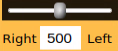
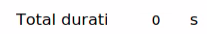
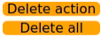
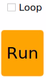
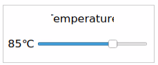
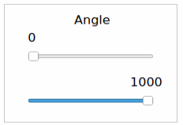
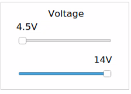
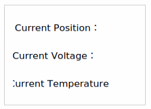
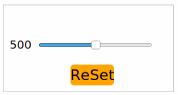

# 2. ROS1-Robot Arm Basic Control User Manual 

A mechanical arm is an automated device widely used in mechanical technology, finding practical applications in industrial manufacturing, medical treatment, entertainment services, the military, semiconductor manufacturing, and space exploration. Despite having various forms, they all share a common ability to receive instructions and accurately position themselves in three-dimensional (or two-dimensional) space for specific tasks. The functionality of robotic arms is further improved when equipped with vision systems. This document will illustrate the basic structure and motion control of the JetArm ultimate version as an example. The control methods for other versions of robotic arms are also identical.

## 2.1 Servo Control Node

The robot arm is equipped with 6 servos, utilizes Jetson Orin NX as the controller, employs an STM32 microcontroller for communication, and implements servo control through the serial port. To facilitate and standardize servo control, it is essential to establish a ROS node as the interface for each servo.


### 2.1.1 Introduction to Servo Control Node

* **Preparation**

(1) Assemble the robot arm according to the tutorial stored in ‘[1. Getting Ready(JetArm User Manual) -> 1.2 Hardware Installation and Guidelines]() ’.

(2) Start the robot arm according to the tutorial saved in ‘[1. Getting Ready(JetArm User Manual) ->1.3 Initial Startup Instructions]().

(3) Access the robot arm system desktop according to the tutorials locating in ‘[1. Getting Ready/JetArm User Manual->1.6 Development Environment Setup and Configuration]()’.

* **Initiate Servo Control Node**

(1) Click on  to open the terminal, then execute the following command to disable the auto-start service.

```
~/.stop_ros.sh
```

(2) Run the command to initiate the robot arm SDK file.

```
roslaunch jetarm_sdk sdk_node_6dof.launch
```

(3) Open a new terminal  and run the command to display the topics published after the initiation of the robot arm node.

```
rostopic list
```


|              **Topic**               |       **Function**       |
| :----------------------------------: | :----------------------: |
| /jetarm_sdk/serial_servo/load_unload |   Power on/off servos    |
|    /jetarm_sdk/serial_servo/move     | Control servo movements  |
|    /jetarm_sdk/serial_servo/stop     | Terminate servo movement |

* **Program outcome**
  


### 2.1.2 Servo Control Through Topic

* **Terminal Control**

(1) Open a new terminal, and execute the command and hit **‘Tab’** key to auto-complement the command.

```
rostopic pub /jetarm_sdk/serial_servo/move 
```


The program will print the following three parameters:

`servo_id`: Adjustable from 1 to 5.

`Position`: Servo angle, ranging from 0 to 1000.

`Duration`: Time required for the servo to move to the specified position, measured in milliseconds.

For example, in this program, the N0.1 servo is instructed to rotate to an angle of 500 in 1000 milliseconds.


* **Python Control**

(1) Run the command to initiate the robot arm SDK file.

```
roslaunch jetarm_sdk sdk_node_6dof.launch
```

(2) Open a new command-line terminal  and run the following command to navigate to the corresponding directory.

```
cd jetarm/src/jetarm_example/src/bus_servo/
```

(3) Next, enter the command to start the function, and you will see the servo motor 4 of the robotic arm rotating back and forth between angles of 200 and 500, with the servo topic information printed in the terminal.

```
python3 bus_servo.py
```


* **Launch File Control**

(1) Double-click  to start the command-line terminal and run the following command to disable the auto-start service.

```
~/.stop_ros.sh
```

(2) Execute the command to initiate the servo control. The **buservo.py** file will be invoked.

```
roslaunch jetarm_example bus_servo.launch
```

(3) After initiating the game, the No. 4 servo will rotate back and forth within the range of 200-500, and the servo topic information will be printed on the terminal.


(4) If you want to terminate the game, use short-cut ‘**Ctrl+C**’. If the game cannot be stopped, please have a retry.

### 2.1.3 Initiate App Auto-Start Service

(1) After experiencing the game above, it is necessary to initiate the app service; otherwise, the robot’s app function will be affected. Execute the command in the terminal  and hit Enter to start the app service.

```
sudo systemctl start start_app_node.service
```

(2) The robot arm will return to the initial pose once the app service is initiated, and the buzzer will emit a ‘**beep**’ sound.

### 2.1.4 Program Analysis

* **Launch File Analysis**

The launch file locates in this folder, [/home/ubuntu/jetarm/src/jetarm_example/src/bus_servo/bus_servo.launch]()

‘**node_name**’ defines the node name, here is ‘**bus_servo**’.

{lineno-start=3}

```
    <arg name="node_name"       default="bus_servo"/>
```

Initiate the ‘**sdk_node_6dof.launch**’ file and invoke the robot arm hardware control node.

{lineno-start=5}

```
    <include file="$(find jetarm_sdk)/launch/sdk_node_6dof.launch"/>
```

Execute the source code file.

{lineno-start=6}

```
    <node pkg="jetarm_example" type="bus_servo.py" name="$(arg node_name)" output="screen">
    </node>
```

* **Python Program Analysis**

The source code of the program is saved in [/home/ubuntu/jetarm/src/jetarm_example/src/bus_servo/bus_servo.py]().

The program logic flowchart is as below:


The diagram above illustrates the main structure of the program's logic flow, highlighting the division into basic function definitions and implementation logic. Initially, the necessary functions for servo control are established. In the main function, nodes are initialized, interrupt functions are activated to detect signals, and relevant bus servo topics are both published and received. This information is then relayed to the servo control function, enabling effective servo control. The upcoming document will follow the structure outlined in the program's logic flowchart above.

(1) Import Feature Package

By utilizing the import statement to bring in necessary modules, the rospy library serves as the Python client library for ROS. This library is essential for tasks such as crafting ROS nodes, managing message publication and subscription, and executing service calls. The 'signal' library, a standard Python module, is employed for signal handling. Furthermore, the ubuntu_interfaces.msg package encapsulates various message types, including the **SerialServoMove** message type specifically designed for serial communication with the robotic arm.

{lineno-start=5}

```
import rospy
import signal
from hiwonder_interfaces.msg import SerialServoMove
```

(2) Main Function

{lineno-start=40}

```
if __name__ == '__main__':
    rospy.init_node('bus_servo_demo', anonymous=True) #初始化节点(initialization node)
    signal.signal(signal.SIGINT, shutdown)
    rospy.wait_for_service('/jetarm_sdk/get_loggers')
    #发布总线舵机话题(publish bus servo topic)
    bus_servo_pub = rospy.Publisher('/jetarm_sdk/serial_servo/move', SerialServoMove, queue_size=1)
    #接收总线舵机话题(receive bus servo topic)
    bus_servo_sub = rospy.Subscriber('/jetarm_sdk/serial_servo/move', SerialServoMove, bus_servo_data_callback)
    while running:
        bus_servo_controls(id =4,position =500,duration=500) #发布数据(publish data)
        rospy.sleep(0.25) # 运行时间(running time)
        bus_servo_controls(id =4,position =200,duration=500) #发布数据(publish data)
        rospy.sleep(0.25)# 运行时间(running time)
```

Initialize the node.

{lineno-start=40}

```
if __name__ == '__main__':
    rospy.init_node('bus_servo_demo', anonymous=True) #初始化节点(initialization node)
```

Establish the signal handling function, triggering the '**shutdown**' function upon the reception of an interrupt signal (Ctrl+C).

{lineno-start=41}

```
    signal.signal(signal.SIGINT, shutdown)
```

Publish and receive the serial bus servo topic, triggering the '**bus_servo_data_callback**' function upon receipt of the serial bus servo topic.

{lineno-start=43}

```
    #发布总线舵机话题(publish bus servo topic)
    bus_servo_pub = rospy.Publisher('/jetarm_sdk/serial_servo/move', SerialServoMove, queue_size=1)
    #接收总线舵机话题(receive bus servo topic)
    bus_servo_sub = rospy.Subscriber('/jetarm_sdk/serial_servo/move', SerialServoMove, bus_servo_data_callback)
```

When the '**running**' variable is set to True, the loop will run continuously. Inside the loop, the angle of servo 4 is first set to 500, maintaining this position for 500 milliseconds with an execution time of 0.25 seconds for this action. Afterward, the angle of servo 4 is set to 200, once again running for 500 milliseconds. These two actions are alternately executed in a continuous manner. Modifying the servo ID, servo angle, and runtime within the loop allows for achieving different effects.

{lineno-start=47}

```
    while running:
        bus_servo_controls(id =4,position =500,duration=500) #发布数据(publish data)
        rospy.sleep(0.25) # 运行时间(running time)
        bus_servo_controls(id =4,position =200,duration=500) #发布数据(publish data)
        rospy.sleep(0.25)# 运行时间(running time)
```

(3) self.shutdown Function

Interrupt function within the program, intended to stop its execution. When the program receives an interrupt signal, it changes the '**running**' status to '**False**' and prints '**shutdown**' upon completion.

{lineno-start=14}

```
def shutdown(signum, frame):
    global running
    running = False
    rospy.loginfo('shutdown')
    rospy.signal_shutdown('shutdown')
```

(4) Serial Bus Servo Data Callback Function

Establish a callback function to manage received messages. The function, with a parameter '**msg**' representing the received message, declares '**bus_servo_data_detection**' as a global variable. Within the function, upon receiving a message, it verifies if the '**servo_id**' in the message is non-empty. If it is not empty, '**bus_servo_data_detection**' is then set to True. This mechanism is employed to ascertain the presence of valid data in the received message.

{lineno-start=20}

```
# 总线舵机数据回调函数(bus servo data callback function)
def bus_servo_data_callback(msg):
    global bus_servo_data_detection
    print(msg)
    if msg.servo_id != []: #判断该话题的ID是否为空(determine if the topic ID is empty)
        bus_servo_data_detection = True
```

(5) Servo Motion Control Function

**def bus_servo_controls(id=0, position=0, duration=0.0)** is used to control serial bus servo’s movement. It contains the following parameters:

**ID**: Servo ID; Adjustable from 1 to 5.

**Position**: Servo angle, ranging from 0 to 1000.

**Duration**: Time required for the servo to move to the specified position, measured in milliseconds.

{lineno-start=27}

```
def bus_servo_controls(id=0,
                       position=0,
                       duration=0.0):
                       
    #bus_servo_data =[]
    # 设置总线舵机消息类型
    data = SerialServoMove()
    data.servo_id = id #总线舵机ID      
    data.position = position #总线舵机角度[0-1000]
    data.duration = duration #总线舵机运行时间
    bus_servo_pub.publish(data) #发布数据
```

## 2.2 LED Control Node

STM32 controller includes a LED. The STM32 control board is fitted with an LED. Using the Jetson Orin NX as the main controller, we establish communication with the STM32 microcontroller to control the LED through serial communication. For convenient and standardized LED control, it is essential to set up a ROS node as the interface.

### 2.2.1 Introduction to LED Control Node

* **Preparation**

(1) Assemble the robot arm according to the tutorial stored in [1. Getting Ready(JetArm User Manual)->1.2 Hardware Installation and Guidelines]().

(2) Start the robot arm according to the tutorial saved in [1. Getting Ready(JetArm User Manual)->1.3 Initial Startup Instructions]().

(3) Access the robot arm system desktop according to the tutorials locating in [1. Getting Ready(JetArm User Manual)->1.6 Development Environment Setup and Configuration]().

* **Initiate LED Control Node**

(1) Click on  to open the terminal, then execute the command to disable the auto-start service.

```
~/.stop_ros.sh
```

(2) Execute the command to initiate the robot arm SDK file.

```
roslaunch jetarm_sdk sdk_node_6dof.launch
```

(3) Open a new terminal  and run the command to display the topics published after the initiation of the robot arm node.

```
rostopic list
```


|      **Topic**      |         **Function**          |
| :-----------------: | :---------------------------: |
| /jetarm_sdk/set_led | Control LED to turn on or off |

### 2.2.2 Control LED Through Topic

* **Terminal Control**

(1) Open a new terminal , and execute the command . Then hit ‘**Tab**’ key three times to complement the command.

```
rostopic pub /jetarm_sdk/set_led
```


The following four parameters can be obtained:

**brightness**: LED ID. The ID of the LED on the STM32 controller is 1.

**on_ticks**: The duration of LED illumination, measured in milliseconds.

**0ff_ticks**: the duration of LED off time, measured in milliseconds.

**repeat**: the cycle number of LED on and off

(2) After the parameters are set, hit Enter key to run the program.


(3) When the program completes running, press '**Ctrl+C**' to exit. If the program cannot be stopped, you may need to retry.

* **Python Control**

(1) Execute the command in the terminal  to navigate to the corresponding directory.

```
cd jetarm/src/jetarm_example/src/LED
```

(2) Run the command to initiate the game. The LED on STM32 controller will flicker ten times then go off. The following parameter settings will be printed on the terminal.

```
python3 led.py
```

* **Launch File Control**

(1) Press ‘**Ctrl+C**’ on the terminal where the robot arm SDK file is initiated to close the launch file.

(2) Execute the command in  to start servo control. The LED.py file is invoked in the launch file.

```
roslaunch jetarm_example LED.launch
```

(3) After the game starts, the LED on the STM32 controller will flicker 10 times then go off. The terminal will print the following parameter settings.


(4) When the program completes running, press '**Ctrl+C**' to exit. If the program cannot be stopped, you may need to retry.

### 2.2.3 Initiate App Auto-Start Service

(1) After experiencing the game above, it is necessary to initiate the app service; otherwise, the robot’s app function will be affected. Execute the command in  and hit Enter to start the app service.

```
sudo systemctl start start_app_node.service
```

(2) The robot arm will return to the initial pose once the app service is initiated, and the buzzer will emit a ‘**beep**’ sound.

### 2.2.4 Program Analysis

* **Launch File Analysis**

Launch file is saved in [/home/ubuntu/jetarm/src/jetarm_example/src/LED/LED.launch]()

`node_name` defines the name of the node, here is LED.

{lineno-start=3}

```
    <arg name="node_name"       default="LED"/>
```

Initiate `sdk_node_6dof.launch` file and invoke the robot arm hardware control node.

{lineno-start=5}

```
    <include file="$(find jetarm_sdk)/launch/sdk_node_6dof.launch"/>
```

Initiate source code file.

{lineno-start=6}

```
    <node pkg="jetarm_example" type="LED.py" name="$(arg node_name)" output="screen">
    </node>
```

* **Python Program Analysis**

The source code is stored in [jetarm/src/jetarm_example/src/LED/LED.py]()

The program logic flowchart is as below:


The program's logic flow, as illustrated above, is mainly categorized into basic function definitions and implementation logic. Initially, the functions required for LED control are defined. Subsequently, within the main function, nodes are initialized, interrupt functions are activated to detect interrupt signals, and relevant topics for the LED are both published and received. The control of the LED is accomplished by configuring parameters related to LED information. The forthcoming document will adhere to the program's logic flowchart outlined above.

(1) Import Feature Package

Import the necessary modules using the import statement. The rospy library is the Python client library for ROS, used to write ROS nodes, publish and subscribe to messages, and execute service calls.

The 'signal' import is a standard Python library for handling signals.

**ubuntu_interfaces.msg** is a package containing message types, including the SerialServoMove message type used for the robotic arm's serial communication.

{lineno-start=5}

```
import rospy
import signal
from hiwonder_interfaces.msg import Led
```

(2) Main Function

{lineno-start=28}

```
if __name__ == '__main__':
    rospy.init_node('led_demo', anonymous=True) #初始化节点(initialization node)
    signal.signal(signal.SIGINT, shutdown)
    rospy.wait_for_service('/jetarm_sdk/get_loggers')
    # 发布LED话题(publish LED topic)
    led_pub = rospy.Publisher('/jetarm_sdk/set_led', Led, queue_size=1)
    # 接收LED话题(receive LED topic)
    led_sub = rospy.Subscriber('/jetarm_sdk/set_led', Led, led_data_callback)
    # 设置LED消息类型(set LED information type)
    led_data = Led()
    led_data.brightness = 1  #LED ID
    led_data.on_ticks = 200  #亮的时间(bright time)
    led_data.off_ticks= 200 #亮的间隔(bright interval)
    led_data.repeat = 10#重复的次数(repetition times)
    while running:
        led_pub.publish(led_data) #发布LED数据(publish LED data)
        rospy.sleep(1) # 延时，防止一直发布数据(delay, to prevent continuously publish data)
        if led_data_detection:
            break
```

① Initialize the node.

{lineno-start=28}

```
if __name__ == '__main__':
    rospy.init_node('led_demo', anonymous=True) #初始化节点(initialization node)
```

② Establish the signal handling function, triggering the `shutdown` function upon the reception of an interrupt signal (Ctrl+C).

{lineno-start=30}

```
    signal.signal(signal.SIGINT, shutdown)
```

③ Publish and receive LED topic.

{lineno-start=32}

```
    # 发布LED话题(publish LED topic)
    led_pub = rospy.Publisher('/jetarm_sdk/set_led', Led, queue_size=1)
    # 接收LED话题(receive LED topic)
    led_sub = rospy.Subscriber('/jetarm_sdk/set_led', Led, led_data_callback)
```

④ Configure the following parameters to enable the LED to flicker.

{lineno-start=28}

```
if __name__ == '__main__':
    rospy.init_node('led_demo', anonymous=True) #初始化节点(initialization node)
    signal.signal(signal.SIGINT, shutdown)
    rospy.wait_for_service('/jetarm_sdk/get_loggers')
    # 发布LED话题(publish LED topic)
    led_pub = rospy.Publisher('/jetarm_sdk/set_led', Led, queue_size=1)
    # 接收LED话题(receive LED topic)
    led_sub = rospy.Subscriber('/jetarm_sdk/set_led', Led, led_data_callback)
    # 设置LED消息类型(set LED information type)
    led_data = Led()
    led_data.brightness = 1  #LED ID
    led_data.on_ticks = 200  #亮的时间(bright time)
    led_data.off_ticks= 200 #亮的间隔(bright interval)
    led_data.repeat = 10#重复的次数(repetition times)
    while running:
        led_pub.publish(led_data) #发布LED数据(publish LED data)
        rospy.sleep(1) # 延时，防止一直发布数据(delay, to prevent continuously publish data)
        if led_data_detection:
            break
```

The variable `led_data` represents the message type `Led()`for the LED light.

The parameter `brightness` corresponds to the LED's ID, with the onboard LED on the 32 main control board assigned the ID 1.

The `on_ticks` parameter indicates the duration of LED illumination in milliseconds, set to 200ms in this case.

The `off_ticks` parameter represents the duration of LED extinction in milliseconds, set to 200ms here.

The `repeat` parameter signifies the number of repetitions for the LED on/off sequence, set to 10 repetitions in this instance.

⑤ When the running variable is set to True, the loop will be continuously executed.

{lineno-start=}

```
    while running:
        led_pub.publish(led_data) #发布LED数据(publish LED data)
        rospy.sleep(1) # 延时，防止一直发布数据(delay, to prevent continuously publish data)
        if led_data_detection:
            break
```

In the loop, publish the LED's data information `led_data` (with the parameters set earlier). Subsequently, introduce a 1-second delay to prevent data retransmission. Then, check if `led_data_detection` is True (when the 'on_ticks' in the message, representing the LED's illumination time, is 0, 'led_data_detection' is set to True), and exit the loop.

(3) self.shutdown Function

Interrupt function within the program, designed to stop the execution. When the program receives an interrupt signal, it sets `running` to `False` ,and prints `shutdown` upon completion.

{lineno-start=13}

```
def shutdown(signum, frame):
    global running
    running = False
    rospy.loginfo('shutdown')
    rospy.signal_shutdown('shutdown')
```

(4) LED Data Callback Function

Define a callback function to handle received messages. It takes one parameter, `msg` r,epresenting the received message. Declare `led_data_detection` as a global variable. In the function, when a message is received, it checks if `on_ticks` (the LED light-up time) in the message is not empty. If it is not empty, `led_data_detection` is then set to True. This is used to check whether the received message contains valid data.

{lineno-start=19}

```
# LED数据回调函数(LED data callback function)
def led_data_callback(msg):
    global led_data_detection
    if msg.on_ticks != 0: #判断该话题的启动时间是否为0(check if the start time of the topic is zero)
        print(msg)
        led_data_detection = True
```

## 2.3 Buzzer Control Node

STM32 controller includes a buzzer. The STM32 control board is fitted with an LED. Using the Jetson Orin NX as the main controller, we establish communication with the STM32 microcontroller to control the buzzer through serial communication. For convenient and standardized buzzer control, it is essential to set up a ROS node as the interface.

### 2.3.1 Introduction to Buzzer Node 

* **Preparation**

(1) Assemble the robot arm according to the tutorial stored in [1. Getting Ready(JetArm User Manual) -> 1.2 Hardware Installation and Guidelines]().

(2) Start the robot arm according to the tutorial saved in [1. Getting Ready(JetArm User Manual) ->1.3 Initial Startup Instructions]().

(3) Access the robot arm system desktop according to the tutorials locating in [1. Getting Ready(JetArm User Manual)->1.6 Development Environment Setup and Configuration]().

* **Initiate Buzzer Control Node**

(1) Click on  to open the terminal, then execute the command to disable the app auto-start service.

```
~/.stop_ros.sh
```

(2) Run the command to initiate the robot arm SDK file.

```
roslaunch jetarm_sdk sdk_node_6dof.launch
```

(3) Open a new terminal  and run the command to display the topics published after the initiation of the robot arm node.


|       **Topic**        |           **Function**           |
| :--------------------: | :------------------------------: |
| /jetarm_sdk/set_buzzer | Control buzzer to turn on or off |

### 2.3.2 Buzzer Control Through Topic

* **Terminal Control**

(1) Open a new terminal  and execute the command, then press Enter key three times to complement the command.

```
rostopic pub /jetarm_sdk/set_buzzer
```


Here are four adjustable parameters:

`freq`: Represents the frequency of the buzzer, ranging from 2 to 4 KHz. A higher frequency results in a higher pitch.

`on_ticks`: Indicates the duration of the buzzer's sound in milliseconds, set to 100ms in this case.

`off_ticks`: Represents the duration of the buzzer being silent in milliseconds.

`repeat`: Specifies the number of repetitions for the buzzer to sound and stop.

(2) After the parameters are all set, hit Enter to run the program.


(3) When the program completes running, press 'Ctrl+C' to exit. If the program cannot be stopped, you may need to retry.

* **Python Control**


(1) Execute the command in the terminal  to navigate to the directory.

```
cd jetarm/src/jetarm_example/src/buzzer
```

(2) Run the command to initiate the game. The buzzer will emit ten ‘beep’ sounds, then become silent. The parameter settings will printed on the terminal.

```
python3 buzzer.py
```


* **Launch File Control**


(1) Press ‘**Ctrl+C**’ on the terminal where the robot arm SDK file is initiated to close the launch file.

(2) Execute the command in  to start servo control. The **buzzer.py** file is invoked in the launch file.

```
roslaunch jetarm_example buzzer.launch
```

(3) After the game starts, the buzzer on the STM32 controller will emit ten ‘beep’ sounds, then become silent. The buzzer parameters will be printed on the terminal.


(4) When the program completes running, press '**Ctrl+C**' to exit. If the program cannot be stopped, you may need to retry.

### 2.3.3 Initiate App Auto-Start Service

(1) After experiencing the game above, it is necessary to initiate the app service; otherwise, the robot’s app function will be affected. Run the following command in 

```
sudo systemctl start start_app_node.service
```

(2) The robot arm will return to the initial pose once the app service is initiated, and the buzzer will emit a ‘**beep**’ sound.

### 2.3.4 Program Analysis

* **Launch File Analysis**

The launch file is saved in [/home/ubuntu/jetarm/src/jetarm_example/src/buzzer/buzzer.launch]()

`node_name` defines the name of the node, here is ‘buzzer’

{lineno-start=3}

```
    <arg name="node_name"       default="buzzer"/>
```

Initiate ‘**sdk_node_6dof.launch**’ file, and invoke robot arm hardware control node.

{lineno-start=5}

```
    <include file="$(find jetarm_sdk)/launch/sdk_node_6dof.launch"/>
```

Start the source code file.

{lineno-start=6}

```
    <node pkg="jetarm_example" type="buzzer.py" name="$(arg node_name)" output="screen">
    </node>
```

* **Program Analysis**

The source code is saved in [jetarm/src/jetarm_example/src/buzzer/buzzer.py]().

The program logic flowchart is depicted as below:


From the diagram above, the program's logic flow is primarily divided into basic function definitions and implementation logic. First, the functions needed to control the buzzer are defined. Then, in the main function, nodes are initialized, interrupt functions are activated to detect interrupt signals, relevant topics for the buzzer are published and received. Buzzer control is then achieved by configuring parameters related to the buzzer information. The content of the following document will be written following the aforementioned program logic flowchart.

(1) Import Feature Package

Import the necessary modules using the import statement. The rospy library is the Python client library for ROS, used to write ROS nodes, publish and subscribe to messages, and execute service calls.

The 'signal' import is a standard Python library for handling signals.

**ubuntu_interfaces.msg** is a package containing message types, including the SerialServoMove message type used for the robotic arm's serial communication.

{lineno-start=5}

```
import rospy
import signal
from hiwonder_interfaces.msg import Buzzer
```

(2) Main Function

{lineno-start=28}

```
	if __name__ == '__main__':
    rospy.init_node('buzzer_demo', anonymous=True) #初始化节点(initialization node)
    signal.signal(signal.SIGINT, shutdown)
    rospy.wait_for_service('/jetarm_sdk/get_loggers')
    #发布蜂鸣器话题(publish buzzer topic)
    buzzer_pub = rospy.Publisher('/jetarm_sdk/set_buzzer', Buzzer, queue_size=1)
    #接收蜂鸣器话题(receive buzzer topic)
    buzzer_sub = rospy.Subscriber('/jetarm_sdk/set_buzzer', Buzzer, buzzer_data_callback)
    #设置蜂鸣器消息类型(set buzzer information type)
    buzzer_data = Buzzer()
    buzzer_data.freq = 3000 #蜂鸣器频率(buzzer frequency)
    buzzer_data.on_ticks = 100 #响的时间(the ringing time)
    buzzer_data.off_ticks = 100 #响的间隔(the interval between ring)
    buzzer_data.repeat = 10 #重复的次数(the repetition times)
    while running:
        buzzer_pub.publish(buzzer_data) #发布蜂鸣器数据(publish buzzer data)
        rospy.sleep(1) #延时，防止一直发布数据(delay, to prevent continuous data publishing)
        if buzzer_data_detection:
            break
```

① Initialize the node.

{lineno-start=28}

```
	if __name__ == '__main__':
    rospy.init_node('buzzer_demo', anonymous=True) #初始化节点(initialization node)
```

② Establish the signal handling function, triggering the `shutdown` function upon the reception of an interrupt signal (Ctrl+C).

{lineno-start=30}

```
	    signal.signal(signal.SIGINT, shutdown)
```

③ Publish and receive the buzzer topic.

{lineno-start=32}

```
	    #发布蜂鸣器话题(publish buzzer topic)
    buzzer_pub = rospy.Publisher('/jetarm_sdk/set_buzzer', Buzzer, queue_size=1)
    #接收蜂鸣器话题(receive buzzer topic)
    buzzer_sub = rospy.Subscriber('/jetarm_sdk/set_buzzer', Buzzer, buzzer_data_callback)
```

④ Set the following parameters to enable the buzzer to make sound.

{lineno-start=37}

```
	    buzzer_data = Buzzer()
    buzzer_data.freq = 3000 #蜂鸣器频率(buzzer frequency)
    buzzer_data.on_ticks = 100 #响的时间(the ringing time)
    buzzer_data.off_ticks = 100 #响的间隔(the interval between ring)
    buzzer_data.repeat = 10 #重复的次数(the repetition times)
```

The variable `buzzer_data`represents the Buzzer message type.

The parameter `freq` denotes the frequency of the buzzer, ranging from 2 to 4 KHz, with a higher frequency producing a higher pitch. Here, it is set to 3 KHz.

The  `on_ticks` parameter indicates the duration of the buzzer's sound in milliseconds, set to 100ms in this case.

The  `off_ticks` parameter represents the duration of the buzzer being silent in milliseconds, set to 100ms to stop sounding.

The `repeat` parameter specifies the number of repetitions for the buzzer to sound and stop, set to 10 times.

⑤ When the running variable is set to True, the loop will be continuously executed.

{lineno-start=42}

```
	    while running:
        buzzer_pub.publish(buzzer_data) #发布蜂鸣器数据(publish buzzer data)
        rospy.sleep(1) #延时，防止一直发布数据(delay, to prevent continuous data publishing)
        if buzzer_data_detection:
            break
```

In the loop, publish the data information for the buzzer, `buzzer_data` (using the parameter values set earlier). Next, introduce a 1-second delay to prevent data retransmission. Then, check if 'buzzer_data_detection' is True (when 'msg.freq' in the message, representing the buzzer's sounding frequency, is empty, 'buzzer_data_detection' is set to True), and exit the loop.

- **self.shutdown Function**

Program interrupt function, designed to halt the program. When the program receives an interrupt signal, it sets `running` to `False`, and prints '`shutdown` upon completion.

{lineno-start=13}

```
	def shutdown(signum, frame):
    global running
    running = False
    rospy.loginfo('shutdown')
    rospy.signal_shutdown('shutdown')
```

- **Buzzer Data Callback Function**

Define a callback function to handle received messages. It takes one parameter, 'msg,' representing the received message. Declare 'buzzer_data_detection' as a global variable. In the function, when a message is received, it checks if 'msg.freq' (the buzzer's sounding frequency) in the message is not empty. If it is not empty, 'buzzer_data_detection' is then set to True. This is used to check whether the received message contains valid data.

{lineno-start=19}

```
	# 蜂鸣器数据回调函数(buzzer data callback function)
def buzzer_data_callback(msg):
    global buzzer_data_detection
	    if msg.freq != 0: #判断该话题的频率（freq）是否为0(determine if the freq topic of 0)
        print(msg)
        buzzer_data_detection = True
```

## 2.4 PC Software Control

### 2.4.1 Introduction to PC Software Function

The upper computer corresponds to the lower computer, used to send instructions to the lower computer and receive feedback data from it. Generally, the upper computer is a computer, and it controls the lower computer through software running on the computer (i.e., upper computer software).

This section will introduce the interface and functions of the JetArm upper computer PC software.

* **Open PC Software through Icon**

Double-click  on the robot system desktop to open the PC software.

* **Open PC Software through Command**

(1) Open a new terminal, and execute the command to navigate to the directory.

```
cd arm_pc
```

(2) Run the command to open the PC software.

```
python3 main.py
```

* **Introduction to PC Software Interface**

The interface of the PC software is divided into 4 areas:

①: Servo control zone

②: Action list

③: Action group setting zone

④: Deviation setting zone


The introduction to each section's function within the PC software is outlined as follows:

①: Servo Control Zone

In this zone, you can change the servo’s position through dragging the sliders.

|                           **Icon**                           |                         **Function**                         |
| :----------------------------------------------------------: | :----------------------------------------------------------: |
|  |                           Servo ID                           |
|  | Adjust servo’s position. The minimum value is 0, and the maximum value is 1000. |
|  | Adjust the servo deviation. The minimum value is -125, and the maximum value is 125. |

②：Action List

The action list include the information, such as action group NO., duration and location of each servo.


|                           **Icon**                           |                         **Function**                         |
| :----------------------------------------------------------: | :----------------------------------------------------------: |
|  |                       Action group NO.                       |
|  | The duration of the execution of the action group, measured in millisecond |
|  | Corresponding servo position value. You can directly double click the value  to modify |

③：Action Group Setting Zone

In action group setting zone, you can add, delete, update, insert, run, open and integrate the action group.

<table  class="docutils-nobg" style="margin:0 auto" border="1">
<colgroup>
<col  />
<col  />
</colgroup>
<tbody>
<tr>
<td ><strong>Icon</strong></td>
<td ><strong>Function</strong></td>
</tr>
<tr>
<td ></td>
<td >The time required for executing each action group. You can directly click  for modifications</td>
</tr>
<tr>
<td ></td>
<td >The time required for executing all action groups</td>
</tr>
<tr>
<td ></td>
<td >Upon clicking this icon, the robot servo will deactivate, causing the joints to loosen. Subsequently, you can manually design the robot's actions by dragging the servo</td>
</tr>
<tr>
<td ></td>
<td >Retrieve the manually set servo position. This function should be utilized in conjunction with the 'Manual' icon</td>
</tr>
<tr>
<td ></td>
<td >Append the current servo value, configured in the servo control area, to the bottom of the action list to create a new action</td>
</tr>
<tr>
<td ></td>
<td ><p>Delete action: Delete the selected action in the action list</p>
<p>Delete all: Delete all actions in the action list</p></td>
</tr>
<tr>
<td ></td>
<td >Replace the selected servo parameter in the action list with the current value set in the servo control zone. Additionally, substitute the Time with the corresponding value set in the </td>
</tr>
<tr>
<td ></td>
<td >Insert one action above the selected action in the action list. The value of inserted action is the same as that set in servo control area. And the <strong>Time</strong> is the same as </td>
</tr>
<tr>
<td ></td>
<td >Move the selected action to the previous line</td>
</tr>
<tr>
<td ></td>
<td >Move the selected action to the next line</td>
</tr>
<tr>
<td ></td>
<td >Execute the actions in the action list once. If "Loop" is selected, the actions will run in a continuous loop</td>
</tr>
<tr>
<td ></td>
<td >Open the necessary action group file and load its data into the action list. Save action group files in the following directory: /home/hiwonder/arm_pc/ActionGroups</td>
</tr>
<tr>
<td ></td>
<td >Save the actions in the action list to the designated path: /home/hiwonder/arm_pc/ActionGrourps）</td>
</tr>
<tr>
<td ></td>
<td >First, click  to open an action group, and then use  to open another action group. Subsequently, integrate the two action groups</td>
</tr>
<tr>
<td ></td>
<td >Display the action groups saved in PC software</td>
</tr>
<tr>
<td ></td>
<td >Refresh the selected action group</td>
</tr>
<tr>
<td ></td>
<td >Delete the selected action group file</td>
</tr>
<tr>
<td ></td>
<td >(<strong>⚠</strong>) Delete all the action group files</td>
</tr>
<tr>
<td ></td>
<td >Execute the selected action group once</td>
</tr>
<tr>
<td ></td>
<td >Stop running action group</td>
</tr>
<tr>
<td ></td>
<td >Exit the PC software</td>
</tr>
</tbody>
</table>
④：Deviation Setting Zone (Optional: This area is for informational purposes. As the robot's deviation has been corrected before delivery, manual deviation adjustment is unnecessary if the robot is functioning properly. For more information on deviation adjustment, please refer to '[2.4.4 Deviation Adjustment]()').

|                           **Icon**                           |                 **Function**                 |
| :----------------------------------------------------------: | :------------------------------------------: |
|  |        Read the saved deviation vale         |
|  | Download the adjusted deviation to the robot |
|  |      Reset all servos’ position to 500       |

### 2.4.2 Editing & Calling Action 

* **Action Editing**

Click-on  on the robot system desktop to open the PC software.

**Step 1:** Click-on the **'Reset Servo'** button to reset the robot arm's pose. Next, adjust the sliders to set the servo values as shown in the picture below. Once done, click on 'Add Action' to include this action in the action list.


**Step 2**: Set the duration to 800ms, then click on the '**Update Action**' button to synchronize the time.


**Step 3:** configure the ID1 servo to enable the robot arm to rotate left. Then click-on ‘**Add Action**’ button to add this action to the action list. The duration remains the same, 800ms.


**Step 4:** Add a transitional action. Select NO.2 action and set the duration to 200ms, then click-on ‘**Add Action**’.


**Step 5:** Enable the robot arm to move to the right by adjusting the slider for the ID1 servo as shown below. Set the time to 800ms and then click on the '**Add Action**' icon.


**Step 6:** Add a transitional action. Select NO.4 action, set the duration to 200ms, then click-on ‘**Add Action**’ button.


**Step 7:** Control the gripper to close and open. Adjust the value of NO.10 servo, set the duration to 400ms, and click-on **‘Add Action’** button.


**Step 8:** Add a transitional action. Set the duration to 200ms, and click-on **‘Add Action’** icon.


**Step 9:** Adjust the servo values as the picture below shown to adjust the gripper.


* **Saving Action**

For ease of later debugging and management, you can save the action file. Click-on the '**Save Action File**' button and select this folder '**/home/ubuntu/arm_pc/ActionGrourps**,'. After naming the action file, click-on ‘**Save**’ button.


* **Action Group Calling**

(1) Open a new command-line terminal, and execute the following command to navigate to the directory containing source code.

```
cd arm_p
```

(2) Execute the command to open the source code file.

```
vim control_demo.py
```

(3) Enter the action group name within the single quotation marks. Note: The program can only access the action group files saved in the '**ActionGroups**' folder. **The name entered within the single quotation marks should not include the suffix.**


(4) Execute the command to run the program, and invoke the set action groups.

```
python3 control_demo.py
```

### 2.4.3 Integrate Action Groups

**Step 1:** Access the robot system desktop, and open JetArm PC software.


**Step 2:** click-on ‘Integrate File’ button to navigate to the folder ‘**/home/ubuntu/arm_pc/ActionGrourps**’, and double-click ‘**spin.d6a**’ to open it.


**Step 3:** the selected action will be added to the action list.


**Step 4**: click-on ‘**Integrate File**’ icon, and double-click ‘**myaction.d6a**’ to open. Then, these two action files are integrated into one.


**Step 5:** click-on NO.1 action, then click-on **‘Run’** button to enable the robot arm perform the integrated action.


**Step 6:** Click the '**Save Action File**' button to save the combined action group for easier debugging in the future.


### 2.4.4 Deviation Adjustment

During using the robot, if there is deviation in the rotation axis of the servo due to changing servos or other operations, it is necessary to perform deviation debugging. Deviation can be categorized into small and large deviations, and the debugging methods vary accordingly based on the specific situation.

* **Preparation**

(1) Start the robot arm according to the instructions provided in [1. Getting Ready(JetArm User Manual)->4. Initial Startup Instructions]() .

(2) Access the robot system desktop according to the tutorials provided in this folder [1. Getting Ready(JetArm User Manual)->1.6 Development Environment Setup and Configuration]().

* **Judging Deviation**

(1) Click-on  on the robot system desktop to open the PC software.

(2) Click-on **‘Reset Servo’** to reset the robot arm’s pose.


(3) After the robot arm resets servo, the main shaft screws of robotic arm servos 2 to 4 align in a straight line, as illustrated in the diagram below:


(4) The marking on the pan-tilt should align with the marking on the metal shell.


(5) If the metal casing above servo 5 and the camera casing display parallel lines, and the gripper is slightly open, as illustrated in the diagram on the right below, it means that the robotic arm does not need deviation adjustment. Feel free to proceed to the next section.


(6) If the angle between the servo and the centerline is less than 30° (taking NO.3 servo as an example), it falls into the category of minor deviation. In such cases, you can rectify the deviation using PC software by following the instructions in [Minor Deviation Adjustment]().


:::{Note}

The angle between the servo and the centerline is determined by the following calculations:

* When adjusting the servo using the PC software, the slider range is from 0 to 1000, and the servo's rotatable range when powered is from 0 to 240 degrees. This means that 240/1000 equals 0.24 degrees, indicating that each unit of the slider corresponds to a servo rotation of 0.24 degrees.

* Regarding the adjustment of the small slider, its range is ±125. When converted to the adjustment range for minor deviation, it amounts to 125 \* 0.24 = 30°.

:::

(7) If the angle between the servo and the centerline exceeds 30° and the deviation cannot be corrected by adjusting the servo value within the limit range (±125, using NO.3 servo as an example), it is considered a large deviation. For detailed instructions, please consult  [Large Deviation Adjustment]().


* **Minor Deviation Adjustment**

(1) Launch the PC software, then click on the '**Reset Servo**' icon to reset the robotic arm's pose. Subsequently, click the '**Read Deviation**' button to transfer the deviation value to the PC software.


(2) Using ID3 servo adjustment as an example, after reading the deviation, adjust the deviation by dragging the slider of the ID3 servo.

:::{Note}

Minor deviation adjustment can be directly done by dragging the servo's deviation slider on the PC software. (please note that it is the small slider that adjusts the deviation).

:::

(3) Adjust the ID3 servo slider to align the robot arm into a straight line. The value indicated in the picture below is for reference purposes only. You should adjust the servo value according to the actual situation.


(4) Click-on ‘**Download Deviation**’ icon, and save the adjusted deviation data to the robot arm.


* **Large Deviation Adjustment**

To make significant deviation adjustments, the servo must be detached from the U-shaped bracket, centered, reinstalled, and, once the installation is complete, the steps for minor deviation adjustment should be repeated.

(1) Click-on ‘**Reset Servo**’ icon to reset the robot arm’s pose.


(2) At this point, you may notice a significant deviation in servo 2, with the deviation angle exceeding 30°.


(3) Switch off the robot arm. Please refrain from powering it on while detaching the parts.

(4) Remove all screws from the main servo horn of servo 2 and the main shaft screws on the sub-horn (start by removing the four outer screws of the horn, then proceed to the shaft screws).


(5) Detach the U-shape bracket.


(6) After detaching the bracket, initiate the robot and open the PC software, then click on the 'Reset Servo' icon. At this point, the position of the NO.3 servo is adjusted. Please securely hold the detached component to prevent the robotic arm from unintentionally returning to its initial position upon startup.


(7) After centering the servo, turn off the robot arm, and install the main servo horn and assistant servo horn in a 'cross' formation.


:::{Note}

The servo is now centered, so please refrain from forcibly manipulating the servo shaft. If the servo horn 'cross' is not correctly installed, repeat steps 5-7 in section 4.4.4 of this document.

:::

(8) Secure the bracket using screws, ensuring the holes are aligned.


(9) Power on the robot arm, and repeat the instructions provided in [Minor Deviation Adjustment]() to fine tune the deviation.

## 2.5 Use of Servo Debugging Tool

When replacing a servo, it is essential to utilize the servo debugging tool for configuring parameters such as ID and midpoint. Refer to the earlier section, '1.1 Introduction to Servo Control Node,' for information on servo ID numbers.

Prior to initiating servo debugging, please be aware that the servo interface can only be connected to a single servo. Connecting multiple servos in series will result in identical parameters for all servos, preventing individual control of each servo.

### 2.5.1 Introduction to Servo Debugging Tool Interface

(1) Access the robot system desktop according to the tutorials provided in [1. Getting Ready(JetArm User Manual) ->1.6 Development Environment Setup and Configuration]().

(2) Execute the following commands to check the files.

```
cd factory_utils/Bus_Servo_Tool
```

```
ls
```


(3) Next, enter the command to open the PC software. After opening, confirm that the bus servo interface is separately connected to a servo.

```
python3 main.py
```


(4) The function of each icon is detailed in the table below:


|                           **Icon**                           |                         **Function**                         |
| :----------------------------------------------------------: | :----------------------------------------------------------: |
|  |                 Read current servo parameter                 |
|  |                       Apply the change                       |
|  |                   Restore default settings                   |
|  | Set servo ID. The servo ID can be set within this range: 0~253 |
|  |                  Adjust the servo deviation                  |
|  |   Adjust the servo’s working temperature. 85℃ by default.    |
|  | Adjust the servo rotation range according to their specific needs. JetArm’s servo rotation range is from 0 to 1000. |
|  | Adjust servo’s working voltage range. Users can limit servo’s working voltage to protect the servo. The servo working voltage range of the servo is from 9 to 12.6V. |
|  | Display the servo’s current position, voltage and temperature. |
|  | Adjust the servo's rotation position by dragging the slider and pressing the Apply button. To return to the position of 500, press the ReSet button and then Apply. |

### 2.5.2 Servo Debugging Instructions

(1) Connect one servo to the servo port.


(2) Open the servo debugging tool.


(3) Click-on ‘**Read**’ button.


(4) Using the adjustment of ID3 servo as an example, set the servo ID. Other parameters can be left at their default values, or users can customize them based on their needs.


(5) Click-on Apply button to apply the change.


(6) After setting the servo ID, detach and assemble the servos according to the corresponding tutorials.