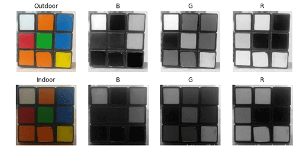

# 4. ROS1-ROS+OpenCV Course

## 4.1 Positioning & Gripping

### 4.1.1 Camera Calling

The camera functions as the eyes of the robot arm. The first step in implementing the gripping function is to capture the object through the camera. Subsequently, it will calculate the object's location for gripping and proper placement.

* **Initiate Camera Control Node**

:::{Note}

The input command should be case sensitive, and complement the keywords using Tab key.

:::

(1) Start the robot arm, and access the robot system desktop using NoMachine. To get detailed instructions on remote control software connection, please refer to the tutorials saved in [1.Getting Ready(JetArm User Manual)-> 1.6 Development Environment Setup and Configuration]().

(2) Click-on  to open the command-line terminal, then execute the following command:

```
~/.stop_ros.sh
```

(3) Execute the command below to launch the camera file.

```
roslaunch jetarm_example camera_topic_invoke.launch
```

(4) If you need to terminate the running program, press ‘Ctrl+C’. If the program fails to stop, please retry.

(5) To avoid the interference on the following app functions, please execute the command to initiate the app service. Once you hear a beep sound from the robot, the service has been restarted successfully.

```
sudo systemctl start start_app_node.service
```

* **Program Outcome**

The live camera feed will pop up.


* **launch File Analysis**

The launch file is saved in this path:

[/home/ubuntu/jetarm/src/jetarm_example/src/1.camera_topic_invoke/camera_topic_invoke.launch]()

{lineno-start=15}

```
    <!--摄像头节点-->
    <include file="$(find jetarm_peripherals)/launch/camera.launch"/>

<!--启动源码-->
    <node pkg="jetarm_example" type="camera_topic_invoke.py" name="$(arg node_name)" output="screen" respawn="true">
```


`node_name` defines the name of the node. In this program, the node is defined as `camera_topic_invoke`.

{lineno-start=4}

```
    <arg name="node_name"       default="camera_topic_invoke"/>
```

Invoke the camera node to launch the `camera.launch` file.

{lineno-start=16}

```
    <include file="$(find jetarm_peripherals)/launch/camera.launch"/>
```

Initiate the `camera_topic_invoke.py` source code file.

{lineno-start=19}

```
    <node pkg="jetarm_example" type="camera_topic_invoke.py" name="$(arg node_name)" output="screen" respawn="true">
```

* **Code Analysis**

The source code file is saved in

[/home/ubuntu/jetarm/src/jetarm_example/src/1.camera_topic_invoke/camera_topic_invoke.py]()

The program implementation logic is as pictured:


Following the program flowchart, the main function of the program involves processing the captured image and transmitting the final image.

(1) Import Feature Pack

Use import statements to bring in the necessary modules. cv2 is employed for OpenCV image processing, rospy for ROS communication, signal for program interruption handling, numpy for array operations, and the 'Image' message type from sensor_msgs.msg.

{lineno-start=4}

```
import cv2
import rospy
import signal
import numpy as np
from sensor_msgs.msg import Image
```

(2) Initiate camera Class

Initiate camera class and name the camera node as ‘**camera_topic_invoke**’.

{lineno-start=50}

```
if __name__ == '__main__':
    camera('camera_topic_invoke')
```

(3) Camera Class Initialization Function 

Initialize ROS node and related variables.

The parameter `self.name` is the set node name.

The parameter `self.image` is LAB image data, initially empty.

The parameter `self.running` is the overall switch control for the entire program, initially set to True.

The parameter `self.image_sub` is the image subscriber, initially empty.

{lineno-start=10}

```
class camera:
    def __init__(self, name):
        # 初始化节点
        rospy.init_node(name, log_level=rospy.INFO)
        self.name = name

        self.image = None
        self.running = True
        self.image_sub = None
```

(4) Initiate Shutdown Function

Register a signal processing function using ‘**signal.signal()**’ function. When receiving the shutdown signal, the program will call ‘**self.shutdown**’ function.

{lineno-start=22}

```
        signal.signal(signal.SIGINT, self.shutdown)
```

(5) Receive Live Camera Feed

Publish image detection, and create an image subscriber.

{lineno-start=25}

```
        self.image_sub = rospy.Subscriber(source_image_topic, Image, self.image_callback)
        rospy.sleep(0.2)
        self.image_test()
```

The meaning of the parameters in the `Subscriber()` function is as below:

`/rgbd_cam/color/image_rect_color` Topic name; It can retrieve the image info.

`Image`: identify message type

`self.image_callback`: callback function

(6) self.shutdown Shutdown Function

To stop the program, set `self.running` to '**False**' when the program receives an interrupt signal.

{lineno-start=30}

```
    def shutdown(self, signum, frame):
        self.running = False
```

(7) image_callback Callback Function

The `image_callback` callback function receives `ros_image` (image data) from the node `/rgbd_cam/color/image_raw` It then performs a color space conversion on the input image, converting it from RGB to BGR using the `cvtColor()` function. This conversion is necessary because OpenCV requires the BGR color format.

{lineno-start=34}

```
    def image_callback(self, ros_image):
        # 将ros格式图像消息转化为opencv格式
        rgb_image = np.ndarray(shape=(ros_image.height, ros_image.width, 3), dtype=np.uint8,
                           buffer=ros_image.data)  
        #RGB转BGR
        self.image = cv2.cvtColor(rgb_image, cv2.COLOR_RGB2BGR) 
```

(8) image_test Function

Display the live camera feed.

{lineno-start=41}

```
    def image_test(self):
        while self.running:
            if self.image is not None:
                #展示
                cv2.imshow('BGR', self.image)
                cv2.waitKey(1)
            else:
                rospy.sleep(0.01)
```

Check if the image data is not None. If it is not None, use the `cv2.imshow` function to display the image in a window named `BGR` .`cv2.waitKey(1)` is used to wait for any key press on the keyboard to ensure the proper display of the image window. After that, it is important to use the `waitKey()` function to set the duration for which the image window will be displayed; otherwise, the image window will not be shown.

###  4.1.2 Internal Parameter Calibration

The camera may produce distorted images due to the concave nature of its lens. Camera calibration allows users to acquire internal and external distortion parameters. With these parameters, the distorted image can be corrected. Furthermore, these parameters enable the reconstruction of a 3D scene.

The Gemini camera's parameters can be calibrated, eliminating the need for manual calibration. For more information on camera calibration, please refer to Camera Basic Lesson/1. Depth Camera Basic Lesson.

### 4.1.3 Color Space Conversion

JetArm adopts RGB color space. The introduction to the color space is as below:

* **Color Space Introduction**

The image we perceive is actually composed of pixels arranged by three color components: B (blue), G (green), and R (red) in each frame. A color model, also known as a color space, is a mathematical model that uses a set of values to describe colors.

RGB is a commonly used color space type, but there are several others, including the GRAY color space (for grayscale images), Lab color space, XYZ color space, YCrCb color space, HSV color space, HLS color space, CIELab\* color space, CIELuv\* color space, Bayer color space, among others.

Each color space excels in addressing specific problems, and to conveniently handle a particular issue, one may need to perform color space type conversion. Color space type conversion refers to transforming an image from one color space to another. For example, when using OpenCV to process images, one might perform conversions between the RGB color space and the Lab color space. During tasks like feature extraction or distance calculation, it is common to convert the image from the RGB color space to the grayscale color space. In some applications, it may be necessary to convert color space images to binary images.

* **Common Color Space Type**

(1) RGB Color Space

RGB color space includes the following characteristics:

①  It is a color space where colors are obtained through the linear combination of the Red (R), Green (G), and Blue (B) components.

② Object illumination affects the values of each channel in this color space, and the three color channels are correlated. Let's split the image into its R, G, and B components and observe them to gain a deeper understanding of the color space.

From the image below, if you look at the blue channel, you can see that the blue and white parts of the Rubik's Cube in the second image appear similar under indoor lighting conditions, but there is a noticeable difference in the first image. This non-uniformity makes color-based segmentation in this color space very challenging. Additionally, there is an overall difference in values between the two images. Therefore, the RGB color space exhibits issues with uneven color value distribution and the blending of chromaticity and brightness.



(2) Lab Color Space

Similar to RGB space, Lab also has three channels.

L: Lightness channel

a: color channel a representing the colors ranging from green to magenta.

b: color channel b representing the colors ranging from blue to yellow.


The Lab color space is entirely different from the RGB color space. In the RGB color space, color information is divided into three channels, but these same three channels also include brightness information. On the other hand, in the Lab color space, the L channel is independent and contains only brightness information, while the other two channels encode color.

L Component: Represents the brightness of pixels. A higher L value corresponds to higher brightness.

a Component: Represents the range from red to green.

b Component: Represents the range from yellow to blue.

In OpenCV, the numerical range of R, G, B values in the RGB color space is \[0-255\]. In the Lab color space, the L value range is \[0-100\], where 0 represents black, and 100 represents white. The a and b values range from \[-128, 127\], and both a and b values of 0 represent gray.

To further aid in understanding the comparison between RGB and Lab, here is an example using Photoshop software:

① Use the color picker to pick the color.

② The relationship between the Lab and RGB is as below:


The Lab color space possesses the following characteristics:

① Perceptually uniform color space, closely approximating how we perceive colors.

② Device-independent (regardless of capture or display device).

③ Widely used in Adobe Photoshop.

④ Correlated with the RGB color space through complex transformation equations.

When reading an image and converting it to the Lab color space in OpenCV, the resulting image is depicted in the figure below:


(3)  Ycrcb Color Space

The Human Visual System (HVS) is less sensitive to color than it is to brightness. In the traditional RGB color space, the three primary colors (R, G, B) are given equal importance, but brightness information is overlooked.

In the YCrCb color space, Y represents the brightness of the light source, while chrominance information is stored in Cr and Cb. Here, Cr represents the red component information, and Cb represents the blue component information. Luminance provides information about the degree of color brightness or darkness, and this information can be calculated through the weighted sum of intensity components in the illumination. In RGB light sources, the green component has the greatest impact, while the blue component has the smallest impact.


For changes in illumination, similar observations can be made for intensity and color components in LAB. In comparison to LAB, the perceptual difference between red and orange in outdoor images is relatively small, while white undergoes changes across all three components.

(4) HSV Color Space

The HSV color space is a perceptually-based color model with three components: H (Hue), S (Saturation), and V (Value).


Hue is associated with the dominant wavelengths in the blended spectrum, such as "red, orange, yellow, green, cyan, blue, violet," representing different hues. If considered from the perspective of wavelength, light of different wavelengths actually reflects differences in hue.

Saturation refers to the relative purity or the amount of white light mixed with a color. Pure spectral colors are fully saturated, while colors like deep red (red plus white) and light purple (purple plus white) are desaturated. Saturation is inversely proportional to the amount of white light added.

Value reflects the brightness of light perceived by the human eye, and this metric is related to the reflectivity of an object. Concerning color, the more white is added, the higher the brightness; the more black is added, the lower the brightness.

One notable feature of HSV is its use of only one channel to describe color (H), making it very intuitive for specifying colors. However, HSV color is device-dependent.


The H component is remarkably similar in both images, indicating that even with changes in lighting, color information remains consistent. The S component in both images is also highly alike, while the V component represents brightness and thus varies with changes in illumination.

There is a significant disparity in the values of red between outdoor and indoor images. This is because the H value represents the starting angle of the color in degrees. Therefore, it may take values between \[300, 360\] and \[0, 60\].

(5) Gray Color Space

The GRAY color space typically refers to grayscale images, where each pixel is a monochromatic image ranging from black to white, processed into a single-color image with 256 levels of grayscale.

These 256 levels of grayscale are represented by numerical values in the range of \[0, 255\], where '0' denotes pure black, '255' represents white, and values between 0 and 255 represent various shades of gray (i.e., the intensity or brightness levels of the color), ranging from dark gray to light gray.

* **Color Threshold Value**

(1) Program Goal

By subscribing to the camera image data, the program transfers the image’s color space into LAB color space, then recognize the color using the specific color threshold. After that, match the converted image with the color threshold value, and output the binary image. The object in the target color will represent white on the live camera feed, and other colors will represent black.

By subscribing to the camera image data, the program converts the image's color space to LAB color space, proceeds to identify the color using a specific color threshold, matches the converted image with the color threshold value, and generates a binary image as output. The object in the target color will appear as white in the live camera feed, while other colors will appear as black.

(2) Operation Steps

:::{Note}

The input command should be case sensitive, and keywords can be complemented using Tab key.

:::

① Start the robot arm, and access the robot system desktop using NoMachine according to the tutorials saved in [1. Getting Ready(JetArm User Manual)->1.6  Development Environment Setup and Configuration]().

② Double-click  to open the command-line terminal, and execute the command, then hit Enter to terminate the app auto-start service.

```
~/.stop_ros.sh
```

③ Execute the command and hit Enter to run the game program.

```
roslaunch jetarm_example color_threshold.launch
```

④ The image on the left is an LAB image converted from RGB, and the image on the right is the result of thresholding applied to the RGB image.


⑤ If you need to terminate the program, please use short-cut ‘**Ctrl+C**’. If the program fails to stop, please retry.

⑥ After running the previous program, you need to restart the app service by executing the command below.

```
sudo systemctl start start_app_node.service
```

(3) launch File Analysis

Launch file is saved in this folder:[/home/ubuntu/jetarm/src/jetarm_example/src/3.Color_space_conversion/color_threshold.launch]()

{lineno-start=1}

```
<?xml version="1.0"?>
<!--颜色识别-->
<launch>
    <!-- 设置节点名 -->
    <arg name="node_name"       default="color_threshold"/>
    <!-- 选择对应的相机类型 -->
    <arg name="camera_type" default="$(optenv CAMERA_TYPE GEMINI)"/>
    <!-- 根据使用的相机设置相应参数 -->
    <arg name="source_image_topic" if="$(eval camera_type=='GEMINI')" default="/rgbd_cam/color/image_rect_color" />
    <arg name="camera_info_topic" if="$(eval camera_type=='GEMINI')" default="/rgbd_cam/color/camera_info" />
    <arg name="source_image_topic" if="$(eval camera_type=='USB_CAM')" default="/usb_cam/image_rect_color" />
    <arg name="camera_info_topic" if="$(eval camera_type=='USB_CAM')" default="/usb_cam/camera_info" />
      <!--摄像头节点-->
    <include file="$(find jetarm_peripherals)/launch/camera.launch"/>
    <node pkg="jetarm_example" type="color_threshold.py" name="$(arg node_name)" output="screen">
        <param name="source_image_topic" value="$(arg source_image_topic)" />
        <param name="camera_info_topic" value="$(arg camera_info_topic)" />
    </node>
</launch> 
```

`node_name` defines the name of the node. Here is defined as ‘color_threshold’.

{lineno-start=5}

```
    <arg name="node_name"       default="color_threshold"/>
```

Invoke the camera node to launch ‘**camera.launch**’ file.

{lineno-start=14}

```
    <include file="$(find jetarm_peripherals)/launch/camera.launch"/>
```

Initiate the source code file ‘**color_threshold.py**’.

{lineno-start=15}

```
    <node pkg="jetarm_example" type="color_threshold.py" name="$(arg node_name)" output="screen">
```

(4) Source Code Analysis

The source code file is saved in:[/home/ubuntu/jetarm/src/jetarm_example/src/3.Color_space_conversion/color_threshold.py]()

The program flow chart is as below:


From the above diagram, the program's logical flow primarily involves processing the acquired image and displaying the feedback.

① Import Feature Pack

Import the necessary modules using the import statements: cv2 for OpenCV image processing, rospy for ROS communication, signal for program interruption handling, numpy for array operations, and the Image message type from sensor_msgs.msg.

{lineno-start=1}

```
#!/usr/bin/env python3
# encoding: utf-8
import cv2
import rospy
import signal
import numpy as np
from sensor_msgs.msg import Image
```

② Initiate color_threshold Class 

Launch the `color_threshold` class and name the color threshold node as `color_threshold`.

{lineno-start=52}

```
if __name__ == '__main__':
    color_threshold('color_threshold')
```

③ Initialization Function of the color_threshold Class

Initialize ROS node and related variables.

The parameter `self.name` represents the assigned node name.

The parameter `self.image` holds LAB image data.

The parameter `self.image_test` contains binary-processed image data.

The parameter `self.running` serves as the master switch for the entire program.

The parameter `self.image_sub` is the image subscriber.

{lineno-start=10}

```
class color_threshold:
    def __init__(self, name):
        # 初始化节点
        rospy.init_node(name, log_level=rospy.INFO)
        self.name = name
        self.image = None
        self.image_test = None
        self.running = True
        self.image_sub = None
```

Set the name and threshold to be recognized.

{lineno-start=21}

```
        self.color_threshold = {"blue":[(0,0,0),(255,255,104)],
                                "red":[(0,149,108),(255,255,255)],
                                "green":[(0,0,138),(255,130,255)]}
```

`self.color_threshold` is a dictionary that contains three color categories (blue, red, green) and their corresponding color threshold ranges in the LAB color space.

Taking `"blue": [(0, 0, 0), (255, 255, 104)]` as an example:

This represents the threshold range for recognizing the color blue.

The first parameter, `blue,` is the name of the recognized color.

The second parameter is a list containing two tuples. The first tuple, (0, 0, 0), represents the minimum values for the blue channel, and the second tuple, (255, 255, 104), represents the maximum values for the blue channel.

④ Initiate Shutdown Function 

Register a signal processing function. Upon receiving the shutdown signal, the `self.shutdown` function will be triggered.

{lineno-start=24}

```
        #启动程序中断函数
        signal.signal(signal.SIGINT, self.shutdown)
```

⑤ Receive the Live Camera Feed

Publish image detection and create an image subscriber.

{lineno-start=26}

```
        # 检测图像发布
        self.image_sub = rospy.Subscriber(source_image_topic, Image, self.image_callback)
        rospy.sleep(0.2)
        self.run()
```

In the `Subscriber()` function:

The first parameter `/rgbd_cam/color/image_rect_color` denotes the topic name, allowing retrieval of image information.

The second parameter `Image` identifies the message type.

The third parameter signifies the invocation of the `self.image_callback` callback function.

⑥ self.shutdown

Interrupt function in the program designed to halt its execution. When the program receives an interrupt signal, it sets `self.running`  to 'False'.

{lineno-start=31}

```
    #程序中断函数，用于停止程序
    def shutdown(self, signum, frame):
        self.running = False
```

⑦ self.image_callback Callback Function

The `image_callback` callback function receives `ros_image` (image data) from the `/rgbd_cam/color/image_rect_color` node. It then utilizes `cvtColor()` to convert the input image from the RGB color space to the LAB color space. This conversion is performed to match the color format of the set color thresholds, which are specified in LAB, ensuring compatibility with their usage.

{lineno-start=35}

```
    #处理ROS节点数据
    def image_callback(self, ros_image):
        rgb_image = np.ndarray(shape=(ros_image.height, ros_image.width, 3), dtype=np.uint8,
                           buffer=ros_image.data)  # 将ros格式图像消息转化为opencv格式
        #将图像的颜色空间转换成LAB
        self.image= cv2.cvtColor(rgb_image, cv2.COLOR_RGB2LAB)
```

Set the color threshold and execute thresholding.

{lineno-start=42}

```
        self.image_test = cv2.inRange(self.image,self.color_threshold['red'][0],self.color_threshold['red'][1])
```

⑧ self.run Function

The **self.run** function serves as the main function of the program, responsible for determining whether the required images have been generated and initiating image feedback.

It checks if the image data is not None. If it is not None, the '**cv2.imshow**' function is used to display the LAB image in a window named 'TEST' and the binary-processed image in a window named 'TEST2'. In OpenCV, images are stored with the default BGR color channel order, rather than the common RGB order. When loading and displaying images using OpenCV, it interprets the image in the RGB color space based on the default BGR color channel order. This allows us to directly view RGB images.

The inclusion of this check ensures that both the LAB image and the binary-processed image have been successfully processed before proceeding with image feedback. Without this check, using the 'cv2.imshow' function for image feedback would result in an error.

cv2.waitKey(1) is used to wait for the user to press any key on the keyboard, ensuring that the image windows display correctly.

{lineno-start=44}

```
    def run(self):
        while self.running:
            if self.image is not None and self.image_test is not None:
                #展示画面
                cv2.imshow('TEST', self.image)
                #展示识别到的画面
                cv2.imshow('TEST2', self.image_test)
                cv2.waitKey(1)
```

* **Color Space Conversion**

(1) Program Goal

When subscribing to camera images and performing a color space conversion on the acquired images, we can observe images in different color spaces through feedback.

(2) Operation Steps

:::{Note}
The input command is case-sensitive, and keywords can be auto-completed using the Tab key.
:::

① Start the robot arm, and access the robot system desktop using NoMachine according to the tutorials saved in [1. Getting Ready(JetArm User Manual)/1.6 Development Environment Setup and Configuration]().

② Double-click  to open the command-line terminal. Execute the command below to disable the app auto-start service.

```
~/.stop_ros.sh
```

③ Execute the command below and hit Enter to run the game program.

```
roslaunch jetarm_example color_space.launch
```

④ RGB image: original image

BGR: image converted from RGB

TEST: image converted from RGB to LAB color space


⑤ If you need to terminate the running program, press short-cut ‘**Ctrl+C**’. If the program fails to run, please retry.

⑥ After using the previous function, it is necessary to restart the app service; otherwise, subsequent app operations may be affected. Execute the command below and press Enter to initiate the app service.

```
sudo systemctl start start_app_node.service
```

(3) launch File Analysis

The Launch file locates in:[/home/ubuntu/jetarm/src/jetarm_example/src/3.Color_space_conversion/color_space.launch]()

{lineno-start=1}

```
<?xml version="1.0"?>
<!--颜色识别-->
<launch>
    <!-- 设置节点名 -->
    <arg name="node_name"       default="color_detection"/>
    <!-- 选择对应的相机类型 -->
    <arg name="camera_type" default="$(optenv CAMERA_TYPE GEMINI)"/>
    <!-- 根据使用的相机设置相应参数 -->
    <arg name="source_image_topic" if="$(eval camera_type=='GEMINI')" default="/rgbd_cam/color/image_rect_color" />
    <arg name="camera_info_topic" if="$(eval camera_type=='GEMINI')" default="/rgbd_cam/color/camera_info" />
    <arg name="source_image_topic" if="$(eval camera_type=='USB_CAM')" default="/usb_cam/image_rect_color" />
    <arg name="camera_info_topic" if="$(eval camera_type=='USB_CAM')" default="/usb_cam/camera_info" />
    <!--摄像头节点-->
    <include file="$(find jetarm_peripherals)/launch/camera.launch"/>
    <node pkg="jetarm_example" type="color_space.py" name="$(arg node_name)" output="screen">
        <param name="source_image_topic" value="$(arg source_image_topic)" />
        <param name="camera_info_topic" value="$(arg camera_info_topic)" />
    </node>
</launch>
```

`node_name` defines the name of the node, and here is defined as `color_space`.

{lineno-start=5}

```
    <arg name="node_name"       default="color_detection"/>
```

Initiate the `camera.launch` file, and invoke the camera node.

{lineno-start=14}

```
    <include file="$(find jetarm_peripherals)/launch/camera.launch"/>
```

Initiate the `color_space.py` source code file.

{lineno-start=15}

```
    <node pkg="jetarm_example" type="color_space.py" name="$(arg node_name)" output="screen">
```

(4) Source Code Analysis

The source code file is stored in [/home/ubuntu/jetarm/src/jetarm_example/src/3.Color_space_conversion/color_space.py]()

The program flowchart is as below:


From the above diagram, the program revolves around processing the acquired images and providing live camera feed.

① Import Feature Pack

Begin by importing the required modules using the following import statements:

cv2 for OpenCV image processing,

rospy for ROS communication,

signal for program interruption handling,

numpy for array operations, and the Image message type from sensor_msgs.msg.

{lineno-start=1}

```
#!/usr/bin/env python3
# encoding: utf-8
import cv2
import rospy
import signal
import numpy as np
from sensor_msgs.msg import Image
```

② Initiate color_space Class (Color Space Conversion Class)  

Initiate color_space class and name the color space conversion node as `color_space`.

{lineno-start=52}

```
if __name__ == '__main__':
    color_space('color_space')
```

③ Initialization Function of color_space Class 

This is the initialization of the ROS node and related variables.

The parameter `self.name` represents the assigned node name.

The parameter `self.image` holds image data.

The parameter `self.image_rgb` contains RGB image data.

The parameter `self.image_test` contains LAB image data.

The parameter `self.running` serves as the master switch for the entire program.

The parameter `self.image_sub` is the image subscriber.

{lineno-start=9}

```
class color_space:
    def __init__(self, name):
        # 初始化节点
        rospy.init_node(name, log_level=rospy.INFO)
        self.name = name
        self.image = None
        self.image_bgr = None
        self.image_test = None
        self.running = True
        self.image_sub = None
```

④ Initiate Shutdown Function 

Register a signal processing function using `signal.signal()` function. Upon receiving the shutdown signal, the `self.shutdown` function will be triggered.

{lineno-start=21}

```
        signal.signal(signal.SIGINT, self.shutdown)
```

⑤ Receive the Live Camera Feed 

Publish image detection and create an image subscriber.

{lineno-start=24}

```
        self.image_sub = rospy.Subscriber(source_image_topic, Image, self.image_callback)
        rospy.sleep(0.2)
```

In the `Subscriber()` function:

The first parameter `/rgbd_cam/color/image_rect_color` denotes the topic name, allowing retrieval of image information.

The second parameter `Image` identifies the message type.

The third parameter signifies the invocation of the `self.image_callback`callback function.

⑥ self.shutdown 

Program interruption function is designed to halt the program. When the program receives an interrupt signal, it sets `self.running` to `False`.

{lineno-start=28}

```
    #程序中断函数，用于停止程序
    def shutdown(self, signum, frame):
        self.running = False
```

⑦ self.image_callback Callback Function

The `image_callback` callback function receives `ros_image` (image data) from the node `/rgbd_cam/color/image_rect_color`. It then utilizes '**cvtColor()**' to perform the following color space transformations on the input image:

Convert the input image from the RGB color space to the BGR color space (as the actual color format in OpenCV is BGR, this conversion is done to match OpenCV's usage).

Further, convert the input image from the RGB color space to the LAB color space (as the color format of the set color thresholds is LAB, this conversion is done to match the usage of color thresholds).

{lineno-start=32}

```
    #处理ROS节点数据
    def image_callback(self, ros_image):
        rgb_image = np.ndarray(shape=(ros_image.height, ros_image.width, 3), dtype=np.uint8,
                           buffer=ros_image.data)  # 将ros格式图像消息转化为opencv格式

        self.image = rgb_image
        #RGB转BGR
        self.image_bgr = cv2.cvtColor(self.image, cv2.COLOR_RGB2BGR)
        #RGB转LAB
        self.image_test = cv2.cvtColor(self.image, cv2.COLOR_RGB2LAB)
```

⑧ self.run Function

The self.run function serves as the main function of the program, responsible for determining whether the required images have been generated and initiating image feedback.

It checks if the image data is not None. If it is not None, the `cv2.imshow` function is used to display the RGB image in a window named 'RGB', the BGR image in a window named 'BGR', and the LAB image in a window named 'TEST'.

In OpenCV, images are stored with the default BGR color channel order, rather than the common RGB order. When loading and displaying images using OpenCV, it interprets the image in the RGB color space based on the default BGR color channel order. This allows us to directly view RGB images.

`cv2.waitKey(1)` is used to wait for the user to press any key on the keyboard, ensuring that the image windows display correctly.

{lineno-start=43}

```
    def run(self):
        while self.running:
            if self.image is not None and self.image_bgr is not None and self.image_test is not None:
                #展示图像
                cv2.imshow('RGB', self.image)
                cv2.imshow('BGR', self.image_bgr)
                cv2.imshow('TEST', self.image_test)
                cv2.waitKey(1)
            rospy.sleep(0.01)
```

* **Color Recognition**

(1) Program Goal

By subscribing to camera image data, the captured images are converted to the LAB color space. Following this conversion, color recognition can be performed using specific color thresholds. After matching the transformed image with the color thresholds, the program identifies the desired colors and prints the recognized color in the terminal. Additionally, it outputs the BGR image and the binary image.

(2) Operation Steps

:::{Note}

The input command is case-sensitive, and keywords can be auto-completed using the Tab key.

:::

① Start the robot arm, and access the robot system desktop using NoMachine according to the tutorials saved in [1. Getting Ready( JetArm User Manual)->1.6 Development Environment Setup and Configuration]().

② Double-click  to open the command-line terminal. Execute the command below, and hit Enter to disable the app auto-start service.

```
~/.stop_ros.sh
```

③ Execute the following command and hit Enter.

```
roslaunch jetarm_example color_detection.launch
```

④ In the frame, you can observe images from color detection (processed through binarization) and BGR (transformed from RGB to the LAB color space).


⑤ If you need to terminate the running program, press short-cut ‘**Ctrl+C**’. If the program fails to run, please retry.

⑥ After using the previous function, it is necessary to restart the app service; otherwise, subsequent app operations may be affected. Execute the command below and press Enter to initiate the app service.

```
sudo systemctl start start_app_node.service
```

(3) launch File Analysis

The launch file is saved in [/home/ubuntu/jetarm/src/jetarm_example/src/3.Color_space_conversion/color_detection.launch]()

{lineno-start1=}

```
<?xml version="1.0"?>
<!--颜色识别-->
<launch>
    <!-- 设置节点名 -->
    <arg name="node_name"       default="color_detection"/>
    <!-- 选择对应的相机类型 -->
    <arg name="camera_type" default="$(optenv CAMERA_TYPE GEMINI)"/>
    <!-- 根据使用的相机设置相应参数 -->
    <arg name="source_image_topic" if="$(eval camera_type=='GEMINI')" default="/rgbd_cam/color/image_rect_color" />
    <arg name="camera_info_topic" if="$(eval camera_type=='GEMINI')" default="/rgbd_cam/color/camera_info" />
    <arg name="source_image_topic" if="$(eval camera_type=='USB_CAM')" default="/usb_cam/image_rect_color" />
    <arg name="camera_info_topic" if="$(eval camera_type=='USB_CAM')" default="/usb_cam/camera_info" />
    <!--摄像头节点-->
    <include file="$(find jetarm_peripherals)/launch/camera.launch"/>
    <node pkg="jetarm_example" type="color_detection.py" name="$(arg node_name)" output="screen">
        <param name="source_image_topic" value="$(arg source_image_topic)" />
        <param name="camera_info_topic" value="$(arg camera_info_topic)" />
    </node>
</launch>
```

`node_name` defines the name of the node, and here is defined as `color_detection`.

{lineno-start=5}

```
    <arg name="node_name"       default="color_detection"/>
```

Initiate the `camera.launch` file, and invoke the camera node.

{lineno-start=14}

```
    <include file="$(find jetarm_peripherals)/launch/camera.launch"/>
```

Initiate the `color_detection.py` source code file.

{lineno-start=15}

```
    <node pkg="jetarm_example" type="color_detection.py" name="$(arg node_name)" output="screen">
```

(4) Source Code Analysis

The source code locates in

[/home/ubuntu/jetarm/src/jetarm_example/src/3.Color_space_conversion/color_detection.py]()

The program flowchart is as below:


From the above diagram, the program revolves around processing the acquired images and providing visual feedback.

① Import Feature Pack

Begin by importing the required modules using the following import statements:

`cv2` for OpenCV image processing,

`rospy` for ROS communication,

`signal` for program interruption handling,

`numpy` for array operations, and the Image message type from sensor_msgs.msg.

{lineno-start=1}

```
#!/usr/bin/env python3
# encoding: utf-8
import cv2
import rospy
import signal
import math
import numpy as np
from sensor_msgs.msg import Image
```

② Initiate color_detection Class (Color Recognition Class)

Initiate color_detection class and name the color recognition node as `color_detection`.

{lineno-start=85}

```
if __name__ == '__main__':
    color_detection('color_detection')
```

③ Initialization Function of color_detection 

Initialize ROS node and related variables

The parameter  `self.name ` represents the assigned node name.

The parameter  `self.image` holds BGR image data.

The parameter  `self.image_test`  represents the binarized processed image data.

The parameter  `self.running`  functions as the control switch for the entire program.

The parameter  `self.image_sub`  is the image subscriber.

{lineno-start=10}

```
class color_detection:
    def __init__(self, name):
        # 初始化节点
        rospy.init_node(name, log_level=rospy.INFO)
        self.name = name
        self.image = None
        self.image_bgr = None
        self.image_test = None
        self.running = True
```

Set the recognition name and threshold.

{lineno-start=22}

```
        self.color_threshold = {"blue":[(0,0,0),(255,255,104)],
                                "red":[(0,149,108),(255,255,255)],
                                "green":[(0,0,138),(255,130,255)]}
```

④ Initiate Shutdown Function

Register a signal processing function using `signal.signal()`’ function. Upon receiving the shutdown signal, the `self.shutdown` function will be triggered.

{lineno-start=26}

```
        signal.signal(signal.SIGINT, self.shutdown)
```

⑤ Receive the Live Camera Feed

Publish image detection and create an image subscriber.

{lineno-start=29}

```
        self.image_sub = rospy.Subscriber(source_image_topic, Image, self.image_callback)
        rospy.sleep(0.2)
```

In the `Subscriber()` function:

The first parameter `/rgbd_cam/color/image_rect_color` denotes the topic name, allowing retrieval of image information.

The second parameter `Image` identifies the message type.

The third parameter signifies the invocation of the `self.image_callback` callback function.

⑥ self.shutdown Function 

Program interruption function is designed to halt the program. When the program receives an interrupt signal, it sets `self.running`  to `False`.

{lineno-start=34}

```
    def shutdown(self, signum, frame):
        self.running = False
```

⑦ self.image_callback Function 

The `image_callback` callback function receives `ros_image` (image data) from the node `/rgbd_cam/color/image_rect_color`. It then converts the image from ROS format to OpenCV format, followed by the transformation of the RGB image into the BGR format, and subsequently, the conversion of the RGB image into the LAB format.

{lineno-start=37}

```
    #处理ROS节点数据
    def image_callback(self, ros_image):
        rgb_image = np.ndarray(shape=(ros_image.height, ros_image.width, 3), dtype=np.uint8,
                           buffer=ros_image.data)  # 将ros格式图像消息转化为opencv格式
        #RGB转LAB
        self.image = cv2.cvtColor(rgb_image, cv2.COLOR_RGB2LAB)
        #RGB转BGR
        self.image_bgr = cv2.cvtColor(rgb_image, cv2.COLOR_RGB2BGR
```

⑧ self.erode_and_dilate Function

Using the `cv2.getStructuringElement()` function, create a rectangular structuring element for the upcoming image processing. The `cv2.erode` function performs erosion on the binarized image. Erosion operation narrows the boundaries in the image and aims to eliminate small noise. The `cv2.dilate`function then performs dilation on the eroded image. Dilation operation thickens the boundaries in the image and fills in some gaps. The function returns the image after the erosion and dilation processes.

{lineno-start=46}

```
    def erode_and_dilate(self, binary, kernel=3):
        # 腐蚀膨胀
        element = cv2.getStructuringElement(cv2.MORPH_RECT, (kernel, kernel))
        eroded = cv2.erode(binary, element)  # 腐蚀
        dilated = cv2.dilate(eroded, element)  # 膨胀
```

⑨ color_detection Function 

Apply the  `cv2.GaussianBlur`  function to perform Gaussian blurring on the image, smoothing it, and reducing noise.

Use `cv2.cvtColor ` to convert the input image from RGB to the LAB color space.

Input predefined color thresholds into `cv2.inRange` for binarization, facilitating color recognition.

Employ `cv2.findContours`  to identify all contours in the image and select the largest contour as the target region.

Finally, utilize `cv2.contourArea` to calculate the area of the contour and determine if it meets the threshold (greater than 2000). If satisfied, print the detected color.

{lineno-start=53}

```
    #颜色识别函数
    def color_detection(self,color):
        #将颜色空间转换为LAB
        self.image_test = cv2.GaussianBlur(self.image_bgr, (3, 3), 3)
        self.image_test = cv2.cvtColor(self.image_test, cv2.COLOR_BGR2LAB)
        #将颜色阈值填入，并输出识别后的二值化图像
        self.image_test = cv2.inRange(self.image_test,
                                       self.color_threshold[color][0],
                                       self.color_threshold[color][1])
        self.image_test = self.erode_and_dilate(self.image_test)
        # 找出所有轮廓
        contours = cv2.findContours(self.image_test, cv2.RETR_EXTERNAL,cv2.CHAIN_APPROX_NONE)[-2]  
        # 遍历轮廓
        c = max(contours, key = cv2.contourArea)
        area = math.fabs(cv2.contourArea(c))  
        if area >= 2000:
            print("检测到",color)
```

⑩ self.run Function

The self.run function is the main function of the program, responsible for determining if there are generated images, setting the color to be recognized, and initiating image feedback.

It checks if the image data is not None. If not None, it calls the `color_detection` function and passes `red` as the color to be recognized. It uses the `cv2.imshow` function to display the BGR image in a window named `RGB`, the LAB image in a window named `LAB`, and the binarized image in a window named `color_detection`. In OpenCV, images are stored with the default BGR color channel order, rather than the common RGB order. When loading and displaying images using OpenCV, it interprets the image in the RGB color space based on the default BGR color channel order. This allows us to directly view RGB images.

`cv2.waitKey(1)` is used to wait for the user to press any key on the keyboard, ensuring that the image windows display correctly. If an exception occurs, and the desired color is not detected, it prints "The desired recognition color was not detected. Please place the color block to be recognized within the camera's field of view." in the terminal.

{lineno-start=71}

```
    def run(self):
        while self.running:
            try:
                if self.image is not None:
                    #设置所需识别的所有颜色及其阈值
                    self.color_detection("red")
                if self.image_bgr is not None and self.image_test is not None:
                    #展示识别效果
                    cv2.imshow('RGB', self.image_bgr)
                    cv2.imshow('color_detection', self.image_test)
                    cv2.waitKey(1)

            except Exception as e:
                print("未检测到所需识别的颜色，请将色块放置到相机视野内。")
```

### 4.1.4 Pixel Coordinate Calculation

* **Program Logic**

When the robotic arm identifies a colored block on the live camera feed, it obtains the coordinates of the block's center point on the live camera feed. By using the coordinates of the center point, the corresponding pixel coordinates are calculated, facilitating subsequent object localization.

* **Operation Steps**

:::{Note}

The input command is case-sensitive, and keywords can be auto-completed using the Tab key.

:::

(1) Start the robot arm, and access the robot system desktop using NoMachine according to the tutorials saved in [1. Getting Ready( JetArm User Manual)->1.6 Development Environment Setup and Configuration]().

(2) Double-click  to open the command-line terminal. Execute the command, and hit Enter to disable the app auto-start service.

```
~/.stop_ros.sh
```

(3) Execute the command below and hit Enter to run the game program.

```
roslaunch jetarm_example pixel_coordinate_calculation.launch color:="red"
```

If you need to change the recognition color, you can change the color set at the end of the command to ‘**blue**’ or ‘**green**’.

(4) As shown in the picture below, the terminal in the top-left corner prints the coordinates of the pixels (where 'x' represents the horizontal coordinate and 'y' represents the vertical coordinate). The window named "RGB" in the bottom-left corner displays the feedback image from the depth camera (an image transformed from RGB to BGR). The window in the bottom-right corner, named "color_detection," displays the binarized black and white image generated by the "color_detection" function, highlighting the distinctive features of the subject.


(5) If you need to terminate the running program, press short-cut ‘**Ctrl+C**’. If the program fails to run, please retry.

(6) After using the previous function, it is necessary to restart the app service; otherwise, subsequent app operations may be affected. Execute the command below and press Enter to initiate the app service.

```
sudo systemctl start start_app_node.service
```

* **Launch File Analysis**

Launch file is saved in this path:[/home/ubuntu/jetarm/src/jetarm_example/src/4.Pixel_coordinate_calculation/pixel_coordinate_calculation.launch]()

{lineno-start=}

```
<?xml version="1.0"?>
<!--颜色识别-->
<launch>
    <!-- 设置节点名 -->
    <arg name="node_name"       default="pixel_coordinate_calculation"/>
    <arg name="color" default="red" />
    <!-- 选择对应的相机类型 -->
    <arg name="camera_type" default="$(optenv CAMERA_TYPE GEMINI)"/>
    <!-- 根据使用的相机设置相应参数 -->
    <arg name="source_image_topic" if="$(eval camera_type=='GEMINI')" default="/rgbd_cam/color/image_rect_color" />
    <arg name="camera_info_topic" if="$(eval camera_type=='GEMINI')" default="/rgbd_cam/color/camera_info" />
    <arg name="source_image_topic" if="$(eval camera_type=='USB_CAM')" default="/usb_cam/image_rect_color" />
    <arg name="camera_info_topic" if="$(eval camera_type=='USB_CAM')" default="/usb_cam/camera_info" />
    <!--摄像头节点-->
    <include file="$(find jetarm_peripherals)/launch/camera.launch"/>
    <node pkg="jetarm_example" type="pixel_coordinate_calculation.py" name="$(arg node_name)" output="screen">
        <param name="source_image_topic" value="$(arg source_image_topic)" />
        <param name="camera_info_topic" value="$(arg camera_info_topic)" />
        <param name="color" value="$(arg color)"/>
    </node>
</launch>
```

`node_name` defines the name of the node.

`color` defines the recognition color.

{lineno-start=5}

```
    <arg name="node_name"       default="pixel_coordinate_calculation"/>
    <arg name="color" default="red" />
```

Initiate `camera.launch` file to invoke camera node.

{lineno-start=15}

```
    <include file="$(find jetarm_peripherals)/launch/camera.launch"/>
```

Launch the `pixel_coordinate.py` file using the node.

{lineno-start=16}

```
    <node pkg="jetarm_example" type="pixel_coordinate_calculation.py" name="$(arg node_name)" output="screen">
```

* **Source Code Analysis**

(1) Color Recognition Source Code Analysis

The source code file is saved in

[/home/ubuntu/jetarm/src/jetarm_example/Simple_library/color_detection_base.py]()

The program flow chart is as below:


From the above diagram, the main logical flow of the program involves processing the acquired image and identifying colors within the image.

① Import Feature Pack 

Import the necessary modules using the import statements: cv2 for OpenCV image processing, math for calculation, and numpy for array operations

{lineno-start=1}

```
#!/usr/bin/env python3
# encoding: utf-8
import cv2
import math
import numpy as np
```

② Initiate color_detection Class (Color Recognition)

Invoke the color recognition function, which is automatically called when the script is executed as the main program, serving as a simple entry point.

{lineno-start=46}

```
if __name__ == '__main__':
    color_detection()
```

③ The initialization function of the color_detection class:

The parameter `self.image` is for image data;

The parameter `self.image_rgb` is for RGB image data;

The parameter self.image_test is for eroded and dilated image data.

{lineno-start=7}

```
class color_detection:
    def __init__(self):
        self.image = None
        self.image_rgb = None
        self.image_test = None
```

④ Set the Width and Height of the Image 

The `size` attribute is initialized on the self object, defining a resolution of 240x320 here.

{lineno-start=12}

```
        #设置图像宽高
        self.size = {"height":240,"width":320}
```

⑤ Set the Recognition Name and Threshold

{lineno-start=14}

```
        #设置颜色阈值
        self.color_threshold = {"blue":[(0,0,0),(255,255,104)],
                                "red":[(0,149,108),(255,255,255)],
                                "green":[(0,0,138),(255,130,255)]}
```

The variable  `color_threshold`  stores the RGB color space values corresponding to three different colors. The proportion ranges for each color are within \[0,255\]. Taking 'blue' as an example:

\['blue'\]: Represents the color name blue.

(0,0,0): In the RGB color space, this indicates the minimum threshold values for blue, where R<sub>min</sub>-\>0,G<sub>min</sub>-\>,B<sub>min</sub>-\>0.

(255,255,104): Indicates the maximum threshold values for blue, where R<sub>max</sub>-\>255,G<sub>max</sub>-\>255,B<sub>max</sub>-\>104.

Similarly, 'red' for red color and 'green' for green color follow a similar structure.

⑥ erode_and_dilate Function

This function includes relevant morphological processing functions (erosion and dilation). These two morphological operations are used to eliminate smaller noise in the image, highlighting the main content and position of the target.

A rectangular structuring element is created using the `cv2.getStructuringElement()` function.

The  `cv2.erode `function performs erosion on the binary image. Erosion makes the boundaries in the image thinner and attempts to eliminate small noise.

The  `cv2.dilate`  function performs dilation on the image after erosion. Dilation makes the boundaries in the image thicker and fills in some holes. The function returns the image after undergoing erosion and dilation processing.

{lineno-start=20}

```
    def erode_and_dilate(self, binary, kernel=3):
        # 腐蚀膨胀
        element = cv2.getStructuringElement(cv2.MORPH_RECT, (kernel, kernel))
        eroded = cv2.erode(binary, element)  # 腐蚀
        dilated = cv2.dilate(eroded, element)  # 膨胀

        return dilated
```

⑦ color_detection Function

This function is specifically designed for object detection, involving preprocessing and morphological operations on an input image (image_bgr). Its goal is to produce a binary image (black and white) that highlights the target color. The preprocessing steps encompass Gaussian blur (for noise reduction) and color space conversion (employing the inRange function to shift the image color space to LAB, which enhances distinguishability and resistance to interference). Lastly, the main subject is accentuated, and minor artifacts are eliminated through erosion and dilation (erode_and_dilate). The resulting image is then returned as the output and stored in the variable self.image_test for further use.

{lineno-start=}

```
    # 颜色识别函数
    def color_detection(self,color,image_bgr):
         # 得到图像的宽高
         img_h, img_w = image_bgr.shape[:2]
         # 高斯模糊
         self.image_test = cv2.GaussianBlur(image_bgr, (3, 3), 3)
         # 转换颜色空间
         self.image_test = cv2.cvtColor(self.image_test, cv2.COLOR_BGR2LAB)
         # 根据阈值识别颜色
         self.image_test = cv2.inRange(self.image_test,
                                       self.color_threshold[color][0],
                                       self.color_threshold[color][1])
         # 腐蚀膨胀
         self.image_test = self.erode_and_dilate(self.image_test)

             
         return self.image_test 
```

Obtain the height and width of the `image_bgr` image, and respectively assign them to the variable `img_h `and `img_w`.

{lineno-start=}

```
         # 得到图像的宽高
         img_h, img_w = image_bgr.shape[:2]
```

Apply Gaussian blurring on the image.

{lineno-start=33}

```
         self.image_test = cv2.GaussianBlur(image_bgr, (3, 3), 3)
```

Convert the image from the BGR color space into LAB color space.

{lineno-start=35}

```
         self.image_test = cv2.cvtColor(self.image_test, cv2.COLOR_BGR2LAB)
```

Recognize the color according to the threshold.

{lineno-start=37}

```
         self.image_test = cv2.inRange(self.image_test,
                                       self.color_threshold[color][0],
                                       self.color_threshold[color][1])
```

Perform erosion and dilation on the image.

{lineno-start=41}

```
         self.image_test = self.erode_and_dilate(self.image_test)
```

Return the processed image.

{lineno-start=44}

```
         return self.image_test 
```

(2) Pixel Coordinate Calculation Source Code Analysis

The source code is saved in

[/home/jetarm/src/jetarm_example/src/4.Pixel_coordinate_calculation/pixel_coordinate_calculation.py]()

The program flowchart is as below:


From the above diagram, the main logical flow of the program involves processing the acquired image, recognizing colors within the image, calculating the pixel's center coordinates, and printing them out.

① Import Feature Pack

Import the required modules through the `import` statements: `cv2` for OpenCV image processing, `rospy` for ROS communication,`signal` for program interrupt handling, `numpy` for array operations, and the `Image` message type from `sensor_msgs.msg`. The highlighted section in red pertains to the importation of the color detection package. The 'color_detection_base' package is utilized to obtain processed result images by inputting images.


② Initiate pixel_coordinate Class (Pixel coordinate calculation class) 

Initialize the `pixel_coordinate` class and name the coordinate transformation node as `pixel_coordinate`.

{lineno-start=67}

```
if __name__ == '__main__':
    pixel_coordinate('pixel_coordinate_calculation')
```

③ Initialization Function of pixel_coordinate Class

Initialize ROS node and related variables.

The parameter `self.name` represents the assigned node name.

The parameter `self.image` holds image data.

The parameter `self.image_rgb` represents RGB image data.

The parameter `self.image_test` contains image data after color recognition.The parameter `self.running` serves as the master switch for the entire program.

{lineno-start=12}

```
class pixel_coordinate:
    def __init__(self, name):
        # 初始化节点
        rospy.init_node(name, log_level=rospy.INFO)
        self.name = name
        self.image = None
        self.image_rgb = None
        self.image_test = None
        self.running = True
```

④ Initialize Color Recognition Class

{lineno-start=23}

```
        # 初始化颜色识别类
        self.color_detection = color_detection_base.color_detection()
```

⑤ Initiate Shutdown Function

Register a signal handling function using the `signal.signal()` function. This function calls  `self.shutdown` when an interrupt signal is received.

{lineno-start=25}

```
        # 启动程序中断函数
        signal.signal(signal.SIGINT, self.shutdown)
```

⑤ Receive the Live Camera Feed 

Detecting Image Publication: A subscriber for images is created using `rospy.Subscriber`, where:

The first parameter `/rgbd_cam/color/image_rect_color` denotes the topic name for receiving image data.

The second parameter is the message type `Image`.

The third parameter indicates the invocation of the `self.image_callback` function to process the received images.

{lineno-start=28}

```
        self.image_sub = rospy.Subscriber(source_image_topic, Image, self.image_callback)
        rospy.sleep(0.2)
```

⑥ self.shutdown Function

Shutdown Function: This function is designed to stop the program. When the program receives an interrupt signal, it sets '**self.running**' to '**False**'.

{lineno-start=32}

```
    def shutdown(self, signum, frame):
        self.running = False
```

⑦ image_callback Function

The `self.image_callback` function receives `ros_image` (image data) from the `/rgbd_cam/color/image_rect_color` topic. It transforms the ROS-formatted image message into the OpenCV format ('rgb_image'). Subsequently, it converts the RGB image to the LAB color space (`self.image`). Finally, it transforms the RGB color space image in `rgb_image` into the BGR color space.

{lineno-start=35}

```
    # 处理ROS节点数据
    def image_callback(self, ros_image):
        # 将ros格式图像消息转化为opencv格式
        rgb_image = np.ndarray(shape=(ros_image.height, ros_image.width, 3), dtype=np.uint8,buffer=ros_image.data)
        # 将颜色空间转换成LAB 
        self.image = cv2.cvtColor(rgb_image, cv2.COLOR_RGB2LAB)
        # 将颜色空间转换成BGR
        self.image_bgr = cv2.cvtColor(rgb_image, cv2.COLOR_RGB2BGR)
```

⑧ self.run Function

This function processes the incoming image for color recognition using `self.color_detection.color_detection`. It generates a binary image highlighting the target color, allowing for the calculation and printing of the coordinates of pixels corresponding to the target color.

{lineno-start=45}

```
    def run(self):
        while self.running:
            try:
                if self.image is not None and self.image_bgr is not None :
                    # 启动颜色识别得到识别后的图像和像素坐标               
                    self.image_test= self.color_detection.color_detection(self.color,self.image_bgr)
                    # 计算识别到的轮廓
                    contours = cv2.findContours(self.image_test, cv2.RETR_EXTERNAL,cv2.CHAIN_APPROX_NONE)[-2]  # 找出所有轮廓
                    # 找出最大轮廓
                    c = max(contours, key = cv2.contourArea)
                    # 根据轮廓大小判断是否进行下一步处理
                    rect = cv2.minAreaRect(c)  # 获取最小外接矩形
                    corners = np.int0(cv2.boxPoints(rect))  # 获取最小外接矩形的四个角点
                    x, y = rect[0][0],rect[0][1]
                    # 打印像素坐标
                    print("像素坐标为:","x:",x,"y:",y)
                    # 展示
                    cv2.imshow('BGR', self.image_bgr)
                    cv2.imshow('color_detection', self.image_test)
                    cv2.waitKey(1)
            except Exception as e:
                 print("未检测到所需识别的颜色，请将色块放置到相机视野内。")
```

Determine whether the image data is None.

{lineno-start=45}

```
    def run(self):
        while self.running:
            try:
                if self.image is not None and self.image_bgr is not None :
```

Initiate the color recognition function to obtain the processed image after recognition. Subsequently, perform contour identification on the resulting image and retrieve the corresponding pixel coordinates.

{lineno-start=50}

```
                    self.image_test= self.color_detection.color_detection(self.color,self.image_bgr)
```

Find out all contours and locate the maximum contour.

{lineno-start=51}

```
                    # 计算识别到的轮廓
                    contours = cv2.findContours(self.image_test, cv2.RETR_EXTERNAL,cv2.CHAIN_APPROX_NONE)[-2]  # 找出所有轮廓
                    # 找出最大轮廓
                    c = max(contours, key = cv2.contourArea)
```

Retrieve the minimum bounding rectangle and its four corner points

{lineno-start=55}

```
                    # 根据轮廓大小判断是否进行下一步处理
                    rect = cv2.minAreaRect(c)  # 获取最小外接矩形
                    corners = np.int0(cv2.boxPoints(rect))  # 获取最小外接矩形的四个角点
                    x, y = rect[0][0],rect[0][1]
```

⑨ Print Pixel Coordinates and Display the Recognized Image

Print pixel coordinates (x, y) and use the `cv2.imshow` function to display the BGR image in a window named 'BGR,' and the color-detected image in a window named 'color_detection.'

In OpenCV, images are stored by default in BGR color channel order rather than the more common RGB order. When using OpenCV to load and display images, it interprets and displays the image in the RGB color space according to the default BGR color channel order. Therefore, we can directly visualize the RGB image.

The `cv2.waitKey(1)` function is used to wait for the user to press any key on the keyboard, ensuring that the image windows display correctly. If an exception occurs or the desired color for recognition is not detected, the message 'Color not detected; please place the target color block within the camera's field of view.' is printed in the terminal.

{lineno-start=59}

```
                    # 打印像素坐标
                    print("像素坐标为:","x:",x,"y:",y)
                    # 展示
                    cv2.imshow('BGR', self.image_bgr)
                    cv2.imshow('color_detection', self.image_test)
                    cv2.waitKey(1)
            except Exception as e:
                 print("未检测到所需识别的颜色，请将色块放置到相机视野内。")
```

### 4.1.5 Object Pose Calculation

* **Program Logic**

When a color block is identified, the coordinates of the block's center point in the live camera feed can be obtained. The image's pose is then calculated and printed in the terminal. This information can be utilized for subsequent servo control on the robotic arm, adjusting the gripping angle of the gripper.

Pose represents both position and orientation. Any rigid body in the spatial coordinate system (OXYZ) can be precisely and uniquely represented by its positional and orientational states.

Position indicates the object's coordinates in three-dimensional space, typically represented by three coordinate values (x, y, z). These coordinates can be relative to a reference point or coordinate system, or they can be relative to the position of other objects.

Orientation represents the object's direction or orientation in three-dimensional space, typically described using rotation matrices, Euler angles, quaternions, or other representation methods. Orientation describes the rotational relationship of the object relative to a reference direction or coordinate system and can be used to represent the object's orientation, angles, or rotation.

* **Operation Steps**

:::{Note}

The input command should be case sensitive, and keywords can be complemented using Tab key.

:::

(1) Start the robot arm, and access the robot system desktop using NoMachine according to the tutorials saved in [1. Getting Ready(JetArm User Manual)->1.6 Development Environment Setup and Configuration]()

(2) Double-click  to open the command-line terminal, and execute the command below, then hit Enter to terminate the app auto-start service.

```
~/.stop_ros.sh
```

(3) Execute the command below and hit Enter to run the game program.

```
roslaunch jetarm_example object_attitude_calculation.launch color:="red"
```

If you wish to modify the recognized color, you can change the color specified at the end of the command. It can be altered to '**blue**' or '**green**,' for example.

(4) The top-left terminal prints information about the object's pose yaw, corresponding to the gripping angle of the gripper. The bottom-left window labeled 'RGB' displays the feedback image from the depth camera, converted from RGB to BGR. The bottom-right window, named 'color_detection,' shows the binary black and white image generated through the `color_detection` function, expressing the essential features of the object.


(5) If you need to terminate the program, please use short-cut ‘Ctrl+C’. If the program fails to stop, please retry.

(6) After running the previous program, you need to restart the app service by executing the following command.

```
sudo systemctl start start_app_node.service
```

* **Pose Calculation Source Code Analysis**

The source code is saved in

[/home/ubuntu/jetarm/src/jetarm_example/src/5.Object_attitude_calculation/object_attitude_calculation.py]()

The program flow chart is as below:


The primary logical flow of the program involves processing the acquired image, recognizing colors within the image, calculating the pixel's center coordinates, and printing them out.

① Import Feature Pack

Import the necessary modules using the `import` statements: `cv2` for OpenCV image processing, `math` for various mathematical calculations and operations, `rospy` for ROS communication, `signal` for program interrupt handling, `numpy` for array operations, and the `Image` message type from `sensor_msgs.msg.`The highlighted section in red pertains to the importation of the color detection package.

{lineno-start=1}

```
#!/usr/bin/env python3
# encoding: utf-8
import cv2
import math
import sys
import rospy
import signal
import numpy as np
from sensor_msgs.msg import Image
sys.path.append('/home/ubuntu/jetarm/src/jetarm_example/src/Simple_library')
import color_detection_base
```

② Initiate attitude_calculation Class (Object Pose Calculation Class)

{lineno-start=68}

```
if __name__ == '__main__':
    attitude_calculation('attitude_calculation')
```

③ Initialization Function for attitude_calculation Class 

Initialize ROS node and relevant variables.

The parameter `self.name` represents the assigned node name.

The parameter `self.image` holds image data.

The parameter `self.image_rgb` represents RGB image data.

The parameter `self.image_test` contains image data after color recognition.

The parameter `self.running` serves as the master switch for the entire program.

The parameter `self.color` is for setting the recognition color.

{lineno-start=13}

```
class attitude_calculation:
    def __init__(self, name):
        # 初始化节点
        rospy.init_node(name, log_level=rospy.INFO)
        self.name = name
        self.image = None
        self.image_rgb = None
        self.image_test = None
        self.running = True
        source_image_topic = rospy.get_param('~source_image_topic', '/camera/image_raw')
        self.color = rospy.get_param('~color', 'red')
```

④ Initialize Color Recognition Package

{lineno-start=25}

```
        self.color_detection = color_detection_base.color_detection()
```

⑤ Initiate Shutdown Function 

Register a signal handling function using the '**signal.signal()**' function. This function calls '**self.shutdown**' when an interrupt signal is received.

{lineno-start=27}

```
        signal.signal(signal.SIGINT, self.shutdown)
```

⑥ Receive the Live Camera Feed

Detecting Image Publication: A subscriber for images is created using '**rospy.Subscriber**,' where:

The first parameter '**/rgbd_cam/color/image_rect_color**' denotes the topic name for receiving image data.

The second parameter is the message type '**Image**.'

The third parameter indicates the invocation of the '**self.image_callback**' function to process the received images.

{lineno-start=29}

```
        self.image_sub = rospy.Subscriber(source_image_topic, Image, self.image_callback)
        rospy.sleep(0.2)
```

⑦ Object Pose Calculation

{lineno-start=31}

```
        self.run()
```

⑧ self.shutdown Function

Shutdown Function: This function is designed to stop the program. When the program receives an interrupt signal, it sets '**self.running**' to '**False**'.

{lineno-start=32}

```
    #程序中断函数，用于停止程序
    def shutdown(self, signum, frame):
        self.running = False
```

⑨ self.image_callback Function 

The `self.image_callback` function receives `ros_image` (image data) from the `/rgbd_cam/color/image_rect_color` topic. It transforms the ROS-formatted image message into the OpenCV format ('rgb_image'), then convert the RGB image into LAB image and BGR image.

{lineno-start=36}

```
    #处理ROS节点数据
    def image_callback(self, ros_image):
        # 将ros格式图像消息转化为opencv格式
        rgb_image = np.ndarray(shape=(ros_image.height, ros_image.width, 3), dtype=np.uint8,
                           buffer=ros_image.data)  
        # 将图像颜色空间转换成LAB
        self.image = cv2.cvtColor(rgb_image, cv2.COLOR_RGB2LAB)
        # 将图像颜色空间转换成BGR
        self.image_bgr = cv2.cvtColor(rgb_image, cv2.COLOR_RGB2BGR)
```

⑩ self.run Function

{lineno-start=46}

```
    def run(self):
        while self.running:
            try:
                if self.image is not None and self.image_bgr is not None : 
                    # 启动颜色识别并且将识别后的图像数据读取              
                    self.image_test = self.color_detection.color_detection(self.color,self.image_bgr)
                    # 计算识别到的轮廓
                    contours = cv2.findContours(self.image_test, cv2.RETR_EXTERNAL,cv2.CHAIN_APPROX_NONE)[-2]  # 找出所有轮廓
                    # 找出最大轮廓
                    c = max(contours, key = cv2.contourArea)
                    # 计算轮廓面积
                    area = math.fabs(cv2.contourArea(c))  
                    # 根据轮廓大小判断是否进行下一步处理
                    rect = cv2.minAreaRect(c)  # 获取最小外接矩形
                    yaw = int(round(rect[2]))  # 矩形角度
                    print("物体姿态:","yaw:",yaw)
                    # 展示
                    cv2.imshow('BGR', self.image_bgr)
                    cv2.imshow('color_detection', self.image_test)
                    cv2.waitKey(1)
            except Exception as e:
                 print("未检测到所需识别的颜色，请将色块放置到相机视野内。")
```

⑪ Determine whether the image data is None.

{lineno-start=46}

```
    def run(self):
        while self.running:
            try:
                if self.image is not None and self.image_bgr is not None : 
```

⑫ Launch the color recognition function, obtain the feedback image after recognition, and utilize the obtained feedback image for contour recognition. Subsequently, retrieve the corresponding pixel coordinates.

{lineno-start=50}

```
                    # 启动颜色识别并且将识别后的图像数据读取              
                    self.image_test = self.color_detection.color_detection(self.color,self.image_bgr)
```

⑬ Calculate the identified contours, locate all contours, and identify the largest among them.

{lineno-start=52}

```
                    # 计算识别到的轮廓
                    contours = cv2.findContours(self.image_test, cv2.RETR_EXTERNAL,cv2.CHAIN_APPROX_NONE)[-2]  # 找出所有轮廓
                    # 找出最大轮廓
                    c = max(contours, key = cv2.contourArea)
```

⑭ Calculate the contour area, obtain the minimum bounding rectangle, and determine the rectangle angle.

{lineno-start=56}

```
                    # 计算轮廓面积
                    area = math.fabs(cv2.contourArea(c))  
                    # 根据轮廓大小判断是否进行下一步处理
                    rect = cv2.minAreaRect(c)  # 获取最小外接矩形
                    yaw = int(round(rect[2]))  # 矩形角度
```

⑮ Print Object's Pose and Display Recognition Screen

Print the object's pose "**yaw**" corresponding to the gripper's grasping angle. Use the "**cv2.imshow**" function to display the BGR image in a window named "**BGR**" and show the color-detected image in a window named "**color_detection**." In OpenCV, images are stored by default in BGR color channel order, not the commonly used RGB order. When using OpenCV to load and display images, it interprets and displays the image in RGB color space according to the default BGR color channel order. Therefore, we can directly observe the RGB image.

The "**cv2.waitKey(1)**" is used to wait for any key press to ensure the proper display of the image window. If an exception occurs, and the desired color for recognition is not detected, print "The desired recognition color was not detected. Please place the color block to be recognized within the camera's field of view." in the terminal.

{lineno-start=61}

```
                    print("物体姿态:","yaw:",yaw)
                    # 展示
                    cv2.imshow('BGR', self.image_bgr)
                    cv2.imshow('color_detection', self.image_test)
                    cv2.waitKey(1)
            except Exception as e:
                 print("未检测到所需识别的颜色，请将色块放置到相机视野内。")
```

* **Launch File Analysis**

Launch file locates in [/home/ubuntu/jetarm/src/jetarm_example/src/5.Object_attitude_calculation/object_attitude_calculation.launch]()

{lineno-start=1}

```
<?xml version="1.0"?>
<!--颜色识别-->
<launch>
    <!-- 设置节点名 -->
    <arg name="node_name"       default="object_attitude_calculation"/>
    <arg name="color" default="red" />
    <!-- 选择对应的相机类型 -->
    <arg name="camera_type" default="$(optenv CAMERA_TYPE GEMINI)"/>
    <!-- 根据使用的相机设置相应参数 -->
    <arg name="source_image_topic" if="$(eval camera_type=='GEMINI')" default="/rgbd_cam/color/image_rect_color" />
    <arg name="camera_info_topic" if="$(eval camera_type=='GEMINI')" default="/rgbd_cam/color/camera_info" />
    <arg name="source_image_topic" if="$(eval camera_type=='USB_CAM')" default="/usb_cam/image_rect_color" />
    <arg name="camera_info_topic" if="$(eval camera_type=='USB_CAM')" default="/usb_cam/camera_info" />
    <!--摄像头节点-->
    <include file="$(find jetarm_peripherals)/launch/camera.launch"/>

    <node pkg="jetarm_example" type="object_attitude_calculation.py" name="$(arg node_name)" output="screen">
        <param name="source_image_topic" value="$(arg source_image_topic)" />
        <param name="camera_info_topic" value="$(arg camera_info_topic)" />
        <param name="color" value="$(arg color)"/>
    </node>
</launch>
```

‘**node_name**’ denotes the name of the node.

‘**color**’ defines the color to be recognized.

{lineno-start=5}

```
    <arg name="node_name"       default="object_attitude_calculation"/>
    <arg name="color" default="red" />
```

Initiate `camera.launch` file to invoke.

{lineno-start=15}

```
    <include file="$(find jetarm_peripherals)/launch/camera.launch"/>
```

Initiate the `pixel_coordinate.py` file using corresponding node.

{lineno-start=17}

```
    <node pkg="jetarm_example" type="object_attitude_calculation.py" name="$(arg node_name)" output="screen">
        <param name="source_image_topic" value="$(arg source_image_topic)" />
```

* **Source Code** 

(1) Color Recognition Source Code Analysis

In the process of determining the object's pose, it is essential to extract the key features of the target color. Therefore, we utilize the pre-written library, `color_detection_base` to obtain the specific binary image of the target color object. This binary image is then used for subsequent color object localization.

The source code is saved in:[/home/ubuntu/jetarm/src/jetarm_example/src/Simple_library/color_detection_base.py]()

The program flowchart is as below:


From the above diagram, the main logic flow of the program involves processing the acquired image and then recognizing the colors within the image.

① Import Feature Pack

Import the necessary modules using the import statements: `cv2` for OpenCV image processing, `math` for various mathematical calculations and operations, and `numpy` for array operations.

{lineno-start=1}

```
#!/usr/bin/env python3
# encoding: utf-8
import cv2
import math
import numpy as np
```

② Initiate color_detection Class (Color Recognition Class)

{lineno-start=46}

```
if __name__ == '__main__':
    color_detection()
```

③ Initialization Function of color_detection Class

self.image: image data

self.image_rgb: RGB image data

self.image_test: erosion and dilation image data

{lineno-start=7}

```
class color_detection:
    def __init__(self):
        self.image = None
        self.image_rgb = None
        self.image_test = None
```

④ Set Image Width and Height

{lineno-start=12}

```
        #设置图像宽高
        self.size = {"height":240,"width":320}
```

⑤ Set Color Name and Threshold

{lineno-start=14}

```
        #设置颜色阈值
        self.color_threshold = {"blue":[(0,0,0),(255,255,104)],
                                "red":[(0,149,108),(255,255,255)],
                                "green":[(0,0,138),(255,130,255)]}
```

The variable color_threshold stores the RGB color space values corresponding to three different colors. The proportion ranges for each color are in the \[0, 255\] range. Taking "blue" as an example:

\["blue"\] represents the name of the blue color.

(0, 0, 0) indicates the minimum threshold values (lower limits) for blue in the RGB color space: Rmin-\>0, Gmin-\>0, Bmin-\>0.

(255, 255, 104) represents the maximum threshold values (upper limits) for blue in the RGB color space: Rmax-\>255, Gmax-\>255, Bmax-\>104.

Similarly, the entries for "red" and "green" follow a similar structure.

⑥ erode_and_dilate Function

Perform erosion and dilation on the image.

{lineno-start=20}

```
    def erode_and_dilate(self, binary, kernel=3):
        # 腐蚀膨胀
        element = cv2.getStructuringElement(cv2.MORPH_RECT, (kernel, kernel))
        eroded = cv2.erode(binary, element)  # 腐蚀
        dilated = cv2.dilate(eroded, element)  # 膨胀

        return dilated
```

Create a rectangular structuring element using the `cv2.getStructuringElement()` function. The `cv2.erode` function is employed to perform erosion on a binary image. Erosion operation narrows the boundaries in the image, aiming to eliminate small noise.

Subsequently, the `cv2.dilate` function is applied to the eroded image, conducting a dilation operation. Dilation operation thickens the boundaries in the image and fills in some voids. The function returns the image after undergoing both erosion and dilation processes.

⑦ color_detection Function

This function serves as a detector, performing various preprocessing and morphological operations on the input image (image_bgr). The objective is to obtain a binary image (black and white) highlighting the target color. Operations include Gaussian blur (to eliminate noise), color space conversion (utilizing the "inRange" function to convert the image color space to the LAB color space for better discrimination and increased resistance to interference). Finally, through erosion and dilation processes (performed by "erode_and_dilate"), the main subject is emphasized, and small artifacts are removed. The ultimate result, self.image_test, is then returned.

{lineno-start=28}

```
    # 颜色识别函数
    def color_detection(self,color,image_bgr):
         # 得到图像的宽高
         img_h, img_w = image_bgr.shape[:2]
         # 高斯模糊
         self.image_test = cv2.GaussianBlur(image_bgr, (3, 3), 3)
         # 转换颜色空间
         self.image_test = cv2.cvtColor(self.image_test, cv2.COLOR_BGR2LAB)
         # 根据阈值识别颜色
         self.image_test = cv2.inRange(self.image_test,
                                       self.color_threshold[color][0],
                                       self.color_threshold[color][1])
         # 腐蚀膨胀
         self.image_test = self.erode_and_dilate(self.image_test)

             
         return self.image_test 
```

Acquire the height and width of the ‘image_bgr’ image, and respectively assign them to the variables ‘img_h’ and ‘img_w’.

{lineno-start=30}

```
         # 得到图像的宽高
         img_h, img_w = image_bgr.shape[:2]
```

Apply Gaussian filtering on the image for blurring processing.

{lineno-start=32}

```
         # 高斯模糊
         self.image_test = cv2.GaussianBlur(image_bgr, (3, 3), 3)
```

Convert the image’s color space from BGR into LAB.

{lineno-start=34}

```
         # 转换颜色空间
         self.image_test = cv2.cvtColor(self.image_test, cv2.COLOR_BGR2LAB)
```

Recognize color based on the color threshold.

{lineno-start=36}

```
         # 根据阈值识别颜色
         self.image_test = cv2.inRange(self.image_test,
                                       self.color_threshold[color][0],
                                       self.color_threshold[color][1])
```

Perform the erosion and dilation on the image.

{lineno-start=40}

```
         # 腐蚀膨胀
         self.image_test = self.erode_and_dilate(self.image_test)
```

Return the image treated with erosion and dilation.

{lineno-start=44}

```
         return self.image_test 
```

###  4.1.6 Perspective Transformation

* **Perspective Transformation Description**

Perspective transformation refers to the process of projecting an image onto a new viewing plane using the conditions of collinearity among the perspective center, image points, and target points. The goal of perspective transformation is to convert objects that appear as lines in reality but may be skewed in an image into straight lines through the transformation process.


* **Perspective Transformation Function**

Perspective transformation is commonly employed in research areas such as vision navigation for mobile robots. In scenarios where the camera is inclined relative to the ground rather than directly facing downward, resulting in an oblique angle, there is a need to rectify the image into a form with a straight, orthogonal projection. This correction is achieved through the application of perspective transformation.

* **Perspective Transformation Principle**

The process of converting a three-dimensional object or entity from a spatial coordinate system into a two-dimensional image representation is known as projection transformation. Perspective transformation is an operation that modifies the size and shape of objects, resulting in a three-dimensional effect when applied to a planar figure. For instance, in the case of a rectangle, shear transformation only displaces two vertices on the same edge, both moving in the same direction, while keeping the other two vertices stationary. Conversely, perspective transformation may require moving all vertices of the rectangle, with the two vertices on the same edge moving in opposite directions. Simply put, perspective transformation involves transitioning from a two-dimensional image to a three-dimensional representation and then back to a two-dimensional image.


Based on the schematic principles of perspective transformation, we can formulate the following equations:


The coordinates (X, Y, Z) represent a point in the original image plane, and the corresponding transformed image plane coordinates are (x, y). Since we are dealing with a two-dimensional image, we can set Z=1. Dividing the transformed image coordinates by Z is a way to reduce the image from three dimensions to two dimensions. Thus, we can obtain the following equations:


Usually, we set a33=1 (to simplify obtaining X', Y', ensuring that the denominator on the left side of equation 3 is 1). Expanding the above formula, we obtain the situation for a single point:


Equation 3 involves a total of 8 unknowns. To solve for these unknowns, it is necessary to formulate eight sets of equations. This entails manually selecting four points on both the source image and the target image. On the source image, four coordinates are selected: A (x0, y0), (x1, y1), (x2, y2), (x3, y3). Simultaneously, four coordinates are chosen on the target image: B (X’0, Y’0), (X’1, Y’1), (X’2, Y’2), (X’3, Y’3).

By substituting into Equation 3, we can obtain Equation 4 as follows:


### 4.1.7 Coordinate System Conversion

* **Program Goal**

When we identify a color block from the live camera feed, we can obtain the pixel coordinates of the color block's center on the live camera feed. It is necessary to convert the obtained pixel coordinates into the actual coordinates of the color block.

* **Operation Steps**

:::{Note}

The input command should be case sensitive, and keywords can be complemented using Tab key.

:::

(1) Start the robot arm, and access the robot system desktop using NoMachine according to the tutorials saved in [1. Getting Ready(JetArm User Manual)->1.6 Development Environment Setup and Configuration]().

(2) Double-click  to open the command-line terminal, and execute the command below, then hit Enter to terminate the app auto-start service.

```
~/.stop_ros.sh
```

(3) Execute the following command to run the game program

```
roslaunch jetarm_example coordinate_system_transformation.launch color:="red"
```

To modify the recognition color, adjust the color parameter at the end of the command to '**blue**' or '**green**'.

(4) If you wish to change the recognition color, kindly adjust the color parameter at the end of the command to either 'blue' or 'green'.


(5) If you want to terminate the running program, please press ‘**Ctrl+C**’. If the game cannot be stopped, please retry.

(6) After running the previous program, you need to restart the app service by executing the command below to start the app service.

```
sudo systemctl start start_app_node.service
```

* **Launch File Analysis**

The source code of the launch file is saved in:

[/home/ubuntu/jetarm/src/jetarm_example/src/7.Coordinate_system_transformation/coordinate_system_transformation.launch]()

{lineno-start=1}

```
<?xml version="1.0"?>
<launch>
    <!-- 设置节点名 -->
    <arg name="node_name"       default="coordinate_system_transformation"/>
    <arg name="color" default="red" />
    <!-- 选择对应的相机类型 -->
    <arg name="camera_type" default="$(optenv CAMERA_TYPE GEMINI)"/>
    <!-- 根据使用的相机设置相应参数 -->
    <arg name="source_image_topic" if="$(eval camera_type=='GEMINI')" default="/rgbd_cam/color/image_rect_color" />
    <arg name="camera_info_topic" if="$(eval camera_type=='GEMINI')" default="/rgbd_cam/color/camera_info" />
    <arg name="source_image_topic" if="$(eval camera_type=='USB_CAM')" default="/usb_cam/image_rect_color" />
    <arg name="camera_info_topic" if="$(eval camera_type=='USB_CAM')" default="/usb_cam/camera_info" />
    <!-- 基础功能 -->
    <include file="$(find jetarm_bringup)/launch/base.launch">
    </include>
    <node pkg="jetarm_example" type="coordinate_system_transformation.py" name="$(arg node_name)" output="screen">
    <param name="source_image_topic" value="$(arg source_image_topic)" />
        <param name="camera_info_topic" value="$(arg camera_info_topic)" />
        <param name="color" value="$(arg color)"/>
    </node>
</launch>
```

`node_name` defines the name of the node.

`color` defines the recognition color.

{lineno-start=4}

```
    <arg name="node_name"       default="coordinate_system_transformation"/>
    <arg name="color" default="red" />
```

Initiate `camera.launch` file to invoke the camera node.

{lineno-start=9}

```
    <arg name="source_image_topic" if="$(eval camera_type=='GEMINI')" default="/rgbd_cam/color/image_rect_color" />
    <arg name="camera_info_topic" if="$(eval camera_type=='GEMINI')" default="/rgbd_cam/color/camera_info" />
    <arg name="source_image_topic" if="$(eval camera_type=='USB_CAM')" default="/usb_cam/image_rect_color" />
    <arg name="camera_info_topic" if="$(eval camera_type=='USB_CAM')" default="/usb_cam/camera_info" />
```

Initiate the `coordinate_transformation.py` using the node.

{lineno-start=16}

```
    <node pkg="jetarm_example" type="coordinate_system_transformation.py" name="$(arg node_name)" output="screen">
    <param name="source_image_topic" value="$(arg source_image_topic)" />
```

* **Source Code Analysis**

The source code is saved in

[/home/ubuntu/jetarm/src/jetarm_example/src/7.Coordinate_system_transformation/coordinate_system_transformation.py]()

The program flow chart is as below:


From the above diagram, it can be inferred that the main logical flow of the program involves processing images through color recognition. This process entails extracting the central coordinates of object pixels, converting these coordinates, and obtaining the actual position of the object, which is then printed.

(1) Import Function Package

Import the required module using import statement.

{lineno-start=}

```
#!/usr/bin/env python3
# encoding: utf-8
import cv2
import sys
import math
import rospy
import signal
import numpy as np
from sensor_msgs.msg import Image as RosImage, CameraInfo
from vision_utils import xyz_quat_to_mat, xyz_euler_to_mat, xyz_rot_to_mat, mat_to_xyz_euler, pixels_to_world, draw_tags, distance, fps, extristric_plane_shift
sys.path.append('/home/ubuntu/jetarm/src/jetarm_example/src/Simple_library')
import color_detection_base
```

① cv2 is employed for OpenCV image processing.

② math is utilized for various mathematical calculations and operations.

③ rospy is used for ROS communication.

④ signal is applied for program interruption handling.

⑤ numpy is used for array operations.

⑥ numpy is employed for array operations and the sensor_msgs.msg Image message type.

⑦ Various functional modules required for coordinate system conversion calculations are imported from vision_utils.

⑧ The highlighted section in red imports the color recognition package.

(2) Initiate coordinate_transformation Class (Coordinate Conversion Class)

{lineno-start=98}

```
if __name__ == '__main__':
    coordinate_transformation('coordinate_transformation')
```

(3) Initialization of coordinate_transformation Class

Initialize ROS code and related variables

`self.name`: node name

`self.image`: image data

`self.image_rgb`: RGB image data

`self.image_test`: image data after color recognition

`self.running`: control the entire program

`self.color`: set recognition color

`self.height`: image height

`self.width`: image width

`self.color`: set recognition color

{lineno-start=15}

```
class coordinate_transformation:
    def __init__(self, name):
        # 初始化节点
        rospy.init_node(name, log_level=rospy.INFO)
        self.name = name
        self.image_bgr = None
        self.image_test = None
        self.K = None
        self.running = True
        self.height = 0.03
        self.width = 520
        source_image_topic = rospy.get_param('~source_image_topic', '/camera/image_raw')
        camera_info_topic = rospy.get_param('~camera_info_topic', '/camera/image_raw')
        self.color = rospy.get_param('~color', 'red')
        config = rospy.get_param(CONFIG_NAME)
        tvec, rmat = config['extristric']
        tvec, rmat = extristric_plane_shift(np.array(tvec).reshape((3, 1)), np.array(rmat), 0.030)
        self.extristric = tvec, rmat
        white_area_center = config['white_area_pose_world']
        self.white_area_center = white_area_center
```

(4) Invoke Camera’s Extrinsic Parameter to Rectify Distortion 

Utilizing rospy_param to acquire distortion coefficients for CONFIG_NAME, which is the name obtained from the parameter server. The file is located at: `jetarm\src\ubuntu_imgproc\color_detection\config\config.yaml`. Specifically, `extrinsic` refers to the camera extrinsic parameters, and `white_area_pose_world` corresponds to the camera white balance parameters.

{lineno-start=29}

```
        config = rospy.get_param(CONFIG_NAME)
        tvec, rmat = config['extristric']
        tvec, rmat = extristric_plane_shift(np.array(tvec).reshape((3, 1)), np.array(rmat), 0.030)
        self.extristric = tvec, rmat
        white_area_center = config['white_area_pose_world']
        self.white_area_center = white_area_center
```

(5) Initialize Color Recognition Class

{lineno-start=36}

```
        self.color_detection = color_detection_base.color_detection()
```

(6) Initiate Program Shutdown Function

Register a signal processing function using signal.signal() function. When the program receives the shutdown signal, the self.shutdown function will be invoked.

{lineno-start=37}

```
        # 启动程序中断函数
        signal.signal(signal.SIGINT, self.shutdown)
```

(7) Receive Live Camera Feed

① Define `self.image_sub` for detecting image publication. Create an image subscriber using `rospy.Subscriber`. The meanings of parameters are as be below:

`/rgbd_cam/color/image_rect_color`: receive the topic name of the image data

`RosImage` : message type

`self.image_callback`: process live camera feed

② Define `self.camera_info_sub` to receive the camera info. Utilize `rospy.Subscriber` to create a message subscriber.

`/rgbd_cam/color/camera_info`" indicates the topic name for receiving image data.

`CameraInfo` defines the message type.

The third parameter signifies the invocation of the `self.camera_info_callback` function to process the live camera feed.

{lineno-start=40}

```
        self.image_sub = rospy.Subscriber(source_image_topic, RosImage, self.image_callback)
        self.camera_info_sub = rospy.Subscriber(camera_info_topic, CameraInfo, self.camera_info_callback)
        rospy.sleep(0.2)
```

(8) self.shutdown Function

This function is used for stopping the program. When the program receives an interrupt signal, set `self.running` to `False`.

{lineno-start=45}

```
    def shutdown(self, signum, frame):
        self.running = False
```

(9) self.image_callback Function

The function `self.image_callback` receives `ros_image` (image data) from the node `/camera/image_rect_color`. It then converts the ROS-formatted image message to OpenCV format and further transforms the RGB image to BGR format.

{lineno-start=48}

```
    # 处理ROS节点数据
    def image_callback(self, ros_image):
        # 将ros格式图像消息转化为opencv格式
        rgb_image = np.ndarray(shape=(ros_image.height, ros_image.width, 3), dtype=np.uint8,buffer=ros_image.data)
        # 将图像颜色空间转换成BGR
        self.image_bgr = cv2.cvtColor(rgb_image, cv2.COLOR_RGB2BGR)
```

(10) camera_info_callback Function

The intrinsic matrix of the camera is extracted from the received camera info message and stored in the class member variable `self.K`.

`msg.K`: Represents the intrinsic matrix in the camera info message.

`np.matrix(msg.K)`: Converts the camera intrinsic matrix into a NumPy matrix.

`reshape(1, -1, 3)`: Reshapes the matrix to a 1xN form, where N is the number of elements in the matrix, and each element contains 3 values (parameters such as rows, columns, focal length, etc.).

{lineno-start=54}

```
    def camera_info_callback(self, msg):
        #print(msg)  
        self.K = np.matrix(msg.K).reshape(1, -1, 3)
```

(11) self.color_coordinate Function

This function acquires the maximum contour of the object on the live camera feed, and obtain its center point and four corners.

{lineno-start=57}

```
    def color_coordinate(self):
        # 计算识别到的轮廓
        contours = cv2.findContours(self.image_test, cv2.RETR_EXTERNAL,cv2.CHAIN_APPROX_NONE)[-2]
        # 找出最大轮廓
        c = max(contours, key = cv2.contourArea)
        # 计算轮廓面积
        area = math.fabs(cv2.contourArea(c))  
        # 根据轮廓大小判断是否进行下一步处理
        rect = cv2.minAreaRect(c)  # 获取最小外接矩形
        corners = np.int0(cv2.boxPoints(rect))  # 获取最小外接矩形的四个角点
        x, y = rect[0][0],rect[0][1]
        # 打印像素坐标
        # print("像素坐标为:","x:",x,"y:",y)

        return x,y
```

Find out all the contours, and also the maximum contour.

{lineno-start=58}

```
        # 计算识别到的轮廓
        contours = cv2.findContours(self.image_test, cv2.RETR_EXTERNAL,cv2.CHAIN_APPROX_NONE)[-2]
        # 找出最大轮廓
        c = max(contours, key = cv2.contourArea)
```

Acquire the minimum circumscribed rectangle and its four corners.

{lineno-start=64}

```
        # 根据轮廓大小判断是否进行下一步处理
        rect = cv2.minAreaRect(c)  # 获取最小外接矩形
        corners = np.int0(cv2.boxPoints(rect))  # 获取最小外接矩形的四个角点
        x, y = rect[0][0],rect[0][1]
```

Print the pixel coordinate (x,y), and return x and y value

{lineno-start=68}

```
        # 打印像素坐标
        # print("像素坐标为:","x:",x,"y:",y)

        return x,y
```

(12) self.run Function

This function is employed for pixel coordinate and camera coordinate conversion.

{lineno-start=73}

```
    def run(self):
        while self.running:
            try:
                if self.image_bgr is not None :
                    # 启动颜色识别得到识别后的图像   
                    self.image_test= self.color_detection.color_detection(self.color,self.image_bgr)
                    # 得到像素坐标   
                    x,y = self.color_coordinate()
                    projection_matrix = np.row_stack((np.column_stack((self.extristric[1],self.extristric[0])), np.array([[0, 0, 0, 1]])))
                    #print(self.K)
                    world_pose = pixels_to_world([[x,y]], self.K, projection_matrix)[0]
                    world_pose[1] = -world_pose[1]
                    world_pose[2] = 0.03
                    world_pose = np.matmul(self.white_area_center, xyz_euler_to_mat(world_pose, (0, 0, 0)))
                    print("世界坐标为：",self.white_area_center)
                    print("相机坐标为：",self.extristric)
                    world_pose[2] = 0.03
                    pose_t, _ = mat_to_xyz_euler(world_pose)
                    # print("实际坐标为：",pose_t)
                    # 展示
                    cv2.imshow('BGR', self.image_bgr)
                    cv2.imshow('color_detection', self.image_test)
                    cv2.waitKey(1)
            except Exception as e:
                 print("未检测到所需识别的颜色，请将色块放置到相机视野内。")
```

Determine whether to start conversion.

{lineno-start=73}

```
    def run(self):
        while self.running:
            try:
                if self.image_bgr is not None :
```

Initiate the color recognition function to obtain the live camera feed after recognition. Utilize the obtained live camera feed for contour recognition, subsequently obtaining the corresponding pixel coordinates.

{lineno-start=77}

```
                    # 启动颜色识别得到识别后的图像   
                    self.image_test= self.color_detection.color_detection(self.color,self.image_bgr)
                    # 得到像素坐标   
                    x,y = self.color_coordinate()
```

Utilize the rotation vector and translation vector (**tvec, rmat**) obtained from the previously called camera extrinsic parameters to create a perspective transformation matrix.

{lineno-start=81}

```
                    projection_matrix = np.row_stack((np.column_stack((self.extristric[1],self.extristric[0])), np.array([[0, 0, 0, 1]])))
```

Convert the pixel coordinate into world coordinate.

{lineno-start=83}

```
                    world_pose = pixels_to_world([[x,y]], self.K, projection_matrix)[0]
```

Invert the y-value of the coordinate system because only the planar coordinates (x, y) are collected, making it incompatible with `np.matmul` matrix calculations. Assign a value of 0.03 to z, perform a rotation transformation using np.matmul matrices, and then reset z to 0.03.

{lineno-start=83}

```
                    world_pose = pixels_to_world([[x,y]], self.K, projection_matrix)[0]
                    world_pose[1] = -world_pose[1]
                    world_pose[2] = 0.03
                    world_pose = np.matmul(self.white_area_center, xyz_euler_to_mat(world_pose, (0, 0, 0)))
```

(13) Print Coordinate and Display the Recognized Image

Print the actual coordinates of the object. Use the `cv2.imshow` function to display the BGR image in a window named `BGR` and display the image after color recognition in a window named `color_detection`, In OpenCV, images are stored by default in BGR color channel order, unlike the common RGB order. When using OpenCV to load and display images, it shows the image in the RGB color space based on the default BGR color channel order, allowing us to directly visualize the RGB image. `cv2.waitKey(1)` is used to wait for the user to press any key on the keyboard, ensuring that the image window can be displayed properly. If an exception occurs or the desired color for recognition is not detected, print 'No desired color detected. Please place the color block to be recognized within the camera's field of view.' in the terminal.

{lineno-start=90}

```
                    pose_t, _ = mat_to_xyz_euler(world_pose)
                    # print("实际坐标为：",pose_t)
                    # 展示
                    cv2.imshow('BGR', self.image_bgr)
                    cv2.imshow('color_detection', self.image_test)
                    cv2.waitKey(1)
            except Exception as e:
                 print("未检测到所需识别的颜色，请将色块放置到相机视野内。")
```

### 4.1.8 Trajectory Planning

* **Program Logic**

When we want the robotic arm to grasp an object according to our requirements, we need to use the coordinates of the object. Based on these coordinates, the servos on the robotic arm rotate to specific angles to facilitate the grasping of the object.

(1) Rotate the robotic arm's pan-tilt to the target direction.

(2) Move the robotic arm to a position directly above the target.

(3) Control the end effector on the robotic arm to approach the target object.

* **Operation Steps**

:::{Note}

The input command should be case sensitive, and keywords can be complemented using Tab key.

:::

(1) Start the robot arm, and access the robot system desktop using NoMachine according to the tutorials saved in ‘[Getting Ready(JetArm User Manual)-> 1.6 Development Environment Setup and Configuration]().

(2) Double-click  to open the command-line terminal, and execute the command below, then hit Enter to terminate the app auto-start service.

```
~/.stop_ros.sh
```

(3) Execute the command below to start the trajectory planning.

```
roslaunch jetarm_example path_planning.launch
```

The pan-tilt of the robot arm will rotate to align the gripper with the target destination. Subsequently, the robot arm will move to the target location and finally return to its initial pose.


<p style="margin:0 auto 24px;width:100%">


</p>

(4) If you need to terminate the program, please use short-cut ‘**Ctrl+C**’. If the program fails to stop, please retry.

(5) After running the previous program, restart the app service by executing the following command and press Enter to initiate the app service.

```
sudo systemctl start start_app_node.service
```

* **Change Robot Arm’s Gripping Position**

The source code is located in [/home/jetarm/src/jetarm_examplesrc/8.path_planning/path_planning.py]().

If you need to change the gripping position of the robotic arm, you can achieve this by modifying the parameters within **self.movement_0** and **self.movement_1** functions. The parameters in the parentheses, from left to right, represent the x, y, and z coordinates of the target position in meters, as well as the angle of the gripper when grasping the object (ranging from -90° to 90°).

Once we provide the gripping position for the robotic arm, it will calculate whether it can reach that position. If reachable, it will move to the target location; otherwise, the robotic arm will remain stationary.

{lineno-start=98}

```
            #运行路径规划程序
            if self.start:
                print("云台运动")
                self.movement_0(0.2,-0.1,0.05,90)
                rospy.sleep(2)
                print("动作1")
                self.movement_1(0.2,-0.1,0.05,90)
                rospy.sleep(2)
                print("动作2")
                self.movement_1(0.2,-0.1,0.005,90)
                rospy.sleep(2)
```

* **Launch File Analysis**

The launch file is saved in: [/home/ubuntu/jetarm/src/jetarm_example/src/8.path_planning/path_planning.launch]()

{lineno-start=1}

```
<?xml version="1.0"?>
<launch>
    <arg name="node_name"       default="path_planning"/>
    <!--舵机控制节点-->
    <include file="$(find jetarm_bringup)/launch/base.launch"/>
    <node pkg="jetarm_example" type="path_planning.py" name="$(arg node_name)" output="screen">
    </node>
</launch>
```

(1) Define Node Parameters 

`node_name` defines the name of the node.

{lineno-start=3}

```
    <arg name="node_name"       default="path_planning"/>
```

(2) Initiate `base.launch` file to invoke the robot arm basic setting.

{lineno-start=5}

```
    <include file="$(find jetarm_bringup)/launch/base.launch"/>
```

(3) Start Source Code File

Launch the  `path_planning.py` file using node.

{lineno-start=6}

```
    <node pkg="jetarm_example" type="path_planning.py" name="$(arg node_name)" output="screen">
```

* **Source Code Analysis**

The source code is saved in: [/home/ubuntu/jetarm/src/jetarm_examplesrc/8.path_planning/path_planning.py]()


① Start the servo control node and kinematics node.

② Input the specified coordinates into the inverse kinematics to determine if the target point is reachable.

Input the specified coordinates into the inverse kinematics to determine if the target point is reachable.

If not reachable: End the program.

If reachable: Use the servo control node with the servo parameters obtained from the inverse kinematics solution to control the robotic arm to move to the specified coordinates, and then end the program.

(1) Import Function Package

Import the necessary modules using import statements: sys for functions and variables that interact with the Python interpreter and system, rospy for ROS communication, signal for program interruption handling, numpy for array operations. The highlighted section in red pertains to importing the robotic arm kinematics package.

{lineno-start=1}

```
#!/usr/bin/env python3
# encoding: utf-8
import sys
import rospy
import signal
from hiwonder_interfaces.msg import SerialServoMove
from jetarm_kinematics.kinematics_control import set_pose_target
from jetarm_kinematics.inverse_kinematics import get_ik, get_position_ik, set_link, get_link, set_joint_range, get_joint_range
```

(2) Initiate path_planning Class (Coordinate Conversion Class)

{lineno-start=117}

```
if __name__ == '__main__':
    path_planning('path_planning')
```

(3) Initialization Function of path_planning Class

`self.name` represents the assigned node name.

`self.running` serves as the master switch for the entire program.

`self.bus_servo_data_detection`  is set to `False`.

`self.servo`  is set to `0`.

{lineno-start=11}

```
class path_planning:
    def __init__(self, name):
        # 初始化节点
        rospy.init_node(name, log_level=rospy.INFO)
        self.name = name
        self.running = True 
        self.bus_servo_data_detection = False
        self.servo = 0
        # 初始化机械臂运动状态
        self.start = True   
        rospy.wait_for_service('/kinematics/set_pose_target')
```

(4) Initialize Robot Arm Motion Status

{lineno-start=20}

```
        self.start = True   
        rospy.wait_for_service('/kinematics/set_pose_target')
```

Wait for the `/kinematics/set_pose_target`topic service to load.

Given coordinates and pitch angle, return the inverse kinematics solution.

position: Target position in the form of a list \[x, y, z\], in meters.

pitch: Target pitch angle in degrees, ranging from -180 to 180.

pitch_range: If no solution is found at the target pitch angle, search within this range.

resolution: Resolution of the pitch_range in degrees.

return: Success of the call, target positions of the servos, current positions of the servos, target pose of the robotic arm, and optimal changes in the rotation of all servos.

(5) Publish and Receive Serial Bus Servo Topic

① Define self.bus_servo_pub to publish the serial servo topic. Create an image subscriber using `rospy.Subscriber` with the following parameters:

The first parameter `/jetarm_sdk/serial_servo/move` indicates the serial servo topic name.

The second parameter `SerialServoMove` is the message type.

The third parameter `queue_size=1` specifies the size of the message queue.

② Define self.bus_servo_pub to publish the serial servo topic. Create an image subscriber using `rospy.Subscriber` with the following parameters:

The first parameter `/jetarm_sdk/serial_servo/move` indicates the serial servo topic name.

The second parameter `SerialServoMove` is the message type.

The third parameter indicates the invocation of the `self.bus_servo_data_callback` function to process the received messages.

{lineno-start=22}

```
        # 发布总线舵机话题
        self.bus_servo_pub = rospy.Publisher('/jetarm_sdk/serial_servo/move', SerialServoMove, queue_size=1)
        # 接收总线舵机话题
        self.bus_servo_sub = rospy.Subscriber('/jetarm_sdk/serial_servo/move', SerialServoMove, self.bus_servo_data_callback)
```

(6) Initiate Shutdown Function

Register a signal handling function using the`signal.signal()` function. When an interrupt signal is received, the `self.shutdown` function is invoked.

{lineno-start=26}

```
        #调用程序中断函数
        signal.signal(signal.SIGINT, self.shutdown)
        rospy.sleep(0.2)
```

(7) Path Planning

Invoke `run()` function for path planning.

{lineno-start=29}

```
        self.run()
```

(8) self.shutdown Function

This function is utilized to stop the program. When the program receives the interrupt signal, set `self.running`’ as `False`.

{lineno-start=31}

```
    #程序中断函数，用于停止程序
    def shutdown(self, signum, frame):
        self.running = False
```

(9) bus_servo_data_callback Function

Servo data callback function checks if the ID of the topic matches `self.servo`. If they match, set `self.bus_servo_data_detection` to `True` and assign `self.servo` a value of 0.

{lineno-start=35}

```
    def bus_servo_data_callback(self,msg):
        if msg.servo_id == self.servo: #判断该话题的ID是否为空
            self.bus_servo_data_detection = True
            self.servo = 0
```

(10) bus_servo_controls Function

Set the serial servo message type for ease of subsequent use.

Created a message instance of type SerialServoMove named 'data,' with the following parameters:

`servo_id` indicates the controlled servo ID.

`position` represents the angle of the serial servo, ranging from \[0-1000\].

`duration` signifies the running time of the serial servo, measured in milliseconds.

{lineno-start=40}

```
    def bus_servo_controls(self,id=0,
                       position=0,
                       duration=0.0):
                       
        #bus_servo_data =[]
        # 设置总线舵机消息类型
        data = SerialServoMove()
        data.servo_id = id #总线舵机ID    
        data.position = position #总线舵机角度[0-1000]
        data.duration = duration #总线舵机运行时间
        self.bus_servo_pub.publish(data) #发布数据
```

`selt.bus_servo_pub.publish(data)` publishes the data.

(11) bus_servo_move Function

Publish data to control servo rotation. Enter a while loop and iterate through the `servo_list` array. If the servo ID is not empty, perform the following steps:

① Check if servo data has been detected; if so, set 'bus_servo_data_detection' to False and exit the loop.

② Set the current servo ID to `self.servo`. Call the 'bus_servo_controls' function to publish servo control data, with parameters including servo ID, servo angle, and duration of motion.

③ If the current servo parameter list is empty, exit the loop.

{lineno-start=52}

```
    def bus_servo_move(self,servo_list=[]):
        for i in servo_list:
            while True:
                if i != []:
                    if self.bus_servo_data_detection:
                        self.bus_servo_data_detection = False
                        break
                        
                    self.servo = i[0]
                    self.bus_servo_controls(id =i[0],position =int(i[1]),duration=1000) #发布数据
                    rospy.sleep(0.01)
                else:
                    break
```

(12) Self.movement_0 Robot Arm Action Function

① Used to calculate whether the robotic arm can reach the target position.

② When calling this function, the robot's target position coordinates (xyz) need to be passed as parameters.

③ The parameter `target` invokes the inverse kinematics function `set_pose_target` ,which fills in the parameters just entered. This function determines if the robotic arm can reach the target point.

The second list of the `target` parameter contains the solutions of the inverse kinematics.

If a solution exists:

The `bus_servo_move()` function is called to control servo 1 to move to the corresponding position.

If no solution exists:

The program is stopped.

{lineno-start=66}

```
    #路径规划
    def movement_0(self,x,y,z,pitch,t=1000):
        #是否可以规划机械臂运动到设置的坐标
        target = set_pose_target([x,y,z],pitch, [-90, 90], 1)
        if target[1] != []:  # 可以达到
            servo_data = target[1]
            print("舵机角度",servo_data)
            #转动
            self.bus_servo_move([[1,servo_data[0]]]) 
            rospy.sleep(t/1000.0)
        else:
            self.start = False
            print("无法运行到此位置")
```

(13) Calculate whether the robot arm can reach the target position

When calling this function, it is necessary to provide the robot's target position coordinates (xyz).

The parameter 'target' invokes the inverse kinematics function 'set_pose_target,' filling in the parameters just entered. This function determines if the robotic arm can reach the target point.

The second list of the 'target' parameter contains the solutions of the inverse kinematics.

If a solution exists:

The `bus_servo_move()` function is called to control servos 1 to 4 to move to the corresponding positions.

If no solution exists:

The program is stopped.

{lineno-start=80}

```
    def movement_1(self,x,y,z,pitch,t=1000):
        #是否可以规划机械臂运动到设置的坐标
        target = set_pose_target([x,y,z],pitch, [-90, 90], 1)
        if target[1] != []:  # 可以达到
            servo_data = target[1]
            print("舵机角度",servo_data)
            #转动
            self.bus_servo_move([[1,servo_data[0]],[2,servo_data[1]],[3,servo_data[2]],[4,servo_data[3]]]) 
            rospy.sleep(t/1000.0)
        else: 
            self.start = False
            print("无法运行到此位置")
```

(14) self.run Function

Perform path planning.

{lineno-start=93}

```
    def run(self):
        #初始化机械臂
        self.bus_servo_move([[1,500],[2,610],[3,70],[4,140]]) 
        rospy.sleep(2)
        while self.running:
            #运行路径规划程序
            if self.start:
                print("云台运动")
                self.movement_0(0.2,-0.1,0.05,90)
                rospy.sleep(2)
                print("动作1")
                self.movement_1(0.2,-0.1,0.05,90)
                rospy.sleep(2)
                print("动作2")
                self.movement_1(0.2,-0.1,0.005,90)
                rospy.sleep(2)
                self.running = False
            else:
                self.running = False
            rospy.sleep(0.01)
            
        self.bus_servo_move([[1,500],[2,610],[3,70],[4,140]]) 
        rospy.sleep(1)
```

Initialize the robot arm.

{lineno-start=94}

```
        #初始化机械臂
        self.bus_servo_move([[1,500],[2,610],[3,70],[4,140]]) 
```

Assess if the program has been started and has progressed into the path planning phase.

{lineno-start=97}

```
        while self.running:
            #运行路径规划程序
            if self.start:
```

Execute the path planning.

{lineno-start=99}

```
            if self.start:
                print("云台运动")
                self.movement_0(0.2,-0.1,0.05,90)
                rospy.sleep(2)
                print("动作1")
                self.movement_1(0.2,-0.1,0.05,90)
                rospy.sleep(2)
                print("动作2")
                self.movement_1(0.2,-0.1,0.005,90)
                rospy.sleep(2)
                self.running = False
            else:
                self.running = False
            rospy.sleep(0.01)
```

Invoke `self.movement_0` to align the robotic arm's pan-tilt with the target. Call `self.movement_1` to move the robotic arm above the target, then again use `self.movement_1` to smoothly descend the robotic arm. After the motion is completed, return to the initial position.

{lineno-start=114}

```
        self.bus_servo_move([[1,500],[2,610],[3,70],[4,140]]) 
        rospy.sleep(1)
```

### 4.1.9 Position & Picking

* **Program Goal** 

The robotic arm can calculate the center coordinates of a recognized object and use inverse kinematics to grasp the object. Here, we take the example of a red block.

* **Operation Steps**

:::{Note}

The input command should be case sensitive and keywords can be complemented using Tab key.

:::

(1) Start the robot arm, and access the robot system desktop using NoMachine according to the tutorials saved in [1.Getting Ready(JetArm User Manual)->1.6 Development Environment Setup and Configuration]().

(2) Double-click  to open the command-line terminal, and execute the command below, then hit Enter to terminate the app auto-start service.

```
~/.stop_ros.sh
```

(3) Run the command below to initiate the positioning and gripping demo.

```
roslaunch jetarm_example positioning_clamp.launch
```

It can be observed that the robotic arm will recognize and calculate the coordinates of the colored block, proceed to grasp the block, and the terminal will print both the pixel coordinates and the real-world coordinates of the block. By default, the system recognizes red color. If you wish to grasp other colors, refer to the following section [4.1.11 Change Default Recognizable Colors](), If color recognition is inaccurate, adjustments can be made by referring to [1. Getting Ready( JetArm User Manual)->1.6 Development Environment Setup and Configuration]().


<p style="margin:0 auto 24px;width:100%">


</p>

(4) If you need to terminate the program, please use short-cut ‘Ctrl+C’. If the program fails to stop, please retry. After running the previous program, you need to restart the app service by executing this command below.

```
sudo systemctl start start_app_node.service
```

* **Launch File Analysis**

The source code of the launch file is saved in [/home/ubuntu/jetarm/src/jetarm_example/src/9.positioning_clamp/positioning_clamp.launch]()

{lineno-start=1}

```
<?xml version="1.0"?>
<launch>
    <arg name="node_name"       default="path_planning"/>
    <!--舵机控制节点-->
    <include file="$(find jetarm_bringup)/launch/base.launch"/>
    <node pkg="jetarm_example" type="path_planning.py" name="$(arg node_name)" output="screen">
    </node>
</launch>
```

(1) Define Node Parameter

`node_name` defines the name of the node.

{lineno-start=3}

```
    <arg name="node_name"       default="path_planning"/>
```

Initiate `base.launch` file to invoke robot arm base settings.

{lineno-start=4}

```
    <!--舵机控制节点-->
    <include file="$(find jetarm_bringup)/launch/base.launch"/>
```

(2) Initiate Source Code File

Launch the `positioning_clamp.py` file using node.

{lineno-start=6}

```
    <node pkg="jetarm_example" type="path_planning.py" name="$(arg node_name)" output="screen">
```

* **Source Code Analysis**

The source code locates in [/home/ubuntu/jetarm/src/jetarm_example/src/9.positioning_clamp/positioning_clamp.py]()


From the above diagram, the program's logical flow primarily involves processing images through color recognition, extracting the pixel center coordinates of objects, converting these coordinates to obtain the actual object coordinates, and then sending the actual coordinates to the servo control function for grasping.

(1) Import Feature Pack

Import the the required module using import statement.

{lineno-start=1}

```
#!/usr/bin/env python3
# encoding: utf-8
import cv2
import sys
import math
import rospy
import signal
import actionlib
import numpy as np
from sensor_msgs.msg import Image as RosImage, CameraInfo
from hiwonder_interfaces.srv import GetRobotPose
from hiwonder_interfaces.msg import Grasp, MoveAction, MoveGoal, MultiRawIdPosDur
from jetarm_sdk import bus_servo_control
from vision_utils import xyz_quat_to_mat, xyz_euler_to_mat, xyz_rot_to_mat, mat_to_xyz_euler, pixels_to_world, draw_tags, distance, fps, extristric_plane_shift

sys.path.append('/home/ubuntu/jetarm/src/jetarm_example/src/Simple_library')
import color_detection_base
sys.path.append('/home/ubuntu/jetarm/src/jetarm_6dof/jetarm_6dof_functions/scripts/')
import actions

CONFIG_NAME='/config'
```

① cv2 is used for image processing in OpenCV.

②  rospy is utilized for communication in the Robot Operating System (ROS).

③ numpy is employed for array operations.

④ queue and threading are applied for multithreading.

⑤ Import various functional modules for coordinate system conversion from vision_utils.

⑥  Import message types from sensor_msgs.msg.

⑦ Import service types from std_srvs.srv.

⑧ Import the yolov5_trt model.

⑨ Import relevant message types and service types from ubuntu_interfaces.

⑩ Import the servo control module from jetarm_sdk.

⑪ Import action groups from actions.

⑫ Import the actionlib communication library.

Import the color_detection_base module for color processing.

(2) Initiate positioning_clamp Class

{lineno-start=140}

```
if __name__ == '__main__':
    positioning_clamp('positioning_clamp')
```

(3) Initialization of positioning_clamp Class

① Initialize ROS node and relevant variables.

② The parameter `self.name` is the set node name.

③ The parameter `self.image` represents image data.

④ The parameter `self.image_rgb` corresponds to RGB image data.

⑤ The parameter `self.image_test` holds the image data after color recognition.

⑥ The parameter `self.running` serves as the master switch for the entire program.

⑦ The parameter `self.color` is used to set the color for recognition.

⑧ The parameter `self.height` denotes the image height.

⑨ The parameter `self.width` specifies the image width.

⑩ The parameter `self.color` is employed to set the recognition color.

{lineno-start=22}

```
class positioning_clamp:
    def __init__(self, name):
        # 初始化节点
        rospy.init_node(name, log_level=rospy.INFO)
        self.name = name
        self.image_bgr = None
        self.image_test = None
        self.K = None
        self.running = True
        self.height = 0.03
        self.width = 520
        self.pick_pitch = 80
        self.moving_step = 0
        source_image_topic = rospy.get_param('~source_image_topic', '/camera/image_raw')
        camera_info_topic = rospy.get_param('~camera_info_topic', '/camera/image_raw')
        self.color = rospy.get_param('~color', 'red')
```

(4) Invoke Extrinsic Parameters

The parameters are used to build the matrix of perspective transformation.

{lineno-start=38}

```
        config = rospy.get_param(CONFIG_NAME)
        tvec, rmat = config['extristric']
        tvec, rmat = extristric_plane_shift(np.array(tvec).reshape((3, 1)), np.array(rmat), 0.030)
        self.extristric = tvec, rmat
        white_area_center = config['white_area_pose_world']
        self.white_area_center = white_area_center
```

(5) Initialize Color Recognition Class

{lineno-start=44}

```
        # 初始化颜色识别类
        self.color_detection = color_detection_base.color_detection()
```

(6) Initiate Program Shutdown Function

Register a signal processing function using `signal.signal()` function. When the program receives the shutdown signal, the `self.shutdown` function will be invoked.

{lineno-start=46}

```
        # 启动程序中断函数
        signal.signal(signal.SIGINT, self.shutdown)
```

(7) Receive Live Camera Feed

① The `self.image_sub` is defined to subscribe to image publications. A image subscriber is created using `rospy.Subscriber`, where:

The first parameter, `/rgbd_cam/color/image_rect_color` ,denotes the topic name for receiving image data.

The second parameter is the message type `RosImage`.

The third parameter indicates the invocation of the `self.image_callback` function to handle the returned images.

② The `self.camera_info_sub` is defined to receive camera information. A message subscriber is created using `rospy.Subscriber`, where:

The first parameter `/rgbd_cam/color/camera_info`, represents the topic name for receiving image data.

The second parameter is the message type `CameraInfo`.

The third parameter indicates calling the `self.camera_info_callback` function to handle the returned images.

{lineno-start=48}

```
        # 检测图像发布
        rospy.wait_for_service('/kinematics/set_pose_target')
        self.image_sub = rospy.Subscriber(source_image_topic, RosImage, self.image_callback)
        self.camera_info_sub = rospy.Subscriber(camera_info_topic, CameraInfo, self.camera_info_callback)
```

(8) Sending requests for grasping actions and handling the corresponding action responses.

{lineno-start=52}

```
        self.action_client = actionlib.SimpleActionClient('/grasp', MoveAction)
        rospy.sleep(0.2)
```

(9) Positioning & Gripping

{lineno-start=54}

```
        self.run()
```

(10) Execute Shutdown Function

This function is employed to terminate the program. When the program receives the interrupt signal, the `self.running` is set to `False`.

{lineno-start=55}

```
    # 程序中断函数，用于停止程序
    def shutdown(self, signum, frame):
        self.running = False
```

(11) self.image_callback Function

The `self.image_callback` function receives `ros_image` (image data) from the node `/camera/image_rect_color` ,It then converts the ROS-formatted image message to OpenCV format, followed by a conversion from RGB to BGR format.

{lineno-start=59}

```
    # 处理ROS节点数据
    def image_callback(self, ros_image):
        # 将ros格式图像消息转化为opencv格式
        rgb_image = np.ndarray(shape=(ros_image.height, ros_image.width, 3), dtype=np.uint8,buffer=ros_image.data)
        # 将图像颜色空间转换成BGR
        self.image_bgr = cv2.cvtColor(rgb_image, cv2.COLOR_RGB2BGR)
```

(12) camera_info_callback Function

The intrinsic matrix of the camera is extracted from the received camera information message and stored in the class's member variable, `self.K`.

`msg.K` represents the intrinsic matrix in the camera information message.

`np.matrix(msg.K)` converts the camera intrinsic matrix into a NumPy matrix.

`.reshape(1, -1, 3)` reshapes the matrix into a 1xN form, where N is the number of elements in the matrix, and each element contains 3 values (such as row number, column number, focal lengh, and other parameters).

{lineno-start=65}

```
    def camera_info_callback(self, msg):
        #print(msg)  
        self.K = np.matrix(msg.K).reshape(1, -1, 3)
```

(13) self.color_coordinate Function

{lineno-start=68}

```
    def color_coordinate(self):
        # 计算识别到的轮廓
        contours = cv2.findContours(self.image_test, cv2.RETR_EXTERNAL,cv2.CHAIN_APPROX_NONE)[-2]
        # 找出最大轮廓
        c = max(contours, key = cv2.contourArea)
        # 计算轮廓面积
        area = math.fabs(cv2.contourArea(c))  
        # 根据轮廓大小判断是否进行下一步处理
        rect = cv2.minAreaRect(c)  # 获取最小外接矩形
        corners = np.int0(cv2.boxPoints(rect))  # 获取最小外接矩形的四个角点
        x, y = rect[0][0],rect[0][1]
        # 打印像素坐标
        print("像素坐标为:","x:",x,"y:",y)

        return x,y,rect[2]
```

Find out all contours, and also locate the maximum contour.

{lineno-start=69}

```
        # 计算识别到的轮廓
        contours = cv2.findContours(self.image_test, cv2.RETR_EXTERNAL,cv2.CHAIN_APPROX_NONE)[-2]
        # 找出最大轮廓
        c = max(contours, key = cv2.contourArea)
        # 计算轮廓面积
        area = math.fabs(cv2.contourArea(c)) 
```

Retrieve the minimum bounding rectangle and its four corner points.

{lineno-start=76}

```
        rect = cv2.minAreaRect(c)  # 获取最小外接矩形
        corners = np.int0(cv2.boxPoints(rect))  # 获取最小外接矩形的四个角点
        x, y = rect[0][0],rect[0][1]
```

Print the pixel coordinate (x,y), and return x, y values and the rotation angle of the rectangle.

{lineno-start=79}

```
        # 打印像素坐标
        print("像素坐标为:","x:",x,"y:",y)

        return x,y,rect[2]
```

(14) done_callback Function

After the action is executed, a callback is triggered to print the completion result and status of the action.

{lineno-start=83}

```
    def done_callback(self, state, result): #动作执行完毕回调
        rospy.loginfo("state:%f", state)
```

(15) active_callback Function

Callback at the start of the action, indicating the initiation of action execution.

{lineno-start=86}

```
    def active_callback(self): # 运动开始回调
        self.start_move = True
        rospy.loginfo("start move")
```

(16) feedback_callback Function

Used to handle the feedback on the progress of action execution and print it in the terminal.

{lineno-start=90}

```
    def feedback_callback(self, msg): # 动作执行进度回调
        rospy.loginfo("finish action: {:.2%}".format(msg.percent))
        self.finish_percent = msg.percent;
```

(17) start_sortting Function

{lineno-start=94}

```
    def start_sortting(self, pose_t, pose_R):
        rospy.loginfo("开始搬运堆叠...")
        #print(pose_t, pose_R)
        self.moving_step = 1
        goal = MoveGoal()
        goal.grasp.mode = 'pick'
        # 物体坐标
        goal.grasp.position.x = pose_t[0]
        goal.grasp.position.y = pose_t[1]
        goal.grasp.position.z = 0.012
        # 夹取时的姿态角
        goal.grasp.pitch = self.pick_pitch
        r = pose_R[2] % 90 # 将获取的旋转角限制到 0~90°
        r = r - 90 if r > 45 else (r + 90 if r < -45 else r)# 将旋转角限制到 ±45°
        goal.grasp.align_angle = r
        #夹取时靠近的方向和距离
        goal.grasp.grasp_approach.z = 0.04
        #夹取后后撤方向和距离
        goal.grasp.grasp_retreat.z = 0.05
        #夹取前后夹持器的开合
        goal.grasp.grasp_posture = 570
        goal.grasp.pre_grasp_posture = 350
        self.action_client.send_goal(goal, self.done_callback, self.active_callback, self.feedback_callback) # 发送夹取请求
```

Print `Starting the transport and stacking...` to indicate the commencement of the transport and stacking tasks. Set the `moving_step` to 1, create a goal object named `goal` to specify the target information for the transport task.

{lineno-start=95}

```
        rospy.loginfo("开始搬运堆叠...")
        #print(pose_t, pose_R)
        self.moving_step = 1
        goal = MoveGoal()
```

Set the gripping mode as `pick`, which indicates the robot arm will start picking up the items.

{lineno-start=99}

```
        goal.grasp.mode = 'pick'
```

Specify the coordinates of the object, including the x, y, and z coordinates.

{lineno-start=100}

```
        # 物体坐标
        goal.grasp.position.x = pose_t[0]
        goal.grasp.position.y = pose_t[1]
        goal.grasp.position.z = 0.012
```

Acquire the griping angle of the robot arm.

{lineno-start=104}

```
        # 夹取时的姿态角
        goal.grasp.pitch = self.pick_pitch
```

Compute the rotation angle for grasping, limiting the rotation angle within ±45 degrees.

{lineno-start=106}

```
        r = pose_R[2] % 90 # 将获取的旋转角限制到 0~90°
        r = r - 90 if r > 45 else (r + 90 if r < -45 else r)# 将旋转角限制到 ±45°
        goal.grasp.align_angle = r
```

Establish the states before and after the gripping process.

For a more precise block gripping, before grasping, position the gripper above the block and adjust the opening angle of the mechanical claw. The parameter `grasp_approach.z` represents the height of the gripper end, measured in meters. `grasp_posture` denotes the rotational position of the servo motor at the gripper, adjustable within the range of 0 to 1000.

{lineno-start=109}

```
        #夹取时靠近的方向和距离
        goal.grasp.grasp_approach.z = 0.04
        #夹取后后撤方向和距离
        goal.grasp.grasp_retreat.z = 0.05
        #夹取前后夹持器的开合
        goal.grasp.grasp_posture = 570
        goal.grasp.pre_grasp_posture = 350
```

Through the action client `self.action_client`, send the goal for the transport task, specifying the completion callback function, the start callback function, and the feedback callback function.

{lineno-start=116}

```
        self.action_client.send_goal(goal, self.done_callback, self.active_callback, self.feedback_callback) # 发送夹取请求
```

(18) Initiate Color Recognition

{lineno-start=118}

```
    def run(self):
        while self.running:
            try:
                if self.image_bgr is not None :
                    # 启动颜色识别得到识别后的图像   
                    self.image_test= self.color_detection.color_detection(self.color,self.image_bgr)
                    # 得到像素坐标   
                    x,y,yaw= self.color_coordinate()
                    projection_matrix = np.row_stack((np.column_stack((self.extristric[1],self.extristric[0])), np.array([[0, 0, 0, 1]])))
                  
                    world_pose = pixels_to_world([[x,y]], self.K, projection_matrix)[0]
                    world_pose[1] = -world_pose[1]
                    world_pose[2] = 0.03
                    world_pose = np.matmul(self.white_area_center, xyz_euler_to_mat(world_pose, (0, 0, 0)))
                    world_pose[2] = 0.03
                    pose_t, _ = mat_to_xyz_euler(world_pose)
                    print("实际坐标为：",pose_t)
                    self.start_sortting(pose_t,(0,0,yaw))
                    break
            except Exception as e:
                 print(e)
                 print("未检测到所需识别颜色，请将需要识别色块放置到相机视野内。")
```

Initiate the color recognition function to obtain the live camera feed after recognition. Utilize the obtained feedback image for contour identification, subsequently acquiring the corresponding pixel coordinates.

{lineno-start=121}

```
                if self.image_bgr is not None :
                    # 启动颜色识别得到识别后的图像   
                    self.image_test= self.color_detection.color_detection(self.color,self.image_bgr)
                    # 得到像素坐标   
                    x,y,yaw= self.color_coordinate()
```

Convert coordinates from the camera coordinate system to the world coordinate system.

{lineno-start=126}

```
                    projection_matrix = np.row_stack((np.column_stack((self.extristric[1],self.extristric[0])), np.array([[0, 0, 0, 1]])))
```

Convert pixel coordinates to world coordinate system coordinates.

{lineno-start=128}

```
                    world_pose = pixels_to_world([[x,y]], self.K, projection_matrix)[0]
```

Invert the y-value of the coordinate system since only the x and y values in the plane coordinate system are captured. As the `np.matmul` matrix calculation requires a full three-dimensional input, assign a value of 0.03 to z. Perform a rotational transformation using `np.matmul` matrices, then reset the z-value to 0.03.

{lineno-start=129}

```
                    world_pose[1] = -world_pose[1]
                    world_pose[2] = 0.03
                    world_pose = np.matmul(self.white_area_center, xyz_euler_to_mat(world_pose, (0, 0, 0)))
                    world_pose[2] = 0.03
```

Print the actual coordinate, and invoke `start_sortting` for positioning and gripping.

{lineno-start=134}

```
                    print("实际坐标为：",pose_t)
                    self.start_sortting(pose_t,(0,0,yaw))
                    break
```

In case of an exception, if the desired color for recognition is not detected, print the message "**Desired recognition color not detected. Please place the color block to be recognized within the camera's field of view**" in the terminal.

{lineno-start=137}

```
            except Exception as e:
                 print(e)
                 print("未检测到所需识别颜色，请将需要识别色块放置到相机视野内。")
```

###  4.1.10 Color Sorting

The robotic arm performs gripping based on the position of the color block, and situates the block in different locations according to its color.

* **Program Logic**

To begin, subscribe to the topic messages published by the color recognition node to acquire information about the identified colors.

Next, upon matching the target color, retrieve the central position of the target image.

Finally, employ inverse kinematics to calculate the angles necessary to align the center of the screen with the center of the target image. Publish the corresponding topic message, control servo rotation, and ensure the robotic arm follows the movement of the target.

The source code for this program is located at : [/home/ubuntu/jetarm/src/jetarm_6dof/jetarm_6dof_functions/scripts/color_tracking.py]()

* **Operation Steps**

:::{Note}

The input command should be case sensitive and keywords can be complemented using Tab key.

:::

(1) Place the robot on the designated position on the map and calibrate the position of the robot arm according to the tutorials saved in [1. Getting Ready ( JetArm User Manual)/ 1.8 Position Adjustment for Object Gripping and Placing/Placement Position Adjustment]().

(2) Start the robot arm, and access the robot system desktop using NoMachine according to the tutorials saved in [1. Getting Ready ( JetArm User Manual)->1.6 Development Environment Setup and Configuration]().

(3) Double-click  to open the command-line terminal. Execute the command below and hit Enter to terminate auto-start service.

```
~/.stop_ros.sh
```

(4) Run the command

```
roslaunch jetarm_6dof_functions color_sorting.launch
```

(5) Upon starting the game, you will see the following message in the terminal, and at the same time, the camera feed will automatically appear on the screen.


(6) If you need to terminate the program, please use short-cut ‘**Ctrl+C**’. If the program fails to stop, please retry.

(7) After running the previous program, you need to restart the app service by executing the following command.

```
sudo systemctl start start_app_node.service
```

* **Program Outcome**

Once the game is initiated, place red, green, and blue blocks within the recognition area of the robot arm. When the robot arm identifies the target color block, it will grip it and place it in the corresponding location in the sorting area. If color recognition is inaccurate, refer to [1. Getting Ready (JetArm User Manual)->1.5 Color Threshold Setting]() for adjustments.


* **Launch File Analysis**

The Launch file is stored in:

[/home/ubuntu/ubuntu/jetarm/src/jetarm_6dof/jetarm_6dof_functions/launch/color_sorting.launch]()

(1) Define Node Parameter

The `node_name` specifies the sorting colors as red, green, and blue.

{lineno-start=1}

```
<launch>
    <arg name="red" default="true" />
    <arg name="green" default="true" />
    <arg name="blue" default="true" />
    <arg name="camera_type" default="$(optenv CAMERA_TYPE GEMINI)"/>
```

The `source_image_topic` sets the image topic name with the path 

`/rgbd_cam/color/image_rect_color`.

{lineno-start=8}

```
    <arg name="source_image_topic" if="$(eval camera_type=='GEMINI')" default="/rgbd_cam/color/image_rect_color" />
    <arg name="camera_info_topic" if="$(eval camera_type=='GEMINI')" default="/rgbd_cam/color/camera_info" />
    <arg name="source_image_topic" if="$(eval camera_type=='USB_CAM')" default="/usb_cam/image_rect_color" />
    <arg name="camera_info_topic" if="$(eval camera_type=='USB_CAM')" default="/usb_cam/camera_info" />
```

The `camera_info_topic`designates the camera topic name with the path `/rgbd_cam/color/camera_info`.

(2) Initiate Basic Control Node

{lineno-start=13}

```
    <include file="$(find jetarm_bringup)/launch/base.launch"/>
```

(3) Initiate Source Code File

Launch the `color_sorting.py` file using the corresponding node.

{lineno-start=14}

```
    <node name="color_sorting" pkg="jetarm_6dof_functions" type="color_sorting.py" output="screen" respawn="true">
    	<param name="source_image_topic" value="$(arg source_image_topic)" />
        <param name="camera_info_topic" value="$(arg camera_info_topic)" />
        <param name="red" value="$(arg red)" />
        <param name="green" value="$(arg green)" />
        <param name="blue" value="$(arg blue)" />
    </node>
```

* **Source Code Analysis**

The source code is saved in [/home/ubuntu/jetarm/src/jetarm_6dof/jetarm_6dof_functions/scripts/color_sorting.py]()

The program flowchart is as pictured.


From the diagram above, the logical flow of the program primarily involves image processing using color recognition. After identifying the target object, the program calls the servo control function based on the coordinates of the target object to initiate gripping. Once gripped, the object is then placed in the designated area. After completing the placement, the robotic arm returns to its initial pose, initiating a new round of detection.

(1) Import Feature Pack

Import the required the minodule using import statement.

{lineno-start=4}

```
import os
import math
import cv2
import rospy
import numpy as np
import threading
from vision_utils import xyz_quat_to_mat, xyz_euler_to_mat, xyz_rot_to_mat, mat_to_xyz_euler, pixels_to_world, distance, fps, extristric_plane_shift
from sensor_msgs.msg import Image as RosImage, CameraInfo
from hiwonder_interfaces.srv import GetRobotPose
from hiwonder_interfaces.msg import Grasp, MoveAction, MoveGoal, MultiRawIdPosDur
from jetarm_sdk import bus_servo_control
import actions
import actionlib
```

① `math`: Provides various functions for specialized mathematical operations.

② `cv2`: Used for image processing with OpenCV

③ `rospy`: Used for communication in the ROS

④ `numpy`: Utilized for array operations

⑤ Import functions from vision_utils: xyz_quat_to_mat, xyz_euler_to_mat, xyz_rot_to_mat, mat_to_xyz_euler, pixels_to_world, distance, fps, extristric_plane_shift

⑥ Import the service `GetRobotPose` from `ubuntu_interfaces.srv`

⑦ Import messages from `ubuntu_interfaces.msg`: fps (frames per second for image transmission); draw_tags

⑧ In ubuntu_interfaces.msg:

Message types: Grasp, MoveAction, MoveGoal, MultiRawIdPosDur (for servo control).

In jetarm_sdk, utilize the function bus_servo_control for servo control

(2) Initiate ColorSorttingNode Class (Color Recognition Class)

{lineno-start=350}

```
	if __name__ == "__main__":
    node = ColorSorttingNode("color_sortting", log_level=rospy.DEBUG)
    rospy.spin()
```

(3) Initialization Function of ColorSorttingNode Class

{lineno-start=29}

```
	class ColorSorttingNode():
    def __init__(self, node_name, log_level=rospy.INFO):
        rospy.init_node(node_name, anonymous=True, log_level=log_level)

        self.K = None
        self.D = None

        self.lock = threading.RLock()
        self.fps = fps.FPS()    # 帧率统计器(frame rate counter)
        self.thread = None

        self.enable_sortting = False
        self.imgpts = None
        self.center_imgpts = None
```

(4) Define the camera matrix.

{lineno-start=33}

```
	    self.K = None
        self.D = None
```

The parameter self.K represents the camera's distortion coefficients, encompassing (k1, k2, t1, t2, k3).

The parameter **self.D** corresponds to the camera's intrinsic parameters


① Initialize the live camera feed.

{lineno-start=36}

```
	    self.lock = threading.RLock()
        self.fps = fps.FPS()    # 帧率统计器(frame rate counter)
        self.thread = None
```

② Initialize the color sorting area.

{lineno-start=40}

```
	    self.enable_sortting = False
        self.imgpts = None
        self.center_imgpts = None
        self.roi = None
        self.pick_pitch = 80
        self.moving_step = 0
        self.status = 1
        self.count = 0
        config = rospy.get_param(CONFIG_NAME)
        self.color_ranges = config['lab']
        self.min_area = config['area']['min_area']
        self.max_area = config['area']['max_area']
        self.hand2cam_tf_matrix = config['hand2cam_tf_matrix'], 
```

③ Initialize the sorting color.

{lineno-start=54}

```
	    self.target = None
        self.target_labels = {
            "red": rospy.get_param('~red', True),
            "green": rospy.get_param('~green', True),
            "blue": rospy.get_param('~blue', True),
        }
```

④ Initialize image information.

{lineno-start=69}

```
	        source_image_topic = rospy.get_param('~source_image_topic', '/camera/image_raw')
        camera_info_topic = rospy.get_param('~camera_info_topic', '/camera/camera_info')
        self.camera_info_sub = rospy.Subscriber(camera_info_topic, CameraInfo, self.camera_info_callback)
```

The parameter `source_image_topic` retrieves the topic for obtaining camera image information.

The parameter `camera_info_topic` subscribes to the original image node.

The parameter `self.camera_info_sub` invokes the `camera_info_callback` function, defining the transformation matrix and array.

⑤ Acquire the world coordinates of 4 corners.

{lineno-start=73}

```
	        config = rospy.get_param(CONFIG_NAME)
        # 识别区域的四个角的世界坐标(the world coordinates of the four corners of the recognition area)
        white_area_cam = config['white_area_pose_cam']
        white_area_center = config['white_area_pose_world']
        self.white_area_center = white_area_center
        self.white_area_cam = white_area_cam
        white_area_height = config['white_area_world_size']['height']
        white_area_width = config['white_area_world_size']['width']
        white_area_lt = np.matmul(white_area_center, xyz_euler_to_mat((white_area_height / 2, white_area_width / 2 + 0.0, 0.0), (0, 0, 0)))
        white_area_lb = np.matmul(white_area_center, xyz_euler_to_mat((-white_area_height / 2, white_area_width / 2 + 0.0, 0.0), (0, 0, 0)))
        white_area_rb = np.matmul(white_area_center, xyz_euler_to_mat((-white_area_height / 2, -white_area_width / 2 -0.0, 0.0), (0, 0, 0)))
        white_area_rt = np.matmul(white_area_center, xyz_euler_to_mat((white_area_height / 2, -white_area_width / 2 -0.0, 0.0), (0, 0, 0)))
        endpoint = rospy.ServiceProxy('/kinematics/get_current_pose', GetRobotPose)().pose 
        self.endpoint = xyz_quat_to_mat([endpoint.position.x, endpoint.position.y,  endpoint.position.z],
                                        [endpoint.orientation.w, endpoint.orientation.x, endpoint.orientation.y, endpoint.orientation.z])
        corners_cam =  np.matmul(np.linalg.inv(np.matmul(self.endpoint, config['hand2cam_tf_matrix'])), [white_area_lt, white_area_lb, white_area_rb, white_area_rt, white_area_center])
        corners_cam = np.matmul(np.linalg.inv(white_area_cam), corners_cam)
        corners_cam = corners_cam[:, :3, 3:].reshape((-1, 3))
        tvec, rmat = config['extristric']
```

Read camera calibration result for coordinate system conversion.

{lineno-start=91}

```
	        tvec, rmat = config['extristric']

        rospy.loginfo("waitting for K & D ")
        while self.K is None or self.D is None:
            rospy.sleep(0.5)

        self.hand2cam_tf_matrix = config['hand2cam_tf_matrix'], 
        center_imgpts, jac = cv2.projectPoints(corners_cam[-1:], np.array(rmat), np.array(tvec), self.K, self.D)
        self.center_imgpts = np.int32(center_imgpts).reshape(2)

        tvec, rmat = extristric_plane_shift(np.array(tvec).reshape((3, 1)), np.array(rmat), 0.030)
        self.extristric = tvec, rmat
        imgpts, jac = cv2.projectPoints(corners_cam[:-1], np.array(rmat), np.array(tvec), self.K, self.D)
        self.imgpts = np.int32(imgpts).reshape(-1, 2)
```

The variable **jac** employs the `cv2.projectPoints()` function to compute the projection of three-dimensional points in the world coordinate system to two-dimensional coordinates in the pixel coordinate system.

In this function:

The first parameter, `corners_cam[-1:]`, represents the three-dimensional coordinates of 3D points in the world coordinate system.

The second parameter, `np.array(rmat)`, is the rotation vector for transforming from the world coordinate system to the camera coordinate system.

The third parameter, `np.array(tvec)`, is the translation vector for transforming from the world coordinate system to the camera coordinate system.

The fourth parameter, `self.K`, denotes the camera distortion coefficients.

The fifth parameter, `self.D`, corresponds to the camera intrinsic matrix.

Crop the Region of Interest (ROI).

{lineno-start=107}

```
	        x_min = min(self.imgpts, key=lambda p: p[0])[0] # x轴最小值(the minimum value of the x-axis)
        x_max = max(self.imgpts, key=lambda p: p[0])[0] # x轴最大值(the maximal value of the x-axis)
        y_min = min(self.imgpts, key=lambda p: p[1])[1] # y轴最小值(the minimum value of the y-axis)
        y_max = max(self.imgpts, key=lambda p: p[1])[1] # y轴最大值(the maximal value of the y-axis)
        roi = np.maximum(np.array([y_min, y_max, x_min, x_max]), 0)
        print(roi)
        self.roi = roi
        self.image_sub = rospy.Subscriber(source_image_topic, RosImage, self.image_callback, queue_size=1)
```

The parameters `x_min`,` x_max`, `y_min`, and `y_max` represent the minimum and maximum values for the X and Y axes.

The parameter `self.roi` defines the Region of Interest (ROI) for the camera. The parameter `self.image_sub` invokes the `image_callback()` function for color recognition.

(5) camera_info_callback() Function

Retrieve the camera distortion coefficients and intrinsic matrix from the image.

{lineno-start=116}

```
	    def camera_info_callback(self, msg):
        with self.lock:
            K = np.matrix(msg.K).reshape(1, -1, 3)
            D = np.array(msg.D)
```

(6) point_remapped() Function

Mapping image coordinates involves multiplying the original X-axis coordinates of the image by the ratio of the new image width to the current image width to obtain the mapped X-axis coordinates. The same procedure applies to the Y-axis.

{lineno-start=124}

```
	    def point_remapped(self, point, now, new, data_type=float):
        """
        将一个点的坐标从一个图片尺寸映射的新的图片上(map the coordinate of one point from a picture to a new picture of different size)
        :param point: 点的坐标(coordinate of point)
        :param now: 现在图片的尺寸(size of current picture)
        :param new: 新的图片尺寸(new picture size)
        :return: 新的点坐标(new point coordinate)
        """
        x, y = point
        now_w, now_h = now
        new_w, new_h = new
        new_x = x * new_w / now_w
        new_y = y * new_h / now_h
        return data_type(new_x), data_type(new_y)
```

(7) adaptive_threshold() Function

Segment the image to get the weight value of each point.

{lineno-start=139}

```
	    def adaptive_threshold(self, gray_image):
        # 用自适应阈值先进行分割, 过滤掉侧面(perform segmentation using adaptive thresholding firstly, then filter out the side views)
	        # cv2.ADAPTIVE_THRESH_MEAN_C： 邻域所有像素点的权重值是一致的(all pixels in the neighborhood have equal weights)
	        # cv2.ADAPTIVE_THRESH_GAUSSIAN _C ： 与邻域各个像素点到中心点的距离有关，通过高斯方程得到各个点的权重值(the weight of each pixel in the neighborhood is determined by its distance from the center point, calculated using the Gaussian equation)
        binary = cv2.adaptiveThreshold(gray_image, 255, cv2.ADAPTIVE_THRESH_GAUSSIAN_C, cv2.THRESH_BINARY, 41, 7)
        cv2.imshow("BIN", binary)
        return binary
```

In the binary parameter, the cv2 library's `adaptiveThreshold()` function is utilized for adaptive threshold calculation. In this function:

The first parameter, `gray_image`, represents the grayscale image.

The second parameter, 255, denotes the grayscale value to be assigned to pixels that meet the condition.

The third parameter, `cv2.ADAPTIVE_THRESH_GAUSSIAN_C`, specifies the adaptive method, with options being either `ADAPTIVE_THRESH_MEAN_C` or `ADAPTIVE_THRESH_GAUSSIAN_C`.

The fourth parameter, `cv2.THRESH_BINARY`, indicates the binarization method and can be set as either `THRESH_BINARY` or `THRESH_BINARY_INV`.

The fifth parameter, `51`, represents the size of the region for segmentation calculation, and it should be an odd number.

The sixth parameter, `9`, serves as a constant subtracted from the threshold calculated for each region, acting as the final threshold for that region. This constant can be a negative value.

(8) canny_proc() Function

Edge detection is employed to distinguish between two identical objects when they are in close proximity.

{lineno-start=147}

```
	    def canny_proc(self, bgr_image):
        # 边缘提取，用来进一步分割(当两个相同颜色物体靠在一起时，只能靠边缘去区分)(edge detection, used for further segmentation (when two objects of the same color are adjacent, only edges can distinguish them))
        mask = cv2.Canny(bgr_image, 23, 51, 23, L2gradient=True)
        mask = 255 - cv2.dilate(mask, cv2.getStructuringElement(cv2.MORPH_RECT, (11, 11)))  # 加粗边界，黑白反转(thicken the borders and invert the colors (black to white and white to black))
        return mask
```

Utilize the `cv2.Canny()` function for edge detection and apply image dilation using cv2.dilate().

(9) get_top_surface() Function

To prevent the situation where the side of the color block is recognized during gripping, leading to a failure to grasp the block, extract the information of the uppermost layer of the object in the image at this point. Retain the region that needs recognition.

{lineno-start=153}

```
	    def get_top_surface(self, rgb_image):
        # 为了只提取物体最上层表面(to extract only the top surface of the object)
        # 将图像转换到HSV颜色空间(convert the image to HSV color space)
        image_scale = cv2.convertScaleAbs(rgb_image, alpha=2.5, beta=0)
        cv2.imshow("sc", cv2.cvtColor(image_scale, cv2.COLOR_RGB2BGR))
        image_gray = cv2.cvtColor(image_scale, cv2.COLOR_RGB2GRAY)
        image_mb = cv2.medianBlur(image_gray, 3)  # 中值滤波(frame rate counter)
        image_gs = cv2.GaussianBlur(image_mb, (5, 5), 5)  # 高斯模糊去噪(Gaussian blur for noise reduction)
        binary = self.adaptive_threshold(image_gs)  # 阈值自适应(adaptive thresholding)
        mask = self.canny_proc(image_gs)  # 边缘检测(edge detection)
        mask1 = cv2.bitwise_and(binary, mask)  # 合并两个提取出来的图像，保留他们共有的地方(merge two extracted images, retaining their common areas)
        roi_image_mask = cv2.bitwise_and(rgb_image, rgb_image, mask=mask1)  # 和原图做遮罩，保留需要识别的区域(apply a mask to the original image to retain the area that needs to be recognized)
        return roi_image_mask
```

Invoke the `self.adaptive_threshold()` function for adaptive threshold computation.

Call the `canny_proc()` function for edge detection.

(10) get_endpoint Function

Retrieve the end-effector coordinates of the robotic arm, solve the motion equations for the robotic arm joints, and proceed with motion control.

{lineno-start=167}

```
	    def get_endpoint(self):
        endpoint = rospy.ServiceProxy('/kinematics/get_current_pose', GetRobotPose)().pose
        self.endpoint = xyz_quat_to_mat([endpoint.position.x, endpoint.position.y,  endpoint.position.z],
                                        [endpoint.orientation.w, endpoint.orientation.x, endpoint.orientation.y, endpoint.orientation.z])
```

(11) done_callback() Function

Invoke this function to enable the robot arm restore the initial pose after executing the action.

{lineno-start=171}

```
	    def done_callback(self, state, result): #动作执行完毕回调(callback function when the action is completed)
        rospy.loginfo("state:%f", state)
        if not result.result.complete: # 如果在移动中被取消，需要回到初始位置(if canceled while in motion, return to the initial position)
            actions.go_home(self.servos_pub)

        if self.finish_percent == 1:  # 如果完整的完成移动(if the motion is completed in full)
            if self.moving_step == 1:  # 如果完成了夹取(if complete grasping)
                # self.moving_step = 2
                self.status = 2
            elif self.moving_step == 2:  # 如果完成了放置(if complete placement)
                actions.go_home(self.servos_pub)
                self.get_endpoint()
                self.last_position = None
                self.target = None
                self.count = 0
                self.moving_step = 0

        else:  # 如果被取消或者无法到达指定位置(if canceled or unable to reach the specified position)
            actions.go_home(self.servos_pub)
            self.moving_step = 0
            self.stackup_step = 0
            self.last_position = None
```

① If the movement is interrupted or canceled, the robot should return to its initial position by invoking the appropriate action from the **actions** module.

{lineno-start=175}

```py
	        if not result.result.complete: # 如果在移动中被取消，需要回到初始位置(if canceled while in motion, return to the initial position)
            actions.go_home(self.servos_pub)
```

② Once an action is completed, use self.moving_step to determine whether it was a grasping or placing operation, and update the corresponding status variables accordingly.

{lineno-start=181}

```
	        if self.finish_percent == 1:  # 如果完整的完成移动(if the motion is completed in full)
            if self.moving_step == 1:  # 如果完成了夹取(if complete grasping)
                goal = MoveGoal()
                goal.grasp.mode = 'place'
                goal.grasp.position.x = -0.005 + TARGET_POSITION[self.target[0]][0]
                goal.grasp.position.y = 0.155 + TARGET_POSITION[self.target[0]] [1]
                goal.grasp.position.z = 0.02
                goal.grasp.pitch = self.pick_pitch
                goal.grasp.align_angle = -90 #yaw #- 20/1000* 240
                goal.grasp.grasp_approach.z = 0.04 # 放置时靠近的方向和距离(direction and distance of approach during placement)
                goal.grasp.grasp_retreat.z = 0.04 # 放置后后撤的方向和距离(direction and distance of retreat after placement)
                goal.grasp.grasp_posture = 400  # 夹取前后夹持器的开合角度(the opening and closing angle of the grippers before and after grasping)
                goal.grasp.pre_grasp_posture = 600
                self.action_client.send_goal(goal, self.done_callback, self.active_callback, self.feedback_callback)
                self.moving_step = 2
            elif self.moving_step == 2:  # 如果完成了放置(if complete placement)
                actions.go_home(self.servos_pub)
                self.get_endpoint()
                self.last_position = None
                self.target = None
                self.count = 0
                self.moving_step = 0
```

③ If the action is canceled or the target position cannot be reached, invoke the appropriate recovery action from the actions module to return the robot to its initial position, and ensure the related status variables are updated.

```py
	        else:  # 如果被取消或者无法到达指定位置
            actions.go_home(self.servos_pub)
            self.moving_step = 0
            self.stackup_step = 0
            self.last_position = None
```

(12) active_callback() Function

Motion callback.

{lineno-start=215}

```
	    def active_callback(self): # 运动开始回调(callback function when the motion starts)
        self.start_move = True
        rospy.loginfo("start move")
```

(13) feedback_callback() Function

{lineno-start=219}

```
	    def feedback_callback(self, msg): # 动作执行进度回调(progress callback during action execution)
        rospy.loginfo("finish action: {:.2%}".format(msg.percent))
        self.finish_percent = msg.percent;
```

Action execution progress callback.

(14) start_sortting() Function

Start object handling.

{lineno-start=223}

```
	    def start_sortting(self, pose_t, pose_R):
        rospy.loginfo("开始搬运堆叠...")
        print(pose_t, pose_R)
        self.moving_step = 1
        goal = MoveGoal()
        goal.grasp.mode = 'pick'
        # 物体坐标(object coordinates)
        goal.grasp.position.x = pose_t[0]
        goal.grasp.position.y = pose_t[1]
        goal.grasp.position.z = 0.012
        # 夹取时的姿态角(position angle during grasping)
        goal.grasp.pitch = self.pick_pitch
        r = pose_R[2] % 90 # 将旋转角限制到 ±45°(limit the rotation angle to ±45°)
        r = r - 90 if r > 45 else (r + 90 if r < -45 else r)
        goal.grasp.align_angle = r
        #夹取时靠近的方向和距离(direction and distance of approach during grasping)
        goal.grasp.grasp_approach.z = 0.04
        #夹取后后撤方向和距离(direction and distance of retreat after grasping)
        goal.grasp.grasp_retreat.z = 0.05
        #夹取前后夹持器的开合(the opening and closing angle of the grippers before and after grasping)
        goal.grasp.grasp_posture = 570
        goal.grasp.pre_grasp_posture = 350
        self.action_client.send_goal(goal, self.done_callback, self.active_callback, self.feedback_callback) # 发送夹取请求(send grasping requirement)
```

① Set the mode of the robot arm to gripping mode.

{lineno-start=226}

```py
	    self.moving_step = 1
        goal = MoveGoal()
        goal.grasp.mode = 'pick'
```

② Acquire the coordinate of the object.

{lineno-start=229}

```python
	    # 物体坐标(object coordinates)
        goal.grasp.position.x = pose_t[0]
        goal.grasp.position.y = pose_t[1]
        goal.grasp.position.z = 0.012
```

③ Adjust the rotation angle of the gripper according to the object’s pose.

{lineno-start=233}

```python
	    # 夹取时的姿态角(position angle during grasping)
        goal.grasp.pitch = self.pick_pitch
        r = pose_R[2] % 90 # 将旋转角限制到 ±45°(limit the rotation angle to ±45°)
        r = r - 90 if r > 45 else (r + 90 if r < -45 else r)
        goal.grasp.align_angle = r
```

④ Pick the color block.

{lineno-start=238}

```python
	    #夹取时靠近的方向和距离(direction and distance of approach during grasping)
        goal.grasp.grasp_approach.z = 0.04
        #夹取后后撤方向和距离(direction and distance of retreat after grasping)
        goal.grasp.grasp_retreat.z = 0.05
        #夹取前后夹持器的开合(the opening and closing angle of the grippers before and after grasping)
        goal.grasp.grasp_posture = 570
        goal.grasp.pre_grasp_posture = 350
        self.action_client.send_goal(goal, self.done_callback, self.active_callback, self.feedback_callback) # 发送夹取请求
```

(15) image_callback() Function

{lineno-start=252}

```
	    def image_callback(self, ros_image):
        rgb_image = np.ndarray(shape=(ros_image.height, ros_image.width, 3), dtype=np.uint8, buffer=ros_image.data)
        # 将ros格式图像转换为opencv格式(convert the ros format image to opencv format)
        rgb_image = np.ndarray(shape=(ros_image.height, ros_image.width, 3), dtype=np.uint8, buffer=ros_image.data)
        result_image = np.copy(rgb_image)

        # # 绘制识别区域(draw recognition area)
        if self.imgpts is not None:
            cv2.drawContours(result_image, [self.imgpts], -1, (255, 255, 0), 2, cv2.LINE_AA) # 绘制矩形(draw rectangle)
            for p in self.imgpts:
                cv2.circle(result_image, tuple(p), 8, (255, 0, 0), -1)
            pass
```

① Convert the format of the image.

{lineno-start=252}

```python
	    def image_callback(self, ros_image):
        rgb_image = np.ndarray(shape=(ros_image.height, ros_image.width, 3), dtype=np.uint8, buffer=ros_image.data)
        # 将ros格式图像转换为opencv格式(convert the ros format image to opencv format)
        rgb_image = np.ndarray(shape=(ros_image.height, ros_image.width, 3), dtype=np.uint8, buffer=ros_image.data)
        result_image = np.copy(rgb_image)
```

② Draw the recognition area.

{lineno-start=258}

```python
	        # # 绘制识别区域(draw recognition area)
        if self.imgpts is not None:
            cv2.drawContours(result_image, [self.imgpts], -1, (255, 255, 0), 2, cv2.LINE_AA) # 绘制矩形(draw rectangle)
            for p in self.imgpts:
                cv2.circle(result_image, tuple(p), 8, (255, 0, 0), -1)
            pass

        if self.center_imgpts is not None:
            cv2.line(result_image, (self.center_imgpts[0]-10, self.center_imgpts[1]), (self.center_imgpts[0]+10, self.center_imgpts[1]), (255, 255, 0), 2)
            cv2.line(result_image, (self.center_imgpts[0], self.center_imgpts[1]-10), (self.center_imgpts[0], self.center_imgpts[1]+10), (255, 255, 0), 2)
```

③ Create a mask for the recognition area.

{lineno-start=268}

```py
	    # 生成识别区域的遮罩(generate a mask for the recognition area)
        target_list = []
        index = 0
        if self.roi is not None and self.moving_step == 0:
            roi_area_mask = np.zeros(shape=(ros_image.height, ros_image.width, 1), dtype=np.uint8)
            roi_area_mask = cv2.drawContours(roi_area_mask, [self.imgpts], -1, 255, cv2.FILLED)
```

④ Preserve the region to be recognized.

{lineno-start=275}

```python
	        roi_img = rgb_image[self.roi[0]:self.roi[1], self.roi[2]:self.roi[3]]
            roi_img = self.get_top_surface(roi_img)
```

⑤ Convert the color space into LAB space.

{lineno-start=279}

```py
	        #result_image[0:int(roi_img.shape[0]), 0:int(roi_img.shape[1])] = roi_img
            image_lab = cv2.cvtColor(roi_img, cv2.COLOR_RGB2LAB) # 转换到 LAB 空间(convert to LAB space)
            self.color_ranges = rospy.get_param('/config/lab', self.color_ranges)
            img_h, img_w = rgb_image.shape[:2]
```

⑥ Perform binary processing and apply smoothing filtering to the image.

{lineno-start=283}

```python
	            for color_name in ['red', 'green', 'blue']:
                color = self.color_ranges[color_name]
                mask = cv2.inRange(image_lab, tuple(color['min']), tuple(color['max']))   # 二值化(binarization)
                # 平滑边缘，去除小块，合并靠近的块(smooth the edges, remove small patches, and merge neighboring patches)
                eroded = cv2.erode(mask, cv2.getStructuringElement(cv2.MORPH_RECT, (3, 3)))
                dilated = cv2.dilate(eroded, cv2.getStructuringElement(cv2.MORPH_RECT, (3, 3)))
```

⑦ Find out all contours, and calculate the contour area.

{lineno-start=293}

```python
	            contours = cv2.findContours(dilated, cv2.RETR_EXTERNAL, cv2.CHAIN_APPROX_NONE)[-2]  # 找出所有轮廓
                contours_area = map(lambda c: (math.fabs(cv2.contourArea(c)), c), contours)  # 计算轮廓面积
>>>>>>> 7d22c354eb0202c6087f482461a5d8eeacd09e51
                contours = map(lambda a_c: a_c[1], filter(lambda a: self.min_area <= a[0] <= self.max_area, contours_area))
```

⑧ Draw the minimum bounding rectangle around the maximum area.

{lineno-start=297}

```python
	                for c in contours:
                    # cv2.drawContours(result_image, c, -1, (255, 255, 0), 2, cv2.LINE_AA) # 绘制轮廓(draw contour)
                    rect = cv2.minAreaRect(c)  # 获取最小外接矩形(get the minimum bounding rectangle)
                    (center_x, center_y), r = cv2.minEnclosingCircle(c)
                    center_x, center_y = self.roi[2] + center_x , self.roi[0] + center_y
                    # center_x, center_y = self.roi[2] + rect[0][0], self.roi[0] + rect[0][1] 
                    cv2.circle(result_image, (int(center_x), int(center_y)), 8, (0, 0, 0), -1)
                    corners = list(map(lambda p: (self.roi[2] + p[0], self.roi[0] + p[1]), cv2.boxPoints(rect))) # 获取最小外接矩形的四个角点, 转换回原始图的坐标(get the four angular points of minimum bounding rectangle, convert to the coordinate of original image)
                    cv2.drawContours(result_image, [np.int0(corners)], -1, (0, 255, 255), 2, cv2.LINE_AA)  # 绘制矩形轮廓(draw rectangle contour)
                    index += 1 # 序号递增(increment the index number)
```

⑨ Obtain the angle of the rectangle to facilitate adjusting the gripper's angle during subsequent gripping.

{lineno-start=307}

```python
	                angle = int(round(rect[2]))  # 矩形角度(rectangle angle)
                    target_list.append([color_name, index, (center_x, center_y), angle])
```

⑩ When moving_step is equal to 0, it is the color recognition stage. At this point, color processing is applied.

{lineno-start=310}

```python
	        if self.moving_step == 0:
            for target in target_list:
                if self.target_labels[target[0]]:
                   # 颜色处理(color processing)
                   if self.target is not None:
                       if self.target[0] == target[0]:
                           self.count += 1
                       else:
                           self.count = 0
                   self.target = target
```

⑪ When the detected target color exceeds 50 times, transform the coordinate system of the robotic arm.

{lineno-start=320}

```python
	               if self.count > 50:
                       projection_matrix = np.row_stack((np.column_stack((self.extristric[1], self.extristric[0])), np.array([[0, 0, 0, 1]])))
                       world_pose = pixels_to_world([target[2]], self.K, projection_matrix)[0]
                       world_pose[1] = -world_pose[1]
                       world_pose[2] = 0.03
                       world_pose = np.matmul(self.white_area_center, xyz_euler_to_mat(world_pose, (0, 0, 0)))
                       world_pose[2] = 0.03
                       print(world_pose)
```

⑫ Set the status of the robot arm to 1, which enables the robot arm to start gripping.

{lineno-start=332}

```python
	                   self.target = target
                       if self.moving_step == 0:
                           self.moving_step = 1
                           threading.Thread(target=self.start_sortting, args=(pose_t, (0, 0, target[3]))).start()
                   break
```

⑬ The terminal displays the live camera feed.

{lineno-start=338}

```python
	    # 计算帧率及发布结果图像(calculate the frame rate and publish the resulting image)
        #self.fps.update()
        #result_image = self.fps.show_fps(result_image)
        cv2.imshow('color_sorting', cv2.cvtColor(result_image, cv2.COLOR_RGB2BGR))
        cv2.waitKey(1)

```


###  4.1.11 Change Default Recognition Color

We analyze the modification of the default recognition color in the positioning and gripping routine. The modification of default colors for other games follows the same principle.

The source code is saved in:

[/home/ubuntu/jetarm/src/jetarm_example/src/9.positioning_clamp/positioning_clamp.py]()

To modify the recognition color of the robotic arm, you can change the parameters inside the red box to "**blue**" or "**green**."


## 4.2 Target Tracking

### 4.2.1 PID Principle

* **PID Algorithm Description**

PID algorithm is the most widely used autonomous controller which controls a process according to the ratio of errors, Proportional (P), Integral (I), and Derivative (D). With simple logic, it is easy to realize and can be widely applicable. And its control parameters are separate and it is easy to select the parameter.


Simplify:


And:

u(t)——the output of the PID controller；

Kp——ratio factor；

Ki——integral time constant；

Kd——derivative time constant；

e(t)——the difference between the given value and the measured value (error)

* **PID Algorithm Working Logic**

<span class="mark">In a</span> <span class="mark">closed-loop control system, the output result of the object controlled will be returned to affect the output of the controller so as to generate one or multiple loop. The closed-loop system has positive and negative feedback. If the feedback signal is opposite to the given signal, it is negative feedback. If they are the same, it is positive feedback</span>.


(1) Proportional

Error is the difference between the given value (the set threshold **r(t)** ) and the measured output **(c(t))**. After the proportional is introduced, the output of the system is proportional to the error, which can reduce the error quickly and stabilize the system. When the system tends to stabilize, steady-state error will still exist and cannot be eliminated. The control effect of proportional depends on the value of Kp. The smaller the proportional coefficient Kp, the weaker the control and the slower the system response. On the contrary, the larger the proportional coefficient Kp, the stronger the control, and the faster the system response. However, too large Kp will cause the system to generate large overshoot and oscillation. The advantage of proportional control lies in its fast response, but the disadvantage is that there is a steady-state error.

Take a bucket for example. There is a hole at the bottom of the bucket, but you need to maintain the water in the bucket at 1m. And the current water level is 0.2m, and the water will leak 0.1m whenever you add the water. Here, proportional control can be adopted to control the water volume. The current water volume is 0.2m and the target is 1m. Set Kp=0.4. Then u= 0.4\*e, and e = last water volume - current water volume

The first error: e(1)=1-0.2=0.8m. Therefore, the volume of the added water is 0.32m (Kp\*0.8= 0.4\*0.8 = 0.32m), and the current water volume in the bucket is 0.42m (0.2+0.32 -0.1=0.42m)

The second error: e(2) = 1-(0.2+0.32) =0.48m. Therefore, the volume of the added water is 0.192m (Kp\*0.48=0.192m), and the current water volume in the bucket is 0.552m (0.52+0.192=0.552)

Lastly, the water level stabilizes at 0.75m, and the error is 0.25m. When you add 0.1m water, the volume of the water added is equivalent to the volume of the water leaking. And this kind of error is called steady-state error.

Steady-state error is defined as the difference between the output under the system tends to stabilize and the target output.

(2) Integral

Integral aims at eliminating the steady-state error. The integral of the error over time is continuously accumulated to keep the output changing so as to reduce the error. If the integral time is sufficient, the steady-state error can be completely eliminated. The smaller Ti is, the stronger the function of integral is. But too strong integral function will make the system overshoot and even oscillate. The advantage of the integral is that the steady-state error can be completely eliminated, but the disadvantage is that the response speed is reduced and the overshoot will be too large.

In the example given in “[PID Algorithm Working Logic->Proportional]()”, the steady-state error still exists after proportional control is adopted. To eliminate it completely, you can add integral control, and set the integral constant Ki as 0.3 (Ki=0.3).

<span class="mark">The first error: e(1)=1-0.2=0.8m. Therefore, the volume of the added water is: Kp\*0.8= 0.4\*0.8 = 0.32m, KI \* e(1) = 0.3 \* 0.8 = 0.24, and and the final added water is: 0.32m + 0.256 = 0.56. And the current water volume in the bucket is : 0.2+ 0.276 - 0.1=0.66</span>

<span class="mark">The second error: e(2)=1-0.66=0.34m. Therefore, the volume of the added water is: Kp\*0.34 = 0.4\*0.34 = 0.136m, KI \* (e(2)+e(1)) = 0.3 \* 0.342 = 0.342, and the final added water is: 0.136m + 0.342 = 0.478. And the current water volume in the bucket is : 0.66+ 0.478 - 0.1=1.038</span>


After the Integral control is adopted, the steady-state error is completely eliminated, but overshoot occurs.

(3) Derivative

The slope error can be obtained by differentiating the error, and the slope reflects the change (rate of change) of the error signal, so the error can be adjusted in advance in derivative part. And it takes effect at the moment when the error appears or changes, so as to avoid excessive overshoot and reduce the dynamic error and response time. The larger the derivative coefficient Td, the stronger the ability to suppress the error variation. The advantage of derivative is that it suppress overshoot and speed up the response. The disadvantage is that the anti-interference ability is poor. When the interference signal is strong, it is not recommended to add derivative.

In the above example, the integral effectively eliminates the steady-state error, but overshoot occurs. In order to reduce the overshoot, a derivative control is added. Set Kd as 0.3 (Kd=0.3).

<span class="mark">The first error: e(1)=1-0.2=0.8m. Therefore, the volume of the added water is: Kp\*0.8 = 0.4\*0.8 = 0.32m, KI \* e(1) = 0.3 \* 0.8 = 0.24. And KD = 0 (because the current water difference is 0.8). The final added water is: 0.32m + 0.256 = 0.56. And the current water volume in the bucket is : 0.2+ 0.276 - 0.1=0.66</span>

<span class="mark">The second error: e(2)=1-0.66=0.34m. Therefore, the volume of the added water is: Kp\*0.34 = 0.4\*0.34 = 0.136m, KI \* (e(2)+e(1)) = 0.3 \* 0.342 = 0.342. And KD\*（e(2) - e(1)）= 0.3\*(0.342 - 0.8) = -0.138. The final added water is: 0.136m + 0.342 -0.138 = 0.34. And the current water volume in the bucket is : 0.66+ 0.478 - 0.1=0.9</span>


Compared with proportional control, the overshoot is weakened.

###  4.2.2 Color Tracking

When the camera identifies the target color block (default is red), the robotic arm moves in sync with the color block's movement.

* **Program Logic**

Firstly, subscribe to the topic messages published by the color recognition node to acquire information about the recognized color.

Next, upon matching the target color, retrieve the central position of the target image.

Finally, employ inverse kinematics to calculate the angles necessary to align the center of the screen with the center of the target image. Publish the corresponding topic message, control servo rotation, and ensure the robotic arm follows the movement of the target.

The source code of the program is stored in

[/home/ubuntu/jetarm/src/jetarm_6dof/jetarm_6dof_functions/scripts/color_tracking.py]()

* **Operation Steps**

(1) Start the robot arm, and access the robot system desktop using NoMachine according to the tutorials saved in [1.Getting Ready( JetArm User Manual)->1.6 Development Environment Setup and Configuration]().

(2) Double-click  to open the command-line terminal. Execute the command below and hit Enter to terminate the auto-start service.

```
~/.stop_ros.sh
```

(3) Enter the command to launch the game program (here, it defaults to tracking red)

```
roslaunch jetarm_6dof_functions color_tracking.launch
```

To configure color settings, simply change the color name in the target_color variable if you want to track a different color. You can enter the command:

```
roslaunch jetarm_6dof_functions color_tracking.launch target_color:="blue"
```

(4) Once the game is initiated, you will see the following message printed in the terminal, and at this point, the camera feed will automatically pop up on the screen.


(5) If you need to terminate the program, please use short-cut ‘**Ctrl+C**’. If the program fails to stop, please retry.

(6) After running the previous program, you need to restart the app service by executing the following command.

```
sudo systemctl start start_app_node.service
```

* **Program Outcome**

After starting the game, place a red block in front of the robotic arm's camera. The transmitted image will highlight the recognized target color, and the robotic arm will continuously follow the movement of the target block.


* **Launch File Analysis**

Launch file is saved in

[/home/ubuntu/jetarm/src/jetarm_6dof/jetarm_6dof_functions/launch/color_tracking.launch]()

{lineno-start=1}

```
<launch>
    <arg name="target_color" default="red" />
    <arg name="camera_type" default="$(optenv CAMERA_TYPE GEMINI)"/>

    <!-- 根据使用的相机设置相应参数(set corresponding parameters based on the used camera) -->
    <arg name="source_image_topic" if="$(eval camera_type=='GEMINI')" default="/rgbd_cam/color/image_rect_color" />
    <arg name="camera_info_topic" if="$(eval camera_type=='GEMINI')" default="/rgbd_cam/color/camera_info" />
    <arg name="source_image_topic" if="$(eval camera_type=='USB_CAM')" default="/usb_cam/image_rect_color" />
    <arg name="camera_info_topic" if="$(eval camera_type=='USB_CAM')" default="/usb_cam/camera_info" />

    <include file="$(find jetarm_bringup)/launch/base.launch"/>
    <node name="color_tarcking" pkg="jetarm_6dof_functions" type="color_tracking.py" output="screen" respawn="true">
    	<param name="source_image_topic" value="$(arg source_image_topic)" />
        <param name="target_color" value="$(arg target_color)" />
    </node>
</launch>
```

The `target_color` specifies the color to be tracked as "red."

{lineno-start=2}

```
    <arg name="target_color" default="red" />
```

The `source_image_topic` defines the image topic name as `/rgbd_cam/color/image_rect_color`.

{lineno-start=8}

```
    <arg name="source_image_topic" if="$(eval camera_type=='GEMINI')" default="/rgbd_cam/color/image_rect_color" /
```

Launch the `base.launch` file to initiate the basic control node for the robotic arm.

{lineno-start=11}

```
    <include file="$(find jetarm_bringup)/launch/base.launch"/>
```

Initiate the `color_tarcking` source code file using the node.

{lineno-start=12}

```
    <node name="color_tarcking" pkg="jetarm_6dof_functions" type="color_tracking.py" output="screen" respawn="true">
    	<param name="source_image_topic" value="$(arg source_image_topic)" />
        <param name="target_color" value="$(arg target_color)" />
```

* **Python Source Code Analysis**

The Python source code is saved in:

[/home/ubuntu/jetarm/src/jetarm_6dof/jetarm_6dof_functions/scripts/color_tracking.py]()

The program flow chart is as below:


From the above diagram, the program's logical flow primarily involves processing the acquired image and transmit the live camera feed.

(1) Import Feature Pack

Import the necessary modules using the import statements.

{lineno-start=4}

```
import os
import cv2
import rospy
import numpy as np
from sensor_msgs.msg import Image as RosImage
from hiwonder_interfaces.msg import MultiRawIdPosDur
from vision_utils import fps, colors, get_area_max_contour
from jetarm_sdk import pid, bus_servo_control
```

os provides various interfaces for Python programs to interact with the operating system.

cv2 is used for OpenCV image processing.

rospy is employed for communication in the ROS environment.

numpy is utilized for array operations.

Referenced message types include:

① Image from sensor_msgs.msg.

② MultiRawIdPosDur for servos from ubuntu_interfaces.msg.

③ Functions from vision_utils include:

④ fps (frames per second for image transmission),

⑤ colors,

⑥ get_area_max_contour (maximum contour).

In jetarm_sdk, pid and bus_servo_control are utilized for servo control

(2) Launch ObjectTrackingNode Class (Tracking)

Initiate the **ObjectTrackingNode** class and name the tracking node as "**color_tracking.**"

{lineno-start=105}

```
if __name__ == "__main__":
    node = ObjectTrackingNode("color_tracking", log_level=rospy.DEBUG)
    rospy.spin()
```

(3) Initialization Function of ObjectTrackingNode Class

{lineno-start=69}

```
class ObjectTrackingNode:
    def __init__(self, node_name, log_level=rospy.INFO):
        rospy.init_node(node_name, anonymous=True, log_level=log_level)

        self.tracker = None
        self.fps = fps.FPS()
        self.color_ranges = rospy.get_param('/config/lab', {})
        self.servos_pub = rospy.Publisher('/controllers/multi_id_pos_dur', MultiRawIdPosDur, queue_size=1)
        rospy.sleep(3)
        bus_servo_control.set_servos(self.servos_pub, 1000, ((1, 500), (2, 700), (3, 85), (4, 350), (5, 500), (10, 200)))
        rospy.sleep(2)
        self.target_color = rospy.get_param('~target_color', 'red')
        rospy.loginfo("正在设置将要追踪的目标认识为" + self.target_color)
        self.tracker = ColorTracker(self.target_color)
        self.source_image_topic = rospy.get_param('~source_image_topic', '/camera/image_raw')
        rospy.loginfo("订阅原图像节点 " + self.target_color)
        self.image_sub = rospy.Subscriber(self.source_image_topic, RosImage, self.image_callback, queue_size=1)
```

`rospy.init_node()` initializes the ROS node and related variables.

**Parameters:**

`self.tracker`: Tracking target, initially set to "None."

`self.fps`: Frame rate counter.

`self.color_ranges`: Obtains threshold ranges for various colors from the parameter server.

`self.servos_pub`: Servo node.

`bus_servo_control.set_servos`: Servo control, sets the initial pose of the robotic arm.

`self.target_color`: Tracking color, initially set to "red"; users can modify it here.

`self.tracker`: Initializes color tracking, invoking the ColorTracker class.

`self.source_image_topic`: Topic for obtaining camera image information.

`rospy.loginfo`: Subscribes to the original image node.

`self.image_sub`: Publishes image detection, receiving the transmitted feed.

(4) Initialize color tracking, and invoke ColorTracker class.

{lineno-start=82}

```
        self.tracker = ColorTracker(self.target_color)
```

(5) Receive the live camera feed.

{lineno-start=85}

```
        self.image_sub = rospy.Subscriber(self.source_image_topic, RosImage, self.image_callback, queue_size=1)
```

The image detection is published, creating an image subscriber with `rospy.Subscriber`, where:

The first parameter, `self.source_image_topic`, denotes the topic name for obtaining image information.

The second parameter, `RosImage`, specifies the message type.

The third parameter signifies the invocation of the `image_callback()` callback function.

(6) Initiate ColorTracker Class

{lineno-start=15}

```
class ColorTracker:
    def __init__(self, target_color):
        self.target_color = target_color
        self.pid_yaw = pid.PID(55.5, 0, 1.2)
        self.pid_pitch = pid.PID(45.5, 0, 1.2)
        self.yaw = 500
        self.pitch = 350
```

The parameter `self.target_color` represents the tracking color, initially set to `red`" (to change the default tracking color, modifications can be made here).

{lineno-start=80}

```
        self.target_color = rospy.get_param('~target_color', 'red')
```

The parameter `self.pid_yaw` represents the PID controller (pid.PID(55.5, 0, 1.2)) for controlling the yaw angle of the robotic arm (ID1 servo). In this PID controller, 55.5 corresponds to the parameter setting for P. If the tracking performance of the robotic arm is not satisfactory, it can be fine-tuned downward to a range between 45 and 55.

Similarly, the parameter `self.pid_pitch` is the PID controller for controlling the pitch angle of the robotic arm (ID4 servo), and the adjustment method is the same as mentioned above.

Additionally, self.yaw represents the initial position of the yaw angle (ID1 servo), controlling the left-right rotation of the robotic arm. Similarly, self.pitch represents the initial position of the pitch angle (ID4 servo), controlling the up-down rotation of the robotic gripper.

(7) Proc Function (Color Tracking)

{lineno-start=23}

```
    def proc (self, source_image, result_image, color_ranges):
        h, w = source_image.shape[:2]
        color = color_ranges[self.target_color]

        img = cv2.resize(source_image, (160, 120))
        img_blur = cv2.GaussianBlur(img, (3, 3), 3) # 高斯模糊(Gaussian blur)
        img_lab = cv2.cvtColor(img_blur, cv2.COLOR_RGB2LAB) # 转换到 LAB 空间(convert to LAB space)
        mask = cv2.inRange(img_lab, tuple(color['min']), tuple(color['max'])) # 二值化(binarization)
```

① Obtain the width and height of the image.

{lineno-start=24}

```
        h, w = source_image.shape[:2]
```

② Acquire the target color range.

{lineno-start=25}

```
        color = color_ranges[self.target_color]
```

③ Utilize the `resize()` function from the cv2 library to scale down the image, reducing computational load.

{lineno-start=27}

```
        img = cv2.resize(source_image, (160, 120))
```

The first parameter, `source_image`, inside the function parentheses is the input image, and the second parameter, `(160, 120)`, represents the length and width of the image after scaling.

④ Apply Gaussian blur using the `GaussianBlur()` function from the cv2 library to filter the image and remove noise.

{lineno-start=28}

```
        img_blur = cv2.GaussianBlur(img, (3, 3), 3) # 高斯模糊(Gaussian blur)
```

The first parameter, "img," is the input image that has already undergone scaling.

The second parameter, "(3, 3)," represents the size of the Gaussian convolution kernel, where both the height and width of the kernel must be positive odd numbers.

The third parameter, "3," denotes the standard deviation of the Gaussian kernel in the horizontal direction.

⑤ Convert the image into LAB color space.

{lineno-start=29}

```
        img_lab = cv2.cvtColor(img_blur, cv2.COLOR_RGB2LAB) # 转换到 LAB 空间(convert to LAB space)
```

⑥ Binary processing is performed using the inRange() function from the cv2 library to threshold the image.

{lineno-start=30}

```
        mask = cv2.inRange(img_lab, tuple(color['min']), tuple(color['max'])) # 二值化(binarization)
```

The first parameter, `img_lab`, is the input image.

The second parameter, `tuple(color['min'])`, represents the minimum value of the color threshold.

The third parameter, `tuple(color['max'])` represents the maximum value of the color threshold.

When the RGB value of a pixel falls within the color threshold range, that pixel is assigned a value of "1"; otherwise, it is assigned a value of "0."

⑦ Erosion and dilation processing is applied to the image, smoothing the contour edges within the image and facilitating the subsequent search for target contours.

{lineno-start=33}

```
        eroded = cv2.erode(mask, cv2.getStructuringElement(cv2.MORPH_RECT, (3, 3)))
        dilated = cv2.dilate(eroded, cv2.getStructuringElement(cv2.MORPH_RECT, (3, 3)))
```

The erode() function is employed for erosion operations on the image. Taking the code "eroded = cv2.erode(mask, cv2.getStructuringElement(cv2.MORPH_RECT, (3, 3)))" as an example, the parameters inside the parentheses are explained as follows:

The first parameter, `mask`, is the input image.

The second parameter, `cv2.getStructuringElement(cv2.MORPH_RECT, (3, 3))`, determines the nature of the operation with a structuring element or kernel. In this case, the first parameter inside the parentheses indicates the kernel shape, and the second parameter indicates the kernel size.

Similarly, the `dilate()` function is used for dilation operations on the image. The meaning of the parameters inside the parentheses for this function is the same as for the `erode()` function.

⑧ To obtain the contour with the maximum area, the findContours() function from the cv2 library is called. This function is used to search for the largest contour corresponding to the color recognized as the target within the image.

{lineno-start=37}

```
        contours = cv2.findContours(dilated, cv2.RETR_EXTERNAL, cv2.CHAIN_APPROX_NONE)[-2]
        max_contour_area = get_area_max_contour(contours, 10)
```

The first parameter, `dilated`, is the input image.

The second parameter, `cv2.RETR_EXTERNAL`, represents the contour retrieval mode.

The third parameter, `cv2.CHAIN_APPROX_NONE`, signifies the contour approximation method.

⑨ Circle the tracked target.

{lineno-start=45}

```
            circle_color = colors.rgb[self.target_color] if self.target_color in colors.rgb else (0x55, 0x55, 0x55)
            cv2.circle(result_image, (int(center_x * 4), int(center_y * 4)), int(radius * 4), circle_color, 2)

            center_x = center_x * 4 / w
```

⑩ Update PID data through PID algorithm, and update X-axis and Y-axis coordinates.

{lineno-start=49}

```
            if abs(center_x - 0.5) > 0.02: # 相差范围小于一定值就不用再动了(if the difference range is smaller than a certain value, there's no need to move anymore)
                self.pid_yaw.SetPoint = 0.5 # 我们的目标是要让色块在画面的中心, 就是整个画面的像素宽度的 1/2 位置(our goal is to position the color block at the center of the frame, which corresponds to half the pixel width of the entire frame)
                self.pid_yaw.update(center_x)
                self.yaw = min(max(self.yaw + self.pid_yaw.output, 0), 1000)
            else:
                self.pid_yaw.clear() # 如果已经到达中心了就复位一下 pid 控制器(reset the PID controller if the center has been reached)

            center_y = center_y * 4/ h
            if abs(center_y - 0.5) > 0.02:
                self.pid_pitch.SetPoint = 0.5
                self.pid_pitch.update(center_y)
                self.pitch = min(max(self.pitch + self.pid_pitch.output, 100), 740)
            else:
                self.pid_pitch.clear()
            # rospy.loginfo("x:{:.2f}\ty:{:.2f}".format(self.x , self.y))
            return (result_image, (self.pitch, self.yaw))
```

When the x-axis coordinate of the center of the target color (center_x) minus the x-axis coordinate of the screen center (0.5) is greater than 0.02, the object is not at the center of the screen. When it is less than 0.02, it is considered to be at the center of the screen.

When the object is not at the center of the screen, the yaw angle (ID4) of the robotic arm is adjusted using the PID_yaw controller. After the adjustment, the value of self.yaw is recalculated using the function min(max(self.yaw + self.pid_yaw.output, 0), 1000) to obtain the new yaw angle. This involves taking the maximum between the target value and 0, and then taking the minimum between the result and 1000. This ensures that the yaw angle (ID4 servo) is within the specified range.

When the object is at the center of the screen, the PID controller is reset directly using the clear() function.

The same principles apply to pitch angle adjustments.

Return the image info, the offset of pitch angle, and yaw angle.

{lineno-start=64}

```
            return (result_image, (self.pitch, self.yaw))
```

(8) image_callback Callback Function

Process the image information, and display the live camera feed.

{lineno-start=87}

```
    def image_callback(self, ros_image: RosImage):
        # rospy.logdebug('Received an image! ')
        # 将ros格式图像转换为opencv格式(convert the ros format image to opencv format)
        rgb_image = np.ndarray(shape=(ros_image.height, ros_image.width, 3), dtype=np.uint8, buffer=ros_image.data)
        result_image = np.copy(rgb_image)

        if self.tracker is not None:
            color_ranges = rospy.get_param('/config/lab', self.color_ranges)
            result_image, p_y = self.tracker.proc(rgb_image, result_image, color_ranges)
            if p_y is not None:
                bus_servo_control.set_servos(self.servos_pub, 30, ((1, p_y[1]), (4, p_y[0])))
        # 计算帧率及发布结果图像(calculate the frame rate and publish the resulting image)
        self.fps.update()
        result_image = self.fps.show_fps(result_image)
        cv2.imshow("color_tracking", cv2.resize(cv2.cvtColor(result_image, cv2.COLOR_RGB2BGR), (320, 240))) # 显示小尺寸会更快更节省资源 , 想要大把resize去掉(Display smaller sizes would be faster and more resource-efficient, if you want to remove resizing altogether, that's fine)
        cv2.waitKey(1)
```

① Read the image information using `np.ndarray()`.

{lineno-start=87}

```
    def image_callback(self, ros_image: RosImage):
        # rospy.logdebug('Received an image! ')
        # 将ros格式图像转换为opencv格式(convert the ros format image to opencv format)
        rgb_image = np.ndarray(shape=(ros_image.height, ros_image.width, 3), dtype=np.uint8, buffer=ros_image.data)
        result_image = np.copy(rgb_image)
```

② Pass the image to `result_image`.

{lineno-start=91}

```
        result_image = np.copy(rgb_image)
```

③ If `self.tracker` is not `None`, then retrieve the threshold ranges for each color and the processed image information from the parameter server.

{lineno-start=93}

```
        if self.tracker is not None:
            color_ranges = rospy.get_param('/config/lab', self.color_ranges)
            result_image, p_y = self.tracker.proc(rgb_image, result_image, color_ranges)
```

④ If  `p_y`  is not  `None`, proceed to initiate color tracking.

{lineno-start=97}

```
                bus_servo_control.set_servos(self.servos_pub, 30, ((1, p_y[1]), (4, p_y[0])))
```

The first parameter, `self.servos_pub`, is responsible for publishing information related to servo control.

The second parameter 30 represents the delay time: 30ms.

The third parameter `((1, p_y[1]), (4, p_y[0]))` represents the offset positions for Servo ID1 and Servo ID4.

(9) Calculate the frame rate and publish the result image, and display the image using **cv2.imshow**.

{lineno-start=98}

```
        # 计算帧率及发布结果图像(calculate the frame rate and publish the resulting image)
        self.fps.update()
        result_image = self.fps.show_fps(result_image)
        cv2.imshow("color_tracking", cv2.resize(cv2.cvtColor(result_image, cv2.COLOR_RGB2BGR), (320, 240))) # 显示小尺寸会更快更节省资源 , 想要大把resize去掉(Display smaller sizes would be faster and more resource-efficient, if you want to remove resizing altogether, that's fine)
        cv2.waitKey(1)
```

### 4.2.3 Tag Tracking

When the camera detects the target tag (default: ID2), the robotic arm will follow the movement of the tag.

* **Program Logic**

Firstly, subscribe to the topic messages published by the tag tracking node to obtain information about the recognized tag.

Then, upon identifying the target tag, retrieve the central position of the tag image.

Finally, use inverse kinematics to calculate the angles required to align the center of the screen with the center of the target image. Publish the corresponding topic messages to control servo rotation, enabling the robotic arm to follow the target movement.

The source code for this program can be found at:

[/home/ubuntu/jetarm/src/jetarm_6dof/jetarm_6dof_functions/scripts/tag_tracking.py]()

{lineno-start=13}

```
class TagTrackingNode:
    def __init__(self):
        rospy.init_node('tag_tracking_node')

        self.pid_yaw = pid.PID(20.5, 0, 7.5)
        self.pid_pitch = pid.PID(17.0, 0, 7.5)
        self.yaw = 500
        self.pitch = 350

        self.tracker = None
        self.enable_select = False

        self.at_detector = Detector(searchpath=['apriltags'], 
                                    families='tag36h11',
                                    nthreads=8,
                                    quad_decimate=2.0,
                                    quad_sigma=0.0,
                                    refine_edges=1,
                                    decode_sharpening=0.25,
                                    debug=0)

        self.fps = fps.FPS() # 帧率统计器(frame rate counter)
        self.servos_pub = rospy.Publisher('/controllers/multi_id_pos_dur', MultiRawIdPosDur, queue_size=1)
        rospy.sleep(3)
        bus_servo_control.set_servos(self.servos_pub, 1000, ((1, 500), (2, 700), (3, 85), (4, 350), (5, 500), (10, 200)))
        rospy.sleep(2)
```

* **Operation Steps**

(1) Start the robot arm, and access the robot system desktop using NoMachine according to the tutorials saved in  [1. Getting Ready(JetArm User Manual)->1.6 Development Environment Setup and Configuration]().

(2) Double-click  to open the command-line terminal. Execute the command below and hit Enter to terminate the auto-start service.

```
~/.stop_ros.sh
```

(3) Execute the command to run the game program.

```
roslaunch jetarm_6dof_functions tag_tracking.launch
```

(4) After initiating the game, the terminal will display the following message, and the live camera feed will start automatically.


(5) If you need to terminate the game, press ‘**Ctrl+C**’. If the program cannot be stopped, please retry.

(6) After running the previous program, you need to restart the app service by executing the following command.

```
sudo systemctl start start_app_node.service
```

* **Program Outcome**

After starting the game, place the ID2 tag in front of the robotic arm's camera. The screen will display the recognized tag ID, and the robotic arm will continuously follow the movement of the ID2 tag.


* **Launch File Analysis**

The Launch file is saved in

[/home/ubuntu/jetarm/src/jetarm_6dof/jetarm_6dof_functions/launch/tag_tracking.launch]()

{lineno-start=1}

```
<launch>
    <arg name="camera_type" default="$(optenv CAMERA_TYPE GEMINI)"/>

    <!-- 根据使用的相机设置相应参数(set corresponding parameters based on the used camera) -->
    <arg name="source_image_topic" if="$(eval camera_type=='GEMINI')" default="/rgbd_cam/color/image_rect_color" />
    <arg name="camera_info_topic" if="$(eval camera_type=='GEMINI')" default="/rgbd_cam/color/camera_info" />
    <arg name="source_image_topic" if="$(eval camera_type=='USB_CAM')" default="/usb_cam/image_rect_color" />
    <arg name="camera_info_topic" if="$(eval camera_type=='USB_CAM')" default="/usb_cam/camera_info" />
        <include file="$(find jetarm_bringup)/launch/base.launch"/>

        <node name="kcf_tracking" pkg="jetarm_6dof_functions" type="tag_tracking.py" output="screen" respawn="true">
                <param name="source_image_topic" value="$(arg source_image_topic)" />
        </node>
</launch>

```

`source_image_topic`has defined the image topic name as `/rgbd_cam/color/image_rect_color`.

{lineno-start=5}

```
    <arg name="source_image_topic" if="$(eval camera_type=='GEMINI')" default="/rgbd_cam/color/image_rect_color" />
```

Initiate `base.launch` file to invoke the robot arm basic control node.

{lineno-start=9}

```
        <include file="$(find jetarm_bringup)/launch/base.launch"/>
```

Launch the `tag_tracking` source code file through the node.

{lineno-start=11}

```
        <node name="kcf_tracking" pkg="jetarm_6dof_functions" type="tag_tracking.py" output="screen" respawn="true">
                <param name="source_image_topic" value="$(arg source_image_topic)" />
        </node>
```

* **Python Source Code Analysis**

Python source code file is saved in [/home/ubuntu/jetarm/src/jetarm_6dof/jetarm_6dof_functions/scripts/tag_tracking.py]()

The program's logical flowchart is illustrated in the diagram obtained by organizing information from the source files.


The main logic flow of the program involves processing the captured images and displaying the live feed.

(1) Import Feature Pack

Import the required module using import statement.

{lineno-start=2}

```
import os
import cv2
import rospy
import numpy as np
from sensor_msgs.msg import Image
from vision_utils import fps, draw_tags
from hiwonder_interfaces.msg import MultiRawIdPosDur
from dt_apriltags import Detector
from jetarm_sdk import bus_servo_control, pid
```

os provides various interfaces for Python programs to interact with the operating system;

cv2 is used for Opencv image processing;

rospy is used for ROS communication;

numpy is used for array operations;

sensor_msgs.msg is referenced for the Image message type;

vision_utils is used for fps (frames per second of image transmission) and draw_tags;

ubuntu_interfaces.msg is referenced for the MultiRawIdPosDur message type (servos);

Detector is used from dt_apriltags;

bus_servo_control and pid (servo control) are utilized from jetarm_sdk.

(2) Initiate TagTrackingNode Class (Tracking) 

Initialize the TagTrackingNode class and name the tracking node as 'tag_tracking_node'.

{lineno-start=14}

```
    def __init__(self):
        rospy.init_node('tag_tracking_node')
```

(3) Initialization Function of TagTrackingNode 

① Initialize PID parameter.

{lineno-start=17}

```
        self.pid_yaw = pid.PID(20.5, 0, 7.5)
        self.pid_pitch = pid.PID(17.0, 0, 7.5)
        self.yaw = 500
        self.pitch = 350
```

The parameter `self.pid_yaw` corresponds to the PID controller (pid.PID(20.5, 0, 7.5)) used to control the yaw angle of the robotic arm (servo motor ID1). Here, the value 20.5 represents the proportional (P) parameter setting. If the tracking performance of the robotic arm is not satisfactory, it is recommended to fine-tune this value to a range between 15 and 20.5.

Similarly, the parameter `self.pid_pitch` is associated with the PID controller (adjustment method as above) responsible for controlling the pitch angle of the robotic arm (servo motor ID4).

The parameters self.yaw and self.pitch represent the initial positions of the yaw and pitch angles, respectively, for the servo motors ID1 and ID4.

② Initialize tag tracking.

{lineno-start=22}

```
        self.tracker = None
        self.enable_select = False
```

③ Define Apriltag.

{lineno-start=25}

```
        self.at_detector = Detector(searchpath=['apriltags'], 
                                    families='tag36h11',
                                    nthreads=8,
                                    quad_decimate=2.0,
                                    quad_sigma=0.0,
                                    refine_edges=1,
                                    decode_sharpening=0.25,
                                    debug=0)
```

families: Desired tag families; examples include tag25h9, tag36h11, etc.

nthreads: Number of threads.

quad_decimate: Allows detection of quadrilaterals on lower-resolution images to improve speed.

quad_sigma: Used for Gaussian blur to segment images.

refine_edges: Refines edges for alignment.

decode_sharpening: Sharpens tag decoding.

debug: Debug parameter; does not save debug information.

* Initialize the frame rate counter and robot arm’s original position.


{lineno-start=34}

  ```
          self.fps = fps.FPS() # 帧率统计器(frame rate counter)
          self.servos_pub = rospy.Publisher('/controllers/multi_id_pos_dur', MultiRawIdPosDur, queue_size=1)
          rospy.sleep(3)
          bus_servo_control.set_servos(self.servos_pub, 1000, ((1, 500), (2, 700), (3, 85), (4, 350), (5, 500), (10, 200)))
          rospy.sleep(2)
  ```

The parameter `self.fps` represents the frame rate counter.

The parameter `self.servos_pub` is for the servo node.

The method `bus_servo_control.set_servos` is used for servo control, establishing the initial pose of the robotic arm.

* Subscribe to the camera image topic.

{lineno-start=41}

  ```
          source_image_topic = rospy.get_param('~source_image_topic', '/usb_cam/image_rect_color')
          rospy.loginfo("订阅原图像节点 " + source_image_topic)
          self.image_sub = rospy.Subscriber(source_image_topic, Image, self.image_callback, queue_size=2)
  ```

The variable `source_image_topic` captures the topic for obtaining camera image information.

The `rospy.loginfo` function subscribes to the original image node.

* Initiate target tracking by publishing the detection image.

{lineno-start=43}

```
        self.image_sub = rospy.Subscriber(source_image_topic, Image, self.image_callback, queue_size=2)
```

The variable `self.image_sub` receives the transmitted image for detection publishing, creating an image subscriber using `rospy.Subscriber` with the following parameters:

The first parameter `source_image_topic` represents the topic name for obtaining image information.

The second parameter `Image` indicates the message type.

The third parameter represents the invocation of the `image_callback()`callback function.

The fourth parameter `queue_size` denotes the size of the image queue.

(4) image_callback Callback Function

Process the image information to display live camera feed.

{lineno-start=46}

```
    def image_callback(self, ros_image):
        #rospy.logdebug('Received an image! ')
        # 将画面转为 opencv 格式(convert the screen to opencv format)
        rgb_image = np.ndarray(shape=(ros_image.height, ros_image.width, 3), dtype=np.uint8, buffer=ros_image.data)
        result_image = np.copy(rgb_image)
        factor = 4
        #rgb_image = cv2.resize(rgb_image, (int(rgb_image[1] / factor), int(rgb_image[0] / factor)))
        tags = self.at_detector.detect(cv2.cvtColor(rgb_image, cv2.COLOR_RGB2GRAY), False, None, 0.025)
        tags = sorted(tags, key=lambda tag: tag.tag_id) # 貌似出来就是升序排列的不需要手动进行排列(if the result is already sorted in ascending order, manual sorting is not necessary)
        draw_tags(result_image, tags, corners_color=(0, 0, 255), center_color=(0, 255, 0))
        if len(tags) > 0 and tags[0].tag_id == 1:
            center_x, center_y = tags[0].center
            center_x = center_x / rgb_image.shape[1]
            if abs(center_x - 0.5) > 0.02: # 相差范围小于一定值就不用再动了(if the difference range is smaller than a certain value, there's no need to move anymore)
                self.pid_yaw.SetPoint = 0.5 # 我们的目标是要让色块在画面的中心, 就是整个画面的像素宽度的 1/2 位置(our goal is to position the color block at the center of the frame, which corresponds to half the pixel width of the entire frame)
                self.pid_yaw.update(center_x)
                self.yaw = min(max(self.yaw + self.pid_yaw.output, 0), 1000)
            else:
                self.pid_yaw.clear() # 如果已经到达中心了就复位一下 pid 控制器(reset the PID controller if the center has been reached)

            center_y = center_y / rgb_image.shape[0]
            if abs(center_y - 0.5) > 0.02:
                self.pid_pitch.SetPoint = 0.5
                self.pid_pitch.update(center_y)
                self.pitch = min(max(self.pitch + self.pid_pitch.output, 100), 740)
```

① Read image information using `np.ndarray()`.

{lineno-start=46}

```
    def image_callback(self, ros_image):
        #rospy.logdebug('Received an image! ')
        # 将画面转为 opencv 格式(convert the screen to opencv format)
        rgb_image = np.ndarray(shape=(ros_image.height, ros_image.width, 3), dtype=np.uint8, buffer=ros_image.data)
```

② Pass the image info to `result_image`.

{lineno-start=50}

```
        result_image = np.copy(rgb_image)
```

③ The tags variable invokes tag detection function `detect ()` to detect the recognized tag ID.

{lineno-start=53}

```
        tags = self.at_detector.detect(cv2.cvtColor(rgb_image, cv2.COLOR_RGB2GRAY), False, None, 0.025)
        tags = sorted(tags, key=lambda tag: tag.tag_id) # 貌似出来就是升序排列的不需要手动进行排列(if the result is already sorted in ascending order, manual sorting is not necessary)
        draw_tags(result_image, tags, corners_color=(0, 0, 255), center_color=(0, 255, 0))
```

④ Check if the tag ID is greater than 0 and equal to 2 (users can modify the tracked tag ID at this point).

{lineno-start=56}

```
        if len(tags) > 0 and tags[0].tag_id == 1:
```

⑤ Retrieve the central coordinates of the X and Y axes for the target tag code.

{lineno-start=57}

```
            center_x, center_y = tags[0].center
            center_x = center_x / rgb_image.shape[1]
```

⑥ Check whether the coordinates of the tag's center point and the screen's center point are within the range of 0 to 0.02. If they are, the robotic arm does not need to move. If they are not, the robotic arm moves to the center point of the tag.

{lineno-start=56}

```
        if len(tags) > 0 and tags[0].tag_id == 1:
            center_x, center_y = tags[0].center
            center_x = center_x / rgb_image.shape[1]
            if abs(center_x - 0.5) > 0.02: # 相差范围小于一定值就不用再动了(if the difference range is smaller than a certain value, there's no need to move anymore)
                self.pid_yaw.SetPoint = 0.5 # 我们的目标是要让色块在画面的中心, 就是整个画面的像素宽度的 1/2 位置(our goal is to position the color block at the center of the frame, which corresponds to half the pixel width of the entire frame)
                self.pid_yaw.update(center_x)
                self.yaw = min(max(self.yaw + self.pid_yaw.output, 0), 1000)
            else:
                self.pid_yaw.clear() # 如果已经到达中心了就复位一下 pid 控制器(reset the PID controller if the center has been reached)
```

Based on the obtained center X-axis coordinate (**center_x**) of the tag code and the X-axis coordinate of the screen center (**0.5**), if the difference is greater than **0.02**, adjust the yaw angle (**ID4**) of the robotic arm using `pid_yaw`. After adjustment, re-output the value of self.yaw using the function `min(max(self.yaw + self.pid_yaw.output, 0), 1000)`, where the yaw angle (**servo motor ID4**) is determined by taking the maximum between the target value and 0, and then the minimum between the target value and 1000.

If the difference is less than 0.02, reset the PID controller using the clear() function.

The pitch angle follows a similar procedure.

* Control the robot arm to track using self.yaw and self.pitch functions.

{lineno-start=71}

```
            else:
                self.pid_pitch.clear()
            bus_servo_control.set_servos(self.servos_pub, 50, ((1, self.yaw), (4, self.pitch)))
```

The first parameter, `self.servos_pub`, is responsible for publishing information related to servo control.

The second parameter, `50`, represents a delay of 50 milliseconds.

The third parameter, **((1, self.yaw), (4, self.pitch))**, denotes the offset positions for servo ID1 (yaw) and servo ID4 (pitch).

* Display the live camera feed on the terminal.

{lineno-start=75}

```
        self.fps.update()
        self.fps.show_fps(result_image)
        result_image = cv2.cvtColor(result_image, cv2.COLOR_RGB2BGR)
        cv2.imshow("tag_tracking", result_image)
        key = cv2.waitKey(1)
```

### 4.2.4 KCF Target Tracking

Utilizing the KCF algorithm, select the target object by drawing a bounding box with the mouse. When the camera detects the highlighted target object, the system will track its movement and follow it as it moves.

* **KCF Introduction**

KCF (Kernel Correlation Filter), also known as the Kernelized Correlation Filter algorithm, was proposed by Joao F. Henriques, Rui Caseiro, Pedro Martins, and Jorge Batista in 2014.

KCF is a discriminative tracking method that operates by collecting positive and negative samples using a circulant matrix around the target region. It trains a target detector, and subsequently uses this detector to check whether the predicted position in the next frame is the target. Based on the updated detection results, the training set is then updated, iteratively refining the target detector.

* **Program Logic**

Firstly, subscribe to the topic messages published by the KCF tracking node to obtain information about the recognized KCF-tracked objects.

Next, check if the 'S' key on the keyboard is pressed.

When 'S' is pressed, use the mouse to draw a bounding box around the region of interest (ROI).

Obtain the ROI and calculate the coordinates of its center.

Finally, employ inverse kinematics to determine the angles necessary to align the center of the screen with the center of the target image. Publish the corresponding topic message to control servo rotation, enabling the robotic arm to follow the moving target.

The source code of the program is saved in

[/home/ubuntu/jetarm/src/jetarm_6dof/jetarm_6dof_functions/scripts/kcf_tracking.py]()

{lineno-start=83}

```
        except Exception as e:
            rospy.logerr(str(e))


        self.fps.update()
        self.fps.show_fps(result_image)
        result_image = cv2.cvtColor(result_image, cv2.COLOR_RGB2BGR)
        cv2.imshow("image", result_image)

        key = cv2.waitKey(1)
        if key == ord('s'): # 按下s开始选择追踪目标(press 's' to start selecting the tracking target)
            self.tracker = None
            self.enable_select = True
```

* **Operation Steps**

(1) Start the robot arm, and access the robot system desktop using NoMachine according to the tutorials saved in [1. Getting Ready( JetArm User Manual)->1.6 Development Environment Setup and Configuration]().

(2) Double-click  to open the command-line terminal. Execute the command below and hit Enter to terminate the auto-start service.

```
~/.stop_ros.sh
```

(3) Run the command below to initiate the game program.

```
roslaunch jetarm_6dof_functions kcf_tracking.launch
```

(4) After initializing the game, you will observe the following prompt messages in the terminal, and at this point, the live camera feed will automatically appear.


(5) If you need to terminate the game, press ‘**Ctrl+C**’. If the program cannot be stopped, please retry.

(6) After running the previous program, you need to restart the app service by executing the command below.

```
sudo systemctl start start_app_node.service
```

* **Program Outcome**

After initiating the game, place the object you want to track in front of the camera. In the live camera feed window, press the 'S' key on the keyboard, then use the left mouse button to draw a bounding box around the object. Finally, press Enter. At this point, the robotic arm will continuously follow the selected object's movement. (Note: It's advisable to keep the object's movement speed moderate. If the object is lost, press 'S' again to re-select and frame the object.)


* **Launch File Analysis**

Launch file is saved in

[/home/ubuntu/jetarm/src/jetarm_6dof/jetarm_6dof_functions/launch/kcf_tracking.launch]()

{lineno-start=1}

```
<launch>
    <arg name="camera_type" default="$(optenv CAMERA_TYPE GEMINI)"/>

    <!-- 根据使用的相机设置相应参数(set corresponding parameters based on the used camera) -->
    <arg name="source_image_topic" if="$(eval camera_type=='GEMINI')" default="/rgbd_cam/color/image_rect_color" />
    <arg name="camera_info_topic" if="$(eval camera_type=='GEMINI')" default="/rgbd_cam/color/camera_info" />
    <arg name="source_image_topic" if="$(eval camera_type=='USB_CAM')" default="/usb_cam/image_rect_color" />
    <arg name="camera_info_topic" if="$(eval camera_type=='USB_CAM')" default="/usb_cam/camera_info" />
        <include file="$(find jetarm_bringup)/launch/base.launch"/>

        <node name="kcf_tracking" pkg="jetarm_6dof_functions" type="tag_tracking.py" output="screen" respawn="true">
                <param name="source_image_topic" value="$(arg source_image_topic)" />
        </node>
</launch>
```

Define the image topic name as `/rgbd_cam/color/image_rect_color` with the variable `source_image_topic`.

{lineno-start=}

```
    <arg name="source_image_topic" if="$(eval camera_type=='GEMINI')" default="/rgbd_cam/color/image_rect_color" />
```

Launch the `base.launch` file to invoke the basic control node for the robotic arm.

{lineno-start=9}

```
        <include file="$(find jetarm_bringup)/launch/base.launch"/>
```

Initiate the `kcf_tracking` source code file through the node.

{lineno-start=11}

```
        <node name="kcf_tracking" pkg="jetarm_6dof_functions" type="tag_tracking.py" output="screen" respawn="true">
                <param name="source_image_topic" value="$(arg source_image_topic)" />
        </node>
</launch>
```

* **Python Source Code Analysis**

The Python source code file is saved in

[/home/ubuntu/jetarm/src/jetarm_6dof/jetarm_6dof_functions/scripts/kcf_tracking.py]()

The program flowchart is as pictured below:


The main logic flow of the program involves processing the captured images and displaying the live feed.

(1) Import Function Package

Import the required module using import statement.

{lineno-start=1}

```
#!/usr/bin/env python3
import os
import cv2
import rospy
import queue
import numpy as np
from sensor_msgs.msg import Image
from vision_utils import fps, box_center
from hiwonder_interfaces.msg import MultiRawIdPosDur
from jetarm_sdk import pid, bus_servo_control
```

os provides various interfaces for Python programs to interact with the operating system;

cv2 is used for Opencv image processing;

rospy is used for ROS communication;

numpy is used for array operations;

sensor_msgs.msg is referenced for the Image message type;

vision_utils is used for fps (frames per second of image transmission) and draw_tags;

ubuntu_interfaces.msg is referenced for the MultiRawIdPosDur message type (servos);

Detector is used from dt_apriltags;

bus_servo_control and pid (servo control) are utilized from jetarm_sdk.

(2) Initiate KCFTrackingNode Class (Tracking)

{lineno-start=98}

```
if __name__ == '__main__':
    try:
        kcf_tracking = KCFTrackingNode()
        print("在画面窗口按下s开始选择追踪目标")
        rospy.spin()
    except Exception as e:
        rospy.logerr(str(e))
```

(3) Initialization Function of KCFTrackingNode Class 

① Initialize the TagTrackingNode class and name the tracking node as `kcf_node`.

{lineno-start=13}

```
class KCFTrackingNode:
    def __init__(self):
        rospy.init_node('kcf_node')
```

② Initialize PID parameter.

{lineno-start=17}

```
        self.pid_yaw = pid.PID(15.5, 0, 3.5)
        self.pid_pitch = pid.PID(15.5, 0, 3.5)
        self.yaw = 500
        self.pitch = 350
```

The parameter `self.pid_yaw` represents the PID controller for controlling the yaw angle (servo ID1) of the robotic arm, with the settings `pid.PID(15.5, 0, 3.5)`, where 15.5 indicates the proportional (P) parameter. If the tracking performance of the robotic arm is unsatisfactory, it is recommended to make appropriate downward adjustments to the range between 10 and 15.5.

Similarly, the parameter self.pid_pitch is associated with the PID controller for controlling the pitch angle (servo ID4) of the robotic arm, using the same adjustment approach.

The parameters `self.yaw` and `self.pitch` represent the initial positions of the yaw and pitch angles for servo motors ID1 and ID4, respectively.

③ Initialize KCF tracking.

{lineno-start=22}

```
        self.tracker = None
        self.enable_select = False
        self.fps = fps.FPS() # 帧率统计器(frame rate counter)
```

④ Initialize the robot arm’s original position.

{lineno-start=25}

```
        self.servos_pub = rospy.Publisher('/controllers/multi_id_pos_dur', MultiRawIdPosDur, queue_size=1)
        rospy.sleep(3)
        bus_servo_control.set_servos(self.servos_pub, 1000, ((1, 500), (2, 700), (3, 85), (4, 350), (5, 500), (10, 200)))
        rospy.sleep(2)
```

The parameter `self.fps` represents the frame rate counter.

The parameter `self.servos_pub` is for the servo node.

The method  `bus_servo_control.set_servos` is used for servo control, establishing the initial pose of the robotic arm.

(4) Subscribe to the camera image topic.

{lineno-start=31}

```
        self.image_queue = queue.Queue(maxsize=2)
        source_image_topic = rospy.get_param('~source_image_topic', 'camera/image_rect_color')
        rospy.loginfo("订阅原图像节点 " + source_image_topic)
```

The variable `source_image_topic` is used to obtain camera image information from the topic.

The `rospy.loginfo` parameter subscribes to the original image node.

(5) Publish the detection image to initiate target tracking.

{lineno-start=34}

```
        self.image_sub = rospy.Subscriber(source_image_topic, Image, self.image_callback, queue_size=2)
```

The variable `self.image_sub` receives the live camera feed's detection image publication and creates an image subscriber using `rospy.Subscriber`, where:

The first parameter, `source_image_topic`, denotes the topic name for obtaining image information.

The second parameter, `Image`, signifies the message type.

The third parameter indicates the invocation of the `image_callback()` function.

The fourth parameter, `queue_size`, restricts the number of messages in the queue.

(6) image_callback Callback Function

Process the image information for target tracking

{lineno-start=37}

```
    def image_callback(self, ros_image):
        #rospy.logdebug('Received an image! ')
        # 将画面转为 opencv 格式(convert image to opencv format)
        rgb_image = np.ndarray(shape=(ros_image.height, ros_image.width, 3), dtype=np.uint8, buffer=ros_image.data)
        result_image = np.copy(rgb_image)
        factor = 4
        rgb_image = cv2.resize(rgb_image, (int(ros_image.width / factor), int(ros_image.height / factor)))

        try:
            if self.tracker is None:
                if self.enable_select:
                    roi = cv2.selectROI("image", cv2.cvtColor(result_image, cv2.COLOR_RGB2BGR), False)
                    roi =  tuple(int(i / factor)for i in roi)
                    if roi:
                        param = cv2.TrackerKCF.Params()
                        param.detect_thresh = 0.2
                        self.tracker = cv2.TrackerKCF_create(param)
                        self.tracker.init(rgb_image, roi)
            else:
                status, box = self.tracker.update(rgb_image)
```

① Read the image information using np.ndarray()

{lineno-start=37}

```
    def image_callback(self, ros_image):
        #rospy.logdebug('Received an image! ')
        # 将画面转为 opencv 格式(convert image to opencv format)
        rgb_image = np.ndarray(shape=(ros_image.height, ros_image.width, 3), dtype=np.uint8, buffer=ros_image.data)
```

② Pass the image info to `result_image`.

{lineno-start=41}

```
        result_image = np.copy(rgb_image)
```

③ Invoke `cv2.resize ()` function to resize the image.

{lineno-start=42}

```
        factor = 4
        rgb_image = cv2.resize(rgb_image, (int(ros_image.width / factor), int(ros_image.height / factor)))
```

④ Select ROI (region of interest) area.

{lineno-start=45}

```
        try:
            if self.tracker is None:
                if self.enable_select:
                    roi = cv2.selectROI("image", cv2.cvtColor(result_image, cv2.COLOR_RGB2BGR), False)
                    roi =  tuple(int(i / factor)for i in roi)
                    if roi:
                        param = cv2.TrackerKCF.Params()
                        param.detect_thresh = 0.2
                        self.tracker = cv2.TrackerKCF_create(param)
                        self.tracker.init(rgb_image, roi)
            else:
                status, box = self.tracker.update(rgb_image)
```

Firstly, check if self.tracker is '**None**' (initially set to None).

If it is '**None**,' then check if self.enable_select is True (becomes True when 'S' is pressed).

If it is True, use the `cv2.selectROI()` function to allow the user to outline the region of interest for subsequent cropping and processing.

Next, convert the RGB image to BGR; then, use a tuple to obtain the four vertices of the ROI area.

When there are parameters in the ROI, construct a KCF tracker and pass the parameters to self.tracker.

{lineno-start=45}

```
        try:
            if self.tracker is None:
                if self.enable_select:
                    roi = cv2.selectROI("image", cv2.cvtColor(result_image, cv2.COLOR_RGB2BGR), False)
                    roi =  tuple(int(i / factor)for i in roi)
                    if roi:
                        param = cv2.TrackerKCF.Params()
                        param.detect_thresh = 0.2
                        self.tracker = cv2.TrackerKCF_create(param)
                        self.tracker.init(rgb_image, roi)
            else:
                status, box = self.tracker.update(rgb_image)
```

(7) If the self.tracker is not None, launch KCF tracking.

{lineno-start=55}

```
            else:
                status, box = self.tracker.update(rgb_image)
                if status:
                    # rospy.loginfo(str(box))
                    p1 = int(box[0] * factor), int(box[1] * factor)
                    p2 = p1[0] + int(box[2] * factor), p1[1] + int(box[3] * factor)
                    cv2.rectangle(result_image, p1, p2, (255, 255, 0), 2)
                    center_x, center_y = (p1[0] + p2[0]) / 2, (p1[1] + p2[1]) / 2
                    # print(center_x,  center_y, result_image.shape[:2], rgb_image.shape[:2])

                    center_x = center_x / result_image.shape[1]
                    if abs(center_x - 0.5) > 0.02: # 相差范围小于一定值就不用再动了(if the difference range is smaller than a certain value, there's no need to move anymore)
                        self.pid_yaw.SetPoint = 0.5 # 我们的目标是要让色块在画面的中心, 就是整个画面的像素宽度的 1/2 位置(our goal is to position the color block at the center of the frame, which corresponds to half the pixel width of the entire frame)
                        self.pid_yaw.update(center_x)
                        self.yaw = min(max(self.yaw + self.pid_yaw.output, 0), 1000)
                    else:
                        self.pid_yaw.clear() # 如果已经到达中心了就复位一下 pid 控制器(reset the PID controller if the center has been reached)
```

① Obtain ROI (region of interest) area.

{lineno-start=56}

```
                status, box = self.tracker.update(rgb_image)
```

② Calculate the coordinate of the four corners of ROI, and frame it using the blue box, then calculate the coordinate of the tracked target’s center.

{lineno-start=59}

```
                    p1 = int(box[0] * factor), int(box[1] * factor)
                    p2 = p1[0] + int(box[2] * factor), p1[1] + int(box[3] * factor)
                    cv2.rectangle(result_image, p1, p2, (255, 255, 0), 2)
                    center_x, center_y = (p1[0] + p2[0]) / 2, (p1[1] + p2[1]) / 2
```

③ Check if the deviation range is less than 0.02. If it is, it indicates that the tag block is positioned at the center of the screen, and the robotic arm does not need to move. Update the PID data and, through the PID algorithm, update the coordinates of the X and Y axes.

{lineno-start=66}

```
                    if abs(center_x - 0.5) > 0.02: # 相差范围小于一定值就不用再动了(if the difference range is smaller than a certain value, there's no need to move anymore)
                        self.pid_yaw.SetPoint = 0.5 # 我们的目标是要让色块在画面的中心, 就是整个画面的像素宽度的 1/2 位置(our goal is to position the color block at the center of the frame, which corresponds to half the pixel width of the entire frame)
                        self.pid_yaw.update(center_x)
                        self.yaw = min(max(self.yaw + self.pid_yaw.output, 0), 1000)
                    else:
                        self.pid_yaw.clear() # 如果已经到达中心了就复位一下 pid 控制器(reset the PID controller if the center has been reached)

                    center_y = center_y / result_image.shape[0]
                    if abs(center_y - 0.5) > 0.02:
                        self.pid_pitch.SetPoint = 0.5
                        self.pid_pitch.update(center_y)
                        self.pitch = min(max(self.pitch + self.pid_pitch.output, 100), 740)
```

Compare the obtained center position coordinates of the ROI region with the coordinates of the screen's center point to obtain the deviation. Update the PID data information accordingly, and finally, use the output result to update the coordinates of the X and Y axes for the tag code

④ If it is greater than 0.02, the robot arm will start tracking the target.

{lineno-start=78}

```
                    else:
                        self.pid_pitch.clear()
                    bus_servo_control.set_servos(self.servos_pub, 30, ((1, self.yaw), (4, self.pitch)))
                    # rospy.loginfo("x:{:.2f}\ty:{:.2f}".format(self.x , self.y))
```

The first parameter, `self.servos_pub`, is responsible for publishing information related to servo control.

The second parameter, `30`, represents a delay of 30 milliseconds.

The third parameter, `((1, self.yaw), (4, self.pitch))`, denotes the offset positions for servo ID1 (yaw) and servo ID4 (pitch).

(8) The live camera feed will be displayed on the terminal.

{lineno-start=87}

```
        self.fps.update()
        self.fps.show_fps(result_image)
        result_image = cv2.cvtColor(result_image, cv2.COLOR_RGB2BGR)
        cv2.imshow("image", result_image)
```

(9) Check if the '**S**' key on the keyboard is pressed. If pressed, set `self.tracker` to None and `self.enable_select` to True (ROI area selection is only allowed when 'S' is pressed in the feedback screen).

{lineno-start=92}

```
        key = cv2.waitKey(1)
        if key == ord('s'): # 按下s开始选择追踪目标(press 's' to start selecting the tracking target)
            self.tracker = None
            self.enable_select = True
```
