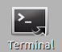
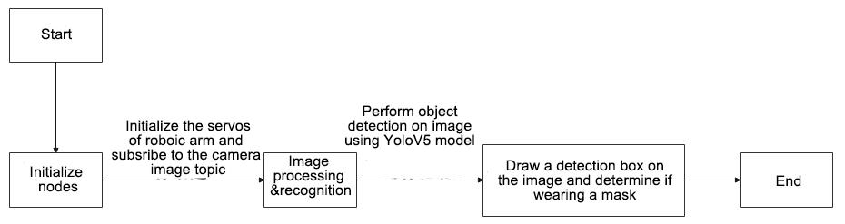
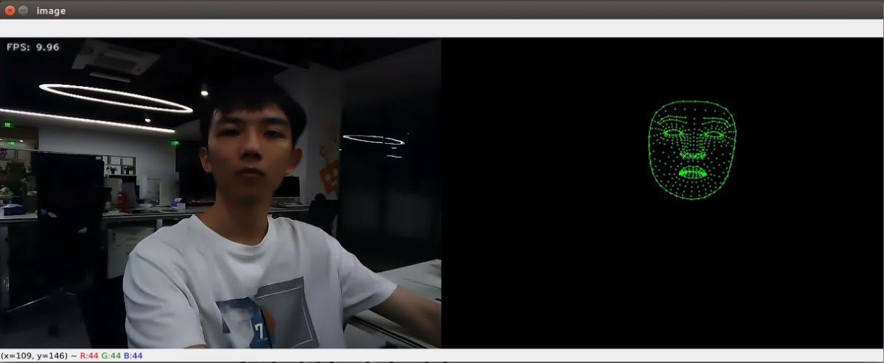

# 6. ROS1-ROS+Deep Learning Application Lessons

## 6.1 Robotic Arm Waste Sorting

### 6.1.1 Realization Process

To begin with, initialize the nodes and obtain the camera intrinsic parameters, the set up the object recognition model.

Next, perform image processing and model recognition to calculate the coordinates of the objects.

Finally, send the gripping commands to the robotic arm for picking up and placing the waste blocks.

### 6.1.2 Operations

:::{Note}

The command entered should be case sensitive, and "**Tab**" key can be used to complement the key words.

:::

(1) Connect JetArm to the remote desktop via NoMachine.

(2) Double click on   to open the command line terminal. Enter the command below and press Enter to disable the auto-startup service.

```
~/.stop_ros.sh
```

(3) Enter the following command and press **Enter** to execute waste sorting task.

```
roslaunch jetarm_6dof_functions waste_classification.launch
```

(4) If you want to close the program, please press "**Ctrl+C**". Please try multiple times for the operation failure.

(5) After the game ends, you need to enable app service (should not enable the service, the following app functions will be affected).

```
sudo systemctl start start_app_node.service
```

(6) After app service is enabled successfully, the robotic arm will return to the initial posture, and the buzzer will make a "**beep**" sound.

### 6.1.3 Game Outcome

After the game starts, when robot detects a waste card, the corresponding name will be displayed on the screen and different categories will be outlined with rectangle of different colors. Hazardous waste will be outlined in red, the recyclable waste in blue, kitchen waste in green and residual waste in gray. Additionally, it will proceed to sort and grip the waste blocks.

| **Waste category** |                  **Cards**                  |
|:------------------:|:-------------------------------------------:|
|  hazardous_waste   | Storage Battery, Marker, Oral Liquid Bottle |
|  recyclable_waste  |    Plastic Bottle, Umbrella, Toothbrush     |
|     food_waste     |     Banana Peel, Ketchup, Broken Bones      |
|   residual_waste   | Cigarette End, Plate, Disposable Chopsticks |


### 6.1.4 Launch File Analysis

The launch file is stored in [/home/ubuntu/jetarm/src/jetarm_6dof/jetarm_6dof_functions/launch/waste_classification.launch](../_static/source_code/06/jetarm_6dof_functions_launch.zip)

{lineno-start=1}

```xml
<launch>
    <arg name="camera_type" default="$(optenv CAMERA_TYPE GEMINI)"/>

    <!-- 根据使用的相机设置相应参数(set corresponding parameters based on the used camera) -->
    <arg name="source_image_topic" if="$(eval camera_type=='GEMINI')" default="/rgbd_cam/color/image_rect_color" />
    <arg name="camera_info_topic" if="$(eval camera_type=='GEMINI')" default="/rgbd_cam/color/camera_info" />
    <arg name="source_image_topic" if="$(eval camera_type=='USB_CAM')" default="/usb_cam/image_rect_color" />
    <arg name="camera_info_topic" if="$(eval camera_type=='USB_CAM')" default="/usb_cam/camera_info" />

        <include file="$(find jetarm_bringup)/launch/base.launch"/>

        <node name="waste_classification" pkg="jetarm_6dof_functions" type="waste_classification.py" output="screen" respawn="true">
                <param name="source_image_topic" value="$(arg source_image_topic)" />
                <param name="camera_info_topic" value="$(arg camera_info_topic)" />
        </node>
</launch>
```

`source_image_topic` defines the name of image topic.

`camera_info_topic` defines the name of camera information.

 {lineno-start=5}

```xml
    <arg name="source_image_topic" if="$(eval camera_type=='GEMINI')" default="/rgbd_cam/color/image_rect_color" />
    <arg name="camera_info_topic" if="$(eval camera_type=='GEMINI')" default="/rgbd_cam/color/camera_info" />
```

Launch the `base.launch` file to invoke the basic setup for the robotic arm.

{lineno-start=10}

```xml
        <include file="$(find jetarm_bringup)/launch/base.launch"/>
```

Launch the source code file and set the image and camera information topics.  

{lineno-start=12}

```xml
        <node name="waste_classification" pkg="jetarm_6dof_functions" type="waste_classification.py" output="screen" respawn="true">
                <param name="source_image_topic" value="$(arg source_image_topic)" />
                <param name="camera_info_topic" value="$(arg camera_info_topic)" />
        </node>
```

### 6.1.5 Python Source Code Analysis

The source code file is stored in [/home/ubuntu/src/jetarm_6dof/jetarm_6dof_functions/scripts/waste_classification.py](../_static/source_code/06/jetarm_6dof_functions_scripts.zip)

The program logic flowchart derived from the program files is as follow.

 

From the diagram above, the program’s logic progress primarily aims to set up the object recognition model, obtain the camera intrinsic parameters, the process and recognize images and models, the send calculated object coordinates to the robot arm to pick up and place the waste blocks. The following content will be edited according to the aforementioned program logic flowchart.

* **Import Function Package** 

Import the required modules using the import statement.

{lineno-start=4}

```
import cv2
import math
import os
import rospy
import queue
import numpy as np
import threading
from vision_utils import xyz_quat_to_mat, xyz_euler_to_mat, pixels_to_world, box_center, mat_to_xyz_euler, distance, extristric_plane_shift
from sensor_msgs.msg import Image as RosImage, CameraInfo
from std_srvs.srv import Trigger, TriggerRequest, TriggerResponse
from std_srvs.srv import SetBool, SetBoolRequest, SetBoolResponse
# from yolov5_trt import YoLov5TRT
from yolov5_onnx import YOLOV5
from hiwonder_interfaces.srv import GetRobotPose
from hiwonder_interfaces.msg import MoveAction, MoveGoal, MultiRawIdPosDur
from jetarm_sdk import bus_servo_control
import actions
import actionlib
```

① `cv2 `is used for image processing.

② `rospy` is used for ROS communication.

③ `numpy `is used for array operation.

④ `queue `and threading are used for multi-threading.

⑤ The required function modules are calculated by the coordinates from `vision_utils`.

⑥ Import various functional modules required for coordinate system conversion calculations from vision_utils

⑦ Import messages types from `sensor_msgs.msg`.

⑧ Import service types for `std_srvs.srv`.

⑨ Import `yolov5_trt` model.

⑩ Import the respective message types and service types from `hiwonder_interfaces`.

⑫ Import servo control module from `jetarm_sdk`.

⑬ Import `action`groups.

⑭ Import `actionlib `communication library.

- **Waste Model Setup**

 {lineno-start=26}
   
```
TRT_NUM_CLASSES = 13
TRT_CLASS_NAMES = ( 'Banana Peel','Broken Bones', 'Cigarette End', 'Disposable Chopsticks',
                  'Ketchup', 'Marker', 'Oral Liquid Bottle', 'Plate', 'Plastic Bottle',
                   'Storage Battery', 'Toothbrush', 'Umbrella','tap')

WASTE_CLASS_NAMES = ['residual_waste', 'food_waste', 'hazardous_waste', 'recyclable_waste','tap']

WASTE_CLASSES = {
   'food_waste': ('Banana Peel', 'Broken Bones', 'Ketchup'),
   'hazardous_waste': ('Marker', 'Oral Liquid Bottle', 'Storage Battery'),
   'recyclable_waste': ('Plastic Bottle', 'Toothbrush', 'Umbrella'),
   'residual_waste': ('Plate', 'Cigarette End', 'Disposable Chopsticks'),
   'tap':('tap')
}

COLORS = {
   'recyclable_waste': (0, 0, 255),
   'hazardous_waste': (255, 0, 0),
   'food_waste': (0, 255, 0),
   'residual_waste': (80, 80, 80),
   'tap' : (200,220,100)
}
```

(1) Set the number of models

{lineno-start=26}

```
TRT_NUM_CLASSES = 13
```

(2) Set the model name.

{lineno-start=27}

```
TRT_CLASS_NAMES = ( 'Banana Peel','Broken Bones', 'Cigarette End', 'Disposable Chopsticks',
                   'Ketchup', 'Marker', 'Oral Liquid Bottle', 'Plate', 'Plastic Bottle',
                    'Storage Battery', 'Toothbrush', 'Umbrella','tap')
```

(3) Set the model category model.

{lineno-start=31}

```
WASTE_CLASS_NAMES = ['residual_waste', 'food_waste', 'hazardous_waste', 'recyclable_waste','tap']
```

(4) Classify the waste models.

{lineno-start=33}

```
WASTE_CLASSES = {
    'food_waste': ('Banana Peel', 'Broken Bones', 'Ketchup'),
    'hazardous_waste': ('Marker', 'Oral Liquid Bottle', 'Storage Battery'),
    'recyclable_waste': ('Plastic Bottle', 'Toothbrush', 'Umbrella'),
    'residual_waste': ('Plate', 'Cigarette End', 'Disposable Chopsticks'),
    'tap':('tap')
}
```

(5) Set the model category colors for recognition display.

{lineno-start=41}

```
COLORS = {
    'recyclable_waste': (0, 0, 255),
    'hazardous_waste': (255, 0, 0),
    'food_waste': (0, 255, 0),
    'residual_waste': (80, 80, 80),
    'tap' : (200,220,100)
}
```

- **Launch WasteClassificationNode Class (Waste Sorting Class)**

Launch the **waste_classification** node. If the mode is not closed, the image_process function will be continuously invoked.

{lineno-start=289}

```
if __name__ == "__main__":
    node = WasteClassificationNode("waste_classification", log_level=rospy.INFO)
    while not rospy.is_shutdown():
        node.image_process()
```

- **Initialization Function of WasteClassificationNode Class**

{lineno-start=45}

```
class WasteClassificationNode:
    def __init__(self, node_name, log_level=rospy.INFO):
        rospy.init_node(node_name, anonymous=True, log_level=log_level)
        self.lock = threading.RLock()
        self.K = None
        self.D = None

        config = rospy.get_param(CONFIG_NAME)
        self.hand2cam_tf_matrix = config['hand2cam_tf_matrix']
        self.extristric = None
        self.roi = None
        self.moving_step = 0

        self.pick_pitch = 80
        self.target = None
        self.count = 0
        self.last_card = None
        self.endpoint = None
        self.image_queue = queue.Queue(maxsize=2)
        self.fps = fps.FPS()
```

(1) Create the `servos_pub servo` publisher using `rospy.Publisher` to establish an information publisher.

{lineno-start=66}

```
        self.servos_pub = rospy.Publisher("/controllers/multi_id_pos_dur", MultiRawIdPosDur, queue_size=1)
```

The first parameter `/controllers/multi_id_pos_dur` specifies the topic name of servo control.

The second parameter `MultiRawIdPosDur` represents the message type.

The third parameter `queue_size=1` specifies the size of message queue.

(2) Define `self.camera_info_sub` for the input of camera information, creating a information subscriber using `rospy.Subscriber`.

{lineno-start=68}

```
        self.camera_info_sub = rospy.Subscriber(camera_info_topic, CameraInfo, self.camera_info_callback, queue_size=1) #订阅相机内参(subscribe to the camera intrinsics)
```

The first parameter `/rgbd_cam/color/camera_info` represents the topic name for receiving the image data.

The second parameter `CameraInfo`  denotes the message type.

The third parameter indicates that the call to `self.camera_info_callback` function to process the live camera feed.

The fourth parameter `queue_size=1` specifies the size of message queue.

{lineno-start=66}

```
        self.servos_pub = rospy.Publisher("/controllers/multi_id_pos_dur", MultiRawIdPosDur, queue_size=1)
        camera_info_topic = rospy.get_param('~camera_info_topic', '/camera/camera_info')
        self.camera_info_sub = rospy.Subscriber(camera_info_topic, CameraInfo, self.camera_info_callback, queue_size=1) #订阅相机内参(subscribe to the camera intrinsics)
```

- **Calculate the World Coordinates of the Four Corners of the Recognition Area**

 {lineno-start=78}

```
        # 识别区域的四个角的世界坐标(the world coordinates of the four corners of the recognition area)
        white_area_cam = config['white_area_pose_cam']
        white_area_center = config['white_area_pose_world']
        self.white_area_center = white_area_center
        self.white_area_cam = white_area_cam
        white_area_height = config['white_area_world_size']['height']
        white_area_width = config['white_area_world_size']['width']
        white_area_lt = np.matmul(white_area_center, xyz_euler_to_mat((white_area_height / 2, white_area_width / 2, 0.0), (0, 0, 0)))
        white_area_lb = np.matmul(white_area_center, xyz_euler_to_mat((-white_area_height / 2 - 0.01, white_area_width / 2, 0.0), (0, 0, 0)))
        white_area_rb = np.matmul(white_area_center, xyz_euler_to_mat((-white_area_height / 2 - 0.01, -white_area_width / 2, 0.0), (0, 0, 0)))
        white_area_rt = np.matmul(white_area_center, xyz_euler_to_mat((white_area_height / 2, -white_area_width / 2, 0.0), (0, 0, 0)))
        self.get_endpoint()
        corners_cam =  np.matmul(np.linalg.inv(np.matmul(self.endpoint, config['hand2cam_tf_matrix'])), [white_area_lt, white_area_lb, white_area_rb, white_area_rt, white_area_center])
        corners_cam = np.matmul(np.linalg.inv(white_area_cam), corners_cam)
        corners_cam = corners_cam[:, :3, 3:].reshape((-1, 3))
        tvec, rmat = config['extristric']

        while self.K is None or self.D is None: # 等待获取相机内参(wait for getting camera intricate)
            rospy.sleep(0.5)

        self.hand2cam_tf_matrix = config['hand2cam_tf_matrix']
        center_imgpts, jac = cv2.projectPoints(corners_cam[-1:], np.array(rmat), np.array(tvec), self.K, self.D)
        self.center_imgpts = np.int32(center_imgpts).reshape(2)
        tvec, rmat = extristric_plane_shift(np.array(tvec).reshape((3, 1)), np.array(rmat), 0.04)
        self.extristric = tvec, rmat
        imgpts, jac = cv2.projectPoints(corners_cam[:-1], np.array(rmat), np.array(tvec), self.K, self.D)
        self.imgpts = np.int32(imgpts).reshape(-1, 2)
```

(1) Obtain the camera coordinates and world coordinates of the white area, and store them into the class attributes.

{lineno-start=79}

```
        white_area_cam = config['white_area_pose_cam']
        white_area_center = config['white_area_pose_world']
        self.white_area_center = white_area_center
        self.white_area_cam = white_area_cam
```

(2) Obtain the height and width of the white area.

{lineno-start=83}

```
        white_area_height = config['white_area_world_size']['height']
        white_area_width = config['white_area_world_size']['width']
```

(3) Transform the four corner points of the white area from the world coordinate system to camera coordinate system using the `xyz_euler_to_mat` function.

{lineno-start=85}

```
        white_area_lt = np.matmul(white_area_center, xyz_euler_to_mat((white_area_height / 2, white_area_width / 2, 0.0), (0, 0, 0)))
        white_area_lb = np.matmul(white_area_center, xyz_euler_to_mat((-white_area_height / 2 - 0.01, white_area_width / 2, 0.0), (0, 0, 0)))
        white_area_rb = np.matmul(white_area_center, xyz_euler_to_mat((-white_area_height / 2 - 0.01, -white_area_width / 2, 0.0), (0, 0, 0)))
        white_area_rt = np.matmul(white_area_center, xyz_euler_to_mat((white_area_height / 2, -white_area_width / 2, 0.0), (0, 0, 0)))
```

(4) The `self.get_endpoint()` function is invoked to obtain the current end-effector pose. Then, using matrix operations, transform the corner points of the white area from the camera coordinate system to the world coordinate system, and store them in `corners_cam`. Obtain `extristric` and assign its values respectively to `tvec` and `rmat`.

{lineno-start=89}

```
        self.get_endpoint()
        corners_cam =  np.matmul(np.linalg.inv(np.matmul(self.endpoint, config['hand2cam_tf_matrix'])), [white_area_lt, white_area_lb, white_area_rb, white_area_rt, white_area_center])
        corners_cam = np.matmul(np.linalg.inv(white_area_cam), corners_cam)
        corners_cam = corners_cam[:, :3, 3:].reshape((-1, 3))
        tvec, rmat = config['extristric']
```

(5) Wait to obtain the camera intrinsic parameters.

{lineno-start=95}

```
        while self.K is None or self.D is None: # 等待获取相机内参(wait for getting camera intricate)
            rospy.sleep(0.5)
```

(6) Obtain the transformation matrix from hand to camera coordinates.

{lineno-start=98}

```
        self.hand2cam_tf_matrix = config['hand2cam_tf_matrix']
```

(7) Project the last corner point (corners_cam\[-1:\]) from the camera coordinate system onto image plane to obtain the coordinates of the center point **center_imgpts** on the image.

{lineno-start=100}

```
        center_imgpts, jac = cv2.projectPoints(corners_cam[-1:], np.array(rmat), np.array(tvec), self.K, self.D)
        self.center_imgpts = np.int32(center_imgpts).reshape(2)
```

The projection uses the camera intrinsic parameters, `self.K and self.D`, as well as rmat and tvec.

(8) Call the `extristric_plane_shift` function to make minor adjustments to the translation vector and rotation matrix. The adjusted translation vector and rotation matrix are stored in `self.extristric`.

{lineno-start=101}

```
        tvec, rmat = extristric_plane_shift(np.array(tvec).reshape((3, 1)), np.array(rmat), 0.04)
        self.extristric = tvec, rmat
```

(9) Project the set of points, excluding the last corner point (corners_cam\[:-1\]), from the camera coordinate system onto the image plane to obtain a set of coordinates `imgpts` on the image. `self.imgpts`stores these projected image coordinates.

{lineno-start=104}

```
        imgpts, jac = cv2.projectPoints(corners_cam[:-1], np.array(rmat), np.array(tvec), self.K, self.D)
        self.imgpts = np.int32(imgpts).reshape(-1, 2)
```

- **Calculate ROI Area**

Retrieve the maximum and minimum values of X-axis and Y-axis of in the image, then use **np.maximum** to compare these values with 0, resulting in an array **roi** of non-negative values.

{lineno-start=107}

```
        # 计算ROI区域
        x_min = min(self.imgpts, key=lambda p: p[0])[0]  # x轴最小值(the minimum value of x-axis)
        x_max = max(self.imgpts, key=lambda p: p[0])[0]  # x轴最大值(the maximal value of x-axis)
        y_min = min(self.imgpts, key=lambda p: p[1])[1]  # y轴最小值(the minimum value of y-axis)
        y_max = max(self.imgpts, key=lambda p: p[1])[1]  # y轴最大值(the maximal value of y-axis)
        roi = np.maximum(np.array([y_min, y_max, x_min, x_max]), 0)
        self.roi = roi
```

- **Create Action Group Client and Image Information Subscriber**

Create a simple client named **action_client** used to publish the movement actions to the /grasp topic.

{lineno-start=115}

```
        self.action_client = actionlib.SimpleActionClient('/grasp', MoveAction)
        source_image_topic = rospy.get_param('~source_image_topic', '/camera/image_raw')
        self.image_sub = rospy.Subscriber(source_image_topic, RosImage, self.image_callback, queue_size=1)
        rospy.loginfo("启动完成\r\n\r\n")
```

Retrieve the image topic name from ROS parameter server, defaulting to `/camera/image_raw`, and create a subscriber to subscribe to the image topic.

Printing a message with rospy.loginfo indicates that the node has been successfully started.

- **camera_info_callback Function**

The intrinsic matrix of the camera was extracted from the received camera information message and stored in the class member variable `self.K`.

{lineno-start=121}

```
    def camera_info_callback(self, msg): # 相机内参回调(camera intrinsics callback)
        with self.lock:
            K = np.matrix(msg.K).reshape(1, -1, 3)
            D = np.array(msg.D)
```

`msg.K` represents the intrinsic matrix of the camera in the camera information message.

`np.matrix(msg.K)`: convert the camera intrinsic matrix into a NumPy matrix.

`reshape(1, -1, 3)`: reshape the matrix into a 1xN form, where N is the number of elements in the matrix, each containing 3 values (parameters like rows, columns, focal length, etc.).

`self.D = np.array(msg.D)`: convert the distortion coefficients D in the received camera parameters into a NumPy array.


- **image_process Function**

  The image_process function is mainly to process and recognize image.

  {lineno-start=203}
  
```
    def image_process(self):
        ros_image = self.image_queue.get(block=True)
        # 将ros格式图像转换为opencv格式(convert ros format image to opencv format)
        rgb_image = np.ndarray(shape=(ros_image.height, ros_image.width, 3), dtype=np.uint8, buffer=ros_image.data)
        result_image = np.copy(rgb_image)

        if self.center_imgpts is not None:
            cv2.line(result_image, (self.center_imgpts[0] - 10, self.center_imgpts[1]), (self.center_imgpts[0] + 10, self.center_imgpts[1]), (255, 255, 0), 2)
            cv2.line(result_image, (self.center_imgpts[0], self.center_imgpts[1] - 10), (self.center_imgpts[0], self.center_imgpts[1] + 10), (255, 255, 0), 2)

        try:
            if self.moving_step == 0 and self.roi is not None and self.K is not None and self.D is not None:
                roi_area_mask = np.zeros(shape=(ros_image.height, ros_image.width, 1), dtype=np.uint8)
                roi_area_mask = cv2.drawContours(roi_area_mask, [self.imgpts], -1, 255, cv2.FILLED)
                rgb_image = cv2.bitwise_and(rgb_image, rgb_image, mask=roi_area_mask)  # 和原图做遮罩，保留需要识别的区域(mask the original image to retain the area that needs to be recognized)
                boxes, confs, classes = self.yolov5.inference(cv2.cvtColor(rgb_image, cv2.COLOR_RGB2BGR))
                cards = []

                for box, cls_conf, cls_id in zip(boxes, confs, classes):
                    x1 = box[0] #+ self.roi[2]
                    y1 = box[1] #+ self.roi[0]
                    x2 = box[2] #+ self.roi[2]
                    y2 = box[3] #+ self.roi[0]
                    waste_name = TRT_CLASS_NAMES[cls_id]
                    if waste_name == "tap":
                        continue
                    waste_class_name = ''
                    for k, v in WASTE_CLASSES.items():
                        if waste_name in v:
                            waste_class_name = k
                            break
                    cards.append((cls_conf, [x1, y1, x2, y2], waste_class_name))
                    result_image = cv2.putText(result_image, waste_name + " " + str(float(cls_conf))[:4], (int(x1), int(y1) - 5),
                                               cv2.FONT_HERSHEY_SIMPLEX, 0.7, COLORS[waste_class_name], 2)
                    result_image = cv2.rectangle(result_image, (int(x1), int(y1)), (int(x2), int(y2)), COLORS[waste_class_name], 3)
                if len(cards) > 0:
                    cards = sorted(cards, key=lambda c: c[0], reverse=True)
                    if self.last_card is None:
                        self.last_card = cards[0]
                    center_last = box_center(self.last_card[1])
                    cards = sorted(cards, key=lambda c: distance(box_center(c[1]), center_last))
                    center = box_center(cards[0][1])
                    if distance(center, center_last) < 50:
                        self.count += 1
                        if self.count > 20:
                            projection_matrix = np.row_stack((np.column_stack((self.extristric[1], self.extristric[0])), np.array([[0, 0, 0, 1]])))
                            world_pose = pixels_to_world([center, ], self.K, projection_matrix)[0]  # 像素坐标相对于识别区域中心的相对坐标(pixel coordinates relative to the center of the recognition area)
                            world_pose[1] = -world_pose[1]
                            world_pose[2] = 0.04
                            world_pose = np.matmul(self.white_area_center, xyz_euler_to_mat(world_pose, (0, 0, 0)))  # 转换到相机相对坐标(convert to the camera relative coordinates)
                            world_pose[2] = 0.04
                            pose_t, pose_R = mat_to_xyz_euler(world_pose)
                            params = rospy.get_param(os.path.join(POSITIONS_PATH, 'waste_classification'))
                            pose_t[2] = 0.015
                            for i in range(3):
                                pose_t[i] = pose_t[i] + params['offset'][i]
                                pose_t[i] = pose_t[i] * params['scale'][i]
                            pose_t[2] += (math.sqrt(pose_t[1] ** 2 + pose_t[0] ** 2) - 0.15) / 0.20 * 0.020
                            print(pose_t)
                            self.target = cards[0]
                            self.moving_step = 1
                            self.status = 1
                            threading.Thread(target=self.action_starting, args=(pose_t, pose_R)).start()
                    else:
                        self.count = 0
```

(1) Retrieve the image data of ROS format, convert the ROS-formatted image to opencv format, and create a copy of the image.

{lineno-start=204}

```
        ros_image = self.image_queue.get(block=True)
        # 将ros格式图像转换为opencv格式(convert ros format image to opencv format)
        rgb_image = np.ndarray(shape=(ros_image.height, ros_image.width, 3), dtype=np.uint8, buffer=ros_image.data)
        result_image = np.copy(rgb_image)
```

(2) If `self.center_imgpts` is not None, indicating the presence of image coordinate information for a center point, use `cv2.line` to draw two cross-lines, marking the center point in `result_image`.

{lineno-start=209}

```
        if self.center_imgpts is not None:
            cv2.line(result_image, (self.center_imgpts[0] - 10, self.center_imgpts[1]), (self.center_imgpts[0] + 10, self.center_imgpts[1]), (255, 255, 0), 2)
            cv2.line(result_image, (self.center_imgpts[0], self.center_imgpts[1] - 10), (self.center_imgpts[0], self.center_imgpts[1] + 10), (255, 255, 0), 2)
```

(3) Start image processing when the following conditions are met.

{lineno-start=213}

```
        try:
            if self.moving_step == 0 and self.roi is not None and self.K is not None and self.D is not None:
```

(4) Create a blank mask image, the same size as the original image, to store the mask of the region of interest.

{lineno-start=215}

```
                roi_area_mask = np.zeros(shape=(ros_image.height, ros_image.width, 1), dtype=np.uint8)
                roi_area_mask = cv2.drawContours(roi_area_mask, [self.imgpts], -1, 255, cv2.FILLED)
                rgb_image = cv2.bitwise_and(rgb_image, rgb_image, mask=roi_area_mask)  # 和原图做遮罩，保留需要识别的区域(mask the original image to retain the area that needs to be recognized)
```

Draw the contour of the region of interest on the mask image, creating a filled white area.

Use the mask image to perform a bitwise AND operation with the original color image, thereby obtaining the image content that retains only the region of interest.

Extract the region of interest from the resulting image after the bitwise AND operation, creating a new image `roi_image`.

(5) Perform object detection using the YOLOv5 model on `roi_image`. Detected targets will be stored in 'boxes', 'confs', and 'classes'. These targets will be used for subsequent processing and drawing.

{lineno-start=220}

```
                boxes, confs, classes = self.yolov5.infer(cv2.cvtColor(rgb_image, cv2.COLOR_RGB2BGR))
                cards = []
```

(7) Iterate through the detected targets using a loop and perform the following processing.

{lineno-start=237}

```
                for box, cls_conf, cls_id in zip(boxes, confs, classes):
                    x1 = box[0] #+ self.roi[2]
                    y1 = box[1] #+ self.roi[0]
                    x2 = box[2] #+ self.roi[2]
                    y2 = box[3] #+ self.roi[0]
                    waste_name = TRT_CLASS_NAMES[cls_id]
                    if waste_name == "tap":
                        continue
                    waste_class_name = ''
                    for k, v in WASTE_CLASSES.items():
                        if waste_name in v:
                            waste_class_name = k
                            break
                    cards.append((cls_conf, [x1, y1, x2, y2], waste_class_name))
                    result_image = cv2.putText(result_image, waste_name + " " + str(float(cls_conf))[:4], (int(x1), int(y1) - 5),
                                               cv2.FONT_HERSHEY_SIMPLEX, 0.7, COLORS[waste_class_name], 2)
                    result_image = cv2.rectangle(result_image, (int(x1), int(y1)), (int(x2), int(y2)), COLORS[waste_class_name], 3)
```

Calculate the coordinates of the targets in the original image using x1, y1, x2, and y2 representing the top-left and bottom-right coordinates of the targets.

Retrieve the target's class name 'waste_name' based on cls_id and look up the corresponding class name 'waste_class_name' in the predefined class dictionary 'WASTE_CLASSES'.

Store the target's relevant information (confidence, coordinates, class name) as a tuple in the cards list. Use `cv2.putText` to draw the target's class name and confidence on the image. Use 'cv2.rectangle' to draw a bounding box around the detected target on the image. These steps will annotate and draw the detected targets to display the recognized garbage category and positions on the image. These processing steps will be within the region of interest to limit the range of target identification.

(7) If the number of detected targets is greater than 0, sort the 'cards' list based on confidence in descending order.

{lineno-start=240}

```
                if len(cards) > 0:
                    cards = sorted(cards, key=lambda c: c[0], reverse=True)
                    if self.last_card is None:
                        self.last_card = cards[0]
                    center_last = box_center(self.last_card[1])
                    cards = sorted(cards, key=lambda c: distance(box_center(c[1]), center_last))
                    center = box_center(cards[0][1])
```

If no targets were previously identified (last_card is None), consider the first target in the list as last_card.

Obtain the center position of the previously identified target `center_last` by calling the function `box_center(self.last_card[1])`, where `self.last_card[1]` represents the coordinates of the target box.

Sort the cards list based on the distance between the target center and center_last. Use the sorted function and pass a **key** parameter to specify the sorting criterion. Here, a lambda function is used to calculate the distance, arranging from nearest to farthest.

Retrieve the center position of the target ranked first in the list center by calling `box_center(cards[0][1])`, where `cards[0][1]` represents the coordinates of the first target box in the list.

(8) If the distance between the current target center and the previously recognized target center is less than 50 pixels and the consecutive count exceeds 40 times, indicating good stability of the current target, perform the following steps:

{lineno-start=247}

```
                    if distance(center, center_last) < 50:
                        self.count += 1
                        if self.count > 20:
                            projection_matrix = np.row_stack((np.column_stack((self.extristric[1], self.extristric[0])), np.array([[0, 0, 0, 1]])))
                            world_pose = pixels_to_world([center, ], self.K, projection_matrix)[0]  # 像素坐标相对于识别区域中心的相对坐标(pixel coordinates relative to the center of the recognition area)
                            world_pose[1] = -world_pose[1]
                            world_pose[2] = 0.04
                            world_pose = np.matmul(self.white_area_center, xyz_euler_to_mat(world_pose, (0, 0, 0)))  # 转换到相机相对坐标(convert to the camera relative coordinates)
                            world_pose[2] = 0.04
                            pose_t, pose_R = mat_to_xyz_euler(world_pose)
                            params = rospy.get_param(os.path.join(POSITIONS_PATH, 'waste_classification'))
                            pose_t[2] = 0.015
                            for i in range(3):
                                pose_t[i] = pose_t[i] + params['offset'][i]
                                pose_t[i] = pose_t[i] * params['scale'][i]
                            pose_t[2] += (math.sqrt(pose_t[1] ** 2 + pose_t[0] ** 2) - 0.15) / 0.20 * 0.020
                            print(pose_t)
                            self.target = cards[0]
                            self.moving_step = 1
                            self.status = 1
                            threading.Thread(target=self.action_starting, args=(pose_t, pose_R)).start()
```

Build the projection matrix `projection_matrix`.

Convert pixel coordinates to coordinates relative to the center of the recognition area, obtaining `world_pose`.

Perform a coordinate transformation on `world_pose` to convert it to the camera-relative coordinate system.

Update the Z-coordinate in world_pose to a fixed value of 0.04.

Convert the transformed coordinates world_pose to displacement and rotation angles pose_t and pose_R.

Set the detected target as target.

Set moving_step to 1, indicating the start of executing the gripping action. Execute the gripping action in the background using threading.

(9) If the distance between the current target center and the previously recognized target center exceeds 50 pixels or no target is detected, reset the consecutive count to 0, and set `last_card` to None. If an exception occurs during processing, log the exception information.

{lineno-start=282}

```
                    else:
                        self.count = 0
                    self.last_card = cards[0]
                else:
                    self.count = 0
                    self.last_card = None
        except Exception as e:
            rospy.logerr(str(e))
```

`self.fps.update()`: Update the framerate statistics.

`result_image = self.fps.show_fps(result_image)`: Pass the current frame's image to the framerate statistics object to display framerate information on the image.

`cv2.imshow`: Display the processed image using the OpenCV library. The first parameter is the window name, and the second parameter is the image to display. Here, the window name is `waste_classification`.` cv2.cvtColor(result_image, cv2.COLOR_RGB2BGR)` converts the image from RGB to BGR format because OpenCV defaults to using BGR format.

(10) `cv2.waitKey(1)`: Wait for 1 millisecond and check for keyboard input.

{lineno-start=275}

```
        # 计算帧率及发布结果图像(calculate frame rate and publish result image)
        self.fps.update()
        result_image = self.fps.show_fps(result_image)
        cv2.imshow("waste_classification", cv2.cvtColor(result_image, cv2.COLOR_RGB2BGR))
        cv2.waitKey(1)
```

- **image_callback Function**

This is a callback function designed to handle received ROS image messages. It takes a parameter 'ros_image' of type RosImage, representing the received image message.

The 'rospy.logdebug' function outputs a debug-level log message indicating that the image has been received.

The 'except Exception as e:' block handles exceptions. If there's an exception in the preceding code block, the code within this block will be executed.

{lineno-start=281}

```
    def image_callback(self, ros_image: RosImage):
        rospy.logdebug('Received an image! ')
        try:
            self.image_queue.put_nowait(ros_image)
        except Exception as e:
            e = e
```

## 6.2 Mask Recognition 

### 6.2.1 Realization Process

First, initialize the node and initialize the robotic arm servos, then subscribe to the camera image topic.

Next, perform image processing and model recognition.

Finally, based on the detection results, draw bounding boxes and class labels on the image.

### 6.2.2 Operations

:::{Note}

The command entered should be case sensitive, and "**Tab**" key can be used to complement the key words.

:::

(1) Connect JetArm to the remote desktop via NoMachine.

(2) Double click on   to open the command line terminal. Enter the command below to disable the auto-startup service.

```
~/.stop_ros.sh
```

(3) Open a new command-line terminal  . Enter the command below and press Enter to execute the program.

```
roslaunch jetarm_6dof_functions face_mask.launch
```

(4) After the game ends, you need to enable app service in   (should not enable the service, the following app functions will be affected).

```
sudo systemctl start start_app_node.service
```

 

(5) After app service is enabled successfully, the robotic arm will return to the initial posture, and the buzzer will make a "**beep**" sound.

### 6.2.3 Outcome

The robotic arm can detect whether a person is wearing a mask and display the detection results by framing the face in the image. Additionally, it prints out the detection result (1 for wearing a mask, 0 for not wearing a mask), confidence level, and coordinates of the four corner points of the selected frame on the terminal.


### 6.2.4 Launch File Analysis

The launch file is stored in [/home/ubuntu/jetarm/src/jetarm_6dof/jetarm_6dof_functions/launch/face_mask.launch](../_static/source_code/06/jetarm_6dof_functions_launch.zip)

{lineno-start=1}

```
<launch>
    <arg name="camera_type" default="$(optenv CAMERA_TYPE GEMINI)"/>

    <!-- 根据使用的相机设置相应参数(set corresponding parameters based on the used camera) -->
    <arg name="source_image_topic" if="$(eval camera_type=='GEMINI')" default="/rgbd_cam/color/image_rect_color" />
    <arg name="camera_info_topic" if="$(eval camera_type=='GEMINI')" default="/rgbd_cam/color/camera_info" />
    <arg name="source_image_topic" if="$(eval camera_type=='USB_CAM')" default="/usb_cam/image_rect_color" />
    <arg name="camera_info_topic" if="$(eval camera_type=='USB_CAM')" default="/usb_cam/camera_info" />

        <include file="$(find jetarm_bringup)/launch/base.launch"/>
 
        <node name="face_mask" pkg="jetarm_6dof_functions" type="face_mask.py" output="screen" respawn="true">
                <param name="source_image_topic" value="$(arg source_image_topic)" />
        </node>
</launch>
```

`source_image_topic` defines the name of image topic.

{lineno-start=5}

```
    <arg name="source_image_topic" if="$(eval camera_type=='GEMINI')" default="/rgbd_cam/color/image_rect_color" />
```

Launch the `base.launch` file to invoke the robotic arm basic setup.

{lineno-start=10}

```
        <include file="$(find jetarm_bringup)/launch/base.launch"/>
```

Launch the source code file and set the image information topic.

{lineno-start=12}

```
        <node name="face_mask" pkg="jetarm_6dof_functions" type="face_mask.py" output="screen" respawn="true">
                <param name="source_image_topic" value="$(arg source_image_topic)" />
        </node>
```

### 6.2.5 Python Source Code Analysis

The source code file is stored in [/home/ubuntu/src/jetarm_6dof/jetarm_6dof_functions/scripts/face_mask.py](../_static/source_code/06/jetarm_6dof_functions_scripts.zip)

The program logic flowchart derived from the program files is as follow.



The program's main logic involves image processing, model recognition, framing faces in the real-time image, and printing the detection results.

- **Import Function Package**

(1) Import the required models using import statement

{lineno-start=4}

```
import os
import sys
import cv2
import time
import rospy
import queue
import numpy as np
from yolov5_onnx import YOLOV5
from sensor_msgs.msg import Image
from vision_utils import  fps
from hiwonder_interfaces.msg import MultiRawIdPosDur
from jetarm_sdk import bus_servo_control
```

`os`: Used for operating system-related functionalities.

`sys`: Interacts with the Python interpreter.

`cv2`: Handles OpenCV image processing.

`time`: Manages time-related operations.

`rospy`: Facilitates ROS communication.

`queue`: Creates queues.

`numpy`: Executes array operations.

`Image`: A message type from the sensor_msgs.msg module, used for representing image data.

`yolov5 and fps`: Functional modules imported from the vision_utils module, employed for image recognition and frame rate computation.

`MultiRawIdPosDur`: A message type from the hiwonder_interfaces.msg module, representing position and duration information for multiple servos.

`bus_servo_control`: Servo control module imported from the jetarm_sdk module.

(2) Define the recognition type setup.

{lineno-start=19}

```
TRT_INPUT_SIZE = 160
TRT_NUM_CLASSES = 2
TRT_CLASS_NAMES = ("mask", "nomask", "mask_incorrect")
COLORS = ((0, 0, 255), (255, 0, 0), (0, 255, 0))
```

Defined the input image size for the TensorRT model, specifically set to 160x160 pixels.

Specified the number of classes the TensorRT model can recognize, set as 2.

This tuple defines two labels, namely `nomask` and `mask`.

Another tuple is defined for two different colors used when drawing bounding boxes or text on the image.

- **Launch FacemaskNode Class (Mask Recognition Class)**

Start the facemask_node node and continuously call the image_process function if the node isn't closed. In case of an exception, capture the exception information 'e' using `rospy.logerr()` to log it at the error level in ROS. Convert the exception information into string form using `str(e)`.

{lineno-start=89}

```
if __name__ == '__main__':
    try:
        facemask_node = FacemaskNode()
        while not rospy.is_shutdown():
            facemask_node.image_process()
    except Exception as e:
        rospy.logerr(str(e))
```

- **FacemaskNode Class Initialization Function**

   {lineno-start=25}
   
   ```
   class FacemaskNode:
       def __init__(self):
           rospy.init_node('facemask_node')
   
           # 建立Yolo实例(establish a YOLO instance)
           weights = '/home/ubuntu/weights/face_mask/face_mask.onnx'
           self.yolov5 = YOLOV5(weights, TRT_CLASS_NAMES, 0.90)
           self.fps = fps.FPS() # 帧率统计器(frame rate counter)
   
           self.servos_pub = rospy.Publisher('/controllers/multi_id_pos_dur', MultiRawIdPosDur, queue_size=1)
           rospy.sleep(2)
           bus_servo_control.set_servos(self.servos_pub, 1000, ((1, 500), (2, 700), (3, 85), (4, 350), (5, 500), (10, 200)))
           rospy.sleep(1)
   
           # 订阅相机图像话题(subscribe camera image topic)
           self.image_queue = queue.Queue(maxsize=2)
           source_image_topic = rospy.get_param('~source_image_topic', 'camera/image_rect_color')
           self.image_sub = rospy.Subscriber(source_image_topic, Image, self.image_callback, queue_size=1)
   ```

Intialize facemask_node node.

{lineno-start=25}

```
class FacemaskNode:
    def __init__(self):
        rospy.init_node('facemask_node')
```

- **Establish Yolo Instance**

Use `rospy.get_param()` function to obtain the weights paramete. `/home/ubuntu/weights/facemask_v5_160.trt` is the path to the weights file.

Create a  `yolov5.TrtYolov5` object, a Yolov5 model used for mask detection.

Create am `fps.FPS` object, which is used for frame rate statistics.

{lineno-start=29}

```
        # 建立Yolo实例(establish a YOLO instance)
        weights = '/home/ubuntu/weights/face_mask/face_mask.onnx'
        self.yolov5 = YOLOV5(weights, TRT_CLASS_NAMES, 0.90)
        self.fps = fps.FPS() # 帧率统计器(frame rate counter)
```

- **Create servo publisher and initialize the pose of robotic arm**

servos_pub creates a servo publisher to publish messages to the `/controllers/multi_id_pos_dur` topic**.** The `MultiRawIdPosDur` is the message type used for controlling the positions and durations of multiple servos.

Use the set_servos function from the bus_servo_control module to set the initial position and duration of servos. The parameters include a publisher instance, servo runtime (unit: mm) and a tuple containing multiple servo IDs and their respective rotation angles (ranging from 1 to 1000).

{lineno-start=34}

```
        self.servos_pub = rospy.Publisher('/controllers/multi_id_pos_dur', MultiRawIdPosDur, queue_size=1)
        rospy.sleep(2)
        bus_servo_control.set_servos(self.servos_pub, 1000, ((1, 500), (2, 700), (3, 85), (4, 350), (5, 500), (10, 200)))
        rospy.sleep(1)
```

- **Subscribe to Camera Image Topic**

A queue with a maximum capacity of 2 has been create to store image message, which implies that the most two image messages can be stored in the queue.

Create the `image_sub` image message subscriber using the `rospy.Subscriber`, where the first parameter `source_image_topic` represents the image topic name, the second parameter "**Image**" is the image type, the third parameter indicates that `self.camera_info_callback` function is invoked to process the live feed camera and the fourth parameter `queue_size=1` specifies the size of the message queue.

{lineno-start=39}

```
        # 订阅相机图像话题(subscribe camera image topic)
        self.image_queue = queue.Queue(maxsize=2)
        source_image_topic = rospy.get_param('~source_image_topic', 'camera/image_rect_color')
        self.image_sub = rospy.Subscriber(source_image_topic, Image, self.image_callback, queue_size=1)
```

- **image_callback Function**

This is a callback function used to handle the received ROS image message. It takes a parameter `ros_image` of type Image, representing the received image message.

The image_queue indicates that images are pushed into the queue as pycuda requires that the context establishment and execution must be in the same thread. If the recognition can’t be performed within the topic callback, it needs to be placed in the queue and executed in the main thread.  

except Exception as e: this is the exception handling part. If any exception occurs in the preceding code block, the code within this section will be executed.

{lineno-start=44}

```
    def image_callback(self, ros_image: Image):
        #rospy.logdebug('Received an image! ')
        try:
            self.image_queue.put_nowait(ros_image) # 将图片压入队列(push the image into the queue)
        except Exception as e:
            pass
```

- **image_process Function**

(1) The primary function of the image_process function is to handle image processing and recognition.

{lineno-start=}

```
    def image_process(self):
        ros_image = self.image_queue.get(block=True) # 从队列里面取出画面(retrieve the frame from the queue)

        # 将画面转为 opencv 格式(convert the screen to opencv format)
        rgb_image = np.ndarray(shape=(ros_image.height, ros_image.width, 3), dtype=np.uint8, buffer=ros_image.data)
        result_image = np.copy(rgb_image)

        try:
            # outputs = self.yolov5.detect(rgb_image) # 对画面进行识别(recognize screen)
            # 后处理, 将原始输出转换为边界框,进行 NMS 阈值处理等(post-processing: Convert the raw output to bounding boxes, perform Non-Maximum Suppression (NMS), and apply thresholding)
            boxes, confs, classes = self.yolov5.inference(rgb_image) 

            for box, cls_id, cls_conf in zip(boxes, classes, confs):
                x1 = box[0] 
                y1 = box[1] 
                x2 = box[2] 
                y2 = box[3] 

                # 结果画面中显示是否戴口罩(display whether the person is wearing a mask in the result image)
                cv2.putText(result_image, 
                            TRT_CLASS_NAMES[cls_id] + " " + str(float(cls_conf))[:4],
                            (int(x1), int(y1) - 5), 
                            cv2.FONT_HERSHEY_SIMPLEX, 0.7, COLORS[cls_id], 2)
                # 结果画面中框出口罩(box out the masks in the result image)
                cv2.rectangle(result_image, 
                              (int(x1), int(y1)), (int(x2), int(y2)), 
                              COLORS[cls_id], 3)

                rospy.loginfo((cls_id, float(cls_conf), x1, x2, y1, y2))
        except Exception as e:
            rospy.logerr(str(e))
        self.fps.update()
        self.fps.show_fps(result_image)
        result_image = cv2.cvtColor(result_image, cv2.COLOR_RGB2BGR)
        cv2.imshow("image", result_image)
        cv2.waitKey(1)
```

(2) Take an image from the queue.

{lineno-start=51}

```
    def image_process(self):
        ros_image = self.image_queue.get(block=True) # 从队列里面取出画面(retrieve the frame from the queue)
```

(3) Obtain ROS-formatted image data, converting the ROS-formatted image into OpenCV format, and creating a copy of the image.

{lineno-start=54}

```
        # 将画面转为 opencv 格式(convert the screen to opencv format)
        rgb_image = np.ndarray(shape=(ros_image.height, ros_image.width, 3), dtype=np.uint8, buffer=ros_image.data)
        result_image = np.copy(rgb_image)
```

At first, use self.yolov5.detect(rgb_image) to recognize RGB image to obtain the model’s outputs.

Next, calling self.yolov5.post_process(rgb_image, outputs, 0.6, 0.2) for post-processing the raw outputs of model, converting the outputs into bounding boxes, confidence scores and categories. The function's parameters include the RGB image, model outputs, confidence threshold, and NMS (Non-Maximum Suppression) threshold.

(4) Obtain the height and width of the raw image for later recovery of bounding box coordinates.

{lineno-start=58}

```
        try:
            # outputs = self.yolov5.detect(rgb_image) # 对画面进行识别(recognize screen)
            # 后处理, 将原始输出转换为边界框,进行 NMS 阈值处理等(post-processing: Convert the raw output to bounding boxes, perform Non-Maximum Suppression (NMS), and apply thresholding)
            boxes, confs, classes = self.yolov5.inference(rgb_image) 

            for box, cls_id, cls_conf in zip(boxes, classes, confs):
                x1 = box[0] 
                y1 = box[1] 
                x2 = box[2] 
                y2 = box[3] 
```

"**Firstly, perform detection on the RGB image using self.yolov5.detect(rgb_image) to obtain the model's outputs, termed 'outputs.' Next, proceed to call self.yolov5.post_process(rgb_image, outputs, 0.6, 0.2) for post-processing the model's raw outputs into bounding boxes, confidence scores, and categories. The function's parameters include the RGB image, model outputs, confidence threshold, and NMS (Non-Maximum Suppression) threshold.**"

Loop through the processed bounding boxes, categories, and confidence information. In each iteration, convert the normalized coordinates of the bounding boxes into pixel coordinates and draw rectangular boxes on the original image.

(5) Use the `cv2.putText` function to draw the text label on the image. The label content includes the corresponding label name from FACEMASK_LABELS ("**nomask**" or "**maks**") along with its respective confidence level. These information are drawn at the upper-left corner of the bounding box, determined by (int(x1), int(y1) - 5).

{lineno-start=69}

```
                # 结果画面中显示是否戴口罩(display whether the person is wearing a mask in the result image)
                cv2.putText(result_image, 
                            TRT_CLASS_NAMES[cls_id] + " " + str(float(cls_conf))[:4],
                            (int(x1), int(y1) - 5), 
                            cv2.FONT_HERSHEY_SIMPLEX, 0.7, COLORS[cls_id], 2)
```

(6) Use the cv2.rectangle function to draw a rectangle on the raw image. A rectangle is drawn to frame the detected human face area. The coordinates of the box are from (int(x1), int(y1)) to (int(x2), int(y2)), and the color is determined by corresponding color within the COLORS list. The border thickness is set to 3.

{lineno-start=69}

```
                # 结果画面中框出口罩(box out the masks in the result image)
                cv2.rectangle(result_image, 
                              (int(x1), int(y1)), (int(x2), int(y2)), 
                              COLORS[cls_id], 3)
```

(7) Utilize the rospy.loginfo function to record a log message for recording the relative information of each detected face like class ID, confidence level and the coordinate information of the rectangle.

{lineno-start=79}

```
                rospy.loginfo((cls_id, float(cls_conf), x1, x2, y1, y2))
```

(8) The code below will capture exceptions, update frame rate statistics, convert the image format, display the image and wait for window events. This process iterates continuously to realize the real-time display and processing of images.

{lineno-start=80}

```
        except Exception as e:
            rospy.logerr(str(e))
        self.fps.update()
        self.fps.show_fps(result_image)
        result_image = cv2.cvtColor(result_image, cv2.COLOR_RGB2BGR)
        cv2.imshow("image", result_image)
        cv2.waitKey(1)
```

## 6.3 MediaPipe Introduction

### 6.3.1 Introduction

MediaPipe is an open-source framework of multi-media machine learning models. Cross-platform MediaPipe can run on mobile devices, workspace and servers, as well as support mobile GPU acceleration. It is also compatible with TensorFlow and TF Lite Inference Engine, and all kinds of TensorFlow and TF Lite models can be applied on it. Besides, MediaPipe supports GPU acceleration of mobile and embedded platform.

 

### 6.3.2 Pros and Cons

* **Pros**

(1) MediaPipe supports various platforms and languages, including iOS, Android, C++, Python, JAVAScript, Coral, etc.

(2) Swift running. Models can run in real-time.

(3) Models and codes are with high reuse rate.

* **Cons**

(1) For mobile devices, MediaPipe will occupy 10M or above.

(2) As it greatly depends on Tensorflow, you need to alter large amount of codes if you want to change it to other machine learning frameworks, which is not friendly to machine learning developer.

(3) It adopts static image which can improve efficiency, but make it difficult to find out the errors.

### 6.3.3 MediaPipe Usage Process

The figure below shows how to use MediaPipe. The solid line represents the part to coded, and the dotted line indicates the part not to coded. MediaPipe can offer the result and the function realization framework quickly.

 

(1) Dependency

MediaPipe utilizes OpenCV to process video, and uses [FFMPEG](https://www.ffmpeg.org/) to process audio data. Furthermore, it incorporates other essential dependencies, including OpenGL/Metal, Tensorflow, and Eigen.

For seamless usage of MediaPipe, we suggest gaining a basic understanding of OpenCV. To delve into OpenCV, you can find detailed information in "[**4. ROS1-ROS+OpenCV Course**](https://docs.hiwonder.com/projects/JetArm/en/latest/docs/4.ROS1_ROS%2BOpenCV_Course.html)".

(2) MediaPipe Solutions

Solutions is based on the open-source pre-constructed sample of TensorFlow or TFLite. MediaPipe Solutions is built upon a framework, which provides 16 Solutions, including face detection, Face Mesh, iris, hand, posture, human body and so on.

The Solutions are developed using open-source pre-constructed samples from TensorFlow or TFLite. MediaPipe Solutions are built upon a versatile framework that offers 16 different components, like face detection, Face Mesh, iris tracking, hand tracking, posture estimation, human body tracking, and more.

(3) MediaPipe Learning Website

MediaPipe：https://developers.google.com/mediapipe

MediaPipe Wiki：http://i.bnu.edu.cn/wiki/index.php?title=Mediapipe

MediaPipe github：<https://github.com/google/mediapipe>

Dlibofficial website: http://dlib.net/

dlib github: <https://github.com/davisking/dlib>

## 6.4 3D Face Detection

### 6.4.1 Realization Process

Firstly, initialize the node and robotic arm, subscribe to the camera image topic and create FeceMesh model instance for face detection.

Next, proceed to perform image processing to obtain the face key points information. Then connect all the key points of human face to form a contour of human face.

Lastly, combine the original RGB image with the black canvas that has facial contours drawn on it, forming a displayed result image.

### 6.4.2 Operations 

:::{Note}

The entered commands should be case sensitive, and the "**Tab**" key can be used to complement the key words.

:::

(1) Connect JetArm to the remote desktop via NoMachine.

(2) Double click on   to open the command line terminal. Enter the command below and press Enter to disable the auto-startup service.

```
~/.stop_ros.sh
```

(3) Enter the command below and press Enter to run the program.

```
roslaunch jetarm_6dof_functions face_mesh.launch
```

(4) If you want to close the program, please prss "**Ctrl+C**". Please try multiple times for the operation failure.

(5) After the game ends, you need to enable app service (should not enable the service, the following app functions will be affected).

```
sudo systemctl start start_app_node.servic
```

(6) After the app auto-start service is enabled, robotic arm will return to the initial posture, and the buzzer will make a Di sound.

### 6.4.3 Performance

The camera can obtain facial key point information, and connect all the detected key points to form the outline of the face displayed on a black canvas.

 

### 6.4.4 Launch File Analysis

The launch file is located in [/home/ubuntu/jetarm/src/jetarm_6dof/jetarm_6dof_functions/launch/face_mesh.launch](../_static/source_code/06/jetarm_6dof_functions_launch.zip)

{lineno-start=}

```
<launch>
    <arg name="camera_type" default="$(optenv CAMERA_TYPE GEMINI)"/>

    <!-- 根据使用的相机设置相应参数(set corresponding parameters based on the used camera) -->
    <arg name="source_image_topic" if="$(eval camera_type=='GEMINI')" default="/rgbd_cam/color/image_rect_color" />
    <arg name="camera_info_topic" if="$(eval camera_type=='GEMINI')" default="/rgbd_cam/color/camera_info" />
    <arg name="source_image_topic" if="$(eval camera_type=='USB_CAM')" default="/usb_cam/image_rect_color" />
    <arg name="camera_info_topic" if="$(eval camera_type=='USB_CAM')" default="/usb_cam/camera_info" />

        <include file="$(find jetarm_bringup)/launch/base.launch"/>

        <node name="jetarm_6dof_functions" pkg="jetarm_6dof_functions" type="face_mesh.py" output="screen" respawn="true">
                <param name="source_image_topic" value="$(arg source_image_topic)" />
        </node>
</launch>
```

`source_image_topic` defines the image topic name.

{lineno-start=5}

```
    <arg name="source_image_topic" if="$(eval camera_type=='GEMINI')" default="/rgbd_cam/color/image_rect_color" />
```

Launch `base.launch` file to invoke the robotic arm basic setup.

{lineno-start=10}

```
        <include file="$(find jetarm_bringup)/launch/base.launch"/>
```

Launch the source code file and set the image information topic.

{lineno-start=12}

```
        <node name="jetarm_6dof_functions" pkg="jetarm_6dof_functions" type="face_mesh.py" output="screen" respawn="true">
                <param name="source_image_topic" value="$(arg source_image_topic)" />
        </node>
```

### 6.4.5 Python Source Code Analysis

The source code file is located in [/home/ubuntu/src/jetarm_6dof/jetarm_6dof_functions/scripts/face_mesh.py](../_static/source_code/06/jetarm_6dof_functions_scripts.zip)

The following logic flowchart is obtained from organizing the program files:

 

From the above figure, the program’s logic flow is mainly to perform image processing and obtain facial key information, collecting all the keypoints to form facial contour displayed on the returned image.

- **Import Function Packet**

Import the required modules using **import** statement

{lineno-start=2}

```
import cv2
import rospy
import numpy as np
import mediapipe as mp
from sensor_msgs.msg import Image
from vision_utils import fps
from hiwonder_interfaces.msg import MultiRawIdPosDur
from jetarm_sdk import bus_servo_control
```

`cv2` is used for OpenCV image processing.

`rospy` is used for ROS communication.

`numpy` is used for array operations.

Import `mediapipe` module, providing various machine learning models and tools.

Import the Image message type from the `sensor_msgs` module.

From the `vision_utils` module, the functionality "**fps**" is imported for frame rate statistics.

The `MultiRawIdPosDur` message type was imported from the `hiwonder_interfaces` module.

From the `jetarm_sdk module`, the servo control module `bus_servo_control` was imported for controlling servo motion.

- **The Use of mediapipe**

{lineno-start=11}

```
mp_drawing = mp.solutions.drawing_utils
mp_face_mesh = mp.solutions.face_mesh
drawing_spec = mp_drawing.DrawingSpec(thickness=1, circle_radius=1)
```

mp_drawing = mp.solutions.drawing_utils assigns the `drawing_utils` module from the mediapipe module to the variables `mp_drawing.` This module provides tools to draw various shapes and annotations on images, facilitating the visualization of results.

mp_face_mesh = mp.solutions.face_mesh assigns the `face_mesh` module from the mediapipe module to the variable `mp_face_mesh that provides`functionality for facial keypoints detection, allowing for the detection of key points on the face such eyes, mouth.

drawing_spec = mp_drawing.DrawingSpec(thickness=1, circle_radius=1): create an object named `drawing_spec` used for defining the style for drawing. The thickness parameters specifies the width of the drawn lines, while the `circle_radius` parameter sets the radium when drawing circles.

- **Enable FaceDetectNode Face (3D Face Detection Class)**

Enable `face_detection_node`. If any exception occurs during the node’s operation, the exception information will be logged into the ROS log through the `rospy.logerr()` function.

{lineno-start=59}

```
if __name__ == "__main__":
    try:
        face_detection_node = FaceDetectNode()
        rospy.spin()
    except Exception as e:
        rospy.logerr(str(e))
```

- **FaceDetectNode Class Initialization Function**

{lineno-start=15}

```
class FaceDetectNode:
    def __init__(self):
        rospy.init_node("face_mesh_node")
        self.face_mesh = mp.solutions.face_mesh.FaceMesh(
            static_image_mode=False,
            max_num_faces=1,
            min_detection_confidence=0.5,
        )
        self.drawing = mp.solutions.drawing_utils
        self.servos_pub = rospy.Publisher('/controllers/multi_id_pos_dur', MultiRawIdPosDur, queue_size=1)
        rospy.sleep(3)
        bus_servo_control.set_servos(self.servos_pub, 1000, ((1, 500), (2, 700), (3, 85), (4, 350), (5, 500), (10, 200)))
        rospy.sleep(2)

        self.fps = fps.FPS()
        source_image_topic = rospy.get_param('~source_image_topic', '/camera/image_raw')
        self.image_sub = rospy.Subscriber(source_image_topic, Image, self.image_callback, queue_size=1)
```

Initialize the  `face_mesh_node` node.

{lineno-start=16}

```
    def __init__(self):
        rospy.init_node("face_mesh_node")
```

- **Create FaceMesh Model Instance**

`self.face_mesh` is used to create an instance of the FaceMesh model. The parameter settings control static image mode, maximum number of detected faces, minimum detection confidence, etc.

`self.drawing` creates a tool instance used for drawing annotations. `drawing_utils` contains functions enabling the drawing of facial keypoints, connecting lines, and more on an image.

{lineno-start=18}

```
        self.face_mesh = mp.solutions.face_mesh.FaceMesh(
            static_image_mode=False,
            max_num_faces=1,
            min_detection_confidence=0.5,
        )
        self.drawing = mp.solutions.drawing_utils
```

- **Create Servo Publisher and Initialize Robotic Arm Pose**

The `servos_pub` creates a servo publisher that sends messages to the `/controllers/multi_id_pos_dur` topic. Here, `MultiRawIdPosDur` is the message type used to control the positions and durations of multiple servos.

Using the `set_servos` function from the `bus_servo_control` module sets the initial positions and durations of the servos. These parameters include the publisher instance, servo runtime (in milliseconds), and a tuple containing IDs and rotation angles for multiple servos (ranging from 1 to 1000).

{lineno-start=24}

```
        self.servos_pub = rospy.Publisher('/controllers/multi_id_pos_dur', MultiRawIdPosDur, queue_size=1)
        rospy.sleep(3)
        bus_servo_control.set_servos(self.servos_pub, 1000, ((1, 500), (2, 700), (3, 85), (4, 350), (5, 500), (10, 200)))
        rospy.sleep(2)
```

Create an fps.FPS object for frame rate statistics.

Create an `image_sub` image information subscriber using rospy.Subscriber. The parameters are:

The first parameter, `source_image_topic`, denotes the image topic name.

The second parameter, `Image`, specifies the message type.

The third parameter represents the invocation of the `self.camera_info_callback` function for handling the feedback screen.

The fourth parameter, `queue_size=1`, specifies the size of the message queue

{lineno-start=29}

```
        self.fps = fps.FPS()
        source_image_topic = rospy.get_param('~source_image_topic', '/camera/image_raw')
        self.image_sub = rospy.Subscriber(source_image_topic, Image, self.image_callback, queue_size=1)
```

- **image_callback Function**

{lineno-start=33}

```
   def image_callback(self, ros_image):
       # self.get_logger().debug('Received an image! ')
       rgb_image = np.ndarray(shape=(ros_image.height, ros_image.width, 3), dtype=np.uint8, buffer=ros_image.data) # 原始 RGB 画面(original RGB image)
       black_image = np.zeros((ros_image.height, ros_image.width, 3), dtype=np.uint8)
       resize_image = cv2.resize(rgb_image, (int(ros_image.width / 2), int(ros_image.height / 2)), cv2.INTER_NEAREST) # 缩放图片(resize the image)
       try:
           results = self.face_mesh.process(resize_image) # 调用人脸检测(call human face detection)
           if results.multi_face_landmarks is not None:
               for face_landmarks in results.multi_face_landmarks:
                   mp_drawing.draw_landmarks(
                           image=black_image,
                           landmark_list=face_landmarks,
                           connections = mp_face_mesh.FACEMESH_CONTOURS,
                           landmark_drawing_spec=drawing_spec,
                           connection_drawing_spec=drawing_spec)
       except Exception as e:
           rospy.logerr(str(e))

       result_image = np.concatenate([rgb_image, black_image], axis=1)
       self.fps.update()
       result_image = self.fps.show_fps(result_image)
       result_image = cv2.cvtColor(result_image, cv2.COLOR_RGB2BGR)
       cv2.imshow('image', result_image)
       cv2.waitKey(1)
```

(1) `rgb_image` represents the raw RGB image data extracted from ROS image messages. It has a shape of (height, width, 3), denoting the image's height, width, and the number of channels (RGB channels).

(2) `black_image` is a completely black image of the same size as the original image. It serves as an initialization for certain image processing operations.

(3) `resize_image` is the result of resizing the original RGB image to half its size. This operation is performed using the `cv2.resize()` function, with the target size being half the original image's width and height. The interpolation method used for scaling is `cv2.INTER_NEAREST`, representing nearest-neighbor interpolation. This means that the nearest pixel value is used to fill in the new image during the scaling process.

{lineno-start=35}

```
        rgb_image = np.ndarray(shape=(ros_image.height, ros_image.width, 3), dtype=np.uint8, buffer=ros_image.data) # 原始 RGB 画面(original RGB image)
        black_image = np.zeros((ros_image.height, ros_image.width, 3), dtype=np.uint8)
        resize_image = cv2.resize(rgb_image, (int(ros_image.width / 2), int(ros_image.height / 2)), cv2.INTER_NEAREST) # 缩放图片(resize the image)
```

(4) The face detection model `face_mesh` is called to process the downscaled image `resize_image`. It returns a results object that contains information about the detected facial keypoints.

The code checks if facial keypoints are detected. If the list is not empty, it enters a For loop to iterate through all the detected facial keypoints information. The `draw_landmarks` function from the mp_drawing module marks the detected facial keypoints on the black image. Specific parameters are as follows:

`image = black_image`: The target image, which is the black background image.

`landmark_list = face_landmarks`: The list of facial keypoints, representing the current detected facial keypoints' information.

`connections = mp_face_mesh.FACE_CONNECTIONS`: Definition of connections, indicating the lines to be drawn between facial keypoints.

`landmark_drawing_spec = drawing_spec`: Style for drawing keypoints, including settings for line width and more.

`connection_drawing_spec = drawing_spec`: Style for drawing connections between keypoints, also including settings for line width and more.

{lineno-start=38}

```
        try:
            results = self.face_mesh.process(resize_image) # 调用人脸检测(call human face detection)
            if results.multi_face_landmarks is not None:
                for face_landmarks in results.multi_face_landmarks:
                    mp_drawing.draw_landmarks(
                            image=black_image,
                            landmark_list=face_landmarks,
                            connections = mp_face_mesh.FACEMESH_CONTOURS,
                            landmark_drawing_spec=drawing_spec,
                            connection_drawing_spec=drawing_spec)
        except Exception as e:
            rospy.logerr(str(e))
```

(5) The original RGB image `rgb_image` and the black image `black_image` with facial keypoints marked are horizontally concatenated, creating a new image `result_image` containing the original image and the facial keypoints' markings. This processed image is displayed in a window, showcasing the facial keypoints' markings along with the frame rate information. This visualization aims to display the results of face detection alongside real-time frame rate details.

{lineno-start=51}

```
        result_image = np.concatenate([rgb_image, black_image], axis=1)
        self.fps.update()
        result_image = self.fps.show_fps(result_image)
        result_image = cv2.cvtColor(result_image, cv2.COLOR_RGB2BGR)
        cv2.imshow('image', result_image)
        cv2.waitKey(1)
```

## 6.5 Mediapipe Face Tracking

### 6.5.1 Realization Process

Firstly, Initialize the node and servos, subscribe to the camera image topic, create the FaceTracker class. Initialize the face detector, PID controller, and related variables.

Next, perform image processing by using the face detector to obtain facial bounding boxes and keypoints.

Then, calculate the distance between the face and the center of the screen. Based on the PID controller's calculations, control the robotic arm to achieve face tracking.

### 6.5.2 Operations 

:::{Note}

The entered commands should be case sensitive, and the "**Tab**" key can be used to complement the key words.

:::

(1) Connect JetArm to the remote desktop via NoMachine.

(2) Double click on   to open the command line terminal. Enter the command below and press Enter to disable the auto-startup service.

```
~/.stop_ros.sh
```

(3) Enter the following command and press Enter to run the program.

```
roslaunch jetarm_6dof_functions face_tracking.launch
```

(4) If you want to close the program, please press "**Ctrl+C**". Please try multiple times for the operation failure.

(5) After the game ends, you need to enable app service (should not enable the service, the following app functions will be affected).

```
sudo systemctl start start_app_node.service
```

### 6.5.3 Outcome

Robot will detect face and enclose it on the returned image. It is capable of tracking the movement of the face, ensuring that the face is located in the center of the image.

 

### 6.5.4 Launch File Analysis

The Launch file is located in [/home/ubuntu/jetarm/src/jetarm_6dof/jetarm_6dof_functions/launch/face_tracking.launch](../_static/source_code/06/jetarm_6dof_functions_launch.zip)

{lineno-start=1}

```
<launch>
    <arg name="camera_type" default="$(optenv CAMERA_TYPE GEMINI)"/>

    <!-- 根据使用的相机设置相应参数(set corresponding parameters based on the used camera) -->
    <arg name="source_image_topic" if="$(eval camera_type=='GEMINI')" default="/rgbd_cam/color/image_rect_color" />
    <arg name="camera_info_topic" if="$(eval camera_type=='GEMINI')" default="/rgbd_cam/color/camera_info" />
    <arg name="source_image_topic" if="$(eval camera_type=='USB_CAM')" default="/usb_cam/image_rect_color" />
    <arg name="camera_info_topic" if="$(eval camera_type=='USB_CAM')" default="/usb_cam/camera_info" />

        <include file="$(find jetarm_bringup)/launch/base.launch"/>
 
        <node name="face_tarcking" pkg="jetarm_6dof_functions" type="face_tracking.py" output="screen" respawn="true">
                <param name="source_image_topic" value="$(arg source_image_topic)" />
        </node>
</launch>
```

`source_image_topic` defines the image topic name.

{lineno-start=}

```
    <arg name="source_image_topic" if="$(eval camera_type=='GEMINI')" default="/rgbd_cam/color/image_rect_color" />
```

Launch the `base.launch` file to invoke the basic setup of robotic arm.

{lineno-start=10}

```
        <include file="$(find jetarm_bringup)/launch/base.launch"/>
```

Launch the source code file and set the image information topic.

{lineno-start=12}

```
        <node name="face_tarcking" pkg="jetarm_6dof_functions" type="face_tracking.py" output="screen" respawn="true">
                <param name="source_image_topic" value="$(arg source_image_topic)" />
        </node>
```

### 6.5.5 Python Source Code Analysis

The source code file is located in [/home/ubuntu/src/jetarm_6dof/jetarm_6dof_functions/scripts/face_tracking.py](../_static/source_code/06/jetarm_6dof_functions_scripts.zip)

The program logic flowchart derived from the program files is as follow.

 

From the above diagram, the program is mainly to process images and obtain the facial key information, then the distance between face and screen’s center is calculated. Based on the calculation results from a PID controller, the robotic arm is controlled to achieve facial tracking, which is then displayed on the transmitted image.

- **Import Function Packet**

(1) Import the required module using import statement.

{lineno-start=4}

```
import os
import cv2
import sys
import threading
import rospy
import numpy as np
import mediapipe as mp
from sensor_msgs.msg import Image as RosImage
from hiwonder_interfaces.msg import MultiRawIdPosDur
from vision_utils import box_center, distance
from jetarm_sdk import bus_servo_control, pid
from utils import show_faces, mp_face_location
from vision_utils import fps
import gc
```

`os` is used for operating system-related functionalities.

`sys` is used to interact with Python interpreter.

`cv2`  is used for image processing.

`rospy` is used to ROS communication.

`threading` is used for multi-threading.

`numpy` is used for array operations.

The mediapipe module is imported, providing various learning models and tools.

The `Image` message type is imported and renamed as `RosImage`.

- **Launch ObjectTrackingNode Class (Tracking Node Class)**

Lunch the face_tracking node, and set its log level to rospy.DEBUG, which implies that the bode will record debug-level log information.

Initiate the main loop of the ROS node, keeping the node active to receive and process messages.

{lineno-start=114}

```
if __name__ == "__main__":
    node = ObjectTrackingNode("face_tracking", log_level=rospy.DEBUG)
    rospy.spin()
```

- **ObjectTrackingNode Class Initialization Class**

{lineno-start=79}

```
   class ObjectTrackingNode:
       def __init__(self, node_name, log_level=rospy.INFO):
           rospy.init_node(node_name, anonymous=True, log_level=log_level)
   
           self.fps = fps.FPS()
           self.thread = None
   
           self.servos_pub = rospy.Publisher('/controllers/multi_id_pos_dur', MultiRawIdPosDur, queue_size=1)
           rospy.sleep(2)
           bus_servo_control.set_servos(self.servos_pub, 1000, ((1, 500), (2, 700), (3, 85), (4, 350), (5, 500), (10, 200)))
           rospy.sleep(1)
   
           self.tracker = FaceTracker()
           self.source_image_topic = rospy.get_param('~source_image_topic', '/camera/image_raw')
           self.image_sub = rospy.Subscriber(self.source_image_topic, RosImage, self.image_callback, queue_size=10)
           rospy.loginfo("已开启人脸追踪")
```

(1) Initialize the `face_tracking` node.

 {lineno-start=80}

```
    def __init__(self, node_name, log_level=rospy.INFO):
        rospy.init_node(node_name, anonymous=True, log_level=log_level)
```

(2) `self.fps = fps.FPS()` creates an instance of the FPS class named self.fps for calculating and displaying the Frame Per Second information.

`self.thread = None` creates a variable named self.thread and initializes it as None.

{lineno-start=83}

```
        self.fps = fps.FPS()
        self.thread = None
```

(3) servos_pub create a servo publisher to publish message to /controllers/multi_id_pos_dur topic. Here, the `MultiRawIdPosDur` represents the message type for controlling the positions and durations of multiple servos.

Set the initial position and duration of servo using the `set_servos` function from `bus_servo_control` module. These parameters includes publisher instance, servo runtime (in millisecond) and a tuple containing multiple servos’ IDs and rotation angle ranging from 1 to 1000.

{lineno-start=86}

```
        self.servos_pub = rospy.Publisher('/controllers/multi_id_pos_dur', MultiRawIdPosDur, queue_size=1)
        rospy.sleep(2)
        bus_servo_control.set_servos(self.servos_pub, 1000, ((1, 500), (2, 700), (3, 85), (4, 350), (5, 500), (10, 200)))
        rospy.sleep(1)
```

(4) Create an instance of the FaceTracker class named self.tracker.

Create image_sub image information subscriber using `rospy.Subscriber`.

The first parameter, `source_image_topic`, represents the image topic name.

The second parameter,`Image`, is the message type.

The third parameter signifies the invocation of the `self.camera_info_callback` function to process the transmitted image.

The fourth parameter, `queue_size=1`, specifies the size of the message queue.

Print a log message, indicating that the face tracking functionality has been initiated.

{lineno-start=91}

```
        self.tracker = FaceTracker()
        self.source_image_topic = rospy.get_param('~source_image_topic', '/camera/image_raw')
        self.image_sub = rospy.Subscriber(self.source_image_topic, RosImage, self.image_callback, queue_size=10)
        rospy.loginfo("已开启人脸追踪")
```

- **Launch FaceTracker Class (Face Tracking Class)**

Create an face detector instance named `self.face_detector.`The parameter `min_detection_confidence` set the minimum detection confidence threshold.

The parameter `self.pid_yaw`  is the PID controller for controlling the yaw angle (servo ID1) of robotic arm.

The parameter `self.pid_pitch`  is the PID controller for controlling the pitch angle (ID4 servo) of the robotic arm.

The parameter  `self.yaw`  represents the initial position of the yaw angle (ID1 servo), and `self.pitch` represents the initial position of the pitch angle (ID4 servo)

{lineno-start=22}

```
class FaceTracker:
    def __init__(self):
        self.face_detector = mp.solutions.face_detection.FaceDetection(
            min_detection_confidence=0.5,
        )
        self.pid_yaw = pid.PID(25.5, 0, 6.2)
        self.pid_pitch = pid.PID(15.5, 0, 6.2)
        self.detected_face = 0 
        self.yaw = 500
        self.pitch = 350
```

- **Proc Function**

{lineno-start=33}

```
   def proc(self, source_image, result_image):
       results = self.face_detector.process(source_image)
       boxes, keypoints = mp_face_location(results, source_image)
       o_h, o_w = source_image.shape[:2]

       if len(boxes) > 0:
           self.detected_face += 1 
           self.detected_face = min(self.detected_face, 20) # 让计数总是不大于20(ensure that the count is never greater than 20)

           # 连续 5 帧识别到了人脸就开始追踪, 避免误识别(start tracking if a face is detected in five consecutive frames to avoid false positives)
           if self.detected_face >= 5:
               center = [box_center(box) for box in boxes] # 计算所有人脸的中心坐标(calculate the center coordinate of all human faces)
               dist = [distance(c, (o_w / 2, o_h / 2)) for c in center] # 计算所有人脸中心坐标到画面中心的距离(calculate the distance from the center of each detected face to the center of the screen)
               face = min(zip(boxes, center, dist), key=lambda k: k[2]) # 找出到画面中心距离最小的人脸(identify the face with the minimum distance to the center of the screen)

               # 计算要追踪的人脸距画面中心的x轴距离(0~1)。(calculate the x-axis distance (0~1) of the face to be tracked from the center of the screen)
               c_x, c_y = face[1]
               dist_x = c_x / o_w
               dist_y = c_y / o_h

               if abs(dist_y - 0.5) > 0.01:
                   self.pid_pitch.SetPoint = 0.5
                   self.pid_pitch.update(dist_y) # 更新俯仰角 pid 控制器(update the pitch angle PID controller)
                   self.pitch = min(max(self.pitch + self.pid_pitch.output, 100), 740)  # 获取新的俯仰角并限制运动范围(retrieve the new pitch angle and limit the range of motion)
               else:
                   self.pid_pitch.clear()

               if abs(dist_x - 0.5) > 0.01:
                   self.pid_yaw.SetPoint = 0.5
                   self.pid_yaw.update(dist_x) # 更新偏航角 pid 控制器(update the yaw angle PID controller)
                   self.yaw = min(max(self.yaw + self.pid_yaw.output, 0),  1000)  # 获取新的偏航角并限制运动范围(retrieve the new pitch angle and limit the range of motion)
               else:
                   self.pid_yaw.clear()

       else: # 这里是没有识别到人脸的处理(here is the processing for when no face is detected)
           gc.collect()
           if self.detected_face > 0:
               self.detected_face -= 1
           else:
               self.pid_pitch.clear()
               self.pid_yaw.clear()

       result_image = show_faces(source_image, result_image, boxes, keypoints) # 在画面中显示识别到的人脸和脸部关键点(display the detected faces and facial key points on the screen)
       return result_image, (self.pitch, self.yaw)
```
   

(1) Pass the input image, `source_image`, to the process method of the face detector for face detection. The returned results object contains information about the detected faces.

By calling the function  `mp_face_location`  and providing the obtained detection results (results) and the original image (source_image) as parameters, obtain the bounding box coordinates (boxes) and keypoint information (keypoints) for the detected faces.

Retrieve the height (o_h) and width (o_w) of the original image.

{lineno-start=33}

```
    def proc(self, source_image, result_image):
        results = self.face_detector.process(source_image)
        boxes, keypoints = mp_face_location(results, source_image)
        o_h, o_w = source_image.shape[:2]
```

(2) Check if faces have been detected. The variable boxes is a list that stores the coordinates of the bounding boxes of detected faces. The presence of detected faces is determined by the number of faces detected in the list.

If faces are detected, increment self.detected_face by 1.

Limit the value of self.detected_face to not exceed 20. If the number of detected faces exceeds 20, this variable will be truncated to 20.

{lineno-start=38}

```
        if len(boxes) > 0:
            self.detected_face += 1 
            self.detected_face = min(self.detected_face, 20) # 让计数总是不大于20(ensure that the count is never greater than 20)
```

(3) Begin tracking when faces are recognized continuously for 5 frames to avoid false positives.

Compute the center coordinates of each face bounding box and place these coordinates in a list named center.

Calculate the distance from the center coordinates of each face to the screen center coordinates (o_w / 2, o_h / 2) and store these distances in a list named dist.

Pack the three lists, boxes, center, and dist, into tuples. Sort the tuples based on the distance values in the dist list. Choose the tuple with the smallest distance, representing the face closest to the screen center.

{lineno-start=43}

```
            if self.detected_face >= 5:
                center = [box_center(box) for box in boxes] # 计算所有人脸的中心坐标(calculate the center coordinate of all human faces)
                dist = [distance(c, (o_w / 2, o_h / 2)) for c in center] # 计算所有人脸中心坐标到画面中心的距离(calculate the distance from the center of each detected face to the center of the screen)
                face = min(zip(boxes, center, dist), key=lambda k: k[2]) # 找出到画面中心距离最小的人脸(identify the face with the minimum distance to the center of the screen)
```

(4) Calculate the x-axis distance from the face to the screen center.

{lineno-start=48}

```
                # 计算要追踪的人脸距画面中心的x轴距离(0~1)。(calculate the x-axis distance (0~1) of the face to be tracked from the center of the screen)
                c_x, c_y = face[1]
                dist_x = c_x / o_w
                dist_y = c_y / o_h
```

(5) Determine whether the vertical position of the face center relative to the screen center deviates too much, exceeding a range of 0.01 away from the screen center (0.5). If the deviation is too significant, adjustments to the pitch angle are required.

Set the setpoint of the PID controller to the screen center (0.5), aiming to make the output of the pitch angle controller approach the task of moving the face to the screen center.

Update the PID controller for the pitch angle, providing the vertical position of the face center relative to the screen center as input, and calculate the control output.  

Based on the output of the PID controller, adjust the current pitch angle. The control output may be positive or negative, so add the control output to the current pitch angle and constrain the result within a certain range (between 100 and 740).

If the face center is already near the screen center, clear the PID controller for the pitch angle, stopping any further adjustments.

{lineno-start=53}

```
                if abs(dist_y - 0.5) > 0.01:
                    self.pid_pitch.SetPoint = 0.5
                    self.pid_pitch.update(dist_y) # 更新俯仰角 pid 控制器(update the pitch angle PID controller)
                    self.pitch = min(max(self.pitch + self.pid_pitch.output, 100), 740)  # 获取新的俯仰角并限制运动范围(retrieve the new pitch angle and limit the range of motion)
                else:
                    self.pid_pitch.clear()
```

(6) Set the setpoint of the PID controller to the screen center (0.5), aiming to make the output of the yaw angle controller approach the task of moving the face to the screen center.

Update the PID controller for the pitch angle, providing the vertical position of the face center relative to the screen center as input, and calculate the control output.

Based on the output of the PID controller, adjust the current yaw angle. The control output may be positive or negative, so add the control output to the current yaw angle and constrain the result within a certain range (between 100 and 740).

If the face center is already near the screen center, clear the PID controller for the yaw angle, stopping any further adjustments.

{lineno-start=60}

```
                if abs(dist_x - 0.5) > 0.01:
                    self.pid_yaw.SetPoint = 0.5
                    self.pid_yaw.update(dist_x) # 更新偏航角 pid 控制器(update the yaw angle PID controller)
                    self.yaw = min(max(self.yaw + self.pid_yaw.output, 0),  1000)  # 获取新的偏航角并限制运动范围(retrieve the new pitch angle and limit the range of motion)
                else:
                    self.pid_yaw.clear()
```

(7) `gc.collect()` performs garbage collection, attempting to release unused memory for better memory resource management.

Check if the previously detected face count is greater than 0. If true, decrement self.detected_face by 1, indicating a reduction in the previously detected face count by one.

If the previously detected face count has been reduced to 0, it signifies that no faces are currently detected. Clear the PID controllers for both pitch and yaw angles, resetting the controllers' states to initiate control anew when a face is detected again.

{lineno-start=67}

```
        else: # 这里是没有识别到人脸的处理(here is the processing for when no face is detected)
            gc.collect()
            if self.detected_face > 0:
                self.detected_face -= 1
            else:
                self.pid_pitch.clear()
                self.pid_yaw.clear()
```

(7) `result_image` draws the recognized faces and facial keypoints on the image. source_image is the original image, and result_image is the image that has undergone facial tracking logic processing. boxes contains the coordinates of the bounding boxes around the faces, and keypoints contains the coordinates of the facial keypoints.

Return **(self.pitch, self.yaw)**, which includes the current pitch and yaw angles.

{lineno-start=75}

```
        result_image = show_faces(source_image, result_image, boxes, keypoints) # 在画面中显示识别到的人脸和脸部关键点(display the detected faces and facial key points on the screen)
        return result_image, (self.pitch, self.yaw)
```

(8) **image_callback Function**

{lineno-start=97}

```
    def image_callback(self, ros_image: RosImage):
        # rospy.logdebug('Received an image! ')
        # 将ros格式图像转换为opencv格式(convert the rod format image to opencv format)
        rgb_image = np.ndarray(shape=(ros_image.height, ros_image.width, 3), dtype=np.uint8, buffer=ros_image.data)
        result_image = np.copy(rgb_image)

        result_image, p_y = self.tracker.proc(rgb_image, result_image)
        if p_y is not None:
            bus_servo_control.set_servos(self.servos_pub, 30, ((1, p_y[1]), (4, p_y[0])))

        # 计算帧率及发布结果图像(calculate the frame rate and publish the resulting image)
        #self.fps.update()
        #result_image = self.fps.show_fps(result_image)
        cv2.imshow("face_tracking", cv2.resize(cv2.cvtColor(result_image, cv2.COLOR_RGB2BGR), (320, 240)))
        cv2.waitKey(1)
```

(9) Obtain image data in ROS format, convert the ROS-formatted image to OpenCV format, and create a copy of the image.

{lineno-start=99}

```
        # 将ros格式图像转换为opencv格式(convert the rod format image to opencv format)
        rgb_image = np.ndarray(shape=(ros_image.height, ros_image.width, 3), dtype=np.uint8, buffer=ros_image.data)
        result_image = np.copy(rgb_image)
```

(10) Call the `self.tracker.proc` function, passing the original image and the copied image, to perform face tracking operations. Additionally, return a tuple **(result_image, p_y**) where `result_image` is the image processed after face tracking, and **p_y** is a tuple containing pitch and yaw angle information.

Check if **p_y** is not None. If angle information is successfully obtained, apply these angles to the servos to achieve motion control for face tracking.

Use `cv2.imshow` to display the image processed after face tracking in a window named face_tracking.

{lineno-start=103}

```
        result_image, p_y = self.tracker.proc(rgb_image, result_image)
        if p_y is not None:
            bus_servo_control.set_servos(self.servos_pub, 30, ((1, p_y[1]), (4, p_y[0])))

        # 计算帧率及发布结果图像(calculate the frame rate and publish the resulting image)
        #self.fps.update()
        #result_image = self.fps.show_fps(result_image)
        cv2.imshow("face_tracking", cv2.resize(cv2.cvtColor(result_image, cv2.COLOR_RGB2BGR), (320, 240)))
        cv2.waitKey(1)
```

## 6.6 Mediapipe Gesture Interaction 

### 6.6.1 Realization Process 

At first, initialize the nodes and the servos of robotic arm, subscribe to the camera image topic, and create **HandGestureNode** class.

Next, perform image processing to detect and recognize gestures.

Then invoke the corresponding action group to execute the interaction of robotic arm.

### 6.6.2 Operations 

:::{Note}

The entered commands should be case sensitive, and the "**Tab**" key can be used to complement the key words.

:::

(1) Connect JetArm to the remote desktop via NoMachine.

(2) Double click on   to open the command line terminal. Enter the command below and press Enter to disable the auto-startup service.

```
~/.stop_ros.sh
```

(3) Enter the following command and press Enter to run the program.

```
roslaunch jetarm_6dof_functions hand_gesture.launch
```

(4) If you want to close the program, please press "**Ctrl+C**". Please try multiple times for the operation failure.

(5) After the game ends, you need to enable app service (should not enable the service, the following app functions will be affected).

```
sudo systemctl start start_app_node.service
```

(6) After the app service is enabled, the robotic arm will return to the initial posture, and the buzzer will make a **"Di"** sound.

### 6.6.3 Performance 

The robotic arm can detect key points on the hand and connect them to recognize gestures, and execute a corresponding action group for interactive movements. Gesture "**one**" corresponds to action group "**one.d6a**", gesture "**two**" corresponds to action group "**two.d6a**"

(Regarding the action group, please refer to "[**2. ROS1-Robot Arm Basic Control User Manual**](https://docs.hiwonder.com/projects/JetArm/en/latest/docs/2.ROS1_Robot_Arm_Basic_Control_User_Manual.html)")

 

### 6.6.4 Launch File Analysis 

The Launch file is located in [/home/ubuntu/jetarm/src/jetarm_6dof/jetarm_6dof_functions/launch/hand_gesture.launch](../_static/source_code/06/jetarm_6dof_functions_launch.zip)

{lineno-start=1}

```
<launch>
    <arg name="camera_type" default="$(optenv CAMERA_TYPE GEMINI)"/>

    <!-- 根据使用的相机设置相应参数(set corresponding parameters based on the used camera) -->
    <arg name="source_image_topic" if="$(eval camera_type=='GEMINI')" default="/rgbd_cam/color/image_rect_color" />
    <arg name="camera_info_topic" if="$(eval camera_type=='GEMINI')" default="/rgbd_cam/color/camera_info" />
    <arg name="source_image_topic" if="$(eval camera_type=='USB_CAM')" default="/usb_cam/image_rect_color" />
    <arg name="camera_info_topic" if="$(eval camera_type=='USB_CAM')" default="/usb_cam/camera_info" />
        <include file="$(find jetarm_bringup)/launch/base.launch"/>

        <node name="hand_gesture" pkg="jetarm_6dof_functions" type="hand_gesture.py" output="screen" respawn="true">
                <param name="source_image_topic" value="$(arg source_image_topic)" />
        </node>
</launch>
```

`source_image_topic` defines the image topic name.

{lineno-start=5}

```
    <arg name="source_image_topic" if="$(eval camera_type=='GEMINI')" default="/rgbd_cam/color/image_rect_color" />
```

Start `base.launch` file to invoke the basic setup of robotic arm.

{lineno-start=9}

```
        <include file="$(find jetarm_bringup)/launch/base.launch"/>
```

Start the source code file, and set the image information topic.

{lineno-start=11}

```
        <node name="hand_gesture" pkg="jetarm_6dof_functions" type="hand_gesture.py" output="screen" respawn="true">
                <param name="source_image_topic" value="$(arg source_image_topic)" />
        </node>
</launch>
```

### 6.6.5 Python Source Code Analysis 

The source code file is located in [/home/ubuntu/jetarm/src/jetarm_6dof/jetarm_6dof_functions/scripts/hand_gesture.py](../_static/source_code/06/jetarm_6dof_functions_scripts.zip)

The program logic flowchart derived from the program files is as follow.

 

From the above diagram, the program is mainly image processing and gesture recognition, then calling the corresponding action groups for interaction.

- **Import Function Packet**

(1) Import the required module using import statement.

{lineno-start=4}

```
import os
import sys
import enum
import rospy
import cv2
import time
import numpy as np
import threading
import mediapipe as mp
from sensor_msgs.msg import Image
from vision_utils import fps, distance, vector_2d_angle
from hiwonder_interfaces.msg import MultiRawIdPosDur
from jetarm_sdk import bus_servo_control
from jetarm_sdk.servo_controller import actiongroup
```

`os` is used for operating system-related functionalities.

`sys` is used to interact with Python interpreter.

`cv2` is used for image processing.

`rospy` is used to ROS communication.

`threading` is used for multi-threading.

`numpy` is used for array operations.

The mediapipe module is imported, providing various learning models and tools.

The `Image` message type is imported and renamed as "**RosImage**".

(2) Change the current working directory to the designated path, ensuring the subsequent code can successfully access the mediapipe module.

- **get_hand_landmarks Function**

Convert the landmarks from the normalized output of Mediapie to pixel coordinates.

Parameter img.shape, the image corresponding to pixel coordinates.

Landmarks: normalized key points. Scale these normalized coordinated to image coordinates by multiplying each key point’s x by w (image width) and y by h (image height).

Return a Numpy array where the coordinates of the key points have been scaled according to the actual size of the image.

{lineno-start=23}

```
def get_hand_landmarks(img_size, landmarks):
    """
    将landmarks从medipipe的归一化输出转为像素坐标(convert landmarks from the normalized output of mediapipe to pixel coordinates)
    :param img: 像素坐标对应的图片(pixel coordinates corresponding image)
    :param landmarks: 归一化的关键点(normalized key points)
    :return:
    """
    w, h = img_size
    landmarks = [(lm.x * w, lm.y * h) for lm in landmarks]
    return np.array(landmarks)
```

- **Hand_angle Function**

   {lineno-start=35}
   
   ```
   def hand_angle(landmarks):
       """
       计算各个手指的弯曲角度(calculate the blending angle of each finger)
       :param landmarks: 手部关键点(hand key point)
       :return: 各个手指的角度(the angle of each finger)
       """
       angle_list = []
       # thumb 大拇指
       angle_ = vector_2d_angle(landmarks[3] - landmarks[4], landmarks[0] - landmarks[2])
       angle_list.append(angle_)
       # index 食指
       angle_ = vector_2d_angle(landmarks[0] - landmarks[6], landmarks[7] - landmarks[8])
       angle_list.append(angle_)
       # middle 中指
       angle_ = vector_2d_angle(landmarks[0] - landmarks[10], landmarks[11] - landmarks[12])
       angle_list.append(angle_)
       # ring 无名指
       angle_ = vector_2d_angle(landmarks[0] - landmarks[14], landmarks[15] - landmarks[16])
       angle_list.append(angle_)
       # pink 小拇指
       angle_ = vector_2d_angle(landmarks[0] - landmarks[18], landmarks[19] - landmarks[20])
       angle_list.append(angle_)
       angle_list = [abs(a) for a in angle_list]
       return angle_list
   
   ```
   

For the logic process of key points, it is necessary to access the angle relationships between them to identify the specific type of finger (thumb, index finger, etc). The hand_angle function takes a set of key points, landmarks (results), and utilizes the vector_2d_angle function to calculate the angles between the corresponding key points. The elements of the landmarks set correspond to the key points as shown in the following diagram.

 

Take the calculation of the angle for the thumb as an example: the `vector_2d_angle` function is used to calculate the angle between joints. landmarks\[3\],landmarks\[4\],landmarks\[0\] and landmarks\[2\] correspond to the key points in the hand feature extraction image at positions 3, 4, 0, and 2 respectively. By computing the angles between these keypoints, the posture characteristic of the thumb can be determined.

Similarly, the logic for processing other finger joint features is also similar.

To ensure effective recognition, it is recommended to keep the parameters and basic logic (addition and subtraction of angles) in the hand_angle function at their default values.

- **h_gesture Function**

   {lineno-start=61}
   
   ```
   def h_gesture(angle_list):
       """
       通过二维特征确定手指所摆出的手势(determine the gesture formed by the fingers through two-dimensional features)
       :param angle_list: 各个手指弯曲的角度(the blending angle of each finger)
       :return : 手势名称字符串(gesture name string)
       """
       thr_angle, thr_angle_thumb, thr_angle_s = 65.0, 53.0, 49.0
       if (angle_list[0] > thr_angle_thumb) and (angle_list[1] > thr_angle) and (angle_list[2] > thr_angle) and (
               angle_list[3] > thr_angle) and (angle_list[4] > thr_angle):
           gesture_str = "fist"
       elif (angle_list[0] < thr_angle_s) and (angle_list[1] < thr_angle_s) and (angle_list[2] > thr_angle) and (
               angle_list[3] > thr_angle) and (angle_list[4] > thr_angle):
           gesture_str = "gun"
       elif (angle_list[0] < thr_angle_s) and (angle_list[1] > thr_angle) and (angle_list[2] > thr_angle) and (
               angle_list[3] > thr_angle) and (angle_list[4] > thr_angle):
           gesture_str = "hand_heart"
       elif (angle_list[0] > 5) and (angle_list[1] < thr_angle_s) and (angle_list[2] > thr_angle) and (
               angle_list[3] > thr_angle) and (angle_list[4] > thr_angle):
           gesture_str = "one"
       elif (angle_list[0] > thr_angle_thumb) and (angle_list[1] < thr_angle_s) and (angle_list[2] < thr_angle_s) and (
               angle_list[3] > thr_angle) and (angle_list[4] > thr_angle):
           gesture_str = "two"
       elif (angle_list[0] > thr_angle_thumb) and (angle_list[1] < thr_angle_s) and (angle_list[2] < thr_angle_s) and (
               angle_list[3] < thr_angle_s) and (angle_list[4] > thr_angle):
           gesture_str = "three"
       elif (angle_list[0] > thr_angle_thumb) and (angle_list[1] > thr_angle) and (angle_list[2] < thr_angle_s) and (
               angle_list[3] < thr_angle_s) and (angle_list[4] < thr_angle_s):
           gesture_str = "OK"
       elif (angle_list[0] > thr_angle_thumb) and (angle_list[1] < thr_angle_s) and (angle_list[2] < thr_angle_s) and (
               angle_list[3] < thr_angle_s) and (angle_list[4] < thr_angle_s):
           gesture_str = "four"
       elif (angle_list[0] < thr_angle_s) and (angle_list[1] < thr_angle_s) and (angle_list[2] < thr_angle_s) and (
               angle_list[3] < thr_angle_s) and (angle_list[4] < thr_angle_s):
           gesture_str = "five"
       elif (angle_list[0] < thr_angle_s) and (angle_list[1] > thr_angle) and (angle_list[2] > thr_angle) and (
               angle_list[3] > thr_angle) and (angle_list[4] < thr_angle_s):
           gesture_str = "six"
       else:
           gesture_str = "none"
       return gesture_str
   ```
   

(1) After recognizing different types of fingers and determining their positions in the image, you can perform logical recognition processing for different gestures by writing the h_gesture function.

In the `h_gesture` function shown in the diagram, the parameters `thr_angle = 65, thr_angle_thenum=53, and thr_angle_s=49` represent the angle threshold values for judging the logic points of the corresponding gestures. Through testing, the recognition results are stable with these values, and it is not recommended to make changes. If the logical processing results are not satisfactory, adjusting values within ±5 should be sufficient. `angle_list[0,1,2,3,4]` corresponds to the five finger types of the hand.

(2) Taking the gesture "**one**" as an example:

{lineno-start=95}

```
    elif (angle_list[0] < thr_angle_s) and (angle_list[1] > thr_angle) and (angle_list[2] > thr_angle) and (
            angle_list[3] > thr_angle) and (angle_list[4] < thr_angle_s):
        gesture_str = "six"
    else:
        gesture_str = "none"
    return gesture_str
```

The above code represents gesture "**ine**"

The code above represents the logical angle judgment for the "**one**" gesture. For example, `angle_list[0]>5` checks if the angle value of the thumb joint feature point in the image is greater than 5, `angle_list[1]<thr_angle_s` checks if the angle feature of the index finger joint feature point is less than the predefined `value thr_angle_s, and angle_list[2]<thr_angle` checks if the angle feature of the middle finger joint feature point is less than the predefined value `thr_angle`. The logic processing for the other two fingers, `angle_list[3] and angle_list[4]`, is similar. When these conditions are met, the current gesture feature is recognized as "**one**", and the same logic applies to recognizing other gesture features.

Different gestures have different logical processing, but the overall logical framework is roughly similar. For details on recognizing other gestures, you can refer to the previous paragraph.

- **State Function**

A State enumeration has been defined, consisting of three members: NULL, TRACKING, and RUNNING. Each member corresponds to a state and is associated with specific values (0, 1, and 2, respectively).

{lineno-start=103}

```
class State(enum.Enum):
    NULL = 0
    TRACKING = 1
    RUNNING = 2
```

- **draw_points Function**

Convert the input list of points to a `NumPy` array and convert the data type to integer.

Check if the number of points is greater than 2, as at least two points are needed to draw a line.

Iterate through each point in the list, and `if i + 1 >= len(points)`, within the loop, check if the current index has reached the end of the list. If it is the last point, there is no need to connect to the next point, so break the loop.

Use the `cv2.line` function from OpenCV to draw a line segment on the image, connecting the current point p to the next point `points[i + 1]`, with the specified color and line thickness.

{lineno-start=109}

```
def draw_points(img, points, tickness=4, color=(255, 0, 0)):
    points = np.array(points).astype(dtype=np.int64)
    if len(points) > 2:
        for i, p in enumerate(points):
            if i + 1 >= len(points):
                break
            cv2.line(img, p, points[i + 1], color, tickness)
```

- **Start HandGestureNode Class (Gesture Interaction Recognition Class)**

Start the `hand_gesture_node` node, and if an exception occurs during the processing, the exception information will be recorded as an error message. The loop will terminate when the ROS node is closed.

{lineno-start=218}

```
if __name__ == "__main__":
    try:
        hand_gesture_node = HandGestureNode()
        rospy.spin()
    except Exception as e:
        rospy.logerr(str(e))
```

- **HandGestureNode Class Initialization Function**

{lineno-start=118}

```
class HandGestureNode:
    def __init__(self):
        rospy.init_node("hand_gesture_node_")
        self.drawing = mp.solutions.drawing_utils
        self.hand_detector = mp.solutions.hands.Hands(
            static_image_mode=False,
            max_num_hands=1,
            #model_complexity=0,
            min_tracking_confidence=0.2,
            min_detection_confidence=0.7
        )

        self.fps = fps.FPS()  # fps计算器(fps calculator)
        self.state = State.NULL
        self.points = [[0, 0], ]
        self.no_finger_timestamp = time.time()
        self.one_count = 0
        self.count = 0
        self.direction = ""
        self.last_gesture = "none"

        self.servos_pub = rospy.Publisher('/controllers/multi_id_pos_dur', MultiRawIdPosDur, queue_size=1)
        rospy.sleep(2)
        bus_servo_control.set_servos(self.servos_pub, 1000, ((1, 500), (2, 700), (3, 85), (4, 350), (5, 500), (10, 200)))
        rospy.sleep(1)

        self.source_image_topic = rospy.get_param('~source_image_topic', '/camera/image_raw')
        self.image_sub = rospy.Subscriber(self.source_image_topic, Image, self.image_callback, queue_size=1)

        rospy.loginfo("hand gesture node created")
```

Initialize the node `hand_gesture_node_`.

`self.drawing` is a drawing tool for joint feature points. After recognizing the key feature points of the hand, the tool is used to draw connections between the key points. mp represents the Mediapipe recognition module, used for extracting hand features. Its `drawing_utils` provides drawing tools functionality.

{lineno-start=118}

```
class HandGestureNode:
    def __init__(self):
        rospy.init_node("hand_gesture_node_")
        self.drawing = mp.solutions.drawing_utils  
```

Define the hand detector for recognizing and detecting key features of the hand (denoted as self.hand_detector)

{lineno-start=122}

```
        self.hand_detector = mp.solutions.hands.Hands(
            static_image_mode=False,
            max_num_hands=1,
            #model_complexity=0,
            min_tracking_confidence=0.2,
            min_detection_confidence=0.7
        )
```

`self.hand_detector` is the hand feature detector. **mp** similarly represents the Mediapipe recognition module, and hands.Hands denotes the hand feature extraction module. Several parameters need attention in this context.

| static_image_mode | When this parameter is set to False, it will perform hand tracking for the maximum number of hands specified by the **max_num_hands** value below. The default is to keep it as False. |
|:--:|:--:|
| max_num_hands | Recognize and locate a maximum of hands, with the default setting being 1. |
| min_tracking_confidence | A parameter for hand tracking and positioning. If the hand movement during tracking exceeds this threshold, the image of the current hand position will be recognized. If it does not exceed this threshold, the position of the previously recognized hand image will be used. When tracking performance is not optimal, you can adjust it within the range of ±0.3, but it should not go below 0. |
| min_detection_confidence | The minimum threshold for the hand detection model (between 0 and 1). If the confidence in hand detection exceeds this threshold, the content features of the image will be recognized as a hand. You can adjust it within the range of ±0.1 when tracking and recognition performance is suboptimal, but it should not go below 0. |

- **Create Servo Publisher and Initialize Robotic Arm Posture**

The `servos_pub` creates a servo publisher that publishes messages to the `/controllers/multi_id_pos_dur` topic. The message type used here is `MultiRawIdPosDur`, which is employed to control the position and duration of multiple servos.

The `set_servos` function from the `bus_servo_control` module is then utilized to set the initial position and duration of the servos. The parameters include the publisher instance, servo runtime (in milliseconds), and a tuple containing the IDs and rotation angles (ranging from 1 to 1000) of multiple servos.

{lineno-start=139}

```
        self.servos_pub = rospy.Publisher('/controllers/multi_id_pos_dur', MultiRawIdPosDur, queue_size=1)
        rospy.sleep(2)
        bus_servo_control.set_servos(self.servos_pub, 1000, ((1, 500), (2, 700), (3, 85), (4, 350), (5, 500), (10, 200)))
        rospy.sleep(1)
```

- **Subscribe to Camera Image Topic**

A subscriber for image information, named image_sub, is created using `rospy.Subscriber`. The parameters are as follows:

The first parameter, `source_image_topic`, represents the image topic name.

The second parameter, `Image`, denotes the message type.

The third parameter specifies the function `self.camera_info_callback` to handle the returned images.

The fourth parameter, `queue_size=1`, specifies the size of the message queue.

{lineno-start=144}

```
        self.source_image_topic = rospy.get_param('~source_image_topic', '/camera/image_raw')
        self.image_sub = rospy.Subscriber(self.source_image_topic, Image, self.image_callback, queue_size=1)
```

- **do_act Function**

The **do_act** function takes a parameter gesture, prints it to the terminal, executes the corresponding action group using controller.**runAction(gesture)**, and resets the state of the robotic arm after the execution is complete.

{lineno-start=149}

```
    def do_act(self, gesture):
        print(gesture)
        actiongroup.runAction(gesture)
        rospy.sleep(1)
        self.count = 0
        self.last_gesture = "none"
        self.state = State.NULL
```

- **Image_callback Function**

{lineno-start=158}

```
   def image_callback(self, ros_image):
       #rospy.loginfo('Received an image! ')
       # 将ros格式图像转换为opencv格式(convert the ros format image to opencv format)
       rgb_image = np.ndarray(shape=(ros_image.height, ros_image.width, 3), dtype=np.uint8, buffer=ros_image.data) # 原始 RGB 画面(original RGB screen)
       rgb_image = cv2.flip(rgb_image, 1) # 镜像画面(mirrored screen)
       result_image = np.copy(rgb_image) # 拷贝一份用作结果显示，以防处理过程中修改了图像(make a copy for result display to prevent modification of the image during processing)

       if time.time() - self.no_finger_timestamp > 2:
           self.direction = ""
       else:
           if self.direction != "":
               cv2.putText(result_image, self.direction, (10, 100), cv2.FONT_HERSHEY_SIMPLEX, 1, (255, 0, 0), 2)

       try:
           results = self.hand_detector.process(rgb_image) # 手部、关键点识别(hand and key point recognition)
           if results.multi_hand_landmarks:
               gesture = "none"
               index_finger_tip = [0, 0]
               for hand_landmarks in results.multi_hand_landmarks: 
                   self.drawing.draw_landmarks(
                       result_image,
                       hand_landmarks,
                       mp.solutions.hands.HAND_CONNECTIONS)
                   h, w = rgb_image.shape[:2]
                   landmarks = get_hand_landmarks((w, h), hand_landmarks.landmark)
                   angle_list = hand_angle(landmarks)
                   gesture = h_gesture(angle_list) # 根据关键点位置判断手势(judge gesture based on key point position)
                   index_finger_tip = landmarks[8].tolist()

               cv2.putText(result_image, gesture, (10, 50), cv2.FONT_HERSHEY_SIMPLEX, 1, (0, 0, 0), 5)
               cv2.putText(result_image, gesture, (10, 50), cv2.FONT_HERSHEY_SIMPLEX, 1, (255, 255, 0), 2)
               draw_points(result_image, self.points[1:])
               if self.state != State.RUNNING:
                   if gesture == self.last_gesture and gesture != "none":
                       self.count += 1
                   else:
                       self.count = 0
                   if self.count > 50:
                       self.state = State.RUNNING
                       threading.Thread(target=self.do_act, args=(gesture, )).start()
               else:
                   self.count = 0
               self.last_gesture = gesture

           else:
               if self.state != State.NULL:
                   if time.time() - self.no_finger_timestamp > 2:
                       self.one_count = 0
                       self.points = [[0, 0],]
                       self.state = State.NULL
       except Exception as e:
           rospy.logerr(str(e))

       self.fps.update()
       self.fps.show_fps(result_image)
       result_image = cv2.cvtColor(result_image, cv2.COLOR_RGB2BGR)
       cv2.imshow('image', result_image)
       cv2.waitKey(1)
```
   

(1) Convert the image data in ROS format to the OpenCV format and store it in the variable `rgb_image`. This variable is used to obtain the raw RGB data of the image. The image is then horizontally mirrored, typically used for correcting the orientation of the camera's image. A copy of the image is made for displaying the results so that the original image data is not modified during processing.

{lineno-start=160}

```
        # 将ros格式图像转换为opencv格式(convert the ros format image to opencv format)
        rgb_image = np.ndarray(shape=(ros_image.height, ros_image.width, 3), dtype=np.uint8, buffer=ros_image.data) # 原始 RGB 画面(original RGB screen)
        rgb_image = cv2.flip(rgb_image, 1) # 镜像画面(mirrored screen)
        result_image = np.copy(rgb_image) # 拷贝一份用作结果显示，以防处理过程中修改了图像(make a copy for result display to prevent modification of the image during processing)
```

(2) Check if the fingers were detected within 2 seconds. If the fingers aren’t detected within 2 seconds, then the self.direction attribute is set to an empty string "". If the fingers are detected within 2 seconds, the detection results are displayed on the transmitted image.

(3) Start gesture recognition to obtain the coordinates of key points on the hand for the calculation of the gesture angle, and display the recognition results on the transmitted image. Gesture information is added to different positions on the image for easy view, and is identified with different colors.

{lineno-start=171}

```
        try:
            results = self.hand_detector.process(rgb_image) # 手部、关键点识别(hand and key point recognition)
            if results.multi_hand_landmarks:
                gesture = "none"
                index_finger_tip = [0, 0]
                for hand_landmarks in results.multi_hand_landmarks: 
                    self.drawing.draw_landmarks(
                        result_image,
                        hand_landmarks,
                        mp.solutions.hands.HAND_CONNECTIONS)
                    h, w = rgb_image.shape[:2]
                    landmarks = get_hand_landmarks((w, h), hand_landmarks.landmark)
                    angle_list = hand_angle(landmarks)
                    gesture = h_gesture(angle_list) # 根据关键点位置判断手势(judge gesture based on key point position)
                    index_finger_tip = landmarks[8].tolist()

                cv2.putText(result_image, gesture, (10, 50), cv2.FONT_HERSHEY_SIMPLEX, 1, (0, 0, 0), 5)
                cv2.putText(result_image, gesture, (10, 50), cv2.FONT_HERSHEY_SIMPLEX, 1, (255, 255, 0), 2)
```

(4) Keep detecting the gesture state. When the count exceeds 50, invoke do_act function to control robotic arm for gesture interaction. If no fingers are detected within a certain period, its status is reset to State.NULL.

{lineno-start=190}

```
                if self.state != State.RUNNING:
                    if gesture == self.last_gesture and gesture != "none":
                        self.count += 1
                    else:
                        self.count = 0
                    if self.count > 50:
                        self.state = State.RUNNING
                        threading.Thread(target=self.do_act, args=(gesture, )).start()
                else:
                    self.count = 0
                self.last_gesture = gesture

            else:
                if self.state != State.NULL:
                    if time.time() - self.no_finger_timestamp > 2:
                        self.one_count = 0
                        self.points = [[0, 0],]
                        self.state = State.NULL
```

(5) Display the processed image and frame information on the transmitted image.

{lineno-start=211}

```
        self.fps.update()
        self.fps.show_fps(result_image)
        result_image = cv2.cvtColor(result_image, cv2.COLOR_RGB2BGR)
        cv2.imshow('image', result_image)
        cv2.waitKey(1)
```

## 6.7 Mediapipe Fingertip Trajectory 

### 6.7.1 Realization Process 

At first, initialize the nodes and the servos of robotic arm, subscribe to the camera image topic, and create **FingerTrackNode** class.

Next, perform image processing to recognize gestures, and detect the position of the index finger for trajectory drawing.

Then when the gesture of an open hand with five fingers is detected, generate a black-and-white trajectory image.

### 6.7.2 Operations 

:::{Note}

The entered commands should be case sensitive, and the "**Tab**" key can be used to complement the key words.

:::

(1) Connect JetArm to the remote desktop via NoMachine.

(2) Double click on   to open the command line terminal. Enter the below command and press Enter to disable the auto-startup service.

```
~/.stop_ros.sh
```

(3) Enter command and press Enter to run the program.

```
roslaunch jetarm_6dof_functions finger_track.launch
```

:::{Note}

A large amount of memory will be occupied by running this game, so if it is a normal phenomenon to experience restarts during use and does not affect functionality.

:::

(4) If you want to close the program, please press "**Ctrl+C**". Please try multiple times for the operation failure.

(5) After the game ends, you need to enable app service in   (should not enable the service, the following app functions will be affected).

```
sudo systemctl start start_app_node.service
```

(6) After the app service is enabled, the robotic arm will return to the initial posture, and the buzzer will make a "**beep**" sound

### 6.7.3 Outcome

Robotic arm can detect key points on the hand and connect them with lines. You can draw the trajectory when moving your index finger, and the recorded trajectory can be cleared by pressing the space bar.


When we extend all five fingers, the trajectory will be recorded, and the detected shape of the gesture will be displayed.


### 6.7.4 Launch File Analysis

The Launch file is located in:[/home/ubuntu/jetarm/src/jetarm_6dof/jetarm_6dof_functions/launch/finger_track.launch](../_static/source_code/06/jetarm_6dof_functions_launch.zip)

{lineno-start=1}

```
<launch>
    <arg name="camera_type" default="$(optenv CAMERA_TYPE GEMINI)"/>

    <!-- 根据使用的相机设置相应参数(set corresponding parameters based on the used camera) -->
    <arg name="source_image_topic" if="$(eval camera_type=='GEMINI')" default="/rgbd_cam/color/image_rect_color" />
    <arg name="camera_info_topic" if="$(eval camera_type=='GEMINI')" default="/rgbd_cam/color/camera_info" />
    <arg name="source_image_topic" if="$(eval camera_type=='USB_CAM')" default="/usb_cam/image_rect_color" />
    <arg name="camera_info_topic" if="$(eval camera_type=='USB_CAM')" default="/usb_cam/camera_info" />

        <include file="$(find jetarm_bringup)/launch/base.launch"/>

        <node name="finger_track" pkg="jetarm_6dof_functions" type="finger_track.py" output="screen" respawn="true">
                <param name="source_image_topic" value="$(arg source_image_topic)" />
        </node>
</launch>
```

`source_image_topic` defines the image topic name.

{lineno-start=5}

```
    <arg name="source_image_topic" if="$(eval camera_type=='GEMINI')" default="/rgbd_cam/color/image_rect_color" />
```

Start  `base.launch`  file to invoke the basic setup of robotic arm.

{lineno-start=10}

```
        <include file="$(find jetarm_bringup)/launch/base.launch"/>
```

Start the source code file, and set the image information topic.

{lineno-start=12}

```
        <node name="finger_track" pkg="jetarm_6dof_functions" type="finger_track.py" output="screen" respawn="true">
                <param name="source_image_topic" value="$(arg source_image_topic)" />
        </node>
```

### 6.7.5 Python Source Code Analysis 

The source code file is located in: [/home/ubuntu/jetarm/src/jetarm_6dof/jetarm_6dof_functions/scripts/finger_track.py](../_static/source_code/06/jetarm_6dof_functions_scripts.zip)

The program logic flowchart derived from the program files is as follow.

 

From the above diagram, the program is mainly image processing and gesture recognition, then perform trajectory drawing and generate the trajectory image.

- **Import Function Packet**

(1) Import the required module using import statement.

{lineno-start=4}

```
import os
import enum
import cv2
import time
import numpy as np
import mediapipe as mp
import rospy
import queue
from sensor_msgs.msg import Image
from vision_utils import fps, distance, vector_2d_angle, get_area_max_contour
from hiwonder_interfaces.msg import MultiRawIdPosDur
from jetarm_sdk import bus_servo_control
import gc
```

`os` is used for operating system-related functionalities.

`sys` is used to interact with Python interpreter.

`cv2` is used for image processing.

`rospy` is used to ROS communication.

`threading` is used for multi-threading.

`numpy` is used for array operations.

The mediapipe module is imported, providing various learning models and tools.

The `Image` message type is imported and renamed as `RosImage`.

- **get_hand_landmarks Function**

Convert the landmarks from the normalized output of Mediapie to pixel coordinates.

Parameter img.shape, the image corresponding to pixel coordinates.

Landmarks: normalized key points. Scale these normalized coordinated to image coordinates by multiplying each key point’s x by w (image width) and y by h (image height).

Return a Numpy array where the coordinates of the key points have been scaled according to the actual size of the image.

{lineno-start=19}

```
def get_hand_landmarks(img, landmarks):
    """
    将landmarks从medipipe的归一化输出转为像素坐标(convert landmarks from the normalized output of mediapipe to pixel coordinates)
    :param img: 像素坐标对应的图片(pixel coordinates corresponding image)
    :param landmarks: 归一化的关键点(normalized key points)
    :return:
    """
    h, w, _ = img.shape
    landmarks = [(lm.x * w, lm.y * h) for lm in landmarks]
    return np.array(landmarks)
```

- **Hand_angle Function**

{lineno-start=31}

```
def hand_angle(landmarks):
   """
   计算各个手指的弯曲角度(calculate the blending angle of each finger)
   :param landmarks: 手部关键点(hand key point)
   :return: 各个手指的角度(the angle of each finger)
   """
   angle_list = []
   # thumb 大拇指
   angle_ = vector_2d_angle(landmarks[3] - landmarks[4], landmarks[0] - landmarks[2])
   angle_list.append(angle_)
   # index 食指
   angle_ = vector_2d_angle(landmarks[0] - landmarks[6], landmarks[7] - landmarks[8])
   angle_list.append(angle_)
   # middle 中指
   angle_ = vector_2d_angle(landmarks[0] - landmarks[10], landmarks[11] - landmarks[12])
   angle_list.append(angle_)
   # ring 无名指
   angle_ = vector_2d_angle(landmarks[0] - landmarks[14], landmarks[15] - landmarks[16])
   angle_list.append(angle_)
   # pink 小拇指
   angle_ = vector_2d_angle(landmarks[0] - landmarks[18], landmarks[19] - landmarks[20])
   angle_list.append(angle_)
   angle_list = [abs(a) for a in angle_list]
   return angle_list
```
   

For the logic process of key points, it is necessary to access the angle relationships between them to identify the specific type of finger (thumb, index finger, etc). The hand_angle function takes a set of key points, landmarks (results), and utilizes the vector_2d_angle function to calculate the angles between the corresponding key points. The elements of the landmarks set correspond to the key points as shown in the following diagram.

 

Take the calculation of the angle for the thumb as an example: the **vector_2d_angle** function is used to calculate the angle between joints. `landmarks[3]`,`landmarks[4]`,`landmarks[0]` and `landmarks[2]`correspond to the key points in the hand feature extraction image at positions 3, 4, 0, and 2 respectively. By computing the angles between these keypoints, the posture characteristic of the thumb can be determined.

Similarly, the logic for processing other finger joint features is also similar.

To ensure effective recognition, it is recommended to keep the parameters and basic logic (addition and subtraction of angles) in the hand_angle function at their default values.

- **h_gesture Function**

{lineno-start=57}

```
def h_gesture(angle_list):
    """
    通过二维特征确定手指所摆出的手势(determine the gesture formed by the fingers through two-dimensional features)
    :param angle_list: 各个手指弯曲的角度(the blending angle of each finger)
    :return : 手势名称字符串(gesture name string)
    """
    thr_angle, thr_angle_thumb, thr_angle_s = 65.0, 53.0, 49.0
    if (angle_list[0] < thr_angle_s) and (angle_list[1] < thr_angle_s) and (angle_list[2] < thr_angle_s) and (
            angle_list[3] < thr_angle_s) and (angle_list[4] < thr_angle_s):
        gesture_str = "five"
    elif (angle_list[0] > 5) and (angle_list[1] < thr_angle_s) and (angle_list[2] > thr_angle) and (
            angle_list[3] > thr_angle) and (angle_list[4] > thr_angle):
        gesture_str = "one"
    else:
        gesture_str = "none"
    return gesture_str
```

After recognizing different types of fingers and determining their positions in the image, you can perform logical recognition processing for different gestures by writing the h_gesture function.

In the `h_gesture` function shown in the diagram, the parameters  `thr_angle = 65, thr_angle_thenum=53, and thr_angle_s=49` represent the angle threshold values for judging the logic points of the corresponding gestures. Through testing, the recognition results are stable with these values, and it is not recommended to make changes. If the logical processing results are not satisfactory, adjusting values within ±5 should be sufficient. `angle_list[0,1,2,3,4]` corresponds to the five finger types of the hand.

Taking the gesture "one" as an example:

{lineno-start=67}

```
    elif (angle_list[0] > 5) and (angle_list[1] < thr_angle_s) and (angle_list[2] > thr_angle) and (
            angle_list[3] > thr_angle) and (angle_list[4] > thr_angle):
        gesture_str = "one"
    else:
        gesture_str = "none"
    return gesture_str
```

The above code represents gesture "**one**"

The code above represents the logical angle judgment for the "**one**" gesture. For example, `angle_list[0]>5` checks if the angle value of the thumb joint feature point in the image is greater than 5, `angle_list[1]<thr_angle_s` checks if the angle feature of the index finger joint feature point is less than the predefined value `thr_angle_s, and angle_list[2]<thr_angle` checks if the angle feature of the middle finger joint feature point is less than the predefined value `thr_angle`. The logic processing for the other two fingers, `angle_list[3] and angle_list[4]`, is similar. When these conditions are met, the current gesture feature is recognized as "**one**", and the same logic applies to recognizing other gesture features.

  Different gestures have different logical processing, but the overall logical framework is roughly similar. For details on recognizing other gestures, you can refer to the previous paragraph.

- **State Function**

A State enumeration has been defined, consisting of three members: NULL, TRACKING, and RUNNING. Each member corresponds to a state and is associated with specific values (0, 1, and 2, respectively).

{lineno-start=75}

```
class State(enum.Enum):
    NULL = 0
    TRACKING = 1
    RUNNING = 2
```

- **draw_points Function**

Convert the input list of points to a `NumPy` array and convert the data type to integer.

Check if the number of points is greater than 2, as at least two points are needed to draw a line.

Iterate through each point in the list, and `if i + 1 >= len(points)`, within the loop, check if the current index has reached the end of the list. If it is the last point, there is no need to connect to the next point, so break the loop.

Use the `cv2.line` function from OpenCV to draw a line segment on the image, connecting the current point p to the next point `points[i + 1]`, with the specified color and line thickness.

{lineno-start=81}

```
def draw_points(img, points, tickness=4, color=(255, 0, 0)):
    """
    将记录的点连线画在画面上(draw lines connecting the recorded points on the screen)
    """
    points = np.array(points).astype(dtype=np.int64)
    if len(points) > 2:
        for i, p in enumerate(points):
            if i + 1 >= len(points):
                break
            cv2.line(img, p, points[i + 1], color, tickness)
```

- **get_track_img Function**

Drawing line segments connecting the given list of points and rendering these segments on an image. First, process the list of pointing, calculate the minimum and maximum coordinates, and then create an image based on these coordinates. Next, the code performs a translation operation on the list of points to center the point on the new image. Finally, connect the translated points using the drawing function into line segments and rendered on the image, resulting in an image with connected line segments.

- **Start FingerTrackNode Class (Fingertip Trajectory Node Class)**

Launch the `FingerTrackNode` node, enter a loop that continuously calls the `finger_track_node.image_proc()` functio. If any exception occurs during this the processing, the exception information will be recorded as error message. The loop will terminate when the ROS node is closed.

{lineno-start=248}

```
if __name__ == "__main__":
    finger_track_node = FingerTrackNode()
    while not rospy.is_shutdown():
        try:
            finger_track_node.image_proc()
        except Exception as e:
            rospy.logerr(str(e))
```

- **FingerTrackNode Class Initialization Function**

{lineno-start=107}

```
class FingerTrackNode:
    def __init__(self):
        rospy.init_node('finger_track_03')
        self.drawing = mp.solutions.drawing_utils
        self.timer = time.time()

        self.hand_detector = mp.solutions.hands.Hands(
            static_image_mode=False,
            max_num_hands=1,
            # model_complexity=0,
            min_tracking_confidence=0.05,
            min_detection_confidence=0.6
        )


        self.fps = fps.FPS()  # fps计算器(fps calculator)
        self.state = State.NULL
        self.points = []
        self.start_count = 0
        self.no_finger_timestamp = time.time()

        self.servos_pub = rospy.Publisher('/controllers/multi_id_pos_dur', MultiRawIdPosDur, queue_size=1)
        rospy.sleep(2)
        bus_servo_control.set_servos(self.servos_pub, 1000, ((1, 500), (2, 700), (3, 85), (4, 350), (5, 500), (10, 200)))
        rospy.sleep(1)

        self.gc_stamp = time.time()
        self.image_queue = queue.Queue(maxsize=1)
        source_image_topic = rospy.get_param('~source_image_topic', '/camera/image_rect_color')
        self.image_sub = rospy.Subscriber(source_image_topic, Image, self.image_callback, queue_size=1)

        rospy.loginfo("finger track node created")
```

Initialize the `finger_track_03` node.

The self.drawing is the drawing tool for joint feature points (after the key points of the hand are recognized, the corresponding drawing and connection of these key points are performed). mp represents the Mediapipe recognition module used to extract hand features, and its drawing_utils is the drawing tool functionality package.

Add an attribute named timer, and assign it as the current time in second.

{lineno-start=107}

```
class FingerTrackNode:
    def __init__(self):
        rospy.init_node('finger_track_03')
        self.drawing = mp.solutions.drawing_utils
        self.timer = time.time()
```

- **Definition of the recognizer detector for detecting key features of the hand**

{lineno-start=113}

```
        self.hand_detector = mp.solutions.hands.Hands(
            static_image_mode=False,
            max_num_hands=1,
            # model_complexity=0,
            min_tracking_confidence=0.05,
            min_detection_confidence=0.6
        )
```

`self.hand_detector` is the hand feature detector. `mp` similarly represents the Mediapipe recognition module, and hands.Hands denotes the hand feature extraction module. Several parameters need attention in this context.

| static_image_mode | When this parameter is set to False, it will perform hand tracking for the maximum number of hands specified by the max_num_hands value below. The default is to keep it as False. |
|:--:|:--:|
| max_num_hands | Recognize and locate a maximum of hands, with the default setting being 1. |
| min_tracking_confidence | A parameter for hand tracking and positioning. If the hand movement during tracking exceeds this threshold, the image of the current hand position will be recognized. If it does not exceed this threshold, the position of the previously recognized hand image will be used. When tracking performance is not optimal, you can adjust it within the range of ±0.3, but it should not go below 0. |
| min_detection_confidence | The minimum threshold for the hand detection model (between 0 and 1). If the confidence in hand detection exceeds this threshold, the content features of the image will be recognized as a hand. You can adjust it within the range of ±0.1 when tracking and recognition performance is suboptimal, but it should not go below 0. |

- **Create Servo Publisher and Initialize Robotic Arm Posture**

The `servos_pub` creates a servo publisher that publishes messages to the `/controllers/multi_id_pos_dur` topic. The message type used here is `MultiRawIdPosDur`, which is employed to control the position and duration of multiple servos.

The `set_servos` function from the `bus_servo_control` module is then utilized to set the initial position and duration of the servos. The parameters include the publisher instance, servo runtime (in milliseconds), and a tuple containing the IDs and rotation angles (ranging from 1 to 1000) of multiple servos.

{lineno-start=128}

```
        self.servos_pub = rospy.Publisher('/controllers/multi_id_pos_dur', MultiRawIdPosDur, queue_size=1)
        rospy.sleep(2)
        bus_servo_control.set_servos(self.servos_pub, 1000, ((1, 500), (2, 700), (3, 85), (4, 350), (5, 500), (10, 200)))
        rospy.sleep(1)
```

- **Subscribe to Camera Image Topic**

A subscriber for image information, named image_sub, is created using `rospy.Subscriber`. The parameters are as follows:

The first parameter, `source_image_topic`, represents the image topic name.

The second parameter, `Image`, denotes the message type.

The third parameter specifies the function `self.camera_info_callback` to handle the returned images.

The fourth parameter, `queue_size=1`, specifies the size of the message queue.

{lineno-start=133}

```
        self.gc_stamp = time.time()
        self.image_queue = queue.Queue(maxsize=1)
        source_image_topic = rospy.get_param('~source_image_topic', '/camera/image_rect_color')
        self.image_sub = rospy.Subscriber(source_image_topic, Image, self.image_callback, queue_size=1)
```

- **image_callback Function**

This is a callback function for handling received ROS image messages. It takes a parameter ros_image of type Image, presenting the received image message.

image_queue represents pushing images into the queue because PyCUDA requires context establishment and execution to be in the same thread. If recognition cannot be executed in the topic callback, it should be placed in the queue to be executed in the main thread.

**except Exception as e:** This is the exception handling section. If an exception occurs in the above code block, the execution is terminated.

{lineno-start=140}

```
    def image_callback(self, ros_image: Image):
        try:
            self.image_queue.put_nowait(ros_image)
        except Exception as e:
            pass
```

- **Iamge_proc Function**

Retrieve image data from the `image_queue` queue. If the queue is empty, the block=True here will cause the program to block until there is data available in the queue.

Create a `NumPy` array representing the RGB data of the image based on the retrieved image data.

Use the `cv2`. flip function from OpenCV to horizontally flip the image. The parameter 1 indicates horizontal flipping.

A copy named result_image is created, which is identical to `rgb_image`.

{lineno-start=146}

```
    def image_proc(self):
    #    rospy.loginfo('Received an image! ')
        ros_image = self.image_queue.get(block=True)
        rgb_image = np.ndarray(shape=(ros_image.height, ros_image.width, 3), dtype=np.uint8, buffer=ros_image.data)
        rgb_image = cv2.flip(rgb_image, 1)
        result_image = np.copy(rgb_image)
        result_call = None
```

- **Fingertip Trajectory Drawing**

Analyzing the image through the gesture detector to obtain key points information of the hand. Then, it calculates the angle of the hand's key points to further identify the type of gesture. Finally, it draws connecting lines and key point markers on the image to visualize the gesture information. The code also records the coordinates of the index fingertip and the timestamp.

{lineno-start=155}

```
        try:
            results = self.hand_detector.process(rgb_image) if self.state != State.RUNNING else None
            if results is not None and results.multi_hand_landmarks:
                gesture = "none"
                index_finger_tip = [0, 0]
                self.no_finger_timestamp = time.time()  # 记下当期时间，以便超时处理(note the current time for timeout handling)
                for hand_landmarks in results.multi_hand_landmarks:
                    self.drawing.draw_landmarks(
                        result_image,
                        hand_landmarks,
                        mp.solutions.hands.HAND_CONNECTIONS)
                    landmarks = get_hand_landmarks(rgb_image, hand_landmarks.landmark)
                    angle_list = (hand_angle(landmarks))
                    gesture = (h_gesture(angle_list))
                    index_finger_tip = landmarks[8].tolist()
```

- **End the fingertip trajectory drawing and generate the trajectory graph**

  Check if the current state is State.NULL, indicating the state before detecting the index finger extension. When the 'one' gesture is detected and the count reaches the threshold, the state transitions from the rest state to the tracking state, and the point list is cleared. If the 'one' gesture is not detected, the count is reset.

{lineno-start=171}

```
                if self.state == State.NULL:
                    if gesture == "one":  # 检测到单独伸出食指，其他手指握拳(detect the index finger extended while the other fingers are clenched into a fist)
                        self.start_count += 1
                        if self.start_count > 20:
                            self.state = State.TRACKING
                            self.points = []
                    else:
                        self.start_count = 0
```

  Check if the current state is State.TRACKING, indicating the state before detecting the spreading of five fingers. When the 'five' gesture is detected, stop drawing and generate a black-and-white trajectory graph.

{lineno-start=180}

```
                elif self.state == State.TRACKING:
                    if gesture == "five": # 伸开五指结束画图(finish drawing when all five fingers are spread out)
                        self.state = State.NULL

                        # 生成黑白轨迹图(generate a black and white trajectory image)
                        track_img = get_track_img(self.points)
                        contours = cv2.findContours(track_img, cv2.RETR_EXTERNAL, cv2.CHAIN_APPROX_NONE)[-2]
                        contour, area = get_area_max_contour(contours, 300)
```

  Identify and process the drawn shapes on the trajectory graph. By filling contour areas, performing erosion and dilation operations on the image, find the contours in the image. Then, select the largest contour based on the contour's area. Next, it draws the largest contour on a new black image and uses polygon approximation techniques to simplify the contour. The approximated polygon is then drawn on the black image.

{lineno-start=189}

```
                        # 按轨迹图识别所画图形(identify the drawn shape based on the trajectory image)
                        track_img = cv2.fillPoly(track_img, [contour, ], (255, 255, 255))
                        for _ in range(3):
                            track_img = cv2.erode(track_img, cv2.getStructuringElement(cv2.MORPH_RECT, (5, 5)))
                            track_img = cv2.dilate(track_img, cv2.getStructuringElement(cv2.MORPH_RECT, (5, 5)))
                        contours = cv2.findContours(track_img, cv2.RETR_EXTERNAL, cv2.CHAIN_APPROX_NONE)[-2]
                        contour, area = get_area_max_contour(contours, 300)
                        h, w = track_img.shape[:2]

                        track_img = np.full([h, w, 3], 0, dtype=np.uint8)
                        track_img = cv2.drawContours(track_img, [contour, ], -1, (0, 255, 0), 2)
                        approx = cv2.approxPolyDP(contour, 0.026 * cv2.arcLength(contour, True), True)
                        track_img = cv2.drawContours(track_img, [approx, ], -1, (0, 0, 255), 2)

                        print(len(approx))
```

  Determine the shape of the figure based on the number of vertices in the approximated polygon and draw the corresponding text on the image to identify the detected shape.

{lineno-start=205}

```
                        if len(approx) == 3:
                            cv2.putText(track_img, 'Triangle', (10, 40),cv2.FONT_HERSHEY_SIMPLEX, 1.2, (255, 255, 0), 2)
                        if len(approx) == 4 or len(approx) == 5:
                            cv2.putText(track_img, 'Square', (10, 40),cv2.FONT_HERSHEY_SIMPLEX, 1.2, (255, 255, 0), 2)
                        if 5 < len(approx) < 10:
                            cv2.putText(track_img, 'Circle', (10, 40),cv2.FONT_HERSHEY_SIMPLEX, 1.2, (255, 255, 0), 2)
                        if len(approx) == 10:
                            cv2.putText(track_img, 'Star', (10, 40),cv2.FONT_HERSHEY_SIMPLEX, 1.2, (255, 255, 0), 2)
```

  If finger movement is detected, update the point list based on distance and time conditions, and draw line segments connecting the points on the image. If no fingers are detected for a certain period, reset the state to the initial state and clear the point list. This part of the code might be used for tracking gesture trajectories and drawing relevant information based on finger movements.

{lineno-start=216}

```
                    else:
                        if len(self.points) > 0:
                            if distance(self.points[-1], index_finger_tip) > 5:
                                self.points.append(index_finger_tip)
                        else:
                            self.points.append(index_finger_tip)

                    draw_points(result_image, self.points)
                else:
                    pass
            else:
                if self.state == State.TRACKING:
                    if time.time() - self.no_finger_timestamp > 2:
                        self.state = State.NULL
                        self.points = []
```

- **Pressing the spacebar clears the recorded trajectory**

If the spacebar is pressed, the recorded trajectory point list is cleared. Additionally, based on time control, periodic garbage collection operations are performed to release unused memory resources. This process may be used for interactive operations and memory management.

{lineno-start=241}

```
        if key == ord(' '): # 按空格清空已经记录的轨迹(press the space key to clear the recorded trajectory)
            self.points = []
        if time.time() > self.gc_stamp:
            self.gc_stamp = time.time() + 1
            gc.collect()
```
  

## 6.8 Mediapipe Human Pose Detection

### 6.8.1 Realization Process 

At first, initialize the nodes and the servos of the robotic arm, subscribe to the camera image topic, and instantiate a body recognizer.

Next, perform image processing using MediaPipe's human pose estimation model to detect key points of the human torso in the frame.

Finally, use a drawing utility class to draw the key points and connecting lines of the human body on the resulting image.

### 6.8.2 Operations 

:::{Note}

The entered commands should be case sensitive, and the "**Tab**" key can be used to complement the key words.

:::

(1) Connect JetArm to the remote desktop via NoMachine.

(2) Double click on   to open the command line terminal. Enter the command below and press Enter to disable the auto-startup service.

```
~/.stop_ros.sh
```

(3) Enter the command below and press Enter to run the program.

```
roslaunch jetarm_6dof_functions mankind_pose.launch
```

(4) If you want to close the program, please press "**Ctrl+C**". Please try multiple times for the operation failure.

(5) After the game ends, you need to enable app service in   (should not enable the service, the following app functions will be affected).

```
sudo systemctl start start_app_node.service
```

(6) After the app service is enabled, the robotic arm will return to the initial posture, and the buzzer will make a "**Di**" sound.

### 6.8.3 Outcome

It can accomplish human pose recognition and execute program to display the recognition result, showing the lines connecting the human skeleton.

 

### 6.8.4 Launch File Analysis 

The Launch file is located in :[/home/ubuntu/jetarm/src/jetarm_6dof/jetarm_6dof_functions/launch/mankind_pose.launch](../_static/source_code/06/jetarm_6dof_functions_launch.zip)

{lineno-start=1}

```
<launch>
    <arg name="camera_type" default="$(optenv CAMERA_TYPE GEMINI)"/>

    <!-- 根据使用的相机设置相应参数(set corresponding parameters based on the used camera) -->
    <arg name="source_image_topic" if="$(eval camera_type=='GEMINI')" default="/rgbd_cam/color/image_rect_color" />
    <arg name="camera_info_topic" if="$(eval camera_type=='GEMINI')" default="/rgbd_cam/color/camera_info" />
    <arg name="source_image_topic" if="$(eval camera_type=='USB_CAM')" default="/usb_cam/image_rect_color" />
    <arg name="camera_info_topic" if="$(eval camera_type=='USB_CAM')" default="/usb_cam/camera_info" />

        <include file="$(find jetarm_bringup)/launch/base.launch"/>
 
        <node name="mankind_pose" pkg="jetarm_6dof_functions" type="mankind_pose.py" output="screen" respawn="true">
                <param name="source_image_topic" value="$(arg source_image_topic)" />
        </node>
</launch>
```

`source_image_topic`  defines the image topic name.

{lineno-start=5}

```
    <arg name="source_image_topic" if="$(eval camera_type=='GEMINI')" default="/rgbd_cam/color/image_rect_color" />
```

Start `base.launch` file to invoke the basic setup of robotic arm.

{lineno-start=10}

```
        <include file="$(find jetarm_bringup)/launch/base.launch"/>
```

Start the source code file, and set the image information topic.

{lineno-start=12}

```
        <node name="mankind_pose" pkg="jetarm_6dof_functions" type="mankind_pose.py" output="screen" respawn="true">
                <param name="source_image_topic" value="$(arg source_image_topic)" />
        </node>
```

### 8.5 Python Source Code Analysis 

The source code file is located in [/home/ubuntu/jetarm/src/jetarm_6dof/jetarm_6dof_functions/scripts/mankind_pose.py](../_static/source_code/06/jetarm_6dof_functions_scripts.zip)

The program logic flowchart derived from the program files is as follow.

 

From the above diagram, the program is mainly image processing and gesture recognition, then perform trajectory drawing and generate the trajectory image.

- **Import Function Packet**

(1) Import the required module using import statement.

{lineno-start=6}

```
import os
import cv2
import rospy
from vision_utils import fps
import numpy as np
import mediapipe as mp
from sensor_msgs.msg import Image
from hiwonder_interfaces.msg import MultiRawIdPosDur
from jetarm_sdk import bus_servo_control
```

os is used for operating system-related functionalities.

sys is used to interact with Python interpreter.

cv2 is used for image processing.

rospy is used to ROS communication.

threading is used for multi-threading.

numpy is used for array operations.

The mediapipe module is imported, providing various learning models and tools.

The `Image` message type is imported and renamed as `RosImage`.

(2) Change the current working directory to the designated path, ensuring the subsequent code can successfully access the mediapipe module.

- **Start PoseNode Class (Human Body Detection Class)**

Start the pose_node nodes. If any exception occurs during running the node. The `rospy.logerr()` function will be used to record the exception information to the ROS log.

{lineno-start=54}

```
if __name__ == "__main__":
    try:
        pose_node = PoseNode()
        rospy.spin()
    except Exception as e:
        rospy.logerr(str(e))
```

- **ObjectTrackingNode Class Initialization Function**

{lineno-start=17}

```
class PoseNode:
    def __init__(self):
        rospy.init_node("mankind_pose_node", anonymous=True)
        # 实例化一个肢体识别器(instantiate a limb recognizer)
        self.pose = mp.solutions.pose.Pose(
            static_image_mode=False,
            model_complexity=0,
            min_detection_confidence=0.8,
            min_tracking_confidence=0.2
        )
        self.drawing = mp.solutions.drawing_utils # 结果绘制工具(result drawing tool)
        self.fps = fps.FPS() # 帧率计数器(frame rate calculator)

        self.servos_pub = rospy.Publisher('/controllers/multi_id_pos_dur', MultiRawIdPosDur, queue_size=1)
        rospy.sleep(3)
        bus_servo_control.set_servos(self.servos_pub, 1000, ((1, 500), (2, 700), (3, 85), (4, 350), (5, 500), (10, 200)))
        rospy.sleep(2)

        # 订阅图像(subscribe image)
        source_image_topic = rospy.get_param('~source_image_topic', '/camera/image_raw')
        self.image_sub = rospy.Subscriber(source_image_topic, Image, self.image_callback, queue_size=1)
```

Initialize mankind_pose_node node.

{lineno-start=17}

```
class PoseNode:
    def __init__(self):
        rospy.init_node("mankind_pose_node", anonymous=True)
```

- **Instantiate a Pose Recognizer**

{lineno-start=20}

```
        # 实例化一个肢体识别器(instantiate a limb recognizer)
        self.pose = mp.solutions.pose.Pose(
            static_image_mode=False,
            model_complexity=0,
            min_detection_confidence=0.8,
            min_tracking_confidence=0.2
        )
```

`self.pose` is the pose recognizer, and mp also represents the mediapipe recognition module. Within it, hands.Hands represents the module for extracting hand features. Several parameters within it need attention:

| static_image_mode | When this parameter is set to False, it will perform hand tracking for the maximum number of hands specified by the **max_num_hands** value below. The default is to keep it as False. |
|:--:|:--:|
| model_complexity | This parameter specifies the complexity level of the model. Setting it to 0 may indicate a relatively simple model. The specific level and model choice may depend on application requirements and computational resources. |
| min_tracking_confidence | A parameter for body tracking and positioning. It determines that if the limb movement during recognition exceeds this threshold, it will recognize the image at the current position. If it does not exceed this threshold, it will use the position of the previously recognized limb image. When the tracking effect is not good, you can adjust it slightly, for example, ±0.3, but it should not be lower than 0. |
| min_detection_confidence | The minimum threshold (between 0 and 1) for the limb detection model. If the content features of the image surpass this threshold, it will be recognized as a hand. (When the recognition tracking is not good, you can adjust it slightly, for example, ±0.1, but it should not be lower than 0). |

- **Create Servo Publisher and Initialize Robotic Arm Posture**

The `servos_pub` creates a servo publisher that publishes messages to the `/controllers/multi_id_pos_dur` topic. The message type used here is `MultiRawIdPosDur`, which is employed to control the position and duration of multiple servos.

The `set_servos` function from the `bus_servo_control` module is then utilized to set the initial position and duration of the servos. The parameters include the publisher instance, servo runtime (in milliseconds), and a tuple containing the IDs and rotation angles (ranging from 1 to 1000) of multiple servos.

{lineno-start=30}

```
        self.servos_pub = rospy.Publisher('/controllers/multi_id_pos_dur', MultiRawIdPosDur, queue_size=1)
        rospy.sleep(3)
        bus_servo_control.set_servos(self.servos_pub, 1000, ((1, 500), (2, 700), (3, 85), (4, 350), (5, 500), (10, 200)))
        rospy.sleep(2)
```

- **Subscribe to Camera Image Topic**

A subscriber for image information, named image_sub, is created using `rospy.Subscriber`. The parameters are as follows:

The first parameter, `source_image_topic`, represents the image topic name.

The second parameter, `Image`, denotes the message type.

The third parameter specifies the function `self.camera_info_callback` to handle the returned images.

The fourth parameter, `queue_size=1`, specifies the size of the message queue.

{lineno-start=35}

```
        # 订阅图像(subscribe image)
        source_image_topic = rospy.get_param('~source_image_topic', '/camera/image_raw')
        self.image_sub = rospy.Subscriber(source_image_topic, Image, self.image_callback, queue_size=1)
```

- **image_callback Function**

Convert the image data from the ROS message to a  `NumPy` array and set the shape, data type, and fill data for the image.

Mirror the image horizontally to draw it facing the screen and camera for better posture observation. Create a copy of the mirrored image as the result image for subsequent drawing. Simultaneously, resize the original image, reducing it to half its original size.

Perform pose recognition on the resized image using the previously created pose detector object, obtaining the pose detection results.

Use the drawing utility class to draw the pose detection results, displaying the key points and connecting lines of the pose on the result image.

Update the frame rate calculator to keep track of the frame count.

Display the current frame rate on the result image.

{lineno-start=39}

```
    def image_callback(self, ros_image):
        # rospy.logdebug('Received an image! ')
        # 将 ros 格式画面转为 opencv 格式(convert the ros format image to opencv format)
        rgb_image = np.ndarray(shape=(ros_image.height, ros_image.width, 3), dtype=np.uint8, buffer=ros_image.data) # 原始 RGB 画面(original RGB image)
        rgb_image = cv2.flip(rgb_image, 1)  # 镜像画面, 这样可以正对屏幕和相机看效果(mirror image, aligned with the screen and camera for better visualization)
        result_image = cv2.resize(rgb_image, (int(ros_image.width * 1.6), int(ros_image.height * 1.6))) # 将画面复制一份作为结果，结果绘制在这上面(duplicate the image as the result canvas, and draw the results on it)
        rgb_image = cv2.resize(rgb_image, (int(ros_image.width / 2), int(ros_image.height / 2))) 
        results = self.pose.process(rgb_image)  # 进行识别(perform recognition)
        self.drawing.draw_landmarks(result_image, results.pose_landmarks, mp.solutions.pose.POSE_CONNECTIONS) # 画出各关节及连线(draw the joints and lines connecting them)
        self.fps.update() # 计算帧率(calculate frame rate)
        result_image = self.fps.show_fps(result_image) # 在结果画面上显示帧率(display the frame rate in the result screen)
        cv2.imshow('image', cv2.cvtColor(result_image, cv2.COLOR_RGB2BGR))
        cv2.waitKey(1)
```
