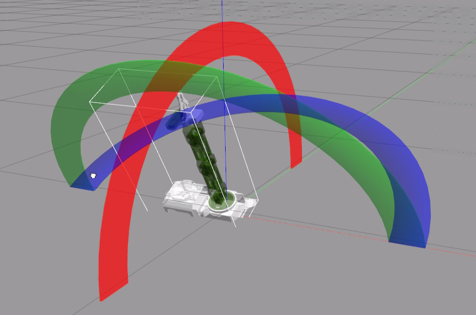

# 7. ROS1-Robot Arm URDF Modeling & Simulation

## 7.1 URDF Model 

### 7.1.1 URDF Model Introduction

The Unified Robot Description Format (URDF) is an XML file format widely used in ROS (Robot Operating System) to comprehensively describe all components of a robot.

Robots are typically composed of multiple links and joints. A link is defined as a rigid object with certain physical properties, while a joint connects two links and constrains their relative motion.

By connecting links with joints and imposing motion restrictions, a kinematic model is formed. The URDF file specifies the relationships between joints and links, their inertial properties, geometric characteristics, and collision models.

* **Comparison between Xacro and URDF Model**

The URDF model serves as a description file for simple robot models, offering a clear and easily understandable structure. However, when it comes to describing complex robot structures, using URDF alone can result in lengthy and unclear descriptions.

To address this limitation, the xacro model extends the capabilities of URDF while maintaining its core features. The xacro format provides a more advanced approach to describe robot structures. It greatly improves code reusability and helps avoid excessive description length.

For instance, when describing the two legs of a humanoid robot, the URDF model would require separate descriptions for each leg. On the other hand, the xacro model allows for describing a single leg and reusing that description for the other leg, resulting in a more concise and efficient representation.

* **XML Basic Syntax**

The URDF model is written using XML standard.

**Elements**:

An element can be defined as desired using the following formula:

**\<element\>**

**\</element\>**

**Properties**:

Properties are included within elements to define characteristics and parameters. Please refer to the following formula to define an element with properties:

**\<element**

**property_1="property value1"**

**property_2="property value2"\>**

**\</element\>**

**Comments**:

Comments have no impact on the definition of other properties and elements. Please use the following formula to define a comment:

\<!-- comment content --\>

*  **Link**

The Link element describes the visual and physical properties of the robot's rigid component. The following tags are commonly used to define the motion of a link:


\<visual\>: Describe the appearance of the link, such as size, color and shape.

\<inertial\>: Describe the inertia parameters of the link, which will used in dynamics calculation.

\<collision\>: Describe the collision inertia property of the link

Each tag contains the corresponding child tag. The functions of the tags are listed below.

| **Tag** | **Function** |
|:--:|:--:|
| origin | Describe the pose of the link. It contains two parameters, including xyz and rpy. Xyz describes the pose of the link in the simulated map. Rpy describes the pose of the link in the simulated map. |
| mess | Describe the mess of the link |
| inertia | Describe the inertia of the link. As the inertia matrix is symmetrical, these six parameters need to be input, ixx, ixy, ixz, iyy, iyz and izz, as properties. These parameters can be calculated. |
| geometry | Describe the shape of the link. It uses mesh parameter to load texture file, and em\[ploys filename parameters to load the path for texture file. It has three child tags, namely box, cylinder and sphere. |
| material | Describe the material of the link. The parameter name is the required filed. The tag color can be used to change the color and transparency of the link. |

* **Joint**

The "**Joint**" tag describes the kinematic and dynamic properties of the robot's joints, including the joint's range of motion, target positions, and speed limitations. In terms of motion style, joints can be categorized into six types.


The following tags will be used to write joint motion.


\<parent_link\>: Parent link

\<child_link\>: Child link

\<calibration\>: Calibrate the joint angle

\<dynamics\>: Describes some physical properties of motion

\<limit\>: Describes some limitations of the motion

The function of each tag is listed below. Each tag involves one or several child tags.

| **Tag** | **Function** |
|:--:|:--:|
| origin | Describe the pose of the parent link. It involves two parameters, including xyz and rpy. Both xyz and rpy describe the pose of the link in simulated map. |
| axis | Control the child link to rotate around any axis of the parent link. |
| limit | The motion of the child link is constrained using the lower and upper properties, which define the limits of rotation for the child link. The effort properties restrict the allowable force range applied during rotation (values: positive and negative; units: N). The velocity properties confine the rotational speed, measured in meters per second (m/s). |
| mimic | Describe the relationship between joints. |
| safety_controller | Describes the parameters of the safety controller used for protecting the joint motion of the robot. |

* **Robot Tag**

The complete top tags of a robot, including the \<link\> and \<joint\> tags, must be enclosed within the \<robot\> tag. The format is as follows:


* **gazebo Tag**

This tag is used in conjunction with the Gazebo simulator. Within this tag, you can define simulation parameters and import Gazebo plugins, as well as specify Gazebo's physical properties, and more.


* **Write Simple URDF Model**

(1) Name the model of the robot

To start writing the URDF model, we need to set the name of the robot following this format: “**\<robot name=“robot model name”\>**”. Lastly, input “**\</robot\>**” at the end to represent that the model is written successfully.


(2) Set links

① To write the first link and use indentation to indicate that it is part of the currently set model. Set the name of the link using the following format: **\<link name="link name"\>**. Finally, conclude with "**\</link\>**" to indicate the successful completion of the link definition.


② Write the link description and use indentation to indicate that it is part of the currently set link, and conclude with "\</visual\>".


③ The "**\<geometry\>**" tag is employed to define the shape of a link. Once the description is complete, include "**\</geometry\>**". Within the "**\<geometry\>**" tag, indentation is used to specify the detailed description of the link's shape. The following example demonstrates a link with a cylindrical shape: "**\<cylinder length="0.01" radius="0.2"/\>**". In this instance, "**length="0.01"**" signifies a length of 0.01 meters for the link, while "**radius="0.2"**" denotes a radius of 0.2 meters, resulting in a cylindrical shape.


④ The "**\<origin\>**" tag is utilized to specify the position of a link, with indentation used to indicate the detailed description of the link's position. The following example demonstrates the position of a link: "**\<origin rpy="0 0 0" xyz="0 0 0" /\>**". In this example, "**rpy**" represents the roll, pitch, and yaw angles of the link, while "**xyz**" represents the coordinates of the link's position. This particular example indicates that the link is positioned at the origin of the coordinate system.


⑤ The "**\<material\>**" tag is used to define the visual appearance of a link, with indentation used to specify the detailed description of the link's color. To start describing the color, include "**\<material\>**", and end with "**\</material\>**" when the description is complete. The following example demonstrates setting a link color to yellow: "**\<color rgba="1 1 0 1" /\>**". In this example, "**rgba="1 1 0 1"**" represents the color threshold for achieving a yellow color.


(3) Set joint

① To write the first joint, use indentation to indicate that the joint belongs to the current model being set. Then, specify the name and type of the joint as follows: "**\<joint name="joint name" type="joint type"\>**". Finally, include "**\</joint\>**" to indicate the completion of the joint definition.

**Note: to learn about the type of the joint, please refer to “4.2 joint”.**


② Write the description section for the connection between the link and the joint. Use indentation to indicate that it is part of the currently defined joint. The parent parameter and child parameter should be set using the following format: "**\<parent link="parent link"/\>**", and "**\<child link="child link" /\>**". With the parent link serving as the pivot, the joint rotates the child link.


③ “**\<origin\>**” describes the position of the joint using indention. This example describes the position of the joint: “**\<origin xyz=“0 0 0.1” /\>**”. xyz is the coordinate of the joint.


④ “**\<axis\>**” describes the position of the joint adopting indention. “**\<axis xyz=“0 0 1” /\>**” describes one posture of a joint. xyz specifies the pose of the joint.


⑤ “**\<limit\>**” imposes restrictions on the joint using indention. The below picture The "**\<limit\>**" tag is used to restrict the motion of a joint, with indentation indicating the specific description of the joint angle limitations. The following example describes a joint with a maximum force limit of 300 Newtons, an upper limit of 3.14 radians, and a lower limit of -3.14 radians. The settings are defined as follows: "**effort=“joint force (N)”, velocity=“joint motion speed”, lower=“lower limit in radians”, upper=“upper limit in radians**”.


⑥ “**\<dynamics\>**” describes the dynamics of the joint using indention. “**\<dynamics damping=“50” friction=“1” /\>**” describes dynamics parameters of a joint.


The complete codes are as below.


### 7.1.2 URDF Model Visualization

To visualize a URDF robot model, RVIZ can be utilized.

(1) Double-click  to initiate the command-line terminal, and run the command below to terminate the auto-start service.

```
sudo systemctl stop jetarm_bringup.service
```

(2) Open a command-line terminal, and run the following command to open RVIZ to view the model.

```
roslaunch jetarm_6dof_description jetarm_rviz_view.launch
```

(3) If the robot arm appears upon entering the interface, it indicates successful RVIZ initialization. The robot arm is in its initial pose, and you can adjust the viewing angle using the mouse. The table below outlines the functions of each section in the software.

:::{Note}

Press and hold the left mouse button while dragging to rotate the viewpoint. Adjust the viewpoint size by scrolling the mouse wheel or holding down the right mouse button while dragging. Pressing the mouse wheel enables you to pan the viewpoint.

:::


| **NO.** | **Function** |
|----|----|
| ①Menu | Provide the most commonly used options for interacting with the simulation model. |
| ②Display panel | Configure and revise parameters, and change the interaction functions |
| ③Visualization are | Adjust viewpoint and scale |
| ④Simulation screen | Display the simulation model |

(4) If you wish to view the robot links individually, you can uncheck the "**RobotModel**" option in the **"② Display Panel."** This way, you can disable the robot model and focus solely on examining the connections between the links and joints.


(5) If you want to check a specific link, you can check related link option.


(6) If you wish to observe the individual movement of each servo in the robotic arm to assess its effects, you can open the servo adjustment tool and adjust the sliders accordingly. Joint 1 to Joint 5 correspond, from bottom to top, to the servos controlling the pan-tilt to the one controlling the rotation of the gripper. The "r_joint" corresponds to the servo motor controlling the opening and closing of the gripper.

In addition, you will find options such as "Randomize," "Center," and the number "6." The "Randomize" button displays a random position for the robotic arm model. "Center" positions the robotic arm to the center. The "6" represents the font size adjustment tool, allowing users to modify it according to their preferences.


(7) Click-on ‘**Randomize**’ to control the robot arm model to move to a random position. The real robot arm will move accordingly, and the values on the software will change.


(8) If you need to close the simulation software, return to the terminal and press ‘**Ctrl+C**’ to terminate the simulation.

(9) After experiencing the above function, you need enter the following command in  to enable the auto-start service.

```
sudo systemctl start jetarm_bringup.service
```

### 7.1.3 JetArm Model Introduction

(1) Open the RVIZ tool according to the instructions provide in the section [7.1.2 URDF Model Visualization]().

(2) Open a new terminal, and execute the following command to navigate to the file folder containing the URDF models.

```
roscd jetarm_6dof_description/urdf
```

(3) Run the command to open the model file.

```
vim jetarm_6dof_description.urdf.xacro
```

* **Basic Model of the Main Body (base_link)**

Defined the link "base_link" and then specified it as a rectangle using the previously defined parameters. Described the link "base_link" (keyword "visual") and defined its properties internally: positioned at the origin (keyword "origin"), introduced relevant dynamic configuration files (keyword "geometry"), and defined the colors as green, black, and white (keyword "material").


Define collision (keyword "collision"), collision position (keyword "origin"), and collision geometry (keyword "geometry").


Define inertia matrix (keyword "inertial"), link pose (keyword "origin"), mass (keyword "mass"), and link inertia (keyword "inertia").


* **Robot Arm Servo Model (link1~link5)**

The robotic arm is equipped with a total of six servos. Servos 1 through 5 correspond to the pan-tilt and the servo controlling the gripper, denoted as link1 through link5. In this context, we will use link1 as an illustrative example.

We defined the link "**link1**" and specified it as a rectangle using the previously defined parameters. For link "**link1**" (keyword "**visual**"), we internally described its properties: positioned at the origin (keyword "**origin**"), introduced relevant dynamic configuration files (keyword "**geometry**"), and defined the colors as green, black, and white (keyword "**material**").


Define collision (keyword "collision"), collision position (keyword "origin"), and collision geometry (keyword "geometry").


Define inertia matrix (keyword "inertial"), link pose (keyword "origin"), mass (keyword "mass"), and link inertia (keyword "inertia").


* **Gripper Model (gripper_servo_link)**

Define the description of the link "**gripper_servo_link**" (keyword "**visual**") and internally specify: positioned at the origin (keyword "**origin**"), introduce relevant dynamic configuration files (keyword "**geometry**"), and define the colors as green, black, and white (keyword "**material**").


Define collision (keyword "collision"), collision position (keyword "origin"), and collision geometry (keyword "geometry").


Define inertia matrix (keyword "inertial"), link pose (keyword "origin"), mass (keyword "mass"), and link inertia (keyword "inertia").


##  7.2 The Usage of MoveIt

### 7.2.1 Introduction to MoveIt

MoveIt is a comprehensive collection of motion operation packages within ROS, featuring capabilities such as motion planning, operation control, 3D perception, kinematics, and collision detection. It represents the most advanced software for mobile operations available today.

MoveIt provides a user-friendly platform for developing sophisticated robotic applications, evaluating new robot designs, and integrating robotic products. Its widespread adoption across industrial, commercial, research, and other sectors has made it the most commonly used open-source motion planning software.

In addition, MoveIt offers a variety of mature plugins and tools that facilitate rapid configuration of robotic arm control. It also includes a robust set of APIs, allowing for secondary development on the MoveIt module, which empowers users to create innovative applications.

### 7.2.2 MoveIt Configuration

* **Configuration Steps**

:::{Note}

The input command should be case sensitive, and the keywords can be complemented using Tab key.

:::

(1) Start the robot, and access the robot system desktop using the remote control software.

(2) Double-click  to open the command-line terminal and execute the following command to terminate the auto-start service.

```
~/.stop_ros.sh
```

(3) Execute the command to initiate MoveIt setup assistant.

```
roslaunch jetarm_6dof_moveit_config setup_assistant.launch
```

(4) Click “**Edit Existing MoveIt Configuration Package**” to edit the existed configuration pack.


(5) Click “**home/jetarm/src/jetarm_6dof_simulations//jetarm_6dof_moveit_config**” as pictured.


(6) Click “**Load Files**” and wait for the file to finish loading.


When it is loaded to 100%, the robot model will appear, which means that the file is loaded successfully.


(7) Configure the contents of **“Virtual joints”** and **“Robot pose”** at left side.


:::{Note}

Reconfiguring will overwrite previous settings. If errors occur during the process, it may result in the functionality not working properly.

:::

* **Configuration Introduction**

(1) Self-Collisions

Generate a custom collision matrix. The default collision matrix generator scans all joints of the robot. This collision matrix can be safely disabled to reduce the processing time for motion planning.

Sampling density refers to how many random joints are extracted to check for collisions. Higher density requires more computation time, with the default value set at 10,000 collision checks.


(2) Planning Groups

Add joint combinations, primarily used to describe the various joint components required to compose the robot.


(3) Robot Poses

Define the robot’s pose, pose name and the joints will be used to form this pose.


(4) Passive Joints

Specify the joints that are excluded from use, those that are available for use, and those that are not permissible for use.


(5) ROS Control

In this context, we can use the ROS Control panel to add a simulation controller to the joints, enabling the simulation of robotic arm movements through MoveIt.


(6) Simulation

Set up the Gazebo simulation and configure it by specifying the necessary URDF file for the simulation.


(7) Author Information

Add author information.


(8) Configuration Files

Create configuration files and indicate the preferred directory for the generated configuration package. Subsequently, click on 'Generate Package' to generate the configuration package.


### 7.2.3 MoveIt Operations

* **Considerations and Control for MoveIt**

(1) Restart the robot, and access the robot system desktop using the remote control software. Then open the command-line terminal.

(2) Double-click to initiate the command-line terminal. Execute the command below, and hit Enter to terminate the auto-start service.

```
~/.stop_ros.sh
```

(3) Execute the following command to initiate the robot arm simulation configuration.

```
roslaunch jetarm_bringup base.launch use_sim:=true
```

(4) Open a new command-line terminal . Run the command to launch MoveIt tool.

```
roslaunch jetarm_6dof_moveit_config demo.launch
```

(5) The software interface is as below:

① : RVIZ tool bar;

② : Movelt debugging area;

③ : Simulation model adjustment area


(6) In the simulation model adjustment area, there are arrows in red, green, and blue colors. By clicking and dragging the arrows, you can adjust the pose of the robotic arm. From the robot's first-person perspective, the blue arrow represents the X-axis, with the positive direction facing the front of the robot; the green arrow represents the Y-axis, with the positive direction facing the left side of the robot; and the red arrow represents the Z-axis, with the positive direction pointing upwards from the robot.


(7) You can change the position of the simulation model by dragging the three-axis arrows on the model. After the robotic arm's motion path has been successfully planned, the new position will be indicated in orange. If the new position results in a collision with other parts of the robot, it will be marked in red. In this case, you need to adjust the position to avoid collisions; otherwise, the action cannot be executed.


(8) In addition to adjusting the model's position using the arrows, you can also click the triangular arrows in the MoveIt debugging area. By locating the "**Joint**" panel, you can adjust the sliders to make modifications.


(9) In addition to adjusting the model's position using the arrows, you can also click the triangular arrows in the **MoveIt** debugging area. By locating the "**Joint**" panel, you can adjust the sliders to make modifications.


(10) After completing the game experience, you must start the app service. If the service is not started, it will affect the functionality of subsequent APP features. To start the app service , enter the command in the terminal interface and press Enter.

```
sudo systemctl start jetarm_bringup.service
```

* **Random Movement with MoveIt**

(1) Start the robot and access the robot system desktop using the NoMachine.

(2) Double-click  to open the command-line terminal, and execute the command to disable the auto-start service.

```
~/.stop_ros.sh
```

(3) Run the command to initiate the robot arm simulation configuration.

```
roslaunch jetarm_bringup base.launch use_sim:=true
```

(4) Open a new command-line terminal , and run the following command to launch MoveIt tool.

```
roslaunch jetarm_6dof_moveit_config demo.launch
```

(5) The software interface is as below:

① : RVIZ tool bar;

② : Movelt debugging area;

③ : Simulation model adjustment area


(6) In the MoveIt debugging area, locate the **"Planning"** section, which contains a **"Query"** category. Click on the drop-down menu for **"Planning Group"** and select the joint group (servo group) you wish to control. For this example, the default selection is the **"arm"** group.


(7) Click on the drop-down menu for `Goal State`; the parameter list is shown below:


The meanings of the specific parameters are as follows:

The first parameter, `random valid`, represents a valid random position that does not result in a collision.

The second parameter, `random` ,indicates a random position that may result in a collision.

The third parameter, `current`, refers to the current position.

The fourth parameter, `same as start` ,denotes the same position as the starting point.

The fifth parameter, `previous`, indicates the last target position.

(6) To avoid selecting a position that results in a collision, we choose "**random valid**" to randomly generate a target position. Each selection will generate a new target position, which will be displayed using the simulation model.


(7) Click on "**Plan**" to demonstrate the newly planned movement path of the simulation model.

:::{Note}

In terms of actual performance, the software may run a bit slower, which is normal!

:::


(8) After completing the game experience, you need to start the app service (if not started, it will affect the use of subsequent app features). Enter the command in the terminal interface and press Enter to initiate the app service.

```
sudo systemctl start jetarm_bringup.service
```

* **MoveIt Kinematics Design**

(1) Kinematics Introduction

Kinematics, as a branch of mechanics focused on geometric aspects (excluding the physical properties of objects and forces applied to them), explores and describes the principles governing changes in the position of objects over time. In the context of robotics, two distinct methods—forward kinematics and inverse kinematics—address the dynamics of motion.

Forward kinematics entails determining the position and orientation of the end effector based on the values of joint variables. In simpler terms, it calculates the final position and orientation of the robot by considering the angles of rotation of its servos.

Conversely, inverse kinematics involves determining the values of robot joint variables given the position and orientation of the end effector. It requires calculating the angles of rotation that the servos must achieve based on the final position and orientation of the robot.

(2) DH Parameter Introduction

Denavit-Hartenberg (DH) parameters form a mathematical model used to describe the spatial relationships and coordinate system determination between two pairs of joint linkages in a robotic system. The four DH parameters chosen each possess clearly defined physical meanings, as elaborated below:

① link length : The length of the common normal between the axes of the two joints (Rotation axis of rotation joint, translation axis of translation joint)

② link twist: The angle at which the axis of one joint rotates around their common normal relative to the axis of the other joint

③ link offset: The common normal of one joint and the next joint and the distance between the common normal of one joint and the previous joint along this joint axis

④ joint angle: The common normal of one joint and the next joint and the angle of rotation around the joint axis with the common normal of the previous joint

The above definition is very complicated, but it will be much clearer when combined with the coordinate system.

First of all you should pay attention to the two most important "lines": the joint axis, and the common normal between the axis joint and the adjacent joint.

In the DH parameter system, we set axis as the z axis; common normal as the x axis, and the direction of the x axis is: from this joint to the next joint.

Of course, these two rules alone are not enough to completely determine the coordinate system of each joint. Let's talk about the steps to determine the coordinate system in detail below.

In applications such as the simulation of the robotic arm, we often adopt other methods to establish the coordinate system, but mastering the methods mentioned here is necessary for you to understand the mathematical expression of the robotic arm and understand our subsequent analysis.

The figure below shows two typical robot joints. Although such joints and links are not necessarily similar to the joints and links of any actual robot, they are very common and can easily represent any joint of the actual robot.


(3) Determine the Coordinate System

To determine the coordinate system, there are generally the following steps:

In order to model the robot with DH notation, the first thing is to specify a local ground reference coordinate system for each joint, so a Z axis and an X axis must be specified for each joint.

Specify the Z axis. If the joint is rotating, the Z axis is in the direction of rotation according to the right-hand rule. The rotation angle around the Z axis is a variable of the joint; if the joint is a sliding joint, the Z axis is the direction of movement along a straight line. The link length d along the Z axis is the joint variable.

Specify the X axis.When the two joints are not parallel or intersect, the Z axis is usually a diagonal line, but there is always a common vertical line with the shortest distance, which is orthogonal to any two diagonal lines. Define the X axis of the local reference coordinate system in the direction of the common perpendicular. If an represents the common perpendicular between Zn1, the direction of Xn will be along an.

Of course there are special circumstances. When the Z axes of the two joints are parallel, there will be countless common perpendiculars. At this time, you can select the one that is collinear with the common perpendicular of the previous joint, which can simplify the model; if two joints intersect, there is no common perpendicular between them. In this case, the line perpendicular to the plane formed by the two axes can be defined as X Shaft can simplify the model.

After attaching the corresponding coordinate system to each joint, as shown in the following figure:


After determining the coordinate system, we can express the above four parameters in a more concise way:

link length i 1: the distance from Zi1 to Zi along Xi1

link twist i1 : Zi the angle of Zi relative to Zi1 to rotate around Xi1

link offset i d :the distance from Xi1 to Xi1 along Zi

joint angle i : Xi relative to Xi1 around Zi

Next we can write the DH parameter table of the robotic arm:

Inverse Kinematic Analysis

For the robot arm, the position and orientation of the gripper are given to obtain the rotation angle of each joint. The three-dimensional motion of the robotic arm is more complicated. In order to simplify the model, we remove the rotation joint of the station so that the kinematics analysis can be performed on a two-dimensional plane.

Inverse kinematics analysis generally requires a large number of matrix operations, and the process is complex and computationally expensive, so it is difficult to implement. In order to better meet our needs, we use geometric methods to analyze the robotic arm.


We simplify the model of the robotic arm, remove the base pan/tilt, and the actuator part to get the main body of the robotic arm. From the figure above, you can see the coordinates (x, y) of the end point P of the robotic arm, which ultimately consists of three parts (x1+x2+x3, y1+y2+y3).

Among them θ1, θ2,θ3 in the above figure are the angles of the servo that we need to solve, and α is the angle between the paw and the horizontal plane. From the figure, it is obvious that the top angle of the claw α=θ1+θ2+θ3, based on which we can formulate the following formula:


Among them, x and y are given by the user, and l1, l2, and l3 are the inherent properties of the mechanical structure of the robotic arm.

In order to facilitate the calculation, we will deal with the known part and consider the whole:


Substituting m and n into the existing equation, and then simplifying can get:


Through calculation:


We see that the above formula is the root-finding formula of a quadratic equation in one variable:


Based on this, we can find the angle of θ1, and similarly we can also find θ2. From this we can obtain the angles of the three steering gears, and then control the steering gears according to the angles to realize the control of the coordinate position.

* **MoveIt Cartesian Path**

(1) Cartesian Coordinate System

The Cartesian coordinate system is a collective term for rectangular and oblique coordinate systems. The two coordinate axes intersecting at the origin form a plane affine coordinate system. If the units of measurement on both axes are equal, this affine coordinate system is called a Cartesian coordinate system. A Cartesian coordinate system in which the two axes are perpendicular is known as a Cartesian rectangular coordinate system; otherwise, it is referred to as a Cartesian oblique coordinate system.

When describing spatial positions, velocities, and accelerations, Cartesian coordinate systems are predominantly employed. When indicating a rotation around a specific axis, the determination of the positive direction follows the right-hand rule, as illustrated in the diagram below:


(2) Cartesian Path Planning

Cartesian path planning can be divided into two types, namely point-to-pint path planning and continuous path planning. It is a computation process where robot joint motion trajectory is computed with kinematic according to the given robot target point or path, so as to track the desired path.

(3) MoveIt Cartesian Path Analysis

Each axis of robot can be controlled through joint space which is comprised of joint vectors. Each axis moves by interpolation, and they don’t care how other axis move. The motion trajectory of robot axis end between two points is random curve.

In some special cases, the motion trajectory of robotic arm end is required to be straight line or arc. Therefore, Cartesian path planing is used to restrict the shape of motion trajectory.

:::{Note}

Place the robot in a wide area to ensure enough motion space. Keep a certain distance from the robot to avoid hurt when robot is working. Bend the antenna slightly backward to avoid robotic arm from hitting the antenna.

:::

(4) Enable & Disable MoveIt Cartesian Path

① Start the robot, and access the robot system desktop using the remote control software. Then open the command line terminal.

② Run the command below, and hit Enter to disable the auto-start service.

```
~/.stop_ros.sh
```

③ Enter the command to start the robotic arm simulation configuration.

```
roslaunch jetarm_bringup base.launch use_sim:=true
```

④ Open a new command-line terminal , and run the following command to initiate the MoveIt tool.

```
roslaunch jetarm_6dof_moveit_config demo.launch
```

⑤ The software interface is as below:

1.  : RVIZ tool bar;

2.  : Movelt debugging area;

3.  : Simulation model adjustment area

    

(6) Navigate to the ‘**Planning**’ section, and check ‘**Use Cartesian Path**’ to enable Cartesian Path Planning**.**


(7) Subsequently, manipulate the arrows within the simulation model area to chart the path for the robot arm. Upon completing the path planning, click on the '**Plan**' icon, prompting the model to execute the specified action. The model will maneuver the end effector linearly in Cartesian space. In case the execution encounters constraints related to Cartesian path limitations, the motion may result in failure.

(8) After completing the game experience, you need to start the app service  (if not started, it will affect the use of subsequent app features). Enter the command in the terminal interface and press Enter to initiate the APP service.

```
sudo systemctl start start_app_node.service
```

* **MoveIt Collision Detection**

(1) Collision Detection Introduction

Collision detection in MoveIt2 is configured by CollisionWorld object in planning scene. Collision detection is mainly executed by FCL software pack which is a major CC library for MoveIt2.

(2) Collision Object

MoveIt2 welcomes different types of objects to detect collision, including:

① Meshes

② Basic shape: box, cylinder, cone, sphere and plane.

③ Octomap—can be directly used in collision detection

(3) Allowed Collision Matrix（ACM）

Allowed Collision Matrix (ACM) will encode a binary value to sign whether to detect collision between objects.

If values of these two objects are set as 1, collision detection will not be executed, otherwise collision detection will continue as schedule.

(3) Enable & Disable Collision Detection

① Start the robot, and access the robot system desktop using the remote control software. Then open the command line terminal.

② Double-click  to open the command-line terminal. Execute the following command to disable auto-start service.

```
~/.stop_ros.sh
```

③ Enter the command to initiate the robotic arm simulation configuration.

```
roslaunch jetarm_bringup base.launch use_sim:=true
```

④ Open a new command-line terminal and run the following command to initiate the MoveIt tool.

```
roslaunch jetarm_6dof_moveit_config demo.launch
```

⑤ The software interface is as below:

1.  : RVIZ tool bar;

2.  : Movelt debugging area;

3.  : Simulation model adjustment area

    

⑥ Having planned the path by manipulating the arrows in the model simulation area, navigate to the "**Scene Objects**" section. Under the "**Box**" option, select the collision model of your choice from the dropdown list. As an illustration, we will use the "**Sphere**" here.


⑦ Click-on ‘**+**’ to add the current model, and the model will be added to the bottom of the robot by default.


⑧ Adjust the size of the collision model by dragging the slider in the illustration below. It is advisable to reduce it to approximately 50% of the original size.


⑨ Drag the three-dimensional arrows of the sphere to move the collision model between the starting and target positions for convenient testing of collision detection effects.


⑩ Navigate to the '**Planning**' section and check '**Collision-aware IK**' to activate model collision detection. Then, click the '**Plan**' button to initiate the movement of the robot arm along the specified path. If you encounter the following prompt, select '**Yes**.'


⑪ The robotic arm will plan its movement path, avoiding models along the way to prevent collisions.

⑫ After completing the game experience, you must start the app service  (if not started, it will affect the functionality of subsequent app features). In the terminal interface, enter the command and press Enter to launch the app service.

```
sudo systemctl start start_app_node.service
```

* **MoveIt Scenario Design**

(1) Rviz Plugin Introduction

Rviz is a three-dimensional visualization platform within the ROS system and serves as one of MoveIt's plugins. This plugin facilitates graphical representation of external information and facilitates the publication of control information to monitored objects.

Using MoveIt's Rviz plugin, users can set up a virtual environment (scene), interactively define the initial and target states of the robot, experiment with diverse motion planning algorithms, and visualize the results.

(2) Enable & Disable MoveIt Scenario Design

① Start the robot, and access the robot system desktop using the remote control software. Then open the command line terminal.

② Run the command, and hit Enter to disable the auto-start service.

```
~/.stop_ros.sh
```

③ Run the following command to initiate the robot arm simulation configuration.

```
roslaunch jetarm_bringup base.launch use_sim:=true
```

④ Open a new command-line terminal . Execute the command to launch MoveIt.

```
roslaunch jetarm_6dof_moveit_config demo.launch
```

⑤ The software interface is as below:

1.  : RVIZ tool bar;

2.  : Movelt debugging area;

3.  : Simulation model adjustment area;

    

⑥ Navigate to the '**Scene Objects**' section in the debugging area to add a scene object model. This panel is divided into four sections as follows:


⑦ Add basic model, for example Box.


⑧ Adjust the size of object model in meter.


⑨ After adjustment, click **“+”** to add the selected object model to the scene.


⑩ The model list will be updated after you add the model, and the model is generated at the center of the scene i.e. center of robot. Drag arrows to adjust robotic arm pose.


**“Position**” is to adjust position of object. The boxes from left to right are used to adjust X, Y and Z axis.

“**Rotation**” is to adjust object angle. The boxes from left to right are used to adjust X, Y and Z axis. “**Scale**” is to adjust object size.

Click “**Publish**” after adjustment to publish topic of this model. Movelt will subscribe to this topic automatically.


⑪ To protect object model from collision, tick “**Collision-aware IK**” to start model collision detection.


⑫ Execute the command ‘**sudo systemctl restart jetarm_bringup.service**’ to restart the service. If you need to input the password, you need to enter the password ‘hiwonder’. After completing the game experience, you must start the app service (if not started, it will affect the functionality of subsequent app features). In the terminal interface, enter the command and press Enter to launch the app service.

```
sudo systemctl start start_app_node.service
```

* **MoveIt Trajectory Planning**

(1) Motion Planner Introduction

**Open Motion Planner Library (OMPL)**

OMPL is an open robotic motion planner library based on sampling method. Most of algorithms in this library derive from RRT and RPM, for example RRTStar and RRT-Connect.

By virtue of modular design, front-end GUI support and stable update, OMPL is the most mainstream motion planner software. It is default motion planner software of ROS.

A planner that is based on sampling need not take into account dimension of the planning object. That is to say no dimensional explosion will happen. A key reason why it can be used to control robotic arm is that it can effectively tackle path planning problems in high-dimensional space and complex constraints.

For motion planning of N DOF robotic arm, OMPL can plan a trajectory for end effector in robotic arm joint space and create M arrays (trajectory is composed of M control points). Dimension of each array is N (joint sequence of each control point). It can ensure robotic arm will not collide with surrounding obstacles when executing this trajectory.

**Industrial Motion Planner (Pilz)**

Pilz industrial motion planner is a deterministic generator for circular and linear motions. In addition, it also supports integrating multiple motion segments with MoveIt2.

**Stochastic Trajectory Optimization for Motion Planning（STOMP）**

STOMP is a motion planner based on optimization and PI^2 algorithm. This planner can plan smooth trajectories, avoid obstacles and optimize constraints for the robotic arm. Arbitrary terms in the cost function can be optimized since algorithm does not require gradients.

**Search-based Planning Library (SBPL)**

It is a generic set of motion planners using search-based planning to discrete space.

**Covariant Hamiltonian Optimization for Motion Planning（CHOMP）**

CHOMP is an innovative trajectory optimization based on gradient that makes ordinary motion planning simpler and more trainable.

Most high-dimensional motion planners divide the generating process of trajectory into two stages, including planning and optimization. At the stage of optimization, this algorithm employs covariant and functional gradients to design motion planning algorithm that is totally based on trajectory optimization.

Given a infeasible initial trajectory, CHOMP will make quick response to the surroundings so as to make trajectory collision-free, while optimize joint speed and acceleration.

(2) Enable & Disable Path Planning

① Start the robot, and access to the robot system desktop using the remote desktop software. Then open the command line terminal.

② Double-click  to execute the command, and hit Enter to terminate the auto-start service.

```
~/.stop_ros.sh
```

③ Enter the command to initiate the robotic arm simulation configuration.

```
roslaunch jetarm_bringup base.launch use_sim:=true
```

④ Open a new command-line terminal , and run the command to launch the MoveIt tool.

```
roslaunch jetarm_6dof_moveit_config demo.launch
```

⑤ The software interface is as below:

1.  : RVIZ tool bar;

2.  : Movelt debugging area;

3.  : Simulation model adjustment area;

    

⑥ Navigate to the 'Joint' panel, where you can fine-tune each joint of the robot arm model.

After planning the motion path for the robot arm, the new location will be highlighted in orange. If a collision occurs when the robot arm moves to the new position, it will be marked in red. In such cases, adjustments are necessary until there is no collision. Failure to resolve collisions may prevent the robot arm from successfully planning this path.


⑦ Locate RVIZ tool bar, and click-on ‘**Motion Planning**’ and ‘**Planned Path**’ in sequence, then tick ‘**Show Trail**’.


⑧ Switch to the '**Planning**' panel and click on the '**Plan**' button. The model will illustrate the motion path from the initial position to the newly planned trajectory.


⑨ After the demonstration concludes, you can uncheck '**ShowTrail**' and then click on the '**Execute**' button. The simulated model will simultaneously plan the path and execute the corresponding action.

⑩ After completing the game experience, you must start the app service (if not started, it will affect the functionality of subsequent app features). In the terminal interface, enter the command and press Enter to launch the app service.

```
sudo systemctl start start_app_node.service
```

### 7.2.4 Drive Real Robot Arm Using MoveIt

Before initiating the robot, ensure it has sufficient space for motion, and maintain a safe distance to prevent injury. Utilize MoveIt to control both the simulated and actual robot arm for movement.

(1) Start the robot, and access to the robot system desktop using the remote desktop software. Then open the command line terminal.

(2) Double-click  to execute the command to terminate the auto-start service.

```
~/.stop_ros.sh
```

(3) Run the following command to initiate the basic service.

```
roslaunch jetarm_bringup base.launch
```

(4) Input the command ‘**roslaunch jetarm_6dof_moveit_config demo.launch**’ to launch MoveIt tool. Open a new command-line terminal.

```
roslaunch jetarm_6dof_moveit_config demo.launch
```

(5) The software interface is as below:

1.  : RVIZ tool bar;

2.  : Movelt debugging area;

3.  : Simulation model adjustment area;

    

(6) In the simulation model adjustment area, manipulate the arrows to modify the pose of the robot arm. Visualize the robot from a first-person perspective, where the blue arrow signifies the X-axis with the positive direction aligned with the robot's front. The green arrow corresponds to the Y-axis, with the positive direction indicating the left side of the robot. The red arrow represents the Z-axis, and its positive direction points upward, denoting the top of the robot.


(7) Adjust the robotic arm model according to your needs, but make sure to ensure that the position of the robotic arm does not collide with itself (i.e., the body is displayed in red).

(8) After completing the path planning, go to the "**Planning**" section in the MoveIt debugging area. Click on the "**Plan & Execute**" option, and the simulation model will demonstrate the movement path from the original position to the newly planned position, while the robotic arm will execute the same actions.


(9) After completing the game experience, you must start the app service (if not started, it will affect the functionality of subsequent app features). In the terminal interface, enter the command and press Enter to launch the app service.

```
sudo systemctl start start_app_node.service
```

##  7.3 Gazebo Simulation

### 7.3.1 Gazebo Introduction

Simulation software allows for the creation of a realistic virtual physical environment in which robots can be tested and experimented with to observe how they complete tasks. Gazebo is the most widely utilized robot simulation software in ROS (Robot Operating System). Gazebo excels at providing high-fidelity physical simulation conditions and offers an extensive array of sensor models. Moreover, it facilitates seamless interaction between the simulation environment and the robot, thereby enhancing the robot's performance in intricate settings.

Gazebo supports the use of files in urdf (Unified Robot Description Format) and sdf (Simulation Description Format) formats, which are employed for describing the simulation environment. When working with a hexapod robot, it is common to utilize a urdf model, and the official resources provide a diverse selection of pre-existing models that can be readily employed.

The interface of simulation software is as below.


The function of each section on the interface is listed below.

| Name | Function |
|:--:|:--:|
| Tool bar (1) | Provide the most commonly used options for interaction with simulator |
| Menu bar (2) | Configure or modify the parameters of the simulation software and some interactive functions |
| Action bar (3) | Make any operations on the models and modify the parameters |
| Timestamp (4) | Set the time of the virtual space |
| Scene (5) | The main part of the simulator where the simulated model is displayed |

To get more info of Gazebo, please visit Gazebo’s official website: **http://gazebosim.org/**

### 7.3.2 JetArm Gazebo Simulation

To inspect and visualize the robot model and structure, Gazebo can be utilized.

* **Enable Simulation**

:::{Note}

The input command should be case sensitive, and keywords can be complemented using Tab key.

:::

(1) Start the robot, and access the robot system desktop using the remote control software NoMachine.

(2) Double-click  to initiate the command-line terminal to disable the auto-start service.

```
~/.stop_ros.sh
```

(3) Execute the command below to open the Gazebo simulation model.

```
roslaunch jetarm_6dof_gazebo jetarm_gazebo.launch
```

When the interface mentioned below appears, it indicates that the simulation model has been successfully initiated.


(4) To terminate the running program, you can use short-cut ‘**Ctrl+C**’.

After using the previous function, it's essential to enable the app service either by using a command or restarting the robot. Failure to do so may impact the app function. Upon robot restart, the app service will be automatically enabled.

To restart the app service, execute the following command.

```
sudo systemctl start start_app_node.service
```

The function of each section on the interface is listed below.

| Name | Function |
|:--:|:--:|
| Tool bar (1) | Provide the most commonly used options for interaction with simulator |
| Menu bar (2) | Configure or modify the parameters of the simulation software and some interactive functions |
| Action bar (3) | Make any operations on the models and modify the parameters |
| Timestamp (4) | Set the time of the virtual space |
| Scene (5) | The main part of the simulator where the simulated model is displayed |

* **Short-Cut Introduction**

Here, we introduce several commonly used shortcuts and tools, taking mouse control as an example:

Regarding shortcuts, let's consider mouse control:

Left Mouse Button: In the Gazebo simulation, the left mouse button is used to drag the map and select targets. Long-pressing the left mouse button on the map allows you to drag it. Clicking on a model selects it.

Middle Mouse Button / Shift + Left Mouse Button: Pressing the middle mouse button or holding down Shift while dragging the left mouse button enables you to rotate around the current target position.

Right Mouse Button / Mouse Scroll Wheel: Holding down the right mouse button or scrolling the mouse wheel allows you to zoom in and out of the map based on the current mouse cursor position.

Regarding the toolbar tools, we will use the following three as examples for explanation.

Selection tool：Gazebo default tool. You can use it to select model.


Motion tool ：Drag the three axes to control the movement of the model.

<p style="margin:0 auto 24px;width:100%">


</p>


Rotation tool ：Drag the three axes to control the rotation of the model.

<p style="margin:0 auto 24px;width:100%">


</p>

To get more info of Gazebo, please visit Gazebo’s official website: http://gazebosim.org/

##  7.4 FAQ

Q: Why can't the Gazebo simulation model be opened?

A: The potential reason could be that the auto-start service is still enabled, or another service is in progress. It is recommended to disable the auto-start service and any other active services. Afterward, execute the relevant command to launch the Gazebo simulation model.
