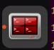

# 8. ROS1-Depth Camera Applications

## 8.1 Depth Map Pseudo-Color Processing

### 8.1.1 Program Flow

First, initialize the node and obtain the RGB image and depth map topic messages.

Next, process the image to generate the pseudo-color image.

Finally, transmit both the color image and pseudo-color image.

### 8.1.2 Operation Steps

:::{Note}

The input command should be case sensitive, and the keywords can be complemented using Tab key.

:::

(1) Double-click  to open the command line terminal, and execute the command below to terminate the auto-start service.

```
~/.stop_ros.sh
```

(2) Execute the following command and hit Enter to run the game.

```
roslaunch jetarm_6dof_rgbd_cam 1_get_depth_rgb_img.launch
```

(3) If you need to terminate the running program, use short-cut `Ctrl+C`.

(4) After completing the game experience, you must start the app service (if not started, it will affect the functionality of subsequent app features). In the terminal interface, enter the command and press Enter to launch the app service.

```
sudo systemctl start start_app_node.service
```

(5) After the service is initiated successfully, the robot will emit a beeping sound.

### 8.1.3 Program Outcome

Once the game starts, the robot arm will send the RGB color image and depth image to the terminal. The color will change corresponding to the distance indicated in the depth map.


### 8.1.4 Launch File Analysis

The Launch file is saved in [/home/ubuntu/jetarm/src/jetarm_example/src/jetarm_6dof_rgbd_cam /launch/1_get_depth_rgb_img.launch]()

Initiate `base.launch` file to invoke the robot arm basic settings.

{lineno-start=2}

```
        <include file="$(find jetarm_bringup)/launch/base.launch"/>
```

Launch the source code file `1_get_depth_rgb_img.py` using the node.

{lineno-start=4}

```
        <node name="get_depth_rgb" pkg="jetarm_6dof_rgbd_cam" type="1_get_depth_rgb_img.py" output="screen" respawn="true">
        </node>
</launch>
```

### 8.1.5 Python Source Code Analysis

The source code is saved in [/home/ubuntu/jetarm/src/jetarm_example/src/jetarm_6dof_rgbd_cam /scripts/1_get_depth_rgb_img.py]()

The program flowchart is as below:


The program primarily involves capturing the RGB image and depth image from the camera. After processing the image, the program will then transmit it to the screen.

- **Import Feature Pack**

To import the necessary modules through the import statement:

`cv2` is used for OpenCV image processing.

`rospy` is utilized for ROS communication.

`numpy` is employed for array operations.

`message_filters` is incorporated for implementing message filtering and synchronization, handling sensor data and messages in ROS.

The `Image` message type is imported and renamed as `RosImage`.

The `SetBool` service message type is imported from the `std_srvs.srv` module.

The `fps` function module is imported from the `vision_utils` module for frame rate calculation.

`queue` is used for queue-related operations in multi-threading.

The ROS message type named `MultiRawIdPosDur` is imported from `hiwonder_interfaces.msg` for defining custom ROS messages to facilitate data transmission and communication within the ROS system.

The servo control module is imported from `jetarm_sdk`.

{lineno-start=7}

```
import cv2
import rospy
import numpy as np
import message_filters
from sensor_msgs.msg import Image as RosImage
from std_srvs.srv import SetBool
from vision_utils import fps
import queue
from hiwonder_interfaces.msg import MultiRawIdPosDur
from jetarm_sdk import pid, bus_servo_control
```

- **Initiate RgbDepthImageNode Class（RGB Depth Image Class）**

Display pertinent prompts in the terminal. Initiate the `RgbDepthImageNode` class, and within the loop, call the `node.image_proc()` method until `Ctrl+C` is triggered or the ROS node is shut down. Provide log information indicating `shutdown2`.

{lineno-start=68}

```
if __name__ == "__main__":
    print('''
    *********************************************
    *                                           *
    * 此程序需要订阅深度摄像头节点,开启前请确保(The depth camera node needs to be subscribed for this program, please ensure that before starting) *
    * 已开启摄像头节点, 通过rostopic list可查看(The camera node has been started, please check via rostopic list) *
    * 是否有usb_cam相关节点,成功运行可看到终端(Whether there are usb_cam related nodes, you can see the terminal if it runs successfully)  *
    * running ...                               *
    *                                           * 
    *********************************************
    ''')

    try:
        node = RgbDepthImageNode()
        while not rospy.is_shutdown():
            node.image_proc()
    except KeyboardInterrupt:
        rospy.loginfo("shutdown2")
```

- **Initialization Function of RgbDepthImageNode Class**

{lineno-start=19}

```
class RgbDepthImageNode:
    def __init__(self):
        rospy.init_node('g1et_rgb_and_depth_image', anonymous=True)
        self.fps = fps.FPS()

        self.servos_pub = rospy.Publisher('/controllers/multi_id_pos_dur', MultiRawIdPosDur, queue_size=1)
        rospy.sleep(3)
        bus_servo_control.set_servos(self.servos_pub, 1000, ((1, 500), (2, 700), (3, 85), (4, 350), (5, 500), (10, 200)))
        rospy.sleep(2)
        
        rospy.wait_for_service('/rgbd_cam/set_ldp')
        rgb_sub = message_filters.Subscriber('/rgbd_cam/color/image_raw', RosImage, queue_size=1)
        depth_sub = message_filters.Subscriber('/rgbd_cam/depth/image_raw', RosImage, queue_size=1)
        rospy.ServiceProxy('/rgbd_cam/set_ldp', SetBool)(False)
    
        # 同步时间戳, 时间允许有误差在0.03s(synchronize timestamps, allowing for a time error of up to 0.03 seconds)
        sync = message_filters.ApproximateTimeSynchronizer([rgb_sub, depth_sub], 2, 0.02)
        sync.registerCallback(self.multi_callback) #执行反馈函数(execute feedback function)
        self.queue = queue.Queue(maxsize=1)
```

Initialize the node `g1et_rgb_and_depth_image`.

{lineno-start=19}

```
class RgbDepthImageNode:
    def __init__(self):
        rospy.init_node('g1et_rgb_and_depth_image', anonymous=True)
```

Initialize the frame rate counter.

{lineno-start=22}

```
        self.fps = fps.FPS()
```

- **Create Servo Publisher**

  The `servos_pub` creates a servo publisher, sending messages to the `/controllers/multi_id_pos_dur` topic. Here, `MultiRawIdPosDur` is the message type used to control the positions and durations of multiple servos.

  The `set_servos` function from the `bus_servo_control` module is utilized to set the initial position and duration of the servos. The parameters include the publisher instance, servo runtime (in milliseconds), and a tuple containing the IDs and rotation angles (ranging from 1-1000) of multiple servos.
  
  {lineno-start=24}
  
  ```
          self.servos_pub = rospy.Publisher('/controllers/multi_id_pos_dur', MultiRawIdPosDur, queue_size=1)
          rospy.sleep(3)
          bus_servo_control.set_servos(self.servos_pub, 1000, ((1, 500), (2, 700), (3, 85), (4, 350), (5, 500), (10, 200)))
          rospy.sleep(2)
  ```

Wait for the `/rgbd_cam/set_ldp` service to start. A service proxy is created, using the `SetBool` message type to specify the request and response types for the service. `False` is then passed to the `/rgbd_cam/set_ldp` service.

{lineno-start=29}

```
        rospy.wait_for_service('/rgbd_cam/set_ldp')
        rgb_sub = message_filters.Subscriber('/rgbd_cam/color/image_raw', RosImage, queue_size=1)
        depth_sub = message_filters.Subscriber('/rgbd_cam/depth/image_raw', RosImage, queue_size=1)
        rospy.ServiceProxy('/rgbd_cam/set_ldp', SetBool)(False)
```

- **Synchronize Timestamp**

Establish a time synchronizer to synchronize messages from the `rgb_sub` and `depth_sub` topics. The `2` signifies a maximum buffer size of 2 messages, and `0.03` implies that messages with a timestamp difference of no more than 0.03 seconds will be considered synchronized.

{lineno-start=34}

```
        # 同步时间戳, 时间允许有误差在0.03s(synchronize timestamps, allowing for a time error of up to 0.03 seconds)
        sync = message_filters.ApproximateTimeSynchronizer([rgb_sub, depth_sub], 2, 0.02)
```

Call the `multi_callback` function.

{lineno-start=36}

```
        sync.registerCallback(self.multi_callback) #执行反馈函数(execute feedback function)
```

A queue object, `self.queue`, has been created to store synchronized messages, with a maximum queue size set to 1.

{lineno-start=37}

```
        self.queue = queue.Queue(maxsize=1)
```

- **multi_callback Function**

  The `multi_callback` function receives ROS image messages, `ros_rgb_image` and `ros_depth_image`.

  It checks whether `self.queue` is empty. If the queue is empty, it places a tuple containing synchronized `ros_rgb_image` and `ros_depth_image` into the queue. This tuple represents two successfully synchronized image messages.
  
  {lineno-start=39}
  
  ```
      def multi_callback(self, ros_rgb_image, ros_depth_image):
          if self.queue.empty():
              self.queue.put_nowait((ros_rgb_image, ros_depth_image))
  ```

- **image_proc Function**

{lineno-start=43}

```
    def image_proc(self):
        ros_rgb_image, ros_depth_image = self.queue.get(block=True)
        try:
            rgb_image = np.ndarray(shape=(ros_rgb_image.height, ros_rgb_image.width, 3), dtype=np.uint8, buffer=ros_rgb_image.data)
            rgb_image = rgb_image[40:440,]
            depth_image = np.ndarray(shape=(ros_depth_image.height, ros_depth_image.width), dtype=np.uint16, buffer=ros_depth_image.data)

            h, w = depth_image.shape[:2]

            depth = np.copy(depth_image).reshape((-1, ))
            depth[depth<=0] = 0
            sim_depth_image = np.clip(depth_image, 0, 4000).astype(np.float64)
            sim_depth_image = sim_depth_image / 2000.0 * 255.0
            bgr_image = cv2.cvtColor(rgb_image, cv2.COLOR_RGB2BGR)
            depth_color_map = cv2.applyColorMap(sim_depth_image.astype(np.uint8), cv2.COLORMAP_JET)
            result_image = np.concatenate([cv2.cvtColor(rgb_image, cv2.COLOR_RGB2BGR), depth_color_map], axis=1)
            cv2.imshow("depth", result_image)
            key = cv2.waitKey(1)
            if key != -1:
                rospy.signal_shutdown('shutdown1')

        except Exception as e:
            rospy.logerr('callback error:', str(e))
```

Retrieve synchronized RGB and depth image messages from the `self.queue` queue.

{lineno-start=43}

```
    def image_proc(self):
        ros_rgb_image, ros_depth_image = self.queue.get(block=True)
```

Create a NumPy array, `rgb_image`, to store RGB image data. Extract data from `ros_rgb_image` and construct it based on image height, width, and data type. Crop the RGB image, retaining only the portion of rows from 40 to 440 pixels in height.

Create another NumPy array, `depth_image`, to store depth image data. Extract data from `ros_depth_image` and construct it based on image height and width. Obtain the height and width of the depth image.

{lineno-start=45}

```
        try:
            rgb_image = np.ndarray(shape=(ros_rgb_image.height, ros_rgb_image.width, 3), dtype=np.uint8, buffer=ros_rgb_image.data)
            rgb_image = rgb_image[40:440,]
            depth_image = np.ndarray(shape=(ros_depth_image.height, ros_depth_image.width), dtype=np.uint16, buffer=ros_depth_image.data)

            h, w = depth_image.shape[:2]
```

Copy depth image data, rearranging it into a one-dimensional array. Set pixel values with depth values less than or equal to 0 to 0, eliminating invalid depth values.

Perform some processing on the depth image, truncating depth values between 0 and 4000, and converting the result to the `np.float64` type.

Normalize and scale the depth image, mapping depth values to the range of 0 to 255 for display purposes.

{lineno-start=52}

```
            depth = np.copy(depth_image).reshape((-1, ))
            depth[depth<=0] = 0
            sim_depth_image = np.clip(depth_image, 0, 4000).astype(np.float64)
            sim_depth_image = sim_depth_image / 2000.0 * 255.0
```

Convert the RGB image from the RGB color space to the BGR color space.

Utilize a Jet pseudocolor mapping to transform the depth image into a pseudocolored image.

Horizontally concatenate the RGB image and pseudocolored depth image into a single image.

Display the final image on the `depth` window using `cv2.imshow`.

{lineno-start=56}

```
            bgr_image = cv2.cvtColor(rgb_image, cv2.COLOR_RGB2BGR)
            depth_color_map = cv2.applyColorMap(sim_depth_image.astype(np.uint8), cv2.COLORMAP_JET)
            result_image = np.concatenate([cv2.cvtColor(rgb_image, cv2.COLOR_RGB2BGR), depth_color_map], axis=1)
            cv2.imshow("depth", result_image)
```

Check for keyboard input, and if any key is pressed, close the node.

{lineno-start=60}

```
            key = cv2.waitKey(1)
            if key != -1:
                rospy.signal_shutdown('shutdown1')
```

In the event of an exception in the code, capture the exception and record the error information as a ROS error log.

{lineno-start=64}

```
        except Exception as e:
            rospy.logerr('callback error:', str(e))
```

## 8.2 Distance Ranging

### 8.2.1 Program Flow

First, initialize the node and obtain the RGB image and depth map topic messages.

Next, process the image to obtain the pixel distance.

Finally, transmit both the color image and pseudo-color image.

### 8.2.2 Operation Steps

:::{Note}

the input command should be case sensitive, and the keywords can be complemented using Tab key.

:::

(1) Double-click  to open the command line terminal, and execute the following command to close the auto-start service.

```
~/.stop_ros.sh
```

(2) Run the following command and hit Enter to run the game program.

```
roslaunch jetarm_6dof_rgbd_cam 2_distance_measure.launch
```

(3) If you need to terminate the running program, use short-cut `Ctrl+C`.

(4) Following the above function, it is essential to enable the app service; otherwise, the app functions may be impacted. Execute the command below to initiate the app service.

```
sudo systemctl start start_app_node.service
```

(4) After the service is initiated successfully, the robot will emit a beeping sound.

### 8.2.3 Program Outcome

When the game begins, the robot arm will transmit both the RGB color image and depth image to the screen. The depth image will indicate the point closest to the screen along with its corresponding distance. You can generate a click point by left-clicking the mouse, and obtain the distance from this point. By double-clicking or pressing the mouse scroll, the marked point can be canceled, allowing the robot arm to resume measuring the minimal distance.


### 8.2.4 Launch File Analysis

The Launch file is saved in [/home/ubuntu/jetarm/src/jetarm_example/src/jetarm_6dof_rgbd_cam /launch/2_distance_measure.launch]()

{lineno-start=1}

```
<launch>
        <include file="$(find jetarm_bringup)/launch/base.launch"/>
 
        <node name="get_depth_rgb" pkg="jetarm_6dof_rgbd_cam" type="2_distance_measure.py" output="screen" respawn="true">
        </node>
</launch>
```

Launch `base.launch` file and invoke the robot arm basic settings.

{lineno-start=2}

```
        <include file="$(find jetarm_bringup)/launch/base.launch"/>
```

Launch `2_distance_measure.py` source code file using the node.

{lineno-start=4}

```
        <node name="get_depth_rgb" pkg="jetarm_6dof_rgbd_cam" type="2_distance_measure.py" output="screen" respawn="true">
        </node>
```

### 8.2.5 Python Source Code Analysis

The source code file locates in [/home/ubuntu/jetarm/src/jetarm_example/src/jetarm_6dof_rgbd_cam /scripts/2_distance_measure.py]()

The program flowchart is as below:


When the game begins, the robot arm will transmit both the RGB color image and depth image to the screen. The depth image will indicate the point closest to the screen along with its corresponding distance. You can generate a click point by left-clicking the mouse, and obtain the distance from this point. By double-clicking or pressing the mouse scroll, the marked point can be canceled, allowing the robot arm to resume measuring the minimal distance.

- **Import Feature Pack**

To import the necessary modules through the import statement:

`cv2` is used for OpenCV image processing.

`rospy` is utilized for ROS communication.

`numpy` is employed for array operations.

`message_filters` is incorporated for implementing message filtering and synchronization, handling sensor data and messages in ROS.

The `Image` message type is imported and renamed as `RosImage`.

The `SetBool` service message type is imported from the `std_srvs.srv` module.

The `fps` function module is imported from the `vision_utils` module for frame rate calculation.

`queue` is used for queue-related operations in multi-threading.

The ROS message type named `MultiRawIdPosDur` is imported from `hiwonder_interfaces.msg` for defining custom ROS messages to facilitate data transmission and communication within the ROS system.

The servo control module is imported from `jetarm_sdk`.

{lineno-start=10}

```
import cv2
import rospy
import numpy as np
import message_filters
from sensor_msgs.msg import Image as RosImage
from std_srvs.srv import SetBool
from vision_utils import fps
import queue
from hiwonder_interfaces.msg import MultiRawIdPosDur
from jetarm_sdk import pid, bus_servo_control
```

- **Initiate RgbDepthImageNode Class（RGB Depth Image Class）**

Display pertinent prompts in the terminal. Initiate the `RgbDepthImageNode` class, and within the loop, call the `node.image_proc()` method until `Ctrl+C` is triggered or the ROS node is shut down. Provide log information indicating `shutdown2`.

{lineno-start=105}

```
if __name__ == "__main__":
    print('''
    *********************************************
    *                                           *
    * 此程序需要订阅深度摄像头节点,开启前请确保(The depth camera node needs to be subscribed for this program, please ensure that before starting) *
    * 已开启摄像头节点, 通过rostopic list可查看(The camera node has been started, please check via rostopic list) *
    * 是否有usb_cam相关节点,成功运行可看到终端(Whether there are usb_cam related nodes, you can see the terminal if it runs successfully)  *
    * running ...                               *
    *                                           * 
    *********************************************
    ''')

    try:
        node = RgbDepthImageNode()
        while not rospy.is_shutdown():
            node.image_proc()
    except KeyboardInterrupt:
        rospy.loginfo("shutdown2")
```

- **Initialization Function of RgbDepthImageNode Class**

{lineno-start=22}

```
class RgbDepthImageNode:
    def __init__(self):
        rospy.init_node('g1et_rgb_and_depth_image', anonymous=True)
        self.fps = fps.FPS()

        self.servos_pub = rospy.Publisher('/controllers/multi_id_pos_dur', MultiRawIdPosDur, queue_size=1)
        rospy.sleep(3)
        bus_servo_control.set_servos(self.servos_pub, 1000, ((1, 500), (2, 700), (3, 85), (4, 350), (5, 500), (10, 200)))
        rospy.sleep(2)
        
        rospy.wait_for_service('/rgbd_cam/set_ldp')
        rospy.ServiceProxy('/rgbd_cam/set_ldp', SetBool)(False)
        
        rgb_sub = message_filters.Subscriber('/rgbd_cam/color/image_raw', RosImage, queue_size=1)
        depth_sub = message_filters.Subscriber('/rgbd_cam/depth/image_raw', RosImage, queue_size=1)
    
        # 同步时间戳, 时间允许有误差在0.03s(synchronize timestamps, allowing for a time error of up to 0.03 seconds)
        sync = message_filters.ApproximateTimeSynchronizer([rgb_sub, depth_sub], 2, 0.03)
        sync.registerCallback(self.multi_callback) #执行反馈函数(execute feedback function)
        self.queue = queue.Queue(maxsize=1)
        self.target_point = None
        self.last_event = 0
        cv2.namedWindow("depth")
        cv2.setMouseCallback('depth', self.click_callback)
```

Initialize `g1et_rgb_and_depth_image` node

{lineno-start=22}

```
class RgbDepthImageNode:
    def __init__(self):
        rospy.init_node('g1et_rgb_and_depth_image', anonymous=True)
```

Initialize the frame rate counter.

{lineno-start=25}

```
        self.fps = fps.FPS()
```

- **Create Servo Publisher**

The `servos_pub` creates a servo publisher, sending messages to the `/controllers/multi_id_pos_dur` topic. Here, `MultiRawIdPosDur` is the message type used to control the positions and durations of multiple servos.

The `set_servos` function from the `bus_servo_control` module is utilized to set the initial position and duration of the servos. The parameters include the publisher instance, servo runtime (in milliseconds), and a tuple containing the IDs and rotation angles (ranging from 1-1000) of multiple servos.

{lineno-start=27}

```
        self.servos_pub = rospy.Publisher('/controllers/multi_id_pos_dur', MultiRawIdPosDur, queue_size=1)
        rospy.sleep(3)
        bus_servo_control.set_servos(self.servos_pub, 1000, ((1, 500), (2, 700), (3, 85), (4, 350), (5, 500), (10, 200)))
        rospy.sleep(2)
```

- **Wait for /rgbd_cam/set_ldp Service to Start**

A service proxy is created, using the `SetBool` message type to specify the request and response types for the service. `False` is then passed to the `/rgbd_cam/set_ldp` service.

{lineno-start=32}

```
        rospy.wait_for_service('/rgbd_cam/set_ldp')
        rospy.ServiceProxy('/rgbd_cam/set_ldp', SetBool)(False)
```

- **Receive Image Information**

(1) Create `rgb_sub` image information subscriber, and use `message_filters.Subscriber` to create a message subscriber.

The first parameter `/rgbd_cam/color/image_raw` represents the image topic name.

The second parameter `RosImage` is the message type.

The third parameter `queue_size=1` specifies the size of the message queue.

(2) Create the `depth_sub` image information subscriber by utilizing `message_filters.Subscriber`. This subscriber is defined with the following specifications:

The first parameter `/rgbd_cam/depth/image_raw` represents the image topic name.

The second parameter indicates the message type as `RosImage`.

The third parameter `queue_size=1` defines the message queue size.

{lineno-start=35}

```
        rgb_sub = message_filters.Subscriber('/rgbd_cam/color/image_raw', RosImage, queue_size=1)
        depth_sub = message_filters.Subscriber('/rgbd_cam/depth/image_raw', RosImage, queue_size=1)
```

- **Synchronize Timestamp**

Establish a time synchronizer to synchronize messages from the `rgb_sub` and `depth_sub` topics. The `2` signifies a maximum buffer size of 2 messages, and `0.03` implies that messages with a timestamp difference of no more than 0.03 seconds will be considered synchronized.

{lineno-start=38}

```
        # 同步时间戳, 时间允许有误差在0.03s(synchronize timestamps, allowing for a time error of up to 0.03 seconds)
        sync = message_filters.ApproximateTimeSynchronizer([rgb_sub, depth_sub], 2, 0.03)
```

Invoke `multi_callback` function.

{lineno-start=40}

```
        sync.registerCallback(self.multi_callback) #执行反馈函数(execute feedback function)
```

A queue object, `self.queue`, has been created to store synchronized messages, with a maximum queue size set to 1.

{lineno-start=41}

```
        self.queue = queue.Queue(maxsize=1)
```

Initialize `self.target_point` and `self.last_event`.

{lineno-start=41}

```
        self.queue = queue.Queue(maxsize=1)
        self.target_point = None
        self.last_event = 0
```

`cv2.namedWindow` is used to create an OpenCV window named `depth`.

`cv2.setMouseCallback` invokes `self.click_callback` callback function to process the mouse event on the `depth` window.

{lineno-start=44}

```
        cv2.namedWindow("depth")
        cv2.setMouseCallback('depth', self.click_callback)
```

- **click_callback Function**

{lineno-start=47}

```
    def click_callback(self, event, x, y, flags, params):
        if event == cv2.EVENT_RBUTTONDOWN or event == cv2.EVENT_MBUTTONDOWN or event == cv2.EVENT_LBUTTONDBLCLK:
            self.target_point = None
        if event == cv2.EVENT_LBUTTONDOWN and self.last_event != cv2.EVENT_LBUTTONDBLCLK:
            if x >= 640:
                self.target_point = (x - 640, y)
            else:
                self.target_point = (x, y)
        self.last_event = event
```

Firstly, check the type of mouse event, utilizing the mouse event constants from OpenCV. If the event is one of `EVENT_RBUTTONDOWN` (right button click), `EVENT_MBUTTONDOWN` (middle button click), or `EVENT_LBUTTONDBLCLK` (left button double click), set `self.target_point` to `None`.

{lineno-start=47}

```
    def click_callback(self, event, x, y, flags, params):
        if event == cv2.EVENT_RBUTTONDOWN or event == cv2.EVENT_MBUTTONDOWN or event == cv2.EVENT_LBUTTONDBLCLK:
            self.target_point = None
```

If the detected mouse event is `EVENT_LBUTTONDOWN` (left button click) and the previous mouse event was not `EVENT_LBUTTONDBLCLK` (left button double click), check the mouse click position x and y. If x is greater than or equal to 640, set `self.target_point` to `(x - 640, y)`; otherwise, set `self.target_point` to `(x, y)`, recording the coordinates of the target point.

Finally, update the `self.last_event` variable to store the type of the current event.

{lineno-start=50}

```
        if event == cv2.EVENT_LBUTTONDOWN and self.last_event != cv2.EVENT_LBUTTONDBLCLK:
            if x >= 640:
                self.target_point = (x - 640, y)
            else:
                self.target_point = (x, y)
        self.last_event = event
```

- **image_proc Function**

{lineno-start=62}

```
    def image_proc(self):
        ros_rgb_image, ros_depth_image = self.queue.get(block=True)
        try:
            rgb_image = np.ndarray(shape=(ros_rgb_image.height, ros_rgb_image.width, 3), dtype=np.uint8, buffer=ros_rgb_image.data)
            depth_image = np.ndarray(shape=(ros_depth_image.height, ros_depth_image.width), dtype=np.uint16, buffer=ros_depth_image.data)

            h, w = depth_image.shape[:2]

            depth = np.copy(depth_image).reshape((-1, ))
            depth[depth<=0] = 55555
            min_index = np.argmin(depth)
            min_y = min_index // w
            min_x = min_index - min_y * w
            if self.target_point is not None:
                min_x, min_y = self.target_point

            sim_depth_image = np.clip(depth_image, 0, 2000).astype(np.float64) / 2000 * 255
            depth_color_map = cv2.applyColorMap(sim_depth_image.astype(np.uint8), cv2.COLORMAP_JET)

            txt = 'Dist: {}mm'.format(depth_image[min_y, min_x])
            cv2.circle(depth_color_map, (int(min_x), int(min_y)), 8, (32, 32, 32), -1)
            cv2.circle(depth_color_map, (int(min_x), int(min_y)), 6, (255, 255, 255), -1)
            cv2.putText(depth_color_map, txt, (11, 200), cv2.FONT_HERSHEY_PLAIN, 2.0, (32, 32, 32), 6, cv2.LINE_AA)
            cv2.putText(depth_color_map, txt, (10, 200), cv2.FONT_HERSHEY_PLAIN, 2.0, (240, 240, 240), 2, cv2.LINE_AA)

            bgr_image = cv2.cvtColor(rgb_image[40:440, ], cv2.COLOR_RGB2BGR)
            cv2.circle(bgr_image, (int(min_x), int(min_y)), 8, (32, 32, 32), -1)
            cv2.circle(bgr_image, (int(min_x), int(min_y)), 6, (255, 255, 255), -1)
            cv2.putText(bgr_image, txt, (11, h - 20), cv2.FONT_HERSHEY_PLAIN, 2.0, (32, 32, 32), 6, cv2.LINE_AA)
            cv2.putText(bgr_image, txt, (10, h - 20), cv2.FONT_HERSHEY_PLAIN, 2.0, (240, 240, 240), 2, cv2.LINE_AA)

            self.fps.update()
            bgr_image = self.fps.show_fps(bgr_image)
            result_image = np.concatenate([bgr_image, depth_color_map], axis=1)
            cv2.imshow("depth", result_image)
            key = cv2.waitKey(1)
            if key != -1:
                rospy.signal_shutdown('shutdown1')

        except Exception as e:
            rospy.logerr('callback error:', str(e))
```

Retrieve synchronized RGB and depth image messages from the `self.queue`.

{lineno-start=62}

```
    def image_proc(self):
        ros_rgb_image, ros_depth_image = self.queue.get(block=True)
```

Create a NumPy array, `rgb_image`, to store RGB image data. Extract data from `ros_rgb_image` and construct it based on the image's height, width, and data type.

Create another NumPy array, `depth_image`, to store depth image data. Extract data from `ros_depth_image` and construct it based on the image's height and width.

Retrieve the height and width of the depth image.

{lineno-start=64}

```
        try:
            rgb_image = np.ndarray(shape=(ros_rgb_image.height, ros_rgb_image.width, 3), dtype=np.uint8, buffer=ros_rgb_image.data)
            depth_image = np.ndarray(shape=(ros_depth_image.height, ros_depth_image.width), dtype=np.uint16, buffer=ros_depth_image.data)

            h, w = depth_image.shape[:2]
```

- **Acquire Minimal Depth Pixel Point Coordinate**

Copy the depth image data and reassemble it into a one-dimensional array.

Set pixel values with depth less than or equal to 0 to 55555, eliminating invalid depth values.

Find the index of the pixel with the minimum depth value in the depth image using `np.argmin(depth)`.

{lineno-start=70}

```
            depth = np.copy(depth_image).reshape((-1, ))
            depth[depth<=0] = 55555
            min_index = np.argmin(depth)
```

Calculate the row coordinate `min_y` of the pixel with the minimum depth value by performing integer division using `min_index` divided by `w` (image width). Integer division truncates the decimal part, resulting in an integer representing the row position of the pixel with the minimum depth value in the depth image.

Multiply `min_y` by `w` (image width) and subtract the result from `min_index` to obtain the column coordinate `min_x` of the pixel with the minimum depth value.

{lineno-start=73}

```
            min_y = min_index // w
            min_x = min_index - min_y * w
```

If `target_point` is not empty, assign its values to `min_x` and `min_y`, respectively.

{lineno-start=75}

```
            if self.target_point is not None:
                min_x, min_y = self.target_point
```

Limit the depth values in the depth image to the range of 0 to 2000, then scale them to the range of 0 to 255 for visualizing depth information as a pseudocolored image.

Convert the depth image to a pseudocolored image using the Jet pseudocolor mapping.

{lineno-start=78}

```
            sim_depth_image = np.clip(depth_image, 0, 2000).astype(np.float64) / 2000 * 255
            depth_color_map = cv2.applyColorMap(sim_depth_image.astype(np.uint8), cv2.COLORMAP_JET)
```

- **Mark Corresponding Depth Values On Deep Pseudo-Color Image**

Utilizing the depth values from the depth image (`depth_image`) at the corresponding coordinates (`min_y`, `min_x`), draw filled black and white circles on the deep pseudo-color image. These circles serve to highlight the position of the minimum depth value. The parameters include the image name, circle center coordinates, circle radius, circle colors (with -1 indicating filling the entire circle). The white circle is slightly smaller than the black circle for better emphasis.

Additionally, display text on the deep pseudo-color image representing the depth values. This involves drawing a larger black text and a slightly offset smaller gray text on the image. The parameters include the image being processed, text content, starting position, font, size, color, line width, and an option to enable anti-aliasing for smoother line rendering.

{lineno-start=81}

```
            txt = 'Dist: {}mm'.format(depth_image[min_y, min_x])
            cv2.circle(depth_color_map, (int(min_x), int(min_y)), 8, (32, 32, 32), -1)
            cv2.circle(depth_color_map, (int(min_x), int(min_y)), 6, (255, 255, 255), -1)
            cv2.putText(depth_color_map, txt, (11, 200), cv2.FONT_HERSHEY_PLAIN, 2.0, (32, 32, 32), 6, cv2.LINE_AA)
            cv2.putText(depth_color_map, txt, (10, 200), cv2.FONT_HERSHEY_PLAIN, 2.0, (240, 240, 240), 2, cv2.LINE_AA)
```

- **Mark Corresponding Depth Values On bgr Image**

Crop a region from the original RGB image (`rgb_image`) spanning from pixel coordinates 40 rows to 440 rows. Subsequently, convert the cropped RGB image to the BGR color space.

On the BGR image, draw filled black and white circles to highlight the position of the minimum depth value. The parameters include the image name, circle center coordinates, circle radius, circle colors (with -1 indicating filling the entire circle). The white circle is slightly smaller than the black circle for better emphasis.

Additionally, display text on the BGR image representing the depth values. This involves drawing a larger black text and a slightly offset smaller gray text on the image. The parameters include the image being processed, text content, starting position, font, size, color, line width, and an option to enable anti-aliasing for smoother line rendering.

{lineno-start=87}

```
            bgr_image = cv2.cvtColor(rgb_image[40:440, ], cv2.COLOR_RGB2BGR)
            cv2.circle(bgr_image, (int(min_x), int(min_y)), 8, (32, 32, 32), -1)
            cv2.circle(bgr_image, (int(min_x), int(min_y)), 6, (255, 255, 255), -1)
            cv2.putText(bgr_image, txt, (11, h - 20), cv2.FONT_HERSHEY_PLAIN, 2.0, (32, 32, 32), 6, cv2.LINE_AA)
            cv2.putText(bgr_image, txt, (10, h - 20), cv2.FONT_HERSHEY_PLAIN, 2.0, (240, 240, 240), 2, cv2.LINE_AA)
```

Update image frame rate.

{lineno-start=93}

```
            self.fps.update()
```

Concatenate the RGB image and pseudo-color depth image horizontally to create a single image.

Utilize `cv2.imshow` to display the final image on the `depth` window.

{lineno-start=95}

```
            result_image = np.concatenate([bgr_image, depth_color_map], axis=1)
            cv2.imshow("depth", result_image)
```

Continuously check for keyboard inputs; if there is any key pressed, terminate the process.

{lineno-start=98}

```
            if key != -1:
                rospy.signal_shutdown('shutdown1')
```

In the event of code exceptions, capture and log the exception information as an error in the ROS error logs.

{lineno-start=101}

```
        except Exception as e:
            rospy.logerr('callback error:', str(e))
```

## 8.3 Depth Map Conversion

### 8.3.1 Program Flow

Firstly, initialize the node and obtain the topic message of the RGB image and depth image.

Next, process the image to integrate the RGB image and depth map into RGBD image. Then convert the RGBD image into point cloud.

Lastly, crop and transmit the point cloud data.

### 8.3.2 Operation Steps

:::{Note}

the input command should be case sensitive, and the keywords can be complemented using Tab key.

:::

(1) Double-click  to open the command line terminal, and execute the command below to close the auto-start service.

```
~/.stop_ros.sh
```

(2) Run the following command and hit Enter to run the program.

```
roslaunch jetarm_6dof_rgbd_cam 3_rgb_depth_to_pointcloud.launch
```

(3) If you need to terminate the running program, use short-cut `Ctrl+C`.

(4) Following the above function, it is essential to enable the app service ; otherwise, the app functions may be impacted. Execute the command below.

```
sudo systemctl start start_app_node.service
```

(5) After the service is initiated successfully, the robot will emit a beeping sound.

### 8.3.3 Program Outcome

When the game starts, the robotic arm will transform the pre-cropped point cloud data into a depth image, which is subsequently displayed in the visualization window. In the feedback display, users can examine the depth image. For different perspectives of the point cloud, users can either hold down the left mouse button or scroll to drag and navigate through the point cloud. Furthermore, scrolling the mouse wheel enables zooming in on the point cloud, providing a more detailed view.


### 8.3.4 Launch File Analysis

The Launch file is saved in [/home/ubuntu/jetarm/src/jetarm_example/src/jetarm_6dof_rgbd_cam /launch/3_rgb_depth_image_to_point_cloud.launch]()

{lineno-start=}

```
<launch>
        <include file="$(find jetarm_bringup)/launch/base.launch"/>
 
        <node name="get_depth_rgb" pkg="jetarm_6dof_rgbd_cam" type="3_rgb_depth_image_to_point_cloud.py" output="screen" respawn="true">
        </node>
</launch>
```

Initiate `base.launch` file to invoke the robot arm basic configuration.

{lineno-start=2}

```
        <include file="$(find jetarm_bringup)/launch/base.launch"/>
```

Launch `3_rgb_depth_image_to_point_cloud.py`source code file using the node.

{lineno-start=4}

```
        <node name="get_depth_rgb" pkg="jetarm_6dof_rgbd_cam" type="3_rgb_depth_image_to_point_cloud.py" output="screen" respawn="true">
        </node>
```

### 8.3.5 Python Source Code Analysis

The source code file locates in [/home/ubuntu/jetarm/src/jetarm_example/src/jetarm_6dof_rgbd_cam /scripts/3_rgb_depth_image_to_point_cloud.py]()

The program flowchart is as below:


The program's primary logic, as depicted in the diagram above, includes acquiring RGB and depth images from the camera. Subsequently, the program processes this data and employs mouse click events to measure the distance from the clicked point and determine the nearest point distance.

- **Import Feature Pack**

Import the necessary modules using the import statements:

`cv2` for OpenCV image processing.

`rospy` for ROS communication.

`numpy` for array operations.

`message_filters` for implementing message filtering and synchronization, particularly for handling sensor data and messages in ROS.

Import the `Image` message type and rename it as `RosImage`.

Import the `SetBool` service message type from the `std_srvs.srv` module.

Import the `fps` functionality module from the `vision_utils` module for frame rate calculation.

Use the `queue` module for executing queue-related operations in multithreading.

Import the ROS message type named `MultiRawIdPosDur` from the `hiwonder_interfaces.msg` module. This message type is used for defining custom ROS messages for data transmission and communication within the ROS system.

Import the servo control module from `jetarm_sdk`.

Import the Open3D library.

{lineno-start=9}

```
import cv2
import rospy
import numpy as np
import message_filters
from sensor_msgs.msg import Image
from std_srvs.srv import SetBool
from vision_utils import fps
import queue
from hiwonder_interfaces.msg import MultiRawIdPosDur
from jetarm_sdk import pid, bus_servo_control
import open3d as o3d
```

Initialize the variable `have_add`、`get_point`

{lineno-start=21}

```
haved_add = False
get_point = False
```

Store the point cloud to be displayed.

{lineno-start=23}

```
target_cloud = o3d.geometry.PointCloud() # 要显示的点云(the point cloud to be displayed)
```

Utilize cuda to accelerate the open3d program.

{lineno-start=26}

```
device = o3d.core.Device('CUDA:0')
```

- **Define Intrinsic and Extrinsic Parameters**

The intrinsic and extrinsic matrices for the camera have been defined. These matrices are instrumental in converting color images and depth images into point cloud data.

{lineno-start=29}

```
intrinsic = o3d.core.Tensor([[477, 0,   316], 
                             [0,   477, 189], 
                             [0,   0,   1]])

extrinsic = o3d.core.Tensor([[1.0, 0.0, 0.0, 0.0],
                             [0.0, 1.0, 0.0, 0.17], 
                             [0.0, 0.0, 1.0, 0.433], 
                             [0.0, 0.0, 0.0, 1.0]])
```

- **Define roi Area**

A matrix defining the region of interest (ROI) has been established to delineate the specific area for point cloud cropping. This matrix configures the coordinates of four vertices, with each vertex represented by a three-dimensional coordinate [x, y, z]. In this context, x corresponds to the horizontal direction, y to the vertical direction, and z is set to 0 (indicating a planar area). The data type for these coordinates is floating-point.

{lineno-start=48}

```
roi = np.array([
    [-0.05, -0.20, 0],
    [-0.05, -0.05, 0],
    [0.1,  -0.05, 0],
    [0.1,  -0.20, 0]], 
    dtype = np.float64)
```

- **Specify Cropping Region**

We've created a `vol` object to define a specific polygonal volume. This object is responsible for specifying the cropping region, indicating the axes for cropping, and establishing the depth range for cropping.

{lineno-start=55}

```
vol = o3d.visualization.SelectionPolygonVolume()
```

Specifically, the cropping is carried out along the Z-axis, with a range set from -0.26 to 0.26 meters. The polygonal boundaries of the chosen volume align with the ROI area. Additionally, an intrinsic object named `intrinsic` has been generated for the Pinhole camera. These intrinsic parameters encompass the image's width and height, along with the horizontal and vertical focal lengths and the principal point. These parameters will play a crucial role in transforming point cloud data from the camera coordinate system to the world coordinate system.

{lineno-start=56}

```
# 裁剪z轴，范围(crop z-axis, range)
vol.orthogonal_axis = 'Z'
vol.axis_max = 0.26
vol.axis_min = -0.26
vol.bounding_polygon = o3d.utility.Vector3dVector(roi)
intrinsic = o3d.camera.PinholeCameraIntrinsic(640, 400, 477, 477, 316, 189)#356, 260
FPS = None
```

- **Initialize Node**

Print the related info on the terminal and initialize the nodes.

{lineno-start=110}

```
if __name__ == "__main__":
    print('''
    *********************************************
    *                                           *
    * 此程序需要订阅深度摄像头节点,开启前请确保 *
    * 已开启摄像头节点，通过rostopic list可查看 *
    * 是否有usb_cam相关节点,成功运行可看到终端  *
    * running ...                               *
    *                                           * 
    *********************************************
    ''')
    rospy.init_node('point_cloud', anonymous=True)
```

- **Create Servo Publisher**

  The `servos_pub` creates a servo publisher, sending messages to the `/controllers/multi_id_pos_dur` topic. Here, `MultiRawIdPosDur` is the message type used to control the positions and durations of multiple servos.

  The `set_servos` function from the `bus_servo_control` module is utilized to set the initial position and duration of the servos. The parameters include the publisher instance, servo runtime (in milliseconds), and a tuple containing the IDs and rotation angles (ranging from 1-1000) of multiple servos.
  
  {lineno-start=122}
  
  ```
      servos_pub = rospy.Publisher('/controllers/multi_id_pos_dur', MultiRawIdPosDur, queue_size=1)
      rospy.sleep(2)
      bus_servo_control.set_servos(servos_pub, 1000, ((1, 500), (2, 560), (3, 160), (4, 80), (5, 500), (10, 200)))
      rospy.sleep(3)
  ```

- **Wait for /rgbd_cam/set_ldp Service to Initiate**

  Create a service proxy, and use `SetBool` message type to specify the service request and response type.

  Convey `False` to `/rgbd_cam/set_ldp` service.
  
  {lineno-start=127}
  
  ```
      rospy.wait_for_service('/rgbd_cam/set_ldp')
      rospy.ServiceProxy('/rgbd_cam/set_ldp', SetBool)(False)
      rospy.sleep(1)
  ```

- **Create Visualization Window**

Create a window and configure the following parameters: window name (point cloud), width, height, and visibility status.

{lineno-start=133}

```
    # 创建可视化窗口(create a visualization window)
    vis = o3d.visualization.Visualizer()
    vis.create_window(window_name='point cloud', width=640, height=480, visible=1)
```

- **Receive Image Info**

(1) Create `rgb_sub` image subscriber, and use `message_filters.Subscriber`' to create a message subscriber.

The first parameter `/rgbd_cam/color/image_raw` represents the image topic name.

The second parameter `RosImage` refers to the message type.

The third parameter `queue_size=1` specify the size of message queue.

(2) Create `depth_sub` image subscriber, and use `message_filters.Subscriber` to create a message subscriber.

The first parameter `/rgbd_cam/depth/image_raw` denotes the image topic name.

The second parameter `RosImage` is the message type.

The third parameter `queue_size=1` specifies the size of the message queue.

{lineno-start=137}

```
    rgb_sub = message_filters.Subscriber('/rgbd_cam/color/image_raw', Image)
    depth_sub = message_filters.Subscriber('/rgbd_cam/depth/image_raw', Image)
```

- **multi_callback Function**

  {lineno-start=63}

  ```
  def multi_callback(ros_rgb_image, ros_depth_image):
      global get_point, t0
      
      try:
          # ros格式转为numpy(convert ros format to numpy)
          image_rgb = np.ndarray(shape=(ros_rgb_image.height, ros_rgb_image.width, 3), dtype=np.uint8, buffer=ros_rgb_image.data)
          depth_image = np.ndarray(shape=(ros_depth_image.height, ros_depth_image.width), dtype=np.uint16, buffer=ros_depth_image.data)
          # 统一分辨率为640x400(standardize the resolution to 640x400)
          image_rgb = image_rgb[40:440, ]
        
          o3d_image_rgb = o3d.geometry.Image(image_rgb)
          o3d_image_depth = o3d.geometry.Image(np.ascontiguousarray(depth_image))        
          
          # rgbd --> point_cloud
          rgbd_image = o3d.geometry.RGBDImage.create_from_color_and_depth(o3d_image_rgb, o3d_image_depth, convert_rgb_to_intensity=False)
          # cpu占用大 (high CPU usage)
          pc = o3d.geometry.PointCloud.create_from_rgbd_image(rgbd_image, intrinsic)#, extrinsic=extrinsic)
          
          '''
          # numpy格式转为open3d格式(convert numpy format to open3d format)
          o3d_image_rgb = o3d.t.geometry.Image(o3d.core.Tensor(image_rgb, dtype=o3d.core.Dtype.UInt8, device=device))
          o3d_image_depth = o3d.t.geometry.Image(o3d.core.Tensor(np.ascontiguousarray(depth_image), dtype=o3d.core.Dtype.Float32, device=device))       
          
          # rgb depth ---> rgbd
          rgbd = o3d.t.geometry.RGBDImage(o3d_image_rgb, o3d_image_depth)
          
          # rgbd ---> point cloud
          point_cloud = o3d.t.geometry.PointCloud.create_from_rgbd_image(rgbd, intrinsic)#, extrinsic)
          
          # 取出gpu的数据(retrieve data from the GPU)
          pc = point_cloud.to_legacy()
          '''
          # 裁剪(crop)
          roi_pc = pc#vol.crop_point_cloud(pc)
          
          target_cloud.points = roi_pc.points
          target_cloud.colors = roi_pc.colors
          # 转180度方便查看(rotate 180 degrees for easier viewing)
          target_cloud.transform(np.asarray([[1, 0, 0, 0], [0, -1, 0, 0], [0, 0, -1, 0], [0, 0, 0, 1]]))
  
          get_point = True
          fps = int(1.0/(rospy.get_time() - t0))
          print('\r', 'FPS: ' + str(fps), end='')
      except BaseException as e:
          print('callback error:', e)
      t0 = rospy.get_time()
  ```

- **Convert ros-Formatted Image into numpy**

  Arrays in NumPy, namely `image_rgb` and `depth_image`, have been created to store RGB and depth image data, facilitating subsequent processing of both types of images.

  {lineno-start=66}

  ```
      try:
          # ros格式转为numpy(convert ros format to numpy)
          image_rgb = np.ndarray(shape=(ros_rgb_image.height, ros_rgb_image.width, 3), dtype=np.uint8, buffer=ros_rgb_image.data)
          depth_image = np.ndarray(shape=(ros_depth_image.height, ros_depth_image.width), dtype=np.uint16, buffer=ros_depth_image.data)
  ```
  
  A region is cropped from the original RGB image (`rgb_image`), specifically from pixel coordinates 40 rows to 440 rows.
  
  The NumPy arrays `image_rgb` and `depth_image` are then converted into Open3D image objects (`o3d_image_rgb`). This conversion allows for processing and visualization within Open3D, establishing a foundational data basis for subsequent point cloud creation and processing.
  
  {lineno-start=71}
  
  ```
          image_rgb = image_rgb[40:440, ]
        
          o3d_image_rgb = o3d.geometry.Image(image_rgb)
          o3d_image_depth = o3d.geometry.Image(np.ascontiguousarray(depth_image))  
  ```

- **Generate rgbd Image**

An RGB-D (Color-Depth) image object, named `rgbd_image`, has been created, comprising the color image (`o3d_image_rgb`) and the depth image (`o3d_image_depth`).

Within this function call, the parameter `convert_rgb_to_intensity` is set to `False`. This indicates that color information will not be converted into intensity information.

{lineno-start=76}

```
        # rgbd --> point_cloud
        rgbd_image = o3d.geometry.RGBDImage.create_from_color_and_depth(o3d_image_rgb, o3d_image_depth, convert_rgb_to_intensity=False)
```

- **Convert rgbd Image into Point Cloud Data**

Utilize `rgbd_image` and camera intrinsic parameter to generate a point cloud object.

Convert rgbd image into three dimensional point cloud data. Each point contains three dimensional coordinate information and color information.

{lineno-start=79}

```
        pc = o3d.geometry.PointCloud.create_from_rgbd_image(rgbd_image, intrinsic)#, extrinsic=extrinsic)
```

The point cloud data from the variable `pc` has been assigned to `roi_pc`. Subsequently, the points and color data of `roi_pc` have been allocated to the variable `target_cloud`.

{lineno-start=96}

```
        roi_pc = pc#vol.crop_point_cloud(pc)
        
        target_cloud.points = roi_pc.points
        target_cloud.colors = roi_pc.colors
```

The `transform` function has been invoked to perform a transformation on `target_cloud`, involving a rotation around both the Y-axis and Z-axis, inverting the point cloud.

{lineno-start=100}

```
        # 转180度方便查看(rotate 180 degrees for easier viewing)
        target_cloud.transform(np.asarray([[1, 0, 0, 0], [0, -1, 0, 0], [0, 0, -1, 0], [0, 0, 0, 1]]))
```

Set `get_point` to `True`.

The frame rate is estimated by calculating the time interval between two consecutive callbacks. `rospy.get_time()` is used to obtain the current timestamp, and the reciprocal of the time difference between the two timestamps represents the frame rate. This frame rate, stored as an integer in the variable `fps`, is printed to the terminal.

{lineno-start=103}

```
        get_point = True
        fps = int(1.0/(rospy.get_time() - t0))
        print('\r', 'FPS: ' + str(fps), end='')
```

If the program encounters an exception, the error information is printed.

The current timestamp is stored in `t0` for subsequent frame rate calculations. This way, the program continuously computes and updates frame rate information, allowing users to monitor the performance of the program in real-time.

{lineno-start=106}

```
    except BaseException as e:
        print('callback error:', e)
    t0 = rospy.get_time()
```

- **Synchronize Timestamp**

Establish a time synchronizer to synchronize messages from the `rgb_sub` and `depth_sub` topics. The `2` signifies a maximum buffer size of 2 messages, and `0.03` implies that messages with a timestamp difference of no more than 0.03 seconds will be considered synchronized.

{lineno-start=140}

```
    # 同步时间戳, 时间允许有误差在0.02s(synchronize timestamps, allowing for a time error of up to 0.02 seconds)
    sync = message_filters.ApproximateTimeSynchronizer([rgb_sub, depth_sub], 2, 0.015)
```

Call the `multi_callback` function.

{lineno-start=142}

```
    sync.registerCallback(multi_callback) #执行反馈函数(execute feedback function)
```

- **Add Point Cloud Data to Visualization Window**

Check if the node is running, and if so, enter the While loop.

If `haved_add` is `False` and `get_point` is `True`, use `vis.add_geometry(target_cloud)` to add the point cloud data to the visualization window and set `haved_add` to `True`.

If `haved_add` is already `True`, then check if `get_point` is also `True`. If it is, it indicates that new point cloud data is ready. Perform the following actions:

set `get_point` to `False`, update the point cloud data, handle events in the visualization window using `vis.poll_events()`, update the renderer using `vis.update_renderer()`.

If `haved_add` is still `False`, it means that the point cloud data has not been added to the visualization window yet. In this case, the code sleeps for a short duration (`rospy.sleep(0.01)`) to reduce CPU usage.

{lineno-start=145}

```
    while not rospy.is_shutdown():
        if not haved_add and get_point:
            vis.add_geometry(target_cloud)
            haved_add = True
        if haved_add:
            if get_point:
                get_point = False
                # 刷新(refresh)
                vis.update_geometry(target_cloud)
                vis.poll_events()
                vis.update_renderer()
            else:
                rospy.sleep(0.001)
        else:
            rospy.sleep(0.01)
```

## 8.4 Height Detection and Gripping

### 8.4.1 Program Flow

Start by initializing the node and fetching topic information related to RGB and depth images.

Then, perform image processing to determine the pixel coordinates of the tallest object within the field of view.

Afterward, convert these pixel coordinates into the world coordinates of the robotic arm through a coordinate system transformation.

Finally, conclude the process by planning the trajectory of the robotic arm for grasping and placing the large wooden block.

### 8.4.2 Operation Steps

:::{Note}

The input command should be case sensitive, and the keywords can be complemented using Tab key.

:::

(1) Double-click  to open the command line terminal, and execute the command below to close the auto-start service.

```
~/.stop_ros.sh
```

(2) Run the following command and hit Enter to run the game program.

```
roslaunch jetarm_6dof_rgbd_cam remove_too_high.launch
```

(3) If you need to terminate the running program, use short-cut `Ctrl+C`.

(4) Following the above function, it is essential to enable the app service; otherwise, the app functions may be impacted. Execute the command below to enable the app service.

```
sudo systemctl start start_app_node.service
```

(5) After the service is initiated successfully, the robot will emit a beeping sound.

### 8.4.3 Program Outcome

Once the game begins, place a 30x30mm block and a 40x40mm block within the recognition area on the map. Subsequently, the robotic arm will assess their heights and pick up the taller of the two.


### 8.4.4 Launch File Analysis

The Launch file is saved in : [/home/ubuntu/jetarm/src/jetarm_example/src/jetarm_6dof_rgbd_cam /launch/remove_too_high.launch]()

{lineno-start=1}

```
<launch>
        <include file="$(find jetarm_bringup)/launch/base.launch"/>
 
        <node name="get_depth_rgb" pkg="jetarm_6dof_rgbd_cam" type="remove_too_high.py" output="screen" respawn="true">
        </node>
</launch>
```

Initiate  `base.launch`  file, and invoke some robot arm basic settings.

{lineno-start=2}

```
        <include file="$(find jetarm_bringup)/launch/base.launch"/>
```

Initiate  `remove_too_high.py` source code file using the node.

{lineno-start=4}

```
        <node name="get_depth_rgb" pkg="jetarm_6dof_rgbd_cam" type="remove_too_high.py" output="screen" respawn="true">
        </node>
```

### 8.4.5 Python Source Code Analysis

The source code file is saved in [/home/ubuntu/jetarm/src/jetarm_example/src/jetarm_6dof_rgbd_cam/scripts/remove_too_high.py]()

The program flowchart is as below:


The program's core logic, as depicted in the above diagram, revolves around obtaining RGB and depth images from the camera. Following image processing, the program then moves on to acquiring the pose of the tallest object within the field of view. Subsequently, it initiates the grasp operation to relocate the large block.

- **Import Feature Pack**

Use import statements to bring in the necessary modules:

`cv2` for OpenCV image processing.

`rospy` for ROS communication.

`numpy` for array operations.

`math` for mathematical calculations.

`message_filters` for implementing message filtering and synchronization, specifically for handling sensor data and messages in ROS.

Import the `Image` message type and rename it as `RosImage`.

Import the `SetBool` service message type from the `std_srvs.srv` module.

Import the `fps` functionality module from the `vision_utils` module for frame rate calculation.

Utilize the `queue` module for executing queue-related operations in multithreading.

Import the ROS message type named `MultiRawIdPosDur` from the `hiwonder_interfaces.msg` module. This type is used to define custom ROS messages for data transmission and communication within the ROS system.

Import modules from `vision_utils` for coordinate system transformation calculations.

Import modules such as `pid`, `bus_servo_control`, `sdk_client`, and `tone` from `jetarm_sdk`.

Import the library for kinematics control from `jetarm_kinematics`.

Import the `action_group_controller` for action group control.

Define a variable named `CONFIG_NAME`.

{lineno-start=10}

```
import cv2
import rospy
import numpy as np
import math
import message_filters
import time
from sensor_msgs.msg import Image as RosImage
from sensor_msgs.msg import CameraInfo
from std_srvs.srv import SetBool
from vision_utils import fps
from hiwonder_interfaces.srv import GetRobotPose
import threading
import queue
from hiwonder_interfaces.msg import MultiRawIdPosDur
from vision_utils import xyz_quat_to_mat, xyz_euler_to_mat, mat_to_xyz_euler
from jetarm_sdk import pid, bus_servo_control, sdk_client, tone
from jetarm_kinematics import kinematics_control
```

- **depth_pixel_to_camera Function**

This function is employed to convert pixel coordinates from the depth image into three-dimensional point coordinates within the camera coordinate system.

`pixel_coords`: A tuple `(px, py)` representing pixel coordinates in the depth image, indicating the pixel's position.

`depth`: The depth value corresponding to the pixel.

`intrinsics`: Camera intrinsics, presented as a tuple `(fx, fy, cx, cy)`, representing the camera's focal lengths and optical center.

The formula is applied to calculate and return a NumPy array containing x, y, and z values, which represent the three-dimensional point coordinates.

{lineno-start=30}

```
def depth_pixel_to_camera(pixel_coords, depth, intrinsics):
    fx, fy, cx, cy = intrinsics
    px, py = pixel_coords
    x = (px - cx) * depth / fx
    y = (py - cy) * depth / fy
    z = depth
    return np.array([x, y, z])
```

- **Initiate RgbDepthImageNode Class (RGB Depth Image Class)**

Display pertinent messages in the terminal. Initiate the `RgbDepthImageNode` class and repeatedly invoke the `node.image_proc()` method within a loop until `Ctrl+C` is pressed or the ROS node is closed. Output the log message `shutdown2` upon the conclusion of the loop.

{lineno-start=214}

```
if __name__ == "__main__":
    print('''
    *********************************************
    *                                           *
    * 此程序需要订阅深度摄像头节点,开启前请确保(The depth camera node needs to be subscribed for this program, please ensure that before starting) *
    * 已开启摄像头节点, 通过rostopic list可查看(The camera node has been started, please check via rostopic list) *
    * 是否有usb_cam相关节点,成功运行可看到终端(Whether there are usb_cam related nodes, you can see the terminal if it runs successfully)  *
    * running ...                               *
    *                                           * 
    *********************************************
    ''')

    try:
        node = RgbDepthImageNode()
        while not rospy.is_shutdown():
            node.image_proc()
    except KeyboardInterrupt:
        rospy.loginfo("shutdown2")
```

- **Initialization Function of RgbDepthImageNode Class**

{lineno-start=39}

```
class RgbDepthImageNode:
    def __init__(self):
        rospy.init_node('remove_too_high_node', anonymous=True)
        config = rospy.get_param(CONFIG_NAME)
        self.endpoint = None
        self.hand2cam_tf_matrix = config['hand2cam_tf_matrix']
        self.fps = fps.FPS()
        self.last_shape = "none"
        self.moving = False
        self.stamp = time.time()
        self.count = 0
        self.last_position = (0, 0, 0)
        self.sdk = sdk_client.JetArmSDKClient()
```

Initialize `remove_too_high_node` node.

{lineno-start=39}

```
class RgbDepthImageNode:
    def __init__(self):
        rospy.init_node('remove_too_high_node', anonymous=True)
```

Initialize the related variable.

{lineno-start=43}

```
        self.endpoint = None
        self.hand2cam_tf_matrix = config['hand2cam_tf_matrix']
        self.fps = fps.FPS()
        self.last_shape = "none"
        self.moving = False
        self.stamp = time.time()
        self.count = 0
        self.last_position = (0, 0, 0)
        self.sdk = sdk_client.JetArmSDKClient()
```

- **Create Servo Publisher**

The `servos_pub` creates a servo publisher, sending messages to the `/controllers/multi_id_pos_dur` topic. Here, `MultiRawIdPosDur` is the message type used to control the positions and durations of multiple servos.

The `set_servos` function from the `bus_servo_control` module is utilized to set the initial position and duration of the servos. The parameters include the publisher instance, servo runtime (in milliseconds), and a tuple containing the IDs and rotation angles (ranging from 1-1000) of multiple servos.

{lineno-start=53}

```
        self.servos_pub = rospy.Publisher('/controllers/multi_id_pos_dur', MultiRawIdPosDur, queue_size=1)
        rospy.sleep(3)
        bus_servo_control.set_servos(self.servos_pub, 1000, ((1, 500), (2, 540), (3, 220), (4, 50), (5, 500), (10, 200)))
        rospy.sleep(2)
```

- **Wait for /rgbd_cam/set_ldp Service to Initiate**

Create a service proxy, and use `SetBool` message type to specify the service request and response type.

Convey `False` to `/rgbd_cam/set_ldp`  service.

{lineno-start=58}

```
        rospy.wait_for_service('/rgbd_cam/set_ldp')
        rospy.ServiceProxy('/rgbd_cam/set_ldp', SetBool)(False)
        threading.Thread(target=self.get_endpoint, args=()).start()
```

Create a new thread, and invoke `get_endpoint` function.

{lineno-start=60}

```
        threading.Thread(target=self.get_endpoint, args=()).start()
```

- **Receive Image Information**

(1) Create `rgb_sub` image information subscriber, and utilize `message_filters.Subscriber` to create a message subscriber.

The first parameter `/rgbd_cam/color/image_raw` represents the image topic name.

The second parameter `RosImage` refers to the message type.

The third parameter `queue_size=1` specify the size of message queue.

(2) Create `depth_sub` image subscriber, and use `message_filters.Subscriber` to create a message subscriber.

The first parameter `/rgbd_cam/depth/image_raw` denotes the image topic name.

The second parameter `RosImage` is the message type.

The third parameter `queue_size=1` specifies the size of the message queue.

(3) Create `info_sub` information subscriber, and utilize `message_filters.Subscriber` to create a message subscriber.

The first parameter `/rgbd_cam/depth/camera_info` denotes the camera information topic name.

The second parameter `CameraInfo` is the message type.

The third parameter `queue_size=1` specifies the size of the message queue.

{lineno-start=62}

```
        rgb_sub = message_filters.Subscriber('/rgbd_cam/color/image_raw', RosImage, queue_size=1)
        depth_sub = message_filters.Subscriber('/rgbd_cam/depth/image_raw', RosImage, queue_size=1)
        info_sub = message_filters.Subscriber('/rgbd_cam/depth/camera_info', CameraInfo, queue_size=1)
```

- **Synchronize Timestamp**

Establish a time synchronizer to synchronize messages from the `rgb_sub` and `depth_sub` topics. The `3` signifies a maximum buffer size of 3 messages, and `0.03` implies that messages with a timestamp difference of no more than 0.03 seconds will be considered synchronized.

{lineno-start=66}

```
        # 同步时间戳, 时间允许有误差在0.03s(synchronize timestamps, allowing for a time error of up to 0.03 seconds)
        sync = message_filters.ApproximateTimeSynchronizer([rgb_sub, depth_sub, info_sub], 3, 0.03)
        sync.registerCallback(self.multi_callback) #执行反馈函数(execute feedback function)
        self.queue = queue.Queue(maxsize=1)
```

- **get_endpoint Function**

In the absence of a node shutdown signal, the program enters a While loop. Inside this loop, a `rospy.ServiceProxy` is established to call the `/kinematics/get_current_pose` service, retrieving the robot's current pose information encompassing position and orientation. The acquired data is stored in the `endpoint` variable.

Subsequently, the `xyz_quat_to_mat` function is invoked to transform the position and orientation details from `endpoint` into a matrix. The outcome is then stored in the `self.endpoint` member variable, serving as a foundation for subsequent coordinate system transformations.

{lineno-start=71}

```
    def get_endpoint(self):
        while not rospy.is_shutdown():
            endpoint = rospy.ServiceProxy('/kinematics/get_current_pose', GetRobotPose)().pose
            self.endpoint = xyz_quat_to_mat([endpoint.position.x, endpoint.position.y, endpoint.position.z],
                                        [endpoint.orientation.w, endpoint.orientation.x, endpoint.orientation.y, endpoint.orientation.z])
            rospy.sleep(0.5)
```

- **multi_callback Function**

The `multi_callback` function receives messages from `ros_rgb_image`, `ros_depth_image`, and `camera_info`. It checks if `self.queue` is empty. If the queue is empty, it adds a tuple to the queue. This tuple contains synchronized messages of `ros_rgb_image`, `ros_depth_image`, and `camera_info`, indicating the successful synchronization of these three images.

{lineno-start=117}

```
    def multi_callback(self, ros_rgb_image, ros_depth_image, camera_info):
        if self.queue.empty():
            self.queue.put_nowait((ros_rgb_image, ros_depth_image, camera_info))
```

- **Pick Function**

{lineno-start=78}

```
    def pick(self, position, angle):
        angle =  angle % 90
        angle = angle - 90 if angle > 40 else (angle + 90 if angle < -45 else angle)
        print('ang', angle)
        position[2] += 0.05
        ret = kinematics_control.set_pose_target(position, 80)
        if len(ret[1]) > 0:
            bus_servo_control.set_servos(self.servos_pub, 1500, ((1, ret[1][0]),(2, ret[1][1]), (3, ret[1][2]),(4, ret[1][3]), (5, ret[1][4])))
            rospy.sleep(1.5)
        angle = 500 + int(1000 * (angle + ret[3][-1]) / 240)
        print('ret',ret)
        bus_servo_control.set_servos(self.servos_pub, 500, ((5, angle),))
        rospy.sleep(0.5)
        position[2] -= 0.05
        ret = kinematics_control.set_pose_target(position, 80)
        if len(ret[1]) > 0:
            bus_servo_control.set_servos(self.servos_pub, 1500, ((1, ret[1][0]),(2, ret[1][1]), (3, ret[1][2]),(4, ret[1][3]), (5, angle)))
            rospy.sleep(1.5)
        bus_servo_control.set_servos(self.servos_pub, 1000, ((10, 700),))
        rospy.sleep(1)
        position[2] += 0.05
        ret = kinematics_control.set_pose_target(position, 80)
        if len(ret[1]) > 0:
            bus_servo_control.set_servos(self.servos_pub, 1500, ((1, ret[1][0]),(2, ret[1][1]), (3, ret[1][2]),(4, ret[1][3]), (5, angle)))
            rospy.sleep(1.5)
        bus_servo_control.set_servos(self.servos_pub, 1000, ((1, 500), (2, 740), (3, 100), (4, 260), (5, 500)))
        rospy.sleep(1)
        bus_servo_control.set_servos(self.servos_pub, 1000, ((1, 150), (2, 635), (3, 100), (4, 260), (5, 500)))
        rospy.sleep(1)
        bus_servo_control.set_servos(self.servos_pub, 1000, ((1, 150), (2, 600), (3, 125), (4, 175), (5, 500)))
        rospy.sleep(1)
        bus_servo_control.set_servos(self.servos_pub, 1000, ((1, 150), (2, 600), (3, 125), (4, 175), (5, 500), (10, 200)))
        rospy.sleep(1)
        bus_servo_control.set_servos(self.servos_pub, 1000, ((1, 500), (2, 540), (3, 220), (4, 50), (5, 500), (10, 200)))
        rospy.sleep(2)
        self.stamp = time.time()
        self.moving = False
```

- **Move Above The Block**

Determine the rotation angle for the gripping operation, ensuring it stays within the range of ±45°.

{lineno-start=79}

```
        angle =  angle % 90
        angle = angle - 90 if angle > 40 else (angle + 90 if angle < -45 else angle)
```

Increase the Z-axis coordinate of the target position (`position`) by 0.05m. Specify the gripping target position and set the pitch angle of the robotic arm to 80°.

{lineno-start=98}

```
        position[2] += 0.05
        ret = kinematics_control.set_pose_target(position, 80)
```

If `ret[1]` is not empty, employ the `set_servos` function to transmit information to each servo, prompting the robotic arm to move to a position 0.05m above the specified target location.

{lineno-start=100}

```
        if len(ret[1]) > 0:
            bus_servo_control.set_servos(self.servos_pub, 1500, ((1, ret[1][0]),(2, ret[1][1]), (3, ret[1][2]),(4, ret[1][3]), (5, angle)))
            rospy.sleep(1.5)
```

- **Grip the Block**

Compute and set the target angle of servo 5.

{lineno-start=87}

```
        angle = 500 + int(1000 * (angle + ret[3][-1]) / 240)
        print('ret',ret)
        bus_servo_control.set_servos(self.servos_pub, 500, ((5, angle),))
        rospy.sleep(0.5)
```

Raise the Z-axis coordinate of the target position (`position`) by 0.05m. Specify the gripping target position and set the pitch angle of the robotic arm to 80°.

{lineno-start=91}

```
        position[2] -= 0.05
        ret = kinematics_control.set_pose_target(position, 80)
```

If `ret[1]` is not empty, employ the `set_servos` function to transmit information to each servo, prompting the robotic arm to move to a position 0.05m below the target location and grip the block.

{lineno-start=100}

```
        if len(ret[1]) > 0:
            bus_servo_control.set_servos(self.servos_pub, 1500, ((1, ret[1][0]),(2, ret[1][1]), (3, ret[1][2]),(4, ret[1][3]), (5, angle)))
            rospy.sleep(1.5)
        bus_servo_control.set_servos(self.servos_pub, 1000, ((1, 500), (2, 740), (3, 100), (4, 260), (5, 500)))
        rospy.sleep(1)
```

- **Put Down Block**

Elevate the Z-axis coordinate of the target position (`position`) by 0.05m. Define the gripping target position and set the pitch angle of the robotic arm to 80°.

{lineno-start=98}

```
        position[2] += 0.05
        ret = kinematics_control.set_pose_target(position, 80)
```

Subsequent to gripping the wooden block, retreat by 0.05m. Employ `set_servos` to transmit servo control messages for the trajectory planning of the robotic arm, facilitating the placement of the wooden block at the specified location.

{lineno-start=100}

```
        if len(ret[1]) > 0:
            bus_servo_control.set_servos(self.servos_pub, 1500, ((1, ret[1][0]),(2, ret[1][1]), (3, ret[1][2]),(4, ret[1][3]), (5, angle)))
            rospy.sleep(1.5)
        bus_servo_control.set_servos(self.servos_pub, 1000, ((1, 500), (2, 740), (3, 100), (4, 260), (5, 500)))
        rospy.sleep(1)
        bus_servo_control.set_servos(self.servos_pub, 1000, ((1, 150), (2, 635), (3, 100), (4, 260), (5, 500)))
        rospy.sleep(1)
        bus_servo_control.set_servos(self.servos_pub, 1000, ((1, 150), (2, 600), (3, 125), (4, 175), (5, 500)))
        rospy.sleep(1)
        bus_servo_control.set_servos(self.servos_pub, 1000, ((1, 150), (2, 600), (3, 125), (4, 175), (5, 500), (10, 200)))
        rospy.sleep(1)
        bus_servo_control.set_servos(self.servos_pub, 1000, ((1, 500), (2, 540), (3, 220), (4, 50), (5, 500), (10, 200)))
        rospy.sleep(2)
        self.stamp = time.time()
        self.moving = False
```

- **image_proc Function**

Retrieve synchronized RGB images, depth images, and camera messages from the `self.queue`.

{lineno-start=121}

```
    def image_proc(self):
        ros_rgb_image, ros_depth_image, camera_info = self.queue.get(block=True)
```

Create a NumPy array named `rgb_image` to store RGB image data. Extract data from `ros_rgb_image` and construct it based on the image height, width, and data type.

Create a NumPy array named `depth_image` to store depth image data. Extract data from `ros_depth_image` and construct it based on the image height and width.

Obtain camera parameters and the height and width of the depth image.

{lineno-start=123}

```
        try:
            rgb_image = np.ndarray(shape=(ros_rgb_image.height, ros_rgb_image.width, 3), dtype=np.uint8, buffer=ros_rgb_image.data)
            depth_image = np.ndarray(shape=(ros_depth_image.height, ros_depth_image.width), dtype=np.uint16, buffer=ros_depth_image.data)
            K = camera_info.K


            ih, iw = depth_image.shape[:2]
```

- **Acquire Coordinate of The Smallest Depth Pixel**

Create a NumPy array named `rgb_image` to store RGB image data. Extract data from `ros_rgb_image` and construct it based on the image height, width, and data type.

Create a NumPy array named `depth_image` to store depth image data. Extract data from `ros_depth_image` and construct it based on the image height and width.

Obtain camera parameters and the height and width of the depth image.

{lineno-start=132}

```
            depth = depth_image.copy()
            depth[380:400, :] = np.array([[55555,]*640]*20)
            depth = depth.reshape((-1, )).copy()
            depth[depth<=100] = 55555
            min_index = np.argmin(depth)
```

Calculate the row coordinate `min_y` of the pixel with the minimum depth value by using integer division. Divide `min_index` by `w` (image width), resulting in the row coordinate `min_y`. Integer division truncates the decimal part, so the result is an integer representing the row position of the pixel with the minimum depth value in the depth image.

Multiply `min_y` by `w` (image width), then subtract the result from `min_index`. This way, you can obtain the column coordinate `min_x` of the pixel with the minimum depth value.

{lineno-start=136}

```
            min_index = np.argmin(depth)
            min_y = min_index // iw
            min_x = min_index - min_y * iw
```

- **Preprocess Image**

Assign the values of `target_point` to `min_x` and `min_y`, respectively.

Use `np.clip` to constrain the values in the depth image between 0 and 2000; values exceeding this range will be truncated.

Convert the data type of the depth image to `np.float64`. Normalize the depth values to a range between 0 and 255 for subsequent visualization.

Set pixel values in the depth image greater than `min_dist + 10` to 0.

Re-normalize and convert the updated depth image to a range between 0 and 255.

{lineno-start=140}

```
            min_dist = depth_image[min_y, min_x]
            sim_depth_image = np.clip(depth_image, 0, 2000).astype(np.float64) / 2000 * 255
            depth_image = np.where(depth_image > min_dist + 10, 0, depth_image)
            sim_depth_image_sort = np.clip(depth_image, 0, 2000).astype(np.float64) / 2000 * 255
            depth_gray = sim_depth_image_sort.astype(np.uint8)
```

Apply Gaussian blur to the depth image for smoothing and noise reduction.

Convert the depth image to a binary image, where pixels with depth values less than 1 are set to 0, and the rest are set to 255.

Perform an erosion operation on the binary image to remove small noise or fill small holes in the image.

Dilate the eroded image to restore the shape of the original objects.

Visualize the depth image as a colored image using the JET colormap.

{lineno-start=144}

```
            depth_gray = sim_depth_image_sort.astype(np.uint8)
            depth_gray = cv2.GaussianBlur(depth_gray, (5, 5), 0)
            _, depth_bit = cv2.threshold(depth_gray, 1, 255, cv2.THRESH_BINARY)
            depth_bit = cv2.erode(depth_bit, np.ones((5, 5), np.uint8))
            depth_bit = cv2.dilate(depth_bit, np.ones((3, 3), np.uint8))
            depth_color_map = cv2.applyColorMap(sim_depth_image.astype(np.uint8), cv2.COLORMAP_JET)
```

- **Convert Coordinate**

Utilizing OpenCV to identify contours in the depth image and initializing variables to store the shape, text information, and numerical information of detected objects.

{lineno-start=151}

```
            contours, hierarchy = cv2.findContours(depth_bit, cv2.RETR_EXTERNAL, cv2.CHAIN_APPROX_NONE)
            shape = 'none'
            txt = ""
            z = 0
            largest = None
```

Iterating through each contour in the list of contours obtained from the `cv2.findContours` function using a for loop.

If the contour value is less than 500, using the `cv2.minEnclosingCircle` function to find the minimum enclosing circle for the contour. The returned `(cx, cy)` represents the center coordinates of the circle, and `radius` is the radius of the circle.

Drawing a red circle on the depth image with the center at `(int(cx), int(cy))` and a radius of `int(radius)` to mark the detected object.

{lineno-start=156}

```
            for obj in contours:
                area = cv2.contourArea(obj)
                if area < 500 or self.moving is True:
                    continue
                #cv2.drawContours(depth_color_map, obj, -1, (255, 255, 0), 4) # 绘制轮廓线(draw contour line)
                (cx, cy), radius = cv2.minEnclosingCircle(obj)
                cv2.circle(depth_color_map, (int(cx), int(cy)), int(radius), (0, 0, 255), 2)
```

Using `depth_pixel_to_camera` to convert the pixel coordinates `(cx, cy)` in the depth image to a three-dimensional coordinate point position in the camera coordinate system, dividing it by 1000.0 to convert the depth value from millimeters (mm) to meters (m). `(K[0], K[4], K[2], K[5])` is a tuple containing camera intrinsic parameters for coordinate transformation.

Increasing the Z coordinate of the calculated three-dimensional coordinate point position by 0.03 meters. This is done to elevate the position of the target slightly for sufficient operational space.

The `np.matmul` function performs matrix multiplication, multiplying `self.hand2cam_tf_matrix` by the coordinate transformation matrix generated by `xyz_euler_to_mat` to obtain `pose_end`, representing the end-effector relative coordinates.

Using `np.matmul` again to multiply `self.endpoint` by `pose_end`, transforming the end-effector relative coordinates to the robotic arm's world coordinate system.

Extracting the pose information of the calculated robotic arm end-effector from the coordinate transformation matrix `world_pose` and storing it separately in `pose_t` (translation vector) and `pose_R` (rotation matrix).

{lineno-start=164}

```
                position = depth_pixel_to_camera((cx, cy), depth_image[int(cy), int(cx)] / 1000.0, (K[0], K[4], K[2], K[5]))
                position[2] = position[2] + 0.03
                pose_end = np.matmul(self.hand2cam_tf_matrix, xyz_euler_to_mat(position, (0, 0, 0)))  # 转换的末端相对坐标(relative coordinates of the converted end)
                world_pose = np.matmul(self.endpoint, pose_end)  # 转换到机械臂世界坐标(convert to the robotic arm's world coordinates)
                pose_t, pose_R = mat_to_xyz_euler(world_pose)
                pose_t[1] += 0.01
```

Checking if the Z coordinate of the calculated object position is greater than `z`; if the condition is met, assigning the current contour object `obj` and its corresponding position information `pose_t` to the `largest` variable. Updating `min_x`, `min_y`, and `txt` variables.

{lineno-start=170}

```
                if pose_t[2] > z:
                    largest = obj, pose_t
                    min_x = cx
                    min_y = cy
                    txt = 'Dist: {}mm'.format(depth_image[int(cy), int(cx)])
```

- **Detect Distance from Object and Invoke Gripping Action**

Check if `largest` is empty, calculate the distance `dist` between the current detected position `pose_t` and the last detected position `self.last_position`, and print the distance.

If the distance between the detected position and the previous position is less than 0.002 meters and the Z coordinate is greater than 0.009 meters, check if more than 0.5 seconds have elapsed since the last operation. If true, update the timestamp `self.stamp` and perform the following actions:

Assign `cv2.minAreaRect(obj)` to `ret` and set `self.moving` to `True`.

Create a new thread, invoke the `self.pick` method, and pass the object's position `pose_t` and rotation angle `rect[2]` as parameters. Format the X, Y, Z coordinates of the object's position into a string and store it in the `txt` variable.

If the above conditions are not met, update the timestamp `self.stamp` to the current time.

{lineno-start=176}

```
            if largest is not None:
                obj, pose_t = largest
                dist = math.sqrt((self.last_position[0] - pose_t[0]) ** 2 + (self.last_position[1] - pose_t[1])** 2 + (self.last_position[2] - pose_t[2])**2)
                print(dist)
                self.last_position = pose_t
                if dist < 0.002 and pose_t[2] > 0.009:
                    if time.time() - self.stamp > 0.5:
                        self.stamp = time.time()
                        rect = cv2.minAreaRect(obj)
                        self.moving = True
                        threading.Thread(target=self.pick, args=(pose_t, rect[2])).start()
                        txt = 'X:{:.3f} Y:{:.3f} Z:{:.3f}'.format(pose_t[0], pose_t[1], pose_t[2])
                else:
                    self.stamp = time.time()
```

- **Mark the Position of Depth Value on Depth Pseudocolored Image**

Draw a filled black circle and a smaller white circle on the depth pseudocolored image, marking the position of the minimum depth value. The parameters correspond to the processed image name, center coordinates, circle radius, circle color, and -1 indicating filling the entire circle. The white circle is slightly smaller than the black circle to serve as a marker.

Display text indicating the depth values on the depth pseudocolored image, with a larger black text and a slightly offset smaller gray text. The parameters correspond to the processed image, text content, starting position, font, size, color, line width, and -1 indicating antialiased line drawing mode for smoother lines.

{lineno-start=190}

```
            self.last_shape = shape
            cv2.circle(depth_color_map, (int(min_x), int(min_y)), 8, (32, 32, 32), -1)
            cv2.circle(depth_color_map, (int(min_x), int(min_y)), 6, (255, 255, 255), -1)
            cv2.putText(depth_color_map, txt, (11, ih-20), cv2.FONT_HERSHEY_PLAIN, 2.0, (32, 32, 32), 6, cv2.LINE_AA)
            cv2.putText(depth_color_map, txt, (10, ih-20), cv2.FONT_HERSHEY_PLAIN, 2.0, (240, 240, 240), 2, cv2.LINE_AA)
```

- **Mark the Position of Depth Value on BGR Image**

Crop a region from the original RGB image `rgb_image`, specifically the portion between pixel coordinates 40 rows to 440 rows. Subsequently, convert the cropped RGB image to the BGR color space.

Display text indicating the depth values on the BGR image, with a larger black text and a slightly offset smaller gray text. The parameters correspond to the processed image, text content, starting position, font, size, color, line width, and -1 indicating antialiased line drawing mode for smoother lines.

{lineno-start=196}

```
            bgr_image = cv2.cvtColor(rgb_image[40:440, ], cv2.COLOR_RGB2BGR)
            #cv2.circle(bgr_image, (int(min_x), int(min_y)), 8, (32, 32, 32), -1)
            #cv2.circle(bgr_image, (int(min_x), int(min_y)), 6, (255, 255, 255), -1)
            cv2.putText(bgr_image, txt, (11, ih - 20), cv2.FONT_HERSHEY_PLAIN, 2.0, (32, 32, 32), 6, cv2.LINE_AA)
            cv2.putText(bgr_image, txt, (10, ih - 20), cv2.FONT_HERSHEY_PLAIN, 2.0, (240, 240, 240), 2, cv2.LINE_AA)

            self.fps.update()
```

Update image frame rate.

{lineno-start=202}

```
            self.fps.update()
```

Concatenate the RGB image and the pseudocolored depth image horizontally to create a single image.

Display the final image on the `depth` window using `cv2.imshow`.

{lineno-start=204}

```
            result_image = np.concatenate([bgr_image, depth_color_map], axis=1)
            cv2.imshow("depth", result_image)
```

Check for any keyboard input, and if a key is pressed, close the node.

{lineno-start=208}

```
            if key != -1:
                rospy.signal_shutdown('shutdown1')
```

In the case of an exception in the code, capture and log the exception information as an error in the ROS log.

{lineno-start=211}

```
        except Exception as e:
            rospy.logerr('callback error:', str(e))
```

## 8.5 3D Space Gripping

### 8.5.1 Program Flow

Firstly, initialize the node and obtain the topic message of the RGB image and depth image.

Next, process the image to obtain the coordinate of the target pixel so as to track the target.

Subsequently, convert the obtained pixel coordinate into the robot arm world coordinate.

Lastly, plan the trajectory for the robot arm enabling the robot arm to place the item to corresponding position.

### 8.5.2 Operation Steps

:::{Note}

The input command should be case sensitive, and the keywords can be complemented using Tab key.

:::

(1) Double-click  to open the command-line terminal, and execute the following command to disable the auto-start service.

```
~/.stop_ros.sh
```

(2) Run the command and hit Enter to run the game program.

```
roslaunch jetarm_6dof_rgbd_cam track_and_grab.launch
```

(3) If you need to terminate the running program, use short-cut `Ctrl+C`.

(4) After completing the game experience, you must start the app service  (if not started, it will affect the functionality of subsequent app features). In the terminal interface, enter the following command and press Enter to start the APP service:

```
sudo systemctl start start_app_node.service
```

(5) Once the service is started, the robotic arm will return to its initial position, and the buzzer will emit a beep.

### 8.5.3 Program Outcome

Upon initiating the game, the robot arm will align the camera to face forward for detecting the colored block (the program defaults to recognizing the red color). Subsequently, the camera initiates tracking of the item. Once the item's pose is acquired, the robot arm proceeds to pick it up and relocate it to the designated position.

:::{Note}

 If the item is placed within the minimal detection range, the camera cannot measure the item's distance. In this scenario, the measurement result will be set to 0, and the terminal will display `TOO CLOSE !!!`. To resolve this issue, ensure the target block is positioned away from the camera for proper gripping.

:::


### 8.5.4 Launch File Analysis

Launch file is saved in [/home/ubuntu/jetarm/src/jetarm_example/src/jetarm_6dof_rgbd_cam /launch/track_and_grab.launch]()

{lineno-start=1}

```
<launch>
        <arg name="target_color" default="red" />
        <include file="$(find jetarm_bringup)/launch/base.launch"/>
 
        <node name="track_and_grab" pkg="jetarm_6dof_rgbd_cam" type="track_and_grab.py" output="screen" respawn="true">
        	<param name="target_color" value="$(arg target_color)" />
        </node>
</launch>
```

Set the target color to `red` for example.

{lineno-start=2}

```
        <arg name="target_color" default="red" />
```

Launch the `base.launch` file, and invoke the robot arm basic settings.

{lineno-start=3}

```
        <include file="$(find jetarm_bringup)/launch/base.launch"/>
```

Launch `track_and_grab.py` source code using the node.

{lineno-start=5}

```
        <node name="track_and_grab" pkg="jetarm_6dof_rgbd_cam" type="track_and_grab.py" output="screen" respawn="true">
        	<param name="target_color" value="$(arg target_color)" />
        </node>
```

### 8.5.5 Python Source Code Analysis

The source code file is saved in [/home/ubuntu/jetarm/src/jetarm_example/src/jetarm_6dof/jetarm_6dof_rgbd_cam /scripts/track_and_grab.py]()

The program flowchart is as below:


As depicted in the above diagram, the logical flow of the program primarily involves obtaining RGB and depth images from the camera, synchronizing their timestamps, processing the acquired images, tracking the target based on pixel coordinates, calculating the actual object position when the target comes to a halt, and employing trajectory planning for grasping and placing the object.

- **Import Feature Pack**

Import the required modules through import statements:

`cv2` for OpenCV image processing.

`rospy` for ROS communication.

`numpy` for array operations.

`math` for mathematical calculations.

`message_filters` for implementing message filtering and synchronization, crucial for handling sensor data and messages in ROS.

Import the `Image` message type and rename it as `RosImage`.

Import the `SetBool` service message type from the `std_srvs.srv` module.

Import the `fps` function module from the `vision_utils` module for calculating frame rates.

Use the `queue` module for executing queue-related operations in a multi-threaded context.

Import the `MultiRawIdPosDur` ROS message type from the `hiwonder_interfaces.msg` module. This type is utilized for defining custom ROS messages, facilitating data transmission and communication within the ROS system.

Import the necessary modules for coordinate system transformation from the `vision_utils` module.

Import the `pid`, `bus_servo_control`, `sdk_client`, and `tone` modules from the `jetarm_sdk` module.

Import the library for kinematic control from the `jetarm_kinematics` module.

Define a variable named `CONFIG_NAME`.

{lineno-start=7}

```
import os
import cv2
import rospy
import numpy as np
import threading
import math
import time
from sensor_msgs.msg import Image as RosImage
from sensor_msgs.msg import CameraInfo
from visualization_msgs.msg import Marker
from hiwonder_interfaces.msg import MultiRawIdPosDur
from hiwonder_interfaces.srv import GetRobotPose
from vision_utils import fps, colors, get_area_max_contour
from vision_utils import xyz_quat_to_mat, xyz_euler_to_mat, pixels_to_world, box_center, mat_to_xyz_euler, distance, extristric_plane_shift
from jetarm_sdk import pid, bus_servo_control, common
import message_filters
from jetarm_kinematics import kinematics_control
from sensor_msgs.msg import Image as RosImage
from  geometry_msgs.msg import PoseStamped
from std_srvs.srv import SetBool
import queue

CONFIG_NAME="/config"
```

- **depth_pixel_to_camera Function**

Function for converting pixel coordinates from the depth image to three-dimensional coordinates in the camera coordinate system.

`pixel_coords`: Pixel coordinates in the depth image, represented as a tuple `(px, py)`, indicating the pixel's position in the depth image.

`depth`: Depth value corresponding to the pixel.

`intrinsics`: Camera intrinsics, a tuple containing `(fx, fy, cx, cy)`, representing the camera's focal length and optical center.

The function calculates the three-dimensional point coordinates (x, y, z) using a formula and returns a NumPy array containing these values.

{lineno-start=31}

```
def depth_pixel_to_camera(pixel_coords, depth, intrinsics):
    fx, fy, cx, cy = intrinsics
    px, py = pixel_coords
    x = (px - cx) * depth / fx
    y = (py - cy) * depth / fy
    z = depth
    return np.array([x, y, z])
```

- **Initiate TrackAndGrapNode Class (Tracking and Gripping Class)**

Print relevant prompt messages in the terminal. Initiate the `RgbDepthImageNode` class, and within the loop, call the `node.image_proc()` method until `Ctrl+C` is pressed or the ROS node is closed, then output the log information `shutdown2`.

{lineno-start=328}

```
if __name__ == "__main__":
    print('''
    *********************************************
    *                                           *
    * 此程序需要订阅深度相机节点,开启前请确保已(before starting this program, make sure to subscribe to the depth camera node) *
    * 开启摄像头节点, 通过rostopic list可查看是看(the camera node has been started, you can verify this by using "rostopic list") *
    * 否有rgbd_cam相关节点,成功运行可看到终端(is there a rgbd_cam related node? You should see the terminal output upon successful execution)   *
    * running ...                               *
    *                                           * 
    *********************************************
    ''')

    try:
        node = TrackAndGrapNode()
        while not rospy.is_shutdown():
            node.image_proc()
    except KeyboardInterrupt:
        rospy.loginfo("shutdown2")
```

- **Initialization Function of RgbDepthImageNode Class**

Initialize `track_and_grap` node.

{lineno-start=106}

```
class TrackAndGrapNode:
    def __init__(self):
        rospy.init_node("track_and_grap", anonymous=True, log_level=rospy.INFO)
```

Initialize the related variable.

{lineno-start=109}

```
        self.fps = fps.FPS()
        self.moving = False
        self.last_pitch_yaw = (0, 0)
        self.first_time = time.time()

        self.enable_disp = rospy.get_param('~enable_disp', True)
        self.color_ranges = rospy.get_param('/config/lab', {})
        self.last_position = (0, 0, 0)
        self.stamp = time.time()
```

- **Create Servo Publisher**

The `servos_pub` creates a servo publisher, sending messages to the `/controllers/multi_id_pos_dur` topic. Here, `MultiRawIdPosDur` is the message type used to control the positions and durations of multiple servos.

The `set_servos` function from the `bus_servo_control` module is utilized to set the initial position and duration of the servos. The parameters include the publisher instance, servo runtime (in milliseconds), and a tuple containing the IDs and rotation angles (ranging from 1-1000) of multiple servos.

{lineno-start=118}

```
        self.servos_pub = rospy.Publisher('/controllers/multi_id_pos_dur', MultiRawIdPosDur, queue_size=1)
        rospy.sleep(3)
        bus_servo_control.set_servos(self.servos_pub, 1000, ((1, 500), (2, 720), (3, 100), (4, 120), (5, 500), (10, 200)))
        rospy.sleep(2)
```

Retrieve the parameter named `CONFIG_NAME` from the ROS Parameter Server using `rospy.get_param`, and store it in the `config` variable. Subsequently, extract the parameter named `hand2cam_tf_matrix` from the `config` variable and store it in `self.hand2cam_tf_matrix`  for subsequent use in the class methods.

{lineno-start=123}

```
        config = rospy.get_param(CONFIG_NAME)
        self.hand2cam_tf_matrix = config['hand2cam_tf_matrix']
```

(1) Set `target_color`to red, and print the information of the tracked target.

(2) Create a color tracker named `self.tracker`. Utilize the `self.target_color` parameter obtained in the last line to initialize the color tracker.

(3) Call the color processing class and configure the tracked target.

(4) Use `rospy.wait_for_service` function to wait for the `/rgbd_cam/set_ldp` service to initiate.

{lineno-start=126}

```
        self.target_color = rospy.get_param('~target_color', 'red')
        rospy.loginfo("正在设置将要追踪的目标认识为" + self.target_color)
        self.tracker = ColorTracker(self.target_color)
        rospy.wait_for_service('/rgbd_cam/set_ldp')
```

- **Color Processing Class**

(1) Configure the tracking color with the provided parameter `target_color`.

(2) Set the values of the PID controllers for yaw (pitch angle) and pitch (rotation angle).

(3) Set the initial values for the yaw (pitch angle) and pitch (rotation angle) of the robotic arm.

{lineno-start=40}

```
class ColorTracker:
    def __init__(self, target_color):
        self.target_color = target_color
        self.pid_yaw = pid.PID(20.5, 1.0, 1.2)
        self.pid_pitch = pid.PID(20.5, 1.0, 1.2)
        self.yaw = 500
        self.pitch = 150
```

- **Image Processing and Tracking Function porc**

(1) Initialize image.

{lineno-start=48}

```
    def proc (self, source_image, result_image, color_ranges):
        h, w = source_image.shape[:2]
        color = color_ranges[self.target_color]

        img = cv2.resize(source_image, (int(w/2), int(h/2)))
```

Obtain the height and width of the image.

Obtain the color threshold of the tracked color from `color_ranges`.

Adjust the image size and scale both its height and width by half.

(2) Apply Gaussian blur to the image using the `GaussianBlur()` function from the `cv2` library to filter out noise.

The first parameter `img` is the input image that has already been resized.

The second parameter `(3, 3)` specifies the size of the Gaussian convolution kernel, where both the height and width of the kernel must be positive and odd.

The third parameter `3` indicates the standard deviation of the Gaussian kernel in the horizontal direction.

{lineno-start=53}

```
        img_blur = cv2.GaussianBlur(img, (3, 3), 3) # 高斯模糊(Gaussian blur)
```

(3) Convert the RGB color space into LAB color space.

{lineno-start=54}

```
        img_lab = cv2.cvtColor(img_blur, cv2.COLOR_RGB2LAB) # 转换到 LAB 空间(convert to the LAB space)
```

(4) Perform thresholding, and utilize `inRange()` function in `cv2` library to apply the thresholding processing on the image.

{lineno-start=55}

```
        mask = cv2.inRange(img_lab, tuple(color['min']), tuple(color['max'])) # 二值化(binarization)
```

(5) Implement erosion and dilation operations on the image to smooth the contours and facilitate the subsequent search for target contours.

{lineno-start=57}

```
        # 平滑边缘，去除小块，合并靠近的块(smooth edges, remove small blocks, and merge adjacent blocks)
        eroded = cv2.erode(mask, cv2.getStructuringElement(cv2.MORPH_RECT, (3, 3)))
        dilated = cv2.dilate(eroded, cv2.getStructuringElement(cv2.MORPH_RECT, (3, 3)))
```

The `erode()` function is utilized for image erosion. In the provided code `eroded = cv2.erode(mask, cv2.getStructuringElement(cv2.MORPH_RECT, (3, 3)))`, the parameters in the parentheses are explained as follows:

The first parameter `mask` represents the input image.

The second parameter `cv2.getStructuringElement(cv2.MORPH_RECT, (3, 3))` determines the nature of the operation, serving as the structuring element or kernel. Within the parentheses, the first parameter denotes the kernel shape, while the second parameter specifies the kernel size.

The `dilate()` function is employed for image dilation. The parameters inside the parentheses have the same meanings as those in the `erode()` function.

(6) Retrieve the contour with the maximum area by invoking the `findContours()` function from the `cv2` library. This function is used to locate the largest contour corresponding to the color identified as the target in the image.

{lineno-start=61}

```
        # 找出最大轮廓(find out the largest contour)
        contours = cv2.findContours(dilated, cv2.RETR_EXTERNAL, cv2.CHAIN_APPROX_NONE)[-2]
        #max_contour_area = get_area_max_contour(contours, 10)
```

The first parameter `dilated`represents the input image.

The second parameter `cv2.RETR_EXTERNAL` is contour retrieving mode.

The third parameter `cv2.CHAIN_APPROX_NONE` is contour approximation method.

(7) Circle the tracked target.

{lineno-start=76}

```
        if min_c is not None:
            (center_x, center_y), radius = cv2.minEnclosingCircle(min_c[0]) # 最小外接圆(the minimum circumcircle)

            # 圈出识别的的要追踪的色块(outline the identified color blocks to be tracked)
            circle_color = colors.rgb[self.target_color] if self.target_color in colors.rgb else (0x55, 0x55, 0x55)
            cv2.circle(result_image, (int(center_x * 2), int(center_y * 2)), int(radius * 2), circle_color, 2)
```

(8) Update PID data by applying the PID algorithm to refresh the coordinates along the X and Y axes.

{lineno-start=83}

```
            center_x = center_x * 2
            center_x_1 = center_x / w
            if abs(center_x_1 - 0.5) > 0.02: # 相差范围小于一定值就不用再动了(if the difference range is smaller than a certain value, there's no need to move anymore)
                self.pid_yaw.SetPoint = 0.5 # 我们的目标是要让色块在画面的中心, 就是整个画面的像素宽度的 1/2 位置(our goal is to make the color block appear in the center of the frame, which is at half the pixel width of the entire frame)
                self.pid_yaw.update(center_x_1)
                self.yaw = min(max(self.yaw + self.pid_yaw.output, 0), 1000)
            else:
                self.pid_yaw.clear() # 如果已经到达中心了就复位一下 pid 控制器(if it has already reached the center, reset the PID controller)

            center_y = center_y * 2
            center_y_1 = center_y / h
            if abs(center_y_1 - 0.5) > 0.02:
                self.pid_pitch.SetPoint = 0.5
                self.pid_pitch.update(center_y_1)
                self.pitch = min(max(self.pitch + self.pid_pitch.output, 100), 720)
            else:
                self.pid_pitch.clear()
            # rospy.loginfo("x:{:.2f}\ty:{:.2f}".format(self.x , self.y))
            return (result_image, (self.pitch, self.yaw), (center_x, center_y), radius * 2)
        else:
```

When the x-axis coordinate of the center point of the target color (`center_x`) minus the x-axis coordinate of the screen center (0.5) is greater than 0.02, it means the target is not at the center of the screen. When it is less than 0.02, it indicates that the target is at the center of the screen.

If the target is not at the center of the screen, adjust the yaw angle (ID4) of the robotic arm using the `pid_yaw`. After the adjustment, output the value of `self.yaw` using the function `min(max(self.yaw + self.pid_yaw.output, 0), 1000)`, which sets the yaw angle to be between 0 and 1000. This is achieved by taking the maximum value between the target value and 0, and then the minimum value between the target value and 1000.

If the target is at the center of the screen, reset the PID controller directly using the `clear()` function. The same logic applies to the pitch angle.

(9) Return the image info, and the offset of pitch angle and yaw angle.

{lineno-start=103}

```
            return (result_image, None, None, 0)
```

- **Receive Image Info**

(1) Create `rgb_sub` image subscriber, and use `message_filters.Subscriber` to create a message subscriber.

The first parameter `/rgbd_cam/color/image_raw` represents the image topic name.

The second parameter `RosImage` refers to the message type.

The third parameter `queue_size=1` specify the size of message queue.

(2) Create `depth_sub` image subscriber, and use `message_filters.Subscribe` to create a message subscriber.

The first parameter, `/rgbd_cam/depth/image_raw`, denotes the topic name for the image.

The second parameter specifies the message type as `RosImage`.

The third parameter, `queue_size=1` ,specifies the size of the message queue.

(3) Create `info_sub` image subscriber, and use `message_filters.Subscriber` to create an image subscriber.

The first parameter `/rgbd_cam/depth/camera_info` represents the image topic name.

The second parameter `CameraInfo` is the message type.

The third parameter `queue_size=1` specifies the size of the message queue.

{lineno-start=136}

```
        rgb_sub = message_filters.Subscriber('/rgbd_cam/color/image_raw', RosImage, queue_size=1)
        depth_sub = message_filters.Subscriber('/rgbd_cam/depth/image_raw', RosImage, queue_size=1)
        info_sub = message_filters.Subscriber('/rgbd_cam/depth/camera_info', CameraInfo, queue_size=1)
```

- **Synchronize Timestamp**

Establish a time synchronizer to synchronize messages from the `rgb_sub` and `depth_sub` topics. The `3` signifies a maximum buffer size of 3 messages, and `0.03` implies that messages with a timestamp difference of no more than 0.03 seconds will be considered synchronized.

{lineno-start=142}

```
        # 同步时间戳, 时间允许有误差在0.03s(synchronize timestamps, allowing for a time error of up to 0.03 seconds)
        sync = message_filters.ApproximateTimeSynchronizer([rgb_sub, depth_sub, info_sub], 3, 0.03)
        sync.registerCallback(self.multi_callback) #执行反馈函数(execute feedback function)
        self.queue = queue.Queue(maxsize=1)
        self.endpoint = None
        self.ttt = time.time() + 10
        common.loginfo("TrackAndGrapNode initailized")
```

- **multi_callback Feedback Function**

The `multi_callback` receives messages from `ros_rgb_image`, `ros_depth_image`, and `camera_info`. It checks if `self.queue` is empty. If the queue is empty, it places a tuple containing synchronized `ros_rgb_image`, `ros_depth_image`, and `camera_info` into the queue. This tuple signifies the successful synchronization of the three images.

{lineno-start=150}

```
    def multi_callback(self, ros_rgb_image, ros_depth_image, depth_camera_info):
        if self.queue.empty():
            self.queue.put_nowait((ros_rgb_image, ros_depth_image, depth_camera_info))
```

- **get_endpoint Function**

If the node shutdown signal is not received, the code enters a while loop. It creates a `rospy.ServiceProxy` to call the `/kinematics/get_current_pose` service, obtaining the current pose information of the robot, including position and orientation, which is then stored in the `endpoint` variable. The `xyz_quat_to_mat` function is then invoked to convert the position and orientation information in `endpoint` into a matrix, and the result is stored in the `self.endpoint` member variable for subsequent coordinate transformations.

{lineno-start=154}

```
    def get_endpoint(self):
        endpoint = rospy.ServiceProxy('/kinematics/get_current_pose', GetRobotPose)().pose
        self.endpoint = xyz_quat_to_mat([endpoint.position.x, endpoint.position.y, endpoint.position.z],
                                        [endpoint.orientation.w, endpoint.orientation.x, endpoint.orientation.y, endpoint.orientation.z])
        return self.endpoint
```

- **Gripping & Placing Function**

{lineno-start=160}

```
    def pick(self, position):
        ret = kinematics_control.set_pose_target(position, 30)
        if len(ret[1]) > 0:
            bus_servo_control.set_servos(self.servos_pub, 1000, ((1, ret[1][0]), ))
            rospy.sleep(1)
            bus_servo_control.set_servos(self.servos_pub, 1500, ((1, ret[1][0]),(2, ret[1][1]), (3, ret[1][2]),(4, ret[1][3]), (5, ret[1][4])))
            rospy.sleep(1.5)
        bus_servo_control.set_servos(self.servos_pub, 500, ((10, 700),))
        rospy.sleep(1)
        position[2] += 0.03
        ret = kinematics_control.set_pose_target(position, 30)
        if len(ret[1]) > 0:

            bus_servo_control.set_servos(self.servos_pub, 1000, ((1, ret[1][0]),(2, ret[1][1]), (3, ret[1][2]),(4, ret[1][3]), (5, ret[1][4])))
            rospy.sleep(1)
        bus_servo_control.set_servos(self.servos_pub, 1000, ((1, 500), (2, 720), (3, 100), (4, 120), (5, 500), (10, 700)))
        rospy.sleep(1)
        bus_servo_control.set_servos(self.servos_pub, 1000, ((1, 125), (2, 635), (3, 120), (4, 200), (5, 500)))
        rospy.sleep(1)
        bus_servo_control.set_servos(self.servos_pub, 500, ((1, 125), (2, 550), (3, 120), (4, 150), (5, 500)))
        rospy.sleep(0.5)
        bus_servo_control.set_servos(self.servos_pub, 1000, ((1, 125), (2, 550), (3, 120), (4, 170), (5, 500), (10, 200)))
        rospy.sleep(1)
        #bus_servo_control.set_servos(self.servos_pub, 1000, ((1, 125), (2, 720), (3, 120), (4, 170), (5, 500), (10, 200)))
        #rospy.sleep(1)
        bus_servo_control.set_servos(self.servos_pub, 1000, ((1, 500), (2, 720), (3, 100), (4, 150), (5, 500), (10, 200)))
        rospy.sleep(2)
        self.tracker.yaw = 500
        self.tracker.pitch = 150
        self.tracker.pid_yaw.clear()
        self.tracker.pid_pitch.clear()
        self.stamp = time.time()
        self.first_time = time.time() + 2
        self.moving = False
```

(1) Obtain the inverse kinematics solution by utilizing `kinematics_control.set_pose_target` to achieve the target position of the colored block, storing it in the `ret` variable.

{lineno-start=161}

```
        ret = kinematics_control.set_pose_target(position, 30)
```

(2) If the length of the second element in the `ret` variable is greater than 0, pass the obtained inverse kinematics solution to the `bus_servo_control.set_servos` function, controlling the robotic arm to grasp the colored block.

{lineno-start=162}

```
        if len(ret[1]) > 0:
            bus_servo_control.set_servos(self.servos_pub, 1000, ((1, ret[1][0]), ))
            rospy.sleep(1)
            bus_servo_control.set_servos(self.servos_pub, 1500, ((1, ret[1][0]),(2, ret[1][1]), (3, ret[1][2]),(4, ret[1][3]), (5, ret[1][4])))
            rospy.sleep(1.5)
```

(3) For placing the colored block, perform trajectory planning by setting the pulse widths for each servo in the `bus_servo_control.set_servos` function, guiding the robotic arm to position the block at the target location.

{lineno-start=175}

```
        bus_servo_control.set_servos(self.servos_pub, 1000, ((1, 500), (2, 720), (3, 100), (4, 120), (5, 500), (10, 700)))
        rospy.sleep(1)
        bus_servo_control.set_servos(self.servos_pub, 1000, ((1, 125), (2, 635), (3, 120), (4, 200), (5, 500)))
        rospy.sleep(1)
        bus_servo_control.set_servos(self.servos_pub, 500, ((1, 125), (2, 550), (3, 120), (4, 150), (5, 500)))
        rospy.sleep(0.5)
        bus_servo_control.set_servos(self.servos_pub, 1000, ((1, 125), (2, 550), (3, 120), (4, 170), (5, 500), (10, 200)))
        rospy.sleep(1)
        #bus_servo_control.set_servos(self.servos_pub, 1000, ((1, 125), (2, 720), (3, 120), (4, 170), (5, 500), (10, 200)))
        #rospy.sleep(1)
        bus_servo_control.set_servos(self.servos_pub, 1000, ((1, 500), (2, 720), (3, 100), (4, 150), (5, 500), (10, 200)))
        rospy.sleep(2)
```

(4) Set the yaw (yaw angle) of the `self.tracker` object to 500.

(5) Set the pitch (pitch angle) of the `self.tracker` object to 260.

(6) Invoke the `clear()` method on the `pid_yaw` attribute of the `self.tracker` object to clear control parameters or variables related to yaw.

(7) Clear control parameters or variables related to pitch by calling the `clear()` method on the `pid_pitch` attribute of the `self.tracker` object.

(8) Set the `self.stamp` variable to the current timestamp, obtained using the `time.time()` function, for time recording purposes.

{lineno-start=187}

```
        self.tracker.yaw = 500
        self.tracker.pitch = 150
        self.tracker.pid_yaw.clear()
        self.tracker.pid_pitch.clear()
        self.stamp = time.time()
        self.first_time = time.time() + 2
        self.moving = False
```

- **image_process Function**

Obtain the synchronized RGB image and depth image from the `self.queue` queue.

{lineno-start=195}

```
    def image_proc(self):
        ros_rgb_image, ros_depth_image, depth_camera_info = self.queue.get(block=True)
```

A NumPy array named `rgb_image` is created to store RGB image data. Data is extracted from `ros_rgb_image`, and the array is constructed based on image height, width, and data type.

Similarly, a NumPy array named `depth_image` is created to store depth image data. Data is extracted from `ros_depth_image`, and the array is constructed based on image height and width.

Image data is copied from `rgb_image` to create `result_image`.

The height and width of the depth image are obtained.

{lineno-start=197}

```
        try:
            rgb_image = np.ndarray(shape=(ros_rgb_image.height, ros_rgb_image.width, 3), dtype=np.uint8, buffer=ros_rgb_image.data)[40:440,]
            depth_image = np.ndarray(shape=(ros_depth_image.height, ros_depth_image.width), dtype=np.uint16, buffer=ros_depth_image.data)
            result_image = np.copy(rgb_image)

            h, w = depth_image.shape[:2]
```

- **Convert Depth Image into Color Depth Image**

(1) Replace pixels with depth values less than or equal to 0 with 55555 to mark invalid depth values.

(2) Restrict the depth values in the depth image to the range of 0 to 2000 and convert their data type to float64. This is done to map the depth values to a specific range for visualization.

(3) Map the depth values to the range of 0 to 255 to create a colored depth map.

(4) Convert `rgb_image` from the RGB color space to the BGR color space. Utilize the `cv2.applyColorMap` function from OpenCV to apply the mapped depth values as a colored depth map using the JET color mapping. The result is stored in `depth_color_map`.

{lineno-start=203}

```
            depth = np.copy(depth_image).reshape((-1, ))
            depth[depth<=0] = 55555
            
            sim_depth_image = np.clip(depth_image, 0, 2000).astype(np.float64)

            sim_depth_image = sim_depth_image / 2000.0 * 255.0
            bgr_image = cv2.cvtColor(rgb_image, cv2.COLOR_RGB2BGR)

            depth_color_map = cv2.applyColorMap(sim_depth_image.astype(np.uint8), cv2.COLORMAP_JET)
```

- **Determine Whether The Target is Tracked**

Firstly, check for the availability of the target tracker `self.tracker` and ensure that the robotic arm `self.moving` is not in motion. Invoke the `proc` method of the target tracker to process the colored image. Return the updated image `result_image`, the position information of the target `p_y`, the center coordinates of the target `center`, and the radius of the target `r`.

{lineno-start=213}

```
            if self.tracker is not None and self.moving == False and time.time() > self.ttt:
                result_image, p_y, center, r = self.tracker.proc(rgb_image, result_image, self.color_ranges)
```

- **Track the Target and Acquire Coordinate of Target Center**

Check if the position information `p_y` of the target is not `None`. If the target is successfully tracked, perform the following operations:

(1) Call the `set_servos` method of the `bus_servo_control` object to control the angles of the servos. Set the angle of servo 1 to `p_y[1]` and the angle of servo 4 to `p_y[0]`.

(2) Calculate `center_x` and `center_y`: Make minor adjustments to the coordinates of the target's center, moving the target's center 5 pixels to the right and `(r - 20)` pixels up. Then, check if `center_x` and `center_y` exceed the boundaries of the image. If they do, restrict them to the maximum size of the image, which is `(639, 399)`. Print the x-coordinate of the target's center for debugging purposes.

{lineno-start=215}

```
                if p_y is not None:
                    bus_servo_control.set_servos(self.servos_pub, 20, ((1, p_y[1]), (4, p_y[0])))
                    # print(p_y)
                    center_x, center_y = center
                    center_x += 5
                    center_y += r - 20
                    if center_x > 639:
                        center_x = 639
                    if center_y > 399:
                        center_y = 399
                    #print("center_x:", center_x)
```

- **Control Robotic Arm to Move Towards the Target Object and Perform the Grasping Operation**

Check if the current target position `p_y` and the deviation from the previously recorded position `self.last_pitch_yaw` are both less than 1. If the deviations are small, indicating little change in the target's position, perform the following steps:

If the time elapsed since the last action is more than 2 seconds, execute the following:

Update the timestamp: `self.stamp = time.time()` to record the current time.

Get the depth information of the target from the depth image: `dist = depth_image[int(center_y), int(center_x)] / 1000.0` and convert it to meters.

Compensate for depth information: `dist += 0.015`, a small adjustment typically caused by the object's radius.

Retrieve the intrinsic matrix `K` of the depth camera: `K = depth_camera_info.K`.

Call the `get_endpoint` method to obtain the position of the robotic arm's end effector.

Use the `depth_pixel_to_camera` method to transform the target's image coordinates `(center_x, center_y)`, depth information `dist`, and the intrinsic matrix of the depth camera `(K[0], K[4], K[2], K[5])` into coordinates in the camera coordinate system, denoted as `position`.

Adjust the X-axis coordinate slightly: `position[0] -= 0.01`, reducing it by 0.01 meters to account for a 1cm offset between the RGB and depth cameras.

Transform the coordinates `position` and pose `(0, 0, 0)` into the end effector's relative coordinates: `pose_end` using the `xyz_euler_to_mat` method.

Multiply `pose_end` by the transformation matrix of the robotic arm's world coordinates to obtain the end effector's position in the robotic arm's world coordinate system: `world_pose`.

Convert `world_pose` into position `pose_t` and orientation `pose_R` using the `mat_to_xyz_euler` method.

Make slight adjustments to `pose_t`, including displacements in the X, Y, and Z-axis coordinates.

Adjust the Y-axis coordinate: `pose_t[1] = pose_t[1] * factor_y`, considering deviations from the central line to maintain the robotic arm's posture.

Compensate for the Z-axis coordinate height, accounting for gravity effects. The code uses linear compensation: no height compensation when the end effector is less than 0.2 meters from the center of the robotic arm. Beyond 0.2 meters, the greater the distance, the more height compensation is applied, regulated by the `factor_z` parameter.

Set the robotic arm state to moving: `self.moving = True`.

Use a thread to execute the `self.pick` method, passing the position `pose_t` as a parameter to perform the grasping operation.

Finally, print the robotic arm's pose information as a string to the console for debugging.

{lineno-start=226}

```
                    if abs(self.last_pitch_yaw[0] - p_y[0]) < 5 and abs(self.last_pitch_yaw[1] - p_y[1]) < 5:
                        if time.time() - self.stamp > 2:
                            self.stamp = time.time()
                            dist = depth_image[int(center_y),int(center_x)]/1000.0
                            dist += 0.015 # 物体半径补偿(object radius compensation)
                            K = depth_camera_info.K
                            self.get_endpoint()
                            position = depth_pixel_to_camera((center_x, center_y), dist, (K[0], K[4], K[2], K[5]))
                            position[0] -= 0.01  # rgb相机和深度相机tf有1cm偏移(the RGB camera and the depth camera have a 1cm offset in their transforms)
                            pose_end = np.matmul(self.hand2cam_tf_matrix, xyz_euler_to_mat(position, (0, 0, 0)))  # 转换的末端相对坐标(transform to end effector relative coordinates)
                            world_pose = np.matmul(self.endpoint, pose_end)  # 转换到机械臂世界坐标(transform to the robotic arm's world coordinates)
                            pose_t, pose_R = mat_to_xyz_euler(world_pose)
                            offset_x = 0.03
                            offset_y = 0.00
                            offset_z = 0.015
                            factor_y = 1.05
                            factor_z = 0.035
                            pose_t[0] += offset_x
                            pose_t[1] += offset_y
                            pose_t[2] += offset_z
                            # 左右(Y轴), 左右幅度不足，机械臂离中心线越远偏离目标远越远的情况增加factor_y(left and right (Y-axis), insufficient left and right amplitudes, when the robotic arm is further from the centerline, the deviation from the target increases as well, increasing factor_y)
                            pose_t[1] = pose_t[1] * factor_y
```

- **Process Target Tracking Result**

If the deviation in the target position exceeds 1, indicating a significant change in the target position or incorrect tracking, perform the following steps:

Update the timestamp: `self.stamp = time.time()` to record the current time.

Obtain the depth information of the target from the depth image (in millimeters): `dist = depth_image[int(center_y), int(center_x)]`.

If `dist < 100` (indicating the target is too close to the camera), execute the following:

Set the text message: `txt = "TOO CLOSE !!!"` to indicate that the target is too close.

Otherwise, if the target is at a distance from the camera, set the text message `txt` to `Dist: xx mm`, where xx is the distance to the target in millimeters.

Draw a white circle on the image to display the target position, with a radius of 5 pixels.

Use OpenCV's `cv2.putText` to add text on the depth image, displaying the distance information of the target.

Update the last recorded target position for future iterations: `self.last_pitch_yaw = p_y`.

{lineno-start=299}

```
                    else:
                        self.stamp = time.time()
                    dist = depth_image[int(center_y),int(center_x)]
                    if dist < 100:
                        txt = "TOO CLOSE !!!"
                    else:
                        txt = "Dist: {}mm".format(dist)
                    cv2.circle(result_image, (int(center_x), int(center_y)), 5, (255, 255, 255), -1)
                    cv2.circle(depth_color_map, (int(center_x), int(center_y)), 5, (255, 255, 255), -1)
                    cv2.putText(depth_color_map, txt, (10, 400 - 20), cv2.FONT_HERSHEY_PLAIN, 2.0, (0, 0, 0), 10, cv2.LINE_AA)
                    cv2.putText(depth_color_map, txt, (10, 400 - 20), cv2.FONT_HERSHEY_PLAIN, 2.0, (255, 255, 255), 2, cv2.LINE_AA)
                    self.last_pitch_yaw = p_y
                else:
                    self.stamp = time.time()
```

- **Display Image & Handle Exception**

Update the frame rate statistics using `self.fps.update()`, typically employed for monitoring program performance.

Display the frame rate information on the image using `bgr_image = self.fps.show_fps(bgr_image)`, a helpful feature for debugging and performance monitoring.

Combine the RGB image `result_image` with the depth image `depth_color_map` horizontally, creating a composite image for simultaneous display in a single window.

Show the depth image in a window titled `depth` using `cv2.imshow()`.

Wait for keyboard input with `key = cv2.waitKey(1)`, anticipating the user to press a key. If any key is pressed, invoke `rospy.signal_shutdown('shutdown1')` to close the ROS node.

In case of an exception, log the error information using `rospy.logerr` for error analysis and debugging purposes.

{lineno-start=316}

```
            if self.enable_disp:
                self.fps.update()
                bgr_image = self.fps.show_fps(bgr_image)
                result_image = np.concatenate([cv2.cvtColor(result_image, cv2.COLOR_RGB2BGR), depth_color_map, ], axis=1)
                cv2.imshow("depth", result_image)
                key = cv2.waitKey(1)
                if key != -1:
                    rospy.signal_shutdown('shutdown1')

        except Exception as e:
            rospy.logerr('callback error:', str(e))
```

## 8.6 3D Shape Sorting

### 8.6.1 Program Flow

First, initialize the node and obtain information about topics related to RGB and depth images.

Next, perform image processing by analyzing the number of corner points in the detected object contours to determine the shape of objects within the field of view.

Subsequently, acquire the pixel coordinates of the highest object within the field of view, perform coordinate system transformation on the obtained coordinates, converting them into the world coordinates of the robotic arm.

Finally, execute trajectory planning on the robotic arm to grasp the object and place it at the designated position.

### 8.6.2 Operation Steps

:::{Note}

The input command is case-sensitive, and the keywords can be autocompleted using the Tab key.

:::

(1) Double-click  to open the command-line terminal, and execute the command below to disable the auto-start service.

```
~/.stop_ros.sh
```

(2) Run the following command, and hit Enter to execute the game program.

```
roslaunch jetarm_6dof_rgbd_cam shape_recognition_down.launch
```

(3) If you need to terminate the running program, use short-cut `Ctrl+C`.

(4) Following the above function, it is essential to enable the app service; otherwise, the app functions may be impacted. Execute the command below.

```
sudo systemctl start start_app_node.service
```

(5) After the robot arm returns to the initial pose, the robot arm will emit a beeping sound.

### 8.6.3 Program Outcome

Upon initiating the game, the robotic arm will identify rectangular prisms, cylinders, and spheres within the field of view. It will then proceed to grasp and categorize these objects, placing them in their respective positions.


### 8.6.4 Launch File Analysis

The Launch file is saved in : [/home/ubuntu/jetarm/src/jetarm_example/src/jetarm_6dof/jetarm_6dof_rgbd_cam /launch/shape_recognition_down.launch]()

{lineno-start=1}

```
<launch>
        <include file="$(find jetarm_bringup)/launch/base.launch"/>
 
        <node name="get_depth_rgb" pkg="jetarm_6dof_rgbd_cam" type="shape_recognition_down.py" output="screen" respawn="true">
        </node>
</launch>
```

Initiate `base.launch` file, and invoke the robot arm basic settings.

{lineno-start=2}

```
        <include file="$(find jetarm_bringup)/launch/base.launch"/>
```

Initiate the `shape_recognition_down.py` source code file using the node.

{lineno-start=4}

```
        <node name="get_depth_rgb" pkg="jetarm_6dof_rgbd_cam" type="shape_recognition_down.py" output="screen" respawn="true">
        </node>
</launch>
```

### 8.6.5 Python Source Code Analysis

The source code file is saved in: [/home/ubuntu/jetarm/src/jetarm_example/src/jetarm_6dof_rgbd_cam/scripts/shape_recognition_down.py]()

The program flowchart is as below:


Based on the diagram above, the program's logical flow primarily involves obtaining RGB and depth images from the camera, synchronizing their timestamps, processing the acquired images, determining object shapes based on detected contour corners, calculating object coordinates from the corresponding positions, and finally, utilizing trajectory planning for object grasping and placement.

- **Import Feature Pack**

Import the required modules using the import statements:

`cv2` for image processing with OpenCV.

`rospy` for ROS communication.

`numpy` for array operations.

`message_filters` for implementing message filtering and synchronization, essential for handling sensor data and messages in ROS.

Import `Image` message type from `sensor_msgs.msg` and rename it as `RosImage`.

Import `SetBool` service message type from the `std_srvs.srv` module.

Import the `fps` feature module from the `vision_utils` module for frame rate calculation.

Use `queue` for queue-related operations in multithreading.

Import the ROS message type named `MultiRawIdPosDur` from `hiwonder_interfaces.msg` for defining custom ROS messages, facilitating data transmission and communication within the ROS system.

Import modules from `vision_utils` for coordinate system transformation calculations.

Import `pid`, `bus_servo_control`, `sdk_client`, and `tone` modules from `jetarm_sdk`.

Import the library for kinematic control from `jetarm_kinematics`.

Import `action_group_controller` for action group control.

{lineno-start=}

```
import cv2
import rospy
import numpy as np
import message_filters
from sensor_msgs.msg import Image as RosImage
from sensor_msgs.msg import CameraInfo
from std_srvs.srv import SetBool
from vision_utils import fps
import threading
import queue
from hiwonder_interfaces.msg import MultiRawIdPosDur
from vision_utils import xyz_quat_to_mat, xyz_euler_to_mat, mat_to_xyz_euler
from jetarm_sdk import pid, bus_servo_control, sdk_client, tone
from jetarm_sdk.servo_controller import controller as actiongroup
from jetarm_kinematics import kinematics_control
```

- **Initiate RgbDepthImageNode Class (RGB Depth Image Class)**

Print relevant prompt messages to the terminal. Initiate the `RgbDepthImageNode` class and within a loop, call the `node.image_proc()` method until either `Ctrl+C` is pressed or the ROS node is closed. Output log information indicating the shutdown (`shutdown2`).

{lineno-start=279}

```
if __name__ == "__main__":
    print('''
    *********************************************
    *                                           *
    * 此程序需要订阅深度摄像头节点,开启前请确保 *
    * 已开启摄像头节点, 通过rostopic list可查看 *
    * 是否有rgbd_cam 相关节点,成功运行可看到终端 *
    * running ...                               *
    *                                           * 
    *********************************************
    ''')

    try:
        node = RgbDepthImageNode()
        while not rospy.is_shutdown():
            node.image_proc()
    except KeyboardInterrupt:
        rospy.loginfo("shutdown2")
```

- **Initialization Function of RgbDepthImageNode Class**

Initialize `shape_recognition` node and related variable.

{lineno-start=38}

```
class RgbDepthImageNode:
    def __init__(self):
        rospy.init_node('shape_recognition', anonymous=True)
        self.fps = fps.FPS()
        self.last_shape = "none"
        self.moving = False
        self.count = 0
        self.endpoint = None
        self.sdk = sdk_client.JetArmSDKClient()
        config = rospy.get_param(CONFIG_NAME)
        self.hand2cam_tf_matrix = config['hand2cam_tf_matrix']
```

- **Create Servo Publisher**

The `servos_pub` creates a servo publisher, sending messages to the `/controllers/multi_id_pos_dur` topic. Here, `MultiRawIdPosDur` is the message type used to control the positions and durations of multiple servos.

The `set_servos` function from the `bus_servo_control` module is utilized to set the initial position and duration of the servos. The parameters include the publisher instance, servo runtime (in milliseconds), and a tuple containing the IDs and rotation angles (ranging from 1-1000) of multiple servos.

{lineno-start=50}

```
        self.servos_pub = rospy.Publisher('/controllers/multi_id_pos_dur', MultiRawIdPosDur, queue_size=1)
        rospy.sleep(3)
        rospy.wait_for_service('/kinematics/set_joint_value_target')
        self.goto_default()
        rospy.sleep(2)
```

- **Wait /rgbd_cam/set_ldp Service to Initiate**

Established a service proxy and utilized the `SetBool` message type to specify the service's request and response formats. Sent `False` as the argument to the `/rgbd_cam/set_ldp` service.

{lineno-start=55}

```
        rospy.wait_for_service('/rgbd_cam/set_ldp')
        rospy.ServiceProxy('/rgbd_cam/set_ldp', SetBool)(False)
```

- **Receive Image Info**

(1) Create `rgb_sub` image subscriber, and use `message_filters.Subscriber` to create a message subscriber.

The first parameter `/rgbd_cam/color/image_raw` represents the image topic name.

The second parameter `RosImage` refers to the message type.

The third parameter `queue_size=1` specify the size of message queue.

(2) Create `depth_sub` image subscriber, and use `message_filters.Subscriber` to create a message subscriber.

The first parameter, `/rgbd_cam/depth/image_raw,` denotes the topic name for the image.

The second parameter specifies the message type as `RosImage`.

The third parameter, `queue_size=1`, specifies the size of the message queue.

(3) Create `info_sub` image subscriber, and use `message_filters.Subscriber` to create an image subscriber.

The first parameter `/rgbd_cam/depth/camera_info` represents the image topic name.

The second parameter `CameraInfo` is the message type.

The third parameter `queue_size=1` specifies the size of the message queue.

{lineno-start=58}

```
        rgb_sub = message_filters.Subscriber('/rgbd_cam/color/image_raw', RosImage, queue_size=1)
        depth_sub = message_filters.Subscriber('/rgbd_cam/depth/image_raw', RosImage, queue_size=1)
        info_sub = message_filters.Subscriber('/rgbd_cam/depth/camera_info', CameraInfo, queue_size=1)
```

- **Synchronize Timestamp**

Establish a time synchronizer to synchronize messages from the `rgb_sub` and `depth_sub` topics. The `3` signifies a maximum buffer size of 3 messages, and `0.03` implies that messages with a timestamp difference of no more than 0.03 seconds will be considered synchronized.

{lineno-start=62}

```
        # 同步时间戳, 时间允许有误差在0.03s(synchronize timestamps, allowing for a time error of up to 0.03 seconds)
        sync = message_filters.ApproximateTimeSynchronizer([rgb_sub, depth_sub, info_sub], 3, 0.03)
        sync.registerCallback(self.multi_callback) #执行反馈函数(execute feedback function)
```

- **move Function**

{lineno-start=75}

```
    def move(self, shape, pose_t, angle):
        self.sdk.set_buzzer(int(tone.G4), 200, 100, 1) 
        rospy.sleep(0.5)
        pose_t[2] += 0.02
        ret1 = kinematics_control.set_pose_target(pose_t, 85)
        if len(ret1[1]) > 0:
            bus_servo_control.set_servos(self.servos_pub, 1500, ((1, ret1[1][0]), (2, ret1[1][1]), (3, ret1[1][2]), (4, ret1[1][3]),(5, ret1[1][4])))
            rospy.sleep(1.5)
        pose_t[2] -= 0.05
        ret2 = kinematics_control.set_pose_target(pose_t, 85)
        if angle != 0:
            angle = angle % 180
            angle = angle - 180 if angle > 90 else (angle + 180 if angle < -90 else angle)
            angle = 500 + int(1000 * (angle + ret2[3][-1]) / 240)
        else:
            angle = 500
        if len(ret2[1]) > 0:
            bus_servo_control.set_servos(self.servos_pub, 500, ((5, angle),))
            rospy.sleep(0.5)
            bus_servo_control.set_servos(self.servos_pub, 1000, ((1, ret2[1][0]), (2, ret2[1][1]), (3, ret2[1][2]), (4, ret2[1][3]),(5, angle)))
            rospy.sleep(1)
            bus_servo_control.set_servos(self.servos_pub, 600, ((10, 550),))
            rospy.sleep(0.6)
        if len(ret1[1]) > 0:
            bus_servo_control.set_servos(self.servos_pub, 1000, ((1, ret1[1][0]), (2, ret1[1][1]), (3, ret1[1][2]), (4, ret1[1][3]),(5, angle)))
            rospy.sleep(1)
        bus_servo_control.set_servos(self.servos_pub, 1000, ((1, 500), (2, 540), (3, 220), (4, 50), (5, 500), (10, 550)))
        rospy.sleep(1)
        print("shape: ", shape)
        if shape == "sphere":
            actiongroup.runAction("target_1")
        if shape == "cylinder":
            actiongroup.runAction("target_2")
        if shape == "cuboid": 
            actiongroup.runAction("target_3")
        self.goto_default()
        rospy.sleep(2)
        self.moving = False
```

Invoke the buzzer with parameters such as tone, duration (in milliseconds), volume, and 1 to enable the buzzer.

{lineno-start=76}

```
        self.sdk.set_buzzer(int(tone.G4), 200, 100, 1) 
```

Determine the shape of the recognized object, namely sphere, cylinder, and square, corresponding to three action groups: `target_1`, `target_2`, and `target_3`. Place the object in the respective position.

{lineno-start=104}

```
        if shape == "sphere":
            actiongroup.runAction("target_1")
        if shape == "cylinder":
            actiongroup.runAction("target_2")
        if shape == "cuboid": 
            actiongroup.runAction("target_3")
```

After placing the object, control the robotic arm to return to its initial state.

{lineno-start=101}

```
        bus_servo_control.set_servos(self.servos_pub, 1000, ((1, 500), (2, 540), (3, 220), (4, 50), (5, 500), (10, 550)))
        rospy.sleep(1)
```

- **multi_callback Function**

The `multi_callback` function receives messages for `ros_rgb_image`, `ros_depth_image`, and `camera_info`. It checks if `self.queue` is empty. If the queue is empty, it puts a tuple containing synchronized messages for `ros_rgb_image`, `ros_depth_image`, and `camera_info` into the queue. This tuple signifies that the three images have been successfully synchronized.

{lineno-start=114}

```
    def multi_callback(self, ros_rgb_image, ros_depth_image, depth_camera_info):
        if self.queue.empty():
            self.queue.put_nowait((ros_rgb_image, ros_depth_image, depth_camera_info))
```

- **image_proc Function**

Retrieve synchronized RGB and depth images from the queue `self.queue`.

{lineno-start=119}

```
    def image_proc(self):
        ros_rgb_image, ros_depth_image, depth_camera_info = self.queue.get(block=True)
```

Create a NumPy array `rgb_image` to store RGB image data. Extract data from `ros_rgb_image` and construct the array based on image height, width, and data type.

Create a NumPy array `depth_image` to store depth image data. Extract data from `ros_depth_image` and construct the array based on image height and width.

Obtain camera intrinsics along with the height and width of the depth image.

{lineno-start=121}

```
        try:
            rgb_image = np.ndarray(shape=(ros_rgb_image.height, ros_rgb_image.width, 3), dtype=np.uint8, buffer=ros_rgb_image.data)
            depth_image = np.ndarray(shape=(ros_depth_image.height, ros_depth_image.width), dtype=np.uint16, buffer=ros_depth_image.data)
```

- **Acquire the Coordinate of the Smallest Pixel Point**

Copy the data from the depth image and reshape it into a one-dimensional array. Set pixel values less than or equal to 0 to 55555 to eliminate invalid depth values.

Calculate the row coordinate `min_y` of the pixel with the minimum depth value by performing integer division using the `min_index` divided by the image width (`w`). Integer division truncates the decimal part, yielding an integer representing the row position of the pixel with the minimum depth value in the depth image.

Multiply `min_y` by `w` (image width) and subtract the result from `min_index`. This yields the column coordinate `min_x` of the pixel with the minimum depth value.

{lineno-start=133}

```
            depth = np.copy(depth_image).reshape((-1, ))
            depth[depth<=0] = 55555 # 距离为0可能是进入死区，或者颜色问题识别不到，将距离赋一个大值(a distance of 0 could indicate an area of no return or a color recognition issue; assign a large value to distance)
            min_index = np.argmin(depth) # 距离最小的像素(the pixel with the minimum distance)
            min_y = min_index // iw
            min_x = min_index - min_y * iw
```

- **Process Image**

Assign the values of `target_point` to `min_x` and `min_y`.

Use `np.clip` to constrain the values in the depth image between 0 and 2000, with values exceeding this range truncated.

Convert the data type of the depth image to `np.float64`. Normalize the depth values to the range of 0 to 255 for subsequent visualization.

Set pixel values in the depth image greater than `min_dist + 10` to 0.

Normalize and transform the updated depth image back to the range of 0 to 255.

{lineno-start=139}

```
            min_dist = depth_image[min_y, min_x] # 获取最小距离值(get the minimum distance measurement)
            sim_depth_image = np.clip(depth_image, 0, 300).astype(np.float64) / 300 * 255
            depth_image = np.where(depth_image > min_dist + 15, 0, depth_image) # 将深度值大于最小距离15mm的像素置0(set the pixels with depth values greater than the minimum distance of 15mm to 0)
            sim_depth_image_sort = np.clip(depth_image, 0, 2000).astype(np.float64) / 2000 * 255 # 
            depth_gray = sim_depth_image_sort.astype(np.uint8)
```

Convert the depth image into a binary image where pixels with depth values less than 1 are set to 0, and the rest are set to 255.

Perform erosion on the binary image, which helps eliminate small noise or connect small holes in the image.

Apply dilation to the eroded image to restore the original shape of the objects.

Visualize the depth image as a colored image using JET colormap.

{lineno-start=144}

```
            depth_gray = cv2.GaussianBlur(depth_gray, (3, 3), 0)
            _, depth_bit = cv2.threshold(depth_gray, 1, 255, cv2.THRESH_BINARY)
            #depth_bit = cv2.erode(depth_bit, np.ones((3, 3), np.uint8))
            #depth_bit = cv2.dilate(depth_bit, np.ones((3, 3), np.uint8))
            depth_color_map = cv2.applyColorMap(sim_depth_image.astype(np.uint8), cv2.COLORMAP_JET)
```

Utilize `cv2.findContours` to locate contours in the binary image `depth_bit`.

Set `cv2.RETR_EXTERNAL` as the contour retrieval mode, which exclusively retrieves external contours.

Choose `cv2.CHAIN_APPROX_NONE` as the contour approximation method.

Initialize the variable `shape` with the string value `none`.

{lineno-start=150}

```
            contours, hierarchy = cv2.findContours(depth_bit, cv2.RETR_EXTERNAL, cv2.CHAIN_APPROX_NONE)
            shape = 'none'
```

Iterate through each contour in the list of found contours.

Calculate the area of the current contour and store the result in the variable `area`.

If the area of the current contour is less than 2000 (or `self.moving` is true), skip the current contour and proceed to the next one.

Draw the contour lines, representing the current contour (`obj`), in yellow on the `depth_color_map` image.

Compute the perimeter of the current contour and store the result in the variable `perimeter`.

Use `cv2.approxPolyDP` to approximate the contour with a polygon, reducing the number of corners. The coordinates of the vertices of the approximated polygon are stored in the variable `approx`.

Draw the lines of the polygon approximation, representing it in blue on the `depth_color_map` image.

Calculate the number of vertices in the polygon approximation and store the result in the variable `CornerNum`.

Compute the minimum bounding rectangle around the polygon approximation and return its top-left coordinates `(x, y)`, width `w`, and height `h`.

{lineno-start=153}

```
            for obj in contours:
                if min_dist > 225:
                    break
                area = cv2.contourArea(obj)
                if area < 2000 or self.moving is True:
                    continue
                cv2.drawContours(depth_color_map, obj, -1, (255, 255, 0), 4) # 绘制轮廓线(draw contour line)
                perimeter = cv2.arcLength(obj, True)  # 计算轮廓周长(calculate contour perimeter)
                approx = cv2.approxPolyDP(obj, 0.035 * perimeter, True) # 获取轮廓角点坐标(get contour angular point coordinates)
                cv2.drawContours(depth_color_map, approx, -1, (255, 0, 0), 4) # 绘制轮廓线(draw contour line)
                CornerNum = len(approx)

                x, y, w, h = cv2.boundingRect(approx)
```

Determine the shape type based on the detected standard deviation of depth values and the number of corners. When the standard deviation is greater than 1, it is considered a circular shape or a more complex figure. In this case, if the number of corners is greater than 4, it is recognized as a sphere; otherwise, if it is less than or equal to 4, it is considered a cylinder.

If the standard deviation is less than or equal to 1, it indicates that the shape may not be very complex, possibly a cylindrical pattern or a planar pattern. In this scenario, if the number of corners is equal to 4, it is identified as a rectangular prism; otherwise, it is considered a cylinder.

{lineno-start=178}

```
                if depth_std > 1: 
                    if CornerNum > 4:
                        objType = "sphere_1" # 球体(sphere)
                    elif CornerNum == 4:
                        objType = "cylinder_1" # 圆柱体(cylinder)
                    else:
                        objType = "none"
                else:
                    if CornerNum == 4:
                        if min_y > (y + int(h / 10 * 7)):
                            objType="cuboid_1" # 立方体/长方体(cube/cuboid)
                        else:
                            objType="cylinder_2" # 圆柱体(cylinder)
                    else:
                        if  4 < CornerNum < 10:
                            objType="cylinder_2" # 圆柱体(cylinder)
                        else:
                            objType = "none"
```

Check if the current shape in the current frame is the same as the shape in the previous frame and not equal to `none`. If true, print the current counter value (`self.count`) and increment the counter by 1.

If the shape has changed but is not `none`, reset the counter value.

{lineno-start=226}

```
            if self.last_shape == shape and shape != 'none':
                #print(self.count)
                self.count += 1
            else:
                self.count = 0
```

- **Estimate Pose and Execute Corresponding Action**

  Examine contour information. If contour is not `None`, calculate the minimum enclosing circle of the object contour and retrieve the center point, camera intrinsics for that target.

{lineno-start=231}

```
            if contour is not None :
                (cx, cy), r = cv2.minEnclosingCircle(obj)
                K = depth_camera_info.K
```

Convert pixel coordinates and depth values into coordinates in the camera coordinate system. Transform the information within the `position` function into a pose matrix and make slight adjustments.

{lineno-start=234}

```
                position = depth_pixel_to_camera((cx, cy), min_dist / 1000, (K[0], K[4], K[2], K[5]))
                position[0] -= 0.01
```

Subsequently, convert the parameters from the camera coordinate system to the world coordinate system. If the conditions are met, initiate a new thread, invoke the `self.move` function to grasp objects of a specific shape, and finally update the information for the current shape.

{lineno-start=236}

```
                pose_end = np.matmul(self.hand2cam_tf_matrix, xyz_euler_to_mat(position, (0, 0, 0)))
                world_pose = np.matmul(self.endpoint, pose_end)
                pose_t, pose_r = mat_to_xyz_euler(world_pose)
                print(pose_t[2])
                min_x, min_y = cx, cy
                print(pose_t)
                angle = 0
                offset_x = 0.008
                offset_y = 0
                offset_z = 0.00
                pose_t[0] += offset_x
                pose_t[1] += offset_y
                pose_t[2] += offset_z
                if shape == "cylinder_1" or shape == "cuboid_1":
                    center, (width, height), angle = cv2.minAreaRect(contour)
                    if angle < -45:
                        angle += 90
                    if width > height and width / height > 1.5:
                        print("wh: ", width, height)
                        angle = angle + 90
                    cv2.drawContours(depth_color_map, [np.int0(cv2.boxPoints((center, (width,height), angle)))], -1, (0, 0, 255), 2, cv2.LINE_AA)
                if self.count > 5:
                    self.count = 0
                    self.moving = True
                    threading.Thread(target=self.move, args=(shape[:-2], pose_t, angle)).start()
            self.last_shape = shape
```

- **Marking Corresponding Depth Values on Pseudocolored and BGR Images**

Displaying depth values as text on pseudocolored and BGR images involves drawing larger black text and slightly offset smaller gray text. The parameters correspond to the processed image, text content, starting position, font, size, color, line width, and an anti-aliasing line drawing mode for smoother lines.

{lineno-start=222}

```
                cv2.rectangle(depth_color_map, (x, y), (x + w, y + h), (255, 255, 255), 2)
                cv2.putText(depth_color_map, objType[:-2], (x + w // 2, y + (h //2) - 10), cv2.FONT_HERSHEY_COMPLEX, 1.0, (0, 0, 0), 2, cv2.LINE_AA)
                cv2.putText(depth_color_map, objType[:-2], (x + w // 2, y + (h //2) - 10), cv2.FONT_HERSHEY_COMPLEX, 1.0, (255, 255, 255), 1)
```

Update image frame rate.

{lineno-start=266}

```
            self.fps.update()
```

Concatenate the RGB image and pseudocolored depth image horizontally to create a single image. Then, use `cv2.imshow` to display the final image on the `depth` window.

{lineno-start=268}

```
            result_image = np.concatenate([depth_color_map, bgr_image], axis=1)
            cv2.imshow("depth", result_image)
```

Check for keyboard input, and if any key is pressed, close the node.

{lineno-start=271}

```
            key = cv2.waitKey(1)
            if key != -1:
                rospy.signal_shutdown('shutdown1')
```

In the event of an exception in the code, capture the exception and log the error information as a ROS error message.

{lineno-start=275}

```
        except Exception as e:
            rospy.logerr('callback error:', str(e))
```