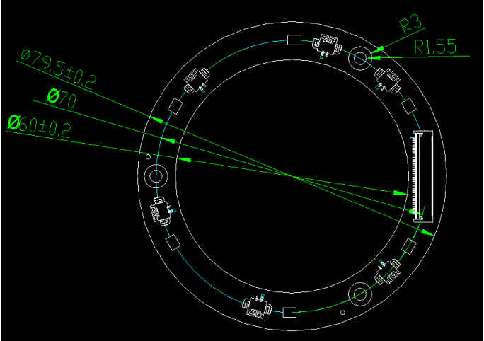
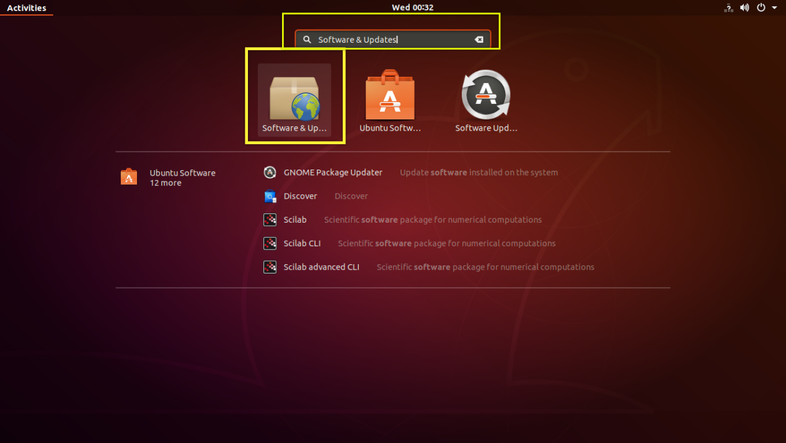
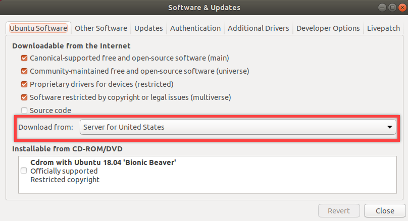
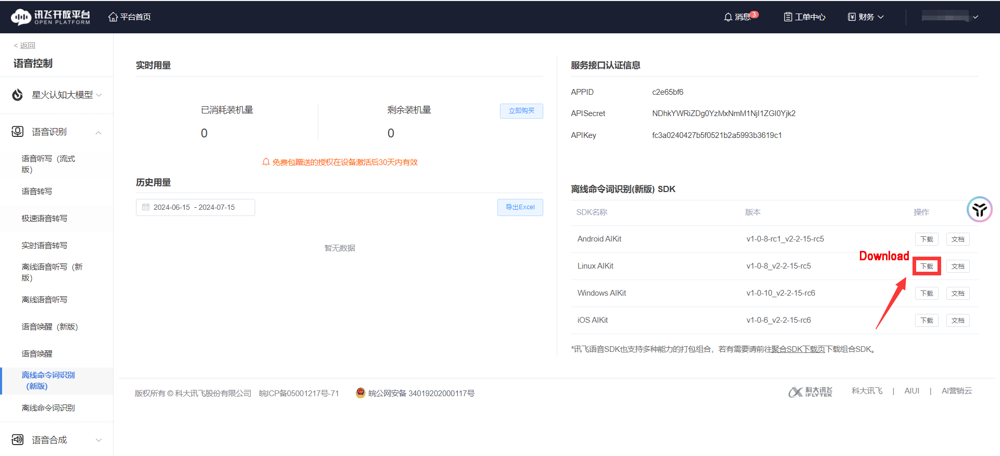

# 9. Voice Control Course

## 9.1 Microphone Array Installation

(1) Fix the 6-Microphone array to the JetArm using four M4\*6 screws.


(2) The image below shows the assembled configuration of the 6-microphone array.


(3) Connect the 6-CH microphone array to USB Port 2 on the controller, as shown below.


## 9.2 Switching Between Chinese and English Wake Words

The system is preconfigured to use the English wake word `"hello hiwonder"` for voice activation.

If you prefer to use a custom command, please follow the steps below:

(1) The robot is equipped with a 6-microphone array.
To change the recognition language, open the configuration tool by double-clicking the `"Tool"` icon on the desktop .
In the tool interface, select your preferred language.


(2) If you are using the `6-microphone array`, select `"xf"` as the microphone type (as shown in the image below).


(3) Click `"Apply & Save"` to confirm and save your settings.


## 9.3 R818 Noise Reduction Board

### 9.3.1 R818 Noise Reduction Board Introduction

The R818 noise reduction board serves as a voice front-end solution featuring a multi-microphone array. Powered by a high-performance quad-core edge computing processor, this module internally incorporates iFLYTEK's voice algorithm. Leveraging the spatial filtering characteristics of the microphone array, it uses angle positioning to awaken individuals. This creates a directional pickup beamforming, suppressing noise outside the beam and enhancing far-field audio pickup quality. Specifically designed for human-machine interaction terminals, it integrates a high-performance echo cancellation algorithm to alleviate the challenges of speech and semantic recognition. Developers can seamlessly integrate this module to empower products with functionalities like multi-microphone audio capture, wake-up, noise reduction, and echo cancellation.

### 9.3.2 R818 Noise Reduction Board Specification

The purpose of the interface on the R818 noise reduction board is outlined below:


| **Interface NO.** | **Name** | **Function** |
|:--:|:--:|:--:|
| **1** | **Serial port** | For PC software communication |
| **2** | **Reference signal port** | Power amplifier/echo cancellation reference signal |
| **3** | **Microphone port** | Connect to 6-channel microphone array |
| **4** | **Independent power port** | Power input port |
| **5** | **UAC port** | Audio output port |

### 9.3.3 R818 Noise Reduction Board Parameter Description

* **Performance Parameter Indicator**

Key parameter:

| **Microphone** | **Sensitivity** | **Signal-to-noise ratio** | **PCB size** | **External port** |
|:--:|:--:|:--:|:--:|:--:|
| SPA1687LR5H-1 | -3dBV/Pa | 65dB | 90mm×50mm×1.2mm | Serial port, UAC port, independent power port, reference signal port and microphone port |

Electrical parameter:

| **Project** | | **Minimum value** | **Classic value** | **Maximum value** |
|:--:|:--:|:--:|:--:|:--:|
| **Working voltage** | DC5V | 4.75V | 5V | 5.25V |
| **Working current** | DC5V | 250mA | 300mA | 400mA |
| **Operating environment** | temperature | -20℃ | 25℃ | 70℃ |
| | relative humidness | / | / | 95% |

* **Structure & Size**

Front view:


Back view:


## 9.4 6-Channel Ring Microphone Array Introduction

### 9.4.1 Introduction to 6-Channel Microphone Array

The 6-Channel Ring Microphone Array is a board designed for microphone pickup, known for its heightened sensitivity and excellent signal-to-noise ratio. It incorporates six analog silicon microphones arranged in a circular pattern. When integrated with the mainboard, it excels in delivering advanced features such as Acoustic Echo Cancellation (AEC), reduction of environmental noise, and factory-level sound pickup capabilities extending up to 10 meters.

### 9.4.2 Ring 6-Channel Microphone Array Specification

The structure of the ring 6-channel microphone array is as below:

Front: Back:

 

(1) Signal interface: connects to R818 noise reduction board.

(2) At the rear, six analog silicon microphones are strategically arranged in a circular pattern to optimize audio reception.


### 9.4.3 6-Channel Ring Microphone Array Parameter

* **Performance Parameter**

Key parameter:

| **Microphone** | **Sensitivity** | **Signal-to-noise ratio** | **PCB size** | **External port** |
|:--:|:--:|:--:|:--:|:--:|
| SPA1687LR5H-1 | -3dBV/Pa | 65dB | 115mm×12mm×1.2mm | Microphone signal port |

Electrical parameter:

| **Parameter** | | **Minimum value** | **Classic value** | **Maximum value** |
|:--:|:--:|:--:|:--:|:--:|
| **Working voltage** | MICBIAS | / | 3.3V | / |
| **Working current** | MICBIAS | / | 0.8mA | 10mA |
| **Working environment** | Temperature | -20℃ | 25℃ | 70℃ |
| | Relative humidness | / | / | 95% |

* **Product Structure & Size**

Front view:



Back view:


## 9.5 Wiring

(1) Please gather the items depicted in the picture below:


(2) Connect the microphone array to the noise reduction board. Be cautious while inserting the connection cable to avoid any forceful insertion that may lead to damage to the port.


(3) Connect the two UAC-to-USB cables to the noise deduction board as below:


(4) Connect the serial port connection cable and UAC cable to the corresponding port on the noise reduction board. First, attach the ring microphone array to the casing. Use the screws to secure it in the three holes highlighted by the red boxes in the image below. Additionally, be sure to align the signal cable connector properly, as shown in the yellow box in the image below.


(5) Next, connect the noise reduction board, which has already been wired, to the corresponding slots in the casing. Pay attention to the orientation of the noise reduction board, as shown in the image below. Use 3M adhesive to secure the signal cable in place, as indicated by the green box in the image.


Tighten the four screws:


(6) Connect the two USB cables to the laptop and run a test to check if the computer recognizes the port numbers. This completes the wiring and installation of the microphone array.


## 9.6 Virtual Machine Installation and Configuration

### 9.6.1 Install VMware Workstation Software

A virtual machine is essentially a computer generated through software emulation, offering a usage experience similar to that of a physical computer. Popular virtual machine software options include VMware Workstation (often called VMware), VirtualBox, Microsoft Virtual PC, and more. In this section, we'll use the example of installing VMware Workstation, initiating, and configuring a virtual machine for explanation.

(1) Extract the virtual machine software package saved in  [Virtual Machine Installation Pack]()

(2) Find the folder where the virtual machine was extracted, and double-click on the virtual machine executable file.


(3) Follow the images below to complete the virtual machine installation.


### 9.6.2 Import Virtual Machine

(1) After entering the virtual machine interface, click on `Open Virtual Machine`.


(2) In the popup window, locate the image file under the directory [`2 Tools\6 Voice Recognition Environment Set Up Tool\6-Channel Microphone Array Image`](). Open the image file (the actual name of the image may vary; this image is for reference only).


(3) After opening, you can change the virtual machine's name and local storage path.


:::{Note}
It takes time to import the image. Please be patient.
:::

(4) After importing, power on this virtual machine.


(5) The virtual machine interface is as pictured.


### 9.6.3 Change Source

:::{Note}
This step matters, and please do not skip. Otherwise, installation package downloading will go wrong due to the internet.
:::

Source functions as APP Store on iOS and Android, where users can download and update.

Ubuntu's default software download server is officially designated. If the files is downloaded slowly or error occurs during downloading, you can switch the software server to other source for downloading.

Take changing into aliyun for example. And you can select the appropriate source based on your country or region.

(1) Click the buttons as pictured to check the network status.


(2) Then search `Software & Updates`, double click the icon to open.




(3) Click `Download from->Other`




(4) Scroll the list to find aliyun server. (China->mirrors.aliyun.com)


(5) If you are not sure which server is suitable, you can click `Select Best Server`. After selection, you are required to input the set password. The initial password is `ubuntu`, then click on `Authenticate`


(6) Finishing authentication, you can click `close`


(7) If the following dialog box pops up, just click `Reload` to update. Then close the page after update.


### 9.6.4 Change Resolution

If you need to change the resolution, follow the instructions to operate.

(1) Open `Settings`, and click search button at the bottom left corner, then input `display`


(2) Select the resolution you want, then follow the pop-up instructions to complete modification.


(3) The final display effect is as follow.


## 9.7 Replace the Voice Resource Package and APPID

### 9.7.1 Apply for offline voice resources and APPID

As the robot utilizes offline voice recognition, you will require offline voice resources available exclusively on the iFLYTEC Chinese website. Please note that you need to switch the language to Chinese and follow the provided instructions for the process.

(1) Enter iFLYTEC website, [https://www.xfyun.cn/](), then click `sign in` to create an account.


(2) Choose `Sign up with phone number`, and fill in the required information. (select corresponding country code)


(3) After registration, click `console->my application` to add new application.


(4) Fill in the required information, and click `Submit`


(5) Open the application you just added.


(6) Click `Voice recognition->Offline voice command recognition (Latest version)`


(7) Download Linux AIKit.




:::{Note}
Each new application offers 90-day free trial, and you will be charged if you continue to use it. When free trial expires, you can add new application again, and each person can only request 5 new applications.
:::

(8) Select the username you created and the Linux platform. After making your choices, select the `Regular Version` below, check `Offline Command Word Recognition` and `Voice Wakeup` options, then click `SDK Download`.


(9) Choose `OK` to start downloading.


### 9.7.2 Replace Offline Voice Resources and ID

(1) Copy the file, then open the virtual machine, right-click on the desktop's blank area, and select "Paste."


(2) Open the Ubuntu system within the virtual machine, and navigate to the path:[`ros_ws/src/xf_mic_asr_offline/config/msc/res/asr/`]() to enter the folder containing offline voice resources. Delete the files highlighted in the red box.


(3) Place the copied files into this folder.


(4) Navigate to the path [`ros_ws/src/xf_mic_asr_offline/launch`](), right-click on the `mic_init.launch` file, and select the highlighted content.


(5) Set the appid in the red box to the appid obtained from iFlytek. After editing, press `Ctrl+C` to save (Note: The offline voice resources must correspond to the appid).


:::{Note}
If overseas users still cannot complete the voice control after following the steps above, please contact our technical support team for guidance.
:::

### 9.7.3 Change User Parameters

After modifying the APPID, if you wish to make changes to the speech recognition threshold, recording duration, wake-up word, or wake-up speech, you can refer to the methods described below.

(1) Locate the folder [`ros_ws/src/xf_mic_asr_offline/launch`](), and right-click `mic_init.launch`, then select `Open With Text Editor`


(2) Set confidence thresholds for speech results and the duration of each voice command entry based on the two parameters highlighted in the red box in the following diagram.


(3) Modify the parameter highlighted in the red box below to change the wake-up word.


English wakeup word format: word1 word2 word3

(4) To change the wakeup language, you can directly change the below parameter.


(5) After modification, press `Ctrl+S` to save the editing.

:::{Note}
If you are unable to complete the voice control of the robot after following the steps above, please contact our technical support team for assistance at [support@hiwonder.com]()
:::

## 9.8 Configure Microphone Port

(1) Start the virtual machine.


(2) Refer to the document in the same directory, under [`5. Replace the Voice Resource Package and APPID`]() to apply for and replace the offline voice resource pack.

(3) Connect the microphone array to the computer. For detailed connection instructions, refer to [`3. Wiring`]().


(4) Connect the device to the virtual machine.


(5) After connecting, press the shortcut key `Ctrl+Alt+T` to open the terminal and enter the command to check the microphone's serial port number, as shown in the red box below:

```
ls /dev/tty*
```


(6) Enter the following command to navigate to the file directory and open the launch file:

```
cd ros_ws/src/xf_mic_asr_offline/launch/
vim mic_init.launch
```


(7) Change the serial port number in the red box to the one obtained in step 5 (`/dev/ttyUSB0`), then save and exit.


(8) Enter the following command to open the rules file, then press Enter and input your password:

```
sudo vim /etc/udev/rules.d/xf_mic.rules
```


(9) Add the following line of code: `ATTRS{idVendor}=="1a86", ATTRS{idProduct}=="7523", MODE="0666"`. This grants permission to the microphone's serial port. Save and exit.

## 9.9 Wake Up the Microphone with a Command

This section explains how to activate the microphone node using a command. After voice activation, the wake-up angle will be displayed in the terminal.

### 9.9.1 Activation Steps

(1) Enter the following command to initialize the six-microphone array node:

```
roslaunch xf_mic_asr_offline mic_init.launch
```


(2) Once initialized, the following content will appear in the terminal. The first startup may take a bit longer, but once completed, the system will be ready.


(3) To wake up the system, simply say "Hello Hiwonder" into the microphone. After activation, the wake-up angle will be displayed in the terminal, as shown below:


(4) To shut down the node, press `Ctrl+C` in the terminal window.


(5) To reopen the microphone node, enter the following command:

```
roslaunch xf_mic_asr_offline mic_init.launch
```


(6) The initial wake-up command is set to `Hello Hiwonder` Just say this command into the six-microphone array to begin.


Once activated, the wake-up angle will appear in the terminal as "259," indicating the direction of the sound source relative to the microphone array. (For more on voice interaction, refer to [`2. Voice Control Application`]())

:::{Note}
If `Hello Hiwonder` is heard but the microphone array does not respond, re-enter the command to "Start the six-microphone ROS node" (there's no need to unplug the microphone).
:::

### 9.9.2 Change Wake-up Voice Command

(1) Navigate to the following path, right-click the `mic_init.launch` file, and select the option shown in the red box:

[`ros_ws/src/xf_mic_asr_offline/launch`]()


(2) Find the content highlighted in the red box in the image below.


The syntax for English wake-up words: "word1 word2 word3 ...".

(3) For example, to modify the Chinese wake-up words, change "xiao3 huan4 xiao3 huan4" to "ping2 guo3 ping2 guo3".


(4) After making the changes, press `Ctrl+S` to save.

(5) Then enter the following command to activate the voice wake-up:

```
roslaunch xf_mic_asr_offline mic_init.launch
```


:::{Note}
If `ping2 guo3 ping2 guo3` is successfully recognized but there is no response from the six-microphone array, please restart the "six-microphone array ROS node" (no need to unplug and replug the microphone).
:::

### 9.9.3 FAQ

* **10108 Error Code**

Initiating the initialization service for the 6-channel microphone array multiple times may lead to the problem shown in the following image. However, this issue does not impact functionality. To restore normal operation, just repeat the wake-up words `Hello Hiwonder`


* **Solution for Unable to Find the Microphone Device**

:::{Note}
If you encounter the "Microphone device not found" error, please follow the steps below to install the microphone driver.
:::

(1) Enter the following command and press Enter to navigate to the directory containing the driver:

```
cd ros_ws/src/CH341SER_LINUX/driver/
```


(2) Then, enter the following command to compile the driver:

```
make
```


(3) Enter the command to load the driver:

```
sudo make load
```


(4) Install the driver to the system with the following command:

```
sudo make install
```


(5) Once the driver is installed, restart the microphone node by entering the command:

```
roslaunch xf_mic_asr_offline mic_init.launch
```


## 9.10 Voice Control Application

### 9.10.1 Replace the Voice Resource Package and APPID

* **Apply for offline voice resources and APPID**

As the robot utilizes offline voice recognition, you will require offline voice resources available exclusively on the iFLYTEC Chinese website. Please note that you need to switch the language to Chinese and follow the provided instructions for the process.

(1) Enter iFLYTEC website, [https://www.xfyun.cn/](), then click `sign in` to create an account.


(2) Choose `Sign up with phone number`, and fill in the required information. (select corresponding country code)


(3) After registration, click `console->my application` to add new application.


(4) Fill in the required information, and click `Submit`


(5) Open the application you just added.


(6) Click `Voice recognition->Offline voice command recognition (Latest version)`


(7) Download Linux AIKit.


:::{Note}
Each new application offers 90-day free trial, and you will be charged if you continue to use it. When free trial expires, you can add new application again, and each person can only request 5 new applications.
:::

(8) Select the username you created and the Linux platform. After making your choices, select the `Regular Version` below, check `Offline Command Word Recognition` and `Voice Wakeup` options, then click `SDK Download`.


(9) Choose `OK` to start downloading.


* **Replace Offline Voice Resources and ID**

:::{Note}
In this section, the terminal and are used in different environment. Do not use them wrongly!
:::

(1) Extract the compressed file in the downloaded materials.


:::{Note}
You need to locate the relevant file according to the download path.
:::

(2) Locate the extracted folder named "Linux_aitalk_exp1227_21***8f"(where "218f" is the version ID and may vary depending on the official website.) Navigate to the \bin\msc\res\asr folder and find the file named common.jet. Drag this file to the desktop of the virtual machine.


(3) Click to open the command-line terminal, and delete the old files insider the Docker container by entering the command:

```
rm -rf ~/jetarm/src/xf_mic_asr_offline/config/msc/res/asr/common.jet
```


(4) Click to open the command-line terminal, and replace the file inside the Docker container by entering the command:

```
sudo docker cp ~/Desktop/common.jet jetarm:/home/ubuntu/jetarm/src/xf_mic_asr_offline/config/msc/res/asr/common.jet
```


(5) Back to terminal, and enter the following command to edit the initialization content:

```
gedit ~/jetarm/src/xf_mic_asr_offline/launch/mic_init.launch
```


(6) Assign the appid within the red box below with the appid obtained from iFLYTEC website. Finally, press `Ctrl+S` to save the file.


## 9.11 Voice-Controlled Color Sorting

This lesson involves controlling the robot to initiate the sorting of specified color blocks through voice commands. Once the corresponding color block is recognized, the robot will place it in the designated position.

### 9.11.1 Preparation

(1) Please ensure the microphone array, sound card and speaker are connected to the corresponding port of USB hub.

(2) Please calibrate the position of the robot arm before starting the voice-controlled color sorting function. To get detailed instruction, please refer to [`4.5 Position Calibration`]()

(3) Confirm that the `APPID` in the configuration file has been modified and the `Common.jet` file has been replaced. You can refer to the document section 1 [`9.10.1 Replace the Voice Resource Package and APPID`]() for the application of APPID and file replacement process.

### 9.11.2 Program Flow

(1) First, subscribe to the speech recognition service provided by the microphone array node. Perform operations such as localization, noise reduction, and speech recognition on the acquired audio to obtain recognized sentences and the angle of the sound source.

Then, successfully wake up the robot and, upon uttering specific phrases, the robot will deliver corresponding verbal feedback.

Finally, issue the relevant command to initiate or stop the sorting of color blocks based on the command.

(2) The color block sorting is triggered by the `object_sorting.launch` file within the `jetarm_6dof_app` package. The target sorting game of the app is primarily divided into three parts: ROI region delineation, color recognition, and sorting.

Firstly, in ROI region delineation, a specific region (ROI) is selected within the camera's field of view. Within this area, color recognition is performed on the specified colors, as indicated by the yellow frame seen in the live camera feed after initiating the game.

:::{Note}
ROI stands for Region of Interest. In image processing, it refers to outlining the area that needs to be processed using boxes, circles, ellipses, or other shapes in the processed image.
:::

In the color recognition section, the process commences with Gaussian filtering to reduce noise in the image. Subsequently, the Lab color space is employed to transform the color of objects (for a more in-depth understanding of this aspect of the Lab color space, please refer to the [`4.1 Positioning & Gripping`]()).

Following this, color thresholding is applied to identify the color of objects within the bounding box. Then, a mask is applied to specific parts of the image, where the mask is used to globally or locally obscure the processed image using selected images, graphics, or objects.

After applying opening and closing operations to the images of the objects, the final step includes outlining the object with the largest contour using a circle.

Upon recognizing a specific color, the robotic arm descends to a designated position, grasps the color block, and then positions it in the specified location.

The program source code is located at:

[`/home/ubuntu/jetarm/src/xf_mic_asr_offline/scripts/voice_control_sorting.py`]()


### 9.11.3 Operation Steps

:::{Note}
1. The input command must be case-sensitive, and keywords can be supplemented using the Tab key.
2. Ensure that items in the vicinity, especially those with similar colors to the target object, are excluded to avoid impacting the accuracy of the recognition result.
3. In case of an incorrect recognition result, follow the instructions provided in [`1.6 Color Threshold Setting`]() to adjust the color threshold for a more accurate outcome.
:::

(1) Start the robot, and access the remote desktop using NoMachine.

(2) Double-click to open the command-line terminal. Then execute the following command to disable the auto-start service.

```
~/.stop_ros.sh
```

(3) To ensure proper functionality, it is essential to run the microphone activation file after the initial use of the voice control feature or when modifying the wake-up word. Failure to do so may result in the microphone not functioning correctly.

Open the terminal, and run this command.

```
roslaunch xf_mic_asr_offline mic_init.launch enable_setting:=true
```

The terminal will display pertinent prompts. During the initial activation, a 30-second wait is required. Once the terminal prints the designated wake-up word, for instance, `Wake up word: xiao3 huan4 xiao3 huan`, you can proceed to speak the wake-up word to activate the microphone.


Press `Ctrl+C` to exit after activating the wake-up word.

(4) Execute the following command to run the game.

```
roslaunch xf_mic_asr_offline voice_control_color_sortting.launch
```

(5) Speak the wake-up word (default is "Hello Hiwonder"), then subsequently issue the command to initiate color sorting.

(6) If you need to access the live camera feed, open a new terminal, and execute the following command to open the visualization tool.

```
rqt_image_view
```

(7) Simply select the channel `/object_sortting/image_result` for color recognition and sorting.


(8) If you need to terminate the running program, use short-cut `Ctrl+C`

(9) Following the above function, it is essential to enable the app service; otherwise, the app functions may be impacted.

```
sudo systemctl start start_app_node.service
```

(10) After the service is initiated successfully, the robot will emit a beeping sound.

### 9.11.4 Program Outcome

To initiate the game, begin by speaking the wake-up word, followed by the command statement to activate color block sorting. For example, saying the wake-up word "Hello Hiwonder" and then issuing the command `Sort red` will prompt the terminal to display the sorting color. Subsequently, it will commence recognizing color blocks within a specific area. Once the corresponding color block is identified, it will be captured and placed in the designated location.

The wake-up word and control commands are outlined below:

| Wake-up Command | Control Command | Outcome |
|:--:|:--:|:--:|
| Hello Hiwonder | Sort red | Place the red block to red sorting area |
| | Sort green | Place the green block to green sorting area |
| | Sort blue | Place the blue block to blue sorting area |
| | Stop sorting/ Stop color sorting | Stop color sorting |

### 9.11.5 launch File Analysis

This content specifically delves into the intricacies of voice wake-up and voice control. For a thorough grasp of color sorting, it is recommended to refer to the pertinent course.

Voice-controlled color tracking involves establishing connections among the voice control node, camera node, robotic arm control node, and color sorting node. Commands issued through voice control the robot's initiation or termination of this game.

The launch file for this process can be located at:

[`/home/ubuntu/jetarm/src/xf_mic_asr_offline/launch/voice_control_color_sorrting.launch`]()

* **Define Basic Environment Setup**

{lineno-start=1}
```python
import os
from ament_index_python.packages import get_package_share_directory
```

{lineno-start=10}
```python
def launch_setup(context):
    compiled = os.environ['need_compile']
    start = LaunchConfiguration('start', default='true')
    start_arg = DeclareLaunchArgument('start', default_value=start)
    display = LaunchConfiguration('display', default='true')
    display_arg = DeclareLaunchArgument('display', default_value=display)
    mic_type = os.environ['MIC_TYPE']

    if compiled == 'True':       
        example_package_path = get_package_share_directory('example')
        xf_mic_asr_offline_package_path = get_package_share_directory('xf_mic_asr_offline')
    else:
        example_package_path = '/home/ubuntu/ros2_ws/src/example'
        xf_mic_asr_offline_package_path = '/home/ubuntu/ros2_ws/src/xf_mic_asr_offline'
```

The environment variables `compiled` and `mic_type` are used to determine the package path and microphone type configuration.

* **Set Microphone Launch Configuration**

{lineno-start=24}
```python
    if mic_type == 'xf':

        mic_launch = IncludeLaunchDescription(
            PythonLaunchDescriptionSource(
                os.path.join(xf_mic_asr_offline_package_path, 'launch/mic_init.launch.py')),
        )
    else:
        mic_launch = IncludeLaunchDescription(
            PythonLaunchDescriptionSource(
                os.path.join(xf_mic_asr_offline_package_path, 'launch/wonderechopro_init.launch.py')),
        )
```

This section determines which microphone initialization launch file to use based on the microphone type.

* **Include Color Sorting Node Launch**

{lineno-start=36}
```python
    color_sorting_node_launch = IncludeLaunchDescription(
        PythonLaunchDescriptionSource(
            os.path.join(example_package_path, 'example/opencv/color_sorting_node.launch.py')),
        launch_arguments={
            'broadcast': 'true',
        }.items(),
    )
```

The `<include>` tag is used here to import the color sorting launch file. This activates the color sorting functionality with broadcast mode enabled.

* **Initialize Voice Control Node**

{lineno-start=44}
```python
    voice_control_color_sorting_node = Node(
        package='xf_mic_asr_offline',
        executable='voice_control_color_sorting.py',
        output='screen',
    )
```

Start the source code program for voice control using the node `voice_control_color_sorting_node`.

Within the file, `Node` denotes the launched node, with `package` indicating the package containing the node, `executable` specifying the executable file, and `output` designating the output target—here, the screen.

### 9.11.6 Python Source Code Analysis

This content primarily explains the components of voice wake-up and voice control. For information on color sorting, please refer to the respective course for a detailed understanding.

The Python source code for this game is located at:

[`/home/ubuntu/jetarm/src/xf_mic_asr_offline/scripts/voice_control_color_sortting.py`]()

The program flowchart is as below:


As indicated in the diagram, the program's logic revolves around obtaining voice information and executing voice commands. The subsequent content will further clarify this logic using the provided diagram.

* **Import Function Package**

Import the required module using the import statement.

{lineno-start=4}
```python
import os
import json
import rclpy
from rclpy.node import Node
from std_msgs.msg import String
from interfaces.srv import SetStringBool
from std_srvs.srv import Trigger, SetBool
from xf_mic_asr_offline import voice_play
from rclpy.executors import MultiThreadedExecutor
from ros_robot_controller_msgs.msg import BuzzerState
from rclpy.callback_groups import ReentrantCallbackGroup
```

The `os` library acts as an interface for diverse interactions between Python programs and the operating system.

The `json` library in Python provides a straightforward interface for retrieving relevant data directly from JSON.

The `std_msgs.msg` library imports the String message type from the ROS `std_msgs` package, facilitating the handling of string data.

The `std_srvs.srv` library is employed to define and utilize standard service messages.

The `xf_mic_asr_offline` library serves as the microphone library, used for invoking microphone functions and receiving audio information.

The `interfaces.srv` library is utilized for invoking interface functions.

* **Initiate Voice Controlled Color Sorting**

Initiate the `VoiceControlColorSortingNode` class and name the sorting node `voice_control_color_sorting`.

{lineno-start=16}
```python
class VoiceControlColorSortingNode(Node):
    def __init__(self, name):
        rclpy.init()
        super().__init__(name, allow_undeclared_parameters=True, automatically_declare_parameters_from_overrides=True)
```

* **Initialize Function**

{lineno-start=21}
```python
        self.running = True
        self.language = os.environ['ASR_LANGUAGE']
        timer_cb_group = ReentrantCallbackGroup()
        self.buzzer_pub = self.create_publisher(BuzzerState, '/ros_robot_controller/set_buzzer', 1)
        self.create_subscription(String, '/asr_node/voice_words', self.words_callback, 1, callback_group=timer_cb_group)

        self.client = self.create_client(Trigger, '/asr_node/init_finish')
        self.client.wait_for_service()
        self.client = self.create_client(Trigger, '/object_sorting/init_finish')
        self.client.wait_for_service()    
        self.set_target_client = self.create_client(SetStringBool, '/object_sorting/set_target', callback_group=timer_cb_group)
        self.set_target_client.wait_for_service()

        self.timer = self.create_timer(0.0, self.init_process, callback_group=timer_cb_group)
```

The `rclpy.init()` initializes the ROS node and relevant variables.

The `self.language` sets the language for the game.

`create_subscription` subscribes to information from the voice recognition node `/asr_node/voice_words` and calls the callback function `words_callback()` to obtain the recognized speech information.

`wait_for_service` indicates waiting for the service to run.

`create_client` represents the published service and its type.

* **play() Voice Response Function**

Through the play() function, the name, language, and format of the voice file are specified.

{lineno-start=51}
```python
    def play(self, name):
        voice_play.play(name, language=self.language)
```

* **words_callback() Callback Function**

Using the callback function, the voice command is processed and matched to determine the appropriate robot action.

{lineno-start=60}
```python
    def words_callback(self, msg):
        words = json.dumps(msg.data, ensure_ascii=False)[1:-1]
        if self.language == 'Chinese':
            words = words.replace(' ', '')
```

① Utilize the json.dumps() function to convert a Python data structure into a JSON string, streamlining network transmission.

{lineno-start=65}
```python
        if words is not None and words not in ['唤醒成功(wake-up-success)', '休眠(Sleep)', '失败5次(Fail-5-times)',
                                               '失败10次(Fail-10-times']:
```

② Voice command evaluation. Verify that the voice command is not empty and does not match commands such as `wake-up-success`, `Sleep`, `Fail-5-times`, `Fail-10-times`, etc.

{lineno-start=67}
```python
            if words == '分拣红色' or words == 'sorting red object':
                self.play('start_sort_red')
                req = SetStringBool.Request()
                req.data_bool = True
                req.data_str = 'red'
                res = self.send_request(self.set_target_client, req)
```

③ Take sorting red as example.

First, check if the voice command is either `分拣红色` or `sorting red object`.

If so, use the play() function to play the voice response for sorting red.

Invoke the `send_request()` function to set the color target in the `/object_sorting/set_target` color sorting node to True for red.

{lineno-start=88}
```python
            elif words == '关闭颜色分拣' or words == 'stop color sorting':
                target_list = ["red", "green", "blue"]
                req = SetStringBool.Request()
                req.data_bool = False
                for i in target_list:
                    req.data_str = i
                    res = SetBool.Response()
                    res = self.send_request(self.set_target_client, req)
                self.play('stop_sort')
```

④ For stopping color sorting, iterate through all color targets and disable them.

## 9.12 Voice Controlled Color Tracking

In this lesson, we explore the control of the robotic arm through voice commands for tracking specific colors. Once the target color is identified, the robotic arm will dynamically follow its movement.

### 9.12.1 Preparation

(1) Before commencing this lesson, make sure to install the microphone array module, sound card, and speaker onto the robot (skip if already installed) and connect them to the USB ports on the hub.

(2) Verify that the configuration file has been updated with the correct `APPID`, and replace the `Common.jet` file accordingly. Refer to section 1 [`Replace the Voice Resource Package and APPID`]() for instructions on obtaining the APPID and replacing the file.

### 9.12.2 Program Flow

Firstly, subscribe to the speech recognition service published by the microphone array node. After performing operations such as localization, noise reduction, and recognition on the speech, obtain the recognized statement and the angle of the sound source.

Next, wake up the robot with a specific wake-up word. After saying the wake-up word, the robot will provide corresponding voice feedback in response.

Finally, publish the relevant command, and the robot will track the specified color based on the command.

The implementation of target tracking can be divided into two parts: color recognition and tracking.

In the color recognition part, start with Gaussian filtering (to reduce noise in the image) and convert the color of the object using the Lab color space (for detailed learning about the Lab color space, refer to the course [`7. ROS+OpenCV Course/1. Positioning & Gripping`]()).

Then, use color thresholds to identify the color of the object in the box, followed by masking part of the image (masking involves obscuring the processed image globally or locally using a selected image, shape, or object).

After applying opening and closing operations to the item image, encircle the object with the largest contour.

For the tracking part, employ the PID algorithm. Compare the pixel coordinates of the target with the center coordinates of the frame, reducing the distance between the two coordinates to achieve target tracking.

For learning about the PID algorithm, refer to [`7. ROS+OpenCV Course\2. Target Tracking`]()

### 9.12.3 Operation Steps

:::{Note}
1. The input commands are case-sensitive, and keywords can be supplemented using the Tab key.
2. Exclude nearby items, especially those with colors similar to the target object, to enhance the accuracy of the recognition result.
3. Avoid moving the block too quickly to prevent losing the target.
4. If there is an incorrect recognition result, refer to the instructions in [`1. Getting Ready/ JetArm User Manual/ 6. Color Threshold Setting`]() to adjust the color threshold for a more precise outcome.
:::

(1) Start the robot, and access the remote desktop using NoMachine. For detailed instruction, please refer to the file saved in [`1. Getting Ready/ JetArm User Manual/ 6. Color Threshold Setting`]()

(2) Click-on to open the command line terminal.

(3) Double-click to open the command-line terminal. Execute the below command to disable auto-start service.

```
~/.stop_ros.sh
```

(4) For the first time using the voice control feature or when modifying the wake-up word, it is necessary to execute the microphone activation file to enable the wake-up word. Otherwise, the microphone will not function properly.

Open the terminal, and execute the following command.

```
roslaunch xf_mic_asr_offline mic_init.launch enable_setting:=true
```

The terminal will print relevant prompts, and for the initial activation, it is necessary to wait for 30 seconds. When the terminal prints the corresponding wake-up word, such as `Wake up word: xiao3 huan4 xiao3 huan`, you can then speak the wake-up word to activate the microphone.


(5) Run the following command and press Enter to start the game.

```
roslaunch xf_mic_asr_offline voice_control_color_track.launch
```

(6) If you need to access the live camera feed, you need to open a new terminal, and execute the below command to open the visualization tool.

```
rqt_image_view
```

(7) Choose the color recognition and sorting topic `/object_tracking/image_result`


(8) If you need to terminate the running program, use short-cut `Ctrl+C`

(9) Following the above function, it is essential to enable the app service; otherwise, the app functions may be impacted. Execute the below command.

```
sudo systemctl start start_app_node.service
```

(10) After the service is initiated successfully, the robot arm will recover the initial pose, and the buzzer will emit a beeping sound.

### 9.12.4 Program Outcome

After initiating the game, start by saying the wake-up word `Hello Hiwonder` followed by the tracking command to enable the robot to start color tracking.

This game allows tracking of colors such as red, green, and blue. Taking red as an example, place a red block within the camera's field of view. Utter the wake-up word `Hello Hiwonder` and then issue the tracking command `track red`.

Subsequently, when a red color block is identified, the robotic arm will rotate its servo to align the depth camera with the red block. Moving the color block will trigger corresponding left, right, up, and down movements of the robotic arm.

To stop the robot from tracking colors, simply say the wake-up word `Hello Hiwonder` followed by the command `Stop tracking`.

The wake-up word and control commands are as follows:

| Wake-up Command | Control Command | Outcome |
|:--:|:--:|:--:|
| Hello Hiwonder | Track red | Track the movement of red block |
| | Track green | Track the movement of green block |
| | Track blue | Track the movement of blue block |
| | Stop tracking | Stop color tracking |

### 9.12.5 Launch File Analysis

This content primarily explains the aspects of voice wake-up and voice control. For information on color tracking, please consult the relevant section for a comprehensive understanding.

Voice-controlled color tracking involves establishing connections among the voice control node, camera node, robotic arm control node, and color tracking node. Commands issued through voice control the initiation or termination of this game by the robot.

You can find the launch file for this process at:

[`/home/ubuntu/jetarm/src/xf_mic_asr_offline/launch/voice_control_color_track.launch`]()

* **Define Basic Environment Setup**

{lineno-start=1}
```python
import os
from launch_ros.actions import Node
from launch.substitutions import LaunchConfiguration
from launch import LaunchDescription, LaunchService
from ament_index_python.packages import get_package_share_directory
from launch.launch_description_sources import PythonLaunchDescriptionSource
from launch.actions import IncludeLaunchDescription, DeclareLaunchArgument, OpaqueFunction
```

{lineno-start=9}
```python
def launch_setup(context):
    compiled = os.environ['need_compile']
    mic_type = os.environ['MIC_TYPE']

    if compiled == 'True':       
        example_package_path = get_package_share_directory('example')
        xf_mic_asr_offline_package_path = get_package_share_directory('xf_mic_asr_offline')
    else:
        example_package_path = '/home/ubuntu/ros2_ws/src/example'
        xf_mic_asr_offline_package_path = '/home/ubuntu/ros2_ws/src/xf_mic_asr_offline'
```

The environment variables `compiled` and `mic_type` are used to determine the package path and microphone type configuration.

* **Set Color Tracking Parameters**

{lineno-start=20}
```python
    color_track_node_launch = IncludeLaunchDescription(
        PythonLaunchDescriptionSource(
            os.path.join(example_package_path, 'example/opencv/color_track_node.launch.py')),
        launch_arguments={
            'broadcast': 'true',
        }.items(),
    )
```

The parameter `broadcast` is set to True to enable color tracking functionality with broadcast mode.

* **Launch Multiple Files**

{lineno-start=28}
```python
    if mic_type == 'xf':
        mic_launch = IncludeLaunchDescription(
            PythonLaunchDescriptionSource(
                os.path.join(xf_mic_asr_offline_package_path, 'launch/mic_init.launch.py')),
        )
    else:
        mic_launch = IncludeLaunchDescription(
            PythonLaunchDescriptionSource(
                os.path.join(xf_mic_asr_offline_package_path, 'launch/wonderechopro_init.launch.py')),
        )
```

The `<include>` tag is used here to import other launch files within the current file. When this file is launched, it simultaneously starts the included launch files.

Here, it primarily initiates the foundational control for the robotic arm, target tracking, and the initialization node for the microphone.

* **Invoke Voice Control Source Code Program**

{lineno-start=39}
```python
    voice_control_color_track_node = Node(
        package='xf_mic_asr_offline',
        executable='voice_control_color_track.py',
        output='screen',
    )
```

Through the node `voice_control_color_track_node`, the source code program for voice control is initiated.

In the file, `Node` signifies the launched node, where `package` indicates the package containing the node, `executable` specifies the executable file, and `output` designates the target for output, in this case, the screen.

### 9.12.6 Python Source Code Analysis

This content focuses on detailing voice wake-up and voice control aspects. For insights into color tracking, please consult the relevant section for a comprehensive understanding.

The Python source code for this game is located at:

[`/home/ubuntu/jetarm/src/xf_mic_asr_offline/scripts/voice_control_color_track.py`]()

The program flowchart is as below:


Judging from the diagram, the program's logic primarily involves acquiring voice information and executing voice commands.

* **Import Function Package**

Import the required module using the import statement.

{lineno-start=5}
```python
import os
import json
import rclpy
from rclpy.node import Node
from std_msgs.msg import String
from interfaces.srv import SetFloat64
from std_srvs.srv import Trigger, SetBool
from xf_mic_asr_offline import voice_play
from rclpy.executors import MultiThreadedExecutor
from ros_robot_controller_msgs.msg import BuzzerState
from rclpy.callback_groups import ReentrantCallbackGroup
```

The `os` library acts as an interface for diverse interactions between Python programs and the operating system.

The `json` library in Python provides a straightforward interface for retrieving relevant data directly from JSON.

The `std_msgs.msg` library imports the String message type from the ROS `std_msgs` package, facilitating the handling of string data.

The `std_srvs.srv` library is employed to define and utilize standard service messages.

The `xf_mic_asr_offline` library serves as the microphone library, used for invoking microphone functions and receiving audio information.

The `interfaces.srv` library is utilized for invoking interface functions.

* **Initiate Voice Controlled Color Tracking**

Initiate the `VoiceControlColorTrackNode` class, and name the sorting node as `voice_control_color_track`

{lineno-start=17}
```python
class VoiceControlColorTrackNode(Node):
    def __init__(self, name):
        rclpy.init()
        super().__init__(name, allow_undeclared_parameters=True, automatically_declare_parameters_from_overrides=True)
```

* **Initialization Function**

{lineno-start=22}
```python
        self.language = os.environ['ASR_LANGUAGE']
        timer_cb_group = ReentrantCallbackGroup()
        self.buzzer_pub = self.create_publisher(BuzzerState, '/ros_robot_controller/set_buzzer', 1)
        self.create_subscription(String, '/asr_node/voice_words', self.words_callback, 1, callback_group=timer_cb_group)
        self.client = self.create_client(Trigger, '/asr_node/init_finish')
        self.client.wait_for_service()
        self.client = self.create_client(Trigger, '/object_tracking/init_finish')
        self.client.wait_for_service()
        self.start_client = self.create_client(SetBool, '/object_tracking/enable_color_tracking')
        self.start_client.wait_for_service()
        self.set_color_client = self.create_client(SetFloat64, '/object_tracking/set_target_color', callback_group=timer_cb_group)
        self.set_color_client.wait_for_service()

        self.timer = self.create_timer(0.0, self.init_process, callback_group=timer_cb_group)
```

`rclpy.init()`: Initializes the ROS node and related variables.

`self.language`: Sets the language for the game.

`create_subscription`: Subscribes to the information from the voice recognition node `/asr_node/voice_words` and calls the callback function `words_callback()` to obtain the recognized voice information.

`wait_for_service`: Indicates waiting for the service to be operational.

`create_client`: Represents the published service and its type.

* **play() Voice Response Function**

Define the name, language and format of the voice file using play() function.

{lineno-start=51}
```python
    def play(self, name):
        voice_play.play(name, language=self.language)
```

* **words_callback() Callback Function**

Match the voice command issued, determine the command with the highest match, and instruct the robot to track the corresponding color block.

{lineno-start=60}
```python
    def words_callback(self, msg):
        words = json.dumps(msg.data, ensure_ascii=False)[1:-1]
        if self.language == 'Chinese':
            words = words.replace(' ', '')
        if words is not None and words not in ['唤醒成功(wake-up-success)', '休眠(Sleep)', '失败5次(Fail-5-times)',
                                               '失败10次(Fail-10-times']:
```

① Utilize the json.dumps() function to convert a Python data structure into a JSON string, streamlining network transmission.

② Voice command evaluation. Verify that the voice command is not empty and does not match commands such as "wake-up-success," "Sleep," "Fail-5-times," "Fail-10-times," etc.

{lineno-start=66}
```python
            if words == '追踪红色' or words == 'track red object':
                req = SetFloat64.Request()
                req.data = 1.0
                res = self.send_request(self.set_color_client, req)
                if res.success:
                    self.play('start_track_red')
                else:
                    self.play('track_fail')
```

③ Take tracking red as example.

Firstly, check if the voice command is `追踪红色` or `track red object`. If it is, invoke the `send_request()` function to set the target color for color tracking to 1.0 (red) [2.0 and 3.0 correspond to green and blue, respectively].

Use the play() function to play the voice response for tracking red color.

{lineno-start=90}
```python
            elif words == '停止追踪' or words == 'stop tracking':
                req = SetBool.Request()
                req.data = False
                res = self.send_request(self.start_client, req)
                if res.success:
                    self.play('stop_track')
                else:
                    self.play('stop_fail')
```

④ For stopping tracking, disable the color tracking service and provide appropriate voice feedback.

{lineno-start=98}
```python
        elif words == '唤醒成功(wake-up-success)':
            self.play('awake')
        elif words == '休眠(Sleep)':
            msg = BuzzerState()
            msg.freq = 1900
            msg.on_time = 0.05
            msg.off_time = 0.01
            msg.repeat = 1
            self.buzzer_pub.publish(msg)
```

⑤ Handle special wake-up and sleep commands with appropriate audio feedback.